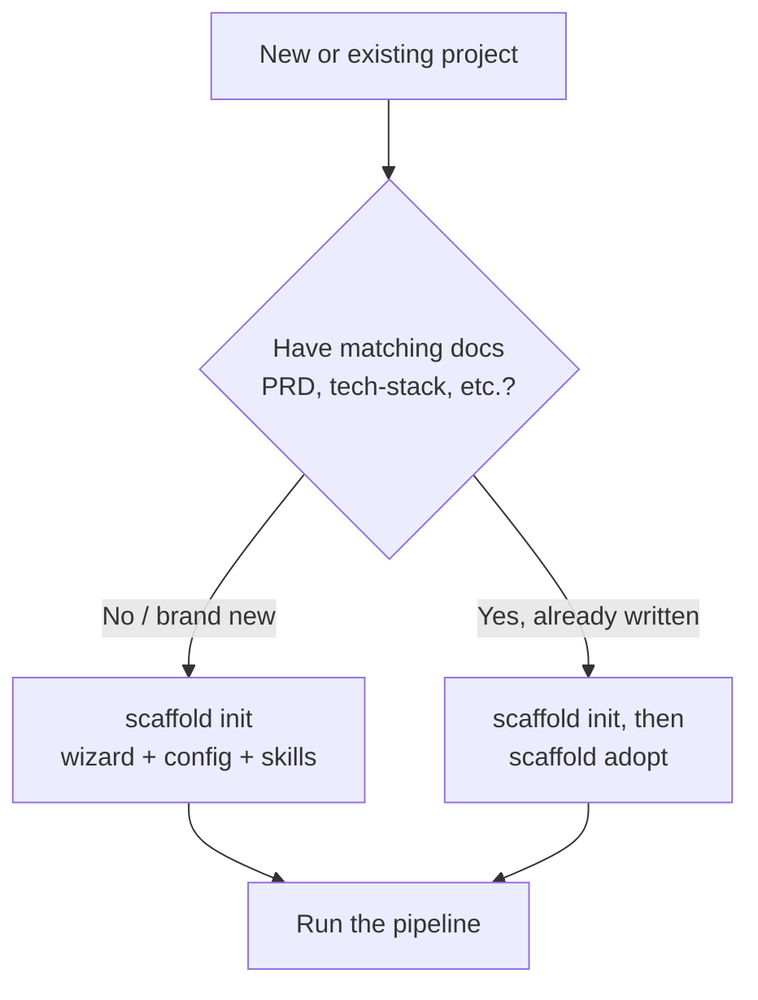

## Overview

Scaffold ships as one tool with two install surfaces: the **`scaffold` CLI**
(distributed on npm as `@zigrivers/scaffold` and via Homebrew) and an optional
**Claude Code plugin** that auto-activates the runner and pipeline-reference
skills. The CLI is the core; the plugin only adds interactive guidance on top of
it. The published npm package exposes the single `scaffold` binary
(:cite[package.json:37]) and bundles the compiled CLI plus the pipeline content,
knowledge entries, and skills (:cite[package.json:27]).

This guide is for **users** installing, updating, and bootstrapping projects.
Maintainers releasing Scaffold itself follow a separate flow in
`docs/architecture/operations-runbook.md` :cite[docs/architecture/operations-runbook.md:326]{mode=advisory}.

:::callout{type=note}
**Prerequisite — Node.js 18.17+.** The CLI requires Node.js `>=18.17.0`
(:cite[package.json:34]). The Homebrew formula bundles its own runtime; the npm
install uses your system Node.
:::

## Installing

Pick one of the three surfaces below. The npm and Homebrew tabs install the CLI;
the plugin tab adds the optional Claude Code skills on top.

::::tabs
:::tab{title=npm}
```bash
npm install -g @zigrivers/scaffold
```
Verify with `scaffold version`. This is the recommended path — it uses your
system Node and updates with `npm update -g`.
:::
:::tab{title=Homebrew}
```bash
brew tap zigrivers/scaffold
brew install scaffold
```
The formula bundles a runtime, so no separate Node install is needed. Verify
with `scaffold version`.
:::
:::tab{title=Claude Code plugin}
Inside a Claude Code session:
```text
/plugin marketplace add zigrivers/scaffold
/plugin install scaffold@zigrivers-scaffold
```
This is **optional** and complements the CLI — it auto-activates the Scaffold
Runner and pipeline-reference skills for interactive guidance. Everything the
plugin does is also reachable via `scaffold run <step>`. CLI-only users don't
need it: `scaffold init` installs the skills automatically and later CLI
commands keep them current.
:::
::::

## Keeping current

Check what you have and whether a newer release exists with `scaffold version`
(or `scaffold update --check-only`); both query the npm registry for the latest
`@zigrivers/scaffold` (:cite[src/cli/commands/version.ts:93]). `scaffold update`
detects how you installed and prints the right upgrade command rather than
running the install for you — Homebrew installs map to `brew upgrade scaffold`
(:cite[src/cli/commands/update.ts:47]), npm-global installs to
`npm update -g @zigrivers/scaffold` (:cite[src/cli/commands/update.ts:51]), and
anything else falls back to `npx @zigrivers/scaffold@latest`
(:cite[src/cli/commands/update.ts:55]).

Run the upgrade for your channel:

::::tabs
:::tab{title=npm}
```bash
npm update -g @zigrivers/scaffold
```
:::
:::tab{title=Homebrew}
```bash
brew update && brew upgrade scaffold
```
:::
:::tab{title=Claude Code plugin}
```text
/plugin marketplace update zigrivers-scaffold
```
:::
::::

:::callout{type=danger}
**Homebrew: run `brew update` *before* `brew upgrade`.** `brew outdated` and
`brew upgrade` both read from the local tap cache. Without a preceding
`brew update`, the cache stays stale and a freshly-published release reports
"already installed" / nothing-outdated even though a newer formula is live on
GitHub. Always upgrade with `brew update && brew upgrade scaffold`
:cite[docs/architecture/operations-runbook.md:326]{mode=advisory}.
:::

After upgrading the CLI, run `scaffold status` inside any existing project. The
state manager auto-migrates old step keys, drops retired steps, and normalizes
artifact paths — no manual editing of `.scaffold/state.json` is needed.

## Starting fresh vs. adopting

Both `scaffold init` and `scaffold adopt` operate on the current project
directory. Use **`init`** to set up a project from scratch and **`adopt`** to
bootstrap pipeline state from documentation you already have.



### `scaffold init`

`scaffold init` initializes Scaffold for the current project
(:cite[src/cli/commands/init.ts:152]): it runs a wizard, writes `.scaffold/`
config and state, and installs the skills. The wizard detects whether the
directory is brand new or already has code and suggests a methodology preset
(`mvp`, `deep`, or `custom`) accordingly. To re-initialize a project that
already has a `.scaffold/` directory, pass `--force` — it backs up the existing
state before reinitializing (:cite[src/cli/commands/init.ts:157]).

### `scaffold adopt`

`scaffold adopt` adopts an existing project into Scaffold
(:cite[src/cli/commands/adopt.ts:168]). It classifies the project as
`greenfield`, `brownfield`, or `v1-migration`
(:cite[src/project/adopt.ts:72]), discovers which pipeline outputs (PRD,
tech-stack, coding-standards, etc.) you already have on disk, and marks the
corresponding steps complete so you don't re-run work you've already done.
Preview the changes first with `--dry-run`, which reports what it would do
without writing anything (:cite[src/cli/commands/adopt.ts:173]).

The usual sequence for an existing codebase: `scaffold init` (create the config
and state), then `scaffold adopt` (backfill state from existing docs), then pick
up the pipeline at the first incomplete step.

## Troubleshooting

:::callout{type=tip}
**`scaffold: command not found` after npm install.** Your global npm `bin`
directory isn't on `PATH`. Check it with `npm bin -g` and add that directory to
your shell `PATH`, or reinstall with a prefix that's already on `PATH`.
:::

- **Homebrew says "already installed" after a release.** You skipped
  `brew update`. Run `brew update && brew upgrade scaffold` (see the danger
  callout above).
- **Wrong version reported.** Run `scaffold version` to see the installed
  version, Node version, platform, and the latest registry version side by
  side. If two installs collide (e.g. both npm-global and Homebrew), remove one.
- **Node too old.** The CLI needs Node 18.17+ (:cite[package.json:34]). Upgrade
  Node, or use the Homebrew install, which bundles its own runtime.
- **`scaffold update` only prints a command.** That's intentional — it never
  runs installs for you. Copy the printed upgrade command for your channel and
  run it yourself.
- **Existing project behaves oddly after upgrade.** Run `scaffold status` to
  trigger automatic state migration before anything else.

## See also

- [Pipeline reference](../pipeline/index.md){mode=advisory} — what the steps are
  and the order they run in.
- [CLI reference](../cli/index.md){mode=advisory} — every `scaffold` subcommand.
- [Multi-agent workflow](../multi-agent/index.md){mode=advisory} — running the
  pipeline across parallel worktrees.
