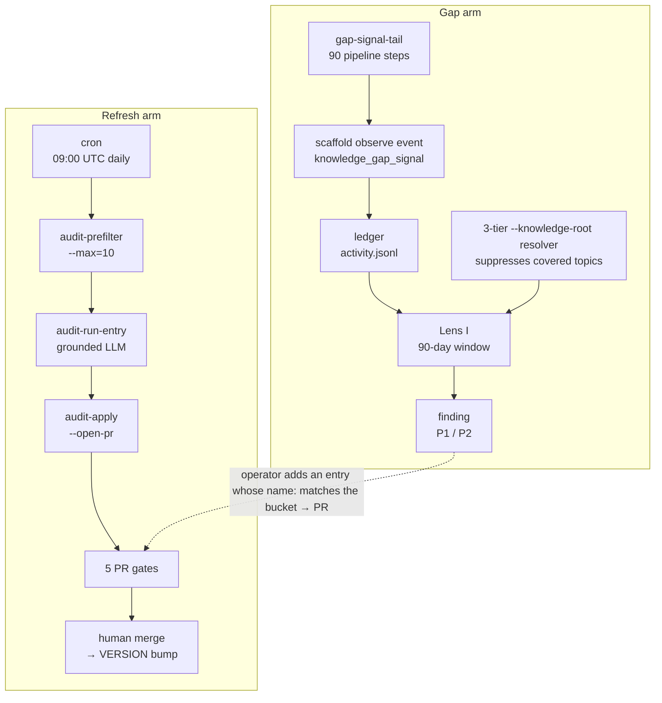

## What this system does

Knowledge entries under `content/knowledge/` declare a `volatility` tier and a
list of `sources`. A daily cron prefilters at most ten entries that are *due* —
by cadence or by a changed source hash — runs a grounded LLM audit against the
prefetched source bodies, opens one PR per drifted entry, and gates that PR on
five checks. In parallel, downstream agents emit `knowledge_gap_signal` events
when they hit a topic the KB does not cover; **Lens I** aggregates those signals
into P1/P2 audit findings, suppressing any topic an entry already covers.

Two arms, two outcomes:

- The **refresh arm** chases *known* sources for drift. It ends in a PR that
  *updates* an entry.
- The **gap arm** surfaces *unknown* topics. It ends in a PR that *creates* an
  entry.

Both terminate in a human-merged PR.

| Surface | Value | Notes |
| --- | --- | --- |
| Volatility tiers | 3 | `fast-moving` / `evolving` / `stable` |
| Audit verdicts | 4 | `current` / `minor-drift` / `major-drift` / `superseded` |
| Daily audit ceiling | 10 | set by `--max=10` in the cron workflow; not a yaml knob |
| PR gates | 5 | 4 blocking + 1 advisory |
| Signal window | 90 days | rolling; drives Lens I aggregation |

:::callout{type=note}
**Two subsystems, one config file.** Knowledge Freshness and the separate
[Build Observability](../observability/index.md) system both read
`.scaffold/observability.yaml`. This guide documents Knowledge Freshness;
Lens I is the seam where the two meet (it lives in the observability audit but
reasons about the KB).
:::

### How a gap closes

The full lifecycle, end to end:

1. Downstream agents emit signals; they accumulate in the rolling 90-day window.
2. A topic's signal count and distinct-project count cross the threshold.
3. Lens I emits a P1/P2 finding.
4. An operator adds `content/knowledge/<category>/<slug>.md`.
5. The next audit's knowledge index covers the slug and Lens I **suppresses** the
   bucket — the finding disappears.

Signals are *not* purged when the entry is added. The window is rolling, so
yesterday's signals still aggregate tomorrow; suppression filters the *emit*
step, not the aggregation step (:cite[src/observability/checks/lens-i-knowledge-gaps.ts:155]).
Signals only fade as they age out of the 90-day window naturally.

## System map



Three real hooks sit beside the two arms: the **phase-audit hook** (runs Lens H
only, never Lens I), the **doc-conformance MMR channel** (routes Lens I findings
into MMR), and the **`--fix` flow** (initial + verifier + postfix audit). They
are covered below.

:::callout{type=warning}
**Doc drift on MMR-in-cron.** Three docs frame MMR-in-cron differently. The
parent spec's locked decision #3 is authoritative: a native
`knowledge-freshness` MMR channel is deferred to Phase 5. The cron today runs
only inline gates. Two interim paths give reviewers MMR signal on a freshness
PR: (1) the built-in `doc-conformance` MMR channel (disabled by default; enable
with `mmr review --channels=doc-conformance`); (2) the manual `mmr review
--diff -` command in [From candidate to merged PR](#from-candidate-to-merged-pr).
:::

## Frontmatter, signals, and resolution

### Frontmatter schema

Every knowledge entry's frontmatter is a Zod-validated object with four
freshness-relevant fields. The schema is the source of truth and runs as Gate 1
of the PR CI (:cite[src/validation/knowledge-frontmatter-validator.ts:42-50]);
runtime readers tolerate missing optional fields.

| Field | Type | Default | Validation | Read by |
| --- | --- | --- | --- | --- |
| `name` | string | required | regex `/^[a-z][a-z0-9-]*$/` | assembly-loader, Lens I suppression |
| `description` | string | required | warns if > 200 chars | assembly-loader (TOC), audit prompt |
| `topics` | string[] | `[]` | any string | assembly-loader (auto-selection) |
| `volatility` | enum | `evolving` | `stable｜evolving｜fast-moving` | prefilter cadence |
| `last-reviewed` | ISO date | `null` | `YYYY-MM-DD` & real calendar date | prefilter cadence |
| `version-pin` | string | `null` | any string (e.g. `"OWASP Top 10 2021"`) | audit prompt; `superseded` verdict signals it must advance manually |
| `sources[]` | object[] | `[]` | each: `url` (SSRF-checked at fetch), `anchor` (optional, starts with `#`), `retrieved` (ISO date), `hash` (sha256) | prefilter (hash + cadence), audit runner (prefetch) |

:::callout{type=warning}
**`name` vs. gap-topic regex.** An entry `name` must start with a letter
(`/^[a-z][a-z0-9-]*$/`), but Lens I gap *topics* allow a leading digit
(`/^[a-z0-9]+(-[a-z0-9]+)*$/`). So a gap signalled for a topic like `3d-rendering`
cannot be suppressed by an entry of the same name — pick a letter-leading `name`
(and list the numeric form under `topics`) when closing such a gap.
:::

:::callout{type=note}
**Anchor semantics.** Put fragments in `anchor`, never inside `url`. The audit
fetches `url + (anchor ?? '')` and hashes that body; the coverage check
(:cite[src/knowledge-freshness/audit-apply.ts:82-101]) matches the same combined
string. Splitting prevents hash drift from spurious URL re-encodings and lets two
sources at the same base URL with different `#anchor`s be tracked independently.
:::

### Cadence model

Three tiers, three windows — **14 / 60 / 180** days for `fast-moving` /
`evolving` / `stable` (:cite[src/knowledge-freshness/audit-prefilter.ts:5-7]).
An entry with no `last-reviewed` always counts as due. Sources with a changed
hash also become candidates regardless of age, but the hash check only runs for
entries still *inside* their cadence window.

#### Which tier does an entry belong in?

| Provenance | Change frequency | Recommended tier |
| --- | --- | --- |
| vendor SDK / API docs | quarterly or faster | `fast-moving` |
| standards / RFCs, vendor docs | yearly-ish | `evolving` |
| canonical pattern reference | multi-year | `stable` |

Rule of thumb: if a version bump *often breaks* downstream guidance, lean
`fast-moving`; if drift is *extremely rare*, `stable`; otherwise `evolving`
(the default).

### Adding a new entry to the KB

1. **Choose a category directory** under `content/knowledge/<category>/`. Many
   categories exist today (`backend`, `core`, `cli`, `research`, `web-app`,
   `web3`, …); prefer placing into an existing one. Creating a new category is a
   separate PR.
2. **File name = entry slug + `.md`.** The basename must match the `name:` field
   (e.g. `retry-with-jitter.md` ↔ `name: retry-with-jitter`). Lens I's
   suppression match reads `name:` only, not the filename — a mismatch silently
   breaks suppression.
3. **Required frontmatter:** `name`, `description`. Add `volatility` + `sources[]`
   if you want the cron to audit it — an entry with no `sources[]` is skipped by
   the prefilter (:cite[src/knowledge-freshness/audit-prefilter.ts:17]).
4. **Validate locally:** `make validate-knowledge`.
5. **Confirm the prefilter will pick it up.** A fresh entry has no
   `last-reviewed`, so it should appear at priority 100:
   ```bash
   node dist/index.js knowledge-freshness audit-prefilter --max=10 \
     | jq '.[] | select(.name=="<your-new-slug>")'
   ```
   The daily ceiling is 10, so a flood of new entries may queue past the first day.

### Gap-signal payload

A gap signal is a ledger event validated by
:cite[src/observability/engine/event-schemas.ts:191-220] (payload allow-list at
:cite[src/observability/engine/event-schemas.ts:12]):

```json
{
  "event_id":    "<uuid>",
  "worktree_id": "<sha>",
  "actor_label": "agent | bot | …",
  "branch":      "<branch>",
  "task_id":     null,
  "type":        "knowledge_gap_signal",
  "ts":          "<ISO-8601>",
  "payload": {
    "topic":         "<kebab-slug>",
    "source":        "agent_search",
    "project_id":    "<sha256-hex>",
    "step_name":     "tech-stack",
    "agent_excerpt": "…"
  }
}
```

`topic` is ≤80 chars matching `/^[a-z0-9]+(-[a-z0-9]+)*$/`; `source` ∈
{`agent_search`, `lessons`, `manual`}; `project_id` is 64-char sha256 hex (or the
literal `lessons` when `source=lessons`); `step_name` and `agent_excerpt` (≤200
chars) are optional.

:::callout{type=tip}
**Suppressing emission in tests/CI.** Set `SCAFFOLD_GAP_SIGNAL_QUIET=1`. The
assembly-time tail (`src/core/assembly/gap-signal-tail.ts`) then renders no
emission template into the pipeline step. Default is always-on (locked decision
#9) — catch gaps everywhere they occur.
:::

### KnowledgeRootResolution shape

The resolver returns a three-field record that threads through the audit run
(:cite[src/observability/knowledge-index.ts:275-291]):

```ts
export interface KnowledgeRootResolution {
  /** Validated absolute path to a knowledge directory, or null. */
  root: string | null
  /** Pre-loaded index Set, populated by the validator. Null when root is null.
      Lens I reads this directly — no re-walk. */
  index: Set<string> | null
  /** Audit trail of what was tried. Lens I uses this to compose a precise
      warn-once message when root is null. */
  attempts: KnowledgeRootAttempt[]
}
```

## From candidate to merged PR

The cron is a thin bash loop — the brains live in three CLI subcommands and a
meta-prompt that runs a grounded LLM against pre-fetched source bodies.

### Prefilter

An entry becomes a candidate when (1) it has at least one source, AND (2) either
its `last-reviewed` is older than the cadence window, OR a source's prefetched
hash differs from the stored one. Priority orders highest-score first: unreviewed
entries (100), then overdue entries (`50 + ageDays`, so the oldest rank highest),
with in-window hash changes at 75; the top `--max`
win (:cite[src/knowledge-freshness/audit-prefilter.ts:14-72]):

```ts
for (const e of entries) {
  if (e.sources.length === 0) continue            // no sources = no audit
  if (!e.lastReviewed)        { select = true; priority = 100 }
  else if (ageDays > window)  { select = true; priority = 50 + ageDays }
  else {
    // hash check — Promise.all over a small per-entry list (1-3 sources)
    if (anyHashChanged) { select = true; priority = 75 }
  }
}
candidates.sort((a, b) => b.priority - a.priority)
return candidates.slice(0, max)
```

The hash check is a tiebreaker, not a baseline. Entries already *past* their
window are selected immediately at priority `50 + ageDays` — no network cost.
The hash check only runs in the `else` branch (still *inside* the window), runs
`Promise.all` over the entry's 1–3 sources, and swallows fetch errors so a slow
upstream doesn't crash the cron.

### Audit verdicts

The meta-prompt at `content/tools/knowledge-audit-entry.md` instructs the LLM to
read pre-fetched source bodies (no web tool available) and emit one of four
verdicts. **Every verdict opens a PR** — the dry-run apply runs first so gates
can inspect the proposed diff, then `--open-pr` creates the branch.

| Verdict | What the PR contains |
| --- | --- |
| `current` | Frontmatter-only: bumps `last-reviewed`, `sources[*].hash`, `sources[*].retrieved` so the entry exits the queue. |
| `minor-drift` | Frontmatter persistence + findings table as commentary. `applyVerdictToEntry` refuses any `proposed_changes` on this verdict (:cite[src/knowledge-freshness/audit-apply.ts:54-58]); no body edits. |
| `major-drift` | Body edits land via `proposed_changes` (H2-heading-anchored splices). Gate 4 blocks if a stable entry's diff exceeds 20% churn without the override label. |
| `superseded` | A new edition shipped; `version-pin` must advance. `last-reviewed` does **not** advance (:cite[src/knowledge-freshness/audit-apply.ts:103-118]) — only `hash`/`retrieved` update, so the entry stays due until a human re-audits. Prevents a known-stale entry from looking fresh. |

### PR generation

Branch: `knowledge-freshness/<entry>-<YYYY-MM-DD>`. `renderPrBody` renders a
summary, the verdict fields, a findings table, the sources, and any preserve
warnings (it does not embed the raw verdict JSON). Each candidate gets
its own PR off `origin/main` — the cron `git checkout main` between iterations
and restores the entry between the dry-run apply (for gates) and the final
`--open-pr` call. PRs do not stack; failures isolate per-candidate.

#### VERSION bump on merge

A dedicated workflow
(:cite[.github/workflows/knowledge-freshness-version-bump.yml:16]) fires on PR
`closed` (merged-only) when the source branch starts with `knowledge-freshness/`
*or* the PR carries the `knowledge-freshness` label. It computes the next SemVer
from the PR title and body, writes `content/knowledge/VERSION`, commits with the
prefix `chore(knowledge):` (deliberately not `knowledge-freshness/*`) so the
commit doesn't re-trigger itself, then `git pull --rebase` before pushing. Bump
rules (:cite[src/knowledge-freshness/bump-version.ts:26-45]):

| Match | Bump | Notes |
| --- | --- | --- |
| `BREAKING CHANGE:` anywhere in title, or start-of-line in body | major | Wins over every other prefix |
| `feat(knowledge):` / `feat(knowledge-freshness):` title prefix | minor | Case-sensitive |
| `chore(knowledge):` / `chore(knowledge-freshness):` title prefix | patch | Used by the bump commit itself |
| Anything else (including `fix(knowledge):`) | patch | Logs a `::notice::` for unrecognized prefixes |

The start-of-line anchor on the BREAKING CHANGE body match (`/^BREAKING
CHANGE:/m`) is deliberate — a freshness PR's body embeds an LLM-generated
findings table whose evidence excerpts could otherwise mention "BREAKING CHANGE:"
and trigger an accidental major bump.

### MMR corroboration (manual)

The cron does *not* dispatch MMR today — the workflow only runs inline gates. To
corroborate a freshness PR locally:

```bash
git diff origin/main...HEAD -- 'content/knowledge/**/*.md' \
  | mmr review --diff - --focus knowledge-freshness --sync --format json
```

A native `knowledge-freshness` MMR channel is the Phase 5 plan. See the
[MMR guide](../mmr/index.md) for the channel architecture.

## The five PR gates

The cron's `GITHUB_TOKEN`-opened PRs don't fire downstream workflows, so the
cron also runs the gate code inline (same CLI surface). Human-opened freshness
PRs get gated by the workflow at
:cite[.github/workflows/knowledge-freshness-gates.yml:17].

:::filter-table
| # | Gate | What it checks | Mode | Source |
| --- | --- | --- | --- | --- |
| 1 | Frontmatter validator | Zod schema parse over every entry (excludes README). Strict calendar-date refinement; SSRF guard on source URLs. | :sev[blocking]{level=p0} | :cite[src/validation/knowledge-frontmatter-validator.ts:42-50] |
| 2 | Source link-check | Every `sources[*].url` returns 2xx. Operates on the changed-files list via `--files-from`. | :sev[blocking]{level=p0} | :cite[.github/workflows/knowledge-freshness-gates.yml:117-123] |
| 3 | Unsourced-claims lint | New normative claims must have a `sources[]` entry. Runs even when 1/2 failed. | :sev[advisory]{level=p3} | :cite[.github/workflows/knowledge-freshness-gates.yml:126-135] |
| 4 | Anti-over-rewrite | Stable entries reject diffs deleting >20% of lines unless the `override:anti-over-rewrite` label is applied. Cron-opened `knowledge-freshness/*` branches only. | :sev[blocking]{level=p1} | :cite[.github/workflows/knowledge-freshness-gates.yml:137-152] |
| 5 | Deep Guidance preserved | Literal `## Deep Guidance` heading must survive — the assembly engine pulls just that section. | :sev[blocking]{level=p0} | :cite[.github/workflows/knowledge-freshness-gates.yml:154-160] |
:::

:::callout{type=warning}
**Spec drift on the Gate 4 override.** The parent spec describes the override as
a marker in the PR *description*; the shipped mechanism
(:cite[.github/workflows/knowledge-freshness-gates.yml:148-152]) reads a
maintainer-applied PR *label* (`override:anti-over-rewrite`) via `--pr-labels`.
The shipped behavior is authoritative; the spec text is stale.
:::

:::callout{type=note}
**Anti-tamper checkout (known gap).** The gate workflow builds the gate code from
HEAD, not from `origin/main`
(:cite[.github/workflows/knowledge-freshness-gates.yml:42-53]). The hardening —
build from base, overlay only PR HEAD's `content/knowledge/` — is deferred
because the bootstrap PR introduced the gate code itself. Risk is mitigated by
mandatory PR review until a follow-up flips the checkout strategy.
:::

## Lens I — gap detection + suppression

Lens I runs under `--scope=docs` and `--scope=all`
(:cite[src/observability/checks/lens-i-knowledge-gaps.ts:43]). It collects
signals from the ledger (rolling 90-day window,
:cite[src/observability/checks/lens-i-knowledge-gaps.ts:52]) plus synthetic
signals from `tasks/lessons.md`, buckets them by normalized topic, applies the
threshold matrix, and suppresses buckets whose topic an entry already covers.

:::callout{type=note}
**Where Lens I sits in the taxonomy.** "Lens" is scaffold's name for an audit
check function inside `scaffold observe audit`. The full set is A–I; Lens I
(`I-knowledge-gaps`) is this one. The other seven plus Lens H are documented in
the [Build Observability guide](../observability/index.md).
:::

### Threshold matrix

The rules (:cite[src/observability/checks/lens-i-knowledge-gaps.ts:148-149]):

| signal_count | distinct_projects | Severity |
| --- | --- | --- |
| ≥ 5 | ≥ 3 | :sev[P1]{level=p1} |
| ≥ 3 | ≥ 2 | :sev[P2]{level=p2} |
| below both | — | no finding |

### Topic normalization

Lens I normalizes the raw topic before bucketing, then validates the result.
Two distinct steps: `normalizeTopic`
(:cite[src/observability/checks/lens-i-lessons-scanner.ts:32-38]) always
produces a (possibly empty) string; `isValidTopic`
(:cite[src/observability/checks/lens-i-lessons-scanner.ts:114-116]) decides
whether to accept it. Normalization lowercases, strips apostrophes, replaces
every other non-slug run with a single hyphen, collapses repeats, and trims. The
validator additionally enforces ≤ 80 chars and `/^[a-z0-9]+(-[a-z0-9]+)*$/`.
So `Agent Eval Harnesses!` → `agent-eval-harnesses` (valid), but `!!!` → `` (rejected).

### What the lessons.md scanner sees

Lens I synthesizes signals from `tasks/lessons.md` at audit time (read inline, no
ledger writes) via two passes per non-fenced line — code-fenced blocks are
skipped (:cite[src/observability/checks/lens-i-lessons-scanner.ts:4]):

1. **Explicit marker** — `<!-- gap-topic: <slug> -->` (slug must already be
   kebab-case; the marker regex enforces it).
2. **Heuristic phrases** (case-insensitive): *"would have helped to have a guide
   on X"*, *"missing knowledge entry for X"*, *"no knowledge entry for X"* /
   *"no kb entry for X"*, *"missing knowledge: X"*.

Captured topics run through the same `normalizeTopic` / `isValidTopic`.
Synthetic signals carry `project_id: "lessons"` and are **excluded** from the
distinct-projects count by the aggregator's `delete('lessons')` rule (decision
#6) — they corroborate but don't independently satisfy the threshold.

### 3-tier `--knowledge-root` resolution

Lens I must know where the KB lives to skip already-covered topics. The resolver
(`resolveKnowledgeRoot` at :cite[src/observability/knowledge-index.ts:326-379])
tries three tiers in order:

| Tier | Source | On failure |
| --- | --- | --- |
| 1 | `--knowledge-root` CLI flag (resolved against `process.cwd()`) | **hard error** before any lens runs (`KnowledgeRootCliInvalidError`) |
| 2 | `lenses.I-knowledge-gaps.knowledge_root` in yaml (resolved against cwd) | soft-fail; records `{outcome: 'invalid', reason}` in the attempts trail |
| 3 | auto-detect — `findScaffoldKnowledgeRoot` walks parents for `package.json#name === '@zigrivers/scaffold'` (:cite[src/observability/knowledge-index.ts:164-178]) | returns `null` if no install is found |

The sharp asymmetry is intentional: an operator who *typed* a `--knowledge-root`
gets a hard error on a bad path; yaml and auto-detect soft-fail so suppression
degrades gracefully. The most instructive case: yaml invalid + auto-detect found
— the trail records the yaml failure *and* the auto-detect success, root is the
auto-detect path, and a one-line stderr note points at the stale yaml. This is
what an operator sees when `npm update -g @zigrivers/scaffold` moved the install
out from under a pinned yaml path.

### Warning policy

| Key | Status | When emitted |
| --- | --- | --- |
| `lens-i:no-root` | active | Lens I runs, no root resolved, lens enabled. Per-audit deduped via `warnedKeys: Set<string>`. If yaml failed validation, the message gains a clause quoting the bad path + reason. |
| `lens-i:index-load-failed` | reserved | Never emitted today — `validateKnowledgeRoot` exercises the loader at resolution time, foreclosing this path. |
| (none) | no-warn | Lens I disabled — resolver runs but no warning surfaces (decisions #4 / #11). |

`emitOnceForAudit` (:cite[src/observability/knowledge-index.ts:251-259]) reads a
caller-provided `Set` created fresh in each `runAudit`
(:cite[src/observability/engine/api.ts:114]), so the `--fix` flow's three
internal audits each get their own dedup scope.

### What a Lens I finding looks like

A single finding excerpt from the audit sidecar (`docs/audits/<id>.json`):

```json
{
  "id": "a3f2c1d4...",
  "lens_id": "I-knowledge-gaps",
  "severity": "P2",
  "title": "Knowledge base lacks coverage for \"agent-eval-harnesses\" — 4 signals across 2 projects",
  "source_doc": "",
  "evidence": {
    "kind": "knowledge_gap",
    "topic": "agent-eval-harnesses",
    "signal_count": 4,
    "distinct_project_count": 2,
    "distinct_projects": ["a3f2...", "1c4e..."],
    "first_seen": "2026-04-12T09:00:00Z",
    "last_seen": "2026-05-21T14:30:00Z",
    "example_excerpts": ["No knowledge entry for agent eval harnesses"]
  },
  "confidence": "medium",
  "fix_hint": {
    "kind": "edit_doc",
    "target": "content/knowledge/<category>/agent-eval-harnesses.md",
    "prompt": "Propose a new knowledge entry for \"agent-eval-harnesses\". Evidence: 4 signals from 2 projects in the last 90 days."
  }
}
```

:::callout{type=warning}
**Phase audits don't trigger Lens I.** The phase-boundary hook
(`StateManager.markCompleted` → `runPhaseAudit` at
:cite[src/observability/engine/phase-audit.ts:63]) fires only Lens H-cross-doc
(`lensIds: ['H-cross-doc']` at :cite[src/observability/engine/phase-audit.ts:77]).
Lens I never runs at phase boundaries. A phase-audit run that surfaces zero
findings does **not** mean Lens I is happy — it means Lens I never ran. To see
Lens I findings, invoke `scaffold observe audit --scope=docs` (or `--scope=all`)
explicitly, or run it through `--fix`.
:::

## The allowlist

Out-of-allowlist sources warn but don't block (decision #4). Bare hostnames
match subdomains; `host/path` entries additionally require the URL path to start
with the prefix; `github_repos` is locked to specific `owner/repo`.

The off-allowlist warning is **advisory** and is surfaced by the
frontmatter-validation path (`validateKnowledgeFile`), not by a gate. Gate 3
(`lint-unsourced`) is a separate advisory check that flags nearby links not
covered by the entry's declared `sources[]` domains. Off-allowlist sources still
get fetched, hashed, and audited — they just warn.
It is **not** a security boundary: the SSRF guard
(`src/knowledge-freshness/source-url-validator.ts`) runs independently, so a new
host never unlocks private-IP fetches. The editorial bar is: "would the
maintainers want this URL to be the verbatim grounding for a P0/P1 finding?"

### Most-cited hosts

Counted live from every entry's `sources[*].url` at build time.

<!-- gen:host-citations -->
:::chart{type=bar}

| Host | Citations |
| --- | --- |
| developer.apple.com | 79 |
| martinfowler.com | 37 |
| developer.mozilla.org | 24 |
| modelcontextprotocol.io | 19 |
| owasp.org | 18 |
| developer.android.com | 15 |
| the-turing-way.netlify.app | 15 |
| developer.chrome.com | 14 |
| github.com | 12 |
| sre.google | 12 |
| w3.org | 12 |
| microservices.io | 11 |
| rfc-editor.org | 11 |
| ethereum.org | 10 |
| consensys.github.io | 9 |
:::
<!-- /gen:host-citations -->

### The full allowlist

Every host plus its category, and the pinned GitHub repos.

<!-- gen:allowlist -->
47 allowlisted hosts and 3 GitHub repos. Out-of-list sources warn (they do not block).

:::filter-table
| Host | Category |
| --- | --- |
| `ai.google.dev` | ai-ml |
| `anthropic.com` | ai-ml |
| `docs.wandb.ai` | ai-ml |
| `mlflow.org` | ai-ml |
| `modelcontextprotocol.io` | ai-ml |
| `platform.openai.com` | ai-ml |
| `spec.graphql.org` | api |
| `spec.openapis.org` | api |
| `developer.chrome.com` | browser-ext |
| `docs.aws.amazon.com` | cloud-ops |
| `opentelemetry.io` | cloud-ops |
| `sre.google` | cloud-ops |
| `aicpa-cima.com` | compliance |
| `aicpa.org` | compliance |
| `eur-lex.europa.eu` | compliance |
| `pcisecuritystandards.org` | compliance |
| `www.finra.org` | compliance |
| `www.sec.gov` | compliance |
| `developer.android.com` | mobile |
| `developer.apple.com` | mobile |
| `adr.github.io` | patterns |
| `agilealliance.org` | patterns |
| `conventionalcommits.org` | patterns |
| `google.github.io` | patterns |
| `martinfowler.com` | patterns |
| `microservices.io` | patterns |
| `thoughtworks.com` | patterns |
| `the-turing-way.netlify.app` | research |
| `nist.gov` | security |
| `openid.net` | security |
| `owasp.org` | security |
| `consensys.github.io` | smart-contracts |
| `docs.openzeppelin.com` | smart-contracts |
| `docs.safe.global` | smart-contracts |
| `ethereum.org` | smart-contracts |
| `swcregistry.io` | smart-contracts |
| `ietf.org/rfc` | standards |
| `www.iso.org` | standards |
| `www.rfc-editor.org` | standards |
| `docs.pact.io` | testing |
| `docs.astral.sh` | tooling |
| `git-scm.com` | tooling |
| `peps.python.org` | tooling |
| `www.postgresql.org` | tooling |
| `developer.mozilla.org` | web-standards |
| `tr.designtokens.org` | web-standards |
| `www.w3.org` | web-standards |
:::

**GitHub repos:** `modelcontextprotocol/specification`, `steveyegge/beads`, `joelparkerhenderson/architecture-decision-record`
<!-- /gen:allowlist -->

### KB inventory

Totals over `content/knowledge/`, broken down per category.

<!-- gen:kb-inventory -->
**298 entries** across 21 categories:

| Category | Entries |
| --- | --- |
| core | 35 |
| game | 25 |
| research | 25 |
| backend | 22 |
| macos-native | 20 |
| review | 20 |
| web-app | 17 |
| web3 | 14 |
| data-science | 13 |
| browser-extension | 12 |
| data-pipeline | 12 |
| library | 12 |
| mcp-server | 12 |
| ml | 12 |
| mobile-app | 12 |
| cli | 10 |
| validation | 7 |
| product | 6 |
| execution | 5 |
| tools | 4 |
| finalization | 3 |
<!-- /gen:kb-inventory -->

### How to expand the allowlist

Adding a host is a one-line PR to
`docs/knowledge-freshness/authoritative-sources.yaml`:

```diff
 hosts:
   - owasp.org
+  - developers.cloudflare.com
   - nist.gov
```

1. **Pick the form.** Bare hostname for vendor docs whose path layout changes;
   `host/path` prefix for shared-tenancy hosts where you only trust a sub-path;
   `owner/repo` under `github_repos:` for specific GitHub repos. Skip `www.`
   (bare entries auto-match subdomains).
2. **Verify the host is live** — `curl -sI https://<host>/<path>` should return
   2xx (or a 3xx that ultimately resolves).
3. **Mirror the category** in `CATEGORY_MAP` in
   `scripts/build-freshness-reference.mjs` — otherwise the regenerated allowlist
   table shows the new host as `other`.
4. **Open a normal PR.** Allowlist additions are not a separate trust delegation;
   any maintainer can review.

## Anthropic vs DeepSeek (cron uses DeepSeek)

The cron switched to DeepSeek HTTP to remove the local `claude` CLI dependency
from CI. Local audits keep using whichever provider is configured. Precedence is
resolved by `resolveProvider` (:cite[src/knowledge-freshness/providers/index.ts:36]):

1. `--provider <name>` — explicit flag, operator override
2. `KNOWLEDGE_FRESHNESS_PROVIDER` env var
3. A single API key in env — inferred
4. Both API keys present → error (ambiguous)
5. No env, `claude` on PATH → anthropic (subprocess uses keychain)
6. Nothing → error (no provider configured)

::::tabs
:::tab{title="Anthropic"}
Subprocess: `claude -p --tools ""` (empty-tools disables WebFetch so the model
can only read the prefetched bodies). **Requires the `claude` CLI on PATH
regardless of how the provider was chosen** — the resolver throws
(:cite[src/knowledge-freshness/providers/index.ts:44-56]) if anthropic is
picked via flag, env, or API-key inference and `claude` isn't installed.
`ANTHROPIC_API_KEY` alone is *not* sufficient. Source:
`src/knowledge-freshness/providers/anthropic.ts`.
:::
:::tab{title="DeepSeek"}
HTTP. No subprocess; works in CI without the Claude CLI.

- **Auth:** requires `DEEPSEEK_API_KEY`.
- **Default model:** `deepseek-v4-flash`.
- **Override:** set `KNOWLEDGE_FRESHNESS_DEEPSEEK_MODEL` to `deepseek-v4-pro`.
  Other values throw at dispatcher-build time
  (:cite[src/knowledge-freshness/providers/deepseek.ts:54-58]).
- **Thinking mode:** hardcoded `thinking: { type: 'disabled' }`.
- **URL:** hardcoded to `https://api.deepseek.com/chat/completions`;
  project-local config cannot redirect (decision #7 invariant).
:::
::::

:::callout{type=danger}
**Why the DeepSeek URL is hardcoded.** An untrusted project's
`.scaffold/observability.yaml` could otherwise redirect the LLM dispatcher at an
attacker-controlled host that captures `DEEPSEEK_API_KEY` from request headers.
Hardcoding closes that exfiltration path — the same threat model that hardcodes
Lens H's `claude -p` command in the Build Observability audit.
:::

The cron wires DeepSeek explicitly
(:cite[.github/workflows/knowledge-freshness-audit.yml:70]):

```yaml
env:
  DEEPSEEK_API_KEY:              ${{ secrets.DEEPSEEK_API_KEY }}
  KNOWLEDGE_FRESHNESS_PROVIDER:  deepseek
  GH_TOKEN:                      ${{ secrets.GITHUB_TOKEN }}
```

A missing `DEEPSEEK_API_KEY` fails the run loudly at preflight rather than
silently exiting 0 with zero PRs.

## Every command that touches the system

All commands ship in the published CLI.

### Refresh-arm commands

| Command | Purpose |
| --- | --- |
| `scaffold knowledge-freshness audit-prefilter [--max=N]` | Walk `content/knowledge/`, apply cadence + hash check, print a JSON candidate array. `--max` default 10 (:cite[src/cli/commands/knowledge-freshness-audit-prefilter.ts:18]); the CLI emits only `{ name, path }` per candidate (:cite[src/cli/commands/knowledge-freshness-audit-prefilter.ts:43]). |
| `scaffold knowledge-freshness audit-run-entry <path>` | Pre-fetch each source through SSRF guards, dispatch the grounded audit, print verdict JSON. `--provider anthropic\|deepseek` overrides env precedence. |
| `scaffold knowledge-freshness audit-apply <path> <verdict.json> [--open-pr]` | Patch frontmatter + apply `proposed_changes` by H2 heading. The wrapper re-fetches every checked URL and computes its own sha256 (:cite[src/knowledge-freshness/audit-apply.ts:82-101]), so persisted hashes are deterministic, not the LLM's claim. Refuses to advance `last-reviewed` unless every declared source is covered. |
| `make validate-knowledge` | Gate 1 — runs the Zod validator over every entry (README excluded). |

### Gap-arm commands

| Command | Purpose |
| --- | --- |
| `scaffold observe audit --lens I-knowledge-gaps [--knowledge-root <path>] [--fix]` | Run the gap-detection lens against the local ledger + `tasks/lessons.md`. `--knowledge-root` overrides yaml + auto-detect for suppression. `--fix` dispatches the fix flow; the override threads through all three audits. |
| `scaffold observe event knowledge_gap_signal --topic=<slug> --source=<…> --project-id=<sha> …` | Write one validated gap signal to the ledger. Used by the assembly-time tail and by operators backfilling synthetic signals. |
| `scaffold observe ack <prefix-or-id>` | Acknowledge (or reopen) a finding so it stops surfacing. Use when a Lens I topic is deliberately out of scope. |

The `--fix` flow (`runFixFlow` at :cite[src/observability/engine/fix-flow.ts:71])
runs a three-audit loop: (1) the initial audit produces a fix plan; (2) for each
blocking finding, dispatch a fix agent then re-audit just that finding (the
verifier); (3) one postfix audit runs everything for the final report. The
`--knowledge-root` override threads into all three (decision #20) so suppression
is consistent throughout.

### Gate-side subcommands (also runnable locally for triage)

| Command | Gate | Purpose |
| --- | --- | --- |
| `knowledge-freshness link-check [<path>] [--files-from <json>]` | 2 | HTTP-HEAD every `sources[*].url`; 2xx passes, else exit 1. |
| `knowledge-freshness lint-unsourced [<path>] [--files-from <json>] [--diff <patch>]` | 3 | Heuristic scan for normative language in new lines without a `sources[]` reference. Advisory: prints findings but always exits 0. |
| `knowledge-freshness anti-over-rewrite [--files-from <json>] [--diff <patch>] [--pr-labels <csv>]` | 4 | For each changed `stable` entry, compare deleted-line count to 20% of the body; exit 1 if crossed without `override:anti-over-rewrite`. The cron passes `--pr-labels ""` (it can't self-apply labels). |
| `knowledge-freshness deep-guidance-check [<path>] [--files-from <json>]` | 5 | Assert each changed entry still contains a `## Deep Guidance` heading (case-sensitive). |
| `knowledge-freshness bump-version --title <str> --body <str>` | — | Pure-function dry-run of `deriveBumpKind` + `bumpSemver`; prints `bump:` and `next:` lines parsed by the version-bump workflow. |

## Operations cheat sheet

### An entry's audit failed in the cron

The cron logs `audit failed for <name> — moving on` and continues; the entry
stays in tomorrow's queue. Causes: provider auth (key rotated), source URL now
404s, a fetch/HTTP error or the 5 MiB fetch-and-hash cap, dispatcher error, or
LLM timeout. (A source body over the 96 KiB embed cap is **truncated** and
flagged `truncated: true` — it does not fail the audit.) Reproduce locally:

```bash
DEEPSEEK_API_KEY=sk-… node dist/index.js knowledge-freshness \
  audit-run-entry content/knowledge/<cat>/<name>.md
# read stderr to see if it's a URL issue or a provider issue
```

### Lens I keeps surfacing a topic the KB already covers

Suppression didn't match. Either the resolver returned `root: null` (look for
`[Lens I] knowledge-root not located` in stderr) or the entry's `name:` doesn't
normalize to the same slug as the bucket topic — the match is exact and
post-normalize.

```bash
scaffold observe audit --lens I-knowledge-gaps --json \
  --knowledge-root /path/to/content/knowledge \
  | jq '.findings[] | select(.lens_id=="I-knowledge-gaps")'
grep -A1 "^---" content/knowledge/<cat>/<slug>.md | grep "^name:"
```

### Downstream auto-detect can't find the KB

`findScaffoldKnowledgeRoot` walks parents from the CLI install's module location
looking for `package.json#name === '@zigrivers/scaffold'`. Symlinked or
repackaged installs may miss. Pin it via the tier-2 yaml:

```yaml
lenses:
  I-knowledge-gaps:
    knowledge_root: /opt/homebrew/lib/node_modules/@zigrivers/scaffold/content/knowledge
```

### Yaml `knowledge_root` stops working after an upgrade

The yaml tier soft-fails and records the reason in the attempts trail; Lens I
appends it to the warning. Validation requires all four: the path exists, is a
directory, contains a `<path>/VERSION` marker, and `loadKnowledgeIndex` runs
without throwing (an empty index is OK). The usual cause after an upgrade is a
moved install path:

```bash
find / -name VERSION -path '*content/knowledge*' 2>/dev/null
```

Then update `lenses.I-knowledge-gaps.knowledge_root` to the new path.

### A source URL fetches in `curl` but the cron rejects it

The SSRF guard re-resolves the hostname at fetch time and rejects any IP in a
non-globally-routable range (RFC1918, link-local, loopback, CGNAT, ULA,
IPv4-mapped IPv6, …). Common cause: an internal DNS view returning a private IP
for an outwardly-public hostname.

```bash
node -e 'require("node:dns").promises.lookup("<host>", { all: true }).then(console.log)'
```

Fix: move the source to a globally-routable host, or remove it. Allowlisting does
**not** bypass the SSRF guard.

### `--knowledge-root` resolves to a path you didn't expect

Auto-detect may pick a stale npm-global install. The successful-resolution path
doesn't log its `attempts` trail today (only the failure path warns), so pin and
compare:

```bash
scaffold observe audit --lens I-knowledge-gaps --json \
  --knowledge-root /path/you/expected/content/knowledge \
  | jq '.findings[] | select(.lens_id=="I-knowledge-gaps") | .evidence.topic'
# compare against the unset behavior; if the lists differ, auto-detect picked a different KB
```

Fix: pin `lenses.I-knowledge-gaps.knowledge_root` in
`.scaffold/observability.yaml`. A pinned yaml path takes precedence over
auto-detect.

## Config reference

Everything operator-tunable lives in `.scaffold/observability.yaml`. Anything
outside this list is hardcoded (decision #7 invariant) so an untrusted project
can't redirect dispatch commands or LLM URLs.

```yaml
lenses:
  I-knowledge-gaps:
    knowledge_root: /path/to/content/knowledge   # tier-2 resolver override

disabled_lenses: [I-knowledge-gaps]              # opt-out

phase_audit:
  enabled: true                                  # default
  timeout_s: 60
  detached: false                                # fire-and-forget when true

fix:
  dispatcher_command: "claude -p"                # default
  timeout_s: 300
  per_finding_max_attempts: 3
```

:::callout{type=warning}
**The daily audit ceiling is NOT in yaml.** The parent spec's decision #8 reads
"10 grounded audits per day; configurable via `.scaffold/observability.yaml`",
but the yaml knob was never implemented. The ceiling is the `--max=10` flag in
:cite[.github/workflows/knowledge-freshness-audit.yml:67]; the CLI default at
:cite[src/cli/commands/knowledge-freshness-audit-prefilter.ts:18] is the only
fallback. To lower it for your fork, edit the workflow — nothing in yaml will help.
:::

## Roadmap and known divergences

### Phase 5 (planned)

- **Native MMR `knowledge-freshness` channel** — runs automatically on freshness
  PRs (today the cron dispatches no MMR).
- **Frontier scan** — augment cadence/hash triggers with a model-driven check:
  "has the underlying technology meaningfully changed since `last-reviewed`?"
- **Taxonomy cross-reference** — detect when two entries assert contradictory
  facts and route to a reviewer.

### Known divergences

The reference page's own audits surfaced these doc-vs-code mismatches; the code
is ground truth:

- **MMR-in-cron framing** — three docs describe it differently; decision #3
  (Phase 5 deferral) is authoritative.
- **Gate 4 override** — spec says PR-description marker; code reads a PR *label*.
- **Daily ceiling** — spec implies a yaml knob; only the `--max` flag exists.
- **`operations.md` lags** — labels the native MMR channel "Phase 4" and
  describes suppression in future tense; both have shipped.
- **`www.` prefix inconsistency** (P3) — mixed `www.` use in the allowlist; bare
  entries already auto-match subdomains, so the prefix is redundant.
