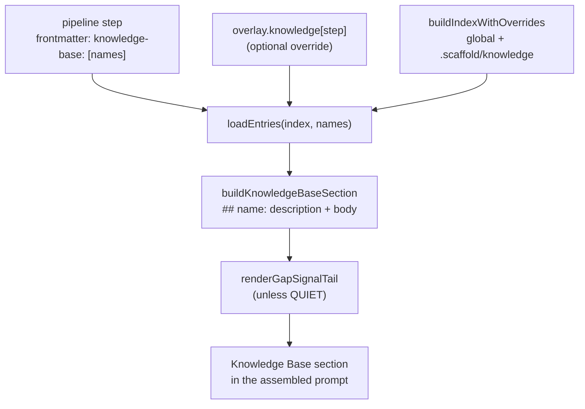

## What the knowledge base is

The knowledge base (KB) is a curated library of domain-expertise entries under
`content/knowledge/`, organized into category directories (`backend`, `core`,
`web-app`, `web3`, `ml`, …). Each entry is a single Markdown file with
YAML frontmatter and a body. During prompt assembly, the entries a pipeline step
declares are spliced into that step's **Knowledge Base** section so the agent
running the step gets the relevant expertise inline — no web lookup, no
guessing.

The KB is **orthogonal to the pipeline**: a step references entries by `name`,
and the same entry can be reused by many steps. Entries are versioned as a set
via `content/knowledge/VERSION` (bumped on merge by the freshness workflow).

:::callout{type=note}
**Scope of this guide.** This guide covers *authoring*, *injection*, and
*overriding* entries. The freshness lifecycle — volatility cadence, the daily
audit cron, the five PR gates, Lens-I gap detection, and the source
allowlist — lives in the
[Knowledge Freshness guide](../knowledge-freshness/index.md), along with the
live entry/category counts (see its KB inventory section). Counts and tiers are
**not** restated here.
:::

## How entries are injected during assembly

When `scaffold run <step>` assembles a prompt, it builds a merged name→path
index of every entry, loads the names the step declares, and renders each into
the step's Knowledge Base section.



The injection runs in three stages:

1. **Index.** `buildIndexWithOverrides(projectRoot, globalKnowledgeDir)` walks
   the global KB and the project-local override dir, returning a map of
   entry `name` → file path (:cite[src/core/assembly/knowledge-loader.ts:217]).
   The global dir is resolved by `getPackageKnowledgeDir`, which prefers a
   repo-local `content/knowledge` and otherwise falls back to the package's
   bundled copy (:cite[src/utils/fs.ts:55]).
2. **Select + load.** `scaffold run` reads the entry names from the pipeline
   overlay (if set) or the step's `knowledge-base` frontmatter, then calls
   `loadEntries` (:cite[src/cli/commands/run.ts:370-374]). A name that isn't in
   the index becomes a non-fatal `FRONTMATTER_KB_ENTRY_MISSING` warning rather
   than an error.
3. **Render.** `buildKnowledgeBaseSection` emits one `## <name>: <description>`
   block per entry followed by the entry content (:cite[src/core/assembly/engine.ts:174-185]).

### Deep Guidance vs. Summary (the dual-channel split)

An entry body may contain a `## Summary` section and a `## Deep Guidance`
section. For runtime CLI assembly, `loadEntries` injects **only** the Deep
Guidance — `extractDeepGuidance` finds the `## Deep Guidance` heading and
returns everything after it, falling back to the full body when the heading is
absent (:cite[src/core/assembly/knowledge-loader.ts:156]). The loader stores
`deepOnly ?? fullBody` as the entry content
(:cite[src/core/assembly/knowledge-loader.ts:315]). This avoids re-stating
guidance the command prompt already shows the user. The `scaffold build`
path (self-contained generated commands) instead uses `loadFullEntries`, which
keeps the complete body since no runtime assembly is available downstream.

### The gap-signal tail

After the entry bodies, assembly appends a **gap-signal tail** that tells the
agent to emit a `knowledge_gap_signal` observability event if it searches the
section and finds nothing useful (:cite[src/core/assembly/engine.ts:183]). The
template lives in `renderGapSignalTail`, which returns the empty string when
`SCAFFOLD_GAP_SIGNAL_QUIET=1` so tests and CI stay deterministic
(:cite[src/core/assembly/gap-signal-tail.ts:45]). Those signals feed Lens I —
see the [Knowledge Freshness guide](../knowledge-freshness/index.md){mode=advisory}
for what happens to them.

## Browsing and overriding entries

The KB resolves in two layers. **Global** entries ship with Scaffold under
`content/knowledge/`. **Local** overrides live under a project's
`.scaffold/knowledge/` directory (:cite[src/core/assembly/knowledge-loader.ts:225]).
When both define the same `name`, the **local override wins** — the merge layers
local on top of global (:cite[src/core/assembly/knowledge-loader.ts:265]).

Use the `scaffold knowledge` subcommands to inspect and manage the effective set:

:::filter-table
| Command | What it does | Source |
| --- | --- | --- |
| `scaffold knowledge list` | List every entry — global plus local overrides — with a `global` / `local override` source label and description. `--format json` for machine output. | :cite[src/cli/commands/knowledge.ts:45] |
| `scaffold knowledge show <name>` | Print the *effective* content of an entry (the local override if present, else the global entry), prefixed with its source path. | :cite[src/cli/commands/knowledge.ts:109] |
| `scaffold knowledge reset <name>` | Remove a local override, reverting to the global entry. Refuses to delete a dirty override unless `--auto` is passed. | :cite[src/cli/commands/knowledge.ts:167] |
| `scaffold knowledge update <target> [instructions..]` | Assemble a knowledge-update prompt for one entry or every entry in a pipeline step (`--step`). | :cite[src/cli/commands/knowledge.ts:251] |
:::

To author a local override, create `.scaffold/knowledge/<category>/<name>.md`
with the same `name:` as the global entry you want to replace, using the same
frontmatter shape described below. A duplicate `name` *within* the local dir
emits a `warn: duplicate knowledge override name` to stderr and the last file
wins.

### `--knowledge-root` (a separate resolver)

The `scaffold knowledge` commands resolve the global dir via
`getPackageKnowledgeDir` and the local dir via `.scaffold/knowledge/`. The
`--knowledge-root` flag is a **different** mechanism: it belongs to the
observability audit's Lens-I suppression, which needs to locate a KB to know
which gap topics are already covered. It does **not** redirect prompt assembly
or the `scaffold knowledge` subcommands. Its three-tier resolution
(CLI flag → yaml → auto-detect) is documented in the
[Knowledge Freshness guide](../knowledge-freshness/index.md){mode=advisory}.

## Authoring a new entry

1. **Pick a category directory** under `content/knowledge/<category>/`. Prefer
   an existing category; a brand-new category is a larger change.
2. **Name the file after the slug.** The basename should match the `name:`
   field (e.g. `backend-api-design.md` ↔ `name: backend-api-design`). The index
   keys on the frontmatter `name`, not the filename
   (:cite[src/core/assembly/knowledge-loader.ts:198]), but keeping them aligned
   prevents confusion and keeps freshness/suppression matching predictable.
3. **Write the frontmatter** (fields below).
4. **Structure the body** with an optional intro paragraph, then `## Summary`
   and `## Deep Guidance`. The Deep Guidance section is what gets injected into
   runtime prompts.
5. **Wire it into a step** by adding the `name` to that pipeline step's
   `knowledge-base:` frontmatter list (or a pipeline overlay).
6. **Validate**: `make validate-knowledge` runs the frontmatter validator over
   every entry (:cite[src/cli/commands/validate-knowledge.ts:21]).

### Frontmatter fields

The frontmatter is YAML between `---` fences. The runtime loader coerces these
fields (:cite[src/core/assembly/knowledge-loader.ts:65]); the freshness
validator enforces them as a Zod schema (:cite[src/validation/knowledge-frontmatter-validator.ts:42-50]).
Only `name` is strictly required for an entry to be indexed at all
(:cite[src/core/assembly/knowledge-loader.ts:102]).

:::filter-table
| Field | Required | Shape | Notes |
| --- | --- | --- | --- |
| `name` | yes | `/^[a-z][a-z0-9-]*$/` (must start with a letter) | The index key. Steps reference entries by this. An entry with no `name` is silently dropped from the index. |
| `description` | yes | string | Rendered into the `## <name>: <description>` heading at injection. The validator warns past ~200 chars but does not fail. |
| `topics` | no | string[] (default `[]`) | Free-form tags used for discovery/auto-selection. |
| `volatility` | no | `stable｜evolving｜fast-moving` (default `evolving`) | Drives the freshness cadence — see the freshness guide. |
| `last-reviewed` | no | `YYYY-MM-DD` or `null` | ISO date; unquoted dates are coerced to strings. Audited entries advance this on a `current`/drift verdict. |
| `version-pin` | no | string or `null` | Pins the entry to an edition (e.g. `"OWASP Top 10 2021"`). |
| `sources` | no | object[] (default `[]`) | Each: `url` (SSRF-checked), optional `anchor` (must start with `#`), `retrieved` (ISO date), `hash` (sha256). An entry with no `sources` is skipped by the freshness cron. |
:::

A minimal entry:

```markdown
---
name: retry-with-jitter
description: Exponential backoff with full jitter for resilient client retries
topics: [resilience, networking, retries]
volatility: stable
last-reviewed: null
version-pin: null
sources:
  - url: https://aws.amazon.com/builders-library/timeouts-retries-and-backoff-with-jitter/
---

One-paragraph framing of why this matters.

## Summary

A short overview that may overlap with the command prompt's own text.

## Deep Guidance

The supplementary expertise that gets injected into runtime prompts. This is
the section assembly keeps for CLI prompts (see the dual-channel split above).
```

:::callout{type=tip}
**Want the freshness cron to keep it current?** Add at least one `sources[]`
entry and pick a `volatility` tier. Entries without sources are still injected
into prompts, but the daily audit skips them. The cadence model, source
allowlist, and audit verdicts are all in the
[Knowledge Freshness guide](../knowledge-freshness/index.md).
:::

## See also

- [Knowledge Freshness](../knowledge-freshness/index.md){mode=advisory} —
  volatility cadence, the audit cron, the five PR gates, Lens-I gap detection,
  the source allowlist, and the live KB inventory.
- [Build Observability](../observability/index.md){mode=advisory} — the audit
  engine that hosts Lens I and reads `knowledge_gap_signal` events.
