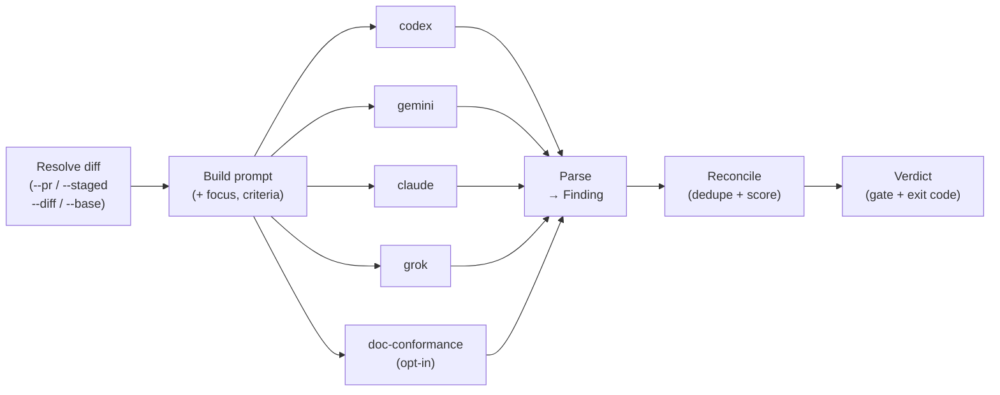

## What MMR is

Multi-Model Review runs your changes past several **independent** AI code
reviewers ("channels"), then **reconciles** their findings into a single
de-duplicated list and a **verdict** that gates the work. No channel ever sees
another channel's output — agreement between them is what raises confidence, and
disagreement is what surfaces ambiguity.

### The core idea in five moves

1. **Resolve a diff** — from a PR, staged changes, a branch range, or a piped diff.
2. **Dispatch channels** — each channel is a separate subprocess given the same
   prompt, run in parallel and isolated :cite[packages/mmr/src/commands/review.ts:636].
3. **Parse** — each channel's raw output is parsed into a common `Finding` shape.
4. **Reconcile** — findings are grouped by a stable key, de-duplicated, and
   scored for agreement and confidence :cite[packages/mmr/src/core/reconciler.ts:43].
5. **Verdict** — a severity gate yields `pass`, `degraded-pass`, `blocked`, or
   `needs-user-decision` :cite[packages/mmr/src/types.ts:25].

:::callout{type=tip}
**Two layers, one mental model.** The `mmr` CLI is the engine that dispatches
the built-in channels and computes the verdict. The `scaffold run review-pr` /
`review-code` wrappers sit on top: they add a Superpowers code-reviewer *agent*
channel via `mmr reconcile`, handle auth recovery, and drive the fix loop.
:::

## End-to-end flow

A single `mmr review … --sync` run walks the whole pipeline. Channels fan out in
parallel; everything converges at reconciliation.



Compensating passes (see *Degraded mode* below) are injected *after* the first
dispatch round for any channel that was unavailable, then folded back into the
same reconcile step.

## The `mmr review` command

One command, several input modes. Pick the flag that matches your target;
everything else is control and output options. Type in the box to filter the
table.

:::filter-table
| Flag | Group | Description |
| --- | --- | --- |
| `--diff <path\|->` | input | Read a unified diff from a file, or `-` for stdin. Highest-priority input mode. |
| `--pr <n>` | input | Fetch the PR diff via `gh pr diff`. |
| `--staged` | input | Review staged changes (`git diff --cached`). |
| `--base <ref> [--head <ref>]` | input | Review a branch range (`git diff base...head`, head defaults to HEAD). |
| *(no input flag)* | input | Falls back to unstaged working-tree changes (`git diff`). |
| `--focus <text>` | control | Free-text focus areas appended to every channel prompt. |
| `--fix-threshold <P0\|P1\|P2\|P3>` | control | Severity gate. Findings at or above this block. Default P2 (from `.mmr.yaml`). |
| `--channels <names…>` | control | Run only these channels, overriding config defaults. Abstract channels are filtered out. |
| `--timeout <seconds>` | control | Per-channel timeout override. |
| `--template <name>` | control | Use a named review-criteria template from config. |
| `--format <json\|text\|markdown>` | output | Output format. Default `json`. |
| `--sync` | mode | Run the full pipeline (dispatch → parse → reconcile → verdict) and return results. Without it, dispatch is fire-and-forget. |
| `--dry-run` | mode | Resolve the diff and assemble the prompt without dispatching any channel. |
| `--session <id>` | rounds | Link this run into a multi-round session; the id must match `^[A-Za-z0-9_-]+$` and not be a reserved name :cite[packages/mmr/src/commands/sessions.ts:15]. |
| `--round <n>` | rounds | 1-based round counter within a session. |
| `--max-rounds <n>` | rounds | Hard cap on rounds. Defaults to 5 when `--session` is set without it. |
| `--accept-new-acks` | trust | Trust acknowledgment files newly introduced by the diff. |
| `--trust-project-acks` | trust | Trust working-tree project acks in non-Git / untrusted modes. |
| `--trust-project-config` | trust | Trust working-tree `.mmr.yaml` in untrusted modes. |
| `--config-base-ref <ref>` | trust | Load `.mmr.yaml` and acks from a trusted Git ref instead of HEAD. |
:::

### Copy-paste commands by target

```bash
# PR review (full pipeline, JSON out)
mmr review --pr 123 --sync --format json

# Staged changes before commit
mmr review --staged --sync --format json

# All tracked uncommitted changes (no untracked)
git diff HEAD | mmr review --diff - --sync --format json

# Branch range
mmr review --base main --head "$BRANCH" --sync --format json

# A single file's current contents, as an "all-added" diff
(diff -u /dev/null path/to/file.ts || true) | mmr review --diff - --sync --format json

# Only specific channels (e.g. just grok + claude)
mmr review --pr 123 --channels grok claude --sync --format json
```

## Other subcommands

| Command | Purpose |
| --- | --- |
| `mmr reconcile <job-id> --channel <name> --input <data>` | Inject an external channel's findings (e.g. the Superpowers agent) into an existing job and re-run the results pipeline. Input is a file, `-` for stdin, or inline JSON. :cite[packages/mmr/src/commands/reconcile.ts:17] |
| `mmr status <job-id>` | Per-channel status and elapsed time. Exit 0 = all complete, 1 = running, 2 = a channel failed, 5 = not found. |
| `mmr results <job-id> [--raw]` | Re-run parse → reconcile → format on a completed job. Exit code reflects the verdict. |
| `mmr jobs <list\|prune>` | List jobs, or prune old ones per `job_retention_days`. |
| `mmr sessions <start\|list\|show\|end> <id>` | Manage multi-round review sessions (stored under `~/.mmr/sessions/`). |
| `mmr config <init\|test\|channels\|path\|show\|enable\|disable\|set\|unset>` | Scaffold, inspect, and **mutate** `.mmr.yaml`. `init` scaffolds; `test` pre-flights install + auth; `channels` lists (add `--format text` for a table with a provenance SOURCE column); `show <name>` inspects one channel with provenance; `path` discloses the read/write search order; `enable`/`disable <channel>` toggle a channel; `set <dotted.path> <value>` / `unset <dotted.path>` edit any value (validated before write). All mutators are scope-aware (`--global`/`--project`) and never leave an invalid config on disk. |
| `mmr doctor [--fix] [--format json]` | Diagnose every channel's health (install + auth) with per-channel remediation. `--fix` disables channels whose CLI is not installed (records to `~/.mmr/config.yaml`). |
| `mmr critique [input] [--context repo] [--session <id>] [--lenses …] [--no-synthesis] [--format text\|json]` | Multi-model **design/brainstorm critique** of an artifact (a design doc, a pasted "problem + proposed solution", or a plan). Reports **convergence** (where models agreed), **divergence** (genuine splits + the deciding crux), and an editorial **synthesis** that never picks a winner. **Advisory: no pass/fail gate, always exits 0.** A peer to `review`, not a code review. `--context repo` (or `--context-paths a.ts …`) grounds it in the codebase; `--session <id>` iterates across rounds (each round sees the prior one); `--lenses skeptic,…` gives each channel a persona (relabels output to "perspectives"); `--no-synthesis` skips the synthesis pass. |
| `mmr commands [--format json]` | Machine-readable capability manifest — every command with a runnable example and a `writes` flag. Agents load this once instead of probing `--help`. |
| `mmr explain [<topic>]` | Inline just-in-time docs for a concept (`channels`, `config`, `scopes`, `compensation`, `redaction`, `provenance`). No arg lists the topics. |
| `mmr ack <add\|list\|rm\|prune>` | Sticky acknowledgments — silence a finding by its stable key so it stops blocking across rounds. |
| `mmr skill install --platform <name> \| --all` | Install a "use MMR for code review" skill into a project per agent CLI: Cursor (`.cursor/rules/mmr-review.mdc`), Gemini (`GEMINI.md`), Codex + Antigravity (shared `AGENTS.md` managed block). Supports `--dry-run`, `--force`, and `--dir`. :cite[packages/mmr/src/commands/skill.ts:85] |

```bash
# Capture a job_id from a review, then fold in an agent channel:
mmr reconcile "$JOB_ID" --channel superpowers --input findings.json

# Install the MMR review skill into the current project for one or all agent CLIs:
mmr skill install --platform cursor
mmr skill install --all --dry-run

# Turn a channel off / on without hand-editing YAML (writes channels.<name>.enabled):
mmr config disable grok      # not-installed channels record to ~/.mmr/config.yaml; --project to scope to repo
mmr config enable grok       # also clears any legacy channels_disabled entry
mmr config path              # show where config is read from and written to
```

:::callout{type=info}
**Each agent CLI reads its own instruction file**, so `mmr skill install` writes the
skill in the matching convention: a dedicated `.cursor/rules/mmr-review.mdc` for
Cursor, and an idempotent managed block (delimited by `<!-- BEGIN mmr-skill -->` and `<!-- END mmr-skill -->`) in `GEMINI.md`
(Gemini) or `AGENTS.md` (Codex and Antigravity share the `AGENTS.md` standard, so
both resolve to the same block). For the block-mode files, re-running rewrites only
the managed block and leaves the rest of the file intact; the dedicated Cursor file
is created fresh and needs `--force` to overwrite. The skill bodies are bundled with
the package under `packages/mmr/templates/skills/` :cite[packages/mmr/templates/skills/agents/mmr-review.md:1].
:::

## Channel architecture

A channel is **pure config data** — there is no per-channel code. The dispatcher
runs whatever `command` the channel defines, hands it the prompt, and parses its
output with the configured parser. Adding a channel is normally a `.mmr.yaml`
edit, not a code change.

### The channel config shape

```yaml
channels:
  <name>:
    enabled: true                 # run by default?
    command: "codex exec"         # whitespace-split, spawned WITHOUT a shell
    flags: ["--ephemeral"]        # appended after the command tokens
    env: { KEY: value }           # extra environment
    prompt_delivery: stdin        # stdin (default) | prompt-file
    prompt_wrapper: "{{prompt}}"  # template wrapped around the prompt
    output_parser: default        # default | gemini | doc-conformance | {kind:…}
    stderr: capture               # capture | suppress | passthrough
    timeout: 300                  # seconds (falls back to defaults.timeout)
    auth: { check, timeout, failure_exit_codes, recovery }
    extends: base-channel         # inherit from another channel (≤4 levels)
    abstract: false               # template-only; never dispatched directly
```

### Built-in channels

:::callout{type=info}
**Why grok is different.** codex/gemini/claude all read the prompt from `stdin`.
Grok's CLI requires the prompt as an argument and ignores stdin, so its channel
uses `prompt_delivery: prompt-file` — the dispatcher writes the prompt to a temp
file and passes its path via the `{{prompt_file}}` placeholder. Grok wraps its
reply in a JSON `.text` field, which the parser unwraps before extracting
findings.
:::

::::tabs

:::tab{title="Compare"}
The defaults, commands, and parsers below are the built-in presets :cite[packages/mmr/src/config/defaults.ts:32].

| Channel | Default | Strength | Prompt delivery | Parser |
| --- | --- | --- | --- | --- |
| `codex` | enabled | Correctness, security, API contracts | stdin | `default` |
| `gemini` | enabled | Architecture, broad-context reasoning | stdin | `gemini` |
| `claude` | enabled | Plan alignment, code quality, testing | stdin | `default` |
| `grok` | enabled | Independent second opinion (xAI; proprietary) | **prompt-file** | `unwrap $.text → default` |
| `doc-conformance` | opt-in | PRD/stories/standards conformance (LLM-graded) | stdin | `doc-conformance` |
:::

:::tab{title="codex"}
```yaml
command: codex exec
flags: [--skip-git-repo-check, -s, read-only, --ephemeral]
auth.check: codex login status        # local file check (fast, 5s)
recovery: codex login
output_parser: default
stderr: suppress
```
:::

:::tab{title="gemini"}
```yaml
command: gemini                       # NO -p: gemini reads stdin natively
flags: [--output-format, json]
env: { NO_BROWSER: "true" }
auth.check: NO_BROWSER=true gemini -p "respond with ok" -o json   # LLM round-trip, 20s
recovery: gemini -p "hello"
output_parser: gemini                 # unwraps { "response": "…" }
timeout: 360
```
:::

:::tab{title="claude"}
```yaml
command: claude -p
flags: [--output-format, json]
auth.check: claude -p "respond with ok"   # LLM round-trip, 20s
recovery: claude login
output_parser: default
```
:::

:::tab{title="grok"}
```yaml
command: grok
prompt_delivery: prompt-file
flags: [--prompt-file, "{{prompt_file}}", --output-format, json]
auth.check: grok models                # lists models / login state (no round-trip)
recovery: grok login
output_parser: { kind: unwrap-jsonpath, wrap: "$.text", then: default }
```

Grok is proprietary (xAI), not open-source — it joins the standard set
mechanically as a 4th CLI channel. Disable it with
`channels_disabled: ["grok"]`.
:::

:::tab{title="doc-conformance"}
```yaml
enabled: false                         # opt-in: runs up to 3 LLM calls (~3 min)
command: scaffold observe audit --profile=full --scope=all --output-mode=mmr-findings
output_parser: doc-conformance         # expects a JSON array of findings
timeout: 240
```

Enable with `--channels doc-conformance` or in `.mmr.yaml`.
:::

::::

### The dispatcher

- **Isolation.** Each channel is spawned as its own detached subprocess writing
  to its own output file; channels run in parallel and never share output.
- **Prompt delivery.** `stdin` mode pipes the prompt and closes stdin (avoids
  `E2BIG` on large diffs). `prompt-file` mode writes the prompt to
  `<channel>.prompt.txt` and substitutes `{{prompt_file}}` in the flags
  :cite[packages/mmr/src/core/dispatcher.ts:79].
- **Timeout.** A per-channel timer SIGKILLs the whole process group and marks
  the channel `timeout`.
- **Command parsing.** `command` is split on whitespace and spawned without a
  shell — so quoting/pipelines in `command` won't work; that's exactly why
  arg-only CLIs like grok use `prompt_delivery` rather than a shell shim.

**Adding a new channel — where it's clean vs. hard-coded.** *Clean (config
only):* a new subprocess channel (`command` + `flags` + `auth` +
`output_parser`), output reshaping via the `unwrap-jsonpath` or
`regex-findings` parser kinds, disabling/timeout overrides, and pointing the
compensator at a different channel — all pure `.mmr.yaml`. *Needs code:* a
brand-new *named* parser must be registered in `core/parser.ts`
:cite[packages/mmr/src/core/parser.ts:257]{mode=advisory}; and the
`COMPENSATING_FOCUS` map carries per-channel focus text (falls back gracefully
if absent). HTTP-endpoint channels (`kind: http`) are already supported via
`dispatchHttpChannel` — pure `.mmr.yaml`, no extra code
:cite[packages/mmr/src/config/schema.ts:144].

## Scaffold wrappers

Direct `mmr review` runs the built-in CLI channels. The `scaffold run` wrappers
add orchestration on top.

| Wrapper | Target | Adds on top of `mmr review` |
| --- | --- | --- |
| `scaffold run review-pr` | A PR (`--pr`) | Auth checks, the Superpowers code-reviewer *agent* channel via `mmr reconcile`, consensus/verdict handling, the 3-strike-per-finding round bookkeeping, optional Beads issue bridge. |
| `scaffold run review-code` | Local pre-push | Synthesizes a "delivery candidate" diff (committed + staged + unstaged), gathers file & standards context for the file-blind CLIs, then the same agent channel + round bounding. *Untracked files aren't covered.* |
| `scaffold run post-implementation-review` | Full codebase | Two phases — systemic review + per-story functional review via parallel agents — with its own report under `docs/reviews/`. (See its own doc for the exact channel layout.) |

:::callout{type=warning}
**Foreground only.** The wrappers' manual fallback runs Codex, Gemini, Claude,
and Grok as foreground Bash calls when the `mmr` CLI isn't available — never in
the background. Background execution produces empty output.
:::

## Findings, reconciliation & verdicts

### The Finding shape

Every channel's output parses into this common shape
:cite[packages/mmr/src/types.ts:45].

```json
{
  "id": "F-001",
  "category": "security",
  "severity": "P0",
  "location": "src/auth.ts:42",
  "description": "…",
  "suggestion": "…"
}
```

The `location` above (`src/auth.ts:42`) is illustrative. After reconciliation,
each finding also carries `confidence`, `sources[]`, `agreement`, a stable
`finding_key`, a `description_shingle` (for fuzzy cross-round matching), and
`acknowledged` :cite[packages/mmr/src/types.ts:54].

### Stable identity (`finding_key`)

```text
finding_key = sha1( normLocation | category | sha1(normDescription) | sha1(normSuggestion) )
```

Line numbers are stripped from the location and severity is *excluded*, so the
same issue at P1 vs P2 collapses to one key
:cite[packages/mmr/src/core/stable-id.ts:115]. A character-5-gram shingle backs
a Jaccard ≥ 0.7 fuzzy match. Intra-run, findings group by fuzzy shingle overlap
:cite[packages/mmr/src/core/reconciler.ts:83]; across rounds, the ack store reuses
the same threshold so a re-worded finding still matches a prior ack
:cite[packages/mmr/src/core/ack-store.ts:8].

### Agreement & confidence

Agreement and confidence are derived per group during reconciliation
:cite[packages/mmr/src/core/reconciler.ts:114].

| Sources | Severity | Agreement | Confidence |
| --- | --- | --- | --- |
| 2+ | same | consensus | high |
| 2+ | differ | majority | medium |
| 1 | :sev[P0]{level=p0} | unique | high |
| 1 | `compensating-*` | unique | low |
| 1 | other | unique | medium |

### The gate & the four verdicts

The gate **passes** when every unacknowledged finding is *below* the
`fix_threshold` :cite[packages/mmr/src/core/reconciler.ts:229] (default
:sev[P2]{level=p2} :cite[packages/mmr/src/config/defaults.ts:16]). Severity tiers run
:sev[P0]{level=p0} (highest) → :sev[P1]{level=p1} → :sev[P2]{level=p2} →
:sev[P3]{level=p3} (lowest).

The verdict is derived from gate result + channel health, in this branch order:
**zero channels completed → `needs-user-decision`**; else a failed gate →
`blocked`; else some channels incomplete → `degraded-pass`; else `pass`
:cite[packages/mmr/src/core/reconciler.ts:247]. (The no-completed-channels case
short-circuits first, so it outranks `blocked`.)

| Verdict | Condition | Exit |
| --- | --- | --- |
| `pass` | Gate passed, all channels completed | 0 |
| `degraded-pass` | Gate passed, but some channels failed / timed out / weren't installed | 0 |
| `blocked` | An unacknowledged finding sits at or above the threshold | 2 |
| `needs-user-decision` | No channel completed (can't make a determination) | 3 |

:::callout{type=warning}
Proceed only on **pass** or **degraded-pass**. On **blocked** or
**needs-user-decision**, surface the verdict and findings — don't merge
automatically.
:::

## Degraded mode, compensation & auth

A channel is "degraded" when it's `not_installed` (no binary), `auth_failed`,
`timeout`, `skipped`, or `failed`. The review doesn't stop — it tells you how to
recover and, for *transient* degradation, compensates.

- **Transient vs structural (mmr 2.0.0).** `auth_failed`/`timeout`/`failed` are
  *transient* — the channel will come back, so a compensating pass runs.
  `not_installed` is *structural* — the CLI isn't on this machine and won't
  return without action, so MMR **no longer compensates it by default** (a
  one-line notice names it). Opt back in with `--compensate-missing` on the
  review, or mark the channel `required: true`. Run `mmr doctor` to see the
  classification and the fix, or `mmr config disable <name>` to silence it.
- **Compensating pass.** When it runs, a `claude -p` pass uses that channel's
  focus area, labeled e.g. `[compensating: Grok-equivalent]`. These findings are
  single-source, low confidence. The compensator channel is configurable via
  `defaults.compensator.channel`.
- **Auth recovery** is surfaced (redacted), never silent.

| Channel | Auth check | Recovery |
| --- | --- | --- |
| `codex` | `codex login status` | `codex login` |
| `gemini` | `gemini -p "respond with ok"` | `gemini -p "hello"` |
| `claude` | `claude -p "respond with ok"` | `claude login` |
| `grok` | `grok models` | `grok login` |

## Configuration (`.mmr.yaml`)

Config is layered: built-in defaults → `~/.mmr/config.yaml` → project
`.mmr.yaml` → CLI flags. Arrays replace; objects deep-merge.

```yaml
version: 1
defaults:
  fix_threshold: P2          # gate severity
  timeout: 300               # default per-channel timeout (s)
  parallel: true
channels_disabled: ["grok"]  # opt OUT of a built-in (e.g. no grok installed)
channels:
  doc-conformance:
    enabled: true            # opt IN to a default-off channel
  # Bring-your-own model via channel inheritance:
  qwen-local:
    command: ollama run
    flags: ["qwen2.5-coder:32b", "--format", "json"]
    output_parser: { kind: unwrap-jsonpath, wrap: "$.response", then: default }
    auth: { check: "ollama list", timeout: 5, failure_exit_codes: [1], recovery: "ollama serve" }
```

- `channels_disabled` — skip these built-ins in the default dispatch (ignored
  when you pass an explicit `--channels` list).
- `enabled: false` — per-channel off switch (how `doc-conformance` ships).
- `extends` — inherit from another channel (≤ 4 levels, cycle-checked); child
  fields override the parent :cite[packages/mmr/src/config/loader.ts:145].
- `fix_threshold` — project gate; override per-run with `--fix-threshold`.

:::callout{type=danger}
**Trust boundary.** When reviewing a diff, project `.mmr.yaml` and acks should
be read from the diff's *base ref*, not the working tree — otherwise a PR could
add a channel that exfiltrates secrets or self-acknowledge its own findings. Use
`--config-base-ref` / the `--trust-project-*` flags to control this in untrusted
(e.g. CI) contexts.
:::
