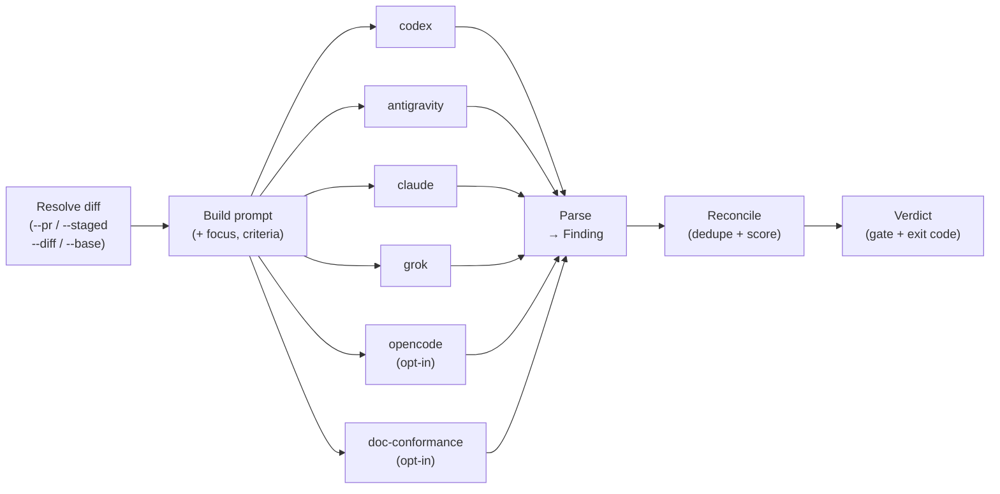

## What MMR is

Multi-Model Review runs your changes past several **independent** AI code
reviewers ("channels"), then **reconciles** their findings into a single
de-duplicated list and a **verdict** that gates the work. No channel ever sees
another channel's output — agreement between them is what raises confidence, and
disagreement is what surfaces ambiguity.

### The core idea in five moves

1. **Resolve a diff** — from a PR, staged changes, a branch range, or a piped diff.
2. **Dispatch channels** — each channel is a separate subprocess given the same
   prompt, run in parallel and isolated :cite[packages/mmr/src/commands/review.ts:636].
3. **Parse** — each channel's raw output is parsed into a common `Finding` shape.
4. **Reconcile** — findings are grouped by a stable key, de-duplicated, and
   scored for agreement and confidence :cite[packages/mmr/src/core/reconciler.ts:43].
5. **Verdict** — a severity gate yields `pass`, `degraded-pass`, `blocked`, or
   `needs-user-decision` :cite[packages/mmr/src/types.ts:25].

:::callout{type=tip}
**Two layers, one mental model.** The `mmr` CLI is the engine that dispatches
the built-in channels and computes the verdict. The `scaffold run review-pr` /
`review-code` wrappers sit on top: they add a Superpowers code-reviewer *agent*
channel via `mmr reconcile`, handle auth recovery, and drive the fix loop.
:::

## End-to-end flow

A single `mmr review … --sync` run walks the whole pipeline. Channels fan out in
parallel; everything converges at reconciliation.


```mermaid
flowchart LR
  R["Resolve diff
(--pr / --staged
--diff / --base)"] --> B["Build prompt
(+ focus, criteria)"]
  B --> C1["codex"]
  B --> C2["antigravity"]
  B --> C3["claude"]
  B --> C4["grok"]
  B --> C5["opencode
(opt-in)"]
  B --> C6["doc-conformance
(opt-in)"]
  C1 --> P["Parse
→ Finding"]
  C2 --> P
  C3 --> P
  C4 --> P
  C5 --> P
  C6 --> P
  P --> RC["Reconcile
(dedupe + score)"]
  RC --> V["Verdict
(gate + exit code)"]
```

Compensating passes (see *Degraded mode* below) are injected *after* the first
dispatch round for any channel that was unavailable, then folded back into the
same reconcile step.

## The `mmr review` command

One command, several input modes. Pick the flag that matches your target;
everything else is control and output options. Type in the box to filter the
table.

:::filter-table
| Flag | Group | Description |
| --- | --- | --- |
| `--diff <path\|->` | input | Read a unified diff from a file, or `-` for stdin. Highest-priority input mode. |
| `--pr <n>` | input | Fetch the PR diff via `gh pr diff`. |
| `--staged` | input | Review staged changes (`git diff --cached`). |
| `--base <ref> [--head <ref>]` | input | Review a branch range (`git diff base...head`, head defaults to HEAD). |
| *(no input flag)* | input | Falls back to unstaged working-tree changes (`git diff`). |
| `--focus <text>` | control | Free-text focus areas appended to every channel prompt. |
| `--fix-threshold <P0\|P1\|P2\|P3>` | control | Severity gate. Findings at or above this block. Default P2 (from `.mmr.yaml`). |
| `--channels <names…>` | control | Run only these channels, overriding config defaults. Abstract channels are filtered out. |
| `--timeout <seconds>` | control | Per-channel timeout override. |
| `--template <name>` | control | Use a named review-criteria template from config. |
| `--format <json\|text\|markdown>` | output | Output format. Default `json`. |
| `--sync` | mode | Run the full pipeline (dispatch → parse → reconcile → verdict) and return results. Without it, dispatch is fire-and-forget. |
| `--dry-run` | mode | Resolve the diff and assemble the prompt without dispatching any channel. |
| `--compensate-missing` | mode | Also run a compensating pass for channels whose CLI isn't installed. Off by default — see *Degraded mode*. |
| `--session <id>` | rounds | Link this run into a multi-round session; the id must match `^[A-Za-z0-9_-]+$` and not be a reserved name :cite[packages/mmr/src/commands/sessions.ts:15]. |
| `--round <n>` | rounds | 1-based round counter within a session. |
| `--max-rounds <n>` | rounds | Hard cap on rounds; exceeding it exits 3 before dispatch. Without `--session`, it defaults to `defaults.loop_control.max_rounds_default` (**5**). **With `--session` and no `--max-rounds`, middleware hardcodes 5** and your configured `max_rounds_default` is ignored :cite[packages/mmr/src/commands/review.ts:387] — pass `--max-rounds` explicitly if you configured a different cap. |
| `--accept-new-acks` | trust | Trust acknowledgment files newly introduced by the diff. |
| `--trust-project-acks` | trust | Trust working-tree project acks in non-Git / untrusted modes. |
| `--trust-project-config` | trust | Trust working-tree `.mmr.yaml` in untrusted modes. |
| `--config-base-ref <ref>` | trust | Load `.mmr.yaml` and acks from a trusted Git ref instead of HEAD. |
:::

### Copy-paste commands by target

```bash
# PR review (full pipeline, JSON out)
mmr review --pr 123 --sync --format json

# Staged changes before commit
mmr review --staged --sync --format json

# All tracked uncommitted changes (no untracked)
git diff HEAD | mmr review --diff - --sync --format json

# Branch range
mmr review --base main --head "$BRANCH" --sync --format json

# A single file's current contents, as an "all-added" diff
(diff -u /dev/null path/to/file.ts || true) | mmr review --diff - --sync --format json

# Only specific channels (e.g. just grok + claude)
mmr review --pr 123 --channels grok claude --sync --format json
```

## Other subcommands

| Command | Purpose |
| --- | --- |
| `mmr reconcile <job-id> --channel <name> --input <data>` | Inject an external channel's findings (e.g. the Superpowers agent) into an existing job and re-run the results pipeline. Input is a file, `-` for stdin, or inline JSON. :cite[packages/mmr/src/commands/reconcile.ts:17] |
| `mmr status <job-id>` | Per-channel status and elapsed time. Exit 0 = all complete, 1 = running, 2 = a channel failed, 5 = not found. |
| `mmr results <job-id> [--raw]` | Re-run parse → reconcile → format on a completed job. Exit code reflects the verdict. |
| `mmr jobs <list\|prune>` | List jobs, or prune old ones per `job_retention_days`. |
| `mmr sessions <start\|list\|show\|end> <id>` | Manage multi-round review sessions (stored under `~/.mmr/sessions/`). |
| `mmr config <init\|test\|channels\|path\|show\|enable\|disable\|set\|unset>` | Scaffold, inspect, and **mutate** `.mmr.yaml`. `init` scaffolds; `test` pre-flights install + auth; `channels` lists (add `--format text` for a table with a provenance SOURCE column); `show <name>` inspects one channel with provenance; `path` discloses the read/write search order; `enable`/`disable <channel>` toggle a channel; `set <dotted.path> <value>` / `unset <dotted.path>` edit any value (validated before write). All mutators are scope-aware (`--global`/`--project`) and never leave an invalid config on disk. |
| `mmr doctor [--fix] [--format json]` | Diagnose every channel's health (install + auth) with per-channel remediation. `--fix` disables channels whose CLI is not installed (records to `~/.mmr/config.yaml`). |
| `mmr critique [input]` | Multi-model **design critique** of an artifact — advisory, never gates. A peer to `review`, not a code review. See [below](#mmr-critique-the-design-peer). |
| `mmr commands [--format json]` | Machine-readable capability manifest — every command with a runnable example and a `writes` flag. Agents load this once instead of probing `--help`. |
| `mmr explain [<topic>]` | Inline just-in-time docs for a concept (`channels`, `config`, `scopes`, `compensation`, `redaction`, `provenance`). No arg lists the topics. |
| `mmr ack <add\|list\|rm\|prune>` | Sticky acknowledgments — silence a finding by its stable key so it stops blocking across rounds. `--scope project` (default, `./.mmr/acks`) or `user` (`~/.mmr/acks`); project acks shadow user acks. A re-worded finding still matches via the same shingle threshold. **`prune` is a no-op stub today** :cite[packages/mmr/src/commands/ack.ts:95]. |
| `mmr skill install --platform <name> \| --all` | Install a "use MMR for code review" skill into a project per agent CLI: Cursor (`.cursor/rules/mmr-review.mdc`), Codex + Antigravity (shared `AGENTS.md` managed block), OpenCode (`.opencode/skills/mmr/SKILL.md`, a full auto-discovered Agent Skill). Supports `--dry-run`, `--force`, and `--dir`. :cite[packages/mmr/src/commands/skill.ts:85] |

```bash
# Capture a job_id from a review, then fold in an agent channel:
mmr reconcile "$JOB_ID" --channel superpowers --input findings.json

# Install the MMR review skill into the current project for one or all agent CLIs:
mmr skill install --platform cursor
mmr skill install --all --dry-run

# Turn a channel off / on without hand-editing YAML (writes channels.<name>.enabled):
mmr config disable grok      # not-installed channels record to ~/.mmr/config.yaml; --project to scope to repo
mmr config enable grok       # also clears any legacy channels_disabled entry
mmr config path              # show where config is read from and written to
```

:::callout{type=info}
**Each agent CLI reads its own instruction file**, so `mmr skill install` writes the
skill in the matching convention: a dedicated `.cursor/rules/mmr-review.mdc` for
Cursor, and an idempotent managed block (delimited by `<!-- BEGIN mmr-skill -->` and `<!-- END mmr-skill -->`)
in `AGENTS.md` (Codex and Antigravity share the `AGENTS.md` standard, so
both resolve to the same block). For the block-mode files, re-running rewrites only
the managed block and leaves the rest of the file intact; the dedicated Cursor file
is created fresh and needs `--force` to overwrite. The skill bodies are bundled with
the package under `packages/mmr/templates/skills/` :cite[packages/mmr/templates/skills/agents/mmr-review.md:1].
:::

## `mmr critique` — the design peer

`review` judges a diff. `critique` judges a **design**: a design doc, a plan, or
a pasted "problem + proposed solution". Use it *before* you build, when you want
independent models to weigh an approach.

It is **advisory and never gates**. Once the input resolves it exits `0`,
whatever the critique says; only a usage error (missing or unreadable input)
exits `1`. There is no severity, no `fix_threshold`, and no verdict.

The report has three parts:

- **Convergence** — what the models independently agreed on. High signal.
- **Divergence** — where they genuinely split, each position paired with the
  *crux* that decides it.
- **Synthesis** — an editorial read that deliberately never picks a winner.

| Flag | Effect |
| --- | --- |
| `--context repo` | Ground the critique in the codebase so models judge *fit*, not just the idea. Default `none`. |
| `--context-paths a.ts,b.ts` | Ground against specific files (implies `--context repo`). |
| `--session <id>` | Iterate: each round sees the prior round and your revisions. |
| `--lenses <a,b,…>` | Give each channel a persona, cycled one per channel. Built-ins: `skeptic`, `simplifier`, `user-advocate`, `pragmatist`, `security`, `scale`. Any other name gets a generic preamble. Passing any lens relabels the output to "perspectives". |
| `--no-synthesis` | Skip the synthesis pass (deterministic output only). |
| `--format text\|json` | Default `text`. Note: no `markdown`, unlike `review`. |

The synthesis pass is conditional, not guaranteed — it runs only when at least
two items and two channels came back *and* the `claude` channel is installed and
authenticated. Otherwise you get the deterministic report alone.

```bash
mmr critique docs/design.md --context repo
mmr critique - --focus "scaling" --lenses skeptic,pragmatist
```

## Channel architecture

A channel is **pure config data** — there is no per-channel code. The dispatcher
runs whatever `command` the channel defines, hands it the prompt, and parses its
output with the configured parser. Adding a channel is normally a `.mmr.yaml`
edit, not a code change.

### The channel config shape

```yaml
channels:
  <name>:
    kind: subprocess              # subprocess (default) | http
    enabled: true                 # run by default?
    command: "codex exec"         # whitespace-split, spawned WITHOUT a shell
    flags: ["--ephemeral"]        # appended after the command tokens
    env: { KEY: value }           # extra environment
    cwd: "{{neutral_cwd}}"        # run from a neutral dir (strips project config)
    prompt_delivery: stdin        # stdin (default) | prompt-file
    prompt_wrapper: "{{prompt}}"  # template wrapped around the prompt
    output_parser: default        # default | default-last | gemini | doc-conformance | {kind:…}
                                  # (`gemini` the PARSER is still registered and
                                  #  usable by custom channels — only the gemini
                                  #  CHANNEL is retired)
    stderr: capture               # capture | suppress | passthrough
    timeout: 300                  # seconds (falls back to defaults.timeout)
    auth: { check, timeout, failure_exit_codes, recovery }
    extends: base-channel         # inherit from another channel (≤4 levels)
    abstract: false               # template-only; never dispatched directly
    required: false               # true ⇒ compensate even when not installed
    retired: false                # tombstone; forced off, never dispatched
    headers: { … }                # http channels only (warns on inline secrets)
```

An `http` channel swaps `command`/`flags` for `endpoint`, `model`,
`endpoint_convention: openai-chat`, and an optional `api_key_env` (sent as
`Authorization: Bearer …` unless `api_key_header` / `api_key_prefix` say
otherwise) :cite[packages/mmr/src/config/schema.ts:178].

### Built-in channels

:::callout{type=info}
**Why grok is different.** codex/claude/antigravity all read the prompt from `stdin`.
Grok's CLI requires the prompt as an argument and ignores stdin, so its channel
uses `prompt_delivery: prompt-file` — the dispatcher writes the prompt to a temp
file and passes its path via the `{{prompt_file}}` placeholder. Grok wraps its
reply in a JSON `.text` field, which the parser unwraps before extracting
findings.
:::

::::tabs

:::tab{title="Compare"}
The defaults, commands, and parsers below are the built-in presets :cite[packages/mmr/src/config/defaults.ts:32].

| Channel | Default | Strength | Prompt delivery | Parser |
| --- | --- | --- | --- | --- |
| `codex` | enabled | Correctness, security, API contracts | stdin | `default` |
| `claude` | enabled | Plan alignment, code quality, testing | stdin | `default` |
| `grok` | enabled | Independent second opinion (xAI; proprietary) | **prompt-file** | `unwrap $.text → default-last` |
| `antigravity` (`agy`) | enabled | Google's CLI reviewer (replaces the retired Gemini) | stdin | `default` |
| `opencode` (`opc`) | **opt-in** | Open-source CLI; independent correctness / code-quality pass | stdin | `default` |
| `doc-conformance` | **opt-in** | PRD/stories/standards conformance (LLM-graded) | stdin | `doc-conformance` |
| `gemini` | **retired** | Tombstone only — never dispatched | — | — |
:::

:::tab{title="codex"}
```yaml
command: codex exec
flags: [--skip-git-repo-check, -s, read-only, --ephemeral]
auth.check: codex login status        # local file check (fast, 5s)
recovery: codex login
output_parser: default
stderr: suppress
```
:::

:::tab{title="antigravity"}
```yaml
command: agy                          # Google's CLI reviewer (alias of antigravity)
# runs hardened: neutral cwd, --sandbox, auto-approve, real HOME
auth.check: agy -p "respond with ok"  # LLM round-trip, 20s
recovery: agy -p "hello"              # then open the printed Google OAuth URL
output_parser: default
```
:::

:::tab{title="claude"}
```yaml
command: claude -p
flags: [--output-format, json]
auth.check: claude -p "respond with ok"   # LLM round-trip, 20s
recovery: claude login
output_parser: default
```
:::

:::tab{title="grok"}
```yaml
command: grok
prompt_delivery: prompt-file
flags: [--prompt-file, "{{prompt_file}}", --output-format, json,
        --no-memory, --tools, web_search,web_fetch,
        --disallowed-tools, run_terminal_cmd, --no-subagents, --no-plan,
        --json-schema, "{{findings_schema}}"]
cwd: "{{neutral_cwd}}"                 # neutral cwd + neutral HOME (auth symlinked in)
auth.check: grok models                # lists models / login state (no round-trip)
recovery: grok login
output_parser:
  kind: unwrap-jsonpath
  wrap: "$.text"
  incomplete: { status_path: "$.stopReason", values: [Cancelled] }
  then: default-last                   # grok emits one object PER TURN — take the last
```

Grok is proprietary (xAI), not open-source — it joins the standard set
mechanically as a CLI channel. Disable it with
`channels_disabled: ["grok"]`.

Three of those flags are load-bearing rather than cosmetic: `--json-schema`
(substituted with the findings schema) is what makes the final answer land in
`$.text` reliably; `default-last` is required because grok emits one
schema-shaped object per turn; and the `incomplete` guard catches a
`stopReason: Cancelled` envelope and re-dispatches once instead of parsing a
truncated answer.
:::

:::tab{title="opencode"}
```yaml
enabled: false                         # opt-in, like doc-conformance
command: opencode run
flags: [--pure]
cwd: "{{neutral_cwd}}"
env: { OPENCODE_PERMISSION: '{"*":"deny"}' }   # no OS sandbox flag — deny every tool
auth.check: printf "respond with ok" | opencode run --pure
recovery: opencode auth login
output_parser: default
timeout: 300
```

An open-source AI coding CLI offering an independent correctness / code-quality
pass. Because `opencode` has no OS sandbox flag, every tool is denied via
`OPENCODE_PERMISSION` so the review stays text-in / text-out with no execution
surface. Creds live under the real `$HOME`
(`~/.local/share/opencode/auth.json`). Enable with `--channels opencode` (alias
`opc`) or `channels: { opencode: { enabled: true } }` in `.mmr.yaml`.
:::

:::tab{title="doc-conformance"}
```yaml
enabled: false                         # opt-in: runs up to 3 LLM calls
command: scaffold observe audit --profile=full --scope=all --output-mode=mmr-findings
output_parser: doc-conformance         # expects a JSON array of findings
timeout: 180
```

Enable with `--channels doc-conformance` or in `.mmr.yaml`.
:::

::::

### The dispatcher

- **Isolation.** Each channel is spawned as its own detached subprocess writing
  to its own output file; channels run in parallel and never share output.
- **Prompt delivery.** `stdin` mode pipes the prompt and closes stdin (avoids
  `E2BIG` on large diffs). `prompt-file` mode writes the prompt to
  `<channel>.prompt.txt` and substitutes `{{prompt_file}}` in the flags
  :cite[packages/mmr/src/core/dispatcher.ts:79].
- **Timeout.** A per-channel timer SIGKILLs the whole process group and marks
  the channel `timeout`.
- **Command parsing.** `command` is split on whitespace and spawned without a
  shell — so quoting/pipelines in `command` won't work; that's exactly why
  arg-only CLIs like grok use `prompt_delivery` rather than a shell shim.

**Adding a new channel — where it's clean vs. hard-coded.** *Clean (config
only):* a new subprocess channel (`command` + `flags` + `auth` +
`output_parser`), output reshaping via the `unwrap-jsonpath` or
`regex-findings` parser kinds, disabling/timeout overrides, and pointing the
compensator at a different channel — all pure `.mmr.yaml`. *Needs code:* a
brand-new *named* parser must be registered in `core/parser.ts`
:cite[packages/mmr/src/core/parser.ts:257]{mode=advisory}; and the
`COMPENSATING_FOCUS` map carries per-channel focus text (falls back gracefully
if absent). HTTP-endpoint channels (`kind: http`) are already supported via
`dispatchHttpChannel` — pure `.mmr.yaml`, no extra code
:cite[packages/mmr/src/config/schema.ts:144].

## Scaffold wrappers

Direct `mmr review` runs the built-in CLI channels. The `scaffold run` wrappers
add orchestration on top.

| Wrapper | Target | Adds on top of `mmr review` |
| --- | --- | --- |
| `scaffold run review-pr` | A PR (`--pr`) | Auth checks, the Superpowers code-reviewer *agent* channel via `mmr reconcile`, consensus/verdict handling, the 3-strike-per-finding round bookkeeping, optional Beads issue bridge. |
| `scaffold run review-code` | Local pre-push | Synthesizes a "delivery candidate" diff (committed + staged + unstaged), gathers file & standards context for the file-blind CLIs, then the same agent channel + round bounding. *Untracked files aren't covered.* |
| `scaffold run post-implementation-review` | Full codebase | Two phases — systemic review + per-story functional review via parallel agents — with its own report under `docs/reviews/`. (See its own doc for the exact channel layout.) |

:::callout{type=warning}
**Foreground only.** The wrappers' manual fallback runs Codex, Claude, Grok,
and Antigravity as foreground Bash calls when the `mmr` CLI isn't available — never
in the background. Background execution produces empty output.
:::

## Findings, reconciliation & verdicts

### The Finding shape

Every channel's output parses into this common shape
:cite[packages/mmr/src/types.ts:45].

```json
{
  "id": "F-001",
  "category": "security",
  "severity": "P0",
  "location": "src/auth.ts:42",
  "description": "…",
  "suggestion": "…"
}
```

The `location` above (`src/auth.ts:42`) is illustrative. After reconciliation,
each finding also carries `confidence`, `sources[]`, `agreement`, a stable
`finding_key`, a `description_shingle` (for fuzzy cross-round matching), and
`acknowledged` :cite[packages/mmr/src/types.ts:54].

### Stable identity (`finding_key`)

```text
finding_key = sha1( normLocation | category | sha1(normDescription) | sha1(normSuggestion) )
```

Line numbers are stripped from the location and severity is *excluded*, so the
same issue at P1 vs P2 collapses to one key
:cite[packages/mmr/src/core/stable-id.ts:115]. A character-5-gram shingle backs
a Jaccard ≥ 0.7 fuzzy match. Intra-run, findings group by fuzzy shingle overlap
:cite[packages/mmr/src/core/reconciler.ts:83]; across rounds, the ack store reuses
the same threshold so a re-worded finding still matches a prior ack
:cite[packages/mmr/src/core/ack-store.ts:8].

### Agreement & confidence

Agreement and confidence are derived per group during reconciliation
:cite[packages/mmr/src/core/reconciler.ts:114].

| Sources | Severity | Agreement | Confidence |
| --- | --- | --- | --- |
| 2+ | same | consensus | high |
| 2+ | differ | majority | medium |
| 1 | :sev[P0]{level=p0} | unique | high |
| 1 | `compensating-*` | unique | low |
| 1 | other | unique | medium |

### The gate & the four verdicts

The gate **passes** when every unacknowledged finding is *below* the
`fix_threshold` :cite[packages/mmr/src/core/reconciler.ts:229] (default
:sev[P2]{level=p2} :cite[packages/mmr/src/config/defaults.ts:16]). Severity tiers run
:sev[P0]{level=p0} (highest) → :sev[P1]{level=p1} → :sev[P2]{level=p2} →
:sev[P3]{level=p3} (lowest).

The verdict is derived from gate result + **how many channels actually reported**,
in this branch order :cite[packages/mmr/src/core/reconciler.ts:280]:

1. zero channels completed → `needs-user-decision`
2. else a failed gate → `blocked`
3. else fewer than `min_completed_channels` completed → `needs-user-decision`
4. else some channels incomplete → `degraded-pass`
5. else → `pass`

| Verdict | Condition | Exit |
| --- | --- | --- |
| `pass` | Gate passed, every dispatched channel completed | 0 |
| `degraded-pass` | Gate passed, at least `min_completed_channels` reported, but some channel failed / timed out / wasn't installed | 0 |
| `blocked` | An unacknowledged finding sits at or above the threshold | 2 |
| `needs-user-decision` | No channel completed, **or** fewer than `min_completed_channels` did | 3 (but see the exception below) |

:::callout{type=warning}
**The completion floor (mmr 4.0.0).** A verdict now reflects how many reviewers
actually reported, not just whether the gate passed. `defaults.min_completed_channels`
defaults to **2** :cite[packages/mmr/src/config/schema.ts:269] — so a run where
only one channel came back is `needs-user-decision`, not `degraded-pass`, even
with zero findings. One reviewer agreeing with itself is not consensus.

Note `blocked` deliberately outranks the floor: a real blocking finding is
actionable even when coverage was thin. Jobs created before 4.0.0 are re-read at
a floor of 1 so old results don't retroactively change verdict.
:::

Two further `needs-user-decision` outcomes short-circuit *before* any channel is
dispatched:

- **Round budget exhausted** — `--round N` greater than the effective
  `--max-rounds` emits `max_rounds_exceeded` and exits **3**.
- **Untrusted config in the diff** — see the trust callout at the end of this
  guide; exits **2**.

:::callout{type=warning}
**`needs-user-decision` does not always exit 3.** The verdict-derived case
exits 3 :cite[packages/mmr/src/core/results-pipeline.ts:304], but the
ratification gate short-circuits before the results pipeline ever runs and sets
exit **2** directly :cite[packages/mmr/src/commands/review.ts:522] — the same
code `blocked` uses. So do not infer the verdict from the exit code alone: a
`2` means either "blocked by findings" or "a human must ratify a config/ack
change". Read the `verdict` field when you need to tell them apart.
:::

:::callout{type=warning}
Proceed only on **pass** or **degraded-pass**. On **blocked** or
**needs-user-decision**, surface the verdict and findings — don't merge
automatically.
:::

## Degraded mode, compensation & auth

A channel is "degraded" when it's `not_installed` (no binary), `auth_failed`,
`timeout`, `skipped`, or `failed`. The review doesn't stop — it tells you how to
recover and, for *transient* degradation, compensates.

- **Transient vs structural (mmr 2.0.0).** `auth_failed`/`timeout`/`failed` are
  *transient* — the channel will come back, so a compensating pass runs.
  `not_installed` is *structural* — the CLI isn't on this machine and won't
  return without action, so MMR **no longer compensates it by default** (a
  one-line notice names it). Opt back in with `--compensate-missing` on the
  review, or mark the channel `required: true`. Run `mmr doctor` to see the
  classification and the fix, or `mmr config disable <name>` to silence it.
- **Compensating pass.** When it runs, a `claude -p` pass uses that channel's
  focus area, labeled e.g. `[compensating: Grok-equivalent]`. These findings are
  single-source, low confidence. The compensator channel is configurable via
  `defaults.compensator.channel`.
- **Auth recovery** is surfaced (redacted), never silent.

| Channel | Auth check | Recovery |
| --- | --- | --- |
| `codex` | `codex login status` | `codex login` |
| `claude` | `claude -p "respond with ok"` | `claude login` |
| `grok` | `grok models` | `grok login` |
| `antigravity` (`agy`) | `agy -p "respond with ok"` | `agy -p "hello"` |

## Configuration (`.mmr.yaml`)

Config is layered: built-in defaults → `~/.mmr/config.yaml` → project
`.mmr.yaml` → CLI flags. Arrays replace; objects deep-merge.

```yaml
version: 1
defaults:
  fix_threshold: P2            # gate severity
  min_completed_channels: 2    # completion floor (below it → needs-user-decision)
  timeout: 300                 # default per-channel timeout (s)
  format: json                 # json | text | markdown
  parallel: true
  job_retention_days: 7        # used by `mmr jobs prune`
  loop_control:
    max_rounds_default: 5
  compensator:
    channel: claude            # who runs a compensating pass (default: claude -p)
stage: mvp                     # prototype | mvp | production — calibrates the severity rubric
review_criteria: ["…"]         # extra criteria added to every prompt (see "Calibrating findings")
templates:                     # named criteria presets, selected by --template
  security: { criteria: ["…"] }
channels_disabled: ["grok"]  # opt OUT of a built-in (e.g. no grok installed)
channels:
  doc-conformance:
    enabled: true            # opt IN to a default-off channel
  # Bring-your-own model via channel inheritance:
  qwen-local:
    command: ollama run
    flags: ["qwen2.5-coder:32b", "--format", "json"]
    output_parser: { kind: unwrap-jsonpath, wrap: "$.response", then: default }
    auth: { check: "ollama list", timeout: 5, failure_exit_codes: [1], recovery: "ollama serve" }
```

- `channels_disabled` — skip these built-ins in the default dispatch (ignored
  when you pass an explicit `--channels` list).
- `enabled: false` — per-channel off switch (how `doc-conformance` ships).
- `extends` — inherit from another channel (≤ 4 levels, cycle-checked); child
  fields override the parent :cite[packages/mmr/src/config/loader.ts:145].
- `fix_threshold` — project gate; override per-run with `--fix-threshold`.

### Calibrating findings by product stage

The same defect is worth different things depending on product maturity, so
`stage` calibrates the built-in severity rubric
:cite[packages/mmr/src/core/stage.ts:1].

| stage | missing tests | a bug on a path users cannot reach |
| --- | --- | --- |
| `prototype` | P3 unless it covers the thing being proven | P3 |
| `mvp` | P2 for logic users depend on | P3 |
| `production` | P1 for changed user-facing behavior | graded on impact if reachable at all |

The preset is substituted **into** the severity definitions rather than appended
after the criteria, so it changes what counts as P1 versus P2 instead of
competing with the rubric from outside it.

:::callout{type=warning}
**No stage can soften a security, data-loss, or data-corruption finding.** Every
preset that relaxes anything states that floor, and the rubric's own version of
it survives in all cases. `prototype` is the stage most likely to be set on the
codebase least able to absorb a vulnerability — which is exactly why the floor is
asserted per preset rather than assumed.

Setting no stage changes nothing: the prompt is byte-identical to one from
before stages existed.
:::

### Calibrating findings with `review_criteria`

`review_criteria` lines are injected between the core prompt and the diff
:cite[packages/mmr/src/core/prompt.ts:51], so every channel sees them. The most
useful thing to put there is what *not* to spend a finding on.

The built-in criteria :cite[packages/mmr/templates/core-prompt.md:9] ask five
questions that are all about what is **missing**. The severity definitions do
gesture at likelihood — P1 is scoped to "normal usage" — but no level says what
evidence of reachability a finding needs, or how to grade something reachable
but rare. On an early-stage codebase that yields a long tail of
correct-but-unreachable edge-case findings, and gives reviewers no way to
recommend removing code. The block below adds the missing calibration; it does
not replace the built-in severity semantics.

```yaml
version: 1
review_criteria:
  - "Trust boundaries are exempt from every rule below. Any input crossing a public API, exported library surface, CLI argument, HTTP handler, webhook, deserializer, file or database read, or any other boundary an outside party controls, is reachable by definition — you do not need to find a caller for it. Never downgrade a security, data-loss, or data-corruption finding for lack of an in-repository caller."
  - "For internal code only: before reporting an unhandled input or state, name the caller, flag, config value, or documented contract that can produce it. If you cannot name one and it is not behind a trust boundary, do not report the finding."
  - "Grade severity by impact AND demonstrated likelihood. An internal state that is reachable but rare in current usage is P2 or P3, not P1. Trust-boundary findings are graded on impact alone and are never downgraded for rarity."
  - "Also report what is unnecessary, not only what is missing: an abstraction with a single caller, a config knob never varied, a hand-rolled helper the standard library already provides, defensive code for a state that cannot occur. Make the suggestion a deletion. Validation at a trust boundary is never unnecessary."
  - "Do not report missing tests for internal behavior that has no caller yet, or for a branch you could not show is reachable. Missing tests for trust-boundary handling are always in scope."
```

:::callout{type=danger}
**Keep the first line if you keep any of them.** An unqualified "name a caller in
this codebase" bar suppresses exactly the findings you least want to lose — a
repository contains no caller for a malicious HTTP request or a corrupt database
row, so the rule reads those as unreachable and downgrades them. The
trust-boundary exemption is what keeps the reachability bar from becoming a
security-finding filter.
:::

This changes what reviewers report and how they grade it. `fix_threshold`, the
reconciliation logic and `mmr ack` are untouched — but that is not the same as
"no effect on merges". A finding that goes unreported, or that lands below your
threshold, stops blocking. That is the intent when the finding was noise, and it
is why the trust-boundary exemption above is not optional.

Treat the block as a starting template, not a tuned setting. Do **not** validate
a change to it by comparing one before run against one after run: MMR's
run-to-run variance on an identical input is larger than most effects you would
be looking for. Two consecutive baseline runs of the same PR through the same
three channels, with no config change at all, returned 4 findings and then 1. To
get a real answer, hold the diff and channel set fixed, repeat each condition
many times, and compare the rate of findings you have labelled low-value against
a rubric written down in advance.

:::callout{type=warning}
**Criteria are trust-gated and fail silently.** `mmr review --diff …` is
`untrusted-head`, so your `.mmr.yaml` is never read and the criteria vanish with
no warning and no non-zero exit. `--pr` and `--base` read the file from the base
branch, so it must be **committed there**. Verify with
`mmr review --pr <n> --dry-run | sed -n '/## Project Review Criteria/,/^## /p'`,
which prints the whole section — `grep -A<n>` would cut it off at *n* lines and
still look like confirmation.
:::

:::callout{type=danger}
**Trust boundary.** When reviewing a diff, project `.mmr.yaml` and acks are read
from the diff's *base ref*, not the working tree — otherwise a PR could add a
channel that exfiltrates secrets, or self-acknowledge its own findings. Use
`--config-base-ref` / the `--trust-project-*` flags to control this in untrusted
(e.g. CI) contexts.
:::

### Trust modes and the ratification gate

MMR classifies every run into one of three trust modes
:cite[packages/mmr/src/core/trust-mode.ts:97]:

| mode | when | project config / acks |
| --- | --- | --- |
| `base-ref` | `--config-base-ref`, `--pr` (base branch resolved via `gh`), `--base`, `--staged` outside CI, or **no input flag at all outside CI** (resolves to `HEAD`) | read from the trusted ref |
| `untrusted-head` | `--diff`, anything in CI, or a failed base-ref resolution | not read unless a `--trust-project-*` flag says so |
| `non-git` | not a Git repository | same as above |

On top of that, **in `base-ref` mode**, there is a **ratification gate**: if the
diff under review *itself* adds or modifies `.mmr.yaml`, or touches
`.mmr/acks/`, the run stops with `needs-user-decision` and exit **2** before any
channel is dispatched — including before `--dry-run`
:cite[packages/mmr/src/commands/review.ts:487]. A human has to ratify the change:

| what the diff changes | flag that ratifies it |
| --- | --- |
| `.mmr.yaml` | `--trust-project-config` |
| `.mmr/acks/**` | `--accept-new-acks` (or `--trust-project-acks`) |

That is the point: a PR cannot quietly reconfigure the reviewer that is reviewing
it. Both flags print a warning to stderr when used.

The gate is keyed on having a trusted base ref (`baseRef !== undefined`), so it
does **not** fire in `untrusted-head` or `non-git` mode. That is not a hole:
in those modes the working-tree `.mmr.yaml` and project acks are not loaded at
all unless you pass a `--trust-project-*` flag, so there is nothing for the diff
to smuggle in. Base-ref mode is the only one that *would* otherwise honor them,
which is why it is the one that stops and asks.
