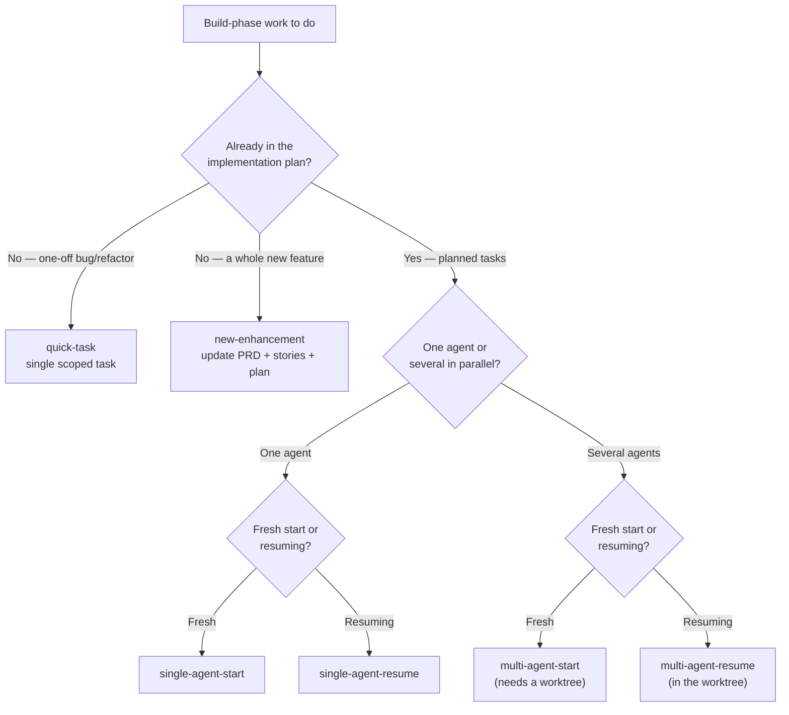

## Why worktrees, not just branches

Several agents implementing the same project at once need two things: a clean
checkout each can build and test in, and a shared history they all merge back
into. A branch alone gives you the second but not the first — switching
branches mutates one working directory, so two agents on two branches in the
same checkout collide on every uncommitted file, every `node_modules`, every
test run.

A **git worktree** solves this: it is an independent working directory backed by
the *same* `.git` repository. Each agent gets its own files and its own checked-out
branch, but commits, refs and history are shared. The layout is one primary
checkout plus one sibling directory per agent:

```text
~/projects/
├── scaffold/                  # primary checkout (you work here)
├── scaffold-alpha/            # worktree for agent "alpha"
└── scaffold-beta/             # worktree for agent "beta"
```

So worktrees give you **filesystem isolation with a shared object store**:
agents never overwrite each other's working files, but a PR merged from one
worktree is immediately visible (after a fetch/rebase) to all the others.

:::callout{type=note}
**One worktree, one branch, one agent.** A branch that is checked out in a
worktree cannot also be checked out in the primary repo — git enforces this.
That constraint is a feature here: it keeps each agent's work pinned to its own
branch.
:::

## Setup — `setup-agent-worktree.sh`

`scripts/setup-agent-worktree.sh <agent-name>` creates a permanent worktree for
one parallel agent. Given a name like `alpha`, it:

1. **Normalizes the name** to a lowercase, hyphenated, alphanumeric slug (so
   `Agent_1` becomes `agent-1`), then derives the worktree directory as a
   *sibling* of the primary repo: `../<repo-name>-<slug>`.
2. **Creates the workspace branch** `<slug>-workspace` if it does not already
   exist :cite[scripts/setup-agent-worktree.sh:40], then adds the worktree on
   that branch :cite[scripts/setup-agent-worktree.sh:44]. Re-running for an
   existing worktree is a safe no-op.
3. **Writes `.scaffold/identity.json`** — the stable identity that build
   observability stamps onto every event this worktree records. The script
   creates `.scaffold/` :cite[scripts/setup-agent-worktree.sh:52] and, only if no
   identity file exists yet, writes `worktree_id` (a UUID), `worktree_label`
   (the agent slug), and `created_at`
   :cite[scripts/setup-agent-worktree.sh:71].
4. **Re-syncs Beads** with a fail-soft `bd doctor --fix` when a `.beads/`
   directory is present :cite[scripts/setup-agent-worktree.sh:88], so the
   worktree shares the main repo's task DB.

The `worktree_id` is what later lets the harvester tell one worktree's ledger
from another's — see the [observability guide](../observability/index.md) for
how identity flows into events.

:::callout{type=tip}
**The identity write is idempotent.** The script only writes
`identity.json` when one is absent, so re-running setup never clobbers an
established worktree id. If you want a fresh id, delete the file first.
:::

## Which build-phase entry point?

Six build-phase commands start or resume implementation work. Pick by two
questions: *is the work already in the plan?* and *is one agent or several
working?*



::::tabs
:::tab{title=Planned work}
**`single-agent-start`** — one agent claims the next planned task, runs the
red-green-refactor loop, opens a PR, repeats. The default entry point when one
agent works the plan sequentially.

**`multi-agent-start <agent-name>`** — establishes a *named* agent inside a git
worktree so several agents run the same loop simultaneously without file
conflicts. Run `setup-agent-worktree.sh <name>` first; this command verifies the
worktree environment before claiming tasks.

**`single-agent-resume`** / **`multi-agent-resume <agent-name>`** — pick these
after a break (context reset, paused session, next day). They recover context —
git state, in-progress work, merged PRs — and continue the loop. The
multi-agent variant additionally verifies the worktree and syncs with main
before resuming.
:::
:::tab{title=Unplanned work}
**`quick-task <description>`** — a single, well-scoped task for a bug fix,
refactor, perf tweak, or small refinement that is *not* in the plan. Produces
one task with acceptance criteria and a TDD test plan; a complexity gate
redirects to `new-enhancement` if the scope turns out to be too large.

**`new-enhancement <description>`** — the full-weight path for a genuinely new
feature: impact analysis, then updates to the PRD and user stories, an
innovation pass, and new implementation tasks that integrate with the existing
plan. Use this when the work deserves stories and acceptance criteria, not just
a task.
:::
::::

Both unplanned entry points feed back into the planned loop: once `quick-task`
or `new-enhancement` has created tasks, an agent picks them up with one of the
`*-start` / `*-resume` commands.

## Working in parallel

Several agents merging to `main` at once is fine if every agent keeps its
footprint small and its branches short. The conflict-prevention rules from
`docs/git-workflow.md` apply directly:

- **Keep branches short-lived** — merge within hours, not days
  :cite[docs/git-workflow.md:131]{mode=advisory}. The longer a branch lives, the
  more `main` drifts underneath it.
- **Rebase frequently** — other agents are merging while you work
  :cite[docs/git-workflow.md:173]{mode=advisory}. Rebase before you touch a file,
  and again before you open the PR.
- **Avoid high-contention files in parallel.** `CLAUDE.md` and shared libraries
  are read or edited by every agent; serialize work on them and rebase first
  rather than editing concurrently :cite[docs/git-workflow.md:125]{mode=advisory}.
- **Don't reformat files you aren't otherwise changing** — gratuitous diffs turn
  into needless conflicts.

Each agent otherwise follows the standard PR workflow from its own worktree:
branch, commit, push, `gh pr create`, wait for CI, squash-merge. The shared
object store means a merge from `scaffold-alpha` is on `main` for everyone the
moment it lands.

## Teardown & harvest

When an agent's work is merged, retire its worktree. The single command for this
is `scripts/teardown-agent-worktree.sh <worktree-path>`, and the **order of
operations is the whole point**.

:::callout{type=danger}
**Harvest the ledger BEFORE removing the worktree — or lose the build record.**
A worktree's `.scaffold/activity.jsonl` lives *inside* that worktree. Once
`git worktree remove` deletes the directory, the ledger goes with it — every
decision, blocker, and task event that worktree recorded is gone, and they were
never on `main` to begin with. The teardown script harvests the ledger into the
primary repo's archive *first* :cite[scripts/teardown-agent-worktree.sh:42] and
only then runs `git worktree remove`
:cite[scripts/teardown-agent-worktree.sh:50]. **Never** call `git worktree
remove` by hand on an agent worktree before harvesting — use the script, which
enforces the ordering.
:::

The script's full sequence:

1. **Resolve the primary repo** from the worktree path via
   `git -C <path> rev-parse --git-common-dir`
   :cite[scripts/teardown-agent-worktree.sh:27], so it works run from anywhere.
2. **Read the worktree's branch name** before anything is removed
   :cite[scripts/teardown-agent-worktree.sh:37].
3. **Harvest the ledger** (fail-soft — a harvest failure prints a warning but
   does not abort the removal) :cite[scripts/teardown-agent-worktree.sh:42].
4. **Remove the worktree** :cite[scripts/teardown-agent-worktree.sh:50].
5. **Delete the workspace branch — with guards.**

### The branch-deletion guards

The script refuses to delete a branch that would harm the primary repo:

- It never deletes the branch the **primary repo currently has checked out**
  :cite[scripts/teardown-agent-worktree.sh:72].
- It never deletes the repo's **default branch** (`main`/`master`, or whatever
  `origin/HEAD` points at) :cite[scripts/teardown-agent-worktree.sh:74]. This
  matters because `gh pr merge --delete-branch` often leaves the merged worktree
  sitting on the default branch — deleting it here would nuke local `main`.
- Otherwise it runs `git branch -D <branch>`
  :cite[scripts/teardown-agent-worktree.sh:77], and if that fails (checked out
  elsewhere, already gone) it just notes it and exits cleanly.

### Recovering orphaned ledgers — `--recover`

If a worktree is removed *without* teardown — `git worktree remove` by hand, a
deleted directory, a crashed machine — its ledger may have been harvested into
the active archive but never finalized, or never harvested at all. Run
`scaffold observe harvest --recover` from the primary repo to sweep up the
strays: it lists the live worktrees, then rotates any active-archive entry whose
worktree is no longer live into the monthly archive. See the
[observability guide](../observability/index.md) for the active-vs-monthly
archive mechanics.

`scaffold observe harvest` must run from the **primary** repo, not from inside a
worktree — the CLI rejects a worktree primary root
:cite[src/cli/commands/observe.ts:187] and warns when the target worktree has no
`identity.json` to key the archive on :cite[src/cli/commands/observe.ts:194].

:::callout{type=note}
**Empty ledgers are fine.** A worktree that never recorded an event has no
`activity.jsonl`; harvest is a clean no-op and teardown proceeds normally.
:::

## Resuming after a break

Coming back to parallel work — a context reset, a paused session, the next
morning — does **not** mean re-running setup. The worktree and its
`identity.json` persist on disk. Instead:

1. Return to the agent's worktree directory (`../<repo>-<agent>`).
2. Run **`multi-agent-resume <agent-name>`** (or `single-agent-resume` for the
   non-worktree case). It verifies the worktree environment, syncs with `main`,
   reconciles task status against any PRs merged while you were away, and
   resumes the TDD loop from wherever the previous session stopped.

Only run `setup-agent-worktree.sh` again if the worktree itself was torn down.
Re-running it on a live worktree is harmless — the identity write is skipped
when `identity.json` already exists — but it does no useful work.

## See also

- [Build Observability](../observability/index.md) — the ledger, harvest, and
  `--recover` archive mechanics this guide defers to.
- `docs/git-workflow.md` §7 — the canonical worktree commands and conflict
  rules :cite[docs/git-workflow.md:150]{mode=advisory}.
