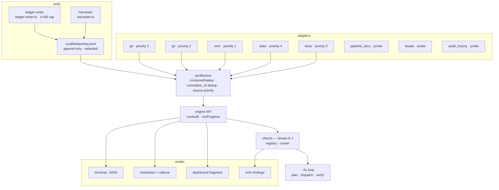
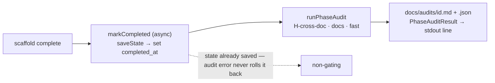
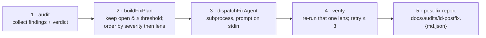
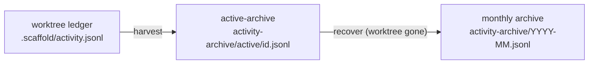

## Why Build Observability exists

When several agents (and humans) build a project in parallel worktrees, the
*reasoning* behind the build evaporates. A decision gets made in a throwaway
branch, a blocker is hit and worked around, a story is silently dropped — and
none of it survives the squash-merge. The docs say one thing; the code drifts to
another. Build Observability turns those ephemeral moments into a durable,
queryable record, then audits the record against the planning docs.

### What goes wrong without it

- **Decisions die at teardown.** An agent records "we switched the cache to
  Redis" in its head, opens a PR, the worktree is removed — and the rationale is
  gone. The next agent re-litigates it.
- **Blockers go unaddressed.** A dependency block is hit at hour 0 and nobody
  notices it is still open at hour 6.
- **Phase boundaries pass unaudited.** `tech-stack.md` is marked complete while
  it still contradicts the PRD; the contradiction is found three phases later.
- **Doc/code drift accumulates.** A component is used outside its declared
  layer; an acceptance criterion never gets a test; a coding-standard erodes
  file by file.

The classic failure mode is a worktree teardown that takes the ledger with it:
an agent worktree's `.scaffold/activity.jsonl` is lost the moment the worktree
is removed, *unless* it is harvested into the primary archive first. The
harvester (`src/observability/engine/harvester.ts`) and
`scripts/teardown-agent-worktree.sh` exist precisely to close this gap — see
[Harvest, recover & teardown](#harvest-recover--teardown).

### What good build observability produces

- **Decisions captured** the moment they're made (`decision_recorded`),
  surviving teardown via harvest.
- **Blockers surfaced** when they linger past a threshold (stall detection).
- **Phase-boundary audits** that run automatically when a planning doc is
  completed, non-gating so they never block progress.
- **Doc/code drift caught** by the nine-lens audit and routed into code review
  via the MMR `doc-conformance` channel.

The system ships **9 durable event types**, **8 adapters** fusing external
signals, a **9-lens audit (A–I)**, and **6 stall signals** on the "Needs
Attention" surface.

:::callout{type=note}
**Two subsystems, one config file.** Build Observability and the separate
*knowledge-freshness* system both read `.scaffold/observability.yaml`. This guide
documents Build Observability; the shared config keys are reconciled in
[Config reference](#config-reference).
:::

## System map

One write path, one fusion point, two read paths. Agents write events to the
append-only ledger; adapters synthesize events from git, GitHub, MMR and
pipeline state; the synthesizer fuses them with correlation-id dedup; the engine
API drives the audit lenses and the progress timeline; renderers emit terminal,
markdown, dashboard and MMR-findings output.



The boxes labelled *probe* (`pipeline_docs`, `beads`, `audit_history`)
contribute availability checks — and, for `audit_history`, trend data — but do
not emit events into the replay timeline. The five remaining adapters (`git`,
`gh`, `mmr`, `state`, `tests`) synthesize replay events that flow into the
synthesizer.

## The ledger

Every durable observation is one JSON object on one line of
`.scaffold/activity.jsonl`. Writes are append-only and lock-guarded so parallel
worktrees never corrupt the file; each event is capped at **4 KiB**; and secrets
and home-directory paths are scrubbed both when the event is written and again
when output is rendered.

### How a write happens

- **Validate** against the per-type payload allow-list
  (`src/observability/engine/event-schemas.ts`). Unknown payload keys are dropped
  (reported in `dropped_fields`); a bad `ts` or missing required field rejects
  the event.
- **Redact** the payload (`src/observability/engine/redact.ts`) — see below.
- **Size-check**: `Buffer.byteLength(line, 'utf8')` must be ≤ 4096, else the
  write throws (:cite[src/observability/engine/ledger-writer.ts:10],
  :cite[src/observability/engine/ledger-writer.ts:58]).
- **Append** under a `proper-lockfile` lock (10 retries, exponential backoff) so
  concurrent agents serialize cleanly.
- **Link (fail-soft)**: a `task_claimed` event with a `task_id` also links the
  task into Beads via `bd` (`beadsAdapter.claimWithEvent`); any Beads error is
  swallowed — the ledger write already succeeded.

### The nine event types

Each event carries a common envelope — `event_id` (ULID), `worktree_id`,
`actor_label`, `branch`, `task_id` (string *or null*), `type`, `ts` (ISO-8601
UTC) — plus a type-specific `payload`. The CLI verb is
`scaffold observe event <type> …`.

:::filter-table
| event_type | payload fields | key constraints |
| --- | --- | --- |
| `task_claimed` | `task_title`*, `story_id`, `wave`, `unplanned` | if `task_id` is null, `unplanned` must be true |
| `task_completed` | `outcome`*, `pr_number`, `commit_sha` | outcome ∈ {pr_submitted, dropped, superseded}; `pr_number` required if pr_submitted |
| `decision_recorded` | `key`*, `summary`*, `affects`* (string[]), `links` | summary ≤ 500 chars; consumed by Lens G |
| `blocker_hit` | `kind`*, `summary`* | kind ∈ {dependency, ambiguity, external, environment}; summary ≤ 500 chars |
| `blocker_resolved` | `summary`*, `references`* (string[]) | closes a prior blocker_hit |
| `pr_opened` | `pr_number`* | positive integer |
| `progress_heartbeat` | `note`* | note ≤ 200 chars; resets task_stale clock |
| `finding_acknowledged` | `finding_id`*, `status`*, `note` | task_id must be null; status ∈ {acknowledged, open}; written by `observe ack` |
| `knowledge_gap_signal` | `topic`*, `source`*, `project_id`*, `step_name`, `agent_excerpt` | topic kebab-case ≤ 80 chars; consumed by Lens I |
:::

`*` marks required fields. Allow-lists live in `EVENT_PAYLOAD_KEYS` at
:cite[src/observability/engine/event-schemas.ts:3-13].

:::callout{type=warning}
**Naming note.** The PR-opened event is `pr_opened` (past tense) in code, not
`pr_open` as the CLAUDE.md prose abbreviates it. The ledger never emits
`pr_open`.
:::

### Building a `scaffold observe event` command

`--branch` is required; `--task-id` is optional (it correlates the event to a
claimed task) but must be *omitted* for `finding_acknowledged` (whose `task_id`
must be null), and a `task_claimed` without one must pass `--unplanned true`.
Payload keys are passed as `--kebab-case` flags, snake-cased before validation;
unknown keys are dropped.

```bash
scaffold observe event task_claimed --branch <branch> --task-id <id> \
  --task-title "<title>" [--story-id <id>] [--wave <n>] [--unplanned true]
scaffold observe event task_completed --branch <branch> --task-id <id> \
  --outcome pr_submitted --pr-number <n> [--commit-sha <sha>]
scaffold observe event decision_recorded --branch <branch> --task-id <id> \
  --key <key> --summary "<text>" --affects "src/**,docs/**" [--links "ADR-1,ADR-2"]
scaffold observe event blocker_hit --branch <branch> --task-id <id> \
  --kind dependency --summary "<text>"
scaffold observe event blocker_resolved --branch <branch> --task-id <id> \
  --summary "<text>" --references "ref1,ref2"
scaffold observe event pr_opened --branch <branch> --task-id <id> --pr-number <n>
scaffold observe event progress_heartbeat --branch <branch> --task-id <id> --note "<text>"
scaffold observe event finding_acknowledged --branch <branch> \
  --finding-id <id> --status acknowledged [--note "<text>"]
scaffold observe event knowledge_gap_signal --branch <branch> \
  --topic <kebab-slug> --source agent_search --project-id <sha256> \
  [--step-name <name>] [--agent-excerpt "<text>"]
```

`finding_acknowledged` is normally written by `scaffold observe ack`, not by
hand.

:::callout{type=note}
**Value coercion** (`src/cli/commands/observe.ts`): `--pr-number` is parsed
numeric (a non-number is dropped); `--unplanned` is boolean (`true` ⇒ true,
anything else ⇒ false); `--affects`, `--links`, `--references` are comma-split
into arrays; everything else stays a string. Exit codes: `0` written · `2`
validation failed / payload > 4 KiB · `3` other error.
:::

### Redaction — write time and render time

Redaction runs twice. **Write-time** redaction (recursive over the payload tree)
scrubs the event before it lands on disk; **render-time** redaction
(`redactEngineOutput` / `redactRendered`) scrubs string values again before any
report is shown, catching anything synthesized after the fact.

Order matters: a bare `ghp_…` matches the GitHub-token pattern, but inside a
`token=…` pair the key/value rule wins first — so `token=ghp_…` redacts to
`[REDACTED:kv-secret]`, not `[REDACTED:github-token]` (leftmost-match
alternation, :cite[src/observability/engine/redact.ts:16]).

| pattern | matches | replacement |
| --- | --- | --- |
| AWS key | `AKIA[0-9A-Z]{16}` | `[REDACTED:aws-key]` |
| GitHub token | `gh[pousr]_[A-Za-z0-9]{36,}` | `[REDACTED:github-token]` |
| key/value secret | key matches `secret\|token\|password\|api[_-]?key` | `[REDACTED:kv-secret]` (key + separator preserved) |
| sensitive object key | object key matches the same pattern | all descendant primitive values masked |
| home path | `/Users/<name>`, `/home/<name>`, `C:\Users\<name>` | `~` (Windows keeps the drive: `C:\~`) |

A redacted `decision_recorded` event on disk (one line, shown pretty-printed):

```json
{
  "event_id":    "01H5ZABCDEFGHJKMNPQRSTVWX",
  "worktree_id": "f47ac10b-58cc-4372-a567-0e02b2c3d479",
  "actor_label": "agent-alice",
  "branch":      "alice-feat/cache",
  "task_id":     "T-014",
  "type":        "decision_recorded",
  "ts":          "2026-05-04T12:00:00Z",
  "payload": {
    "key":     "cache-backend",
    "summary": "Switched to Redis; token=[REDACTED:kv-secret]",
    "affects": ["~/repo/src/cache/**"],
    "links":   ["ADR-021"]
  }
}
```

### Worktree identity

Each worktree gets a stable identity on first write — `.scaffold/identity.json`
holds `worktree_id` (a UUID), `worktree_label` (derived from the directory name,
or `primary`), and `created_at` (`src/observability/engine/identity.ts`). The id
is what lets the harvester tell one worktree's events from another's, and what
stamps every event's `worktree_id`.

## Adapters

The ledger only holds what agents *chose* to record. Adapters fill in the rest by
synthesizing events from the surrounding tools — commits, PRs, MMR jobs, pipeline
state, test runs. There are eight adapters (`AdapterId` at
:cite[src/observability/engine/types.ts:69]), but only five emit events into the
timeline; the other three are availability probes / trend helpers.

:::callout{type=note}
**Five emit, three probe.** `git`, `gh`, `mmr`, `state`, `tests` each implement
`replayEvents()` and appear in the source-priority chain. `pipeline_docs`
(probes 9 planning-doc roles; 5 of them are the canonical-required set that gates
available vs degraded), `beads` (task-tracker linkage), and `audit_history`
(reads `docs/audits/*.json` for trends + lens-skip streaks) do *not* emit replay
events.
:::

| adapter | source of truth | emits | correlation_id / dedup |
| --- | --- | --- | --- |
| `git` | `git log`, `git worktree list` (30 s timeout) | `commit` | none (`null`); per-SHA seen-set within the window |
| `gh` | `gh pr list --state {open,merged,closed}` (needs auth) | `pr_opened`, `pr_merged`, `pr_closed` | `pr:<n>:<state>` — dedups against the ledger's own PR events |
| `mmr` | `.mmr/jobs/*/result.json` (replay keyed on each job's `completed_at`) | `job_completed` | none |
| `state` | `.scaffold/state.json` + `services/*/state.json` | `step_completed`, `step_in_progress` | none; per-step timestamp, mtime fallback |
| `tests` | `.scaffold/last-test-run.json` | `test_run_completed`, `test_run_failed` | none |
| `pipeline_docs` | candidate `docs/*.md` artifact paths | — (probe: available / degraded / unavailable) | n/a |
| `beads` | `.beads/` + `bd` CLI (≥ v1.0.0) | — (task claim ↔ event-id linkage) | n/a |
| `audit_history` | `docs/audits/*.json` (≤ 100 scanned) | — (trends + `lensSkippedStreaks`) | n/a |

### Source priority

When two events describe the same thing (same `correlation_id`), the synthesizer
keeps the one from the most authoritative source. The order is fixed in
`SOURCE_PRIORITY` at :cite[src/observability/engine/synthesizer.ts:254] — lower
number wins, ties broken by earliest `ts`:

| rank | source | why it wins |
| --- | --- | --- |
| `0` | `ledger` | the agent said so — first-party intent |
| `1` | `mmr` | authoritative build verdict |
| `2` | `gh` | GitHub PR state of record |
| `3` | `git` | local commit history |
| `4` | `state` | pipeline step status |
| `5` | `tests` | cached test run |

The three probe-only adapters are intentionally absent from this table — they
never produce a replay event to dedup.

## The nine-lens audit

The audit reads the planning docs (PRD, stories, tech-stack, standards, design
system, plan, playbook) into a document graph, then runs a set of independent
*lenses* over the graph, the code, the ledger and adapter data. The design spec
calls it the "eight-lens audit" (A–H); a ninth lens — `I-knowledge-gaps` —
joined the suite after v3.26.0.

:::callout{type=note}
**8 in the spec, 9 in the code.**
`docs/superpowers/specs/2026-04-30-build-observability-design.md` titles §3 "The
Eight Audit Lenses" and its `LENS_REGISTRY` stops at H. The shipped
:cite[src/observability/engine/checks/registry.ts:44] adds `I-knowledge-gaps`.
Treat Lens I as the ninth lens that joined the suite — documented here as a
first-class member.
:::

### Scope, order and skips

- **Scope → lenses** (:cite[src/observability/engine/api.ts:72]): `--scope code`
  runs **A–G**; `--scope docs` runs **H, I**; `--scope all` runs all nine. An
  explicit `--lens <id>` overrides the scope selection.
- **Registry order**: A → B → C → D → E → F → G → H → I. `G-decisions` declares
  `depends_on: ['D-stack']` so it runs after D and can consume D's
  unsanctioned-dependency findings.
- **Missing adapter → skip**: if a lens's *required* adapters are unavailable it
  is skipped and emits a :sev[P3]{level=p3} finding with
  `evidence.kind = lens_skipped`. Skipped lenses (not blocking findings) are what
  turn a `pass` into a `degraded-pass`.

### What feeds the doc-graph

Before any lens runs, the planning docs and the working tree are parsed into a
single graph (`src/observability/engine/doc-graph/index.ts`). Every lens's
"Reads:" line refers to nodes and edges built here:

| source | parser / detector | graph nodes & edges |
| --- | --- | --- |
| PRD | `parseFeatures` | `features` (with priority) |
| user-stories | `parseStories` | `stories`, `acceptance_criteria`, `feature_to_story` |
| tech-stack | `parseSanctionedComponents` | `components` (with `layer`) |
| coding-standards + tdd-standards | `parseRules` | `rules` |
| design-system | `parseDesignTokens` | `tokens` (priority, category) |
| implementation-plan | `parsePlanTasks` | `plan_tasks`, `story_to_plan_task` |
| implementation-playbook | `parsePlaybookTasks` | `playbook_tasks`, `playbook_task_to_story` |
| ledger + repo | `parseDecisions` | `decisions` |
| working tree | `discoverTests`, `discoverFiles` | `tests` (with `last_status`), `files`, `ac_to_test` |
| source files | `detectCss/JsxTokenUses`, `detectComponentUses` | `file_to_token_use`, `file_to_component_use` |

### All nine at a glance

:::filter-table
| lens | question | scope | severities | ships in |
| --- | --- | --- | --- | --- |
| `A-tdd` | Are tests being skipped? | code | P0 P1 | #331 |
| `B-ac-coverage` | Is every AC covered by a passing test? | code | P0 P1 | #331 |
| `C-standards` | Are coding standards being violated? | code | P0–P3 | #332 |
| `D-stack` | Unsanctioned deps / out-of-layer use? | code | P0 P1 | #332 |
| `E-design` | Ad-hoc values bypassing design tokens? | code | P0 P1 | #332 |
| `F-scope` | High-priority work without a story/plan? | code | P0 P1 P2 | #332 |
| `G-decisions` | Decisions made but not documented? | code | P0 P1 P2 | #332 |
| `H-cross-doc` | Are the docs internally consistent? | docs | P0 P1 P2 | #331 · #336 |
| `I-knowledge-gaps` | Repeated needs with no KB entry? | docs | P1 P2 | #397 · #406 |
:::

### Lens by lens

**A-tdd — TDD violations** (`src/observability/checks/lens-a-tdd.ts`). *Are there
skipped tests?* **Reads:** the doc-graph's discovered tests (with `last_status`),
ACs, stories, and `ac_to_test` edges. **Tunes:** none. **Severity:**
:sev[P0]{level=p0} skipped test on a must-priority story; :sev[P1]{level=p1}
otherwise.

**B-ac-coverage — AC completion**
(`src/observability/checks/lens-b-ac-coverage.ts`). *Is every acceptance
criterion covered by a passing test?* **Reads:** ACs, tests, `ac_to_test` edges;
optional `tests` adapter for live status. **Tunes:** none. **Severity:**
:sev[P0]{level=p0} AC's test is failing; :sev[P1]{level=p1} AC has no test edge
or unknown status.

**C-standards — coding-standards drift**
(`src/observability/checks/lens-c-standards.ts`). *Are coding standards being
violated across files?* **Reads:** graph `rules` + `files`. **Tunes:**
`lenses.C-standards.rule_overrides` (per-rule severity), `escalation_threshold`
(default 5 — more than N violations of a rule escalates to P1).
(`enforce_via_linter` is accepted in config but not read by the lens.)
**Severity:** rule-specific :sev[P0]{level=p0}–:sev[P3]{level=p3}.

**D-stack — tech-stack drift**
(`src/observability/checks/lens-d-stack.ts`). *Unsanctioned dependencies, or
components used outside their layer?* **Reads:** `file_to_component_use` edges,
components (with `layer`), and `decision_recorded` ledger events (which can
sanction a dependency). **Tunes:** `lenses.D-stack.path_to_layer` (default 7
glob→layer mappings). **Severity:** :sev[P0]{level=p0} unsanctioned dependency;
:sev[P1]{level=p1} out-of-layer use.

**E-design — design-system drift**
(`src/observability/checks/lens-e-design.ts`). *Are ad-hoc design values
bypassing tokens?* **Reads:** `file_to_token_use` edges, tokens (with priority +
category). **Tunes:** `lenses.E-design.ad_hoc_token_threshold` (default 3),
`ui_glob` (default `src/components/**/*.tsx`, consumed by the doc-graph builder).
**Severity:** :sev[P1]{level=p1} ad-hoc count over threshold; :sev[P0]{level=p0}
must-priority token category bypassed.

**F-scope — missing scope** (`src/observability/checks/lens-f-scope.ts`). *Is
high-priority work missing stories/plans, or are planned stories untouched?*
**Reads:** features, stories, plan-tasks and their edges; `task_claimed` ledger
events; optional `state` adapter. **Tunes:**
`lenses.F-scope.untouched_story_grace_hours` (default 168 = 7 days). **Severity:**
:sev[P0]{level=p0} must-feature without story/plan; :sev[P1]{level=p1}
should-feature; :sev[P2]{level=p2} planned-but-untouched story past grace.

**G-decisions — undocumented decisions**
(`src/observability/checks/lens-g-decisions.ts`). *Decisions made in the
ledger/commits but not documented (or vice versa)?* **Reads:** graph decisions,
`decision_recorded` events, recent git commits (keyword scan), and D-stack's
findings. **Tunes:** none effective (see note). **Severity:** :sev[P0]{level=p0}
unsanctioned dep from D with no decision; :sev[P1]{level=p1} ledger↔doc mismatch;
:sev[P2]{level=p2} decision-keyword commit with no event/doc.

:::callout{type=warning}
**Inert override.** The spec advertises a `lenses.G-decisions.keywords_file`
override and ships `src/observability/checks/data/decision-keywords.txt`, but
`loadKeywords()` hard-codes its keyword list and never reads the config key or
the file. The override and the bundled file are currently inert.
:::

**H-cross-doc — cross-doc inconsistency**
(`src/observability/checks/lens-h-cross-doc.ts`). *Are features, stories, plans,
playbook and decisions internally consistent?* **Reads:** the full structural
doc-graph + unresolved globs. **Severity:** :sev[P0]{level=p0} decision supersedes
a non-existent decision, or a *must*-priority story uncovered by plan/playbook;
:sev[P1]{level=p1} feature with no story / orphan story / *should*-priority
uncovered story; :sev[P2]{level=p2} plan task not in playbook, unresolved glob.

Under `--profile=full` only, Lens H runs three extra checks via an LLM dispatcher
(all silently return `[]` if the dispatcher fails, so the audit never breaks):

- **tech-stack ↔ PRD** — contradictions (:sev[P0]{level=p0}) or tensions
  (:sev[P2]{level=p2}) between PRD prose and the chosen stack.
- **PRD → stories coverage** — a prose feature with no covering story
  (:sev[P1]{level=p1}).
- **terminology drift** — one concept named inconsistently across docs
  (:sev[P2]{level=p2}).

:::callout{type=danger}
**Security — the LLM dispatcher command is hard-coded.** Lens H passes the
literal `claude -p` (:cite[src/observability/checks/lens-h-cross-doc.ts:164]) into
the shared dispatcher (`src/observability/engine/llm-dispatcher.ts`, which runs
it through a fixed subprocess). The command is *deliberately not*
project-config-overridable, because the audit may run against untrusted
third-party repos and a repo-controlled command would be arbitrary code
execution. Only `llm.timeout_s` (and `llm.parallel_checks`) are configurable.
Contrast the `--fix` dispatcher, which *is* configurable — see
[The --fix flow](#the---fix-flow).
:::

**I-knowledge-gaps — the ninth lens**
(`src/observability/checks/lens-i-knowledge-gaps.ts`). *What topics have agents
repeatedly needed (over a 90-day window) with no knowledge-base entry?* **Reads:**
`knowledge_gap_signal` ledger events + synthetic signals scanned from
`tasks/lessons.md` (`src/observability/checks/lens-i-lessons-scanner.ts`).
**Severity:** :sev[P1]{level=p1} ≥5 signals from ≥3 projects; :sev[P2]{level=p2}
≥3 signals from ≥2 projects.

:::callout{type=note}
**Lens I — `--knowledge-root` and existing-entry suppression.** The lens resolves
the knowledge directory in three tiers (`src/observability/knowledge-index.ts`):
the `--knowledge-root` CLI flag → `lenses.I-knowledge-gaps.knowledge_root` in
config → auto-detect by walking up for `content/knowledge/`. If a gap's topic
slug already exists in the resolved knowledge index, the finding is
**suppressed** (no P1/P2). If no root resolves, suppression is disabled and the
lens warns once per audit. Shipped in #397 (lens + lessons scanner) and #406
(`--knowledge-root` + suppression).
:::

## The `observe audit` CLI

One command runs the lenses and reports findings. Its exit code is the verdict
gate: `0` on a non-blocked verdict (or any `mmr-findings` run), `1` when blocked
or when a `--fix` pass still failed, `3` on an audit error.

### Every flag

| flag | values / default | effect |
| --- | --- | --- |
| `--scope` | `code` · `docs` · `all` (default `all`) | which lens set runs |
| `--lens <id>` | repeatable | run exactly these lenses, overriding scope |
| `--profile` | `fast` (default) · `full` | `full` enables Lens H's LLM-graded sub-checks |
| `--fix` | flag | after auditing, dispatch the fix loop for blocking findings |
| `--fix-threshold` | `P0`–`P3` | override the blocking cutoff for this run |
| `--output=<path>` | path | override markdown destination (sidecar unaffected) |
| `--render` | `dashboard-fragment-audit` | emit HTML to stdout; skip markdown + sidecar |
| `--output-mode` | `mmr-findings` | emit MMR Finding JSON to stdout (always exit 0); skip markdown + sidecar |
| `--knowledge-root=<path>` | path | tier-1 knowledge dir for Lens I suppression |
| `--json` · `--mask-paths` · `--show-acknowledged` · `--since-hours` | flags / N | raw JSON output · redact paths · include acked findings · activity window |

```bash
# A docs-only full audit including LLM-graded checks
scaffold observe audit --scope docs --profile full

# Audit, then dispatch a fix agent for each blocking finding
scaffold observe audit --fix --fix-threshold P1

# Lens I only, with an explicit knowledge root for suppression
scaffold observe audit --lens I-knowledge-gaps --knowledge-root content/knowledge
```

### Verdict taxonomy

The engine computes exactly three verdicts (`Verdict` at
:cite[src/observability/engine/types.ts:6]):

| verdict | when | exit |
| --- | --- | --- |
| :sev[pass]{level=pass} | no blocking findings, no skipped lenses | `0` |
| :sev[degraded-pass]{level=p2} | no blocking findings, but ≥1 lens skipped (missing required adapter) | `0` |
| :sev[blocked]{level=p0} | ≥1 *open* finding at or above `fix_threshold` | `1` |

:::callout{type=note}
**"needs-user-decision" is not an engine verdict.** The code-review workflow has
a `needs-user-decision` outcome, but that is an *MMR review* verdict, not one the
audit engine emits. The audit engine's universe is exactly the three above.
:::

#### `fix_threshold`

A finding is *blocking* when its status is `open` and its severity is at or above
the threshold (`src/observability/engine/checks/fix-threshold.ts`). Resolution
order: `--fix-threshold` flag → `.mmr.yaml`
(`audit_fix_threshold` / `fix_threshold`) → default **P2**. The threshold never
*hides* findings — every finding is still reported; it only decides which ones
count toward `blocked`.

:::callout{type=note}
**How the counts are computed**
(`src/observability/engine/checks/findings-aggregator.ts`): `blocking` counts a
finding only when `status === 'open'` *and* its severity is at or above
`fix_threshold`; `acknowledged` counts only findings silenced by a
`finding_acknowledged` ledger event (latest event per id wins); `skipped`
findings (missing-adapter lenses) ignore acks entirely. The renderers'
`(blocking · ack · total)` line is this tally.
:::

### Companion verb — `scaffold observe ack`

Acknowledge (or reopen) a finding by ID prefix; it writes a
`finding_acknowledged` event the aggregator reads on the next audit.

| arg / flag | effect |
| --- | --- |
| `<prefix-or-id>` | matched against all finding IDs in `docs/audits/*.json`; an ambiguous prefix exits `2` |
| `--status acknowledged｜open` | `acknowledged` (default) silences it; `open` reopens it |
| `--note "…"` | optional rationale recorded on the event |

Branch is auto-derived (`git rev-parse --abbrev-ref HEAD`, fallback `main`); the
event's `task_id` is null.

### Exit codes across `observe` verbs

| verb | 0 | 1 | 2 | 3 |
| --- | --- | --- | --- | --- |
| `audit` | not blocked, or any `mmr-findings` run | blocked, or `--fix` left a blocker | — | audit error (130 on SIGINT mid-`--fix`, snapshot restored) |
| `event` | written | — | validation failed / payload > 4 KiB | other error |
| `ack` | written | — | no match / ambiguous prefix | no audit sidecars / write error |
| `progress` | ok | — | — | markdown/sidecar write error (with `--output`) |
| `harvest` | harvested / recovered | — | — | no `identity.json`, or primary root is itself a worktree |

## Progress, replay & stall

`scaffold observe progress` shows what's in flight. With `--replay` it fuses the
ledger with synthesized git/gh/mmr/state/tests events into one timeline; stall
detection runs at every command boundary and surfaces a "Needs Attention" panel.

### Fusion — how the timeline is built

The synthesizer's `composeReplay`
(:cite[src/observability/engine/synthesizer.ts:294]) converts each ledger `Event`
to a `ReplayEvent`, concatenates the adapter events, filters to the time window,
then dedups:

- Events with a `null` `correlation_id` pass through untouched.
- Events that share a `correlation_id` collapse to one — the synthesizer keeps
  the lowest `SOURCE_PRIORITY` number (`ledger` 0 → `tests` 5), breaking ties by
  earliest `ts`.
- The surviving events sort by `(ts, source-priority, sort_id)`.

So a PR that the agent recorded (`pr_opened` in the ledger) and that the `gh`
adapter also reports collapses to the single ledger event, because `ledger` (0)
outranks `gh` (2).

### Stall detection — the six signals

At every command boundary the engine checks for staleness and builds
`needs_attention` (`src/observability/engine/stall.ts`). The type declares six
signals; **five fire today** — `pr_review_stale` is reserved (deferred pending a
per-PR correlation_id on the mmr adapter,
:cite[src/observability/engine/stall.ts:119]). Thresholds accept `'Nh'`, `'Nd'`,
or `'off'` under `stall.*`:

| signal | fires when | config key · default |
| --- | --- | --- |
| `task_stale` | task claimed, no commit/heartbeat/completion since | `stall.task_stale` · `4h` |
| `pr_stale` | PR opened, not merged/closed | `stall.pr_stale` · `48h` |
| `blocker_unaddressed` | `blocker_hit` with no `blocker_resolved` | `stall.blocker_unaddressed` · `2h` |
| `audit_findings_unresolved` | open finding past threshold age, severity at or above `fix_threshold` | `stall.audit_findings_unresolved` · `24h` |
| `lens_skipped_repeatedly` | a lens skipped on ≥3 consecutive audits | hard-coded streak ≥ 3 (no config key) |
| `pr_review_stale` (reserved) | — not yet emitted — | `stall.pr_review_stale` · `24h` (defined, unused) |

### Flags

| flag | effect |
| --- | --- |
| `--replay` | include the fused timeline in the output |
| `--no-stall-check` | suppress the "Needs Attention" surface (empty `needs_attention`) |
| `--render=dashboard-fragment` | emit the progress HTML panel to stdout; skip markdown + sidecar |
| `--output=<path>` · `--json` · `--since-hours N` | override markdown path · raw JSON · activity window (default 24) |

Stall thresholds are configurable under `stall:` in
`.scaffold/observability.yaml` — see [Config reference](#config-reference).

## Phase-boundary triggers

Completing a planning document should re-check the docs for drift —
automatically, but never blocking the build. When a pipeline step at a phase
boundary is marked complete, the state manager fires a docs audit and prints a
one-line summary.

### The hook

`StateManager.markCompleted()` is **async**
(:cite[src/state/state-manager.ts:175]): it saves state, then awaits
`runPhaseAudit({ primaryRoot, step })` for *every* completed step — the
phase-boundary gate lives inside `runPhaseAudit`, which returns a no-op result
unless the step is one of the six boundaries
(`src/observability/engine/phase-subsets.ts`): `user-stories`, `tech-stack`,
`coding-standards`, `design-system`, `implementation-plan`,
`implementation-playbook`.



The audit is fixed to `H-cross-doc`, `scope=docs`, `profile=fast`
(`src/observability/engine/phase-audit.ts`). It is **non-gating**:
`markCompleted` catches any audit error and returns a result object, so a state
transition never fails because of the audit.

The stdout line:

```text
# normal
[audit] 3 findings (1 blocking, verdict=blocked) — see docs/audits/audit-…-fast-all.md
# detached (fire-and-forget)
[audit] dispatched in background (step: tech-stack)
# timed out
[audit] timed out after 60500ms — partial findings may not be written
```

### Config & timestamps

| key | default | effect |
| --- | --- | --- |
| `phase_audit.enabled` | `true` | master switch |
| `phase_audit.timeout_s` | `60` | race budget; over → `timed_out` |
| `phase_audit.detached` | `false` | fire-and-forget when true |

Step state (`src/types/state.ts`) now carries `completed_at` (set once, on first
completion) and `in_progress_started_at` (set on first entry to in-progress). The
`state` adapter's `replayEvents` prefers these per-step timestamps and only falls
back to the file's mtime when they're absent — so the timeline reflects when each
step actually transitioned, not when the file was last written.

## MMR `doc-conformance` channel

The audit plugs into multi-model review as a built-in channel.
`scaffold observe audit --output-mode=mmr-findings` emits findings in MMR's
`Finding` shape (`src/observability/renderers/mmr-findings.ts`), always exiting 0
so the dispatcher captures stdout regardless of verdict. Only `open` findings are
emitted (acknowledged and skipped are dropped).

### Finding translation

The composite `location` — `<source_doc>::<lens_id>::<short_id>` — gives each
finding a stable identity across audit runs, so MMR can track the same defect
over time.

| MMR field | derived from |
| --- | --- |
| `severity` | `finding.severity` (P0–P3) |
| `location` | `${source_doc \|\| '(no-source-doc)'}::${lens_id}::${id.slice(0,8)}` |
| `description` | `[doc-conformance/${lens_id}] ${title}` + optional `— ${description}` |
| `suggestion` | `fix_hint?.prompt ?? fix_hint?.target ?? ''` |
| `category` | literal `'doc-conformance'` |

A Lens-B engine `Finding` like this:

```json
{
  "id": "3a8c1f0211223344", "lens_id": "B-ac-coverage", "severity": "P0",
  "title": "AC has failing test", "description": "Test refresh.spec.ts is failing.",
  "source_doc": "docs/user-stories.md#user-auth-1",
  "fix_hint": { "prompt": "Re-enable the test", "target": "src/auth/test.spec.ts" }
}
```

translates to this MMR Finding:

```json
{
  "location":    "docs/user-stories.md#user-auth-1::B-ac-coverage::3a8c1f02",
  "severity":    "P0",
  "description": "[doc-conformance/B-ac-coverage] AC has failing test — Test refresh.spec.ts is failing.",
  "suggestion":  "Re-enable the test",
  "category":    "doc-conformance"
}
```

### Enabling it

The `doc-conformance` channel is **disabled by default**. Enable it per-project in
`.mmr.yaml` or for a single run with `--channels=doc-conformance`; if it's
globally enabled you can opt a project out via
`channels_disabled: ["doc-conformance"]`.

```bash
mmr review --channels=doc-conformance --diff <(git diff main...HEAD) --sync --format json
```

Under the hood the channel runs `scaffold observe audit
--output-mode=mmr-findings` and parses its stdout. See the MMR guide
([../mmr/index.md](../mmr/index.md)) for the channel architecture this plugs
into.

## The `--fix` flow

`scaffold observe audit --fix` doesn't just report blocking findings — it
dispatches an agent to fix each one, verifies the fix with a single-lens
re-audit, and writes a post-fix report. The loop is abort-safe: an interrupt
restores the working tree to where it started.



### The five phases

- **1 · audit** — run the audit to get findings and the verdict
  (`src/observability/engine/fix-flow.ts`).
- **2 · `buildFixPlan`** (`src/observability/engine/fix-plan.ts`) — keep findings
  that are `open` and at/above `fix_threshold`, ordered by severity ascending (P0
  first) then `lens_id`.
- **3 · `dispatchFixAgent`** (`src/observability/engine/fix-agent-dispatcher.ts`)
  — spawn the dispatcher command, write the per-finding prompt to stdin, stream
  stdout/stderr to the user.
- **4 · single-lens verify** — re-run only the finding's lens; if the finding is
  gone, mark fixed; else retry, up to `per_finding_max_attempts` (default 3).
- **5 · post-fix report** — a final `scope=all` audit, written to
  `docs/audits/<id>-postfix.{md,json}`.

### Abort safety

Before dispatching, `captureSnapshot`
(`src/observability/engine/abort-snapshot.ts`) records a `git stash create` SHA
plus the set of pre-existing staged files. Newly staged paths are tracked per
attempt. On `SIGINT`, `restoreSnapshot` un-stages what the loop staged and
re-applies the stash — so an interrupted fix leaves a clean, WIP-preserving tree.

### Config — the `fix:` block

| key | default | effect |
| --- | --- | --- |
| `fix.dispatcher_command` | `claude -p` | the agent command (configurable — see note) |
| `fix.timeout_s` | `300` | per-finding subprocess budget |
| `fix.per_finding_max_attempts` | `3` | verify retries before giving up |

:::callout{type=note}
**The fix dispatcher IS configurable — unlike Lens H's.**
`fix.dispatcher_command` is read from project config because the fix loop only
runs against the maintainer's own repo, not untrusted third-party code
(`src/observability/engine/fix-agent-dispatcher.ts`). This is the opposite of the
Lens H LLM dispatcher, which hard-codes its command for untrusted-repo safety.
CLAUDE.md's `--fix` note describing the dispatcher as "not
project-config-overridable" conflates the two.
:::

Exit code: `1` if any blocking finding survived the loop, else `0`.

## Harvest, recover & teardown

A worktree's ledger is local to that worktree. Harvest copies it into the primary
repo's archive before the worktree is removed; recover sweeps up ledgers whose
worktrees vanished without being harvested; teardown does the whole dance in one
command.



### Commands

- **`scaffold observe harvest --worktree=<path>`** — read the worktree's
  `identity.json`, then copy its `activity.jsonl` to
  `.scaffold/activity-archive/active/<worktree_id>.jsonl` in the primary repo
  (atomic temp-file + rename under a lock; keyed by `worktree_id`, idempotent
  full-file replace). Requires the primary root to be a real repo, not itself a
  worktree.
- **`scaffold observe harvest --recover`** — list live worktrees
  (`git worktree list --porcelain`), read each one's `worktree_id`, then scan
  `active/` for entries whose worktree is no longer live and rotate each into
  `activity-archive/<YYYY-MM>.jsonl` (bucketed by the file's mtime), deleting the
  active entry. Returns the rotated ids.
- **`scripts/teardown-agent-worktree.sh <path>`** — derives the primary repo via
  `git -C <path> rev-parse --git-common-dir` (so it works from anywhere),
  harvests (fail-soft), runs `git worktree remove`, then deletes the workspace
  branch if it differs from the primary HEAD.

:::callout{type=note}
**Empty ledgers are fine.** If a worktree never wrote an `activity.jsonl`,
harvest is a clean no-op and teardown proceeds.
:::

## Renderers

One `EngineOutput`, several surfaces. The terminal renderer is for humans at a
prompt; the markdown renderer writes a durable report plus a machine-readable
JSON sidecar; the dashboard-fragment renderer emits an HTML panel that
`scripts/generate-dashboard.sh` injects at named anchors.

Default audit/progress runs write both a markdown report and a JSON sidecar:
audits to `docs/audits/<id>.{md,json}`, progress to
`docs/build-status/<id>.{md,json}` (`src/observability/renderers/sidecar.ts`).
`--render` and `--output-mode` bypass the files and print to stdout instead.

The same blocked audit renders three ways. As terminal ANSI:

```text
build observability — audit
(profile: fast · scope: all)

  [P0] AC has failing test
       lens: B-ac-coverage
       fix:  Re-enable the test

verdict: blocked
(blocking 1 · ack 0 · total 1)
```

As markdown (`docs/audits/<id>.md`):

```text
# Build Observability — Audit

**Verdict:** blocked

## Summary
1 findings · 1 blocking (at or above P2) · 0 acknowledged · 0 skipped lenses

### [P0] B-ac-coverage — AC has failing test
`3a8c1f02` · *source:* `…#user-auth-1` · *confidence:* high
```

As a dashboard fragment, an HTML `<section id="build-audit" data-verdict="blocked">`
panel injected into the dashboard.

| renderer | file | destination | notes |
| --- | --- | --- | --- |
| terminal | `src/observability/renderers/terminal.ts` | stdout | ANSI, "Needs Attention" banner + timeline |
| markdown | `src/observability/renderers/markdown.ts` | `docs/audits/` · `docs/build-status/` | full findings, evidence, fix hints |
| sidecar JSON | `src/observability/renderers/sidecar.ts` | alongside the markdown | redacted `EngineOutput`; read by the `audit_history` adapter |
| dashboard fragment | `src/observability/renderers/dashboard.ts` | stdout → dashboard | sections `build-progress` / `build-audit` injected by `scripts/generate-dashboard.sh` |
| mmr-findings | `src/observability/renderers/mmr-findings.ts` | stdout | MMR Finding shape |

## Config reference

All tunables live in `.scaffold/observability.yaml`. The file is optional — when
absent, `DEFAULT_CONFIG` applies wholesale
(`src/observability/engine/checks/observability-config.ts`). A malformed or
unreadable file *silently* falls back to defaults. Merging is a deep merge where
objects merge key-by-key but **arrays and scalars replace wholesale** — so
setting `disabled_lenses` or `rule_overrides` overwrites the default rather than
extending it.

:::callout{type=warning}
**The shipped example file is misleading.** The repo's
`.scaffold/observability.yaml` contains only `knowledge_freshness.link_check.skip`
and a comment claiming "other observability features read configuration from
elsewhere." In fact the code reads many more keys — the example file simply omits
them because they all have working defaults. The defaults documented here come
from the code, which is ground truth.
:::

:::filter-table
| key | type | default | read by |
| --- | --- | --- | --- |
| `lenses.C-standards.enforce_via_linter` | boolean | `true` | lenses · Lens C |
| `lenses.C-standards.rule_overrides` | map<rule, P0–P3> | `{}` | lenses · Lens C |
| `lenses.C-standards.escalation_threshold` | number | `5` | lenses · Lens C |
| `lenses.D-stack.path_to_layer` | {glob,layer}[] | 7 default mappings | lenses · Lens D |
| `lenses.E-design.ad_hoc_token_threshold` | number | `3` | lenses · Lens E |
| `lenses.E-design.ui_glob` | glob | `src/components/**/*.tsx` | lenses · doc-graph builder |
| `lenses.F-scope.untouched_story_grace_hours` | number | `168` | lenses · Lens F |
| `lenses.G-decisions.keywords_file` | path | — (inert) | lenses · (no reader) |
| `lenses.H-cross-doc.skip_phase_subsets` | string[] | — (inert) | lenses · (no reader) |
| `lenses.I-knowledge-gaps.knowledge_root` | path | auto-detect | lenses · Lens I |
| `disabled_lenses` | string[] | `[]` | lenses · runner |
| `phase_audit.enabled` | boolean | `true` | phase_audit |
| `phase_audit.timeout_s` | number | `60` | phase_audit |
| `phase_audit.detached` | boolean | `false` | phase_audit |
| `stall.task_stale` | 'Nh'·'Nd'·'off' | `4h` | stall |
| `stall.pr_stale` | 'Nh'·'Nd'·'off' | `48h` | stall |
| `stall.pr_review_stale` | 'Nh'·'Nd'·'off' | `24h` (reserved) | stall (signal not yet emitted) |
| `stall.blocker_unaddressed` | 'Nh'·'Nd'·'off' | `2h` | stall |
| `stall.audit_findings_unresolved` | 'Nh'·'Nd'·'off' | `24h` | stall |
| `llm.timeout_s` | number | `60` | llm · Lens H dispatcher |
| `llm.parallel_checks` | boolean | `false` | llm · Lens H |
| `fix.dispatcher_command` | shell command | `claude -p` | fix · dispatcher |
| `fix.timeout_s` | number | `300` | fix |
| `fix.per_finding_max_attempts` | number | `3` | fix |
| `knowledge_freshness.link_check.skip` | string[] | `[]` | knowledge-freshness (separate loader) |
:::

:::callout{type=note}
**No `llm.dispatcher_command`, no `F-scope.wave_budget`.** Two keys you might
expect are deliberately absent. The Lens H LLM command is hard-coded (security) —
there is no `llm.dispatcher_command` key. And there is no wave/phase-budget key at
all: `F-scope` reads only `untouched_story_grace_hours` from this file, so the
"wave budget" CLAUDE.md implies does not exist in the config.
:::

Example:

```yaml
lenses:
  C-standards:
    enforce_via_linter: true
    rule_overrides:
      no-console: P1
  E-design:
    ad_hoc_token_threshold: 5
disabled_lenses: []
phase_audit:
  enabled: true
  timeout_s: 60
stall:
  task_stale: '6h'
fix:
  per_finding_max_attempts: 3
# shared with the knowledge-freshness subsystem
knowledge_freshness:
  link_check:
    skip:
      - platform.openai.com
```

## Where it lives

The whole system lives under `src/observability/`, plus the state-manager hook
and two shell scripts.

| file | purpose |
| --- | --- |
| `src/observability/engine/ledger-writer.ts` | validate → redact → 4 KiB check → locked append |
| `src/observability/engine/event-schemas.ts` | per-type payload allow-lists + validation |
| `src/observability/engine/redact.ts` | write-time + render-time secret/path scrubbing |
| `src/observability/engine/identity.ts` | worktree identity.json |
| `src/observability/engine/harvester.ts` | harvest worktree ledger + `--recover` rotation |
| `src/observability/engine/synthesizer.ts` | composeReplay: fuse + correlation_id dedup + source priority |
| `src/observability/engine/api.ts` | runAudit / runProgress; scope→lens; verdict |
| `src/observability/engine/stall.ts` | the stall signals + Needs-Attention surface |
| `src/observability/engine/phase-audit.ts` | runPhaseAudit + formatPhaseAuditLine |
| `src/observability/engine/phase-subsets.ts` | PHASE_BOUNDARY_STEPS + isPhaseBoundary |
| `src/observability/engine/fix-flow.ts` | the five-phase `--fix` loop |
| `src/observability/engine/fix-plan.ts` | buildFixPlan: filter + order findings |
| `src/observability/engine/fix-agent-dispatcher.ts` | configurable subprocess fix dispatcher |
| `src/observability/engine/abort-snapshot.ts` | capture/restore git stash on SIGINT |
| `src/observability/engine/llm-dispatcher.ts` | hard-coded `claude -p` for Lens H full profile |
| `src/observability/engine/types.ts` | Verdict, AdapterId, EngineOutput, Finding |
| `src/observability/engine/checks/registry.ts` | LENS_REGISTRY (A–I) + implementations |
| `src/observability/engine/checks/fix-threshold.ts` | resolve fix_threshold (default P2) |
| `src/observability/engine/checks/findings-aggregator.ts` | tally blocking/acked; compute verdict |
| `src/observability/engine/checks/observability-config.ts` | DEFAULT_CONFIG + deep-merge loader |
| `src/observability/engine/doc-graph/index.ts` | build the doc graph from planning docs |
| `src/observability/checks/lens-a-tdd.ts` | A · skipped tests |
| `src/observability/checks/lens-b-ac-coverage.ts` | B · AC ↔ test coverage |
| `src/observability/checks/lens-c-standards.ts` | C · coding-standards drift |
| `src/observability/checks/lens-d-stack.ts` | D · tech-stack drift |
| `src/observability/checks/lens-e-design.ts` | E · design-system drift |
| `src/observability/checks/lens-f-scope.ts` | F · missing scope |
| `src/observability/checks/lens-g-decisions.ts` | G · undocumented decisions |
| `src/observability/checks/lens-h-cross-doc.ts` | H · cross-doc consistency + LLM checks |
| `src/observability/checks/lens-i-knowledge-gaps.ts` | I · knowledge gaps |
| `src/observability/checks/lens-i-lessons-scanner.ts` | scan tasks/lessons.md for gap signals |
| `src/observability/knowledge-index.ts` | resolveKnowledgeRoot (3 tiers) + index for Lens I |
| `src/observability/renderers/terminal.ts` | ANSI output |
| `src/observability/renderers/markdown.ts` | markdown report |
| `src/observability/renderers/dashboard.ts` | build-progress / build-audit HTML fragments |
| `src/observability/renderers/sidecar.ts` | JSON sidecar + report-id derivation |
| `src/observability/renderers/mmr-findings.ts` | MMR Finding shape |
| `src/state/state-manager.ts` | async markCompleted → runPhaseAudit hook |
| `scripts/teardown-agent-worktree.sh` | harvest → remove → delete branch |
| `scripts/generate-dashboard.sh` | injects the dashboard fragments |

The full design lives in
`docs/superpowers/specs/2026-04-30-build-observability-design.md`.

## Shipping history

Build Observability shipped as eight plans (Foundation → Fix-flow), released
together as `v3.26.0 — Build Observability` on 2026-05-07, with Lens I and
refinements following after.

:::filter-table
| plan | subsystem | squash | PR | added to the on-disk surface |
| --- | --- | --- | --- | --- |
| spec + plans | design doc + 8 plans | `5cf689c4` | #319 | `docs/superpowers/specs` + 8 plan files |
| 1 · Foundation | identity, validation, redaction, ledger, harvester, adapters, synthesizer, API, CLI, renderers | `21124010` (+ #320–328) | #320–329 | most of `src/observability/engine`, `adapters`, `renderers`; `scaffold observe` |
| 2 · Audit MVP | doc-graph, checks framework, lenses A/B/H, `audit`+`ack` | `8eb70986` | #331 | `engine/doc-graph`, `engine/checks`, `lens-a/b/h` |
| 3 · Full lens suite | lenses C/D/E/F/G + registry + config | `bd014634` | #332 | `lens-c…g`, `registry.ts`, `.scaffold/observability.yaml` |
| 4 · Renderers + history | markdown, JSON sidecars, dashboard fragments, audit-history | `37f63ae4` | #333 | `docs/build-status`, `docs/audits`, `audit-history` adapter |
| 5 · Replay + stall | replay timeline, stall detection, Lens G keyword scan | `cdbfd1de` | #334 | `synthesizer.composeReplay`, `stall.ts`, Needs-Attention surfaces |
| 6 · Phase triggers | `markCompleted` async → `runPhaseAudit` | `ff04a1a6` | #335 | `phase-audit.ts`, `phase-subsets.ts`, step timestamps |
| 7 · MMR channel | `doc-conformance` channel + Lens H full-profile LLM checks | `8b723617` | #336 | `mmr-findings.ts`, `llm-dispatcher.ts`, Lens H sub-checks |
| 8 · Fix flow + teardown | `--fix` loop, `harvest --recover`, teardown script | `06fca3ef` (v3.26.0) | #337 | `fix-flow.ts`, `fix-plan.ts`, `fix-agent-dispatcher.ts`, `abort-snapshot.ts`, `teardown-agent-worktree.sh` |
| follow-on | Lens I — knowledge gaps + lessons scanner | `31e45f03` | #397 | `lens-i-knowledge-gaps.ts`, `lens-i-lessons-scanner.ts` |
| follow-on | Lens I — `--knowledge-root` + existing-entry suppression | `46a47037` | #406 | `knowledge-index.ts` resolver tiers |
| follow-on | TypeScript cleanup (`as never` → typed `isOneOf`) | `362c7f93` | #411 | type-safety refactor across observability |
:::

## Known divergences

The audit's own rule — "code is ground truth where it disagrees with the spec or
the docs" — surfaced these mismatches. They are deferred findings to resolve in
the code/docs:

- **9 lenses, not 8.** The design spec and CLAUDE.md enumerate A–H;
  `I-knowledge-gaps` shipped and is registered.
- **`pr_opened` vs `pr_open`.** CLAUDE.md abbreviates the event type as
  `pr_open`; the code only emits `pr_opened`.
- **Three engine verdicts, not four.** `needs-user-decision` is an MMR review
  verdict; the audit engine emits only `pass` / `degraded-pass` / `blocked`.
- **Fix-dispatcher security note conflated.** CLAUDE.md's `--fix` note calls the
  dispatcher "not project-config-overridable"; in fact `fix.dispatcher_command`
  is configurable, while it's the *Lens H LLM* dispatcher that is hard-coded.
- **`pr_review_stale` reserved.** The sixth stall signal has a config default but
  is not yet emitted (deferred pending a per-PR correlation_id on the mmr
  adapter).
- **Inert config keys.** `lenses.G-decisions.keywords_file` and
  `lenses.H-cross-doc.skip_phase_subsets` are typed but unread; the bundled
  `decision-keywords.txt` is not loaded.
- **No `F-scope.wave_budget` key.** CLAUDE.md implies a wave budget in
  `observability.yaml`; in fact no wave/phase budget is read anywhere — Lens F
  reads only `untouched_story_grace_hours`.
- **`ui_glob` default narrower than spec.** Spec default covers
  `{tsx,jsx,vue,svelte}` + styles; shipped default is just
  `src/components/**/*.tsx`.
