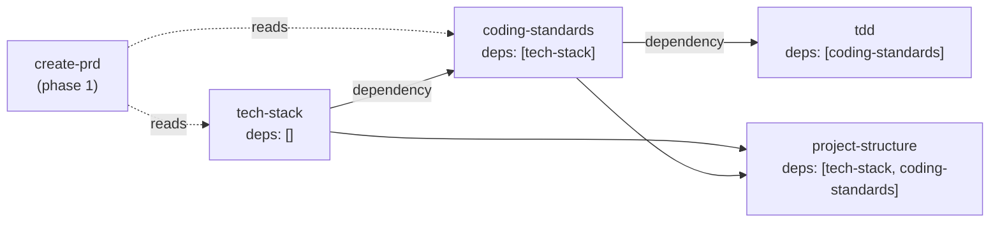

## The mental model

Scaffold is a **prompt pipeline**: a curated, ordered sequence of structured
meta-prompts that turn an idea into a fully-specified, build-ready project. Each
meta-prompt is a markdown file under `content/pipeline/`; the CLI assembles one
into a full prompt at runtime (injecting upstream artifacts, knowledge entries,
and depth instructions) and hands it to Claude Code or another AI tool.

The pipeline divides cleanly into two regimes:

- **Planning (phases 0–14)** — *stateful*, *sequential* steps. Each produces a
  durable artifact (a vision doc, a PRD, a tech-stack doc, an implementation
  plan…). The CLI tracks completion in `.scaffold/state.json`, enforces
  dependencies, and detects when you re-run a step (UPDATE mode). You run each
  step roughly once, in dependency order, working *toward* a frozen spec.
- **Build (phase 15)** — *stateless*, *on-demand* steps. These are the execution
  loops (single-agent, multi-agent), the resume commands, quick-task, and
  new-enhancement. They carry no completion state and can be run repeatedly
  (`stateless: true` in frontmatter — :cite[src/types/frontmatter.ts:126]). You
  run these *over and over* while actually writing code.

The 16 phases are the single source of truth in code: the `PHASES` constant
(:cite[src/types/frontmatter.ts:6]) defines every slug, number, and display
name. Everything in this guide is anchored to it.

:::callout{type=note}
**90 meta-prompts, not 90 steps you run.** The pipeline directory holds 90 files
across 16 phase directories, but most projects run only a fraction. Game,
multi-service, and platform-specific steps are disabled unless an overlay turns
them on, and many steps are conditional (see [Methodology & depth](#methodology--depth)).
:::

## The 16 phases at a glance

Phase numbers and display names below are quoted verbatim from the `PHASES`
constant (:cite[src/types/frontmatter.ts:6]). Phases 0–14 are planning; phase 15
is the stateless build phase.

:::filter-table
| # | slug | name | what it produces |
| --- | --- | --- | --- |
| 0 | `vision` | Product Vision | A strategic vision document — who it's for, what's different, what success looks like |
| 1 | `pre` | Product Definition | The PRD, then user stories with testable acceptance criteria |
| 2 | `foundation` | Project Foundation | Tech-stack decisions, coding standards (+ linter configs), TDD strategy, project structure |
| 3 | `environment` | Development Environment | One-command dev env, design system (web), git workflow + CI, optional PR review, AI memory |
| 4 | `integration` | Testing Integration | E2E setup — Playwright (web) or Maestro (mobile); auto-skips for backend-only |
| 5 | `modeling` | Domain Modeling | Core entities, relationships, invariants, domain events — a shared vocabulary |
| 6 | `decisions` | Architecture Decisions | An ADR per significant technology/design decision, with alternatives + rationale |
| 7 | `architecture` | System Architecture | The system blueprint — components, data flow, where code lives, extension points |
| 8 | `specification` | Specifications | Per-layer interface specs — DB schema, API contracts, UX spec (each conditional) |
| 9 | `quality` | Quality Gates | Testing review, test skeletons, evals, operations/deploy plan, security review |
| 10 | `parity` | Platform Parity | Cross-platform gap audit (multi-platform only; auto-skips otherwise) |
| 11 | `consolidation` | Consolidation | CLAUDE.md optimization + workflow-doc consistency audit |
| 12 | `planning` | Planning | The implementation plan — stories decomposed into small, dependency-ordered tasks |
| 13 | `validation` | Validation | Seven cross-cutting pre-implementation audits (scope, cycles, traceability, …) |
| 14 | `finalization` | Finalization | Apply validation fixes, freeze docs, onboarding guide, implementation playbook |
| 15 | `build` | Build | Stateless execution loops — single/multi-agent, resume, quick-task, new-enhancement |
:::

Each step's `order` is phase-aligned: phase N occupies the N00–N99 band
(`tech-stack` is `220`, `coding-standards` is `230`, `single-agent-start` is
`1510`). The order field is the primary tiebreaker in the topological sort, so
within a phase steps run in `order` sequence.

The arrows show the *phase* progression, not the exact step-level dependency
graph — a single step usually depends on one upstream step, not its whole
phase. See [Why a step is blocked](#why-a-step-is-blocked) for how dependencies
actually gate execution.

## Methodology & depth

Two orthogonal knobs control how much of the pipeline runs and how thoroughly:

1. **Preset** — *which* steps are enabled. Three presets ship
   (`content/methodology/`): `mvp`, `custom` (balanced, depth 3), and `deep` (the
   schema default).
2. **Depth** — *how thorough* each enabled step's output is, on a 1–5 scale.

### Depth (1–5)

Every depth level dials the same step from a sketch to an exhaustive document.
Each step's `## Methodology Scaling` section spells out its behavior per level —
`coding-standards` at depth 1 is "core naming conventions, commit format, import
ordering, 1–2 pages"; at depth 5 it's "full suite with all sections, custom
linter rules, and code review checklist, 15–20 pages."

:::filter-table
| depth | name | what you get |
| --- | --- | --- |
| 1 | Minimal | Bare minimum to start building |
| 2 | Light | Slightly more detail; still speed-first |
| 3 | Balanced | Recommended default — good coverage, no excess |
| 4 | Thorough | Comprehensive; review/validation steps add external-model validation (Codex/Gemini) where their Methodology Scaling declares it |
| 5 | Exhaustive | Maximum detail; multi-model reconciliation on the steps that opt into it; for critical/regulated work |
:::

External-model / multi-model dispatch at depth 4–5 is **step-specific** — it
applies to the prompts whose `## Methodology Scaling` section declares it
(chiefly the `review-*` / `innovate-*` / validation steps). For most authoring
steps, higher depth just means a more thorough single-model output.

Depth 3 is the inflection point where steps start adding structure,
cross-references, and validation beyond the basics. Override depth per run with
`scaffold run <step> --depth N`.

### The three presets

::::tabs
:::tab{title="mvp (depth 1)"}
**Ship fast with minimal ceremony.** Only the essential planning steps are
enabled: vision, PRD + stories (with reviews), tech-stack, coding-standards,
tdd, project-structure, dev-env-setup, implementation-plan, and
implementation-playbook — then the build loops. Everything else (domain
modeling, ADRs, architecture, specs, quality gates, validation) is **disabled**.
This is the *minimum safe depth*: still enough spec to TDD against, but no
ceremony you'd skip on a weekend project.
:::
:::tab{title="custom (depth 3)"}
**Balanced.** Most steps are enabled at depth 3. The exceptions:
the three `innovate-*` steps and `automated-pr-review` are off by default, and
the conditional steps (`beads`, `design-system`, `add-e2e-testing`, the spec
steps, `platform-parity-review`) are enabled-but-`if-needed`. You override
individual steps to taste.
:::
:::tab{title="deep (depth 5)"}
**Maximum quality — and the schema default** (`methodology` defaults to `deep`
:cite[src/config/schema.ts:272]; the resolver also falls back to `deep`). *Every*
planning step is enabled, including the
`innovate-*` steps (as `if-needed`), domain modeling, ADRs, full architecture,
all specs, every quality gate, all seven validation audits, and the full
finalization phase. External-model dispatch kicks in at depth 4+. Best for
complex or regulated systems.
:::
::::

:::callout{type=note}
**Game / multi-service / platform steps are off in all three presets.** The 24
game steps and 5 cross-service steps are `enabled: false` in `mvp`, `custom`,
*and* `deep`. They only switch on via a **project-type overlay** — see the
playbooks below.
:::

## Project-type playbooks

Overlays (`content/methodology/*-overlay.yml`) layer onto a preset. Most overlays
only **inject domain knowledge** into existing steps (so a web-app build pulls in
`web-app-auth-patterns` during `tech-stack`, `security`, etc.); a few also
**enable whole step families**.

::::tabs
:::tab{title="Web app"}
`web-app-overlay.yml` is knowledge-only — it appends web-app expertise to
~25 steps (rendering strategies + deployment + auth into `tech-stack`, UX
patterns into `ux-spec`, the design system into `design-system`, and so on). The
spec steps you'll actually use: `database-schema`, `api-contracts`, `ux-spec`
(all conditional). `add-e2e-testing` configures **Playwright**.
:::
:::tab{title="Mobile / Expo"}
`mobile-app-overlay.yml` injects mobile knowledge the same way. The distinctive
piece is `add-e2e-testing`, which auto-detects the platform and wires up
**Maestro** for mobile/Expo instead of Playwright (phase 4 — `integration`).
:::
:::tab{title="Game"}
`game-overlay.yml` is the heavyweight: it **enables a whole phase family** via
`step-overrides`. On come `game-design-document`, `review-gdd`,
`performance-budgets`, `narrative-bible`, `netcode-spec`, `ai-behavior-design`,
`art-bible`, `audio-design`, `economy-design`, `save-system-spec`,
`game-ui-spec`, `playtest-plan`, `platform-cert-prep`, and more — many as
`if-needed`. These live across the `pre`, `architecture`, `specification`, and
`quality` phases.
:::
:::tab{title="Multi-service"}
`multi-service-overlay.yml` activates when `services[]` is present in config. It
enables five cross-service steps (`service-ownership-map`,
`inter-service-contracts`, `cross-service-auth`, `cross-service-observability`,
`integration-test-plan`) and — crucially — adds **dependency-overrides** and
**reads-overrides** so downstream steps wait for and consume those cross-service
artifacts. Use `scaffold next --service <name>` to drive a single service.
:::
:::tab{title="CLI / library"}
`cli-overlay.yml` (and `library-overlay.yml`) are knowledge-only. They append
CLI expertise — command parsing, distribution, shell integration, output
formatting — into `tech-stack`, `system-architecture`, `api-contracts`,
`operations`, etc. No extra steps are enabled; you mostly skip the UX/design and
(often) the database spec steps.
:::
::::

Other shipped overlays include backend, data-pipeline, data-science, ML,
web3, browser-extension, and several research presets — all under
`content/methodology/`.

## Navigating the pipeline

The CLI is your driver. Every command lives in `src/cli/commands/`.

:::filter-table
| command | what it does | source |
| --- | --- | --- |
| `scaffold next` | Show the next eligible step(s) — what's unblocked right now | :cite[src/cli/commands/next.ts:28-29] |
| `scaffold run <step>` | Assemble + run a step; on completion, advances state | :cite[src/cli/commands/run.ts:45] |
| `scaffold complete <step>` | Mark a step done that you ran outside `scaffold run` | :cite[src/cli/commands/complete.ts:28] |
| `scaffold skip <step..>` | Skip one or more steps (treated as satisfied for deps) | :cite[src/cli/commands/skip.ts:35] |
| `scaffold rework` | Re-run steps **by phase** for depth improvement or cleanup | :cite[src/cli/commands/rework.ts:39-40] |
| `scaffold reset [step]` | Reset one step to pending, or wipe all pipeline state | :cite[src/cli/commands/reset.ts:32] |
| `scaffold status` | Show overall progress and per-step statuses | :cite[src/cli/commands/status.ts:80-81] |
:::

A typical loop: `scaffold next` to see what's unblocked → `scaffold run <step>`
→ repeat. `next` is a pure read — it derives eligibility live from the graph +
state and deliberately does *not* mutate `state.json`, so running it after an
upgrade won't churn committed state.

**`rework`** is phase-scoped: `scaffold rework --through 5` re-runs phases 1–5,
`--phases 2,7` re-runs just those, `--exclude 3` drops a phase, `--depth 5`
bumps depth for the batch. It batch-resets the selected steps to `pending` and
creates a rework session the runner skill walks through.

For build-phase work you don't touch `next`/`complete` — the stateless steps
(`single-agent-start`, `multi-agent-start`, the resume commands, `quick-task`,
`new-enhancement`) are run on demand and never tracked. See the
[concepts guide](../concepts/index.md){mode=advisory} and the
[CLI reference](../cli/index.md){mode=advisory} for the full command surface.

## Why a step is blocked

A step becomes *eligible* only when its **dependencies** are satisfied. The
frontmatter distinguishes two relationships, and they behave very differently:

- **`dependencies`** (:cite[src/types/frontmatter.ts:114]) — **hard gates.**
  `scaffold run` refuses a step whose deps aren't `completed` or `skipped`,
  exiting with `DEP_UNMET` (:cite[src/cli/commands/run.ts:262-281]). `coding-standards`
  declares `dependencies: [tech-stack]`, so you can't write standards before you
  pick a stack.
- **`reads`** (:cite[src/types/frontmatter.ts:122]) — **soft references.** A step
  *reads* an upstream artifact if it's available, but a missing/incomplete read
  never blocks execution — the assembler silently skips it
  (:cite[src/cli/commands/run.ts:413-421]). `coding-standards` *reads*
  `create-prd` so the domain informs which patterns matter, but a missing PRD
  won't stop it.

:::callout{type=warning}
**`reads` ≠ `dependencies` — and that trips people up.** Because reads don't gate
execution, a step can run "successfully" while silently missing context it would
have benefited from. If you `skip` an upstream step, downstream steps that only
*read* it proceed without warning. When ordering matters, an overlay can promote
a read into a `dependency` (the multi-service overlay does exactly this with its
`dependency-overrides`).
:::

### Conditional ("if-needed") steps

A step with `conditional: 'if-needed'`
(:cite[src/types/frontmatter.ts:118]) is enabled but only *applies* to certain
project shapes. `database-schema` is `conditional: "if-needed"`
(:cite[content/pipeline/specification/database-schema.md:10]) — it runs only if
your project has a database layer. The spec steps (`database-schema`,
`api-contracts`, `ux-spec`), `add-e2e-testing`, `design-system`, `beads`, and
`platform-parity-review` are all conditional in the default presets.

:::callout{type=warning}
**The silent-skip trap.** Conditional steps that don't apply, and steps you
`skip` manually, both count as "satisfied" for dependency purposes — so the
pipeline keeps flowing and `scaffold next` shows green. That's by design, but it
means *the pipeline won't warn you that you skipped something important.* If
`ux-spec` is skipped on a project that genuinely has a UI, nothing downstream
will block; the gap only surfaces in phase 13 validation (or the build
observability audit). Run `scaffold status` to see what was actually
skipped vs completed.
:::

### A representative dependency slice

The phase-2 foundation steps show the gating in miniature: `tech-stack` has no
dependencies (it kicks off the foundation), and `coding-standards` depends on it.

Solid arrows are hard `dependencies` (block until done); dashed arrows are soft
`reads` (used if present, never block).

## CREATE vs UPDATE mode

Running a planning step a second time doesn't blindly overwrite its artifact.
Every document-creating prompt carries a **Mode Detection** block: if the output
file already exists, the step runs in **UPDATE mode** instead of CREATE mode.

`scaffold run` detects this and (unless `--force`) confirms before re-running a
completed step, and warns on a depth *downgrade* (re-running at a lower depth
than last time). In UPDATE mode the prompt is instructed to **preserve**
human/team customizations and only change what genuinely needs to change. From
`coding-standards`'s Mode Detection block
(:cite[content/pipeline/foundation/coding-standards.md:57]):

> Update mode if `docs/coding-standards.md` exists. In update mode: preserve
> naming conventions, lint rule customizations, commit message format, and
> project-specific patterns.

So re-running `coding-standards` after you've hand-tuned its linter config keeps
your overrides; it doesn't reset them. This is what makes the planning phases
safe to iterate — you can `rework` a phase at higher depth and get richer
output without losing the decisions you've already made.

:::callout{type=note}
**Phase-15 steps don't use the planning CREATE-vs-UPDATE semantics.** They produce
no persistent planning doc, so the document Mode Detection block doesn't apply.
Each build prompt instead declares its own execution mode: the agent loops just
execute, `single-agent-resume`/`multi-agent-resume` run in RESUME mode,
`quick-task` in CREATE mode, and `new-enhancement` in ENHANCEMENT mode.
:::

## Phase-boundary audits

Completing certain planning docs automatically triggers a non-gating
cross-document audit. Six steps are **phase boundaries**
(:cite[src/observability/engine/phase-subsets.ts:1-8]): `user-stories`,
`tech-stack`, `coding-standards`, `design-system`, `implementation-plan`, and
`implementation-playbook`. When you `complete` one of these, the state manager
fires an `H-cross-doc` audit and prints a one-line summary — catching doc drift
the moment a planning phase closes, without ever blocking the transition. See
the [build observability guide](../observability/index.md){mode=advisory} for
how that audit works and what the nine lenses check.

## Where it all lives

| path | what it holds |
| --- | --- |
| `content/pipeline/<phase>/*.md` | The 90 meta-prompt files, one directory per phase |
| `content/methodology/*.yml` | Presets (`mvp`, `custom-defaults`, `deep`) + project-type overlays |
| `content/knowledge/` | Domain entries injected into prompts during assembly |
| `src/types/frontmatter.ts` | The canonical `PHASES` constant + frontmatter schema |
| `src/cli/commands/` | `next`, `run`, `complete`, `skip`, `rework`, `reset`, `status` |
| `.scaffold/state.json` | Per-step completion state (planning phases only) |

The phase list, ordering, and slugs are defined exactly once, in `PHASES`
(:cite[src/types/frontmatter.ts:6]); every doc, skill, and command resolves
against it.
