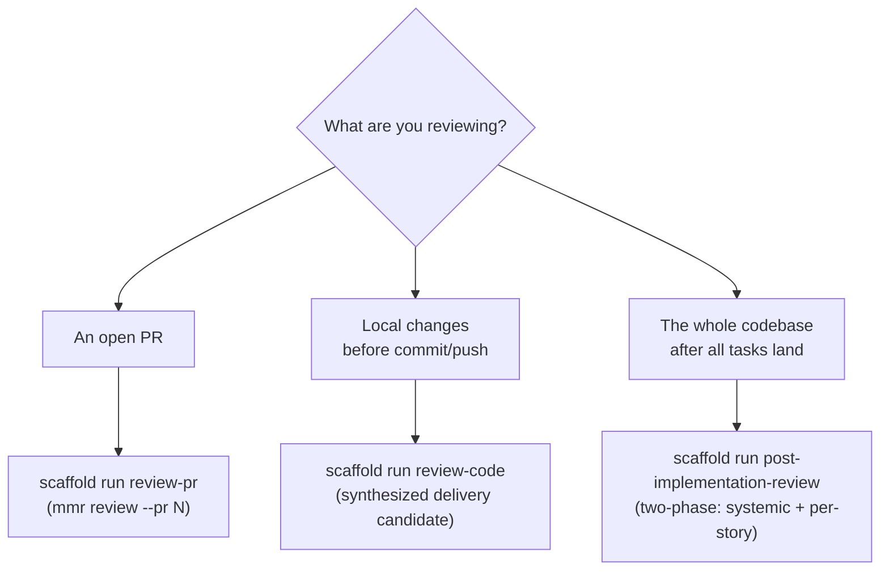
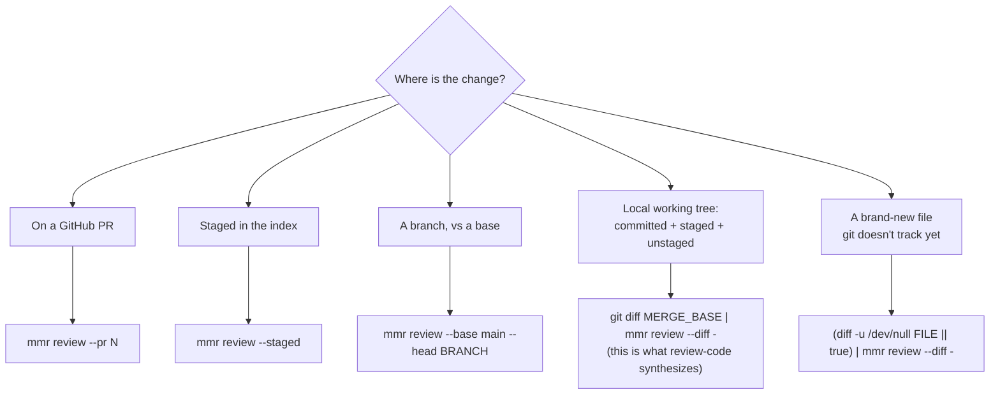

## What this guide covers

This is the **workflow** around multi-model review: *when* to review, *which*
entry point to reach for, *which* input mode matches your target, how to read
the verdict, and how the fix loop is bounded. It does **not** re-explain the
review engine itself — channels, reconciliation, the `finding_key`, the verdict
algorithm, and `.mmr.yaml` all live in the [MMR reference](../mmr/index.md).
Read that guide for "what is a channel"; read this one for "I have a change, now
what do I run."

:::callout{type=tip}
**Two layers.** `mmr review` is the engine. `scaffold run review-pr` and
`review-code` are *workflow wrappers* on top — they pick the input mode, add the
Superpowers code-reviewer agent channel via `mmr reconcile`, handle auth
recovery, and bound the fix loop. `post-implementation-review` is a separate,
release-time full-codebase review with its own flow (see Step 1). This guide is
about driving those entry points; the engine details are in
[the MMR reference](../mmr/index.md).
:::

## Step 1 — Pick the entry point

Two of these are wrappers over `mmr review` — `review-pr` and `review-code` —
sharing the same engine and verdict semantics, differing in *scope* and *what
they synthesize*. `post-implementation-review` is **not** a `mmr review` wrapper:
it's an independent release-time review of the whole codebase that runs its own
channel flow and writes its own report under `docs/reviews/`, with MMR
reconciliation only as an optional add-on. Consult its own doc for specifics.

| Entry point | Target | Notes |
| --- | --- | --- |
| `scaffold run review-pr` | One PR (`--pr N`, auto-detected from the branch) | **MMR wrapper.** Adds the Superpowers agent channel and native round-bounding (`--session`/`--round`/`--max-rounds`) over a bare `mmr review`. |
| `scaffold run review-code` | Local pre-push: committed branch diff + staged + unstaged, as one synthesized "delivery candidate" | **MMR wrapper.** Adds the same agent channel and native round-bounding, scoped to the local delivery candidate. **Untracked files are not covered.** |
| `scaffold run post-implementation-review` | The full implemented codebase against stories + standards | **Independent, not an MMR wrapper.** A release-time review (systemic sweep + per-story functional review via parallel agents) with its own report under `docs/reviews/`; MMR injection is optional. Consult its own doc. |

:::callout{type=note}
**The mandatory one.** After `gh pr create`, running `review-pr` is mandatory
before moving to the next task (a PostToolUse hook reminds you).
`review-code` is the recommended preflight before a push but isn't gated.
`post-implementation-review` is a release-time sweep, not a per-change gate.
:::

### When no wrapper fits

The wrappers are conveniences, not gates on the engine. For any target a wrapper
doesn't cover — a branch range, an existing patch file, a single doc — call
`mmr review` directly with the matching input flag. The
[MMR reference](../mmr/index.md) lists every flag; the next step is the workflow
view of the same choice.

## Step 2 — Choose the input mode

`mmr review` resolves a diff from exactly one input source. Pick the one that
describes your target. The `--diff -` (stdin) form is the universal escape hatch:
anything you can express as a unified diff, you can pipe in.

| Target | Command | Notes |
| --- | --- | --- |
| A PR | `mmr review --pr 123` | Fetches the diff via `gh pr diff`. This is `review-pr`'s mode. |
| Staged changes | `mmr review --staged` | Just the index (`git diff --cached`) — the pre-commit slice. |
| A branch range | `mmr review --base main --head "$BRANCH"` | Committed work only; no staged/unstaged. |
| Full delivery candidate | `git diff "$MERGE_BASE" \| mmr review --diff -` | Committed branch diff + staged + unstaged in one patch. `review-code` synthesizes this for you. |
| A single tracked file's pending edits | `git diff HEAD -- path/file.ts \| mmr review --diff -` | Fails with "no diff content" if the file has no local changes — use the next row. |
| A brand-new / untracked file | `(diff -u /dev/null path/file.ts \|\| true) \| mmr review --diff -` | Synthesizes an "all-added" diff from current contents. |
| An existing patch | `mmr review --diff path/changes.patch` | Reads diff-format content directly. |

:::callout{type=danger}
**Untracked files are silently skipped — this is the trap.** `review-code`
reviews the committed branch diff plus staged and unstaged changes *to tracked
files*. A brand-new file you've never `git add`-ed is **not** in any of those
diffs, so it sails through review with zero findings — not because it's clean,
but because no channel ever saw it. To review a new file, pipe it in explicitly:
`(diff -u /dev/null path/to/new-file.ts || true) | mmr review --diff -`. The
`|| true` guard is required: `diff` exits non-zero whenever files differ, which
would otherwise kill the pipeline under `set -o pipefail`. The wrappers cannot
guess which untracked files you meant to include
:cite[content/tools/review-code.md:37].
:::

The `--diff` flag expects **diff-format content** — a path to a `.patch`/`.diff`
file, or `-` for stdin. It does not accept raw document text; wrap the target in
a diff first.

## Step 3 — Read the verdict, then act

Every review collapses to exactly one of four verdicts. The verdict, not the raw
findings, is what decides whether you proceed. The
[MMR reference](../mmr/index.md) defines the gate, the severity tiers, and the
exact derivation algorithm; this table is the *action* you take for each outcome.

| Verdict | Exit | Do |
| --- | --- | --- |
| `pass` | 0 | **Proceed** — merge / push / next task. |
| `degraded-pass` | 0 | **Proceed**, noting reduced coverage. The max achievable verdict once any channel was compensated. |
| `blocked` | 2 | **Stop.** Fix the blocking findings (Step 4), then re-review. Do not merge. |
| `needs-user-decision` | 3 | **Stop and surface to the user.** Automated iteration can't resolve this. |

A review is `blocked` when any unacknowledged finding sits at or above the fix
threshold (:sev[P2]{level=p2} by default; override per-run with
`--fix-threshold`). See the [MMR reference](../mmr/index.md) for how the verdict
is derived from gate result + channel health.

:::callout{type=warning}
**Proceed only on `pass` or `degraded-pass`.** On `blocked` or
`needs-user-decision`, never merge automatically — surface the verdict and the
remaining findings to the user. The wrappers enforce this: report only says the
PR is merge-ready on `pass` / `degraded-pass`
:cite[content/tools/review-pr.md:134].
:::

## Step 4 — Fix the blocking findings (bounded)

When the verdict is `blocked`, the loop is: fix the findings at or above the
threshold → re-review → repeat. The guard rail is that this loop is **bounded
per finding**, so a finding the model can't actually fix doesn't trap you in an
infinite cycle.

### The 3-round-per-finding limit

The limit is **3 attempts per finding**, not 3 rounds total. Each round that
surfaces *genuinely new* findings is healthy iteration — keep going. The loop
stops only when one specific finding has been attempted three times without
resolution.

A "finding" here is its **stable identity**, not its wording, so a re-worded
report of the same defect still counts against the same finding. (The
[MMR reference](../mmr/index.md) covers how that identity is computed.) Co-equal
stop conditions:

- A finding's identity reaches 3 recorded attempts.
- The same underlying defect recurs across 3 rounds even if the reviewer's
  wording produces a new identity each time.
- Channels genuinely contradict each other (→ `needs-user-decision`).
- The user explicitly asks to stop.

When you stop, **do not merge**. Document each unresolved finding (severity,
location, attempt count) and hand the decision to the user
:cite[content/tools/review-pr.md:134].

### How the round budget is enforced

Round-bounding is **native** to the engine. The wrappers pass `mmr review
--session <id> --round <N> --max-rounds 3`
:cite[content/tools/review-pr.md:79], incrementing `--round` each fix round
(`--round` is required — MMR compares it against `--max-rounds`, so without it
every call is round 1 and the cap never fires). MMR enforces the budget using a
stable, line-number-independent `finding_key`
:cite[packages/mmr/src/core/stable-id.ts:115] — the same identity across
severity changes and line-number shifts (a materially reworded description does
change the key, since description and suggestion are part of it). (See the
[MMR reference](../mmr/index.md) for how that key collapses the same issue at
different severities.) A finding that survives the budget stops being
re-attempted; you don't track strikes by hand.

This replaced the former wrapper-side attempts file
(`.scaffold/review-attempts/<session-id>.json`), retired when the review tools
were slimmed to the MMR-dispatch core.

:::callout{type=note}
**Practical takeaway.** Pass `--session` **and** an incrementing `--round` so
the round budget actually applies — `--max-rounds` is inert without `--round`
(MMR compares `--round` to the cap; `--session` alone doesn't). For a very noisy
loop you may narrow the gate for one run with `--fix-threshold P1` — but don't
permanently lower the project default (P2).
:::

## Step 5 — Handle degraded mode

A review never silently runs with fewer reviewers. A channel is *degraded* when
its binary isn't installed, auth fails, it times out, or it errors out. The
workflow's response is to **compensate and tell you how to recover**, then cap
the verdict at `degraded-pass`. The mechanics — how compensation runs and the
per-channel auth checks — live in the [MMR reference](../mmr/index.md); below is
what it means for *your* workflow.

- **Compensating pass.** For each degraded *external* channel, MMR runs a
  compensating pass focused on that channel's strength area and records the
  source as `compensating-<channel>` :cite[packages/mmr/src/core/compensator.ts:162].
  The compensator defaults to `claude -p` unless `defaults.compensator.channel`
  overrides it :cite[packages/mmr/src/core/compensator.ts:74]. These findings
  are single-source, low confidence. With the default compensator, a missing
  Claude CLI has no compensator of its own. (The bracket labels like
  `[compensating: Grok-equivalent]` you'll see are the *manual fallback* summary
  wording, distinct from the engine's `compensating-<channel>` source name.)
- **Auth recovery is never silent.** The workflow surfaces the exact recovery
  command for the failed channel; the channel's `recovery` string drives this
  :cite[packages/mmr/src/core/auth.ts:65]. See the
  [MMR reference](../mmr/index.md) for the per-channel auth-check + recovery
  table.

:::callout{type=warning}
**Foreground only.** When the `mmr` CLI is unavailable and a wrapper falls back
to invoking Codex / Gemini / Claude / Grok directly, run them as **foreground**
Bash calls — never with `run_in_background`, `&`, or `nohup`. Background
execution produces empty output, which the parser then reads as a degraded
channel :cite[content/tools/review-code.md:188].
:::

Once any channel was compensated, the best possible verdict is
`degraded-pass` — full `pass` requires all channels to have completed for real.

## See also

- [MMR reference](../mmr/index.md){mode=advisory} — channels, reconciliation,
  the `finding_key`, verdict internals, and `.mmr.yaml`.
- The wrapper meta-prompts themselves:
  :cite[content/tools/review-pr.md:15]{mode=advisory},
  :cite[content/tools/review-code.md:16]{mode=advisory}, and
  :cite[content/tools/post-implementation-review.md:16]{mode=advisory}.
