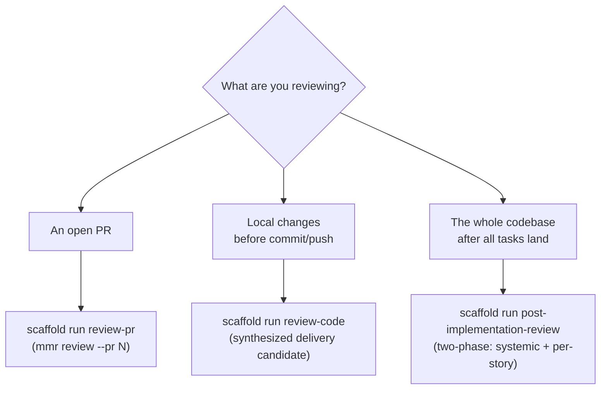
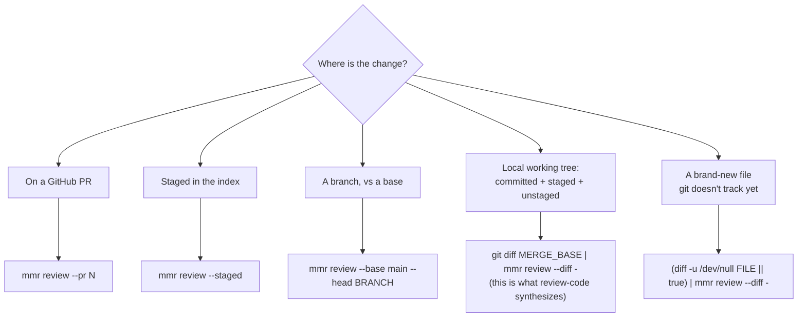

## What this guide covers

This is the **workflow** around multi-model review: *when* to review, *which*
entry point to reach for, *which* input mode matches your target, how to read
the verdict, and how the fix loop is bounded. It does **not** re-explain the
review engine itself — channels, reconciliation, the `finding_key`, the verdict
algorithm, and `.mmr.yaml` all live in the [MMR reference](../mmr/index.md).
Read that guide for "what is a channel"; read this one for "I have a change, now
what do I run."

:::callout{type=tip}
**Two layers.** `mmr review` is the engine. The `scaffold run review-pr` /
`review-code` / `post-implementation-review` wrappers are the *workflow* on top
— they pick the input mode, add the Superpowers code-reviewer agent channel via
`mmr reconcile`, handle auth recovery, and bound the fix loop. This guide is
about driving the wrappers; the engine details are in
[the MMR reference](../mmr/index.md).
:::

## Step 1 — Pick the entry point

Three wrappers cover three review situations. They share the same engine and the
same verdict semantics; they differ in *scope* and *what they synthesize*.

| Entry point | Target | What it adds over a bare `mmr review` |
| --- | --- | --- |
| `scaffold run review-pr` | One PR (`--pr N`, auto-detected from the branch) | Auth checks, the Superpowers agent channel, the per-finding round bookkeeping, an opt-in Beads bridge. |
| `scaffold run review-code` | Local pre-push: committed branch diff + staged + unstaged, as one synthesized "delivery candidate" | The same agent channel + round bounding, plus file & standards context for the file-blind CLIs. **Untracked files are not covered.** |
| `scaffold run post-implementation-review` | The full implemented codebase against stories + standards | Two phases — a systemic cross-cutting sweep and a per-story functional review via parallel agents — with its own report under `docs/reviews/`. Different channel layout; consult its own doc. |

:::callout{type=note}
**The mandatory one.** After `gh pr create`, running `review-pr` is mandatory
before moving to the next task (a PostToolUse hook reminds you).
`review-code` is the recommended preflight before a push but isn't gated.
`post-implementation-review` is a release-time sweep, not a per-change gate.
:::

### When no wrapper fits

The wrappers are conveniences, not gates on the engine. For any target a wrapper
doesn't cover — a branch range, an existing patch file, a single doc — call
`mmr review` directly with the matching input flag. The
[MMR reference](../mmr/index.md) lists every flag; the next step is the workflow
view of the same choice.

## Step 2 — Choose the input mode

`mmr review` resolves a diff from exactly one input source. Pick the one that
describes your target. The `--diff -` (stdin) form is the universal escape hatch:
anything you can express as a unified diff, you can pipe in.

| Target | Command | Notes |
| --- | --- | --- |
| A PR | `mmr review --pr 123` | Fetches the diff via `gh pr diff`. This is `review-pr`'s mode. |
| Staged changes | `mmr review --staged` | Just the index (`git diff --cached`) — the pre-commit slice. |
| A branch range | `mmr review --base main --head "$BRANCH"` | Committed work only; no staged/unstaged. |
| Full delivery candidate | `git diff "$MERGE_BASE" \| mmr review --diff -` | Committed branch diff + staged + unstaged in one patch. `review-code` synthesizes this for you. |
| A single tracked file's pending edits | `git diff HEAD -- path/file.ts \| mmr review --diff -` | Fails with "no diff content" if the file has no local changes — use the next row. |
| A brand-new / untracked file | `(diff -u /dev/null path/file.ts \|\| true) \| mmr review --diff -` | Synthesizes an "all-added" diff from current contents. |
| An existing patch | `mmr review --diff path/changes.patch` | Reads diff-format content directly. |

:::callout{type=danger}
**Untracked files are silently skipped — this is the trap.** `review-code`
reviews the committed branch diff plus staged and unstaged changes *to tracked
files*. A brand-new file you've never `git add`-ed is **not** in any of those
diffs, so it sails through review with zero findings — not because it's clean,
but because no channel ever saw it. To review a new file, pipe it in explicitly:
`(diff -u /dev/null path/to/new-file.ts || true) | mmr review --diff -`. The
`|| true` guard is required: `diff` exits non-zero whenever files differ, which
would otherwise kill the pipeline under `set -o pipefail`. The wrappers cannot
guess which untracked files you meant to include
:cite[content/tools/review-code.md:37].
:::

The `--diff` flag expects **diff-format content** — a path to a `.patch`/`.diff`
file, or `-` for stdin. It does not accept raw document text; wrap the target in
a diff first.

## Step 3 — Read the verdict, then act

Every review collapses to exactly one of four verdicts
:cite[packages/mmr/src/types.ts:25]. The verdict, not the raw findings, is what
decides whether you proceed.

| Verdict | Meaning | Exit | Do |
| --- | --- | --- | --- |
| `pass` | Gate passed; every channel completed | 0 | **Proceed** — merge / push / next task. |
| `degraded-pass` | Gate passed, but a channel was skipped, timed out, or ran as a compensating pass | 0 | **Proceed**, noting reduced coverage. The max achievable verdict once any channel was compensated. |
| `blocked` | An unacknowledged finding sits at or above the fix threshold | 2 | **Stop.** Fix the blocking findings (Step 4), then re-review. Do not merge. |
| `needs-user-decision` | No channel completed, or reviewers contradict each other | 3 | **Stop and surface to the user.** Automated iteration can't resolve this. |

The gate **passes** when every unacknowledged finding is *below* the fix
threshold — :sev[P2]{level=p2} by default
:cite[packages/mmr/src/config/defaults.ts:16], override per-run with
`--fix-threshold`. Severity tiers run :sev[P0]{level=p0} (highest) →
:sev[P1]{level=p1} → :sev[P2]{level=p2} → :sev[P3]{level=p3}. The verdict
algorithm checks the no-channels case first (it outranks `blocked`), then the
gate, then channel health: zero completed → `needs-user-decision`
:cite[packages/mmr/src/core/reconciler.ts:247]; else a failed gate → `blocked`
:cite[packages/mmr/src/core/reconciler.ts:250]; else any incomplete channel →
`degraded-pass` :cite[packages/mmr/src/core/reconciler.ts:253]; else `pass`.

:::callout{type=warning}
**Proceed only on `pass` or `degraded-pass`.** On `blocked` or
`needs-user-decision`, never merge automatically — surface the verdict and the
remaining findings to the user. The wrappers enforce this: a `blocked` /
`needs-user-decision` outcome takes the "Stop path" and does **not** print the
ready-for-merge message :cite[content/tools/review-pr.md:610].
:::

## Step 4 — Fix the blocking findings (bounded)

When the verdict is `blocked`, the loop is: fix the findings at or above the
threshold → re-review → repeat. The guard rail is that this loop is **bounded
per finding**, so a finding the model can't actually fix doesn't trap you in an
infinite cycle.

### The 3-round-per-finding limit

The limit is **3 attempts per finding**, not 3 rounds total. Each round that
surfaces *genuinely new* findings is healthy iteration — keep going. The loop
stops only when one specific finding has been attempted three times without
resolution.

A "finding" here is its **stable identity**, not its wording. Identity is
derived from four normalized components — `location`, `category`, `description`,
`suggestion` — so a re-worded report of the same defect still counts against the
same finding :cite[content/tools/review-pr.md:640]. Co-equal stop conditions:

- A finding's identity reaches 3 recorded attempts.
- The same underlying defect recurs across 3 rounds even if the reviewer's
  wording produces a new identity each time.
- Channels genuinely contradict each other (→ `needs-user-decision`).
- The user explicitly asks to stop.

When you stop, **do not merge**. Document each unresolved finding (severity,
location, attempt count) and hand the decision to the user
:cite[content/tools/review-pr.md:610].

### Where the bookkeeping lives today

The engine ships **native** multi-round sessions — `mmr review --session <id>
--round N --max-rounds M` :cite[packages/mmr/src/commands/review.ts:289] — and a
stable, line-number-independent `finding_key`
:cite[packages/mmr/src/core/stable-id.ts:115]. (See the
[MMR reference](../mmr/index.md) for how that key collapses the same issue at
different severities.)

The scaffold **wrappers** have not yet migrated to native sessions. Until they
do, `review-pr` and `review-code` enforce the 3-strike rule with their own
bookkeeping: a per-session attempts file at
`.scaffold/review-attempts/<session-id>.json`. Each fix round computes a hash
over the same four identity components, increments that finding's counter, and
the `_review_at_strike_limit` helper blocks once it hits 3
:cite[content/tools/review-pr.md:468]. The wrapper hash deliberately mirrors the
engine's `finding_key` components, so the eventual swap to
`mmr review --session` is a clean migration rather than a re-think.

:::callout{type=note}
**Practical takeaway.** You drive the fix loop through the wrapper; the attempts
file under `.scaffold/review-attempts/` is the current source of truth for the
strike count. For a very noisy loop you may narrow the gate for one run with
`--fix-threshold P1` — but don't permanently lower the project default (P2).
:::

## Step 5 — Handle degraded mode

A review never silently runs with fewer reviewers. A channel is *degraded* when
its binary isn't installed, auth fails, it times out, or it errors out. The
workflow's response is to **compensate and tell you how to recover**, then cap
the verdict at `degraded-pass`.

- **Compensating pass.** For each degraded *external* channel, a `claude -p` pass
  runs focused on that channel's strength area, labeled e.g.
  `[compensating: Grok-equivalent]` :cite[packages/mmr/src/core/compensator.ts:43].
  These findings are single-source, low confidence. Claude is the compensator,
  so a missing Claude CLI has no compensator of its own.
- **Auth recovery is never silent.** The workflow surfaces the exact recovery
  command for the failed channel; the channel's `recovery` string drives this
  :cite[packages/mmr/src/core/auth.ts:65].

| Channel | Recovery command |
| --- | --- |
| `codex` | `codex login` |
| `gemini` | `gemini -p "hello"` |
| `claude` | `claude login` |
| `grok` | `grok login` |

:::callout{type=warning}
**Foreground only.** When the `mmr` CLI is unavailable and a wrapper falls back
to invoking Codex / Gemini / Claude / Grok directly, run them as **foreground**
Bash calls — never with `run_in_background`, `&`, or `nohup`. Background
execution produces empty output, which the parser then reads as a degraded
channel :cite[content/tools/review-code.md:813].
:::

Once any channel was compensated, the best possible verdict is
`degraded-pass` — full `pass` requires all channels to have completed for real.

## See also

- [MMR reference](../mmr/index.md){mode=advisory} — channels, reconciliation,
  the `finding_key`, verdict internals, and `.mmr.yaml`.
- The wrapper meta-prompts themselves:
  :cite[content/tools/review-pr.md:15]{mode=advisory},
  :cite[content/tools/review-code.md:16]{mode=advisory}, and
  :cite[content/tools/post-implementation-review.md:16]{mode=advisory}.
