# Architecture Decision Records — Index

**Phase**: 2 — Architecture Decision Records
**Last updated**: 2026-03-14
**Status**: current

---

## Summary

54 Architecture Decision Records covering the complete architectural foundation for Scaffold v2 — from CLI implementation language through platform adapters to deferred scope decisions, plus the meta-prompt architecture (ADR-041 through ADR-046) that supersedes the original three-layer resolution, mixin injection, and build-time resolution systems. Cross-cutting policies on forward compatibility, error handling, runtime safety, user instruction layering, update mode behavior, and methodology changeability are also recorded. Every significant design choice from the v2 spec, 16 domain models, and PRD is captured with rationale, alternatives considered, consequences, and compliance constraints.

## Decision Log

| ADR | Title | Status | Domain(s) | Category |
|-----|-------|--------|-----------|----------|
| [ADR-001](ADR-001-cli-implementation-language.md) | CLI Implementation Language — Node.js | accepted | 09 | Foundation |
| [ADR-002](ADR-002-distribution-strategy.md) | Distribution Strategy — npm Primary, Homebrew Secondary | accepted | 09 | Foundation |
| [ADR-003](ADR-003-standalone-cli-source-of-truth.md) | Standalone CLI as Source of Truth | accepted | 05, 09 | Foundation |
| [ADR-004](ADR-004-methodology-as-top-level-organizer.md) | Methodology as Top-Level Organizer | accepted | 01, 06, 14 | Foundation |
| [ADR-005](ADR-005-three-layer-prompt-resolution.md) | Three-Layer Prompt Resolution with Customization Precedence | superseded (by ADR-041) | 01 | Core Engine |
| [ADR-006](ADR-006-mixin-injection-over-templating.md) | Mixin Injection over Templating | superseded (by ADR-041) | 12, 01 | Core Engine |
| [ADR-007](ADR-007-mixin-markers-subsection-targeting.md) | Multiple Mixin Markers with Sub-Section Targeting | superseded (by ADR-041) | 12 | Core Engine |
| [ADR-008](ADR-008-abstract-task-verbs.md) | Abstract Task Verbs as HTML Comments | superseded (by ADR-041) | 04, 12 | Core Engine |
| [ADR-009](ADR-009-kahns-algorithm-dependency-resolution.md) | Kahn's Algorithm with Phase Tiebreaker | accepted | 02 | Core Engine |
| [ADR-010](ADR-010-build-time-resolution.md) | Build-Time Resolution and Injection | superseded (by ADR-044) | 01, 12 | Core Engine |
| [ADR-011](ADR-011-depends-on-union-semantics.md) | Frontmatter Depends-On Union Semantics | accepted | 01, 02, 08 | Core Engine |
| [ADR-012](ADR-012-state-file-design.md) | State File Design — Map-Keyed, Committed, Atomic | accepted | 03 | Data Formats |
| [ADR-013](ADR-013-decision-log-jsonl-format.md) | Decision Log — JSONL Append-Only Format | accepted | 11 | Data Formats |
| [ADR-014](ADR-014-config-schema-versioning.md) | Config Schema — YAML with Integer Versioning | accepted | 06 | Data Formats |
| [ADR-015](ADR-015-prompt-frontmatter-schema.md) | Prompt Frontmatter Schema with Section Targeting | superseded (by ADR-045) | 08 | Data Formats |
| [ADR-016](ADR-016-methodology-manifest-format.md) | Methodology Manifest YAML Format | superseded (by ADR-043) | 01, 02 | Data Formats |
| [ADR-017](ADR-017-tracking-comments-artifact-provenance.md) | Tracking Comments for Artifact Provenance | accepted | 03, 07, 10 | Data Formats |
| [ADR-018](ADR-018-completion-detection-crash-recovery.md) | Completion Detection and Crash Recovery | accepted | 03, 08 | Runtime Behavior |
| [ADR-019](ADR-019-advisory-locking.md) | Advisory Locking — PID-Based, Local-Only, Gitignored | accepted | 13 | Runtime Behavior |
| [ADR-020](ADR-020-skip-vs-exclude-semantics.md) | Skip vs Exclude Semantics for Optional Prompts | accepted | 01, 02, 03 | Runtime Behavior |
| [ADR-021](ADR-021-sequential-prompt-execution.md) | Sequential Prompt Execution | accepted | 02, 03 | Runtime Behavior |
| [ADR-022](ADR-022-three-platform-adapters.md) | Three Platform Adapters with Universal Always Generated | accepted | 05 | Platform & Adapters |
| [ADR-023](ADR-023-phrase-level-tool-mapping.md) | Phrase-Level Tool-Name Mapping | superseded (by ADR-041) | 05 | Platform & Adapters |
| [ADR-024](ADR-024-capabilities-as-warnings.md) | Requires-Capabilities as Warnings Not Hard Errors | accepted | 05, 08 | Platform & Adapters |
| [ADR-025](ADR-025-cli-output-contract.md) | CLI Output Contract — Modes, JSON Envelope, Exit Codes | accepted | 09 | UX & Output |
| [ADR-026](ADR-026-claude-md-section-registry.md) | CLAUDE.md Section Registry with Token Budget | accepted | 10 | UX & Output |
| [ADR-027](ADR-027-init-wizard-smart-suggestion.md) | Init Wizard with Smart Methodology Suggestion | accepted | 14 | UX & Output |
| [ADR-028](ADR-028-detection-priority.md) | Detection Priority — v1 > Brownfield > Greenfield | accepted | 07, 14 | UX & Output |
| [ADR-029](ADR-029-prompt-structure-convention.md) | Prompt Structure Convention — Agent-Optimized Ordering | accepted | 08, 09 | UX & Output |
| [ADR-030](ADR-030-config-inheritance-deferred.md) | Config Inheritance Deferred | accepted | 06 | Scope & Deferral |
| [ADR-031](ADR-031-community-marketplace-deferred.md) | Community Methodology Marketplace Deferred | accepted | 06, 14, 16 | Scope & Deferral |
| [ADR-032](ADR-032-methodology-versioning-bundled.md) | Methodology Versioning Bundled with CLI | accepted | 06, 16 | Scope & Deferral |
| [ADR-033](ADR-033-forward-compatibility-unknown-fields.md) | Forward Compatibility — Unknown Fields as Warnings | accepted | 06, 08 | Data Formats |
| [ADR-034](ADR-034-rerun-no-cascade.md) | Re-runs Do Not Cascade to Downstream Prompts | accepted | 02, 03 | Runtime Behavior |
| [ADR-035](ADR-035-non-recursive-injection.md) | Mixin Injection Is Non-Recursive (Two-Pass Bounded) | superseded (by ADR-041) | 12 | Core Engine |
| [ADR-036](ADR-036-auto-does-not-imply-force.md) | --auto Does Not Imply --force | accepted | 09, 13 | Runtime Behavior |
| [ADR-037](ADR-037-task-verb-global-scope.md) | Abstract Task Verb Replacement Scope Is Global | superseded (by ADR-041) | 04, 12 | Core Engine |
| [ADR-038](ADR-038-prompt-versioning-deferred.md) | Prompt Versioning and Rollback Not Supported | accepted | 08, 15 | Scope & Deferral |
| [ADR-039](ADR-039-pipeline-context-deferred.md) | Pipeline Context (context.json) Deferred | accepted | 08, 11 | Scope & Deferral |
| [ADR-040](ADR-040-error-handling-philosophy.md) | Error Handling Philosophy | accepted | 01-16 | Cross-Cutting |
| [ADR-041](ADR-041-meta-prompt-architecture.md) | Meta-Prompt Architecture Over Hard-Coded Prompts | accepted | 01, 04, 05, 12 | Meta-Prompt Architecture |
| [ADR-042](ADR-042-knowledge-base-domain-expertise.md) | Knowledge Base as Domain Expertise Layer | accepted | 01 | Meta-Prompt Architecture |
| [ADR-043](ADR-043-depth-scale.md) | Depth Scale (1-5) Over Methodology-Specific Prompt Variants | accepted | 06, 14 | Meta-Prompt Architecture |
| [ADR-044](ADR-044-runtime-prompt-generation.md) | Runtime Prompt Generation Over Build-Time Resolution | accepted | 01, 12 | Meta-Prompt Architecture |
| [ADR-045](ADR-045-assembled-prompt-structure.md) | Assembled Prompt Structure | accepted | 08 | Meta-Prompt Architecture |
| [ADR-046](ADR-046-phase-specific-review-criteria.md) | Phase-Specific Review Criteria Over Generic Review Template | accepted | 08 | Meta-Prompt Architecture |
| [ADR-047](ADR-047-user-instruction-three-layer-precedence.md) | User Instruction Three-Layer Precedence | accepted | 09, 15 | Runtime Behavior |
| [ADR-048](ADR-048-update-mode-diff-over-regeneration.md) | Update Mode — Diff Over Regeneration | accepted | 03, 15 | Runtime Behavior |
| [ADR-049](ADR-049-methodology-changeable-mid-pipeline.md) | Methodology Changeable Mid-Pipeline | accepted | 03, 06, 16 | Runtime Behavior |
| [ADR-050](ADR-050-context-window-management.md) | Context Window Management Strategy | accepted | 15 | Core Engine |
| [ADR-051](ADR-051-depth-downgrade-policy.md) | Depth Downgrade Policy | accepted | 09, 16 | Runtime Behavior |
| [ADR-052](ADR-052-decision-recording-interface.md) | Decision Recording Interface | accepted | 11, 15 | Data Formats |
| [ADR-053](ADR-053-artifact-context-scope.md) | Artifact Context Scope | accepted | 15 | Core Engine |
| [ADR-054](ADR-054-state-methodology-tracking.md) | State Methodology Tracking | accepted | 03, 16 | Data Formats |
| [ADR-055](ADR-055-backward-compatibility-contract.md) | Backward Compatibility Contract | accepted | 09 | Foundation |

## By Category

### Foundation
- [ADR-001](ADR-001-cli-implementation-language.md) — CLI Implementation Language — Node.js
- [ADR-002](ADR-002-distribution-strategy.md) — Distribution Strategy — npm Primary, Homebrew Secondary
- [ADR-003](ADR-003-standalone-cli-source-of-truth.md) — Standalone CLI as Source of Truth
- [ADR-055](ADR-055-backward-compatibility-contract.md) — Backward Compatibility Contract
- [ADR-004](ADR-004-methodology-as-top-level-organizer.md) — Methodology as Top-Level Organizer

### Core Engine
- [ADR-005](ADR-005-three-layer-prompt-resolution.md) — Three-Layer Prompt Resolution with Customization Precedence *(superseded by ADR-041)*
- [ADR-006](ADR-006-mixin-injection-over-templating.md) — Mixin Injection over Templating *(superseded by ADR-041)*
- [ADR-007](ADR-007-mixin-markers-subsection-targeting.md) — Multiple Mixin Markers with Sub-Section Targeting *(superseded by ADR-041)*
- [ADR-008](ADR-008-abstract-task-verbs.md) — Abstract Task Verbs as HTML Comments *(superseded by ADR-041)*
- [ADR-009](ADR-009-kahns-algorithm-dependency-resolution.md) — Kahn's Algorithm with Phase Tiebreaker
- [ADR-010](ADR-010-build-time-resolution.md) — Build-Time Resolution and Injection *(superseded by ADR-044)*
- [ADR-011](ADR-011-depends-on-union-semantics.md) — Frontmatter Depends-On Union Semantics
- [ADR-035](ADR-035-non-recursive-injection.md) — Mixin Injection Is Non-Recursive (Two-Pass Bounded) *(superseded by ADR-041)*
- [ADR-037](ADR-037-task-verb-global-scope.md) — Abstract Task Verb Replacement Scope Is Global *(superseded by ADR-041)*
- [ADR-050](ADR-050-context-window-management.md) — Context Window Management Strategy
- [ADR-053](ADR-053-artifact-context-scope.md) — Artifact Context Scope

### Data Formats
- [ADR-012](ADR-012-state-file-design.md) — State File Design — Map-Keyed, Committed, Atomic
- [ADR-013](ADR-013-decision-log-jsonl-format.md) — Decision Log — JSONL Append-Only Format
- [ADR-014](ADR-014-config-schema-versioning.md) — Config Schema — YAML with Integer Versioning
- [ADR-015](ADR-015-prompt-frontmatter-schema.md) — Prompt Frontmatter Schema with Section Targeting *(superseded by ADR-045)*
- [ADR-016](ADR-016-methodology-manifest-format.md) — Methodology Manifest YAML Format *(superseded by ADR-043)*
- [ADR-017](ADR-017-tracking-comments-artifact-provenance.md) — Tracking Comments for Artifact Provenance
- [ADR-033](ADR-033-forward-compatibility-unknown-fields.md) — Forward Compatibility — Unknown Fields as Warnings
- [ADR-052](ADR-052-decision-recording-interface.md) — Decision Recording Interface
- [ADR-054](ADR-054-state-methodology-tracking.md) — State Methodology Tracking

### Runtime Behavior
- [ADR-018](ADR-018-completion-detection-crash-recovery.md) — Completion Detection and Crash Recovery
- [ADR-019](ADR-019-advisory-locking.md) — Advisory Locking — PID-Based, Local-Only, Gitignored
- [ADR-020](ADR-020-skip-vs-exclude-semantics.md) — Skip vs Exclude Semantics for Optional Prompts
- [ADR-021](ADR-021-sequential-prompt-execution.md) — Sequential Prompt Execution
- [ADR-034](ADR-034-rerun-no-cascade.md) — Re-runs Do Not Cascade to Downstream Prompts
- [ADR-036](ADR-036-auto-does-not-imply-force.md) — --auto Does Not Imply --force
- [ADR-047](ADR-047-user-instruction-three-layer-precedence.md) — User Instruction Three-Layer Precedence
- [ADR-048](ADR-048-update-mode-diff-over-regeneration.md) — Update Mode — Diff Over Regeneration
- [ADR-049](ADR-049-methodology-changeable-mid-pipeline.md) — Methodology Changeable Mid-Pipeline
- [ADR-051](ADR-051-depth-downgrade-policy.md) — Depth Downgrade Policy

### Platform & Adapters
- [ADR-022](ADR-022-three-platform-adapters.md) — Three Platform Adapters with Universal Always Generated
- [ADR-023](ADR-023-phrase-level-tool-mapping.md) — Phrase-Level Tool-Name Mapping *(superseded by ADR-041)*
- [ADR-024](ADR-024-capabilities-as-warnings.md) — Requires-Capabilities as Warnings Not Hard Errors

### UX & Output
- [ADR-025](ADR-025-cli-output-contract.md) — CLI Output Contract — Modes, JSON Envelope, Exit Codes
- [ADR-026](ADR-026-claude-md-section-registry.md) — CLAUDE.md Section Registry with Token Budget
- [ADR-027](ADR-027-init-wizard-smart-suggestion.md) — Init Wizard with Smart Methodology Suggestion
- [ADR-028](ADR-028-detection-priority.md) — Detection Priority — v1 > Brownfield > Greenfield
- [ADR-029](ADR-029-prompt-structure-convention.md) — Prompt Structure Convention — Agent-Optimized Ordering

### Scope & Deferral
- [ADR-030](ADR-030-config-inheritance-deferred.md) — Config Inheritance Deferred
- [ADR-031](ADR-031-community-marketplace-deferred.md) — Community Methodology Marketplace Deferred
- [ADR-032](ADR-032-methodology-versioning-bundled.md) — Methodology Versioning Bundled with CLI
- [ADR-038](ADR-038-prompt-versioning-deferred.md) — Prompt Versioning and Rollback Not Supported
- [ADR-039](ADR-039-pipeline-context-deferred.md) — Pipeline Context (context.json) Deferred

### Cross-Cutting
- [ADR-040](ADR-040-error-handling-philosophy.md) — Error Handling Philosophy

### Meta-Prompt Architecture
- [ADR-041](ADR-041-meta-prompt-architecture.md) — Meta-Prompt Architecture Over Hard-Coded Prompts
- [ADR-042](ADR-042-knowledge-base-domain-expertise.md) — Knowledge Base as Domain Expertise Layer
- [ADR-043](ADR-043-depth-scale.md) — Depth Scale (1-5) Over Methodology-Specific Prompt Variants
- [ADR-044](ADR-044-runtime-prompt-generation.md) — Runtime Prompt Generation Over Build-Time Resolution
- [ADR-045](ADR-045-assembled-prompt-structure.md) — Assembled Prompt Structure
- [ADR-046](ADR-046-phase-specific-review-criteria.md) — Phase-Specific Review Criteria Over Generic Review Template

Note: ADR-008 includes a sub-decision about the `create-and-claim` compound verb that remains under consideration (documented within the ADR as a proposed element).

## Decision Dependencies

```mermaid
graph TD
    ADR001[ADR-001: Node.js] --> ADR002[ADR-002: Distribution]
    ADR001 --> ADR003[ADR-003: Standalone CLI]
    ADR003 --> ADR022[ADR-022: Three Adapters]

    ADR004[ADR-004: Methodology] --> ADR005[ADR-005: Prompt Resolution]
    ADR004 --> ADR016[ADR-016: Manifest Format]
    ADR004 --> ADR026[ADR-026: CLAUDE.md Registry]
    ADR004 --> ADR027[ADR-027: Init Wizard]

    ADR005 --> ADR006[ADR-006: Mixin Injection]
    ADR005 --> ADR011[ADR-011: Union Semantics]
    ADR005 --> ADR020[ADR-020: Skip vs Exclude]

    ADR006 --> ADR007[ADR-007: Sub-Section Targeting]
    ADR006 --> ADR008[ADR-008: Task Verbs]
    ADR006 --> ADR010[ADR-010: Build-Time Resolution]

    ADR009[ADR-009: Kahn's Algorithm] --> ADR021[ADR-021: Sequential Execution]
    ADR011 --> ADR009
    ADR011 --> ADR015[ADR-015: Frontmatter Schema]

    ADR012[ADR-012: State File] --> ADR018[ADR-018: Completion Detection]
    ADR012 --> ADR019[ADR-019: Advisory Locking]
    ADR012 --> ADR020

    ADR014[ADR-014: Config Schema] --> ADR030[ADR-030: Config Inheritance Deferred]
    ADR015 --> ADR018
    ADR015 --> ADR024[ADR-024: Capabilities as Warnings]
    ADR015 --> ADR029[ADR-029: Prompt Structure]

    ADR017[ADR-017: Tracking Comments] --> ADR028[ADR-028: Detection Priority]
    ADR022 --> ADR023[ADR-023: Tool Mapping]
    ADR022 --> ADR024

    ADR025[ADR-025: CLI Output] --> ADR019
    ADR027 --> ADR028

    ADR004 --> ADR031[ADR-031: Marketplace Deferred]
    ADR004 --> ADR032[ADR-032: Versioning Bundled]
    ADR031 --> ADR032

    ADR013[ADR-013: Decision Log] --> ADR018
    ADR025 --> ADR013

    ADR014 --> ADR033[ADR-033: Forward Compat]
    ADR015 --> ADR033
    ADR016 --> ADR033
    ADR009 --> ADR034[ADR-034: No Cascade]
    ADR012 --> ADR034
    ADR006 --> ADR035[ADR-035: Non-Recursive]
    ADR010 --> ADR035
    ADR019 --> ADR036[ADR-036: Auto ≠ Force]
    ADR025 --> ADR036
    ADR008 --> ADR037[ADR-037: Verb Global Scope]
    ADR010 --> ADR037
    ADR005 --> ADR038[ADR-038: Versioning Deferred]
    ADR032 --> ADR038
    ADR013 --> ADR039[ADR-039: Context Deferred]
    ADR015 --> ADR039
    ADR006 --> ADR040[ADR-040: Error Philosophy]
    ADR014 --> ADR040
    ADR019 --> ADR040
    ADR025 --> ADR040

    ADR045[ADR-045: Assembled Prompt] --> ADR047[ADR-047: User Instructions]
    ADR044[ADR-044: Runtime Assembly] --> ADR047
    ADR034 --> ADR048[ADR-048: Update Mode]
    ADR045 --> ADR048
    ADR043[ADR-043: Depth Scale] --> ADR049[ADR-049: Methodology Changeable]
    ADR034 --> ADR049
    ADR012 --> ADR049
```

## ADR Candidate Coverage

All explicit ADR candidates from the 16 domain models are covered:

| Source | ADR Candidate | Covered By |
|--------|--------------|------------|
| Domain 01, Section 10 | Frontmatter depends-on merge strategy | ADR-011 |
| Domain 01, Section 10 | Whether customizations must have a built-in | ADR-005 |
| Domain 02, Section 10 | Dependency union vs. replacement | ADR-011 |
| Domain 02, Section 10 | Runtime dependency graph mutation | ADR-009 |
| Domain 03, Section 10 | Map-keyed vs. separate files per prompt | ADR-012 |
| Domain 04, Section 10 | create-and-claim as core verb vs. named arg | ADR-008 |
| Domain 06, Section 10 | Config schema versioning strategy | ADR-014 |
| Domain 08, Section 10 | Section extraction code-fence awareness | ADR-015 |
| Domain 08, Section 10 | Frontmatter field extensibility | ADR-015 |
| Domain 09, Section 10 | yargs as CLI framework | ADR-001 |
| Domain 09, Section 10 | OutputContext strategy pattern | ADR-025 |
| Domain 12, Section 10 | Verb registry in YAML vs. embedded in markdown | ADR-008 |
| Domain 15, Section 10 | Context window management strategy | ADR-050 (accepted) |
| Domain 15, Section 10 | Decision recording interface | ADR-052 (accepted) |
| Domain 15, Section 10 | Artifact verification timing | Deferred — low risk, can be decided during implementation |
| Domain 16, Section 10 | Depth downgrade policy | ADR-051 (accepted) |
| Domain 16, Section 10 | Methodology field in state.json | ADR-054 (accepted) |
| Domain 16, Section 10 | Conditional step re-evaluation | Deferred — additive feature, can be added post-v2 |
