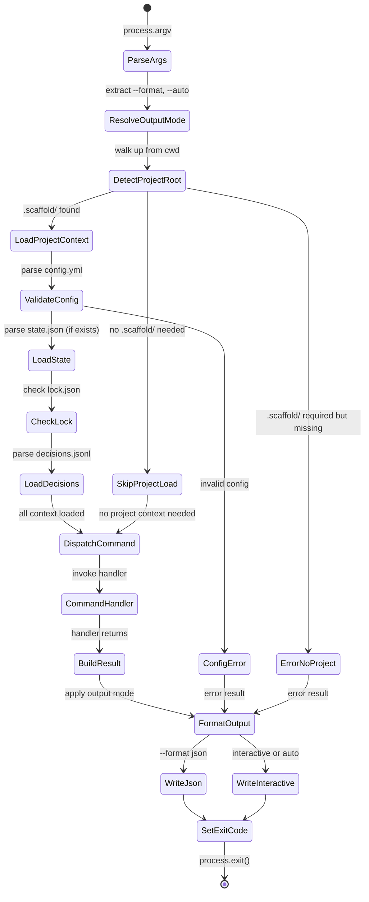
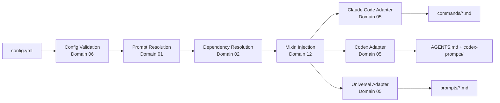
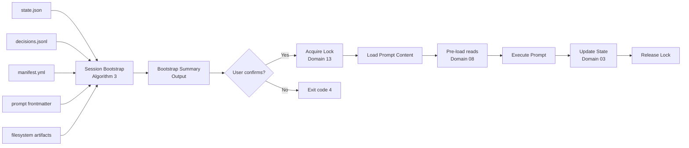

# Domain Model: CLI Command Architecture & Output Modes

**Status: Transformed** — Commands updated per meta-prompt architecture (ADR-041).

**Domain ID**: 09
**Phase**: 1 — Deep Domain Modeling
**Depends on**: None — first-pass modeling (the CLI shell orchestrates all other domains)
**Last updated**: 2026-03-14
**Status**: transformed

---

> **Implementation Note:** This domain model contains data envelopes for removed commands and mixin fields from the pre-meta-prompt architecture:
> - `AddData` — `scaffold add` was removed (PRD Section 8)
> - `PreviewData` — `scaffold preview` was removed (PRD Section 8)
> - `InitData.mixins`, `InfoData.mixins`, `ListData.mixins` — mixin axes eliminated by ADR-041
>
> Use `docs/v2/api/cli-contract.md` and `docs/v2/api/json-output-schemas.md` as the authoritative CLI interface specifications.

## Section 1: Domain Overview

The CLI Command Architecture & Output Modes domain defines the Node.js application shell that all Scaffold v2 functionality is delivered through. This domain covers the command dispatch system, argument parsing, the three interaction modes (interactive, `--format json`, `--auto`), exit code contract, project root detection, the assembly engine orchestration, error propagation framework, and the orchestration layer that composes business logic from other domains into user-facing commands.

**Command changes under the meta-prompt architecture:**

- **Added**: `scaffold run <step> [--instructions "..."]` — Runs a pipeline step by loading its meta-prompt, assembling it with knowledge base + project context + user instructions, and passing the assembled prompt to the AI for generation and execution.
- **Removed**: `scaffold add <axis> <value>` — Mixin axis configuration is no longer needed; the meta-prompt architecture eliminates mixin axes.
- **Modified**: `scaffold build` — Now generates thin command wrappers from meta-prompts (for plugin delivery) rather than performing full prompt resolution and mixin injection.
- **Modified**: `scaffold init` — Now runs a methodology wizard (Deep/MVP/Custom selection) instead of collecting mixin axis values.
- **Kept**: `scaffold status`, `scaffold next`, `scaffold skip`, `scaffold list`, `scaffold validate`, `scaffold info`, `scaffold version`, `scaffold update`, `scaffold dashboard`, `scaffold decisions`, `scaffold adopt`, `scaffold reset`.

**Role in the v2 architecture**: The CLI is the **outermost orchestration layer** — every other domain provides business logic that the CLI invokes, formats, and surfaces to the user or agent. The assembly engine loads meta-prompts and knowledge base entries. Dependency resolution ([domain 02](02-dependency-resolution.md)) determines execution order. The pipeline state machine ([domain 03](03-pipeline-state-machine.md)) tracks execution progress. Config validation ([domain 06](06-config-validation.md)) validates inputs. The CLI is responsible for composing these subsystems into coherent commands, dispatching to the right subsystem, translating subsystem results into the appropriate output mode, and propagating errors with consistent codes and formatting.

**Central design challenge**: Every CLI command must behave correctly in three modes — interactive (human at a terminal), JSON (agent consuming structured output), and auto (agent or CI running non-interactively). This cross-cutting concern must be uniform without every command individually implementing mode logic. The output mode abstraction must be simple enough that adding a new command requires minimal boilerplate, yet flexible enough to handle commands with radically different output shapes (a simple `scaffold version` vs. the assembly and execution flow of `scaffold run`).

---

## Section 2: Glossary

**CLI application** — The Node.js executable (`scaffold`) that serves as the entry point for all Scaffold v2 operations. Distributed via npm and Homebrew.

**command** — A named subcommand of the `scaffold` CLI (e.g., `scaffold init`, `scaffold build`, `scaffold run`). Each command has a defined signature (arguments, flags), an output contract (JSON envelope fields), and an exit code mapping.

**command handler** — The function that implements a command's business logic. Receives parsed arguments and an `OutputContext`, returns a `CommandResult`. Does not directly write to stdout/stderr.

**output mode** — One of three ways the CLI presents results: `interactive` (human-readable, colored, may prompt for input), `json` (single JSON object to stdout), or `auto` (human-readable but never blocks on input).

**JSON envelope** — The standard JSON structure emitted by every command in `--format json` mode. Contains `success`, `command`, `data`, `errors`, `warnings`, and `exit_code` fields.

**exit code** — A numeric code (0–5) returned by the process. Consistent across all commands: 0 = success, 1 = validation error, 2 = missing dependency, 3 = state corruption, 4 = user cancellation, 5 = build error.

**output context** — The injected dependency that commands use to emit output. Abstracts the three modes — commands call `outputContext.info()`, `outputContext.prompt()`, `outputContext.table()`, etc., and the context routes to the appropriate formatter.

**session bootstrap summary** — The structured context block produced by `scaffold run` before prompt execution. Assembles pipeline status, context files, recent decisions, and crash recovery information from multiple data sources.

**project root** — The directory containing `.scaffold/`, detected by walking up from the current working directory. Some commands (`init`, `version`, `list`) do not require a project root.

**decision point** — A moment during command execution where the CLI needs user input (e.g., "Run tech-stack first?", "Proceed with changes?"). In interactive mode, the user is prompted. In auto mode, a default resolution is applied.

**scaffold error** — A structured error type with a code, message, source location, and optional suggestion. The error propagation framework ensures all errors from all subsystems are surfaced consistently.

**command registry** — The mapping of command names to their handler modules. Commands are registered declaratively, not discovered at runtime.

**project context** — The loaded state of a scaffold project: config, state, lock status, and decisions. Assembled once per command invocation for commands that require a project root.

---

## Section 3: Entity Model

```typescript
// ============================================================
// CLI Application Architecture
// ============================================================

/**
 * The top-level CLI application. Entry point for all scaffold commands.
 * Uses yargs for argument parsing and command dispatch.
 */
interface CliApplication {
  /** Registered commands, keyed by command name */
  commands: Map<string, CommandDefinition>;

  /** Global flags available to all commands */
  globalFlags: GlobalFlags;

  /** The resolved output mode for this invocation */
  outputMode: OutputMode;
}

/**
 * Global flags that apply to every command.
 * Parsed before command-specific flags.
 */
interface GlobalFlags {
  /** Output format: omit for interactive, 'json' for structured output */
  format?: 'json';

  /** Suppress all interactive prompts; resolve decisions automatically */
  auto: boolean;

  /** Override project root detection (default: walk up from cwd) */
  root?: string;

  /** Enable verbose logging to stderr */
  verbose: boolean;

  /** Show version and exit */
  version: boolean;

  /** Show help and exit */
  help: boolean;
}

type OutputMode = 'interactive' | 'json' | 'auto';

// ============================================================
// Command System
// ============================================================

/**
 * Declarative definition of a CLI command.
 * Each command registers one of these in the command registry.
 */
interface CommandDefinition {
  /** Command name (e.g., 'init', 'build', 'resume') */
  name: string;

  /** Short description for help text */
  description: string;

  /** Positional arguments */
  positionalArgs?: PositionalArg[];

  /** Named flags specific to this command */
  flags?: Record<string, FlagDefinition>;

  /** Whether this command requires a .scaffold/ project root */
  requiresProject: boolean;

  /**
   * Whether this command requires state.json to exist.
   * Only meaningful when requiresProject is true.
   * Commands like 'build' require a project but not state.
   */
  requiresState: boolean;

  /** The handler function that implements the command */
  handler: CommandHandler;

  /**
   * Command category for help text grouping.
   * 'build' = build-time commands (init, build, list, info, add)
   * 'runtime' = pipeline execution (resume, status, next, skip, validate, reset)
   * 'utility' = standalone tools (version, update, dashboard, preview, adopt)
   */
  category: 'build' | 'runtime' | 'utility';
}

interface PositionalArg {
  name: string;
  description: string;
  required: boolean;
  /** Default value if not provided */
  default?: string;
}

interface FlagDefinition {
  /** Short alias (e.g., '-f' for '--force') */
  alias?: string;
  description: string;
  type: 'string' | 'boolean' | 'number';
  default?: string | boolean | number;
  /** Valid values for string flags */
  choices?: string[];
  /** Whether this flag requires a value */
  requiresValue?: boolean;
}

/**
 * The function signature for command handlers.
 * Receives parsed args and an OutputContext, returns a CommandResult.
 */
type CommandHandler = (
  args: ParsedArgs,
  context: ExecutionContext
) => Promise<CommandResult>;

/**
 * Parsed CLI arguments after yargs processing.
 * Includes both global flags and command-specific args/flags.
 */
interface ParsedArgs {
  /** The command name */
  command: string;
  /** Global flags */
  global: GlobalFlags;
  /** Positional argument values, keyed by arg name */
  positional: Record<string, string | undefined>;
  /** Flag values, keyed by flag name */
  flags: Record<string, string | boolean | number | undefined>;
}

/**
 * Execution context injected into every command handler.
 * Provides output abstraction, project context, and shared utilities.
 */
interface ExecutionContext {
  /** Output abstraction for mode-aware rendering */
  output: OutputContext;

  /**
   * Loaded project context. Null for commands that don't require a project.
   * Populated by the framework before the handler runs.
   */
  project: ProjectContext | null;

  /** The resolved output mode for this invocation */
  outputMode: OutputMode;

  /** The resolved project root path, or null if no project */
  projectRoot: string | null;
}

/**
 * The result returned by every command handler.
 * The framework converts this to the appropriate output format.
 */
interface CommandResult {
  /** Whether the command succeeded */
  success: boolean;

  /**
   * Command-specific data payload.
   * In JSON mode, this becomes the 'data' field of the envelope.
   * In interactive mode, the handler has already written output via OutputContext.
   */
  data: Record<string, unknown>;

  /** Accumulated errors */
  errors: ScaffoldError[];

  /** Accumulated warnings */
  warnings: ScaffoldWarning[];

  /**
   * The exit code. Must be 0 if success is true.
   * The framework maps ScaffoldError codes to exit codes if not set explicitly.
   */
  exitCode: ExitCode;
}

type ExitCode = 0 | 1 | 2 | 3 | 4 | 5;

// ============================================================
// Output Abstraction
// ============================================================

/**
 * Mode-aware output interface injected into command handlers.
 * Commands call these methods; the underlying formatter handles
 * interactive vs. JSON vs. auto rendering.
 *
 * In JSON mode, text output methods (info, warn, success, table)
 * are no-ops — all data flows through CommandResult.data.
 * In interactive/auto mode, these methods write to stdout/stderr.
 */
interface OutputContext {
  /**
   * Print an informational message. Interactive/auto: stdout.
   * JSON mode: no-op (data goes in CommandResult.data).
   */
  info(message: string): void;

  /**
   * Print a warning. Interactive/auto: stderr with yellow prefix.
   * JSON mode: appended to warnings array.
   */
  warn(message: string): void;

  /**
   * Print an error. Interactive/auto: stderr with red prefix.
   * JSON mode: appended to errors array.
   */
  error(message: string | ScaffoldError): void;

  /**
   * Print a success message. Interactive/auto: stdout with green prefix.
   * JSON mode: no-op.
   */
  success(message: string): void;

  /**
   * Render a table. Interactive/auto: formatted columns to stdout.
   * JSON mode: no-op (table data goes in CommandResult.data).
   */
  table(headers: string[], rows: string[][]): void;

  /**
   * Prompt the user for input. Interactive: shows prompt and waits.
   * Auto mode: returns the default value.
   * JSON mode: returns the default value (never blocks).
   *
   * @throws UserCancellationError if user declines in interactive mode
   */
  prompt(options: PromptOptions): Promise<string>;

  /**
   * Prompt for yes/no confirmation. Interactive: shows [Y/n] prompt.
   * Auto mode: returns defaultValue.
   * JSON mode: returns defaultValue.
   *
   * @throws UserCancellationError if user declines in interactive mode
   */
  confirm(message: string, defaultValue: boolean): Promise<boolean>;

  /**
   * Prompt for a choice from a list. Interactive: shows selection UI.
   * Auto mode: returns the item marked as default/recommended.
   * JSON mode: returns the item marked as default/recommended.
   */
  select<T>(options: SelectOptions<T>): Promise<T>;

  /**
   * Print a progress indicator. Interactive: spinner or progress bar.
   * Auto mode: simple text line. JSON mode: no-op.
   */
  progress(message: string): ProgressHandle;

  /** Whether the current mode is interactive (stdin is a TTY) */
  isInteractive: boolean;

  /** Whether --format json is active */
  isJson: boolean;

  /** Whether --auto is active */
  isAuto: boolean;
}

interface PromptOptions {
  message: string;
  default?: string;
  validate?: (input: string) => string | true;
}

interface SelectOptions<T> {
  message: string;
  choices: Array<{ label: string; value: T; default?: boolean }>;
}

interface ProgressHandle {
  update(message: string): void;
  done(): void;
}

// ============================================================
// Project Context
// ============================================================

/**
 * Loaded state of a scaffold project.
 * Assembled once per command invocation.
 */
interface ProjectContext {
  /** Absolute path to the project root (directory containing .scaffold/) */
  rootPath: string;

  /** Parsed and validated config from .scaffold/config.yml */
  config: import('./06-config-validation').ScaffoldConfig;

  /**
   * Pipeline state from .scaffold/state.json.
   * Null if state.json does not exist yet (e.g., before first `scaffold run`).
   */
  state: import('./03-pipeline-state-machine').PipelineState | null;

  /**
   * Lock status from .scaffold/lock.json.
   * See domain 13 for lock schema.
   */
  lock: import('./13-pipeline-locking').LockInfo | null;

  /**
   * Decision log entries from .scaffold/decisions.jsonl.
   * Parsed from file at load time.
   */
  decisions: DecisionEntry[];
}

/**
 * A single entry in the decision log.
 * Sourced from .scaffold/decisions.jsonl.
 */
interface DecisionEntry {
  /** Sequential decision ID (e.g., 'D-001') */
  id: string;

  /** The prompt that recorded this decision */
  prompt: string;

  /** The decision text */
  decision: string;

  /** ISO 8601 timestamp */
  at: string;

  /** Who made the decision */
  completed_by: string;

  /** Whether the prompt completed after recording this decision */
  prompt_completed: boolean;
}

// ============================================================
// Error System
// ============================================================

/**
 * Structured error type used throughout the CLI.
 * Every error from every subsystem is wrapped in this type
 * before reaching the output layer.
 */
interface ScaffoldError {
  /** Machine-readable error code (e.g., 'INVALID_CONFIG', 'MISSING_ARTIFACT') */
  code: ErrorCode;

  /** Human-readable error message */
  message: string;

  /**
   * Source file path where the error originated.
   * For config errors: .scaffold/config.yml
   * For prompt errors: the prompt file path
   * For artifact errors: the artifact path
   */
  file?: string;

  /** Line number within the source file, if applicable */
  line?: number;

  /**
   * Fuzzy-match suggestion for typo correction.
   * Present when the error is due to an unrecognized value
   * with a close match (Levenshtein distance ≤ 2).
   */
  suggestion?: string;

  /** List of valid values, if applicable */
  validOptions?: string[];

  /** Recovery guidance — what the user should do to fix this */
  recovery: string;

  /** The exit code this error maps to */
  exitCode: ExitCode;
}

/**
 * Warning type — same structure as errors but non-fatal.
 * Warnings do not affect exit code.
 */
interface ScaffoldWarning {
  /** Machine-readable warning code */
  code: string;

  /** Human-readable warning message */
  message: string;

  /** Source file path, if applicable */
  file?: string;

  /** Recovery guidance or context */
  guidance: string;
}

/**
 * All error codes used across the CLI, grouped by domain.
 * Codes are prefixed by subsystem for easy identification.
 */
type ErrorCode =
  // --- Config errors (exit code 1) ---
  | 'CONFIG_NOT_FOUND'
  | 'CONFIG_PARSE_ERROR'
  | 'CONFIG_INVALID_VERSION'
  | 'CONFIG_INVALID_METHODOLOGY'
  | 'CONFIG_INVALID_MIXIN'
  | 'CONFIG_INVALID_PLATFORM'
  | 'CONFIG_INVALID_TRAIT'
  | 'CONFIG_MISSING_REQUIRED'
  | 'CONFIG_EXTRA_PROMPT_NOT_FOUND'
  | 'CONFIG_EXTRA_PROMPT_INVALID'
  // --- Manifest errors (exit code 1) ---
  | 'MANIFEST_NOT_FOUND'
  | 'MANIFEST_PARSE_ERROR'
  | 'MANIFEST_INVALID_REFERENCE'
  | 'MANIFEST_CIRCULAR_DEPENDENCY'
  | 'MANIFEST_UNKNOWN_DEPENDENCY'
  // --- Frontmatter errors (exit code 1) ---
  | 'FRONTMATTER_PARSE_ERROR'
  | 'FRONTMATTER_MISSING_DESCRIPTION'
  | 'FRONTMATTER_INVALID_FIELD'
  | 'FRONTMATTER_INVALID_READS'
  | 'FRONTMATTER_INVALID_SCHEMA'
  | 'FRONTMATTER_PRODUCES_MISSING'
  // --- Decision errors (exit code 2) ---
  | 'DECISION_UNKNOWN_PROMPT'
  // --- Dependency errors (exit code 2) ---
  | 'DEPENDENCY_MISSING_ARTIFACT'
  | 'DEPENDENCY_UNMET'
  | 'DEPENDENCY_PROMPT_NOT_FOUND'
  | 'DEP_RERUN_STALE_DOWNSTREAM'
  // --- Init errors (exit code 1) ---
  | 'INIT_SCAFFOLD_EXISTS'
  // --- State errors (exit code 3) ---
  | 'PSM_ALREADY_IN_PROGRESS'
  | 'PSM_WRITE_FAILED'
  | 'STATE_PARSE_ERROR'
  | 'STATE_VERSION_MISMATCH'
  | 'STATE_CORRUPTED'
  | 'STATE_ARTIFACT_MISMATCH'
  // --- Cancellation errors (exit code 4) ---
  | 'USER_CANCELLED'
  // --- Build errors (exit code 5) ---
  | 'BUILD_MIXIN_UNRESOLVED'
  | 'BUILD_ADAPTER_ERROR'
  | 'BUILD_PROMPT_RESOLUTION_ERROR'
  | 'BUILD_INJECTION_ERROR'
  // --- Lock errors (exit code 3) ---
  | 'LOCK_HELD'
  // --- Validation errors (exit code 1) ---
  | 'VALIDATE_ARTIFACT_MISSING_SECTION'
  | 'VALIDATE_ARTIFACT_INVALID_ID'
  | 'VALIDATE_ARTIFACT_MISSING_INDEX'
  | 'VALIDATE_ARTIFACT_MISSING_TRACKING'
  | 'VALIDATE_UNRESOLVED_MARKER'
  | 'VALIDATE_DECISIONS_INVALID'
  // --- Runtime errors (exit code 1) ---
  | 'PROMPT_NOT_FOUND'
  | 'NO_ELIGIBLE_PROMPT'
  | 'ALREADY_COMPLETED';

// ============================================================
// JSON Output Envelope
// ============================================================

/**
 * Standard JSON envelope emitted by every command in --format json mode.
 * This is the wire format — the exact structure written to stdout.
 */
interface JsonEnvelope<T = Record<string, unknown>> {
  /** Whether the command succeeded */
  success: boolean;

  /** The command name that produced this output */
  command: string;

  /** Command-specific data payload */
  data: T;

  /** Structured error objects */
  errors: ScaffoldError[];

  /** Warning objects */
  warnings: ScaffoldWarning[];

  /** The process exit code */
  exit_code: ExitCode;
}

// ============================================================
// Command-Specific Data Envelopes
// ============================================================

/** scaffold init */
interface InitData {
  config_path: string;
  methodology: string;
  mixins: Record<string, string>;
  platforms: string[];
  project_traits: string[];
  /** Number of prompts in the resolved pipeline */
  prompt_count: number;
}

/** scaffold build */
interface BuildData {
  /** Number of prompts resolved */
  prompts_resolved: number;
  /** Adapters that ran and their output counts */
  adapters: Array<{
    platform: string;
    files_generated: number;
    output_dir: string;
  }>;
  /** Prompts added since last build (if rebuild) */
  prompts_added: string[];
  /** Prompts removed since last build (if rebuild) */
  prompts_removed: string[];
  /** Prompts modified since last build (if rebuild) */
  prompts_modified: string[];
}

/** scaffold list */
interface ListData {
  methodologies: Array<{
    name: string;
    description: string;
    prompt_count: number;
    installed: boolean;
  }>;
  mixins: Record<string, Array<{
    name: string;
    description: string;
  }>>;
}

/** scaffold info */
interface InfoData {
  methodology: string;
  mixins: Record<string, string>;
  platforms: string[];
  project_traits: string[];
  prompt_count: number;
  /** Completion stats if state.json exists */
  progress?: {
    completed: number;
    skipped: number;
    pending: number;
    in_progress: string | null;
    total: number;
  };
}

/** scaffold add */
interface AddData {
  axis: string;
  old_value: string;
  new_value: string;
  rebuild_required: boolean;
}

/** scaffold update */
interface UpdateData {
  current_version: string;
  latest_version: string;
  updated: boolean;
  changelog?: string;
}

/** scaffold version */
interface VersionData {
  version: string;
  node_version: string;
  platform: string;
}

/** scaffold run */
interface ResumeData {
  pipeline_progress: {
    completed: number;
    skipped: number;
    total: number;
  };
  last_completed: {
    prompt: string;
    at: string;
  } | null;
  next_eligible: string[];
  context_files: string[];
  recent_decisions: Array<{
    id: string;
    prompt: string;
    decision: string;
  }>;
  crash_recovery: {
    prompt: string;
    started_at: string;
    partial_artifacts: string[];
    recommended_action: string;
  } | null;
  /** The prompt being executed, if --from was specified or auto-advancing */
  executing?: string;
}

/** scaffold status */
interface StatusData {
  methodology: string;
  progress: {
    completed: number;
    skipped: number;
    pending: number;
    total: number;
  };
  phases: Array<{
    name: string;
    prompts: Array<{
      name: string;
      status: 'completed' | 'skipped' | 'pending' | 'in_progress';
      source: string;
      at?: string;
    }>;
  }>;
  next_eligible: string[];
}

/** scaffold next */
interface NextData {
  eligible: Array<{
    name: string;
    description: string;
    produces: string[];
    reads: string[];
    source: string;
  }>;
}

/** scaffold skip */
interface SkipData {
  prompt: string;
  reason: string;
  /** Prompts that are now unblocked by this skip */
  newly_eligible: string[];
}

/** scaffold validate */
interface ValidateData {
  valid: boolean;
  checks: Array<{
    category: ValidateCategory;
    name: string;
    status: 'pass' | 'fail' | 'warn';
    message?: string;
    details?: Record<string, unknown>;
  }>;
  summary: {
    passed: number;
    failed: number;
    warnings: number;
  };
}

type ValidateCategory =
  | 'config'
  | 'manifest'
  | 'prompts'
  | 'artifacts'
  | 'state'
  | 'decisions';

/** scaffold reset */
interface ResetData {
  files_deleted: string[];
  files_preserved: string[];
}

/** scaffold adopt */
interface AdoptData {
  detected_artifacts: Array<{
    file: string;
    mapped_to_prompt: string;
  }>;
  prompts_precompleted: number;
  prompts_remaining: number;
  mode: 'brownfield';
}

/** scaffold dashboard */
interface DashboardData {
  output_path: string;
  opened: boolean;
}

/** scaffold preview */
interface PreviewData {
  methodology: string;
  phases: Array<{
    name: string;
    prompts: Array<{
      name: string;
      source: 'base' | 'override' | 'ext' | 'project-custom' | 'user-custom' | 'extra';
      produces: string[];
      depends_on: string[];
      optional: boolean;
      included: boolean;
    }>;
  }>;
  total_prompts: number;
  excluded_optional: number;
}
```

---

## Section 4: State Transitions

The CLI itself is stateless across invocations — it reads state from the filesystem at the start of each command and writes back at the end. However, the **command dispatch lifecycle** within a single invocation has a defined flow:



**Output mode resolution:**

| `--format json` | `--auto` | stdin is TTY | Resolved Mode |
|:---:|:---:|:---:|:---|
| yes | - | - | `json` |
| no | yes | - | `auto` |
| no | no | yes | `interactive` |
| no | no | no | `auto` (non-TTY implies non-interactive) |

When both `--format json` and `--auto` are specified, JSON mode takes precedence. The `--auto` flag's behavior (suppressing prompts) is inherent in JSON mode.

---

## Section 5: Core Algorithms

### Algorithm 1: Project Root Detection

Finds the project root by walking up from the current directory looking for `.scaffold/config.yml`.

```
function detectProjectRoot(startDir: string, explicitRoot?: string): string | null
  if explicitRoot is provided:
    if .scaffold/config.yml exists at explicitRoot:
      return explicitRoot
    else:
      throw ScaffoldError(CONFIG_NOT_FOUND, file: explicitRoot)

  current = startDir
  while current != filesystem root:
    if .scaffold/config.yml exists at current:
      return current
    current = parent(current)

  return null
```

**Design decisions:**
- Looks for `.scaffold/config.yml` specifically, not just `.scaffold/`. A directory with `.scaffold/` but no `config.yml` is not a valid project root (may be a partially initialized or corrupted state).
- The `--root` flag overrides detection and errors immediately if invalid (no fallback to walking).
- Returns `null` rather than throwing if no project is found — the caller decides whether that's an error.

### Algorithm 2: Output Mode Dispatch

The output mode is a cross-cutting concern applied to every command through the `OutputContext` interface. The dispatch pattern:

```
function createOutputContext(mode: OutputMode): OutputContext
  switch mode:
    case 'json':
      return JsonOutputContext()    // buffers all output, emits single JSON at end
    case 'auto':
      return AutoOutputContext()    // writes to stdout/stderr, never prompts
    case 'interactive':
      return InteractiveOutputContext()  // writes to stdout/stderr, prompts via @inquirer/prompts
```

**Key behavior differences:**

| Operation | Interactive | Auto | JSON |
|-----------|------------|------|------|
| `info(msg)` | stdout | stdout | no-op |
| `warn(msg)` | stderr (yellow) | stderr | buffered to `warnings[]` |
| `error(msg)` | stderr (red) | stderr | buffered to `errors[]` |
| `prompt(opts)` | shows prompt, waits | returns `opts.default` | returns `opts.default` |
| `confirm(msg, def)` | shows [Y/n], waits | returns `def` | returns `def` |
| `select(opts)` | shows list UI, waits | returns default choice | returns default choice |
| `table(h, rows)` | formatted columns | formatted columns | no-op |
| `progress(msg)` | spinner | single line | no-op |

**JSON mode buffering**: In JSON mode, the `JsonOutputContext` accumulates warnings and errors in internal arrays. When the command handler returns its `CommandResult`, the framework merges buffered warnings/errors with the result, constructs the `JsonEnvelope`, serializes to JSON, and writes a single `console.log()` to stdout. No other stdout output occurs in JSON mode. Human-readable messages (progress, info) go to stderr only.

### Algorithm 3: Session Bootstrap Assembly

The `scaffold run` command assembles its session bootstrap summary from multiple sources:

```
function assembleBootstrapSummary(project: ProjectContext): ResumeData
  1. Read pipeline progress from state.json
     - Count completed, skipped, pending prompts
     - Identify last completed prompt and timestamp

  2. Compute next eligible prompts
     - Run topological sort on dependency graph (from domain 02)
     - Filter to prompts whose status is 'pending'
     - Filter to prompts whose dependencies are all completed or skipped
     - Result: next_eligible[]

  3. Determine context files to load
     - Always include: CLAUDE.md (if exists)
     - Always include: .scaffold/decisions.jsonl (if non-empty)
     - For each next_eligible prompt:
       Read its frontmatter 'reads' field
       Add referenced files to context_files list
     - Deduplicate

  4. Load recent decisions
     - Read .scaffold/decisions.jsonl
     - Take last N entries (N = 5 default)
     - Format as {id, prompt, decision} tuples

  5. Check for crash recovery
     - If state.json.in_progress is non-null:
       a. Check if all in_progress prompt's 'produces' artifacts exist
       b. If yes: mark completed, clear in_progress, report "auto-recovered"
       c. If no: populate crash_recovery with prompt name, start time,
          list of partial artifacts (which 'produces' files exist),
          and recommended action ("Re-run <prompt>")

  6. Return assembled ResumeData
```

**Data source mapping:**

| Summary Field | Source | Read Order |
|---------------|--------|------------|
| `pipeline_progress` | `.scaffold/state.json` | 1st |
| `last_completed` | `.scaffold/state.json` | 1st |
| `next_eligible` | `.scaffold/state.json` + dependency graph from manifest | 2nd |
| `context_files` | Prompt frontmatter `reads` field | 3rd |
| `recent_decisions` | `.scaffold/decisions.jsonl` | 4th |
| `crash_recovery` | `.scaffold/state.json` + filesystem artifact checks | 5th |

### Algorithm 4: Error Propagation

Errors from any subsystem are caught, wrapped in `ScaffoldError`, and propagated to the output layer:

```
function executeCommand(def: CommandDefinition, args: ParsedArgs): CommandResult
  try:
    context = buildExecutionContext(args)
    result = await def.handler(args, context)
    return result
  catch (error):
    if error is ScaffoldError:
      return CommandResult {
        success: false,
        data: {},
        errors: [error],
        warnings: [],
        exitCode: error.exitCode
      }
    if error is UserCancellationError:
      return CommandResult {
        success: false,
        data: {},
        errors: [{ code: 'USER_CANCELLED', message: error.message,
                   recovery: 'Re-run the command when ready', exitCode: 4 }],
        warnings: [],
        exitCode: 4
      }
    // Unknown/unexpected error — wrap as build error
    return CommandResult {
      success: false,
      data: {},
      errors: [{ code: 'BUILD_ERROR', message: error.message,
                 recovery: 'Check the error details and try again', exitCode: 5 }],
      warnings: [],
      exitCode: 5
    }
```

**Subsystem error mapping:**

| Subsystem | Error Origin | CLI Error Code(s) | Exit Code |
|-----------|-------------|-------------------|-----------|
| Config validation ([domain 06](06-config-validation.md)) | Invalid config values | `CONFIG_*` | 1 |
| Prompt resolution ([domain 01](01-prompt-resolution.md)) | Missing prompt files, invalid references | `MANIFEST_*`, `FRONTMATTER_*` | 1 |
| Dependency resolution ([domain 02](02-dependency-resolution.md)) | Missing predecessors, circular deps | `DEPENDENCY_*`, `MANIFEST_CIRCULAR_DEPENDENCY` | 2 |
| Pipeline state ([domain 03](03-pipeline-state-machine.md)) | Corrupted state, version mismatch | `STATE_*` | 3 |
| Mixin injection ([domain 12](12-mixin-injection.md)) | Unresolved markers | `BUILD_MIXIN_UNRESOLVED`, `BUILD_INJECTION_ERROR` | 5 |
| Platform adapters ([domain 05](05-platform-adapters.md)) | Adapter generation failures | `BUILD_ADAPTER_ERROR` | 5 |
| Pipeline locking ([domain 13](13-pipeline-locking.md)) | Lock held by another process | `LOCK_HELD` | 3 |
| User interaction | User declined prompt | `USER_CANCELLED` | 4 |

### Algorithm 5: Validate Command Orchestration

`scaffold validate` runs a structured sequence of validation checks, accumulating errors without short-circuiting:

```
function runValidation(project: ProjectContext): ValidateData
  checks = []

  // Phase 1: Config validation (domain 06)
  configResult = validateConfig(project.config)
  checks.push(...configResult.checks.map(asValidateCheck('config')))

  // Phase 2: Manifest validation
  manifestResult = validateManifest(project.config.methodology)
  checks.push(...manifestResult.checks.map(asValidateCheck('manifest')))

  // Phase 3: Prompt validation
  for each prompt in resolvedPrompts:
    fmResult = validateFrontmatter(prompt)
    checks.push(...fmResult.checks.map(asValidateCheck('prompts')))

  // Phase 4: Artifact validation (domain 08 artifact-schema)
  for each prompt with produces and artifact-schema:
    for each artifact in prompt.produces:
      if artifact exists on disk:
        schemaResult = validateArtifactSchema(artifact, prompt.artifactSchema)
        checks.push(...schemaResult.checks.map(asValidateCheck('artifacts')))
        // Check tracking comment
        trackingResult = validateTrackingComment(artifact)
        checks.push(asValidateCheck('artifacts', trackingResult))
        // Check for unresolved markers
        markerResult = checkUnresolvedMarkers(artifact)
        checks.push(asValidateCheck('artifacts', markerResult))

  // Phase 5: State validation
  if state.json exists:
    stateResult = validateState(project.state)
    checks.push(...stateResult.checks.map(asValidateCheck('state')))

  // Phase 6: Decisions validation
  if decisions.jsonl exists:
    decResult = validateDecisions(project.decisions)
    checks.push(...decResult.checks.map(asValidateCheck('decisions')))

  return {
    valid: checks.every(c => c.status !== 'fail'),
    checks,
    summary: {
      passed: checks.filter(c => c.status === 'pass').length,
      failed: checks.filter(c => c.status === 'fail').length,
      warnings: checks.filter(c => c.status === 'warn').length
    }
  }
```

**Check ordering rationale:** Config is validated first because downstream checks depend on it (can't resolve prompts without valid config). Manifest second because prompts depend on manifest resolution. Prompts third because artifact validation depends on knowing which artifacts are expected. State and decisions last because they're independent of the build pipeline.

---

## Section 6: Error Taxonomy

### 6.1 Config Errors (Exit Code 1)

| Code | Message Template | Recovery Guidance |
|------|-----------------|-------------------|
| `CONFIG_NOT_FOUND` | `.scaffold/config.yml not found. Run 'scaffold init' to create a project.` | Run `scaffold init` in the project directory |
| `CONFIG_PARSE_ERROR` | `Failed to parse .scaffold/config.yml: {yamlError}` | Fix the YAML syntax error at the indicated line |
| `CONFIG_INVALID_VERSION` | `Config version {v} is not supported. CLI supports version {max}. {guidance}` | If v > max: update scaffold. If v < min: run `scaffold config migrate` |
| `CONFIG_INVALID_METHODOLOGY` | `Methodology '{value}' not found.{suggestion}` | Use one of the valid methodology names |
| `CONFIG_INVALID_MIXIN` | `Mixin value '{value}' is not valid for axis '{axis}'.{suggestion}` | Use one of the valid mixin values for this axis |
| `CONFIG_INVALID_PLATFORM` | `Platform '{value}' is not supported. Valid: {options}` | Use `claude-code` or `codex` |
| `CONFIG_INVALID_TRAIT` | `Project trait '{value}' is not recognized. Valid: {options}` | Use a valid trait name |
| `CONFIG_MISSING_REQUIRED` | `Required field '{field}' is missing from config.` | Add the field to `.scaffold/config.yml` |
| `CONFIG_EXTRA_PROMPT_NOT_FOUND` | `Extra prompt '{name}' not found in .scaffold/prompts/ or ~/.scaffold/prompts/` | Create the prompt file or remove from extra-prompts |
| `CONFIG_EXTRA_PROMPT_INVALID` | `Extra prompt '{name}' has invalid frontmatter: {reason}` | Fix the frontmatter in the prompt file |

### 6.2 Manifest Errors (Exit Code 1)

| Code | Message Template | Recovery Guidance |
|------|-----------------|-------------------|
| `MANIFEST_NOT_FOUND` | `Manifest not found for methodology '{name}'.` | Ensure the methodology is installed |
| `MANIFEST_PARSE_ERROR` | `Failed to parse manifest.yml: {yamlError}` | Fix the YAML syntax in the manifest file |
| `MANIFEST_INVALID_REFERENCE` | `Prompt reference '{ref}' does not resolve to a file.` | Check that the prompt file exists at the expected path |
| `MANIFEST_CIRCULAR_DEPENDENCY` | `Circular dependency detected: {cycle}` | Remove or reorder dependencies to break the cycle |
| `MANIFEST_UNKNOWN_DEPENDENCY` | `Dependency '{dep}' in prompt '{prompt}' does not match any prompt in the pipeline.` | Fix the dependency name or add the missing prompt |

### 6.3 Frontmatter Errors (Exit Code 1)

| Code | Message Template | Recovery Guidance |
|------|-----------------|-------------------|
| `FRONTMATTER_PARSE_ERROR` | `Failed to parse frontmatter in {file}: {reason}` | Fix YAML syntax in the prompt's frontmatter block |
| `FRONTMATTER_MISSING_DESCRIPTION` | `Prompt {file} is missing required 'description' field.` | Add a `description` field to the frontmatter |
| `FRONTMATTER_INVALID_FIELD` | `Unknown frontmatter field '{field}' in {file}.` | Remove the unrecognized field or check for typos |
| `FRONTMATTER_INVALID_READS` | `Invalid 'reads' entry in {file}: {reason}` | Fix the reads entry format (string or {path, sections} object) |
| `FRONTMATTER_INVALID_SCHEMA` | `Invalid 'artifact-schema' in {file}: {reason}` | Fix the artifact-schema definition |

### 6.4 Dependency Errors (Exit Code 2)

| Code | Message Template | Recovery Guidance |
|------|-----------------|-------------------|
| `DEPENDENCY_MISSING_ARTIFACT` | `Prompt '{prompt}' expects '{artifact}' (from '{predecessor}'), but it's missing.` | Run the predecessor prompt first, or use `scaffold skip` to bypass |
| `DEPENDENCY_UNMET` | `Prompt '{prompt}' depends on '{dep}' which has not been completed or skipped.` | Complete or skip the dependency first |
| `DEPENDENCY_PROMPT_NOT_FOUND` | `Dependency '{dep}' of prompt '{prompt}' does not exist in the resolved pipeline.` | Check the dependency name in frontmatter |

### 6.5 State Errors (Exit Code 3)

| Code | Message Template | Recovery Guidance |
|------|-----------------|-------------------|
| `STATE_PARSE_ERROR` | `Failed to parse .scaffold/state.json: {reason}` | Run `scaffold reset` to regenerate state, or fix manually |
| `STATE_VERSION_MISMATCH` | `state.json schema version {v} does not match CLI expectation {expected}.` | Update scaffold or run `scaffold reset` |
| `STATE_CORRUPTED` | `state.json is internally inconsistent: {details}` | Run `scaffold reset` to regenerate from artifacts |
| `STATE_ARTIFACT_MISMATCH` | `Prompt '{prompt}' is marked completed but artifact '{artifact}' is missing.` | Re-run the prompt or run `scaffold reset` |

### 6.6 Build Errors (Exit Code 5)

| Code | Message Template | Recovery Guidance |
|------|-----------------|-------------------|
| `BUILD_MIXIN_UNRESOLVED` | `Unresolved mixin marker '<!-- mixin:{axis} -->' in prompt '{prompt}'.` | Configure the '{axis}' mixin in config.yml or use `--allow-unresolved-markers` |
| `BUILD_ADAPTER_ERROR` | `Platform adapter '{platform}' failed: {reason}` | Check adapter configuration and prompt compatibility |
| `BUILD_PROMPT_RESOLUTION_ERROR` | `Failed to resolve prompt '{name}': {reason}` | Check prompt file paths and manifest references |
| `BUILD_INJECTION_ERROR` | `Mixin injection failed for prompt '{prompt}': {reason}` | Check mixin file content and marker format |

### 6.7 Lock Errors (Exit Code 5)

| Code | Message Template | Recovery Guidance |
|------|-----------------|-------------------|
| `LOCK_HELD` | `Pipeline is in use by {holder} (running {prompt}, PID {pid}). Use --force to override.` | Wait for the other process, or use `--force` |

### 6.8 Validation Errors (Exit Code 1)

| Code | Message Template | Recovery Guidance |
|------|-----------------|-------------------|
| `VALIDATE_ARTIFACT_MISSING_SECTION` | `Artifact '{file}' is missing required section '{heading}'.` | Re-run the producing prompt |
| `VALIDATE_ARTIFACT_INVALID_ID` | `Artifact '{file}' contains ID '{id}' that doesn't match pattern '{pattern}'.` | Fix the ID format in the artifact |
| `VALIDATE_ARTIFACT_MISSING_INDEX` | `Artifact '{file}' requires an index table in the first 50 lines.` | Add a summary table to the top of the artifact |
| `VALIDATE_ARTIFACT_MISSING_TRACKING` | `Artifact '{file}' is missing tracking comment on line 1.` | Re-run the producing prompt or add the tracking comment |
| `VALIDATE_UNRESOLVED_MARKER` | `Artifact '{file}' contains unresolved marker '{marker}'.` | Re-run `scaffold build` to inject mixin content |
| `VALIDATE_DECISIONS_INVALID` | `Entry {n} in decisions.jsonl is invalid: {reason}` | Fix or remove the malformed entry |

### 6.9 Runtime Errors (Exit Code 1)

| Code | Message Template | Recovery Guidance |
|------|-----------------|-------------------|
| `PROMPT_NOT_FOUND` | `Prompt '{name}' is not in the resolved pipeline.` | Check the prompt name. Use `scaffold status` to see available prompts |
| `NO_ELIGIBLE_PROMPT` | `No eligible prompts. All prompts are completed or have unmet dependencies.` | Use `scaffold status` to check pipeline state. Use `scaffold reset` if needed |
| `ALREADY_COMPLETED` | `Prompt '{name}' is already completed. Use `scaffold run --from {name}` to re-run.` | Use `--from` flag to re-run a completed prompt |

---

## Section 7: Integration Points

The CLI orchestrates nearly every other domain. This section maps which subsystem each command invokes.

### 7.1 Command-to-Domain Integration Map

| Command | Domain 01 (Resolution) | Domain 02 (Deps) | Domain 03 (State) | Domain 04 (Verbs) | Domain 05 (Adapters) | Domain 06 (Config) | Domain 07 (Adopt) | Domain 08 (Frontmatter) | Domain 10 (CLAUDE.md) | Domain 12 (Injection) | Domain 13 (Locking) | Domain 14 (Wizard) |
|---------|:---:|:---:|:---:|:---:|:---:|:---:|:---:|:---:|:---:|:---:|:---:|:---:|
| `init` | | | | | | W | | | | | | R |
| `build` | R | R | | R | R | R | | R | R | R | | |
| `list` | | | | | | R | | | | | | |
| `info` | R | | R | | | R | | | | | | |
| `add` | | | | | | W | | | | | | |
| `resume` | R | R | W | | | R | | R | | | R | |
| `status` | | R | R | | | R | | | | | | |
| `next` | | R | R | | | R | | R | | | | |
| `skip` | | R | W | | | R | | | | | | |
| `validate` | R | R | R | R | | R | | R | | | | |
| `reset` | | | W | | | | | | | | | |
| `adopt` | R | | W | | | W | R | R | | | | |
| `dashboard` | | | R | | | R | | | | | | |
| `preview` | R | R | | | | R | | R | | R | | |
| `version` | | | | | | | | | | | | |
| `update` | | | | | | | | | | | | |

**Note:** Domain 16 (Methodology & Depth Resolution) is consumed by multiple commands: `scaffold list` shows enablement status and depth for each step, `scaffold info <step>` shows effective configuration with provenance, `scaffold next` filters eligible steps to only enabled steps, `scaffold status` shows depth alongside completion status, and `scaffold run` queries domain 16 for step enablement and effective depth before assembly.

**Legend:** R = reads from domain, W = writes/mutates via domain

### 7.2 External Dependencies

| Dependency | Used By | Purpose |
|-----------|---------|---------|
| `yargs` | CLI framework | Argument parsing, command dispatch, help generation |
| `@inquirer/prompts` | Interactive output | Terminal prompts (select, confirm, input) in interactive mode |
| `js-yaml` | Config, manifest, frontmatter | YAML parsing |
| `chalk` | Interactive output | Terminal color formatting |
| Node.js `fs` | All commands | File I/O for config, state, artifacts |
| Node.js `path` | All commands | Path resolution and manipulation |
| Node.js `child_process` | `dashboard`, `update` | Opening browser, running git/npm commands |

### 7.3 Data Flow: `scaffold build`



### 7.4 Data Flow: `scaffold run`



---

## Section 8: Edge Cases & Failure Modes

This section answers every mandatory question (MQ1–MQ10).

### MQ1: CLI Application Architecture

**Argument parsing library: yargs.** Chosen over commander (less opinionated subcommand support), oclif (too heavy — full plugin framework unnecessary), and custom (unwarranted effort). yargs provides:
- Declarative command definition with typed arguments
- Built-in help generation
- Subcommand dispatch
- Middleware support (used for global flag parsing and project context loading)
- Completion script generation

**Command registration:** Commands are registered declaratively in a central registry module. Each command is a separate module that exports a `CommandDefinition`. The registry imports all command modules at startup — there is no plugin system or dynamic discovery. This keeps the dispatch path simple and auditable.

```typescript
// commands/index.ts
export const commands: CommandDefinition[] = [
  initCommand,
  buildCommand,
  listCommand,
  infoCommand,
  addCommand,
  resumeCommand,
  statusCommand,
  nextCommand,
  skipCommand,
  validateCommand,
  resetCommand,
  adoptCommand,
  dashboardCommand,
  previewCommand,
  versionCommand,
  updateCommand,
];
```

**Command dispatch flow:**

1. Parse `process.argv` via yargs with global flags
2. Resolve output mode from `--format`, `--auto`, and TTY detection
3. Look up command handler from registry
4. If `requiresProject`: detect project root, load `ProjectContext`
5. If `requiresState` and no state.json: error with guidance to run `scaffold run` first
6. Create `OutputContext` for the resolved mode
7. Build `ExecutionContext` with output + project context
8. Invoke command handler
9. Convert `CommandResult` to output (JSON envelope or already written to stdout/stderr)
10. `process.exit(result.exitCode)`

**No plugin system.** All commands are built-in. Community commands would be added as methodology extensions or custom prompts, not CLI plugins. This avoids the complexity of dynamic loading, version conflicts, and security concerns.

### MQ2: Command Signatures and Output Contracts

Each command's signature (arguments, flags) and output contract (JSON data fields) is defined below.

| Command | Signature | Requires Project | Requires State | JSON `data` Type |
|---------|-----------|:---:|:---:|:---|
| `init` | `scaffold init [idea]` `--methodology <name>` | No | No | `InitData` |
| `run` | `scaffold run <step>` `--instructions "..."` | Yes | Yes | `RunData` |
| `build` | `scaffold build` | Yes | No | `BuildData` |
| `list` | `scaffold list` `--verbose` | No | No | `ListData` |
| `info` | `scaffold info` | Yes | No | `InfoData` |
| `update` | `scaffold update` `--check-only` | No | No | `UpdateData` |
| `version` | `scaffold version` | No | No | `VersionData` |
| `resume` | `scaffold run` `--from <prompt>` | Yes | Yes* | `ResumeData` |
| `status` | `scaffold status` | Yes | Yes | `StatusData` |
| `next` | `scaffold next` | Yes | Yes | `NextData` |
| `skip` | `scaffold skip <prompt>` `--reason <text>` | Yes | Yes | `SkipData` |
| `validate` | `scaffold validate` `--fix` | Yes | No | `ValidateData` |
| `reset` | `scaffold reset` `--confirm-reset` | Yes | No | `ResetData` |
| `adopt` | `scaffold adopt` | No** | No | `AdoptData` |
| `dashboard` | `scaffold dashboard` `--no-open` `--json-only` `--output <file>` | Yes | No | `DashboardData` |
| `preview` | `scaffold preview` | Yes | No | `PreviewData` |

\* `resume` creates `state.json` if it doesn't exist (initializes from resolved pipeline).
\*\* `adopt` creates the `.scaffold/` directory — it can't require one to exist already.

### MQ3: Output Modes as Cross-Cutting Concern

The three output modes are implemented as a **strategy pattern** via the `OutputContext` interface (see Entity Model). Every command handler receives an `OutputContext` and uses it for all output. The handler never writes directly to `process.stdout` or `process.stderr`.

**Pattern choice rationale:** Strategy pattern (injected `OutputContext`) was chosen over:
- **Middleware** (yargs middleware): Too coarse — middleware runs before/after commands, not during. Output mode needs to be available throughout command execution.
- **Base class**: Commands are functions, not classes. A base class would force class-based commands unnecessarily.
- **Decorator/wrapper**: Would require wrapping every command handler, adding indirection without benefit over direct injection.

**User question handling across modes:**

When a command needs to ask the user a question (e.g., `scaffold run` asking "Ready to run dev-env-setup?"):

| Mode | Behavior |
|------|----------|
| Interactive | Shows the question via `@inquirer/prompts`, waits for answer |
| Auto | Returns the default answer immediately, logs the auto-resolved decision to stderr: `[auto] Ready to run dev-env-setup? → Yes (default)` |
| JSON | Returns the default answer immediately, adds an entry to `data.auto_decisions[]`: `{ "question": "Ready to run dev-env-setup?", "answer": "Yes", "reason": "default" }` |

### MQ4: JSON Envelope Schema Per Command

Every command-specific JSON `data` type is defined in the Entity Model (Section 3). Here is a summary of the unique fields:

| Command | Unique Data Fields | Notes |
|---------|-------------------|-------|
| `init` | `config_path`, `methodology`, `mixins`, `platforms`, `project_traits`, `prompt_count` | Written config details |
| `build` | `prompts_resolved`, `adapters[]`, `prompts_added/removed/modified` | Build diff for rebuilds |
| `list` | `methodologies[]`, `mixins{}` | Available options |
| `info` | `methodology`, `mixins`, `platforms`, `project_traits`, `prompt_count`, `progress?` | Current project state |
| `add` | `axis`, `old_value`, `new_value`, `rebuild_required` | Config change details |
| `resume` | `pipeline_progress`, `last_completed`, `next_eligible`, `context_files`, `recent_decisions`, `crash_recovery` | Session bootstrap |
| `status` | `methodology`, `progress`, `phases[]`, `next_eligible` | Full pipeline view |
| `next` | `eligible[]` with `name`, `description`, `produces`, `reads`, `source` | Next prompt details |
| `skip` | `prompt`, `reason`, `newly_eligible` | Skip consequences |
| `validate` | `valid`, `checks[]`, `summary` | Validation results |
| `reset` | `files_deleted`, `files_preserved` | Reset actions taken |
| `adopt` | `detected_artifacts[]`, `prompts_precompleted`, `prompts_remaining`, `mode` | Adoption results |
| `dashboard` | `output_path`, `opened` | Dashboard generation |
| `preview` | `methodology`, `phases[]`, `total_prompts`, `excluded_optional` | Dry-run pipeline |
| `version` | `version`, `node_version`, `platform` | Version info |
| `update` | `current_version`, `latest_version`, `updated`, `changelog?` | Update status |

### MQ5: Session Bootstrap Assembly Pipeline

Fully specified in Algorithm 3 (Section 5). The assembly reads data in this order:

1. **state.json** → progress counts, last completed, in-progress detection
2. **Dependency graph** (manifest + frontmatter) → next eligible computation
3. **Prompt frontmatter** (`reads` fields of eligible prompts) → context file list
4. **decisions.jsonl** → recent decisions display
5. **Filesystem** (artifact existence checks) → crash recovery status

The assembly is read-only — it does not modify state. State is only modified after the user confirms execution and the prompt handler runs.

### MQ6: --auto Decision Point Resolution

Every decision point across all commands, with its `--auto` resolution:

| Command | Decision Point | --auto Resolution |
|---------|---------------|-------------------|
| `init` | Methodology selection | Use `deep` (first option) |
| `init` | Each mixin axis selection | Use methodology defaults from manifest |
| `init` | Platform selection | `['claude-code']` (primary platform) |
| `init` | Brownfield vs. greenfield | Detect automatically: if package manifests exist → brownfield, else greenfield |
| `build` | Methodology change confirmation | Proceed with warning |
| `build` | Rebuild confirmation | Always rebuild |
| `resume` | "Ready to run X?" confirmation | Yes (proceed) |
| `resume` | Missing predecessor: "Run X first / Proceed / Cancel" | Exit 2 (DEPENDENCY_UNMET) — auto mode does not execute prerequisites |
| `resume` | Crash recovery: "Re-run X?" | Re-run the crashed prompt |
| `skip` | Reason text prompt | Use "Skipped via --auto" as reason |
| `reset` | Confirmation | **Requires explicit `--confirm-reset`** — destructive action never auto-confirmed |
| `adopt` | "Found N artifacts. Create config?" | Yes (proceed) |
| `adopt` | Artifact-to-prompt mapping confirmation | Accept auto-detected mapping |
| `dashboard` | Open in browser | Do not open (equivalent to `--no-open`) |
| `update` | "Apply update?" | Yes (update) |

**Destructive action safety:** `scaffold reset --auto` **still requires** `--confirm-reset`. The `--auto` flag only suppresses interactive prompts — it does not bypass explicit safety flags. This prevents `scaffold reset --auto` in CI from accidentally destroying state. The pattern: non-destructive defaults are auto-resolved, destructive actions require dedicated confirmation flags.

### MQ7: Error Propagation from Subcomponents

When a subcomponent throws (e.g., config validation fails during `scaffold build`), the error propagates through a consistent pipeline:

**Step 1: Subcomponent throws a typed error.**
Each domain defines its own error types that extend a base `ScaffoldError` class. For example, config validation throws `ConfigValidationError` with code `CONFIG_INVALID_METHODOLOGY`.

**Step 2: Command handler catches and wraps.**
Command handlers wrap domain-specific errors into `CommandResult.errors[]`. If the handler can continue despite the error (e.g., validation accumulates errors), it does. If the error is fatal, the handler returns immediately.

**Step 3: Framework formats the result.**

| Mode | Error Formatting |
|------|-----------------|
| Interactive | Writes to stderr with color: `Error [CONFIG_INVALID_METHODOLOGY]: Methodology 'clasic' not found.\n  Did you mean 'deep'? Valid: deep, mvp\n  File: .scaffold/config.yml:2` |
| Auto | Same as interactive but without color/spinner cleanup |
| JSON | Error appears in `errors[]` array: `{ "code": "CONFIG_INVALID_METHODOLOGY", "message": "...", "suggestion": "deep", "validOptions": [...], "file": ".scaffold/config.yml", "line": 2, "recovery": "...", "exitCode": 1 }` |

**Multiple errors:** When a command encounters multiple errors (e.g., `scaffold validate` finds 5 issues), all errors are accumulated in `CommandResult.errors[]`. The exit code is the highest severity exit code among all errors. In interactive mode, errors are printed one per line. In JSON mode, all appear in the array.

### MQ8: Project Context Loading

The project context loading algorithm is:

```
function loadProjectContext(rootPath: string): ProjectContext
  // 1. Parse config.yml
  configRaw = readFile(rootPath + '/.scaffold/config.yml')
  config = parseYaml(configRaw)
  configErrors = validateConfig(config)
  if configErrors.hasErrors:
    throw ConfigValidationError(configErrors)

  // 2. Parse state.json (optional)
  statePath = rootPath + '/.scaffold/state.json'
  state = null
  if fileExists(statePath):
    stateRaw = readFile(statePath)
    state = JSON.parse(stateRaw)
    validateStateSchema(state)  // throws STATE_PARSE_ERROR on failure

  // 3. Check lock.json (optional)
  lockPath = rootPath + '/.scaffold/lock.json'
  lock = null
  if fileExists(lockPath):
    lock = JSON.parse(readFile(lockPath))

  // 4. Parse decisions.jsonl (optional)
  decisionsPath = rootPath + '/.scaffold/decisions.jsonl'
  decisions = []
  if fileExists(decisionsPath):
    for each line in readLines(decisionsPath):
      if line.trim() is not empty:
        decisions.push(JSON.parse(line))

  return { rootPath, config, state, lock, decisions }
```

**Project root detection algorithm** is defined in Algorithm 1. It walks up from `cwd` looking for `.scaffold/config.yml`. Key edge cases:

- **No .scaffold/ anywhere:** Returns null. Commands with `requiresProject: true` produce `CONFIG_NOT_FOUND` error.
- **Nested .scaffold/ directories:** Innermost (closest to cwd) wins. This matches `.git` behavior.
- **Symlinked .scaffold/:** Followed. The resolved path is used as project root.
- **Permissions error on .scaffold/:** Propagated as `CONFIG_PARSE_ERROR` with the underlying OS error.

### MQ9: Validate Command Orchestration

Fully specified in Algorithm 5 (Section 5). Key design decisions:

**Check ordering:** Config → Manifest → Prompts → Artifacts → State → Decisions. Each phase can report errors independently. Validation does not short-circuit on the first error — it accumulates all errors for a complete report.

**Error accumulation:** Each check produces a `{ category, name, status, message }` record. The final `ValidateData.valid` flag is `true` only if zero checks have `status: 'fail'`. Warnings do not make validation fail.

**Artifact-schema validation** (from [domain 08](08-prompt-frontmatter.md)):
- `required-sections`: For each required heading, scan the artifact for an exact match. Report missing headings.
- `id-format`: If regex is non-null, scan for ID-like patterns and validate they match. Report non-matching IDs.
- `index-table`: If true, check the first 50 lines for a markdown table. Report if missing.

**Output format:**

Interactive:
```
Validating...

Config
  ✓ Schema version valid
  ✓ Methodology 'deep' exists
  ✓ All mixin values valid

Manifest
  ✓ All prompt references resolve
  ✓ No circular dependencies

Prompts
  ✓ 18/18 prompts have valid frontmatter

Artifacts
  ✗ docs/tech-stack.md missing section: "## Quick Reference"
  ✓ docs/plan.md tracking comment valid

State
  ✓ state.json schema valid

Decisions
  ✓ 3/3 entries valid

Result: 1 error, 0 warnings
```

JSON: Same data in `ValidateData` structure.

### MQ10: Testing Architecture

**Unit tests (per command):**
Each command handler is tested with a mock `ExecutionContext` that includes:
- A `MockOutputContext` that captures all output calls (info, warn, error, prompt responses) for assertion
- A `MockProjectContext` built from fixture files (config, state, decisions)
- A mock filesystem via `memfs` or temp directories

Test structure mirrors the command structure:
```
tests/
  unit/
    commands/
      init.test.ts
      build.test.ts
      resume.test.ts
      status.test.ts
      validate.test.ts
      ...
    lib/
      project-root.test.ts
      output-context.test.ts
      error-propagation.test.ts
  integration/
    init-build-resume.test.ts
    validate-full.test.ts
    output-modes.test.ts
  fixtures/
    configs/
      valid-deep.yml
      invalid-methodology.yml
      ...
    states/
      completed-half.json
      crash-in-progress.json
      ...
    prompts/
      valid-prompt.md
      missing-description.md
      ...
```

**Unit test strategy:**
- Test each command handler in isolation with injected mocks
- Test each output mode (interactive, json, auto) for every command
- Test error propagation: feed domain-specific errors and verify correct error code, message, and exit code mapping
- Test fuzzy matching: verify Levenshtein suggestions for typo'd values

**Integration tests (real .scaffold/ directories):**
- Create temp directories with real `.scaffold/` content
- Run full command lifecycle: `init` → `build` → `resume` → `status` → `validate`
- Verify file outputs (generated commands, state.json mutations, decisions.jsonl entries)
- Test crash recovery: create state with `in_progress` set, run `resume`, verify recovery behavior

**Output mode tests (cross-cutting):**
- For each command, verify:
  1. Interactive mode: correct stdout/stderr output, correct prompt behavior
  2. JSON mode: valid JSON envelope, correct `data` structure, no stdout except the JSON
  3. Auto mode: no interactive prompts, correct default resolution, decision logging

**Test framework:** Vitest (or Jest). Chosen for TypeScript support, fast execution, and snapshot testing for JSON envelopes.

**Testing the output layer specifically:**
- `JsonOutputContext`: verify single JSON output, verify buffering of warnings/errors
- `InteractiveOutputContext`: verify color formatting, table rendering, prompt display
- `AutoOutputContext`: verify prompt auto-resolution, verify decision logging to stderr

---

## Section 9: Testing Considerations

### 9.1 Critical Test Scenarios

| Scenario | Test Type | What to Verify |
|----------|-----------|----------------|
| Project root detection from nested dir | Unit | Walks up correctly, finds `.scaffold/config.yml` |
| Project root with `--root` override | Unit | Uses explicit path, errors if invalid |
| No project root found | Unit | Returns null, commands error appropriately |
| JSON envelope structure | Unit | Every command produces valid `JsonEnvelope` |
| JSON mode: no stdout except JSON | Integration | Capture stdout, verify single JSON object |
| Auto mode: never blocks | Integration | Commands complete without stdin input |
| Auto mode: destructive requires `--confirm-*` | Integration | `reset --auto` without `--confirm-reset` errors |
| Error from config validation | Unit | Correct error code, message, exit code |
| Multiple errors accumulated | Unit | All errors in array, highest exit code wins |
| Fuzzy match suggestions | Unit | Levenshtein ≤ 2 produces suggestion, > 2 does not |
| Crash recovery in resume | Integration | Detect `in_progress`, check artifacts, offer recovery |
| Session bootstrap assembly | Integration | All 5 data sources assembled correctly |
| Validate: all check categories | Integration | Run against known-good and known-bad projects |
| Build: adapter generation | Integration | Claude Code, Codex, universal outputs correct |
| Lock contention | Unit | Second process gets `LOCK_HELD` error |
| Non-TTY stdin detection | Unit | Auto mode activated when stdin is not a TTY |

### 9.2 Snapshot Testing

JSON envelopes should be snapshot-tested to catch unintended changes to the API contract. Each command's JSON output against a known fixture project is snapshot-tested. Changes to snapshot indicate an API change that must be reviewed.

### 9.3 Test Doubles

| Dependency | Test Double | Rationale |
|-----------|-------------|-----------|
| Filesystem | `memfs` or temp dirs | Fast, isolated, no cleanup issues |
| `@inquirer/prompts` | Mock that returns predefined answers | Avoid actual terminal I/O in tests |
| `child_process` | Mock or spy | Avoid actual browser opening, git/npm calls |
| `process.exit` | Mock/spy | Capture exit code without killing test runner |
| `process.stdout/stderr` | Capture streams | Verify output content and mode correctness |

---

## Section 10: Open Questions & Recommendations

### Open Questions

1. **Should `scaffold run` automatically execute the next prompt, or just show the bootstrap summary and wait?** The spec implies it both shows status and offers to execute. The model above has it show the bootstrap and ask for confirmation before executing. An alternative is splitting into `scaffold run` (show + execute) and `scaffold run --dry-run` (show only, equivalent to `scaffold status` with bootstrap info). **Recommendation**: Keep the current design — `resume` shows bootstrap and asks to execute, `status` is read-only.

2. **How should `scaffold build` handle prompts with `requires-capabilities` that the selected platforms don't support?** Currently this is a warning from the platform adapter. Should `build` surface these warnings to the user, or only `validate`? **Recommendation**: `build` should surface capability warnings at build time — waiting until `validate` is too late. The warning should appear in the build summary and in the JSON envelope's `warnings[]`.

3. **Should the CLI support a `--quiet` mode (suppress all non-error output)?** The spec defines `--format json` and `--auto` but no quiet mode. CI systems may want minimal output without JSON parsing. **Recommendation**: Add `--quiet` as a global flag in a future release, not Phase 1. `--format json 2>/dev/null` covers the CI case adequately.

4. **How should `scaffold validate --fix` work?** The spec mentions `validate` as read-only, but a `--fix` flag could auto-fix simple issues (add missing tracking comments, normalize frontmatter). **Recommendation**: Defer `--fix` to a future release. The initial `validate` is read-only. Document the auto-fix concept as a future enhancement.

### Recommendations

1. **ADR candidate: yargs as CLI framework.** The choice of yargs over commander, oclif, or custom should be documented as an ADR. The rationale (subcommand support, middleware, built-in help, lightweight) is non-obvious and affects testing and extension patterns.

2. **ADR candidate: OutputContext strategy pattern.** The output mode abstraction is a key architectural decision. Document why strategy pattern (injected context) was chosen over middleware, base class, or decorator.

3. **Define a `scaffold doctor` command for Phase 2.** Combines `validate` with environment checks (Node version, npm version, installed adapters, available mixin files). Useful for troubleshooting installation issues.

4. **Consider structured logging for debugging.** In `--verbose` mode, emit structured logs to stderr with timestamps and subsystem prefixes. This helps users debug issues without reading source code. Format: `[scaffold:config] Loading .scaffold/config.yml`.

5. **Command completion script.** yargs supports generating shell completion scripts (`scaffold --get-yargs-completions`). Include this in the npm package and Homebrew formula for tab-completion of commands, flags, and prompt names.

---

## Section 11: Concrete Examples

### Example 1: `scaffold run` — All Three Output Modes

**Scenario:** Project has completed 8 of 18 prompts. Next eligible is `dev-env-setup`. No crash recovery needed.

**Interactive mode:**

```
$ scaffold run

=== Pipeline Status ===
Methodology: deep (8/18 complete, 2 skipped)
Last completed: project-structure (2026-03-12T10:42:00Z)
Next eligible: dev-env-setup

=== Context Files ===
Load these for session context:
  1. CLAUDE.md
  2. .scaffold/decisions.jsonl (2 decisions)
  3. docs/project-structure.md (predecessor output)

=== Recent Decisions ===
  - [tech-stack] Chose Vitest over Jest for speed
  - [coding-standards] Using Biome instead of ESLint+Prettier

=== Crash Recovery ===
  (none — last session completed cleanly)

Ready to run dev-env-setup? [Y/n] y
Executing dev-env-setup...
```

**JSON mode:**

```
$ scaffold run --format json
{
  "success": true,
  "command": "resume",
  "data": {
    "pipeline_progress": { "completed": 8, "skipped": 2, "total": 18 },
    "last_completed": { "prompt": "project-structure", "at": "2026-03-12T10:42:00Z" },
    "next_eligible": ["dev-env-setup"],
    "context_files": ["CLAUDE.md", ".scaffold/decisions.jsonl", "docs/project-structure.md"],
    "recent_decisions": [
      { "id": "D-001", "prompt": "tech-stack", "decision": "Chose Vitest over Jest" },
      { "id": "D-002", "prompt": "coding-standards", "decision": "Using Biome" }
    ],
    "crash_recovery": null,
    "executing": "dev-env-setup"
  },
  "errors": [],
  "warnings": [],
  "exit_code": 0
}
```

**Auto mode:**

```
$ scaffold run --auto
[auto] Ready to run dev-env-setup? → Yes (default)
Methodology: deep (8/18 complete, 2 skipped)
Executing dev-env-setup...
```

### Example 2: `scaffold build` with Validation Error

**Scenario:** User has a typo in `config.yml` — `methodology: clasic` instead of `deep`.

**Interactive mode:**

```
$ scaffold build
Error [CONFIG_INVALID_METHODOLOGY]: Methodology 'clasic' not found.
  Did you mean 'deep'? Valid options: deep, mvp
  File: .scaffold/config.yml:2

Fix the methodology name and re-run scaffold build.
```

Exit code: 1

**JSON mode:**

```json
{
  "success": false,
  "command": "build",
  "data": {},
  "errors": [
    {
      "code": "CONFIG_INVALID_METHODOLOGY",
      "message": "Methodology 'clasic' not found.",
      "file": ".scaffold/config.yml",
      "line": 2,
      "suggestion": "deep",
      "validOptions": ["deep", "mvp"],
      "recovery": "Fix the methodology name in .scaffold/config.yml and re-run scaffold build.",
      "exitCode": 1
    }
  ],
  "warnings": [],
  "exit_code": 1
}
```

### Example 3: `scaffold validate` with Mixed Results

**Scenario:** Project has a valid config but one artifact is missing a required section and has an unresolved mixin marker.

**Interactive mode:**

```
$ scaffold validate

Config
  ✓ Schema version valid
  ✓ Methodology 'deep' exists
  ✓ All mixin values valid
  ✓ All platforms valid
  ✓ Extra prompts resolve

Manifest
  ✓ All prompt references resolve
  ✓ No circular dependencies
  ✓ All dependency keys valid

Prompts
  ✓ 18/18 prompts have valid frontmatter

Artifacts
  ✗ docs/tech-stack.md missing required section: "## Quick Reference"
  ✗ docs/coding-standards.md contains unresolved marker: <!-- mixin:task-tracking -->
  ✓ docs/plan.md tracking comment valid
  ✓ docs/plan.md all required sections present

State
  ✓ state.json schema version matches

Decisions
  ✓ 5/5 entries valid

Result: 2 errors, 0 warnings
```

Exit code: 1

**JSON mode:**

```json
{
  "success": false,
  "command": "validate",
  "data": {
    "valid": false,
    "checks": [
      { "category": "config", "name": "schema_version", "status": "pass" },
      { "category": "config", "name": "methodology_exists", "status": "pass" },
      { "category": "config", "name": "mixin_values_valid", "status": "pass" },
      { "category": "config", "name": "platforms_valid", "status": "pass" },
      { "category": "config", "name": "extra_prompts_resolve", "status": "pass" },
      { "category": "manifest", "name": "references_resolve", "status": "pass" },
      { "category": "manifest", "name": "no_circular_deps", "status": "pass" },
      { "category": "manifest", "name": "dependency_keys_valid", "status": "pass" },
      { "category": "prompts", "name": "frontmatter_valid", "status": "pass", "message": "18/18 valid" },
      { "category": "artifacts", "name": "tech-stack_sections", "status": "fail",
        "message": "Missing required section: \"## Quick Reference\"",
        "details": { "file": "docs/tech-stack.md", "missing": ["## Quick Reference"] } },
      { "category": "artifacts", "name": "coding-standards_markers", "status": "fail",
        "message": "Contains unresolved marker: <!-- mixin:task-tracking -->",
        "details": { "file": "docs/coding-standards.md", "marker": "<!-- mixin:task-tracking -->" } },
      { "category": "artifacts", "name": "plan_tracking", "status": "pass" },
      { "category": "artifacts", "name": "plan_sections", "status": "pass" },
      { "category": "state", "name": "schema_version", "status": "pass" },
      { "category": "decisions", "name": "entries_valid", "status": "pass", "message": "5/5 valid" }
    ],
    "summary": { "passed": 13, "failed": 2, "warnings": 0 }
  },
  "errors": [
    {
      "code": "VALIDATE_ARTIFACT_MISSING_SECTION",
      "message": "Artifact 'docs/tech-stack.md' is missing required section '## Quick Reference'.",
      "file": "docs/tech-stack.md",
      "recovery": "Re-run the tech-stack prompt to regenerate the artifact.",
      "exitCode": 1
    },
    {
      "code": "VALIDATE_UNRESOLVED_MARKER",
      "message": "Artifact 'docs/coding-standards.md' contains unresolved marker '<!-- mixin:task-tracking -->'.",
      "file": "docs/coding-standards.md",
      "recovery": "Re-run scaffold build to inject mixin content.",
      "exitCode": 1
    }
  ],
  "warnings": [],
  "exit_code": 1
}
```

### Example 4: `scaffold run` with Crash Recovery

**Scenario:** Previous session crashed during `coding-standards`. The partial artifact exists.

**Interactive mode:**

```
$ scaffold run

=== Pipeline Status ===
Methodology: deep (5/18 complete, 0 skipped)
Last completed: tdd (2026-03-12T10:50:00Z)
Next eligible: project-structure (blocked by in-progress coding-standards)

=== Context Files ===
Load these for session context:
  1. CLAUDE.md
  2. .scaffold/decisions.jsonl (2 decisions)
  3. docs/tdd-standards.md (predecessor output)

=== Recent Decisions ===
  - [tech-stack] Chose Vitest over Jest for speed
  - [coding-standards] Using Biome instead of ESLint+Prettier

=== Crash Recovery ===
  Previous session crashed during: coding-standards
  Started at: 2026-03-12T10:55:00Z
  Partial artifacts found: docs/coding-standards.md (exists, possibly incomplete)
  Recommended action: Re-run coding-standards

Re-run coding-standards? [Y/n] y
Executing coding-standards...
```

**Auto mode:**

```
$ scaffold run --auto
[auto] Re-run coding-standards? → Yes (default)
Methodology: deep (5/18 complete, 0 skipped)
Crash recovery: re-running coding-standards
Executing coding-standards...
```

### Example 5: `scaffold status` — Read-Only Progress Display

```
$ scaffold status

Pipeline: deep (8/18 complete, 2 skipped)

  Phase 1 — Product Definition
    ✓ create-prd
    ✓ review-prd
    ✓ innovate-prd

  Phase 2 — Project Foundation
    ✓ beads-setup
    ✓ tech-stack
    ✓ claude-code-permissions
    ✓ coding-standards
    ✓ tdd
    ✓ project-structure

  Phase 3 — Development Environment
    → dev-env-setup (next)
      design-system (skipped: No frontend)
      git-workflow

  Phase 4 — Testing Integration
      add-playwright (skipped: No web platform)

  Phase 5 — Stories and Planning
      user-stories
      user-stories-gaps

  Phase 6 — Consolidation
      claude-md-optimization
      workflow-audit

  Phase 7 — Implementation
      implementation-plan
      implementation-plan-review
      single-agent-start
```

### Example 6: `scaffold init` — Full Wizard Flow

**Interactive mode:**

```
$ scaffold init "I want to build a CLI tool that manages Docker containers"

Analyzing your idea...
  Detected: CLI tool, infrastructure/DevOps focus
  Recommended methodology: mvp

? Choose a methodology:
  > Scaffold MVP (recommended) — Streamlined pipeline for solo developers
    Scaffold Deep — Full pipeline, parallel agents, comprehensive standards

? Task tracking:
  > GitHub Issues
    Beads (AI-native, git-backed)
    None

? TDD approach:
  > Strict (test-first always)
    Relaxed (tests encouraged)

? Git workflow:
  > Simple (commit to main)
    Full PR flow (branches, review, squash merge)

? Agent mode:
  > Single agent
    Multi-agent (parallel worktrees)
    Manual (human-driven)

? Target platforms:
  [x] Claude Code
  [ ] Codex

Config written to .scaffold/config.yml
Running scaffold build...
  Resolved 14 prompts (mvp)
  Generated 14 Claude Code commands
  Generated universal prompts

Run `scaffold run` to start the pipeline.
```

**JSON mode:**

```json
{
  "success": true,
  "command": "init",
  "data": {
    "config_path": ".scaffold/config.yml",
    "methodology": "mvp",
    "mixins": {
      "task-tracking": "github-issues",
      "tdd": "strict",
      "git-workflow": "simple",
      "agent-mode": "single",
      "interaction-style": "claude-code"
    },
    "platforms": ["claude-code"],
    "project_traits": [],
    "prompt_count": 14
  },
  "errors": [],
  "warnings": [],
  "exit_code": 0
}
```
