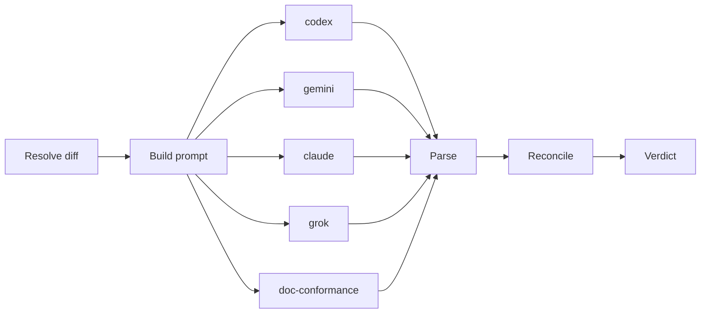

# Markdown→HTML Reference Guides Pipeline Implementation Plan

> **For agentic workers:** REQUIRED SUB-SKILL: Use superpowers:subagent-driven-development (recommended) or superpowers:executing-plans to implement this plan task-by-task. Steps use checkbox (`- [ ]`) syntax for tracking.

**Goal:** Generate self-contained, theme-styled, interactive HTML reference guides from markdown sources, proven by converting the existing hand-built `mmr-reference.html` into `content/guides/mmr/index.md` + a generated `index.html`.

**Architecture:** A new `src/guides/` module renders markdown through a unified pipeline (`remark-parse` → `remark-gfm` → `remark-directive` → custom directive plugins → `remark-rehype` → `rehype-raw` → `rehype-sanitize` → `rehype-stringify`), then wraps the sanitized body in a chrome-injecting template that inlines the dashboard theme CSS and a shared `chrome.js`. Mermaid fenced blocks are rendered to strict-sanitized inline SVG at build time by `mmdc` and cached (stable filename + sidecar manifest). A `scaffold guides` CLI opens/lists guides for humans and emits markdown/paths for agents. Generated HTML is checked in and guarded by a drift gate + security scan.

**Tech Stack:** TypeScript (ESM, Node ≥18.17, `tsc`-only build), yargs CLI, vitest. New deps: `remark-directive`, `remark-rehype`, `rehype-raw`, `rehype-sanitize`, `rehype-stringify` (already have `unified`, `remark-parse`, `remark-gfm`). Dev dep: `@mermaid-js/mermaid-cli` (`mmdc`).

**Spec:** `docs/superpowers/specs/2026-05-28-markdown-html-guides-pipeline-design.md`

---

## File Structure

| File | Responsibility |
|---|---|
| `src/guides/types.ts` | `GuideFrontmatter`, `GuideEntry`, `TocHeading` types |
| `src/guides/loader.ts` | `extractGuideFrontmatter()`, `buildGuidesIndex()` |
| `src/guides/sanitize.ts` | `guideSanitizeSchema` (rehype-sanitize schema, extended per directive) + `sanitizeSvg()` |
| `src/guides/directives.ts` | remark plugins: `remarkCallout`, `remarkTabs`, `remarkFilterTable`, `remarkChart`, `remarkSev` |
| `src/guides/mermaid.ts` | `renderMermaid()` (mmdc), `resolveDiagram()` (cache + manifest + prune), `remarkMermaid()` plugin |
| `src/guides/render.ts` | `renderGuideBody()` — runs the unified pipeline, returns `{ body, headings }` |
| `src/guides/template.ts` | `wrapInChrome()` — inline CSS + chrome.js + TOC + `data-chrome-version` → full HTML; `CHROME_VERSION` |
| `src/guides/chrome.ts` | `CHROME_JS` string (theme toggle, scrollspy, copy, mobile nav, tab/filter/sort helpers) |
| `src/guides/index-page.ts` | `renderIndexPage()` — index HTML from the manifest |
| `src/guides/lint.ts` | `lintGuide()` — escape-hatch text-equivalent + embed-count rules |
| `src/guides/build.ts` | `buildGuide()`, `buildAllGuides()` — orchestrates loader→render→template→write |
| `src/cli/commands/guides.ts` | `scaffold guides` command (open/list/markdown/print-path/build) |
| `src/utils/fs.ts` | add `getPackageGuidesDir()` |
| `scripts/check-guides-drift.sh` | drift gate + security scan (CI) |
| `content/guides/mmr/index.md` | the MMR guide source (proving ground) |
| `content/guides/mmr/index.html` | generated, checked in |
| `content/guides/index.html` | generated index page, checked in |

All test files are co-located as `src/guides/<name>.test.ts` (vitest `include` covers `src/**/*.test.ts`).

**Shared types (defined in Task 2, referenced everywhere):**

```typescript
// src/guides/types.ts
export interface GuideFrontmatter {
  title: string
  topic: string        // url-safe slug; must equal the directory name
  description: string
  category: string
  order: number
  escape_scripts?: string[]  // declared escape-hatch script filenames (security allowlist)
}

export interface GuideEntry {
  topic: string
  dir: string          // absolute path to content/guides/<topic>
  mdPath: string       // <dir>/index.md
  htmlPath: string     // <dir>/index.html
  frontmatter: GuideFrontmatter
}

export interface TocHeading {
  depth: number        // 2 or 3
  text: string
  id: string           // slug used as the heading's id and TOC anchor
}
```

---

### Task 1: Dependencies, build wiring, and `getPackageGuidesDir`

**Files:**
- Modify: `package.json` (dependencies, devDependencies, `build` script)
- Modify: `src/utils/fs.ts` (add resolver)
- Test: `src/guides/fs-guides.test.ts`

- [ ] **Step 1: Install runtime + dev dependencies**

```bash
npm install remark-directive@^3 remark-rehype@^11 rehype-raw@^7 rehype-sanitize@^6 rehype-stringify@^10
npm install --save-dev @mermaid-js/mermaid-cli@^11
```

- [ ] **Step 2: Update the `build` script to copy the theme CSS into `dist/guides/`**

In `package.json`, change the `build` script (append the copy; order matters — copy after `tsc`):

```json
"build": "tsc && cp src/core/knowledge/knowledge-update-template.md dist/core/knowledge/knowledge-update-template.md && mkdir -p dist/guides && cp lib/dashboard-theme.css dist/guides/dashboard-theme.css"
```

- [ ] **Step 3: Write the failing test for `getPackageGuidesDir`**

```typescript
// src/guides/fs-guides.test.ts
import { describe, it, expect } from 'vitest'
import path from 'node:path'
import { getPackageGuidesDir, getPackageRoot } from '../utils/fs.js'

describe('getPackageGuidesDir', () => {
  it('returns <packageRoot>/content/guides when no projectRoot given', () => {
    expect(getPackageGuidesDir()).toBe(path.join(getPackageRoot(), 'content', 'guides'))
  })

  it('prefers an existing projectRoot/content/guides', () => {
    // repo root has content/guides after this feature lands; use it as the projectRoot
    const root = getPackageRoot()
    const result = getPackageGuidesDir(root)
    expect(result).toBe(path.join(root, 'content', 'guides'))
  })
})
```

- [ ] **Step 4: Run the test to verify it fails**

Run: `npx vitest run src/guides/fs-guides.test.ts`
Expected: FAIL — `getPackageGuidesDir is not a function`.

- [ ] **Step 5: Implement `getPackageGuidesDir`**

Add to `src/utils/fs.ts`, mirroring `getPackageKnowledgeDir` (which lives at lines ~55–60):

```typescript
export function getPackageGuidesDir(projectRoot?: string): string {
  if (projectRoot) {
    const local = path.join(projectRoot, 'content', 'guides')
    if (fs.existsSync(local)) return local
  }
  return path.join(getPackageRoot(), 'content', 'guides')
}
```

- [ ] **Step 6: Create the guides content dir so the projectRoot branch resolves**

```bash
mkdir -p content/guides
```

- [ ] **Step 7: Run the test to verify it passes**

Run: `npx vitest run src/guides/fs-guides.test.ts`
Expected: PASS (both cases).

- [ ] **Step 8: Verify the build copies the CSS**

Run: `npm run build && ls dist/guides/dashboard-theme.css`
Expected: the file exists.

- [ ] **Step 9: Commit**

```bash
git add package.json package-lock.json src/utils/fs.ts src/guides/fs-guides.test.ts content/guides/.gitkeep
git commit -m "feat(guides): add deps, build CSS copy, getPackageGuidesDir"
```

(Create `content/guides/.gitkeep` first if the dir is otherwise empty: `touch content/guides/.gitkeep`.)

---

### Task 2: Guide frontmatter + manifest loader

**Files:**
- Create: `src/guides/types.ts` (content shown in File Structure above)
- Create: `src/guides/loader.ts`
- Test: `src/guides/loader.test.ts`

- [ ] **Step 1: Create the types file**

Create `src/guides/types.ts` with the exact content from the "Shared types" block above.

- [ ] **Step 2: Write the failing test**

```typescript
// src/guides/loader.test.ts
import { describe, it, expect } from 'vitest'
import path from 'node:path'
import fs from 'node:fs'
import os from 'node:os'
import { extractGuideFrontmatter, buildGuidesIndex } from './loader.js'

function tmpGuides(files: Record<string, string>): string {
  const root = fs.mkdtempSync(path.join(os.tmpdir(), 'guides-'))
  for (const [rel, body] of Object.entries(files)) {
    const full = path.join(root, rel)
    fs.mkdirSync(path.dirname(full), { recursive: true })
    fs.writeFileSync(full, body)
  }
  return root
}

const VALID_FM = `---
title: MMR Reference
topic: mmr
description: Multi-model review
category: tools
order: 10
---

# Body
`

describe('extractGuideFrontmatter', () => {
  it('parses required fields', () => {
    const fm = extractGuideFrontmatter(VALID_FM)
    expect(fm).toEqual({
      title: 'MMR Reference', topic: 'mmr',
      description: 'Multi-model review', category: 'tools', order: 10,
    })
  })

  it('returns null when frontmatter missing required fields', () => {
    expect(extractGuideFrontmatter('# no frontmatter')).toBeNull()
  })
})

describe('buildGuidesIndex', () => {
  it('indexes guide dirs by topic and skips invalid ones', () => {
    const root = tmpGuides({
      'mmr/index.md': VALID_FM,
      'broken/index.md': '# missing frontmatter',
    })
    const idx = buildGuidesIndex(root)
    expect([...idx.keys()]).toEqual(['mmr'])
    const entry = idx.get('mmr')!
    expect(entry.topic).toBe('mmr')
    expect(entry.mdPath).toBe(path.join(root, 'mmr', 'index.md'))
    expect(entry.htmlPath).toBe(path.join(root, 'mmr', 'index.html'))
  })

  it('returns empty map when dir does not exist', () => {
    expect(buildGuidesIndex(path.join(os.tmpdir(), 'nope-xyz')).size).toBe(0)
  })
})
```

- [ ] **Step 3: Run the test to verify it fails**

Run: `npx vitest run src/guides/loader.test.ts`
Expected: FAIL — module `./loader.js` not found.

- [ ] **Step 4: Implement the loader**

```typescript
// src/guides/loader.ts
import fs from 'node:fs'
import path from 'node:path'
import yaml from 'js-yaml'
import type { GuideFrontmatter, GuideEntry } from './types.js'

export function extractGuideFrontmatter(content: string): GuideFrontmatter | null {
  const lines = content.split(/\r?\n/)
  if (lines[0]?.trim() !== '---') return null
  const closeIdx = lines.indexOf('---', 1)
  if (closeIdx === -1) return null
  const yamlText = lines.slice(1, closeIdx).join('\n')
  let parsed: unknown
  try {
    parsed = yaml.load(yamlText, { schema: yaml.JSON_SCHEMA })
  } catch {
    return null
  }
  if (!parsed || typeof parsed !== 'object') return null
  const p = parsed as Record<string, unknown>
  if (
    typeof p.title !== 'string' || typeof p.topic !== 'string' ||
    typeof p.description !== 'string' || typeof p.category !== 'string' ||
    typeof p.order !== 'number'
  ) return null
  const fm: GuideFrontmatter = {
    title: p.title, topic: p.topic, description: p.description,
    category: p.category, order: p.order,
  }
  if (Array.isArray(p.escape_scripts)) {
    fm.escape_scripts = p.escape_scripts.filter((s): s is string => typeof s === 'string')
  }
  return fm
}

export function buildGuidesIndex(guidesDir: string): Map<string, GuideEntry> {
  const index = new Map<string, GuideEntry>()
  if (!fs.existsSync(guidesDir)) return index
  let dirents: fs.Dirent[]
  try {
    dirents = fs.readdirSync(guidesDir, { withFileTypes: true })
  } catch {
    return index
  }
  for (const d of dirents) {
    if (!d.isDirectory() || d.name.startsWith('.')) continue
    const dir = path.join(guidesDir, d.name)
    const mdPath = path.join(dir, 'index.md')
    if (!fs.existsSync(mdPath)) continue
    let fm: GuideFrontmatter | null
    try {
      fm = extractGuideFrontmatter(fs.readFileSync(mdPath, 'utf8'))
    } catch {
      continue
    }
    if (!fm || fm.topic !== d.name) continue
    index.set(fm.topic, { topic: fm.topic, dir, mdPath, htmlPath: path.join(dir, 'index.html'), frontmatter: fm })
  }
  return index
}
```

- [ ] **Step 5: Run the test to verify it passes**

Run: `npx vitest run src/guides/loader.test.ts`
Expected: PASS.

- [ ] **Step 6: Commit**

```bash
git add src/guides/types.ts src/guides/loader.ts src/guides/loader.test.ts
git commit -m "feat(guides): guide frontmatter parser and manifest loader"
```

---

### Task 3: Base render pipeline + sanitize schema + TOC extraction

**Files:**
- Create: `src/guides/sanitize.ts`
- Create: `src/guides/render.ts`
- Test: `src/guides/render.test.ts`

- [ ] **Step 1: Create the base sanitize schema**

```typescript
// src/guides/sanitize.ts
import { defaultSchema } from 'rehype-sanitize'
import type { Schema } from 'rehype-sanitize'

// Cloned default schema; directive tasks extend this object's allowances.
export const guideSanitizeSchema: Schema = {
  ...defaultSchema,
  attributes: {
    ...defaultSchema.attributes,
    '*': [...(defaultSchema.attributes?.['*'] ?? []), 'id', 'className'],
  },
}
```

- [ ] **Step 2: Write the failing test**

```typescript
// src/guides/render.test.ts
import { describe, it, expect } from 'vitest'
import { renderGuideBody } from './render.js'

describe('renderGuideBody', () => {
  it('renders headings, paragraphs, and a GFM table; strips frontmatter', async () => {
    const md = `---\ntitle: T\ntopic: t\ndescription: d\ncategory: c\norder: 1\n---\n\n## Section One\n\nHello **world**.\n\n| A | B |\n|---|---|\n| 1 | 2 |\n`
    const { body, headings } = await renderGuideBody(md)
    expect(body).toContain('<h2')
    expect(body).toContain('Section One')
    expect(body).toContain('<table>')
    expect(body).not.toContain('title: T') // frontmatter removed
    expect(headings).toEqual([{ depth: 2, text: 'Section One', id: 'section-one' }])
  })

  it('strips a raw <script> tag in prose', async () => {
    const { body } = await renderGuideBody('Hi\n\n<script>alert(1)</script>\n')
    expect(body).not.toContain('<script>')
  })

  it('gives h2/h3 stable slug ids', async () => {
    const { headings } = await renderGuideBody('## Foo Bar\n\n### Baz Qux\n')
    expect(headings).toEqual([
      { depth: 2, text: 'Foo Bar', id: 'foo-bar' },
      { depth: 3, text: 'Baz Qux', id: 'baz-qux' },
    ])
  })
})
```

- [ ] **Step 3: Run the test to verify it fails**

Run: `npx vitest run src/guides/render.test.ts`
Expected: FAIL — `./render.js` not found.

- [ ] **Step 4: Implement the base render pipeline**

```typescript
// src/guides/render.ts
import { unified, type Plugin } from 'unified'
import remarkParse from 'remark-parse'
import remarkGfm from 'remark-gfm'
import remarkDirective from 'remark-directive'
import remarkRehype from 'remark-rehype'
import rehypeRaw from 'rehype-raw'
import rehypeSanitize from 'rehype-sanitize'
import rehypeStringify from 'rehype-stringify'
import { visit } from 'unist-util-visit'
import { toString as mdToString } from 'mdast-util-to-string'
import type { Root as MdastRoot } from 'mdast'
import type { TocHeading } from './types.js'
import { guideSanitizeSchema } from './sanitize.js'

export interface RenderOptions {
  // remark plugins added by directive/mermaid tasks; injected so tests stay focused
  plugins?: Plugin[]
}

function slug(text: string): string {
  return text.toLowerCase().trim().replace(/[^\w\s-]/g, '').replace(/\s+/g, '-')
}

// remark plugin: assign slug ids to h2/h3 and collect them
function collectHeadings(out: TocHeading[]): Plugin {
  return () => (tree: MdastRoot) => {
    visit(tree, 'heading', (node: any) => {
      if (node.depth !== 2 && node.depth !== 3) return
      const text = mdToString(node)
      const id = slug(text)
      node.data = node.data ?? {}
      node.data.hProperties = { ...(node.data.hProperties ?? {}), id }
      out.push({ depth: node.depth, text, id })
    })
  }
}

export async function renderGuideBody(
  markdown: string,
  opts: RenderOptions = {},
): Promise<{ body: string; headings: TocHeading[] }> {
  const headings: TocHeading[] = []
  let proc = unified().use(remarkParse).use(remarkGfm).use(remarkDirective)
  for (const p of opts.plugins ?? []) proc = proc.use(p)
  proc = proc.use(collectHeadings(headings))
  const file = await proc
    .use(remarkRehype, { allowDangerousHtml: true })
    .use(rehypeRaw)
    .use(rehypeSanitize, guideSanitizeSchema)
    .use(rehypeStringify)
    .process(markdown)
  return { body: String(file), headings }
}
```

- [ ] **Step 5: Run the test to verify it passes**

Run: `npx vitest run src/guides/render.test.ts`
Expected: PASS (all three cases).

- [ ] **Step 6: Commit**

```bash
git add src/guides/sanitize.ts src/guides/render.ts src/guides/render.test.ts
git commit -m "feat(guides): base remark->rehype render pipeline with sanitize and TOC"
```

---

### Task 4: `:::callout` directive

**Files:**
- Create: `src/guides/directives.ts`
- Modify: `src/guides/sanitize.ts` (allow callout classes)
- Test: `src/guides/directives-callout.test.ts`

- [ ] **Step 1: Write the failing test**

```typescript
// src/guides/directives-callout.test.ts
import { describe, it, expect } from 'vitest'
import { renderGuideBody } from './render.js'
import { remarkCallout } from './directives.js'

describe('remarkCallout', () => {
  it('renders a container directive as a typed callout div', async () => {
    const md = ':::callout{type=warning}\nBe careful **here**.\n:::\n'
    const { body } = await renderGuideBody(md, { plugins: [remarkCallout] })
    expect(body).toContain('class="callout callout-warning"')
    expect(body).toContain('<strong>here</strong>') // body stays markdown
  })

  it('defaults to type=note when no type given', async () => {
    const { body } = await renderGuideBody(':::callout\ntext\n:::\n', { plugins: [remarkCallout] })
    expect(body).toContain('class="callout callout-note"')
  })
})
```

- [ ] **Step 2: Run the test to verify it fails**

Run: `npx vitest run src/guides/directives-callout.test.ts`
Expected: FAIL — `./directives.js` not found.

- [ ] **Step 3: Implement `remarkCallout`**

```typescript
// src/guides/directives.ts
import type { Plugin } from 'unified'
import { visit } from 'unist-util-visit'
import type { Root } from 'mdast'

const CALLOUT_TYPES = new Set(['note', 'tip', 'warning', 'danger', 'info'])

export const remarkCallout: Plugin = () => (tree: Root) => {
  visit(tree, (node: any) => {
    if (node.type !== 'containerDirective' || node.name !== 'callout') return
    const type = String(node.attributes?.type ?? 'note')
    const safe = CALLOUT_TYPES.has(type) ? type : 'note'
    node.data = node.data ?? {}
    node.data.hName = 'div'
    node.data.hProperties = { className: `callout callout-${safe}` }
  })
}
```

- [ ] **Step 4: Allow callout classes through sanitize**

In `src/guides/sanitize.ts`, the `*` rule already allows `className`, so no change is needed — confirm by re-reading the test expectation. (If a future directive needs a tag not in the default schema, extend `tagNames` here.)

- [ ] **Step 5: Run the test to verify it passes**

Run: `npx vitest run src/guides/directives-callout.test.ts`
Expected: PASS.

- [ ] **Step 6: Commit**

```bash
git add src/guides/directives.ts src/guides/directives-callout.test.ts src/guides/sanitize.ts
git commit -m "feat(guides): :::callout directive"
```

---

### Task 5: `:::tabs` / `:::tab` directive

**Files:**
- Modify: `src/guides/directives.ts` (add `remarkTabs`)
- Test: `src/guides/directives-tabs.test.ts`

- [ ] **Step 1: Write the failing test**

```typescript
// src/guides/directives-tabs.test.ts
import { describe, it, expect } from 'vitest'
import { renderGuideBody } from './render.js'
import { remarkTabs } from './directives.js'

describe('remarkTabs', () => {
  it('renders a tab group with buttons and panes', async () => {
    const md = `:::tabs\n\n:::tab{title="Codex"}\nCodex body\n:::\n\n:::tab{title="Gemini"}\nGemini body\n:::\n\n:::\n`
    const { body } = await renderGuideBody(md, { plugins: [remarkTabs] })
    expect(body).toContain('class="tabs"')
    expect(body).toContain('role="tab"')
    expect(body).toContain('data-tab="0"')
    expect(body).toContain('data-tab="1"')
    expect(body).toContain('Codex')
    expect(body).toContain('Codex body')
    expect(body).toContain('class="tabpane"')
  })
})
```

- [ ] **Step 2: Run the test to verify it fails**

Run: `npx vitest run src/guides/directives-tabs.test.ts`
Expected: FAIL — `remarkTabs` not exported.

- [ ] **Step 3: Implement `remarkTabs`**

Append to `src/guides/directives.ts`:

```typescript
export const remarkTabs: Plugin = () => (tree: Root) => {
  visit(tree, (node: any) => {
    if (node.type !== 'containerDirective' || node.name !== 'tabs') return
    const tabs = (node.children ?? []).filter(
      (c: any) => c.type === 'containerDirective' && c.name === 'tab',
    )
    const buttons = tabs.map((t: any, i: number) => ({
      type: 'paragraph',
      data: {
        hName: 'button',
        hProperties: {
          className: 'tab-btn' + (i === 0 ? ' active' : ''),
          role: 'tab',
          'data-tab': String(i),
        },
      },
      children: [{ type: 'text', value: String(t.attributes?.title ?? `Tab ${i + 1}`) }],
    }))
    const tablist = {
      type: 'paragraph',
      data: { hName: 'div', hProperties: { className: 'tablist', role: 'tablist' } },
      children: buttons,
    }
    tabs.forEach((t: any, i: number) => {
      t.data = t.data ?? {}
      t.data.hName = 'div'
      t.data.hProperties = { className: 'tabpane' + (i === 0 ? ' active' : ''), 'data-tab': String(i) }
    })
    node.data = node.data ?? {}
    node.data.hName = 'div'
    node.data.hProperties = { className: 'tabs' }
    node.children = [tablist, ...tabs]
  })
}
```

- [ ] **Step 4: Allow `role`, `data-tab`, and `button` through sanitize**

In `src/guides/sanitize.ts`, extend the schema:

```typescript
export const guideSanitizeSchema: Schema = {
  ...defaultSchema,
  tagNames: [...(defaultSchema.tagNames ?? []), 'button'],
  attributes: {
    ...defaultSchema.attributes,
    '*': [...(defaultSchema.attributes?.['*'] ?? []), 'id', 'className', 'role', 'dataTab'],
  },
}
```

(rehype-sanitize matches camelCased property names: `data-tab` → `dataTab`.)

- [ ] **Step 5: Run the test to verify it passes**

Run: `npx vitest run src/guides/directives-tabs.test.ts`
Expected: PASS.

- [ ] **Step 6: Commit**

```bash
git add src/guides/directives.ts src/guides/directives-tabs.test.ts src/guides/sanitize.ts
git commit -m "feat(guides): :::tabs directive"
```

---

### Task 6: `:::filter-table` directive

**Files:**
- Modify: `src/guides/directives.ts` (add `remarkFilterTable`)
- Test: `src/guides/directives-filter-table.test.ts`

- [ ] **Step 1: Write the failing test**

```typescript
// src/guides/directives-filter-table.test.ts
import { describe, it, expect } from 'vitest'
import { renderGuideBody } from './render.js'
import { remarkFilterTable } from './directives.js'

describe('remarkFilterTable', () => {
  it('wraps a GFM table with a filter input and filterable container', async () => {
    const md = `:::filter-table\n\n| Flag | Description |\n|---|---|\n| --pr | PR number |\n| --staged | staged diff |\n:::\n`
    const { body } = await renderGuideBody(md, { plugins: [remarkFilterTable] })
    expect(body).toContain('class="filter-table"')
    expect(body).toContain('type="text"')
    expect(body).toContain('class="filter-input"')
    expect(body).toContain('<table>')
    expect(body).toContain('--staged')
  })
})
```

- [ ] **Step 2: Run the test to verify it fails**

Run: `npx vitest run src/guides/directives-filter-table.test.ts`
Expected: FAIL — `remarkFilterTable` not exported.

- [ ] **Step 3: Implement `remarkFilterTable`**

Append to `src/guides/directives.ts`:

```typescript
export const remarkFilterTable: Plugin = () => (tree: Root) => {
  visit(tree, (node: any) => {
    if (node.type !== 'containerDirective' || node.name !== 'filter-table') return
    const input = {
      type: 'paragraph',
      data: {
        hName: 'input',
        hProperties: { type: 'text', className: 'filter-input', placeholder: 'Filter…', 'aria-label': 'Filter table rows' },
      },
      children: [],
    }
    node.data = node.data ?? {}
    node.data.hName = 'div'
    node.data.hProperties = { className: 'filter-table' }
    node.children = [input, ...(node.children ?? [])]
  })
}
```

- [ ] **Step 4: Allow `input`, `type`, `placeholder`, `aria-label` through sanitize**

In `src/guides/sanitize.ts`, extend:

```typescript
  tagNames: [...(defaultSchema.tagNames ?? []), 'button', 'input'],
  attributes: {
    ...defaultSchema.attributes,
    '*': [...(defaultSchema.attributes?.['*'] ?? []), 'id', 'className', 'role', 'dataTab', 'ariaLabel'],
    input: ['type', 'placeholder', 'className', 'ariaLabel'],
  },
```

- [ ] **Step 5: Run the test to verify it passes**

Run: `npx vitest run src/guides/directives-filter-table.test.ts`
Expected: PASS.

- [ ] **Step 6: Commit**

```bash
git add src/guides/directives.ts src/guides/directives-filter-table.test.ts src/guides/sanitize.ts
git commit -m "feat(guides): :::filter-table directive"
```

---

### Task 7: `:::chart{type=bar}` directive (build-time static bars)

**Files:**
- Modify: `src/guides/directives.ts` (add `remarkChart`)
- Test: `src/guides/directives-chart.test.ts`

- [ ] **Step 1: Write the failing test**

```typescript
// src/guides/directives-chart.test.ts
import { describe, it, expect } from 'vitest'
import { renderGuideBody } from './render.js'
import { remarkChart } from './directives.js'

describe('remarkChart', () => {
  it('renders static bars from the following table and keeps the table', async () => {
    const md = `:::chart{type=bar}\n\n| Host | Count |\n|---|---|\n| github.com | 40 |\n| npmjs.com | 10 |\n:::\n`
    const { body } = await renderGuideBody(md, { plugins: [remarkChart] })
    expect(body).toContain('class="chart chart-bar"')
    expect(body).toContain('width:100%') // max value normalised to 100%
    expect(body).toContain('width:25%')  // 10/40
    expect(body).toContain('aria-label="github.com: 40"')
    expect(body).toContain('<table>')     // source table still present
  })

  it('fails the build when not followed by a table', async () => {
    await expect(
      renderGuideBody(':::chart{type=bar}\nno table\n:::\n', { plugins: [remarkChart] }),
    ).rejects.toThrow(/chart.*table/i)
  })
})
```

- [ ] **Step 2: Run the test to verify it fails**

Run: `npx vitest run src/guides/directives-chart.test.ts`
Expected: FAIL — `remarkChart` not exported.

- [ ] **Step 3: Implement `remarkChart`**

Append to `src/guides/directives.ts` (uses `mdast-util-to-string` already available via deps):

```typescript
import { toString as mdToString } from 'mdast-util-to-string'

export const remarkChart: Plugin = () => (tree: Root) => {
  visit(tree, (node: any) => {
    if (node.type !== 'containerDirective' || node.name !== 'chart') return
    const table = (node.children ?? []).find((c: any) => c.type === 'table')
    if (!table) throw new Error('`:::chart` must contain a GFM table')
    const rows = table.children.slice(1) // drop header row
    const parsed = rows.map((r: any) => {
      const cells = r.children
      const label = mdToString(cells[0])
      const value = Number(mdToString(cells[cells.length - 1]).trim())
      if (!Number.isFinite(value)) throw new Error(`:::chart value column must be numeric (got "${label}")`)
      return { label, value }
    })
    const max = Math.max(...parsed.map((p: any) => p.value), 0) || 1
    const bars = parsed.map((p: any) => ({
      type: 'paragraph',
      data: {
        hName: 'div',
        hProperties: { className: 'chart-row', 'aria-label': `${p.label}: ${p.value}` },
      },
      children: [
        { type: 'text', value: p.label,
          data: { hName: 'span', hProperties: { className: 'chart-label' } } },
        { type: 'text', value: '',
          data: { hName: 'div', hProperties: { className: 'chart-bar', style: `width:${Math.round((p.value / max) * 100)}%` } } },
      ],
    }))
    const chart = {
      type: 'paragraph',
      data: { hName: 'div', hProperties: { className: 'chart chart-bar' } },
      children: bars,
    }
    node.data = node.data ?? {}
    node.data.hName = 'div'
    node.data.hProperties = { className: 'chart-block' }
    node.children = [chart, table] // chart THEN source table (agent reads numbers)
  })
}
```

- [ ] **Step 4: Allow `span` and a bounded `style` through sanitize**

In `src/guides/sanitize.ts`, extend. rehype-sanitize drops `style` by default; allow it only on chart bars by adding `style` to the global attribute list AND clamping later via the CI scan (the value is generated, never author-controlled):

```typescript
    '*': [...(defaultSchema.attributes?.['*'] ?? []), 'id', 'className', 'role', 'dataTab', 'ariaLabel', 'style'],
```

(Note: `style` is generated as `width:N%` only; the CI security scan asserts no other `style` patterns appear.)

- [ ] **Step 5: Run the test to verify it passes**

Run: `npx vitest run src/guides/directives-chart.test.ts`
Expected: PASS (both cases, including the throw).

- [ ] **Step 6: Commit**

```bash
git add src/guides/directives.ts src/guides/directives-chart.test.ts src/guides/sanitize.ts
git commit -m "feat(guides): :::chart{type=bar} build-time static bars"
```

---

### Task 8: `:sev[…]` inline severity badge

**Files:**
- Modify: `src/guides/directives.ts` (add `remarkSev`)
- Test: `src/guides/directives-sev.test.ts`

- [ ] **Step 1: Write the failing test**

```typescript
// src/guides/directives-sev.test.ts
import { describe, it, expect } from 'vitest'
import { renderGuideBody } from './render.js'
import { remarkSev } from './directives.js'

describe('remarkSev', () => {
  it('renders an inline severity chip', async () => {
    const { body } = await renderGuideBody('A :sev[P0]{level=p0} finding.\n', { plugins: [remarkSev] })
    expect(body).toContain('class="sev sev-p0"')
    expect(body).toContain('>P0<')
  })
})
```

- [ ] **Step 2: Run the test to verify it fails**

Run: `npx vitest run src/guides/directives-sev.test.ts`
Expected: FAIL — `remarkSev` not exported.

- [ ] **Step 3: Implement `remarkSev`**

Append to `src/guides/directives.ts`:

```typescript
const SEV_LEVELS = new Set(['p0', 'p1', 'p2', 'p3', 'pass'])

export const remarkSev: Plugin = () => (tree: Root) => {
  visit(tree, (node: any) => {
    if (node.type !== 'textDirective' || node.name !== 'sev') return
    const level = String(node.attributes?.level ?? 'p2').toLowerCase()
    const safe = SEV_LEVELS.has(level) ? level : 'p2'
    node.data = node.data ?? {}
    node.data.hName = 'span'
    node.data.hProperties = { className: `sev sev-${safe}` }
  })
}
```

- [ ] **Step 4: Run the test to verify it passes**

Run: `npx vitest run src/guides/directives-sev.test.ts`
Expected: PASS (`span` + `className` already allowed by the schema).

- [ ] **Step 5: Commit**

```bash
git add src/guides/directives.ts src/guides/directives-sev.test.ts
git commit -m "feat(guides): :sev inline severity badge"
```

---

### Task 9: Sanitize regression test (lock the schema)

**Files:**
- Test: `src/guides/sanitize.test.ts`

- [ ] **Step 1: Write the test that all directives survive sanitize AND injections are stripped**

```typescript
// src/guides/sanitize.test.ts
import { describe, it, expect } from 'vitest'
import { renderGuideBody } from './render.js'
import { remarkCallout, remarkTabs, remarkFilterTable, remarkChart, remarkSev } from './directives.js'

const ALL = [remarkCallout, remarkTabs, remarkFilterTable, remarkChart, remarkSev]

describe('guideSanitizeSchema', () => {
  it('passes legitimate directive output', async () => {
    const md = `:::callout{type=tip}\nok :sev[P1]{level=p1}\n:::\n`
    const { body } = await renderGuideBody(md, { plugins: ALL })
    expect(body).toContain('callout-tip')
    expect(body).toContain('sev-p1')
  })

  it('strips script, event handlers, and iframes from prose', async () => {
    const md = `text\n\n<script>alert(1)</script>\n\n<a href="javascript:alert(1)" onclick="x()">x</a>\n\n<iframe src="http://evil"></iframe>\n`
    const { body } = await renderGuideBody(md, { plugins: ALL })
    expect(body).not.toContain('<script')
    expect(body).not.toContain('onclick')
    expect(body).not.toContain('javascript:')
    expect(body).not.toContain('<iframe')
  })
})
```

- [ ] **Step 2: Run the test**

Run: `npx vitest run src/guides/sanitize.test.ts`
Expected: PASS. If any directive class is stripped, add the missing allowance to `src/guides/sanitize.ts` and re-run.

- [ ] **Step 3: Commit**

```bash
git add src/guides/sanitize.test.ts src/guides/sanitize.ts
git commit -m "test(guides): lock sanitize schema against injection"
```

---

### Task 10: Mermaid render + strict SVG sanitize + cache/manifest/prune

**Files:**
- Create: `src/guides/mermaid.ts`
- Test: `src/guides/mermaid.test.ts`

- [ ] **Step 1: Write the failing test (renderer injected — no browser in unit tests)**

```typescript
// src/guides/mermaid.test.ts
import { describe, it, expect, vi } from 'vitest'
import fs from 'node:fs'
import path from 'node:path'
import os from 'node:os'
import { sanitizeSvg, resolveDiagram, computeFingerprint } from './mermaid.js'

describe('sanitizeSvg', () => {
  it('strips script, foreignObject, on* and javascript hrefs', () => {
    const dirty = `<svg><script>x()</script><foreignObject></foreignObject><a xlink:href="javascript:x()" onclick="y()"><rect/></a></svg>`
    const clean = sanitizeSvg(dirty)
    expect(clean).not.toContain('<script')
    expect(clean).not.toContain('foreignObject')
    expect(clean).not.toContain('onclick')
    expect(clean).not.toContain('javascript:')
    expect(clean).toContain('<rect')
  })
})

describe('resolveDiagram', () => {
  it('renders on a cache miss and writes the SVG + manifest', async () => {
    const dir = fs.mkdtempSync(path.join(os.tmpdir(), 'mmd-'))
    const render = vi.fn(async () => '<svg><rect/></svg>')
    const svg = await resolveDiagram({ guideDir: dir, diagramId: 'd0', source: 'flowchart LR\nA-->B', render })
    expect(render).toHaveBeenCalledTimes(1)
    expect(svg).toContain('<rect')
    expect(fs.existsSync(path.join(dir, '.diagrams', 'd0.svg'))).toBe(true)
    const manifest = JSON.parse(fs.readFileSync(path.join(dir, '.diagrams', 'manifest.json'), 'utf8'))
    expect(manifest.d0).toBe(computeFingerprint('flowchart LR\nA-->B'))
  })

  it('uses cache on a hit (no render call)', async () => {
    const dir = fs.mkdtempSync(path.join(os.tmpdir(), 'mmd-'))
    const render = vi.fn(async () => '<svg><rect/></svg>')
    await resolveDiagram({ guideDir: dir, diagramId: 'd0', source: 'X', render })
    render.mockClear()
    const svg = await resolveDiagram({ guideDir: dir, diagramId: 'd0', source: 'X', render })
    expect(render).not.toHaveBeenCalled()
    expect(svg).toContain('<rect')
  })
})
```

- [ ] **Step 2: Run the test to verify it fails**

Run: `npx vitest run src/guides/mermaid.test.ts`
Expected: FAIL — `./mermaid.js` not found.

- [ ] **Step 3: Implement `mermaid.ts`**

```typescript
// src/guides/mermaid.ts
import fs from 'node:fs'
import path from 'node:path'
import { createHash } from 'node:crypto'
import { execFileSync } from 'node:child_process'
import type { Plugin } from 'unified'
import { visit } from 'unist-util-visit'
import type { Root } from 'mdast'

const MMDC_VERSION_FINGERPRINT = 'mmdc11' // bump when render options/version change
const RENDER_OPTS = '-t neutral -b transparent'

export function computeFingerprint(source: string): string {
  return createHash('sha256').update(`${MMDC_VERSION_FINGERPRINT}\n${RENDER_OPTS}\n${source}`).digest('hex').slice(0, 16)
}

// Strict, allowlist-free SVG hardening: remove dangerous elements/attrs.
export function sanitizeSvg(svg: string): string {
  return svg
    .replace(/<script[\s\S]*?<\/script>/gi, '')
    .replace(/<foreignObject[\s\S]*?<\/foreignObject>/gi, '')
    .replace(/\son\w+\s*=\s*("[^"]*"|'[^']*'|[^\s>]+)/gi, '')
    .replace(/((?:xlink:)?href)\s*=\s*("javascript:[^"]*"|'javascript:[^']*')/gi, '')
}

// Default renderer: shells out to mmdc (build-time, needs a browser).
export async function renderMermaid(source: string): Promise<string> {
  const tmp = fs.mkdtempSync(path.join(require('node:os').tmpdir(), 'mmdc-'))
  const inFile = path.join(tmp, 'in.mmd')
  const outFile = path.join(tmp, 'out.svg')
  fs.writeFileSync(inFile, source)
  execFileSync('npx', ['--no-install', 'mmdc', '-i', inFile, '-o', outFile, ...RENDER_OPTS.split(' ')], { stdio: 'pipe' })
  return fs.readFileSync(outFile, 'utf8')
}

export interface ResolveArgs {
  guideDir: string
  diagramId: string
  source: string
  render?: (source: string) => Promise<string>
}

export async function resolveDiagram(args: ResolveArgs): Promise<string> {
  const { guideDir, diagramId, source } = args
  const render = args.render ?? renderMermaid
  const cacheDir = path.join(guideDir, '.diagrams')
  const svgPath = path.join(cacheDir, `${diagramId}.svg`)
  const manifestPath = path.join(cacheDir, 'manifest.json')
  const fp = computeFingerprint(source)
  const manifest: Record<string, string> = fs.existsSync(manifestPath)
    ? JSON.parse(fs.readFileSync(manifestPath, 'utf8'))
    : {}
  if (manifest[diagramId] === fp && fs.existsSync(svgPath)) {
    return fs.readFileSync(svgPath, 'utf8')
  }
  let raw: string
  try {
    raw = await render(source)
  } catch (e) {
    throw new Error(`mermaid render failed for "${diagramId}" (no browser? install per dev-setup.md). Cache: ${svgPath}\n${String(e)}`)
  }
  const clean = sanitizeSvg(raw)
  fs.mkdirSync(cacheDir, { recursive: true })
  fs.writeFileSync(svgPath, clean)
  manifest[diagramId] = fp
  fs.writeFileSync(manifestPath, JSON.stringify(manifest, null, 2) + '\n')
  return clean
}

// Prune cached SVGs whose diagramId is no longer present.
export function pruneDiagrams(guideDir: string, keepIds: string[]): void {
  const cacheDir = path.join(guideDir, '.diagrams')
  if (!fs.existsSync(cacheDir)) return
  const keep = new Set(keepIds)
  for (const f of fs.readdirSync(cacheDir)) {
    if (f.endsWith('.svg') && !keep.has(f.replace(/\.svg$/, ''))) fs.rmSync(path.join(cacheDir, f))
  }
  const manifestPath = path.join(cacheDir, 'manifest.json')
  if (fs.existsSync(manifestPath)) {
    const m: Record<string, string> = JSON.parse(fs.readFileSync(manifestPath, 'utf8'))
    for (const k of Object.keys(m)) if (!keep.has(k)) delete m[k]
    fs.writeFileSync(manifestPath, JSON.stringify(m, null, 2) + '\n')
  }
}

// remark plugin: replace ```mermaid code blocks with the resolved inline SVG.
// Diagram id = `diagram-<n>` by document order.
export function remarkMermaid(opts: { guideDir: string; render?: (s: string) => Promise<string> }): Plugin {
  return () => async (tree: Root) => {
    const jobs: Array<Promise<void>> = []
    let n = 0
    visit(tree, 'code', (node: any) => {
      if (node.lang !== 'mermaid') return
      const diagramId = `diagram-${n++}`
      const source = node.value
      jobs.push(
        resolveDiagram({ guideDir: opts.guideDir, diagramId, source, render: opts.render }).then((svg) => {
          node.type = 'html'
          node.value = `<figure class="mermaid">${svg}</figure>`
        }),
      )
    })
    await Promise.all(jobs)
  }
}
```

- [ ] **Step 4: Run the test to verify it passes**

Run: `npx vitest run src/guides/mermaid.test.ts`
Expected: PASS (sanitize + cache-miss + cache-hit).

- [ ] **Step 5: Allow `figure` + inline `svg` through sanitize for mermaid output**

Mermaid SVG is injected as a raw `html` node. To let it survive `rehype-sanitize`, the cleanest approach is to render mermaid into the body **after** sanitize, OR allow the SVG subtree. Since the SVG is already hardened by `sanitizeSvg`, mark mermaid figures to bypass the prose schema by allowing `svg` + its children in the schema. In `src/guides/sanitize.ts`, extend (svg element set is large; allow the common mermaid tags):

```typescript
  tagNames: [
    ...(defaultSchema.tagNames ?? []), 'button', 'input', 'figure',
    'svg', 'g', 'path', 'rect', 'circle', 'line', 'polygon', 'polyline', 'text', 'tspan', 'marker', 'defs', 'use',
  ],
  attributes: {
    ...defaultSchema.attributes,
    '*': [...(defaultSchema.attributes?.['*'] ?? []), 'id', 'className', 'role', 'dataTab', 'ariaLabel', 'style'],
    input: ['type', 'placeholder', 'className', 'ariaLabel'],
    svg: ['viewBox', 'width', 'height', 'xmlns', 'preserveAspectRatio', 'role', 'ariaLabel'],
    '*svg': ['d', 'x', 'y', 'x1', 'y1', 'x2', 'y2', 'cx', 'cy', 'r', 'rx', 'ry', 'points', 'transform', 'fill', 'stroke', 'strokeWidth', 'markerEnd', 'className', 'style', 'textAnchor'],
  },
```

Add a test asserting a mermaid `<figure class="mermaid"><svg>…</svg></figure>` body survives sanitize and a `<script>` inside an SVG does not. Re-run `npx vitest run src/guides/mermaid.test.ts src/guides/sanitize.test.ts` until green.

- [ ] **Step 6: Commit**

```bash
git add src/guides/mermaid.ts src/guides/mermaid.test.ts src/guides/sanitize.ts
git commit -m "feat(guides): mermaid render + strict SVG sanitize + fingerprinted cache"
```

---

### Task 11: Chrome JS + template wrapper

**Files:**
- Create: `src/guides/chrome.ts`
- Create: `src/guides/template.ts`
- Test: `src/guides/template.test.ts`

- [ ] **Step 1: Create the chrome JS bundle**

```typescript
// src/guides/chrome.ts
// Self-contained, dependency-free behavior shared by every guide.
export const CHROME_JS = `
(function(){
  // theme
  var root=document.documentElement;
  var saved=localStorage.getItem('guide-theme');
  if(saved){root.setAttribute('data-theme',saved);}
  else if(window.matchMedia&&matchMedia('(prefers-color-scheme: dark)').matches){root.setAttribute('data-theme','dark');}
  document.addEventListener('click',function(e){
    var t=e.target.closest('[data-action]'); if(!t)return;
    var a=t.getAttribute('data-action');
    if(a==='theme'){var d=root.getAttribute('data-theme')==='dark'?'light':'dark';root.setAttribute('data-theme',d);localStorage.setItem('guide-theme',d);}
    if(a==='nav'){document.querySelector('.rail').classList.toggle('open');}
    if(a==='copy'){var pre=t.closest('.code').querySelector('pre');navigator.clipboard&&navigator.clipboard.writeText(pre.innerText);t.textContent='Copied';setTimeout(function(){t.textContent='Copy';},1200);}
  });
  // tabs
  document.addEventListener('click',function(e){
    var b=e.target.closest('.tab-btn'); if(!b)return;
    var group=b.closest('.tabs'); var i=b.getAttribute('data-tab');
    group.querySelectorAll('.tab-btn').forEach(function(x){x.classList.toggle('active',x===b);});
    group.querySelectorAll('.tabpane').forEach(function(p){p.classList.toggle('active',p.getAttribute('data-tab')===i);});
  });
  // filter-table
  document.addEventListener('input',function(e){
    var inp=e.target.closest('.filter-input'); if(!inp)return;
    var q=inp.value.toLowerCase();
    inp.closest('.filter-table').querySelectorAll('tbody tr').forEach(function(tr){
      tr.style.display=tr.textContent.toLowerCase().indexOf(q)>-1?'':'none';
    });
  });
  // scrollspy
  var links=[].slice.call(document.querySelectorAll('.toc a'));
  var map={}; links.forEach(function(l){map[l.getAttribute('href').slice(1)]=l;});
  var obs=new IntersectionObserver(function(es){es.forEach(function(en){if(en.isIntersecting){links.forEach(function(l){l.classList.remove('active');});var l=map[en.target.id];if(l)l.classList.add('active');}});},{rootMargin:'-10% 0px -80% 0px'});
  document.querySelectorAll('h2[id],h3[id]').forEach(function(h){obs.observe(h);});
})();
`.trim()
```

- [ ] **Step 2: Write the failing test for the template**

```typescript
// src/guides/template.test.ts
import { describe, it, expect } from 'vitest'
import { wrapInChrome, CHROME_VERSION } from './template.js'

describe('wrapInChrome', () => {
  const args = {
    title: 'MMR Reference',
    body: '<h2 id="intro">Intro</h2><p>hi</p>',
    headings: [{ depth: 2, text: 'Intro', id: 'intro' }],
    css: ':root{--bg:#fff}',
  }

  it('produces a full self-contained HTML doc', () => {
    const html = wrapInChrome(args)
    expect(html).toMatch(/^<!DOCTYPE html>/)
    expect(html).toContain('<title>MMR Reference</title>')
    expect(html).toContain('<style>:root{--bg:#fff}</style>') // CSS inlined
    expect(html).toContain('--bg') // theme token present
    expect(html).toContain('data-chrome-version="' + CHROME_VERSION + '"')
    expect(html).toContain('scaffold:chrome v' + CHROME_VERSION) // marker comment
  })

  it('builds a TOC from headings', () => {
    const html = wrapInChrome(args)
    expect(html).toContain('href="#intro"')
    expect(html).toContain('>Intro<')
  })

  it('has no external network references', () => {
    const html = wrapInChrome(args)
    expect(html).not.toMatch(/https?:\/\//)
    expect(html).not.toContain('<link rel="stylesheet"')
  })
})
```

- [ ] **Step 3: Run the test to verify it fails**

Run: `npx vitest run src/guides/template.test.ts`
Expected: FAIL — `./template.js` not found.

- [ ] **Step 4: Implement the template**

```typescript
// src/guides/template.ts
import type { TocHeading } from './types.js'
import { CHROME_JS } from './chrome.js'

export const CHROME_VERSION = 1

export interface WrapArgs {
  title: string
  body: string
  headings: TocHeading[]
  css: string
}

function esc(s: string): string {
  return s.replace(/&/g, '&amp;').replace(/</g, '&lt;').replace(/>/g, '&gt;').replace(/"/g, '&quot;')
}

function toc(headings: TocHeading[]): string {
  const items = headings
    .map((h) => `<li class="toc-${h.depth}"><a href="#${esc(h.id)}">${esc(h.text)}</a></li>`)
    .join('')
  return `<nav class="toc" aria-label="Table of contents"><ul>${items}</ul></nav>`
}

export function wrapInChrome({ title, body, headings, css }: WrapArgs): string {
  return `<!DOCTYPE html>
<html lang="en" data-chrome-version="${CHROME_VERSION}">
<head>
<meta charset="utf-8">
<meta name="viewport" content="width=device-width, initial-scale=1">
<title>${esc(title)}</title>
<!-- scaffold:chrome v${CHROME_VERSION} -->
<style>${css}</style>
</head>
<body>
<header class="topbar">
  <button data-action="nav" class="nav-toggle" aria-label="Toggle navigation">☰</button>
  <h1>${esc(title)}</h1>
  <button data-action="theme" class="theme-toggle" aria-label="Toggle theme">◐</button>
</header>
<div class="layout">
  <aside class="rail">${toc(headings)}</aside>
  <main class="content">${body}</main>
</div>
<script>${CHROME_JS}</script>
</body>
</html>
`
}
```

- [ ] **Step 5: Run the test to verify it passes**

Run: `npx vitest run src/guides/template.test.ts`
Expected: PASS (all three cases).

- [ ] **Step 6: Commit**

```bash
git add src/guides/chrome.ts src/guides/template.ts src/guides/template.test.ts
git commit -m "feat(guides): chrome.js + self-contained HTML template"
```

---

### Task 12: Escape-hatch lint

**Files:**
- Create: `src/guides/lint.ts`
- Test: `src/guides/lint.test.ts`

- [ ] **Step 1: Write the failing test**

```typescript
// src/guides/lint.test.ts
import { describe, it, expect } from 'vitest'
import { lintGuide } from './lint.js'

describe('lintGuide', () => {
  it('passes a guide with no embeds', () => {
    const r = lintGuide('# Hi\n\nplain markdown\n')
    expect(r.errors).toEqual([])
    expect(r.warnings).toEqual([])
  })

  it('errors when an :::embed lacks a text-equivalent', () => {
    const md = ':::embed{src=partials/x.svg}\n:::\n'
    const r = lintGuide(md)
    expect(r.errors.some((e) => /text.equivalent/i.test(e))).toBe(true)
  })

  it('passes an :::embed that includes a text-equivalent', () => {
    const md = ':::embed{src=partials/x.svg}\n**Text equivalent:** a diagram.\n:::\n'
    expect(lintGuide(md).errors).toEqual([])
  })

  it('warns past 3 embeds', () => {
    const one = ':::embed{src=p.svg}\n**Text equivalent:** x\n:::\n\n'
    const r = lintGuide(one.repeat(4))
    expect(r.warnings.some((w) => /embed/i.test(w))).toBe(true)
  })
})
```

- [ ] **Step 2: Run the test to verify it fails**

Run: `npx vitest run src/guides/lint.test.ts`
Expected: FAIL — `./lint.js` not found.

- [ ] **Step 3: Implement the lint**

```typescript
// src/guides/lint.ts
export interface LintResult { errors: string[]; warnings: string[] }

const EMBED_OPEN = /^:::embed\{[^}]*\}\s*$/
const EMBED_CLOSE = /^:::\s*$/
const TEXT_EQUIV = /text[\s-]?equivalent/i

export function lintGuide(markdown: string): LintResult {
  const errors: string[] = []
  const warnings: string[] = []
  const lines = markdown.split(/\r?\n/)
  let embedCount = 0
  for (let i = 0; i < lines.length; i++) {
    if (!EMBED_OPEN.test(lines[i])) continue
    embedCount++
    let body = ''
    let j = i + 1
    for (; j < lines.length && !EMBED_CLOSE.test(lines[j]); j++) body += lines[j] + '\n'
    if (!TEXT_EQUIV.test(body)) {
      errors.push(`:::embed at line ${i + 1} is missing a text-equivalent (required for agent-readability)`)
    }
    i = j
  }
  if (embedCount > 3) {
    warnings.push(`guide uses ${embedCount} escape-hatch embeds (>3) — prefer first-class directives`)
  }
  return { errors, warnings }
}
```

- [ ] **Step 4: Run the test to verify it passes**

Run: `npx vitest run src/guides/lint.test.ts`
Expected: PASS (all four cases).

- [ ] **Step 5: Commit**

```bash
git add src/guides/lint.ts src/guides/lint.test.ts
git commit -m "feat(guides): escape-hatch lint (text-equivalent + embed count)"
```

---

### Task 13: Build orchestration (`buildGuide` / `buildAllGuides`) + index page

**Files:**
- Create: `src/guides/index-page.ts`
- Create: `src/guides/build.ts`
- Test: `src/guides/build.test.ts`

- [ ] **Step 1: Write the failing test (render a guide end-to-end with a stub mermaid renderer)**

```typescript
// src/guides/build.test.ts
import { describe, it, expect } from 'vitest'
import fs from 'node:fs'
import path from 'node:path'
import os from 'node:os'
import { buildGuide } from './build.js'
import { renderIndexPage } from './index-page.js'

const CSS = ':root{--bg:#fff}'

const GUIDE_MD = `---
title: MMR
topic: mmr
description: review
category: tools
order: 10
---

## Intro

:::callout{type=tip}
Use :sev[P1]{level=p1} wisely.
:::

| Flag | Desc |
|---|---|
| --pr | number |
`

describe('buildGuide', () => {
  it('writes a self-contained index.html and returns the lint result', async () => {
    const root = fs.mkdtempSync(path.join(os.tmpdir(), 'gb-'))
    const dir = path.join(root, 'mmr')
    fs.mkdirSync(dir, { recursive: true })
    fs.writeFileSync(path.join(dir, 'index.md'), GUIDE_MD)
    const res = await buildGuide({ guideDir: dir, css: CSS, mermaidRender: async () => '<svg><rect/></svg>' })
    const html = fs.readFileSync(path.join(dir, 'index.html'), 'utf8')
    expect(html).toContain('<title>MMR</title>')
    expect(html).toContain('callout-tip')
    expect(html).toContain('sev-p1')
    expect(res.lint.errors).toEqual([])
  })

  it('throws when lint finds a missing text-equivalent', async () => {
    const root = fs.mkdtempSync(path.join(os.tmpdir(), 'gb-'))
    const dir = path.join(root, 'mmr')
    fs.mkdirSync(dir, { recursive: true })
    fs.writeFileSync(path.join(dir, 'index.md'),
      GUIDE_MD + '\n:::embed{src=partials/x.svg}\n:::\n')
    await expect(buildGuide({ guideDir: dir, css: CSS, mermaidRender: async () => '' }))
      .rejects.toThrow(/text-equivalent/i)
  })
})

describe('renderIndexPage', () => {
  it('lists guides by order with links', () => {
    const html = renderIndexPage([
      { topic: 'mmr', frontmatter: { title: 'MMR', topic: 'mmr', description: 'review', category: 'tools', order: 10 } } as any,
    ], CSS)
    expect(html).toContain('href="mmr/index.html"')
    expect(html).toContain('MMR')
    expect(html).toContain('review')
  })
})
```

- [ ] **Step 2: Run the test to verify it fails**

Run: `npx vitest run src/guides/build.test.ts`
Expected: FAIL — `./build.js` / `./index-page.js` not found.

- [ ] **Step 3: Implement `index-page.ts`**

```typescript
// src/guides/index-page.ts
import type { GuideEntry } from './types.js'
import { wrapInChrome } from './template.js'

export function renderIndexPage(entries: GuideEntry[], css: string): string {
  const sorted = [...entries].sort((a, b) => a.frontmatter.order - b.frontmatter.order)
  const items = sorted.map((e) =>
    `<li><a href="${e.topic}/index.html"><strong>${e.frontmatter.title}</strong></a>` +
    `<span class="cat">${e.frontmatter.category}</span>` +
    `<p>${e.frontmatter.description}</p></li>`,
  ).join('')
  return wrapInChrome({
    title: 'Scaffold Guides',
    body: `<h2 id="guides">Guides</h2><ul class="guide-index">${items}</ul>`,
    headings: [{ depth: 2, text: 'Guides', id: 'guides' }],
    css,
  })
}
```

- [ ] **Step 4: Implement `build.ts`**

```typescript
// src/guides/build.ts
import fs from 'node:fs'
import path from 'node:path'
import { atomicWriteFile, getPackageRoot, getPackageGuidesDir } from '../utils/fs.js'
import { buildGuidesIndex } from './loader.js'
import { renderGuideBody } from './render.js'
import { remarkCallout, remarkTabs, remarkFilterTable, remarkChart, remarkSev } from './directives.js'
import { remarkMermaid, pruneDiagrams } from './mermaid.js'
import { wrapInChrome } from './template.js'
import { renderIndexPage } from './index-page.js'
import { lintGuide } from './lint.js'
import type { LintResult } from './lint.js'

function loadThemeCss(): string {
  const p = path.join(getPackageRoot(), 'dist', 'guides', 'dashboard-theme.css')
  if (!fs.existsSync(p)) {
    throw new Error(`Missing ${p} — run \`npm run build\` (the build copies lib/dashboard-theme.css into dist/guides/).`)
  }
  return fs.readFileSync(p, 'utf8')
}

export interface BuildGuideArgs {
  guideDir: string
  css: string
  mermaidRender?: (source: string) => Promise<string>
}

export async function buildGuide(args: BuildGuideArgs): Promise<{ lint: LintResult }> {
  const md = fs.readFileSync(path.join(args.guideDir, 'index.md'), 'utf8')
  const lint = lintGuide(md)
  if (lint.errors.length) {
    throw new Error(`guide lint failed:\n  ${lint.errors.join('\n  ')}`)
  }
  for (const w of lint.warnings) process.stderr.write(`warning: ${w}\n`)
  const titleMatch = /^title:\s*(.+)$/m.exec(md.split('---')[1] ?? '')
  const title = titleMatch ? titleMatch[1].trim() : path.basename(args.guideDir)
  const { body, headings } = await renderGuideBody(md, {
    plugins: [
      remarkCallout, remarkTabs, remarkFilterTable, remarkChart, remarkSev,
      remarkMermaid({ guideDir: args.guideDir, render: args.mermaidRender }),
    ],
  })
  // prune diagrams no longer referenced (ids are diagram-<n>; recompute count)
  const diagramCount = (md.match(/```mermaid/g) ?? []).length
  pruneDiagrams(args.guideDir, Array.from({ length: diagramCount }, (_, i) => `diagram-${i}`))
  const html = wrapInChrome({ title, body, headings, css: args.css })
  atomicWriteFile(path.join(args.guideDir, 'index.html'), html)
  return { lint }
}

export async function buildAllGuides(projectRoot?: string): Promise<void> {
  const css = loadThemeCss()
  const guidesDir = getPackageGuidesDir(projectRoot)
  const index = buildGuidesIndex(guidesDir)
  for (const entry of index.values()) {
    await buildGuide({ guideDir: entry.dir, css })
  }
  atomicWriteFile(path.join(guidesDir, 'index.html'), renderIndexPage([...index.values()], css))
}
```

- [ ] **Step 5: Run the test to verify it passes**

Run: `npx vitest run src/guides/build.test.ts`
Expected: PASS (both `buildGuide` cases + `renderIndexPage`).

- [ ] **Step 6: Commit**

```bash
git add src/guides/index-page.ts src/guides/build.ts src/guides/build.test.ts
git commit -m "feat(guides): build orchestration and index page"
```

---

### Task 14: `scaffold guides` CLI command

**Files:**
- Create: `src/cli/commands/guides.ts`
- Modify: `src/cli/index.ts` (import + register)
- Test: `src/guides/cli-guides.test.ts`

- [ ] **Step 1: Write the failing test (exercise list + print-path + markdown logic via exported helpers)**

```typescript
// src/guides/cli-guides.test.ts
import { describe, it, expect } from 'vitest'
import fs from 'node:fs'
import path from 'node:path'
import os from 'node:os'
import { listGuides, resolveGuide } from '../cli/commands/guides.js'

const FM = `---\ntitle: MMR\ntopic: mmr\ndescription: review\ncategory: tools\norder: 10\n---\n# x\n`

function fixture(): string {
  const root = fs.mkdtempSync(path.join(os.tmpdir(), 'cli-'))
  const dir = path.join(root, 'content', 'guides', 'mmr')
  fs.mkdirSync(dir, { recursive: true })
  fs.writeFileSync(path.join(dir, 'index.md'), FM)
  fs.writeFileSync(path.join(dir, 'index.html'), '<html></html>')
  return root
}

describe('listGuides', () => {
  it('returns guide summaries sorted by order', () => {
    const list = listGuides(fixture())
    expect(list).toEqual([{ topic: 'mmr', title: 'MMR', description: 'review', category: 'tools' }])
  })
})

describe('resolveGuide', () => {
  it('returns md and html paths for a topic', () => {
    const root = fixture()
    const g = resolveGuide(root, 'mmr')!
    expect(g.mdPath.endsWith(path.join('mmr', 'index.md'))).toBe(true)
    expect(g.htmlPath.endsWith(path.join('mmr', 'index.html'))).toBe(true)
  })

  it('returns null for an unknown topic', () => {
    expect(resolveGuide(fixture(), 'nope')).toBeNull()
  })
})
```

- [ ] **Step 2: Run the test to verify it fails**

Run: `npx vitest run src/guides/cli-guides.test.ts`
Expected: FAIL — `../cli/commands/guides.js` not found.

- [ ] **Step 3: Implement the command**

```typescript
// src/cli/commands/guides.ts
import type { CommandModule, Argv } from 'yargs'
import fs from 'node:fs'
import { execFileSync } from 'node:child_process'
import { getPackageGuidesDir } from '../../utils/fs.js'
import { buildGuidesIndex } from '../../guides/loader.js'
import { buildAllGuides } from '../../guides/build.js'
import { findProjectRoot } from '../middleware/project-root.js'
import { resolveOutputMode } from '../middleware/output-mode.js'
import { createOutputContext } from '../output/context.js'
import type { GuideEntry } from '../../guides/types.js'

export interface GuideSummary { topic: string; title: string; description: string; category: string }

export function listGuides(projectRoot?: string): GuideSummary[] {
  const idx = buildGuidesIndex(getPackageGuidesDir(projectRoot))
  return [...idx.values()]
    .sort((a, b) => a.frontmatter.order - b.frontmatter.order)
    .map((e) => ({ topic: e.topic, title: e.frontmatter.title, description: e.frontmatter.description, category: e.frontmatter.category }))
}

export function resolveGuide(projectRoot: string | undefined, topic: string): GuideEntry | null {
  return buildGuidesIndex(getPackageGuidesDir(projectRoot)).get(topic) ?? null
}

function openInBrowser(file: string): void {
  let opener = 'xdg-open'
  if (process.platform === 'darwin') opener = 'open'
  if (process.platform === 'win32') opener = 'start'
  try { execFileSync(opener, [file]) } catch { /* ignore */ }
}

interface GuidesArgs {
  topic?: string
  list?: boolean
  markdown?: boolean
  'print-path'?: boolean
  'no-open'?: boolean
  build?: boolean
  all?: boolean
  format?: string
  auto?: boolean
  root?: string
}

const guidesCommand: CommandModule<Record<string, unknown>, GuidesArgs> = {
  command: 'guides [topic]',
  describe: 'Open, list, or build scaffold reference guides',
  builder: (yargs: Argv) =>
    yargs
      .positional('topic', { type: 'string', describe: 'Guide topic to open' })
      .option('list', { type: 'boolean', default: false, describe: 'List available guides' })
      .option('markdown', { type: 'boolean', default: false, describe: 'Print the guide markdown source' })
      .option('print-path', { type: 'boolean', default: false, describe: "Print the guide's markdown path" })
      .option('no-open', { type: 'boolean', default: false, describe: 'Do not open a browser' })
      .option('build', { type: 'boolean', default: false, describe: 'Regenerate guide HTML from sources (maintainer)' })
      .option('all', { type: 'boolean', default: false, describe: 'With --build, regenerate every guide' }) as Argv<GuidesArgs>,
  handler: async (argv) => {
    const output = createOutputContext(resolveOutputMode(argv))
    const projectRoot = argv.root ?? findProjectRoot(process.cwd()) ?? undefined

    if (argv.build) {
      await buildAllGuides(projectRoot)
      output.info('Guides rebuilt.')
      process.exit(0)
    }
    if (argv.list || !argv.topic) {
      const guides = listGuides(projectRoot)
      if (resolveOutputMode(argv) === 'json') output.result(guides)
      else {
        if (!argv.topic && !argv.list) {
          // open the index page
          const indexHtml = `${getPackageGuidesDir(projectRoot)}/index.html`
          if (!argv['no-open'] && fs.existsSync(indexHtml)) openInBrowser(indexHtml)
          output.info(`Guides index: ${indexHtml}`)
          process.exit(0)
        }
        for (const g of guides) output.info(`${g.topic.padEnd(16)} ${g.description}`)
      }
      process.exit(0)
    }
    const guide = resolveGuide(projectRoot, argv.topic)
    if (!guide) {
      output.error({ code: 'GUIDE_NOT_FOUND', message: `No guide named "${argv.topic}"` })
      process.exit(1)
    }
    if (argv['print-path']) { output.info(guide.mdPath); process.exit(0) }
    if (argv.markdown) { output.info(fs.readFileSync(guide.mdPath, 'utf8')); process.exit(0) }
    if (!argv['no-open']) openInBrowser(guide.htmlPath)
    output.info(`Opened ${guide.htmlPath}`)
    process.exit(0)
  },
}

export default guidesCommand
```

- [ ] **Step 4: Register the command**

In `src/cli/index.ts`, add the import alongside the others (after line 26 `observeCommand`):

```typescript
import guidesCommand from './commands/guides.js'
```

And register it in the `.command(...)` chain (after `.command(dashboardCommand)`):

```typescript
    .command(guidesCommand)
```

- [ ] **Step 5: Run the test to verify it passes**

Run: `npx vitest run src/guides/cli-guides.test.ts`
Expected: PASS (listGuides + resolveGuide cases).

- [ ] **Step 6: Build and smoke-test the CLI**

Run: `npm run build && node dist/index.js guides --list --format json`
Expected: `[]` (no guides yet) — confirms the command is wired and exits cleanly.

- [ ] **Step 7: Commit**

```bash
git add src/cli/commands/guides.ts src/cli/index.ts src/guides/cli-guides.test.ts
git commit -m "feat(guides): scaffold guides command (open/list/markdown/print-path/build)"
```

---

### Task 15: Drift gate + security scan script

**Files:**
- Create: `scripts/check-guides-drift.sh`
- Modify: `Makefile` (add `guides-check` target)
- Modify: `.github/workflows/*` CI (add a step — confirm the workflow filename during implementation)

- [ ] **Step 1: Write the drift + security script**

```bash
# scripts/check-guides-drift.sh
#!/usr/bin/env bash
set -euo pipefail

# Regenerate all guides and fail if the working tree changed (HTML is checked in).
node dist/index.js guides --build

if ! git diff --quiet -- content/guides; then
  echo "ERROR: generated guide HTML is stale. Run 'scaffold guides --build' and commit." >&2
  git --no-pager diff --stat -- content/guides >&2
  exit 1
fi

# Security scan: no <script> outside the chrome marker bundle, no on*= handlers,
# no javascript:, no external src, no style= other than chart bars (width:N%).
fail=0
while IFS= read -r html; do
  # strip the single known chrome <script>…</script> (it directly follows the marker)
  body="$(perl -0777 -pe 's/<script>.*?<\/script>//s' "$html")"
  if grep -qiE '<script' <<<"$body"; then echo "FAIL $html: unexpected <script>"; fail=1; fi
  if grep -qiE '\son[a-z]+=' <<<"$body"; then echo "FAIL $html: inline event handler"; fail=1; fi
  if grep -qiE 'javascript:' <<<"$body"; then echo "FAIL $html: javascript: uri"; fail=1; fi
  if grep -qiE 'src="https?:' <<<"$body"; then echo "FAIL $html: external src"; fail=1; fi
  if grep -oiE 'style="[^"]*"' <<<"$body" | grep -qivE 'style="width:[0-9]+%"'; then
    echo "FAIL $html: unexpected style attribute"; fail=1; fi
done < <(find content/guides -name '*.html')

if [ "$fail" -ne 0 ]; then echo "Security scan failed." >&2; exit 1; fi
echo "Guides drift + security scan passed."
```

(Note: guides that declare `escape_scripts` in frontmatter are the documented exception — extend the scan to read those declarations when the first escape-hatch guide lands; for the MMR proving ground there are none, so the strict scan above is correct.)

- [ ] **Step 2: Make it executable and lint it**

```bash
chmod +x scripts/check-guides-drift.sh
shellcheck scripts/check-guides-drift.sh
```

Expected: ShellCheck passes (fix any warnings it reports).

- [ ] **Step 3: Add a Makefile target**

In `Makefile`, add:

```makefile
guides-check: ## Regenerate guides and verify no drift + security scan
	npm run build
	bash scripts/check-guides-drift.sh
```

- [ ] **Step 4: Verify the target runs (no guides yet → trivially clean)**

Run: `make guides-check`
Expected: "Guides drift + security scan passed."

- [ ] **Step 5: Wire into CI**

Identify the CI workflow that runs `make check` (search `.github/workflows/` for `make check`). Add a step after it:

```yaml
      - name: Guides drift + security gate
        run: make guides-check
```

- [ ] **Step 6: Commit**

```bash
git add scripts/check-guides-drift.sh Makefile .github/workflows
git commit -m "ci(guides): drift gate + security scan"
```

---

### Task 16: Convert `mmr-reference.html` → `content/guides/mmr/index.md` (proving ground)

**Files:**
- Create: `content/guides/mmr/index.md`
- Create: `content/guides/mmr/index.html` (generated, committed)
- Create: `content/guides/index.html` (generated, committed)
- Create: `content/guides/mmr/.diagrams/diagram-0.svg` + `manifest.json` (generated, committed)

- [ ] **Step 1: Author the markdown source**

Create `content/guides/mmr/index.md`. Port the content of `docs/reference/mmr-reference.html` section-by-section into markdown + directives. Frontmatter first:

```markdown
---
title: MMR Reference
topic: mmr
description: Multi-Model Review — independent AI reviewers, reconciliation, and verdict gating
category: tools
order: 10
---

## Overview

Multi-Model Review (MMR) runs independent AI code reviewers, reconciles their
findings, and gates changes on a verdict.

## Pipeline



## Channels

::::tabs

:::tab{title="Compare"}
All four built-in channels run independently; findings are reconciled by
location + category.
:::

:::tab{title="codex"}
Implementation correctness, security, API contracts.
:::

:::tab{title="gemini"}
Architectural patterns, broad-context reasoning.
:::

:::tab{title="claude"}
Plan alignment, code quality, testing.
:::

:::tab{title="grok"}
Independent second opinion on correctness and code quality (xAI).
:::

::::

## CLI flags

:::filter-table

| Flag | Group | Description |
|---|---|---|
| `--pr` | input | Review a GitHub PR by number |
| `--staged` | input | Review staged changes |
| `--diff` | input | Review a diff file or stdin (`-`) |
| `--base` | input | Base ref for a branch diff |
| `--head` | input | Head ref for a branch diff |
| `--channels` | dispatch | Channels to run (overrides config) |
| `--sync` | run | Dispatch, parse, reconcile, and output |
| `--format` | output | `json`, `text`, or `markdown` |
:::

## Severity

Findings are graded :sev[P0]{level=p0} :sev[P1]{level=p1} :sev[P2]{level=p2}
:sev[P3]{level=p3}; the verdict blocks at or above the fix threshold.
```

(Cross-check every section of the source HTML is represented; the source `tab()` panes map to `:::tab`, the flags `<table>` to `:::filter-table`, and the inline `<svg>` pipeline to the `mermaid` block.)

- [ ] **Step 2: Generate the guide HTML (requires a browser for the one mermaid diagram)**

Run: `npm run build && node dist/index.js guides --build`
Expected: writes `content/guides/mmr/index.html`, `content/guides/index.html`, and `content/guides/mmr/.diagrams/diagram-0.svg` + `manifest.json`. If `mmdc` reports no browser, install it (`npx puppeteer browsers install chromium`) per `mmdc` docs and re-run.

- [ ] **Step 3: Manual visual + functional verification via the existing Playwright MCP**

Open `content/guides/mmr/index.html` with the Playwright MCP:
- `browser_navigate` to the `file://` path
- `browser_resize` 1280×800 → `browser_take_screenshot` to `tests/screenshots/current/guide-mmr_desktop_light.png`
- emulate dark mode → screenshot `..._desktop_dark.png`
- `browser_resize` 375×812 → screenshots mobile light + dark
- `browser_click` a channel tab → assert the pane switches; type in the filter input → assert rows hide
- `browser_console_messages` → assert **no errors**
- Confirm the mermaid `<svg>` is present (`browser_snapshot`)

Record results. Fix any CSS/markup issues by editing `index.md` (not the HTML) and re-running Step 2.

- [ ] **Step 4: Verify the drift gate is clean against the committed output**

Run: `make guides-check`
Expected: "Guides drift + security scan passed." (regeneration produces no diff).

- [ ] **Step 5: Commit the source + generated artifacts (self-golden)**

```bash
git add content/guides/mmr/index.md content/guides/mmr/index.html content/guides/index.html content/guides/mmr/.diagrams tests/screenshots/current
git commit -m "feat(guides): MMR reference guide (markdown source + generated HTML)"
```

---

### Task 17: Point agents at the guides from CLAUDE.md

**Files:**
- Modify: `CLAUDE.md`

- [ ] **Step 1: Add a guides pointer**

In `CLAUDE.md`, under "Project Structure Quick Reference" (or a new short section), add:

```markdown
### Reference guides

Human + agent reference guides live in `content/guides/<topic>/index.md`
(markdown is the source of truth) with generated, checked-in `index.html`.
- Humans: `scaffold guides` (index), `scaffold guides <topic>` (one guide).
- Agents: read the bundled `content/guides/<topic>/index.md` — or
  `scaffold guides <topic> --markdown` / `--print-path`, and
  `scaffold guides --list --format json` for discovery. Never read the HTML.
- Regenerate after editing a source: `scaffold guides --build`
  (maintainer/source-time; the drift gate enforces freshness).
```

- [ ] **Step 2: Commit**

```bash
git add CLAUDE.md
git commit -m "docs: point agents at content/guides markdown reference set"
```

---

### Task 18: Full gate + PR

- [ ] **Step 1: Run the full test suite and quality gates**

Run: `npm run build && npm test && npm run lint && make guides-check`
Expected: all pass. If `make check-all` exists, run it too.

- [ ] **Step 2: Review the diff against standards**

Run: `git diff origin/main...HEAD` and check against `CLAUDE.md` + `docs/coding-standards.md`. Fix issues; re-run gates.

- [ ] **Step 3: Push and open the PR**

```bash
git push -u origin HEAD
gh pr create --fill
```

- [ ] **Step 4: Run the mandated multi-model review on the PR**

Per CLAUDE.md, run the review (Gemini + Claude + Grok; Grok via the direct CLI per the `grok-not-in-brew-mmr` memory). Fix all blocking findings (≥ fix threshold). Proceed only on `pass`/`degraded-pass`.

- [ ] **Step 5: Merge and tear down the worktree**

```bash
gh pr merge --squash --delete-branch
scripts/teardown-agent-worktree.sh ../scaffold-docs-guides
```

Confirm the worktree is gone and local `main` is intact.

---

## Self-Review

**Spec coverage** — every spec section maps to a task:
- Authoring model (`content/guides/<slug>/`) → Tasks 2, 16
- Generator (remark→rehype) → Task 3
- Chrome for free + theme CSS resolution (dist copy) → Tasks 1, 11
- Directive vocabulary (callout/tabs/filter-table/chart/badge/mermaid) → Tasks 4–8, 10
- Sanitize + Security (schema + SVG sanitize + CI scan) → Tasks 3/9/10, 15
- Charts (build-time bars, no deps) → Task 7
- Diagrams (mmdc, fingerprinted stable-filename cache, prune) → Task 10
- Escape hatch + lint (wired into build) → Tasks 12, 13
- CLI (`guides` open/list/markdown/print-path/build) → Task 14
- Manifest/index → Tasks 2, 13
- Drift gate + chrome version → Tasks 11 (`data-chrome-version`), 15
- Agent access (CLAUDE.md) → Task 17
- Smallest viable step (MMR conversion + Playwright-MCP spot-check) → Task 16
- Packaging (zero change; `getPackageGuidesDir`) → Task 1

**Placeholder scan:** no TBD/TODO; every code step contains real code; every command has an expected result.

**Type consistency:** `GuideFrontmatter`/`GuideEntry`/`TocHeading` defined in Task 2 and used identically in render/template/build/CLI; `renderGuideBody` signature (`{ body, headings }`) consistent across Tasks 3, 13; `resolveDiagram`/`computeFingerprint`/`sanitizeSvg`/`remarkMermaid` names consistent across Tasks 10, 13; `lintGuide`→`{ errors, warnings }` consistent across Tasks 12, 13; `wrapInChrome`/`CHROME_VERSION` consistent across Tasks 11, 13.
