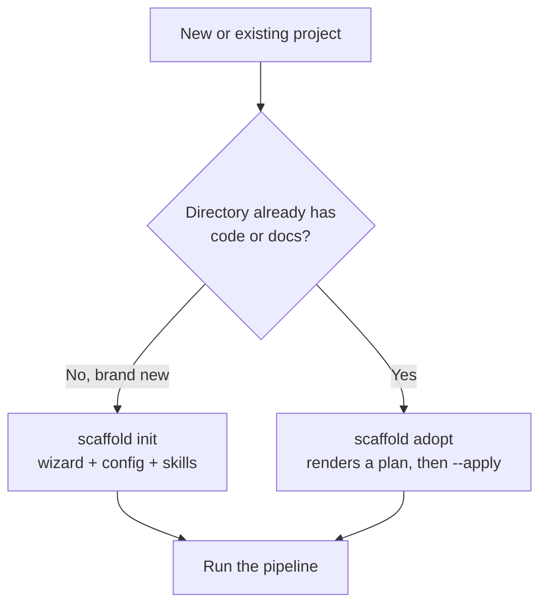

# Agent-Drivability Design Plan: `scaffold init` and `scaffold adopt`

> **For agentic workers:** REQUIRED SUB-SKILL: Use superpowers:subagent-driven-development (recommended) or superpowers:executing-plans to implement this plan task-by-task. Steps use checkbox (`- [ ]`) syntax for tracking.

**Goal:** Move both bootstrap paths (`scaffold init` for a new project, `scaffold adopt` for a brownfield repo) from "drivable with caveats" to fully agent-drivable, so that an AI coding agent can bootstrap either kind of project end to end with no human in the terminal, no silent misconfiguration, and no unparseable failure.

**Architecture:** Three layers of change, in dependency order. (1) An **output layer** that can express failure in the same JSON envelope it already uses for success, plus a CLI-level failure handler that stops emitting the yargs usage dump. (2) A **contract layer** that turns the nine scattered auto-mode `throw new Error(...)` sites into one declared table, routes every user-facing failure through a coded `ScaffoldError` with a correct `ExitCode`, and makes non-interactive environments behave identically whether or not `--auto` was passed. (3) A **documentation layer** that publishes the exit-code and envelope contracts and repairs the stale bundled install guide. No new commands and no new conventions are introduced; every change activates plumbing that already exists.

**Tech Stack:** TypeScript (ESM, Node >= 18.17.0), yargs 17, Zod 3, vitest for unit and e2e tests, bats-core for content and documentation gates.

**Source audit:** `Scaffold CLI agent-drivability audit`, 2026-07-25, against v3.51.0. Findings F1 through F9, gaps 01 through 08.

---

## Global Constraints

- Node >= 18.17.0 (`package.json:34`, `engines.node`).
- Every exit code must be a member of `ExitCode` in `src/types/enums.ts:17-25`. No new enum members without updating the published table (enforced by Task 9's bats gate).
- Every user-facing failure must be a `ScaffoldError` (`src/types/errors.ts:4-15`): `code` in SCREAMING_SNAKE prefixed by command (`INIT_`, `ADOPT_`), `message`, `exitCode`, and a `recovery` string that names the exact flag or command that fixes it.
- Reuse existing conventions. Do not introduce a parallel error object, a parallel envelope key, or a second exit-code scheme. The envelope keys `success`, `data`, `errors`, `warnings`, `exit_code` are already emitted by `src/cli/output/json.ts:45-51` and must keep those names.
- Flag-family constants live in `src/cli/init-flag-families.ts`, which is already shared by `init` and `adopt` (per its own header comment at lines 1-11). New shared flag data belongs there, not in a new module.
- Guides: markdown under `content/guides/<topic>/index.md` is the source of truth. After editing, regenerate with `scaffold guides --build`. CI enforces freshness via `make guides-check` and `scripts/check-guides-drift.sh` (job "Guides drift + security gate", `.github/workflows/ci.yml:39`).
- `make check-all` must pass before every commit.
- TDD: every task writes its failing test first and runs it to confirm the failure before implementing.

---

## Citation Verification

The audit's file and line references were re-read against the working tree before this plan was written. All were confirmed. Three details were sharper than the audit's summary and change the design:

| Audit claim | Status | Refinement that affects the design |
|---|---|---|
| 9 project types require a discriminator flag under `--auto` | Confirmed at `src/wizard/questions.ts:154, 202, 275, 309, 358, 484, 535, 581, 630` | The 5 types with **no** discriminator are `game`, `browser-extension`, `macos-native`, `data-science`, `web3`. The table in Task 2 must encode `null` for these, not omit them. |
| `init.ts:790` hardcodes exit 1 | Confirmed | `ScaffoldError` already carries an `exitCode` field (`src/types/errors.ts:10`), and `runWizard` already populates it (`src/wizard/wizard.ts:297`). `init.ts:790` discards it. The plumbing exists; only the call site is wrong. |
| Exit 2 on the `--from` path is semantically wrong | Confirmed at `src/cli/commands/init.ts:844` | The conflict is documented in the codebase itself: `src/utils/user-errors.ts:1-5` states these normalize to "typically 2", while `src/types/enums.ts:20` assigns 2 to `MissingDependency`. Two competing conventions, so Task 8 must fix the doc comment as well as the code. |

No citation required correction. `src/cli/index.ts` still has no `.fail(` handler; `grep -rn "success: false" src/cli/` still returns nothing.

---

## Decisions Requiring a Call

Two findings admit more than one defensible fix. Both are presented with a recommendation rather than resolved silently.

### D1 (F2): non-TTY without `--auto` should refuse, warn, or both

Today `scaffold init --auto --project-type web-app` fails demanding `--web-rendering`, while `scaffold init --project-type web-app < /dev/null` succeeds and writes `renderingStrategy: spa`, which is `options[0]` rather than a considered default (`src/cli/output/interactive.ts:127-129`, called with `undefined` as the default from `src/wizard/questions.ts:157-163`).

| Option | Change | Tradeoff |
|---|---|---|
| **A. Refuse** | `resolveOutputMode` returns `auto` when stdin or stdout is not a TTY, so both invocations behave identically | Closes the trap completely. **Breaking**: scripts that pipe `init` today and rely on silent defaults begin failing. |
| **B. Warn** | `InteractiveOutput` emits the `(auto) Using default for: ...` stderr breadcrumb that `AutoOutput` already emits (`src/cli/output/auto.ts:33, 38`) when `!canPrompt()` | Non-breaking and purely additive, but the command still succeeds with an arbitrary `options[0]`. The agent gets a trace it has no reason to read. |
| **C. Both, staged** | Ship B in a patch, A in the following minor | Reaches the same destination more slowly, and leaves the defect live in the interim. |

**Recommendation: A.** The repo has direct precedent. In v3.48.0 `scaffold adopt` changed from write-on-run to plan-first, and the shipped warning calls the previous behavior "a defect" (`src/cli/commands/adopt.ts:710`). The same reasoning applies here: silently answering a question nobody asked is a defect, not an interface. Option B's breadcrumb is still worth having and is folded into Task 6, because `AutoOutput` delegates its prompts to `InteractiveOutput`. Migration is self-documenting: the new failure names the exact flag to add, so a broken script's error message is also its fix. An escape-hatch environment variable was considered and rejected as new surface that would have to be supported indefinitely.

### D2 (F4): shape of the failure envelope

`JsonOutput.result()` hardcodes `success: true`, `errors: []`, and `exit_code: 0` (`src/cli/output/json.ts:45-51`). No code path emits a failure envelope.

| Option | Change | Tradeoff |
|---|---|---|
| **A. Flip the existing keys** | On failure emit `{success:false, data:null, errors:[ScaffoldError], warnings:[...], exit_code:N}` | Zero new contract. Consumers who already branch on `success` keep working. Stdout becomes non-empty on failure, which cannot break a parser that currently receives nothing. |
| **B. New top-level `error` object** | Add `error` alongside the existing `errors` array | Introduces a parallel convention for the same information, which the plan's constraints forbid. |
| **C. JSON Lines / streaming** | Emit one object per event | Larger change, no demand from either path, and it breaks every existing single-parse consumer. |

**Recommendation: A.** It activates three fields that are currently dead rather than adding a fourth, which is the whole point of the constraint about reusing conventions.

---

## Findings That Need No Code Change

**F9 (plan_key excludes the repo path).** No code change. The exclusion is deliberate and documented at `src/project/adoption-plan.ts:85-90` as decision D1 of the brownfield design: `generated_at`, `project_root`, and markdown prose never participate in the hash, so the key is content-addressed. The blast radius is bounded, because applying a plan in a second repo only succeeds if the live re-render produces byte-identical dispositions, at which point the two plans genuinely are the same plan. Making the key repo-scoped would break its actual purpose, which is detecting that reality changed between approval and apply. The residual risk is only that an orchestrator caches a key across repos and is surprised. That is a documentation problem, handled by one sentence in Task 9.

All other findings (F1 through F8) receive code changes.

---

## File Structure

| File | Responsibility | Action |
|---|---|---|
| `src/cli/init-flag-families.ts` | Add `AUTO_REQUIRED_FLAG` table and `autoRequiredSuffix()` helper alongside the existing family constants | Modify |
| `src/wizard/questions.ts` | Replace 9 bare `throw new Error` sites with one coded-error helper; fail instead of silently skipping when no project type resolves | Modify |
| `src/cli/output/context.ts` | Add `fail()` to the `OutputContext` interface | Modify |
| `src/cli/output/json.ts` | Implement `fail()` as the failure envelope | Modify |
| `src/cli/output/interactive.ts` | Implement `fail()`; add the non-TTY default breadcrumb | Modify |
| `src/cli/output/auto.ts` | Implement `fail()` by delegation | Modify |
| `src/cli/middleware/output-mode.ts` | Resolve non-TTY to `auto` | Modify |
| `src/cli/index.ts` | Add `.fail()` so handler errors stop printing the usage block | Modify |
| `src/cli/commands/init.ts` | Honor `err.exitCode`; map `ScaffoldUserError` to coded errors; `requiresArg` on `--from`; emit a result on the `--from` path | Modify |
| `src/utils/user-errors.ts` | Correct the "typically 2" header comment | Modify |
| `content/guides/cli/index.md` | Publish exit codes, the envelope contract, and the agent driving loop | Modify |
| `content/guides/install/index.md` | Repair the stale adopt guidance at lines 125, 148, 151 | Modify |
| `content/skills/scaffold-runner/SKILL.md` | Activate before `.scaffold/` exists; state the init-versus-adopt decision rule | Modify |
| `src/cli/output/json.test.ts` | Unit tests for the failure envelope | Create |
| `src/e2e/agent-drivability.test.ts` | The acceptance test for both paths | Create |
| `tests/guides-agent-contract.bats` | Gate that keeps the published contract in sync with the enum | Create |

---

## Task 1: Failure envelope on the output layer

Closes **F4**, gap **01**. Implements decision **D2 option A**.

**Files:**
- Modify: `src/cli/output/context.ts:13-55` (interface), `src/cli/output/json.ts:44-52`, `src/cli/output/interactive.ts:68-81`, `src/cli/output/auto.ts:20-26`
- Test: `src/cli/output/json.test.ts` (create)

**Interfaces:**
- Produces: `OutputContext.fail(errors: ScaffoldError[], exitCode?: ExitCode): void`. Tasks 2, 4, 5, 7 and 8 call this. When `exitCode` is omitted it is taken from `errors[0].exitCode`, falling back to `ExitCode.ValidationError`.

- [ ] **Step 1: Write the failing test**

```typescript
// src/cli/output/json.test.ts
import { describe, it, expect, vi, afterEach } from 'vitest'
import { JsonOutput } from './json.js'
import { ExitCode } from '../../types/enums.js'

function captureStdout(fn: () => void): string {
  let out = ''
  const spy = vi.spyOn(process.stdout, 'write').mockImplementation((chunk: unknown) => {
    out += String(chunk)
    return true
  })
  try { fn() } finally { spy.mockRestore() }
  return out
}

afterEach(() => { vi.restoreAllMocks() })

describe('JsonOutput.fail', () => {
  it('writes success:false with populated errors and a non-zero exit_code', () => {
    const output = new JsonOutput()
    const raw = captureStdout(() => {
      output.fail([{
        code: 'INIT_AUTO_FLAG_REQUIRED',
        message: '--cli-interactivity is required in auto mode for cli projects',
        exitCode: ExitCode.ValidationError,
        recovery: 'Pass --cli-interactivity <args-only|interactive|hybrid>',
      }])
    })
    const parsed = JSON.parse(raw)
    expect(parsed.success).toBe(false)
    expect(parsed.data).toBeNull()
    expect(parsed.exit_code).toBe(ExitCode.ValidationError)
    expect(parsed.errors).toHaveLength(1)
    expect(parsed.errors[0].code).toBe('INIT_AUTO_FLAG_REQUIRED')
    expect(parsed.errors[0].recovery).toContain('--cli-interactivity')
  })

  it('carries buffered warnings into the failure envelope', () => {
    const output = new JsonOutput()
    output.warn({ code: 'ADOPT_LOW_ONLY', message: 'Only low-confidence matches found: backend' })
    const raw = captureStdout(() => {
      output.fail([{ code: 'X_FAILED', message: 'boom', exitCode: ExitCode.ValidationError }])
    })
    const parsed = JSON.parse(raw)
    expect(parsed.warnings).toHaveLength(1)
    expect(parsed.warnings[0].code).toBe('ADOPT_LOW_ONLY')
  })

  it('still emits success:true from result()', () => {
    const output = new JsonOutput()
    const raw = captureStdout(() => { output.result({ ok: 1 }) })
    const parsed = JSON.parse(raw)
    expect(parsed.success).toBe(true)
    expect(parsed.exit_code).toBe(0)
  })
})
```

- [ ] **Step 2: Run test to verify it fails**

Run: `npx vitest run src/cli/output/json.test.ts`
Expected: FAIL with `output.fail is not a function`

- [ ] **Step 3: Add `fail` to the interface**

```typescript
// src/cli/output/context.ts — inside interface OutputContext, after result()
  /**
   * Terminal failure. In json mode this writes the failure envelope to stdout
   * so an agent always has something to parse. In interactive/auto mode it
   * delegates to error() so human output is unchanged.
   */
  fail(errors: ScaffoldError[], exitCode?: ExitCode): void
```

Add the import at the top of the file:

```typescript
import type { ExitCode } from '../../types/enums.js'
```

- [ ] **Step 4: Implement in JsonOutput**

```typescript
// src/cli/output/json.ts — after result()
  fail(errors: ScaffoldError[], exitCode?: ExitCode): void {
    const resolved = exitCode ?? errors[0]?.exitCode ?? ExitCode.ValidationError
    for (const e of errors) {
      process.stderr.write(`✗ ${e.code}: ${e.message}\n`)
      if (e.recovery) process.stderr.write(`  Recovery: ${e.recovery}\n`)
    }
    process.stdout.write(JSON.stringify({
      success: false,
      data: null,
      errors,
      warnings: this.bufferedWarnings,
      exit_code: resolved,
    }) + '\n')
  }
```

Add to the imports at the top of `json.ts`:

```typescript
import { ExitCode } from '../../types/enums.js'
```

- [ ] **Step 5: Implement in InteractiveOutput and AutoOutput**

```typescript
// src/cli/output/interactive.ts — after result()
  fail(errors: ScaffoldError[], _exitCode?: ExitCode): void {
    for (const e of errors) this.error(e)
  }
```

```typescript
// src/cli/output/auto.ts — after result()
  fail(errors: ScaffoldError[], exitCode?: ExitCode): void {
    this.interactive.fail(errors, exitCode)
  }
```

Both files need `import type { ExitCode } from '../../types/enums.js'` added to their existing type imports.

- [ ] **Step 6: Run tests to verify they pass**

Run: `npx vitest run src/cli/output/ && npx tsc --noEmit`
Expected: PASS, and no type errors from the three implementers of `OutputContext`

- [ ] **Step 7: Commit**

```bash
git add src/cli/output/context.ts src/cli/output/json.ts src/cli/output/interactive.ts src/cli/output/auto.ts src/cli/output/json.test.ts
git commit -m "feat(cli): add failure envelope to the output layer (F4, gap 01)"
```

**Agent-visible behavior:** none yet. This task only adds the capability; Tasks 4, 5, 7 and 8 route failures into it.

**Breaking:** No. Purely additive.

---

## Task 2: Declare the auto-mode discriminator flags in one table

Closes **F1** (the undiscoverable half), gap **02**.

**Files:**
- Modify: `src/cli/init-flag-families.ts` (append after `MACOS_NATIVE_FLAGS`, line 96)
- Test: `src/cli/init-flag-families.test.ts` (create if absent; otherwise append)

**Interfaces:**
- Produces: `AUTO_REQUIRED_FLAG: Readonly<Record<ProjectType, string | null>>` and `autoRequiredSuffix(flag: string): string`. Tasks 3 and 4 consume both.

- [ ] **Step 1: Write the failing test**

```typescript
// src/cli/init-flag-families.test.ts
import { describe, it, expect } from 'vitest'
import { AUTO_REQUIRED_FLAG, autoRequiredSuffix } from './init-flag-families.js'
import { ProjectTypeSchema } from '../config/schema.js'

describe('AUTO_REQUIRED_FLAG', () => {
  it('has an entry for every project type in the schema', () => {
    for (const type of ProjectTypeSchema.options) {
      expect(Object.hasOwn(AUTO_REQUIRED_FLAG, type)).toBe(true)
    }
  })

  it('marks the nine types that require a discriminator under --auto', () => {
    expect(AUTO_REQUIRED_FLAG['web-app']).toBe('web-rendering')
    expect(AUTO_REQUIRED_FLAG['backend']).toBe('backend-api-style')
    expect(AUTO_REQUIRED_FLAG['cli']).toBe('cli-interactivity')
    expect(AUTO_REQUIRED_FLAG['library']).toBe('lib-visibility')
    expect(AUTO_REQUIRED_FLAG['mobile-app']).toBe('mobile-platform')
    expect(AUTO_REQUIRED_FLAG['data-pipeline']).toBe('pipeline-processing')
    expect(AUTO_REQUIRED_FLAG['ml']).toBe('ml-phase')
    expect(AUTO_REQUIRED_FLAG['research']).toBe('research-driver')
    expect(AUTO_REQUIRED_FLAG['mcp-server']).toBe('mcp-language')
  })

  it('marks the five types that require nothing as null', () => {
    expect(AUTO_REQUIRED_FLAG['game']).toBeNull()
    expect(AUTO_REQUIRED_FLAG['browser-extension']).toBeNull()
    expect(AUTO_REQUIRED_FLAG['macos-native']).toBeNull()
    expect(AUTO_REQUIRED_FLAG['data-science']).toBeNull()
    expect(AUTO_REQUIRED_FLAG['web3']).toBeNull()
  })
})

describe('autoRequiredSuffix', () => {
  it('annotates a discriminator flag', () => {
    expect(autoRequiredSuffix('cli-interactivity')).toBe(' [required with --auto]')
  })

  it('returns an empty string for a non-discriminator flag', () => {
    expect(autoRequiredSuffix('cli-distribution')).toBe('')
  })
})
```

- [ ] **Step 2: Run test to verify it fails**

Run: `npx vitest run src/cli/init-flag-families.test.ts`
Expected: FAIL with `AUTO_REQUIRED_FLAG is not exported`

- [ ] **Step 3: Add the table and helper**

```typescript
// src/cli/init-flag-families.ts — append after MACOS_NATIVE_FLAGS (line 96)

/**
 * The single flag each project type must be given under `--auto`, because the
 * wizard has no defensible default for it. `null` means the type is fully
 * defaultable and needs no flag.
 *
 * This table is the one source of truth for three consumers: the `--help`
 * annotation in init.ts, the INIT_AUTO_FLAG_REQUIRED error in questions.ts,
 * and the published contract in content/guides/cli/index.md. Adding a project
 * type without adding a row here fails init-flag-families.test.ts.
 */
export const AUTO_REQUIRED_FLAG: Readonly<Record<string, string | null>> = Object.freeze({
  'web-app': 'web-rendering',
  'backend': 'backend-api-style',
  'cli': 'cli-interactivity',
  'library': 'lib-visibility',
  'mobile-app': 'mobile-platform',
  'data-pipeline': 'pipeline-processing',
  'ml': 'ml-phase',
  'research': 'research-driver',
  'mcp-server': 'mcp-language',
  'game': null,
  'browser-extension': null,
  'macos-native': null,
  'data-science': null,
  'web3': null,
})

/** Help-text annotation for a flag that `--auto` requires. Empty otherwise. */
export function autoRequiredSuffix(flag: string): string {
  const required = Object.values(AUTO_REQUIRED_FLAG).includes(flag)
  return required ? ' [required with --auto]' : ''
}
```

- [ ] **Step 4: Run test to verify it passes**

Run: `npx vitest run src/cli/init-flag-families.test.ts`
Expected: PASS

- [ ] **Step 5: Commit**

```bash
git add src/cli/init-flag-families.ts src/cli/init-flag-families.test.ts
git commit -m "feat(init): declare auto-mode discriminator flags in one table (F1, gap 02)"
```

**Agent-visible behavior:** none yet. Task 3 surfaces it in `--help`, Task 4 in the error.

**Breaking:** No.

---

## Task 3: Annotate the discriminator flags in `--help`

Closes **F1** (the discoverability half), gap **02**.

**Files:**
- Modify: `src/cli/commands/init.ts:210` (`web-rendering`), `:231` (`backend-api-style`), `:263` (`cli-interactivity`), and the six other discriminator declarations
- Test: `src/cli/commands/init.test.ts` (append)

**Interfaces:**
- Consumes: `autoRequiredSuffix` from Task 2.

- [ ] **Step 1: Write the failing test**

```typescript
// src/cli/commands/init.test.ts — append
import { AUTO_REQUIRED_FLAG } from '../init-flag-families.js'

describe('init --help discriminator annotation', () => {
  it('marks every auto-required flag as required in its describe string', async () => {
    const yargsMod = (await import('yargs')).default
    const initCommand = (await import('./init.js')).default
    const captured: Record<string, string> = {}
    const fake = {
      option(name: string, cfg: { describe?: string }) {
        captured[name] = cfg.describe ?? ''
        return this
      },
      group() { return this },
      check() { return this },
      middleware() { return this },
    }
    // eslint-disable-next-line @typescript-eslint/no-explicit-any
    initCommand.builder(fake as any)

    const required = Object.values(AUTO_REQUIRED_FLAG).filter((f): f is string => f !== null)
    for (const flag of required) {
      expect(captured[flag], `${flag} describe`).toContain('[required with --auto]')
    }
    expect(captured['cli-distribution']).not.toContain('[required with --auto]')
    void yargsMod
  })
})
```

- [ ] **Step 2: Run test to verify it fails**

Run: `npx vitest run src/cli/commands/init.test.ts -t 'discriminator annotation'`
Expected: FAIL, `expected 'Rendering strategy' to contain '[required with --auto]'`

- [ ] **Step 3: Apply the suffix at each of the nine declarations**

Add the import to `src/cli/commands/init.ts`:

```typescript
import { autoRequiredSuffix } from '../init-flag-families.js'
```

Then change each of the nine `describe` strings. All nine, not just the first:

```typescript
      .option('web-rendering', {
        type: 'string',
        describe: `Rendering strategy${autoRequiredSuffix('web-rendering')}`,
        choices: ['spa', 'ssr', 'ssg', 'hybrid'] as const,
      })
      .option('backend-api-style', {
        type: 'string',
        describe: `API style${autoRequiredSuffix('backend-api-style')}`,
        choices: ['rest', 'graphql', 'grpc', 'trpc', 'none'] as const,
      })
      .option('cli-interactivity', {
        type: 'string',
        describe: `Interactivity model${autoRequiredSuffix('cli-interactivity')}`,
        choices: ['args-only', 'interactive', 'hybrid'] as const,
      })
```

Apply the identical pattern to `lib-visibility`, `mobile-platform`, `pipeline-processing`, `ml-phase`, `research-driver`, and `mcp-language`, wrapping each existing `describe` value in a template literal and appending `autoRequiredSuffix('<that-flag>')`.

- [ ] **Step 4: Run test to verify it passes**

Run: `npx vitest run src/cli/commands/init.test.ts -t 'discriminator annotation'`
Expected: PASS

- [ ] **Step 5: Verify the rendered help**

Run: `npm run build && node dist/index.js init --help 2>&1 | grep 'required with --auto' | wc -l`
Expected: `9`

- [ ] **Step 6: Commit**

```bash
git add src/cli/commands/init.ts src/cli/commands/init.test.ts
git commit -m "feat(init): mark auto-required flags in --help (F1, gap 02)"
```

**Agent-visible behavior:** `scaffold init --help` now reads `--cli-interactivity  Interactivity model [required with --auto]`. An agent reading `--help` can build a valid command on the first attempt.

**Breaking:** No. Help text only.

---

## Task 4: Replace the nine bare throws with one coded error

Closes **F1** (the failure-shape half), feeds gap **01** and **05**.

**Files:**
- Modify: `src/wizard/questions.ts:153-155, 201-203, 274-276, 308-310, 357-359, 483-485, 534-536, 580-582, 629-631`
- Test: `src/wizard/questions.test.ts` (append)

**Interfaces:**
- Consumes: `AUTO_REQUIRED_FLAG` from Task 2.
- Produces: `AutoFlagRequiredError`, an `Error` subclass carrying `.scaffoldError: ScaffoldError`. Tasks 5 and 8 catch it by that property.

- [ ] **Step 1: Write the failing test**

```typescript
// src/wizard/questions.test.ts — append
import { AUTO_REQUIRED_FLAG } from '../cli/init-flag-families.js'
import { ExitCode } from '../types/enums.js'
import { createOutputContext } from '../cli/output/context.js'

describe('auto-mode discriminator enforcement', () => {
  const required = Object.entries(AUTO_REQUIRED_FLAG)
    .filter((entry): entry is [string, string] => entry[1] !== null)

  it.each(required)('throws a coded error for %s naming --%s', async (projectType, flag) => {
    const output = createOutputContext('auto')
    await expect(
      askWizardQuestions({ auto: true, projectType, output } as never),
    ).rejects.toMatchObject({
      scaffoldError: {
        code: 'INIT_AUTO_FLAG_REQUIRED',
        exitCode: ExitCode.ValidationError,
      },
    })
    await askWizardQuestions({ auto: true, projectType, output } as never).catch((e: unknown) => {
      const se = (e as { scaffoldError: { message: string; recovery?: string } }).scaffoldError
      expect(se.message).toContain(`--${flag}`)
      expect(se.recovery).toContain(`--${flag}`)
    })
  })
})
```

- [ ] **Step 2: Run test to verify it fails**

Run: `npx vitest run src/wizard/questions.test.ts -t 'discriminator enforcement'`
Expected: FAIL, the rejected value is a bare `Error` with no `scaffoldError` property

- [ ] **Step 3: Add the error class and helper**

```typescript
// src/wizard/questions.ts — near the top, after the existing imports
import { AUTO_REQUIRED_FLAG } from '../cli/init-flag-families.js'
import { ExitCode } from '../types/enums.js'
import type { ScaffoldError } from '../types/index.js'

/** Thrown when --auto is set but a project type's discriminator flag is absent. */
export class AutoFlagRequiredError extends Error {
  readonly scaffoldError: ScaffoldError
  constructor(scaffoldError: ScaffoldError) {
    super(scaffoldError.message)
    this.name = 'AutoFlagRequiredError'
    this.scaffoldError = scaffoldError
  }
}

/**
 * Enforce the one flag `--auto` cannot default for this project type.
 * `choices` is rendered into the recovery line so the failure names its own fix.
 */
function requireAutoFlag(
  auto: boolean,
  projectType: string,
  value: unknown,
  choices: readonly string[],
): void {
  if (!auto || value !== undefined) return
  const flag = AUTO_REQUIRED_FLAG[projectType]
  if (!flag) return
  throw new AutoFlagRequiredError({
    code: 'INIT_AUTO_FLAG_REQUIRED',
    message: `--${flag} is required in auto mode for ${projectType} projects`,
    exitCode: ExitCode.ValidationError,
    recovery: `Pass --${flag} <${choices.join('|')}>`,
    context: { projectType, flag },
  })
}
```

- [ ] **Step 4: Replace all nine throw sites**

Each site currently reads like `src/wizard/questions.ts:153-155`. Replace every one; do not stop after the first. The web-app site becomes:

```typescript
    requireAutoFlag(auto, 'web-app', options.webAppFlags?.webRendering,
      ['spa', 'ssr', 'ssg', 'hybrid'])
```

The remaining eight, in file order:

```typescript
    requireAutoFlag(auto, 'backend', options.backendFlags?.backendApiStyle,
      ['rest', 'graphql', 'grpc', 'trpc', 'none'])

    requireAutoFlag(auto, 'cli', options.cliFlags?.cliInteractivity,
      ['args-only', 'interactive', 'hybrid'])

    requireAutoFlag(auto, 'library', options.libraryFlags?.libVisibility,
      ['public', 'internal'])

    requireAutoFlag(auto, 'mobile-app', options.mobileFlags?.mobilePlatform,
      ['ios', 'android', 'cross-platform'])

    requireAutoFlag(auto, 'data-pipeline', options.pipelineFlags?.pipelineProcessing,
      ['batch', 'streaming', 'hybrid'])

    requireAutoFlag(auto, 'ml', options.mlFlags?.mlPhase,
      ['training', 'inference', 'both'])

    requireAutoFlag(auto, 'research', options.researchFlags?.researchDriver,
      ['code-driven', 'config-driven', 'api-driven', 'notebook-driven'])

    requireAutoFlag(auto, 'mcp-server', options.mcpServerFlags?.mcpLanguage,
      ['typescript', 'python'])
```

- [ ] **Step 5: Run tests to verify they pass**

Run: `npx vitest run src/wizard/ && grep -c "is required in auto mode" src/wizard/questions.ts`
Expected: PASS, and the grep returns `1` (the single template in `requireAutoFlag`, not nine literals)

- [ ] **Step 6: Commit**

```bash
git add src/wizard/questions.ts src/wizard/questions.test.ts
git commit -m "refactor(init): one coded error for auto-mode discriminators (F1)"
```

**Agent-visible behavior:** after Task 5 wires the handler, `scaffold init --auto --format json --project-type cli` exits 1, stdout carries `{"success":false,...,"errors":[{"code":"INIT_AUTO_FLAG_REQUIRED","recovery":"Pass --cli-interactivity <args-only|interactive|hybrid>"}],"exit_code":1}`, stderr carries the same two lines in human form.

**Breaking:** No. Same exit code (1), same trigger condition; the message gains a code prefix and a recovery line.

---

## Task 5: Stop printing the usage block on handler failure

Closes **F1** (the 200-line-dump half), and improves **F6**'s error.

**Files:**
- Modify: `src/cli/index.ts:36-105`, `src/cli/commands/init.ts:786-792` and `:841-848`
- Test: `src/cli/index.test.ts` (append)

**Interfaces:**
- Consumes: `OutputContext.fail` (Task 1), `AutoFlagRequiredError` (Task 4).

- [ ] **Step 1: Write the failing test**

```typescript
// src/cli/index.test.ts — append
describe('CLI failure handler', () => {
  it('prints a one-line diagnostic and a help hint, never the usage block', async () => {
    const err: string[] = []
    const spy = vi.spyOn(process.stderr, 'write').mockImplementation((c: unknown) => {
      err.push(String(c)); return true
    })
    await runCli(['init', '--from', '-', '--nonexistent-flag']).catch(() => undefined)
    spy.mockRestore()
    const text = err.join('')
    expect(text).not.toContain('Web-App Configuration:')
    expect(text).not.toContain('Game Configuration:')
    expect(text).toContain('scaffold init --help')
  })
})
```

- [ ] **Step 2: Run test to verify it fails**

Run: `npx vitest run src/cli/index.test.ts -t 'failure handler'`
Expected: FAIL, the captured stderr contains `Web-App Configuration:`

- [ ] **Step 3: Add the fail handler**

```typescript
// src/cli/index.ts — insert between .strict() and .demandCommand(), line 97
    .fail((msg, err, yargsInstance) => {
      // Handler errors that already carry a ScaffoldError are printed by the
      // command's own output context. Anything reaching here is an argument
      // error, which needs the message and a pointer, never the full usage.
      const command = String(yargsInstance.parsed?.argv?._?.[0] ?? '')
      const hint = command ? `scaffold ${command} --help` : 'scaffold --help'
      const text = msg || (err instanceof Error ? err.message : String(err))
      process.stderr.write(`✗ ${text}\n`)
      process.stderr.write(`  Run \`${hint}\` for available options.\n`)
      process.exitCode = ExitCode.ValidationError
    })
```

Add to the imports at the top of `src/cli/index.ts`:

```typescript
import { ExitCode } from '../types/enums.js'
```

- [ ] **Step 4: Route init's own failures through `fail()`**

Replace `src/cli/commands/init.ts:786-792`:

```typescript
          if (!result!.success) {
            output.fail(result!.errors)
            process.exitCode = result!.errors[0]?.exitCode ?? ExitCode.ValidationError
            return
          }
```

Replace the catch at `src/cli/commands/init.ts:841-848`:

```typescript
    } catch (err) {
      if (err instanceof AutoFlagRequiredError) {
        output.fail([err.scaffoldError])
        process.exitCode = err.scaffoldError.exitCode
        return
      }
      if (isScaffoldUserError(err)) {
        const scaffoldError = toScaffoldError(err)
        output.fail([scaffoldError])
        process.exitCode = scaffoldError.exitCode
        return
      }
      throw err
    }
```

`toScaffoldError` is defined in Task 8. Until then, implement it inline in `init.ts` as a temporary shim returning `{ code: 'INIT_FAILED', message: err.message, exitCode: ExitCode.ValidationError }`, and replace it in Task 8.

- [ ] **Step 5: Run tests to verify they pass**

Run: `npx vitest run src/cli/ && npm run build`
Expected: PASS

- [ ] **Step 6: Verify the end-to-end shape**

Run:
```bash
cd "$(mktemp -d)" && git init -q
node "$OLDPWD/dist/index.js" init --auto --format json --project-type cli; echo "exit=$?"
```
Expected: `exit=1`, stdout is a single line parsing as JSON with `success:false` and `errors[0].code === 'INIT_AUTO_FLAG_REQUIRED'`, stderr is two lines with no usage block

- [ ] **Step 7: Commit**

```bash
git add src/cli/index.ts src/cli/commands/init.ts src/cli/index.test.ts
git commit -m "feat(cli): route failures through the output layer, drop the usage dump (F1, F4)"
```

**Agent-visible behavior:** every failure is at most a few lines on stderr plus a parseable envelope on stdout. The ~200-line help dump and the raw Node stack trace are gone.

**Breaking:** stderr formatting changes for humans. Not a machine contract; note in CHANGELOG.

---

## Task 6: Make non-TTY behave like `--auto`

Closes **F2**, gap **03**. Implements decision **D1 option A**.

**Files:**
- Modify: `src/cli/middleware/output-mode.ts:11-30`, `src/cli/output/interactive.ts:87-129`
- Test: `src/cli/middleware/output-mode.test.ts` (append)

**Interfaces:**
- Produces: `resolveOutputMode(argv, tty?)`. The optional second parameter defaults to real process state, keeping the function pure and testable in the style the existing tests use.

- [ ] **Step 1: Write the failing test**

```typescript
// src/cli/middleware/output-mode.test.ts — append
describe('resolveOutputMode TTY detection', () => {
  it('returns "auto" when no flags are set and stdout is not a TTY', () => {
    expect(resolveOutputMode({}, { stdin: false, stdout: false })).toBe('auto')
  })

  it('returns "interactive" when no flags are set and both streams are TTYs', () => {
    expect(resolveOutputMode({}, { stdin: true, stdout: true })).toBe('interactive')
  })

  it('returns "auto" when only stdin is redirected', () => {
    expect(resolveOutputMode({}, { stdin: false, stdout: true })).toBe('auto')
  })

  it('still lets --format json win over a non-TTY', () => {
    expect(resolveOutputMode({ format: 'json' }, { stdin: false, stdout: false })).toBe('json')
  })
})
```

- [ ] **Step 2: Run test to verify it fails**

Run: `npx vitest run src/cli/middleware/output-mode.test.ts -t 'TTY detection'`
Expected: FAIL, `expected 'interactive' to be 'auto'`

- [ ] **Step 3: Implement**

```typescript
// src/cli/middleware/output-mode.ts — replace resolveOutputMode
/**
 * Resolve the output mode from parsed argv flags and environment.
 *
 * Priority:
 * 1. --format json  -> 'json'
 * 2. --auto         -> 'auto'
 * 3. Not a TTY      -> 'auto'   (an environment that cannot answer a prompt is
 *                                treated as non-interactive whether or not the
 *                                caller remembered --auto)
 * 4. Default        -> 'interactive'
 */
export function resolveOutputMode(
  argv: { format?: string; auto?: boolean },
  tty: { stdin: boolean; stdout: boolean } = {
    stdin: process.stdin.isTTY === true,
    stdout: process.stdout.isTTY === true,
  },
): OutputMode {
  if (argv.format === 'json') return 'json'
  if (argv.auto === true) return 'auto'
  if (!tty.stdin || !tty.stdout) return 'auto'
  return 'interactive'
}
```

- [ ] **Step 4: Add the breadcrumb to the non-TTY interactive path**

`AutoOutput` delegates its non-prompt methods to `InteractiveOutput`, so `select` and `multiSelect` still resolve silently. Add the same breadcrumb `AutoOutput.prompt` already emits (`src/cli/output/auto.ts:33`):

```typescript
// src/cli/output/interactive.ts — in select(), replace the !canPrompt() branch
    if (!canPrompt()) {
      const chosen = defaultValue ?? normalized[0]?.value ?? ''
      process.stderr.write(`(auto) Using default for: ${message} -> ${chosen}\n`)
      return chosen
    }
```

```typescript
// src/cli/output/interactive.ts — in multiSelect(), replace the !canPrompt() branch
    if (!canPrompt()) {
      const chosen = defaults ?? []
      process.stderr.write(`(auto) Using default for: ${message} -> ${chosen.join(', ')}\n`)
      return chosen
    }
```

- [ ] **Step 5: Run tests to verify they pass**

Run: `npx vitest run src/cli/ src/wizard/`
Expected: PASS. Any existing test that asserted silent non-TTY success on a discriminator type will now fail; update those tests to assert the `INIT_AUTO_FLAG_REQUIRED` failure, because that is the behavior change this task ships.

- [ ] **Step 6: Verify the closed trap**

Run:
```bash
cd "$(mktemp -d)" && git init -q
node "$OLDPWD/dist/index.js" init --project-type web-app < /dev/null; echo "exit=$?"
```
Expected: `exit=1` with `INIT_AUTO_FLAG_REQUIRED`. Before this task the same command exited 0 and wrote `renderingStrategy: spa`.

- [ ] **Step 7: Commit**

```bash
git add src/cli/middleware/output-mode.ts src/cli/output/interactive.ts src/cli/middleware/output-mode.test.ts
git commit -m "fix(cli)!: treat a non-TTY as --auto instead of silently defaulting (F2, gap 03)"
```

**Agent-visible behavior:** a piped `scaffold init` no longer answers its own questions. It either succeeds with flags the caller chose, or fails naming the flag it needs.

**Breaking: yes.** Scripts that pipe `init` for a discriminator project type without passing the discriminator now exit 1. Migration: none required beyond reading the error, which names the exact flag. CHANGELOG entry under "Behavior change", following the v3.48.0 `scaffold adopt` precedent (`src/cli/commands/adopt.ts:710`).

---

## Task 7: Refuse a typeless auto init

Closes **F3**, gap **04**.

**Files:**
- Modify: `src/wizard/questions.ts:131-145`
- Test: `src/wizard/questions.test.ts` (append)

**Interfaces:**
- Consumes: `AutoFlagRequiredError` from Task 4 (reused, with a different code).

- [ ] **Step 1: Write the failing test**

```typescript
// src/wizard/questions.test.ts — append
describe('auto-mode project type enforcement', () => {
  it('throws INIT_PROJECT_TYPE_REQUIRED when auto mode cannot resolve a project type', async () => {
    const output = createOutputContext('auto')
    await expect(
      askWizardQuestions({ auto: true, output } as never),
    ).rejects.toMatchObject({
      scaffoldError: {
        code: 'INIT_PROJECT_TYPE_REQUIRED',
        exitCode: ExitCode.ValidationError,
      },
    })
  })

  it('does not throw when a type-specific flag implies the project type', async () => {
    const output = createOutputContext('auto')
    await expect(
      askWizardQuestions({
        auto: true,
        projectType: 'cli',
        cliFlags: { cliInteractivity: 'args-only' },
        output,
      } as never),
    ).resolves.toBeDefined()
  })
})
```

- [ ] **Step 2: Run test to verify it fails**

Run: `npx vitest run src/wizard/questions.test.ts -t 'project type enforcement'`
Expected: FAIL, the promise resolves instead of rejecting

- [ ] **Step 3: Implement**

```typescript
// src/wizard/questions.ts — replace the block at 131-145
  // Project type question (skip if --project-type was provided)
  let projectType: ProjectType | undefined
  if (options.projectType) {
    projectType = options.projectType as ProjectType
  } else if (auto) {
    // Auto mode has no defensible default here: a config with no projectType
    // silently disables every type-conditional step, which is the exact class
    // of defect this refuses to produce.
    throw new AutoFlagRequiredError({
      code: 'INIT_PROJECT_TYPE_REQUIRED',
      message: 'A project type is required in auto mode',
      exitCode: ExitCode.ValidationError,
      recovery: `Pass --project-type <${ProjectTypeSchema.options.join('|')}>, `
        + 'or any type-specific flag such as --cli-interactivity, which implies the type',
    })
  } else {
    showBannerOnce()
    const ptCopy = coreCopy.projectType
    const selected = await output.select(
      'What type of project is this?',
      optionsFromCopy(ptCopy.options, [...ProjectTypeSchema.options]),
      'web-app',
      ptCopy,
    )
    projectType = selected as ProjectType
  }
```

- [ ] **Step 4: Run test to verify it passes**

Run: `npx vitest run src/wizard/`
Expected: PASS

- [ ] **Step 5: Verify**

Run:
```bash
cd "$(mktemp -d)" && git init -q
node "$OLDPWD/dist/index.js" init --auto --format json; echo "exit=$?"
```
Expected: `exit=1`, stdout parses with `errors[0].code === 'INIT_PROJECT_TYPE_REQUIRED'`. Before this task the same command exited 0 and wrote a config with no `projectType` key.

- [ ] **Step 6: Commit**

```bash
git add src/wizard/questions.ts src/wizard/questions.test.ts
git commit -m "fix(init)!: refuse a typeless auto init instead of reporting success (F3, gap 04)"
```

**Breaking: yes.** `scaffold init --auto` with no type flag now exits 1. Migration: pass `--project-type` or any type-specific flag. Same CHANGELOG entry as Task 6.

---

## Task 8: One error path per condition, with correct exit codes

Closes **F7**, gap **05**.

**Files:**
- Modify: `src/utils/user-errors.ts:1-5` (header comment) and append `toScaffoldError`; `src/cli/commands/init.ts:844`
- Test: `src/utils/user-errors.test.ts` (create), `src/cli/commands/init.test.ts` (append)

**Interfaces:**
- Produces: `toScaffoldError(err: ScaffoldUserError): ScaffoldError`. Task 5's temporary inline shim is replaced by this.

- [ ] **Step 1: Write the failing test**

```typescript
// src/utils/user-errors.test.ts
import { describe, it, expect } from 'vitest'
import {
  toScaffoldError, ExistingScaffoldError, FlagConflictError,
  InvalidYamlError, FromPathReadError, TTYStdinError,
} from './user-errors.js'
import { ExitCode } from '../types/enums.js'

describe('toScaffoldError', () => {
  it('maps ExistingScaffoldError to INIT_SCAFFOLD_EXISTS with exit 1', () => {
    const e = toScaffoldError(new ExistingScaffoldError('/tmp/p'))
    expect(e.code).toBe('INIT_SCAFFOLD_EXISTS')
    expect(e.exitCode).toBe(ExitCode.ValidationError)
    expect(e.recovery).toContain('--force')
  })

  it('maps every user-error subclass to a validation exit code, never 2', () => {
    const cases = [
      new FlagConflictError('--methodology'),
      new InvalidYamlError('cfg.yml', 'bad indent'),
      new FromPathReadError('cfg.yml', 'ENOENT'),
      new TTYStdinError(),
    ]
    for (const c of cases) {
      const mapped = toScaffoldError(c)
      expect(mapped.exitCode).toBe(ExitCode.ValidationError)
      expect(mapped.code).toMatch(/^INIT_[A-Z_]+$/)
    }
  })
})
```

- [ ] **Step 2: Run test to verify it fails**

Run: `npx vitest run src/utils/user-errors.test.ts`
Expected: FAIL, `toScaffoldError is not exported`

- [ ] **Step 3: Fix the header comment**

```typescript
// src/utils/user-errors.ts — replace lines 1-5
/**
 * Base class for user-facing errors that the CLI handler layer normalizes
 * to a coded ScaffoldError via toScaffoldError(). Every subclass maps to
 * ExitCode.ValidationError (1); exit code 2 is MissingDependency
 * (src/types/enums.ts:20) and must not be used for input errors.
 * Internal errors that should surface as stack traces do NOT extend this.
 */
```

- [ ] **Step 4: Add the mapper**

```typescript
// src/utils/user-errors.ts — append after isScaffoldUserError
import { ExitCode } from '../types/enums.js'
import type { ScaffoldError } from '../types/errors.js'

const USER_ERROR_CODES: Record<string, { code: string; recovery?: string }> = {
  ExistingScaffoldError: {
    code: 'INIT_SCAFFOLD_EXISTS',
    recovery: 'Use --force to back up and reinitialize',
  },
  FlagConflictError: { code: 'INIT_FLAG_CONFLICT', recovery: 'Use --from alone, or drop it and pass flags' },
  InvalidYamlError: { code: 'INIT_INVALID_YAML', recovery: 'Fix the YAML syntax and re-run' },
  InvalidConfigError: { code: 'INIT_INVALID_CONFIG', recovery: 'Correct the reported fields and re-run' },
  FromPathReadError: { code: 'INIT_FROM_READ_FAILED', recovery: 'Check the --from path is readable' },
  TTYStdinError: { code: 'INIT_FROM_TTY_STDIN', recovery: 'Pipe the config: cat cfg.yml | scaffold init --from=-' },
  MultiServiceNotSupportedError: { code: 'INIT_MULTI_SERVICE_UNSUPPORTED' },
  ServiceRequiredError: { code: 'RUN_SERVICE_REQUIRED', recovery: 'Pass --service <name>' },
  ServiceRejectedError: { code: 'RUN_SERVICE_REJECTED', recovery: 'Drop --service for this step' },
  ServiceNotFoundError: { code: 'RUN_SERVICE_NOT_FOUND', recovery: 'Check services[] in .scaffold/config.yml' },
  ServiceFlagWithoutServicesError: { code: 'RUN_SERVICE_WITHOUT_SERVICES' },
  MultiServiceOverlayMissingError: { code: 'INIT_OVERLAY_MISSING' },
}

/** Normalize a ScaffoldUserError into the coded ScaffoldError the CLI emits. */
export function toScaffoldError(err: ScaffoldUserError): ScaffoldError {
  const mapped = USER_ERROR_CODES[err.name] ?? { code: 'INIT_FAILED' }
  return {
    code: mapped.code,
    message: err.message,
    exitCode: ExitCode.ValidationError,
    ...(mapped.recovery ? { recovery: mapped.recovery } : {}),
  }
}
```

- [ ] **Step 5: Replace Task 5's shim**

In `src/cli/commands/init.ts`, delete the temporary inline `toScaffoldError` and import the real one:

```typescript
import { TTYStdinError, isScaffoldUserError, toScaffoldError } from '../../utils/user-errors.js'
```

- [ ] **Step 6: Write the convergence test**

```typescript
// src/cli/commands/init.test.ts — append
describe('already-initialized convergence', () => {
  it('reports INIT_SCAFFOLD_EXISTS with exit 1 on both the wizard and --from paths', () => {
    const fromWizard = toScaffoldError(new ExistingScaffoldError('/tmp/p'))
    expect(fromWizard.code).toBe('INIT_SCAFFOLD_EXISTS')
    expect(fromWizard.exitCode).toBe(ExitCode.ValidationError)
    // wizard.ts:293-299 already emits the same code and exit code
  })
})
```

- [ ] **Step 7: Run tests to verify they pass**

Run: `npx vitest run src/utils/ src/cli/commands/init.test.ts && npm run build`
Expected: PASS

- [ ] **Step 8: Verify both paths converge**

Run:
```bash
D="$(mktemp -d)"; cd "$D" && git init -q
node "$OLDPWD/dist/index.js" init --auto --project-type cli --cli-interactivity args-only >/dev/null 2>&1
node "$OLDPWD/dist/index.js" init --auto --project-type cli --cli-interactivity args-only 2>&1 | grep -o 'INIT_SCAFFOLD_EXISTS'; echo "wizard exit=$?"
printf 'version: 2\nmethodology: mvp\n' | node "$OLDPWD/dist/index.js" init --from=- 2>&1 | grep -o 'INIT_SCAFFOLD_EXISTS'; echo "from exit=$?"
```
Expected: both print `INIT_SCAFFOLD_EXISTS`. Before this task the second printed an uncoded message and exited 2.

- [ ] **Step 9: Commit**

```bash
git add src/utils/user-errors.ts src/utils/user-errors.test.ts src/cli/commands/init.ts src/cli/commands/init.test.ts
git commit -m "fix(init)!: one coded error and one exit code per condition (F7, gap 05)"
```

**Breaking: yes.** The `--from` path's error conditions move from exit 2 to exit 1. Exit 2 means `MissingDependency`, so the old value was wrong. CHANGELOG entry under "Behavior change".

---

## Task 9: Fix `--from`

Closes **F6**, gap **07**.

**Files:**
- Modify: `src/cli/commands/init.ts:177-180` (option declaration), `:828-838` (result emission)
- Test: `src/cli/commands/init.test.ts` (append)

- [ ] **Step 1: Write the failing test**

```typescript
// src/cli/commands/init.test.ts — append
describe('--from input handling', () => {
  it('declares requiresArg so a bare "-" is consumed as the value', async () => {
    const captured: Record<string, { requiresArg?: boolean }> = {}
    const fake = {
      option(name: string, cfg: { requiresArg?: boolean }) { captured[name] = cfg; return this },
      group() { return this }, check() { return this }, middleware() { return this },
    }
    const initCommand = (await import('./init.js')).default
    // eslint-disable-next-line @typescript-eslint/no-explicit-any
    initCommand.builder(fake as any)
    expect(captured['from']?.requiresArg).toBe(true)
  })
})
```

- [ ] **Step 2: Run test to verify it fails**

Run: `npx vitest run src/cli/commands/init.test.ts -t 'from input handling'`
Expected: FAIL, `expected undefined to be true`

- [ ] **Step 3: Add `requiresArg`**

```typescript
// src/cli/commands/init.ts — replace the from option at 177-180
      .option('from', {
        type: 'string',
        requiresArg: true,
        describe: 'Path to a ScaffoldConfig YAML file, or "-" for stdin. Exclusive with config-setting flags.',
      })
```

- [ ] **Step 4: Emit a result on the `--from` path**

```typescript
// src/cli/commands/init.ts — replace the branch at 828-838
          const emitted = result ?? {
            success: true as const,
            projectRoot,
            configPath: path.join(projectRoot, '.scaffold', 'config.yml'),
            methodology: loadedConfig?.methodology ?? 'unknown',
            errors: [],
          }
          if (outputMode === 'json') {
            output.result({ ...emitted, buildResult: buildResult.data ?? null })
          } else {
            output.success(`Scaffold initialized at ${emitted.configPath}`)
          }
```

`loadedConfig` is the parsed `ScaffoldConfig` already in scope on the `--from` path. If it is not in scope at this point, hoist it to the outer handler scope alongside `result`.

- [ ] **Step 5: Run tests and verify end to end**

Run: `npx vitest run src/cli/commands/init.test.ts && npm run build`

Then:
```bash
D="$(mktemp -d)"; cd "$D" && git init -q
printf 'version: 2\nmethodology: mvp\nplatforms:\n  - claude-code\n' > cfg.yml
cat cfg.yml | node "$OLDPWD/dist/index.js" init --from - --format json; echo "exit=$?"
```
Expected: `exit=0`, and stdout is a non-empty JSON object with `success:true` and a `data.configPath`. Before this task the space form exited 1 with `Unknown argument: -`, and the equals form exited 0 with zero bytes on stdout.

- [ ] **Step 6: Commit**

```bash
git add src/cli/commands/init.ts src/cli/commands/init.test.ts
git commit -m "fix(init): accept --from - and emit its result envelope (F6, gap 07)"
```

**Breaking:** No. Both are bug fixes to documented behavior.

---

## Task 10: Publish the exit-code and envelope contracts

Closes **F8**, gap **05**, and the documentation half of gaps **02** and **08**. Also carries the **F9** note.

**Files:**
- Modify: `content/guides/cli/index.md`
- Create: `tests/guides-agent-contract.bats`
- Regenerate: `content/guides/cli/index.html` via `scaffold guides --build`

- [ ] **Step 1: Write the failing test**

```bash
# tests/guides-agent-contract.bats
#!/usr/bin/env bats

CLI_GUIDE="content/guides/cli/index.md"
ENUM="src/types/enums.ts"

@test "cli guide documents every ExitCode enum member" {
  run bash -c "grep -oE '^  [A-Za-z]+ = [0-9]+' '$ENUM' | awk '{print \$1}'"
  [ "$status" -eq 0 ]
  for member in $output; do
    grep -q "$member" "$CLI_GUIDE" || {
      echo "ExitCode.$member is not documented in $CLI_GUIDE"
      return 1
    }
  done
}

@test "cli guide documents the failure envelope shape" {
  grep -q '"success": false' "$CLI_GUIDE"
  grep -q 'exit_code' "$CLI_GUIDE"
}

@test "cli guide documents the auto-required discriminator flags" {
  grep -q 'required with --auto' "$CLI_GUIDE"
  grep -q 'cli-interactivity' "$CLI_GUIDE"
  grep -q 'web-rendering' "$CLI_GUIDE"
}

@test "cli guide states plan_key is content-addressed, not repo-scoped" {
  grep -qi 'plan_key' "$CLI_GUIDE"
  grep -qi 'content-addressed' "$CLI_GUIDE"
}
```

- [ ] **Step 2: Run test to verify it fails**

Run: `bats tests/guides-agent-contract.bats`
Expected: FAIL on all four, the guide has no exit-code table

- [ ] **Step 3: Add the agent section to the CLI guide**

Append to `content/guides/cli/index.md`:

````markdown
## Driving scaffold from an agent

Every command below is safe to run with no TTY. Pass `--format json` and read
stdout; human-readable progress goes to stderr and can be discarded.

### Exit codes

| Code | Name | Meaning |
|------|------|---------|
| 0 | `Success` | The command did what was asked. |
| 1 | `ValidationError` | Bad or missing input. `errors[0].recovery` names the fix. |
| 2 | `MissingDependency` | A required external tool is absent. |
| 3 | `StateCorruption` | `.scaffold/state.json` could not be read or migrated. |
| 4 | `UserCancellation` | An interactive prompt was cancelled. |
| 5 | `BuildError` | Adapter generation failed. |
| 6 | `Ambiguous` | Operator action required, such as detection finding two equally plausible project types. Re-run with `--project-type`. |

Source of truth: `src/types/enums.ts`.

### The output envelope

Success:

```json
{"success": true, "data": { }, "errors": [], "warnings": [], "exit_code": 0}
```

Failure:

```json
{"success": false, "data": null, "errors": [{"code": "INIT_AUTO_FLAG_REQUIRED", "message": "--cli-interactivity is required in auto mode for cli projects", "exitCode": 1, "recovery": "Pass --cli-interactivity <args-only|interactive|hybrid>"}], "warnings": [], "exit_code": 1}
```

Branch on `success`. Every failure carries at least one entry in `errors`, and
every entry carries a `recovery` string naming the flag or command that fixes it.

### Choosing `init` or `adopt`

Run `scaffold adopt` when the directory already contains source code or docs.
It initializes `.scaffold/` itself, so no separate `scaffold init` is needed,
and it selects the `brownfield` methodology. Run `scaffold init` for an empty
or brand-new directory.

### Flags `--auto` cannot default

Nine project types need one flag chosen explicitly, because there is no
defensible default. They are annotated `[required with --auto]` in
`scaffold init --help`.

| `--project-type` | Required flag |
|---|---|
| `web-app` | `--web-rendering` |
| `backend` | `--backend-api-style` |
| `cli` | `--cli-interactivity` |
| `library` | `--lib-visibility` |
| `mobile-app` | `--mobile-platform` |
| `data-pipeline` | `--pipeline-processing` |
| `ml` | `--ml-phase` |
| `research` | `--research-driver` |
| `mcp-server` | `--mcp-language` |

`game`, `browser-extension`, `macos-native`, `data-science` and `web3` need none.
Passing a type-specific flag implies its project type, so
`scaffold init --auto --cli-interactivity args-only` is sufficient on its own.

### The driving loop

```bash
scaffold next --format json          # .data.eligible[].command is runnable as-is
scaffold run <slug>                  # prints the assembled meta-prompt on stdout
scaffold complete <slug> --format json
```

Repeat until `.data.pipeline_complete` is `true`.

### Adoption plan keys

`plan_key` is content-addressed: it hashes the plan's dispositions and
initialize payload, and deliberately excludes `project_root` and `generated_at`
(`src/project/adoption-plan.ts:85-90`). Two repos whose plans are identical
therefore share a key. Do not cache a key across repositories, and always read
the key from the plan you just rendered.
````

- [ ] **Step 4: Regenerate and verify**

Run: `scaffold guides --build && bats tests/guides-agent-contract.bats && make guides-check`
Expected: PASS on all four bats tests, and no drift

- [ ] **Step 5: Commit**

```bash
git add content/guides/cli/index.md content/guides/cli/index.html tests/guides-agent-contract.bats
git commit -m "docs(guides): publish exit-code, envelope and auto-flag contracts (F8, F9, gaps 02/05/08)"
```

**Breaking:** No.

---

## Task 11: Repair the stale install guide and the runner skill

Closes **F5**, gap **06**, and the skill half of gap **08**.

**Files:**
- Modify: `content/guides/install/index.md:120-153`, `content/skills/scaffold-runner/SKILL.md`
- Test: `tests/guides-agent-contract.bats` (append)
- Regenerate: `content/guides/install/index.html`

- [ ] **Step 1: Write the failing test**

```bash
# tests/guides-agent-contract.bats — append

INSTALL_GUIDE="content/guides/install/index.md"

@test "install guide no longer presents --dry-run as the adopt preview" {
  ! grep -q 'Preview the changes first with `--dry-run`' "$INSTALL_GUIDE"
}

@test "install guide documents the plan-then-apply contract" {
  grep -q -- '--apply' "$INSTALL_GUIDE"
  grep -q -- '--plan-key' "$INSTALL_GUIDE"
}

@test "install guide does not tell users to run init before adopt" {
  ! grep -q 'scaffold init, then' "$INSTALL_GUIDE"
  ! grep -q 'The usual sequence for an existing codebase: `scaffold init`' "$INSTALL_GUIDE"
}
```

- [ ] **Step 2: Run test to verify it fails**

Run: `bats tests/guides-agent-contract.bats`
Expected: FAIL on all three

- [ ] **Step 3: Replace the mermaid diagram at line 120-128**

````markdown

````

- [ ] **Step 4: Replace the `scaffold adopt` section at lines 140-153**

````markdown
### `scaffold adopt`

`scaffold adopt` adopts an existing project into Scaffold
(:cite[src/cli/commands/adopt.ts:168]). It classifies the project as
`greenfield`, `brownfield`, or `v1-migration` (:cite[src/project/adopt.ts:72]),
discovers which pipeline outputs you already have on disk, and proposes marking
the corresponding steps complete.

**It writes nothing by default.** Since v3.48.0 `adopt` renders an Adoption Plan
and stops. To execute it, pass `--apply` together with the approved plan:

```bash
scaffold adopt                                # render the plan, write nothing
scaffold adopt --write                        # also write docs/adoption-plan.md
scaffold adopt --format json                  # machine-readable plan, includes plan_key
scaffold adopt --apply --plan-key <sha256>    # execute the approved plan
```

`--dry-run` is deprecated and does nothing: plan mode is already the default
(:cite[src/cli/commands/adopt.ts:117]).

**`adopt` initializes for you.** It writes `.scaffold/` config and state itself
and selects the `brownfield` methodology. Do not run `scaffold init` first on an
existing codebase: `init` would select `deep` and adopt would then have to
replace it.
````

- [ ] **Step 5: Update the runner skill activation**

In `content/skills/scaffold-runner/SKILL.md`, replace the `description` frontmatter value and the "Activates when" paragraph so the skill also covers the pre-init state:

```markdown
**Activates when** the user says "run scaffold &lt;step&gt;", "scaffold
&lt;step&gt;", "what's next?", "scaffold status", "start building", is working
in a project with a `.scaffold/` directory, or asks to set scaffold up in a
project that has none yet.

**Before `.scaffold/` exists,** pick the bootstrap command from the directory:
an empty or brand-new directory takes `scaffold init`; a directory that already
has source code or docs takes `scaffold adopt`, which initializes state itself
and selects the `brownfield` methodology. Never run `init` before `adopt` on an
existing codebase.
```

- [ ] **Step 6: Regenerate and verify**

Run: `scaffold guides --build && bats tests/guides-agent-contract.bats && make guides-check && make check`
Expected: PASS

- [ ] **Step 7: Commit**

```bash
git add content/guides/install/index.md content/guides/install/index.html content/skills/scaffold-runner/SKILL.md tests/guides-agent-contract.bats
git commit -m "docs(guides): correct adopt guidance and skill bootstrap rule (F5, gaps 06/08)"
```

**Breaking:** No.

---

## Task 12: The acceptance test

Defines and enforces "fully agent-drivable" for both paths.

**Files:**
- Create: `src/e2e/agent-drivability.test.ts`

**Interfaces:**
- Consumes: every behavior established by Tasks 1 through 11.

- [ ] **Step 1: Write the failing test**

```typescript
// src/e2e/agent-drivability.test.ts
import { describe, it, expect, beforeAll } from 'vitest'
import { execFileSync } from 'node:child_process'
import fs from 'node:fs'
import os from 'node:os'
import path from 'node:path'

const CLI = path.resolve('dist/index.js')

/** Run the CLI exactly as an agent would: no TTY, stdin closed, JSON out. */
function run(args: string[], cwd: string): { code: number; stdout: string; stderr: string } {
  try {
    const stdout = execFileSync(process.execPath, [CLI, ...args], {
      cwd, encoding: 'utf-8', stdio: ['ignore', 'pipe', 'pipe'],
    })
    return { code: 0, stdout, stderr: '' }
  } catch (e) {
    const err = e as { status: number; stdout: string; stderr: string }
    return { code: err.status, stdout: err.stdout ?? '', stderr: err.stderr ?? '' }
  }
}

function tmpRepo(): string {
  const dir = fs.mkdtempSync(path.join(os.tmpdir(), 'scaffold-agent-'))
  execFileSync('git', ['init', '-q'], { cwd: dir })
  return dir
}

beforeAll(() => {
  expect(fs.existsSync(CLI), 'run `npm run build` first').toBe(true)
})

describe('agent-drivability: every failure is parseable', () => {
  it('emits a failure envelope on stdout when the discriminator flag is missing', () => {
    const dir = tmpRepo()
    const r = run(['init', '--auto', '--format', 'json', '--project-type', 'cli'], dir)
    expect(r.code).toBe(1)
    const parsed = JSON.parse(r.stdout)
    expect(parsed.success).toBe(false)
    expect(parsed.exit_code).toBe(1)
    expect(parsed.errors[0].code).toBe('INIT_AUTO_FLAG_REQUIRED')
    expect(parsed.errors[0].recovery).toContain('--cli-interactivity')
    expect(r.stderr).not.toContain('Web-App Configuration:')
  })

  it('emits a failure envelope when no project type resolves', () => {
    const dir = tmpRepo()
    const r = run(['init', '--auto', '--format', 'json'], dir)
    expect(r.code).toBe(1)
    expect(JSON.parse(r.stdout).errors[0].code).toBe('INIT_PROJECT_TYPE_REQUIRED')
  })

  it('never exits non-zero with empty stdout under --format json', () => {
    const dir = tmpRepo()
    for (const args of [
      ['init', '--auto', '--format', 'json'],
      ['init', '--auto', '--format', 'json', '--project-type', 'web-app'],
      ['status', '--format', 'json'],
    ]) {
      const r = run(args, dir)
      if (r.code !== 0) {
        expect(r.stdout.trim(), `${args.join(' ')} produced empty stdout`).not.toBe('')
        expect(() => JSON.parse(r.stdout)).not.toThrow()
      }
    }
  })
})

describe('agent-drivability: path (a) new project', () => {
  it('drives init through the pipeline loop with no human input', () => {
    const dir = tmpRepo()

    const init = run(
      ['init', '--auto', '--format', 'json', '--project-type', 'cli', '--cli-interactivity', 'args-only'],
      dir,
    )
    expect(init.code).toBe(0)
    const initData = JSON.parse(init.stdout)
    expect(initData.success).toBe(true)
    expect(initData.data.configPath).toContain('.scaffold/config.yml')

    // No silently-chosen project type: the config records what the flags asked for.
    const config = fs.readFileSync(path.join(dir, '.scaffold', 'config.yml'), 'utf-8')
    expect(config).toContain('projectType: cli')

    const next = run(['next', '--format', 'json'], dir)
    expect(next.code).toBe(0)
    const nextData = JSON.parse(next.stdout)
    expect(nextData.data.eligible.length).toBeGreaterThan(0)
    expect(nextData.data.eligible[0].command).toMatch(/^scaffold run /)
    expect(nextData.data.pipeline_complete).toBe(false)

    const slug = nextData.data.eligible[0].slug
    const step = run(['run', slug], dir)
    expect(step.code).toBe(0)
    expect(step.stdout.length).toBeGreaterThan(100)

    const complete = run(['complete', slug, '--format', 'json'], dir)
    expect(complete.code).toBe(0)
    expect(JSON.parse(complete.stdout).success).toBe(true)
  })

  it('refuses to guess when a piped invocation omits --auto', () => {
    const dir = tmpRepo()
    const r = run(['init', '--project-type', 'web-app'], dir)
    expect(r.code).toBe(1)
    expect(fs.existsSync(path.join(dir, '.scaffold', 'config.yml'))).toBe(false)
  })
})

describe('agent-drivability: path (b) brownfield', () => {
  function brownfieldRepo(): string {
    const dir = tmpRepo()
    fs.writeFileSync(path.join(dir, 'package.json'), JSON.stringify({
      name: 'acme-api', type: 'module',
      dependencies: { express: '^4.19.0', pg: '^8.11.0' },
    }))
    fs.mkdirSync(path.join(dir, 'src'))
    fs.writeFileSync(path.join(dir, 'src', 'server.js'), 'export default {}\n')
    fs.writeFileSync(path.join(dir, 'README.md'), '# Acme API\n')
    execFileSync('git', ['add', '-A'], { cwd: dir })
    execFileSync('git', ['-c', 'user.email=t@t.co', '-c', 'user.name=t', 'commit', '-qm', 'init'], { cwd: dir })
    return dir
  }

  it('plans without writing, then applies by key, with no prior init', () => {
    const dir = brownfieldRepo()

    const plan = run(['adopt', '--auto', '--format', 'json'], dir)
    expect(plan.code).toBe(0)
    const planData = JSON.parse(plan.stdout)
    expect(planData.data.plan_key).toMatch(/^[0-9a-f]{64}$/)
    expect(planData.data.mode).toBe('brownfield')

    // Plan mode writes nothing.
    const dirty = execFileSync('git', ['status', '--porcelain'], { cwd: dir, encoding: 'utf-8' })
    expect(dirty.trim()).toBe('')

    const apply = run(
      ['adopt', '--auto', '--format', 'json', '--apply', '--plan-key', planData.data.plan_key],
      dir,
    )
    expect(apply.code).toBe(0)
    const applyData = JSON.parse(apply.stdout)
    expect(applyData.data.applied).toBe(true)
    expect(applyData.data.initialized).toBe(true)
    expect(applyData.data.doctor.verdict).toBe('healthy')

    const next = run(['next', '--format', 'json'], dir)
    expect(next.code).toBe(0)
    expect(JSON.parse(next.stdout).data.eligible[0].command).toMatch(/^scaffold run /)
  })

  it('reports drift and bare-apply refusals as parseable failures', () => {
    const dir = brownfieldRepo()

    const bare = run(['adopt', '--auto', '--format', 'json', '--apply'], dir)
    expect(bare.code).toBe(1)
    expect(JSON.parse(bare.stdout).errors[0].code).toBe('ADOPT_APPLY_NON_INTERACTIVE')

    const wrong = run(['adopt', '--auto', '--format', 'json', '--apply', '--plan-key', 'deadbeef'], dir)
    expect(wrong.code).toBe(1)
    expect(JSON.parse(wrong.stdout).errors[0].code).toBe('ADOPT_PLAN_DRIFT')
  })

  it('is idempotent on re-apply', () => {
    const dir = brownfieldRepo()
    const k1 = JSON.parse(run(['adopt', '--auto', '--format', 'json'], dir).stdout).data.plan_key
    run(['adopt', '--auto', '--format', 'json', '--apply', '--plan-key', k1], dir)
    const k2 = JSON.parse(run(['adopt', '--auto', '--format', 'json'], dir).stdout).data.plan_key
    const again = run(['adopt', '--auto', '--format', 'json', '--apply', '--plan-key', k2], dir)
    expect(again.code).toBe(0)
    expect(JSON.parse(again.stdout).data.initialized).toBe(false)
  })
})
```

- [ ] **Step 2: Run test to verify it fails**

Run: `npm run build && npx vitest run --config vitest.e2e.config.ts src/e2e/agent-drivability.test.ts`
Expected: FAIL until Tasks 1 through 9 have landed. Before Task 1, the first failure is `Unexpected end of JSON input` on the empty stdout of a failing command.

- [ ] **Step 3: Confirm it passes once the code tasks land**

Run: `npm run build && npx vitest run --config vitest.e2e.config.ts src/e2e/agent-drivability.test.ts`
Expected: PASS, all nine tests

- [ ] **Step 4: Run the full gate**

Run: `make check-all`
Expected: PASS

- [ ] **Step 5: Commit**

```bash
git add src/e2e/agent-drivability.test.ts
git commit -m "test(e2e): acceptance test for full agent-drivability on both paths"
```

---

## Acceptance Criteria: what "fully agent-drivable" means

Both paths are fully agent-drivable when all five hold, each enforced by a named test in `src/e2e/agent-drivability.test.ts`:

1. **No hang.** Every command completes with stdin closed and no TTY. (Already true today; guarded by the whole suite running with `stdio: ['ignore', 'pipe', 'pipe']`.)
2. **No unparseable failure.** No invocation exits non-zero with empty stdout under `--format json`. Test: *"never exits non-zero with empty stdout under --format json"*.
3. **No silent misconfiguration.** Every field in the written config traces to a flag the caller passed or a detector match the envelope reported. `init --auto` either fails or records a `projectType`. Tests: *"emits a failure envelope when no project type resolves"*, *"refuses to guess when a piped invocation omits --auto"*.
4. **Every failure names its own fix.** Each `errors[]` entry carries a `recovery` string naming a flag or command. Tests: the two failure-envelope tests assert `recovery` content.
5. **The next action is always readable from stdout.** After either bootstrap, `scaffold next --format json` returns a runnable `command`. Tests: *"drives init through the pipeline loop"*, *"plans without writing, then applies by key"*.

### The two command sequences, start to finish

Path (a), new project:

```bash
scaffold init --auto --format json --project-type cli --cli-interactivity args-only
#   -> exit 0, {"success":true,"data":{"configPath":"...","methodology":"mvp",...}}
scaffold next --format json
#   -> exit 0, .data.eligible[0].command == "scaffold run create-vision"
#              .data.pipeline_complete == false
scaffold run create-vision
#   -> exit 0, assembled meta-prompt on stdout
scaffold complete create-vision --format json
#   -> exit 0, {"success":true,...}
# repeat next/run/complete until .data.pipeline_complete == true
```

Path (b), brownfield:

```bash
scaffold adopt --auto --format json
#   -> exit 0, .data.plan_key == <sha256>, .data.mode == "brownfield"
#              working tree unchanged
scaffold adopt --auto --format json --apply --plan-key <sha256>
#   -> exit 0, .data.applied == true, .data.initialized == true
#              .data.doctor.verdict == "healthy"
scaffold next --format json
#   -> exit 0, .data.eligible[0].command runnable as-is
# then the same next/run/complete loop as path (a)
```

No `scaffold init` appears in path (b). That is the correction Task 11 makes to the install guide.

---

## Work Units, Sequencing and Shippability

| Unit | Tasks | Depends on | Independently shippable | Release type |
|---|---|---|---|---|
| **A. Output foundation** | 1, 5 | none | Yes | patch |
| **B. Contract and discoverability** | 2, 3, 4, 8 | A (Task 5 wires `fail()`; Task 8 replaces Task 5's shim) | Yes | minor, contains the exit-2 to exit-1 change |
| **C. Close the silent traps** | 6, 7 | B (the new failures must already be coded and annotated, or the breaking change lands without an actionable message) | Yes | minor, **breaking behavior** |
| **D. Documentation and bootstrap** | 10, 11 | none for 11; Task 10 documents behavior from A and B, so publish it with or after B | Yes | patch |
| **E. `--from` repair** | 9 | A (needs `fail()` and the result-emission branch) | Yes | patch |
| **F. Acceptance** | 12 | A, B, C, E | No, it is the gate | n/a |

Critical path: **A → B → C**. Units D and E can proceed in parallel with B and C by separate workers; neither touches a file that A, B, or C modifies, except that Task 9 and Task 5 both edit `src/cli/commands/init.ts`, so Task 9 must rebase after Task 5 lands.

Recommended shipping order across two releases:

- **Release 1 (patch, no breaking change):** Units A, D, E. This alone closes F4, F5, F6, F8, F9 and gaps 01, 06, 07, 08. An agent that already knows the flags gets parseable failures and correct docs immediately.
- **Release 2 (minor, one breaking behavior change):** Units B, C, F. This closes F1, F2, F3, F7 and gaps 02, 03, 04, 05. One CHANGELOG entry under "Behavior change" covers Tasks 6, 7 and 8, following the v3.48.0 `scaffold adopt` precedent.

---

## Self-Review

**Coverage.** F1 → Tasks 2, 3, 4, 5. F2 → Task 6. F3 → Task 7. F4 → Tasks 1, 5. F5 → Task 11. F6 → Task 9. F7 → Task 8. F8 → Task 10. F9 → no code change, documented in Task 10. Gaps 01 → 1; 02 → 2, 3, 10; 03 → 6; 04 → 7; 05 → 8, 10; 06 → 11; 07 → 9; 08 → 10, 11. Nothing unassigned.

**Placeholders.** None. Every code step carries the code. The one forward reference, `toScaffoldError` in Task 5, names its temporary shim and the task that replaces it.

**Type consistency.** `OutputContext.fail(errors: ScaffoldError[], exitCode?: ExitCode)` is declared in Task 1 and called with that signature in Tasks 5 and 8. `AutoFlagRequiredError.scaffoldError` is declared in Task 4 and read in Tasks 5 and 7. `AUTO_REQUIRED_FLAG` and `autoRequiredSuffix` are declared in Task 2 and consumed in Tasks 3, 4 and 10. `toScaffoldError` is declared in Task 8 and consumed in Task 5.

**Known risk.** Task 9 Step 3 assumes yargs' `requiresArg: true` is sufficient to consume a bare `-` under `.strict()`. The test in Step 1 asserts only the declaration; the end-to-end check in Step 5 is what proves the behavior. If `requiresArg` proves insufficient, the fallback is to normalize `--from -` to `--from=-` in `runCli` before handing argv to yargs, which is a three-line change in `src/cli/index.ts:36-38`.
