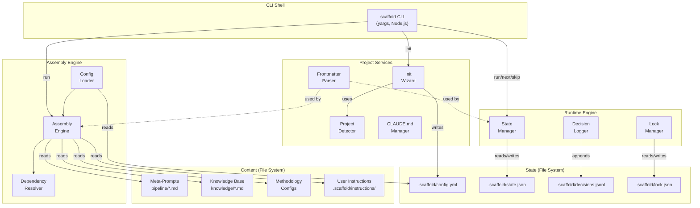
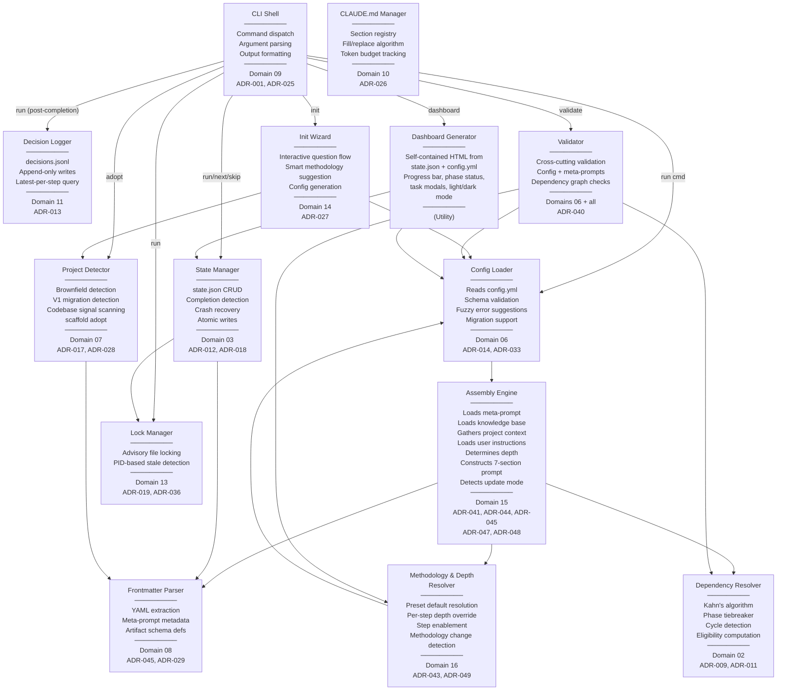
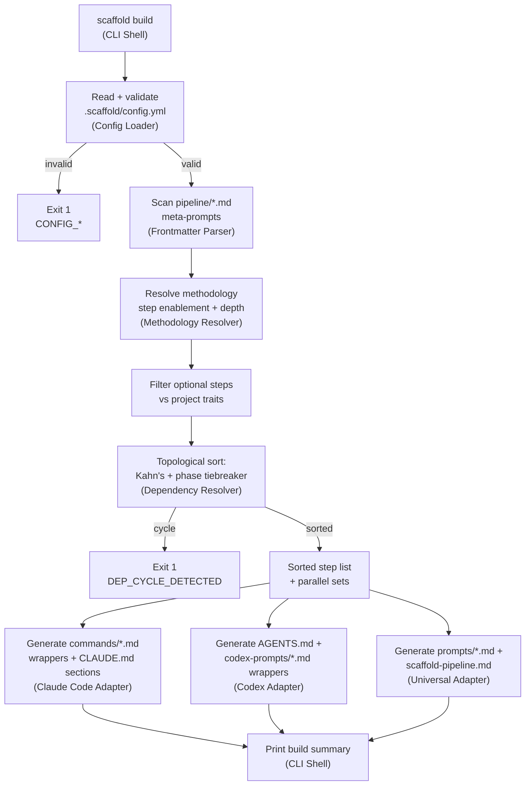
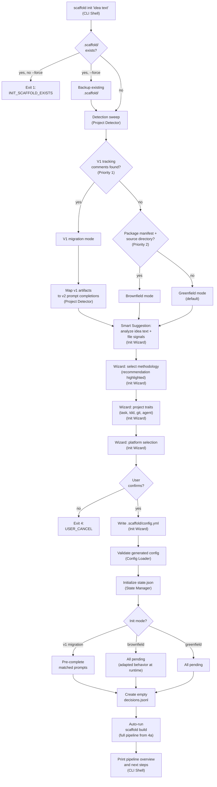
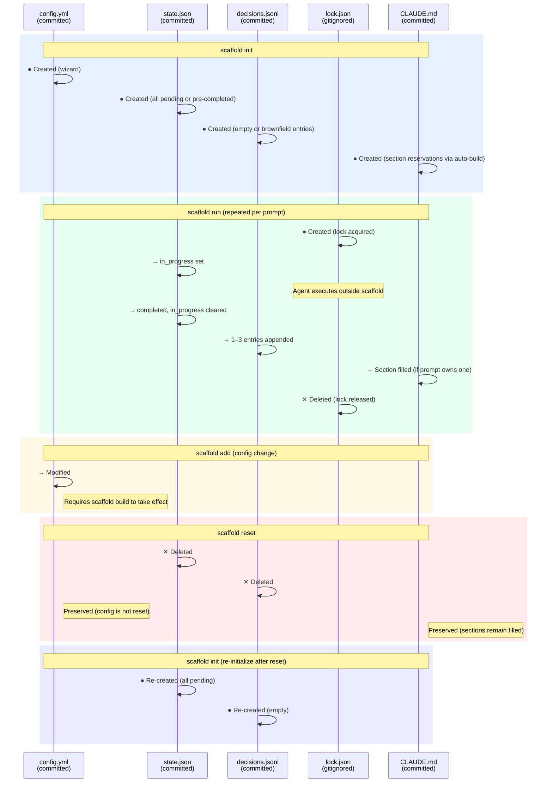
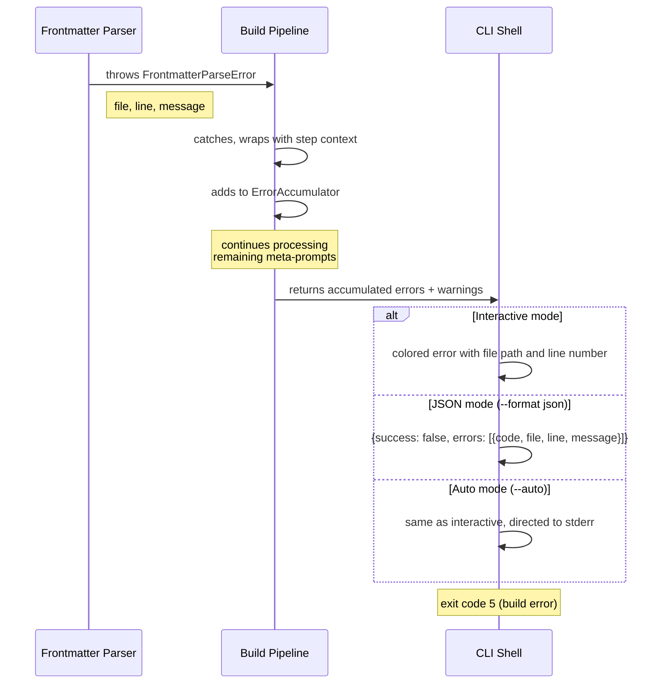
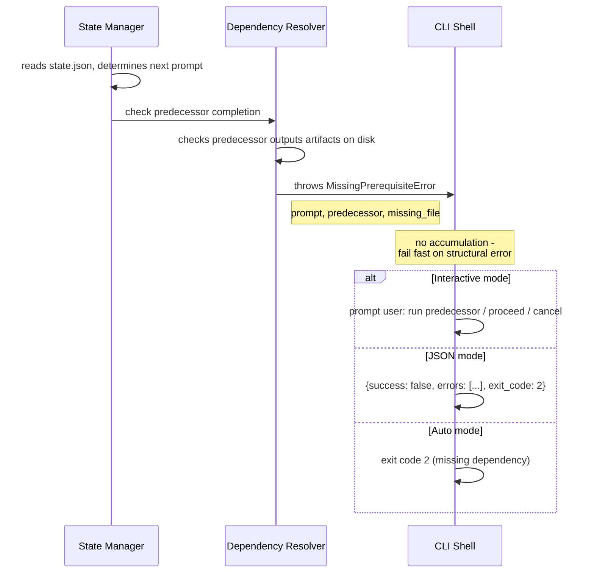
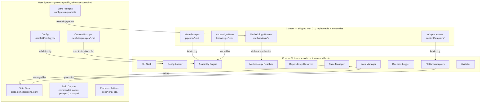
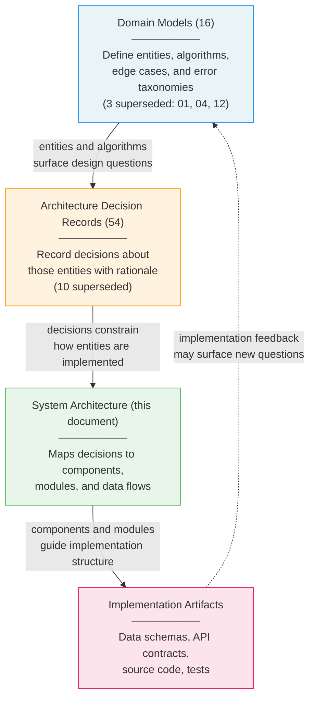

# Scaffold v2 — System Architecture

**Phase**: 3 — System Architecture
**Depends on**: All Phase 1 domain models, all Phase 2 ADRs
**Last updated**: 2026-03-14
**Status**: Transformed

> **Transformation notice:** Architecture updated per meta-prompt architecture (ADR-041). Build-time prompt resolution replaced by runtime assembly engine. See `docs/v2/scaffold-v2-prd.md` Sections 4 and 9 for the authoritative architecture description.

---

## Section 1: Architecture Overview

Scaffold v2 is a **runtime assembly engine with file-based state management**, distributed as a Node.js CLI ([ADR-001](../adrs/ADR-001-cli-implementation-language.md)). The CLI is the single source of truth for all business logic ([ADR-003](../adrs/ADR-003-standalone-cli-source-of-truth.md)); platform integrations (Claude Code plugin, Codex instruction files, universal markdown) are thin wrappers that deliver the CLI's output.

**The key architectural insight**: Scaffold's core job is assembling a tailored prompt at runtime from meta-prompts (compact intent declarations), a knowledge base (domain expertise), methodology configuration (depth and step selection), user instructions, and project context. Its secondary job is tracking pipeline execution state across sessions, users, and crash boundaries — all through the file system. There are no databases, message queues, caches, or microservices. The file system *is* the infrastructure.

### Assembly Engine Execution Sequence

When `scaffold run <step>` is invoked:

1. **Load meta-prompt.** Read `pipeline/<step>.md` — the step's purpose, inputs, outputs, quality criteria, methodology scaling rules.
2. **Check prerequisites.** Pipeline state (already completed? offer re-run in update mode), dependencies (all prior steps completed?), lock (another step running?).
3. **Load knowledge base entries.** Read the knowledge base files listed in the meta-prompt's `knowledge-base` frontmatter field.
4. **Gather project context.** Completed artifacts, `.scaffold/config.yml`, `.scaffold/state.json`, `.scaffold/decisions.jsonl`.
5. **Load user instructions.** `.scaffold/instructions/global.md` (if exists), `.scaffold/instructions/<step>.md` (if exists), `--instructions` flag value (if provided).
6. **Determine depth.** Look up the step's depth level from methodology config (preset default or custom override).
7. **Construct assembled prompt.** Build a 7-section prompt: System, Meta-prompt, Knowledge base, Context, Methodology, Instructions, Execution instruction.
8. **AI generates and executes.** The AI reads the assembled prompt, generates a working prompt tailored to the project + methodology + instructions, and executes it.
9. **Update state.** Mark step completed in `state.json`. Record decisions in `decisions.jsonl`. Show next available step(s).

### Runtime Commands

- `scaffold run <step>` — assemble and execute a pipeline step (lockable)
- `scaffold next` — show next unblocked step(s) (read-only)
- `scaffold status` — show pipeline progress (read-only)
- `scaffold skip <step>` — skip a step (lockable)

Runtime commands:

- Track step completion in `state.json` (map-keyed, git-committed, atomic writes — [ADR-012](../adrs/ADR-012-state-file-design.md))
- Evaluate eligibility against the dependency graph
- Acquire advisory file locks to prevent concurrent execution ([ADR-019](../adrs/ADR-019-advisory-locking.md))
- Record decisions to `decisions.jsonl` for cross-session context ([ADR-013](../adrs/ADR-013-decision-log-jsonl-format.md))
- Detect crashed sessions and offer recovery ([ADR-018](../adrs/ADR-018-completion-detection-crash-recovery.md))

### Extension Architecture

Users and contributors extend Scaffold at three points:

| Extension Point | Mechanism | Scope |
|----------------|-----------|-------|
| **User instructions** | `.scaffold/instructions/global.md` (all steps) or `.scaffold/instructions/<step>.md` (per-step) or `--instructions` flag (inline) | Per-project |
| **Custom methodology presets** | YAML preset files in `methodology/` controlling which steps are active and at what depth | Global (shipped with CLI or user-configurable via Custom preset) |
| **Platform wrappers** | Thin delivery wrappers for Claude Code, Codex, or other AI tools | Requires CLI code change for new platforms |

### High-Level Architecture



---

## Section 2: Component Architecture

### Section 2a: Component Diagram

The following diagram shows every major component, its dependencies, and the data it reads/writes. Components are grouped by their role: assembly engine (constructs prompts at runtime), runtime engine (manages state), and project services (support operations).



**Component file I/O summary:**

| Component | Reads | Writes |
|-----------|-------|--------|
| Config Loader | `.scaffold/config.yml` | — |
| Assembly Engine | `pipeline/<step>.md`, `knowledge/*.md`, `.scaffold/instructions/*.md`, `.scaffold/config.yml`, `.scaffold/state.json`, `.scaffold/decisions.jsonl`, prior artifacts | — (assembled prompt is passed to AI) |
| Methodology & Depth Resolver | `.scaffold/config.yml` (methodology, depth, custom overrides) | — |
| Dependency Resolver | (in-memory: meta-prompt frontmatter dependencies) | — |
| State Manager | `.scaffold/state.json` | `.scaffold/state.json` (atomic via temp+rename) |
| Lock Manager | `.scaffold/lock.json` | `.scaffold/lock.json` |
| Decision Logger | `.scaffold/decisions.jsonl` | `.scaffold/decisions.jsonl` (append) |
| CLAUDE.md Manager | `CLAUDE.md` | `CLAUDE.md` |
| Frontmatter Parser | Any `.md` file with YAML frontmatter | — |
| Project Detector | Project directory (scanning), `docs/plan.md`, `docs/tech-stack.md`, etc. | — |
| Init Wizard | (interactive input) | `.scaffold/config.yml`, `.scaffold/state.json`, `.scaffold/decisions.jsonl` |
| Dashboard Generator | `.scaffold/state.json`, `.scaffold/config.yml` | HTML file |
| Validator | All config, meta-prompt, and state files | — (read-only; reports diagnostics) |

### Section 2b: Component Interaction Matrix

| Component | Depends On | Called By | Shared State |
|-----------|-----------|----------|--------------|
| CLI Shell | All components (orchestrates) | User / AI agent | — |
| Config Loader | Frontmatter Parser | CLI Shell (`run`, `validate`, `init`), Init Wizard, Validator, Dashboard Generator | `.scaffold/config.yml` |
| Assembly Engine | Config Loader, Frontmatter Parser, Dependency Resolver, Methodology & Depth Resolver | CLI Shell (`run`) | — |
| Methodology & Depth Resolver | Config Loader | Assembly Engine, Validator, CLI Shell (`build`) | — |
| Dependency Resolver | (receives meta-prompt frontmatter in-memory) | Assembly Engine, Validator, State Manager (for eligibility) | — |
| State Manager | Lock Manager, Frontmatter Parser (for `outputs` fields) | CLI Shell (`run`, `next`, `status`, `skip`, `reset`), Dashboard Generator | `.scaffold/state.json` |
| Lock Manager | — | State Manager (acquires before mutation), CLI Shell (`run`) | `.scaffold/lock.json` |
| Decision Logger | — | CLI Shell (`run`, post-completion hook) | `.scaffold/decisions.jsonl` |
| CLAUDE.md Manager | — | CLI Shell (`run`, post-completion hook) | `CLAUDE.md` |
| Frontmatter Parser | — | Assembly Engine, State Manager, Project Detector, Config Loader, Validator | — (stateless) |
| Project Detector | Frontmatter Parser (for `outputs` field matching) | Init Wizard, CLI Shell (`adopt`) | — |
| Init Wizard | Project Detector, Config Loader (for validation) | CLI Shell (`init`) | `.scaffold/config.yml` |
| Dashboard Generator | State Manager, Config Loader | CLI Shell (`dashboard`) | — |
| Validator | Config Loader, Dependency Resolver, Frontmatter Parser | CLI Shell (`validate`) | — (read-only) |

---

## Section 3: Module / Package Structure

### Section 3a: Source Directory Tree

```
src/
├── cli/                              # CLI Shell — command dispatch and output
│   ├── index.ts                      # Application entry point, yargs setup, global flags
│   ├── commands/                     # One file per CLI command
│   │   ├── init.ts                   # scaffold init — delegates to wizard
│   │   ├── build.ts                  # scaffold build — orchestrates build pipeline
│   │   ├── run.ts                    # scaffold run <step> — assemble and execute a pipeline step
│   │   ├── next.ts                   # scaffold next — show next eligible prompt
│   │   ├── status.ts                 # scaffold status — show pipeline progress
│   │   ├── skip.ts                   # scaffold skip <prompt> — skip a prompt
│   │   ├── validate.ts              # scaffold validate — cross-cutting validation
│   │   ├── adopt.ts                  # scaffold adopt — scan existing codebase
│   │   ├── reset.ts                  # scaffold reset — reset pipeline state
│   │   ├── decisions.ts              # scaffold decisions — query decision log
│   │   ├── dashboard.ts              # scaffold dashboard — generate HTML dashboard
│   │   ├── list.ts                   # scaffold list — show methodologies and presets
│   │   ├── info.ts                   # scaffold info [<step>] — show project config or step details
│   │   ├── version.ts               # scaffold version — show installed version
│   │   └── update.ts                # scaffold update — update to latest version
│   ├── output/                       # Output mode implementations (Strategy pattern)
│   │   ├── context.ts                # OutputContext interface
│   │   ├── interactive.ts            # InteractiveOutput — colors, spinners, prompts
│   │   ├── json.ts                   # JsonOutput — JSON envelope to stdout
│   │   └── auto.ts                   # AutoOutput — non-interactive, auto-decisions
│   └── middleware/                    # yargs middleware hooks
│       ├── project-root.ts           # Detect .scaffold/ directory, resolve project root
│       └── output-mode.ts            # Parse --format and --auto flags, inject OutputContext
│
├── core/                             # Assembly engine — runtime prompt construction
│   ├── assembly/                     # Assembly Engine
│   │   ├── engine.ts                 # 7-section prompt assembly orchestrator
│   │   ├── meta-prompt-loader.ts     # Load and parse pipeline/<step>.md
│   │   ├── knowledge-loader.ts       # Load knowledge base entries from frontmatter refs
│   │   ├── context-gatherer.ts       # Gather project context (artifacts, config, state, decisions)
│   │   ├── instruction-loader.ts     # Load user instructions (global, per-step, inline)
│   │   └── depth-resolver.ts         # Determine depth from methodology config
│   ├── dependency/                   # Dependency Resolution (domain 02)
│   │   ├── dependency.ts             # Kahn's algorithm with phase tiebreaker
│   │   ├── graph.ts                  # DependencyGraph construction from meta-prompt frontmatter
│   │   └── eligibility.ts            # Step eligibility computation against state
│
├── state/                            # Runtime state — execution tracking and coordination
│   ├── state-manager.ts              # Pipeline state machine (domain 03) — CRUD on state.json
│   ├── context.ts                    # Session context assembly — aggregates state, decisions, predecessor outputs for run bootstrap summary
│   ├── lock-manager.ts               # Advisory file locking (domain 13) — lock.json lifecycle
│   ├── decision-logger.ts            # Decision log (domain 11) — JSONL append and query
│   └── completion.ts                 # Dual completion detection (artifact + state) + crash recovery
│
├── config/                           # Configuration — loading, validation, migration
│   ├── loader.ts                     # Read and parse .scaffold/config.yml
│   ├── schema.ts                     # Config schema definition (Zod or similar)
│   └── migration.ts                  # Schema version migration (version N → N+1)
│
├── validation/                       # Cross-cutting validation logic
│   ├── config-validator.ts           # Config schema + migration validation
│   ├── manifest-validator.ts         # Manifest schema + dependency cycle checks
│   ├── frontmatter-validator.ts      # Frontmatter schema + field validation
│   ├── artifact-validator.ts         # Artifact schema validation (required-sections, id-format, index-table)
│   ├── state-validator.ts            # State consistency checks (artifact existence, cross-file refs)
│   └── index.ts                      # Orchestrates all validators for `scaffold validate` command
│
├── project/                          # Project detection and management
│   ├── detector.ts                   # Brownfield/v1/greenfield detection (domain 07)
│   ├── adopt.ts                      # scaffold adopt — artifact scanning and state initialization
│   ├── claude-md.ts                  # CLAUDE.md section registry, fill/replace, budget (domain 10)
│   └── frontmatter.ts                # YAML frontmatter extraction and section targeting (domain 08)
│
├── wizard/                           # Init Wizard — interactive project setup (domain 14)
│   ├── wizard.ts                     # Question flow state machine
│   ├── suggestion.ts                 # Smart methodology suggestion (keyword + file signals)
│   ├── questions.ts                  # Question definitions and adaptive branching
│   └── signals.ts                    # Codebase signal detection for brownfield/v1/greenfield
│
├── dashboard/                        # Dashboard Generation
│   └── generator.ts                  # HTML dashboard from state.json + config.yml
│
├── types/                            # Shared TypeScript interfaces (all domain model entities)
│   ├── config.ts                     # ScaffoldConfig, MethodologyConfig, ProjectConfig, etc.
│   ├── prompt.ts                     # MetaPrompt, StepFrontmatter, etc.
│   ├── state.ts                      # PipelineState, PromptStateEntry, InProgressRecord, etc.
│   ├── dependency.ts                 # DependencyGraph, DependencyEdge, DependencyResult, etc.
│   ├── assembly.ts                   # AssemblyResult, AssembledPrompt, DepthLevel, etc.
│   ├── frontmatter.ts                # PromptFrontmatter, ReadReference, SectionTargetedRead, etc.
│   ├── cli.ts                        # CommandDefinition, ParsedArgs, ExecutionContext, etc.
│   ├── decision.ts                   # DecisionEntry, DecisionContent, DecisionWriteResult, etc.
│   ├── lock.ts                       # LockFile, LockInfo, LockStatus, etc.
│   ├── claude-md.ts                  # ReservedSection, SectionRegistry, SectionFillRequest, etc.
│   ├── wizard.ts                     # WizardStep, WizardContext, WizardAnswers, etc.
│   ├── adopt.ts                      # AdoptScanResult, ArtifactMatch, CodebaseSignal, etc.
│   ├── instruction.ts                # UserInstruction, InstructionLayer, etc.
│   └── errors.ts                     # ScaffoldError, ScaffoldWarning, error/warning code enums
│
└── utils/                            # Shared utilities
    ├── fs.ts                         # Atomic write (temp+rename), file existence checks
    ├── git.ts                        # Git operations (branch detection, worktree checks)
    ├── levenshtein.ts                # Fuzzy string matching for error suggestions
    └── errors.ts                     # Error factory functions, exit code mapping
```

**Organizing principles:**

- **One directory per domain cluster** — `core/` groups the assembly engine and dependency resolution; `state/` groups the three runtime state components; `project/` groups detection and management services.
- **One file per component** where practical — avoids mega-files while keeping related logic co-located.
- **Types are centralized** in `src/types/` — all TypeScript interfaces from domain model Section 3 entities live here. One file per domain's type surface.
- **No barrel/index files** — every import uses a direct path (e.g., `import { resolve } from '../core/resolver/resolver'`). This follows the v1 coding convention (no barrel files) and avoids circular dependency issues. **Exception**: `src/types/index.ts` re-exports all shared type definitions. Types are imported frequently across every module, and direct path imports for 14 type files would add friction without benefit. This is the sole barrel file in the codebase.
- **Utils are minimal** — only truly shared, stateless functions. If a function is used by only one module, it stays in that module.

### Section 3b: Domain-to-Module Mapping

| Domain | Module(s) | Primary File(s) | Types File | Estimated Complexity |
|--------|----------|-----------------|------------|---------------------|
| 15 — Assembly Engine | `src/core/assembly/` | `engine.ts`, `meta-prompt-loader.ts`, `knowledge-loader.ts`, `context-gatherer.ts`, `instruction-loader.ts`, `depth-resolver.ts` | `src/types/assembly.ts` | Medium — 9-step assembly sequence, 7-section prompt construction from meta-prompts + knowledge + context + instructions |
| 16 — Methodology & Depth Resolution | `src/core/assembly/` | `depth-resolver.ts`, `methodology-resolver.ts` | `src/types/assembly.ts` | Medium — 4-level depth precedence (CLI flag > custom per-step override > preset default_depth > built-in fallback of 3), step enablement, methodology change detection |
| 02 — Dependency Resolution | `src/core/dependency/` | `dependency.ts`, `graph.ts`, `eligibility.ts` | `src/types/dependency.ts` | Medium — Kahn's algorithm + cycle detection |
| 03 — Pipeline State Machine | `src/state/` | `state-manager.ts`, `context.ts`, `completion.ts` | `src/types/state.ts` | High — state transitions, crash recovery, dual detection |
| 06 — Config & Validation | `src/config/`, `src/validation/` | `loader.ts`, `schema.ts`, `migration.ts`, `*-validator.ts` | `src/types/config.ts` | Medium — schema validation + migration + fuzzy matching |
| 07 — Brownfield & Adopt | `src/project/` | `detector.ts`, `adopt.ts` | `src/types/adopt.ts` | Medium — multi-signal detection + artifact scanning |
| 08 — Frontmatter & Sections | `src/project/` | `frontmatter.ts` | `src/types/frontmatter.ts` | Medium — YAML parsing + section extraction algorithm |
| 09 — CLI Architecture | `src/cli/` | `index.ts`, `commands/*.ts`, `output/*.ts`, `middleware/*.ts` | `src/types/cli.ts` | High — 14 commands × 3 output modes |
| 10 — CLAUDE.md Management | `src/project/` | `claude-md.ts` | `src/types/claude-md.ts` | Low-Medium — section find/replace with ownership markers |
| 11 — Decision Log | `src/state/` | `decision-logger.ts` | `src/types/decision.ts` | Low — JSONL append + query |
| 13 — Pipeline Locking | `src/state/` | `lock-manager.ts` | `src/types/lock.ts` | Low — file create/delete + PID check |
| 14 — Init Wizard | `src/wizard/` | `wizard.ts`, `suggestion.ts`, `questions.ts`, `signals.ts` | `src/types/wizard.ts` | Medium — adaptive state machine + signal analysis |

**Notes:**

- Domain 08 (Frontmatter Parser) lives in `src/project/` rather than `src/core/` because it is a shared service used by many components, not an assembly engine stage. It has no runtime state and no pipeline position.
- Domain 03 session context assembly lives in `src/state/context.ts`, separate from `state-manager.ts` because it is a read-only aggregation concern — it reads `state.json`, `decisions.jsonl`, and predecessor artifacts to produce the run bootstrap summary — whereas `state-manager.ts` handles state mutations.
- Domain 06 validation logic is split across `src/config/` (config loading and migration) and `src/validation/` (cross-cutting validation). The `scaffold validate` CLI command (`src/cli/commands/validate.ts`) delegates to `src/validation/index.ts`, which orchestrates all validators. Config-level validation during `scaffold run` uses `src/config/loader.ts` directly.
- The Validator component spans multiple domains — it orchestrates validation calls via `src/validation/index.ts`, which composes config, meta-prompt, frontmatter, artifact, and state validators. The `scaffold validate` command handler (`src/cli/commands/validate.ts`) invokes this orchestrator.
- Domain 16 (Methodology & Depth Resolution) shares `src/core/assembly/` with Domain 15. `depth-resolver.ts` handles the four-level depth precedence; `methodology-resolver.ts` handles step enablement and methodology change detection. Both are consumed by the assembly engine during step 6 of the 9-step sequence.
- Dashboard Generator has no dedicated domain model; it lives in `src/dashboard/generator.ts` as a utility that reads state and config.

### Section 3c: Content Directory Structure

The `content/` directory contains all shipped meta-prompt, knowledge base, and methodology content. It is separate from the `src/` source code — `src/` contains the engine; `content/` contains the data the engine operates on.

```
content/
├── base/                             # Base prompts — shared across all methodologies
│   ├── pre/                          # Pre-pipeline: PRD, stories, reviews, innovation
│   │   ├── create-prd.md
│   │   ├── review-prd.md
│   │   ├── innovate-prd.md
│   │   ├── user-stories.md
│   │   ├── review-user-stories.md
│   │   └── innovate-user-stories.md
│   ├── modeling/                     # Domain modeling
│   │   ├── domain-modeling.md
│   │   └── review-domain-modeling.md
│   ├── decisions/                    # Architecture decision records
│   │   ├── adrs.md
│   │   └── review-adrs.md
│   ├── architecture/                 # System architecture
│   │   ├── system-architecture.md
│   │   └── review-architecture.md
│   ├── specification/                # Detailed specs (conditional)
│   │   ├── database-schema.md
│   │   ├── review-database.md
│   │   ├── api-contracts.md
│   │   ├── review-api.md
│   │   ├── ux-spec.md
│   │   └── review-ux.md
│   ├── quality/                      # Testing, ops, security
│   │   ├── testing-strategy.md
│   │   ├── review-testing.md
│   │   ├── operations.md
│   │   ├── review-operations.md
│   │   ├── security.md
│   │   └── review-security.md
│   ├── planning/                     # Implementation task decomposition
│   │   ├── implementation-tasks.md
│   │   └── review-tasks.md
│   ├── validation/                   # Cross-phase validation
│   │   ├── cross-phase-consistency.md
│   │   ├── traceability-matrix.md
│   │   ├── decision-completeness.md
│   │   ├── critical-path-walkthrough.md
│   │   ├── implementability-dry-run.md
│   │   ├── dependency-graph-validation.md
│   │   └── scope-creep-check.md
│   └── finalization/                 # Final steps
│       ├── apply-fixes-and-freeze.md
│       ├── developer-onboarding-guide.md
│       └── implementation-playbook.md
│
├── methodology/                      # Methodology preset YAML files (ADR-043)
│   ├── deep.yml                      # Deep Domain Modeling — all 36 steps enabled, default_depth: 5
│   ├── mvp.yml                       # MVP — 7 steps enabled, default_depth: 1
│   └── custom-defaults.yml           # Custom — all steps enabled, default_depth: 3, user overrides via config.yml
│
└── adapters/                         # Adapter-specific assets
    ├── claude-code/                  # Claude Code adapter resources
    │   └── frontmatter-template.yml  # Default YAML frontmatter fields
    ├── codex/                        # Codex adapter resources
    │   └── tool-map.yml              # Adapter-specific tool name conventions
    └── universal/                    # Universal adapter resources
        └── pipeline-template.md      # Template for scaffold-pipeline.md reference doc
```

**Content directory conventions:**

> **Architecture note:** The meta-prompt architecture ([ADR-041](../adrs/ADR-041-meta-prompt-architecture.md)) transformed the content structure. The `base/` directory contains **meta-prompts** (compact intent declarations with frontmatter) rather than fully-assembled prompts. The `methodology/` directory contains flat YAML preset files per [ADR-043](../adrs/ADR-043-depth-scale.md) — not manifest.yml with overrides/extensions subdirectories. The `knowledge/` directory (not shown above) contains domain expertise files loaded by the assembly engine at runtime. Methodology-specific content is expressed through depth scaling in meta-prompt frontmatter and methodology presets.

- Every `.md` file in `base/` has YAML frontmatter conforming to the Meta-Prompt Frontmatter Schema ([domain 08](../domain-models/08-prompt-frontmatter.md), [ADR-045](../adrs/ADR-045-assembled-prompt-structure.md)).
- Methodology presets (`methodology/*.yml`) define which steps are active and at what depth level ([ADR-043](../adrs/ADR-043-depth-scale.md)). Each preset is a flat YAML file with `name`, `description`, `default_depth` (1-5), and a `steps` map.
- Optional steps in methodology presets declare their `requires` condition (e.g., `optional: { requires: frontend }`). The condition is evaluated against `config.yml`'s `project` section during step resolution.

**Content-to-package mapping:** The `content/` source directory maps to the npm package as follows: `content/base/` → `pipeline/`, `knowledge/` → `knowledge/`, `content/methodology/` → `methodology/`. See operations-runbook.md §4.4 for the packaged directory listing.

---

## Section 4: Data Flow Diagrams

Three critical data paths collectively exercise every component in the system. The **build pipeline** (4a) generates thin platform command wrappers from meta-prompt metadata. The **run flow** (4b) is the core runtime path — assembling tailored prompts, executing them via AI agents, and tracking state. The **init flow** (4c) bootstraps new projects. The coverage table (4d) verifies every component from Section 2 appears in at least one path.

### Section 4a: Build Pipeline (`scaffold build`)

> **Architecture note:** The meta-prompt architecture ([ADR-041](../adrs/ADR-041-meta-prompt-architecture.md)) replaced the original build-time resolution pipeline. `scaffold build` no longer resolves or assembles prompt content — that work happens at runtime via the assembly engine (`scaffold run` — see Section 4b). `scaffold build` now generates thin platform command wrappers — files that invoke `scaffold run <step>` — from meta-prompt metadata (frontmatter fields like `description`, `phase`, `depends-on`, `outputs`).

The deterministic transformation from `config.yml` + meta-prompt metadata to platform-specific wrapper files. This is a lightweight text transformation exercising 6 components.



**Step annotations:**

| Step | Component | Reads | Writes | ADR(s) | Error Conditions |
|------|-----------|-------|--------|--------|------------------|
| Validate config | Config Loader | `.scaffold/config.yml` | — | [ADR-014](../adrs/ADR-014-config-schema-versioning.md), [ADR-033](../adrs/ADR-033-forward-compatibility-unknown-fields.md) | `CONFIG_PARSE_ERROR`, `CONFIG_UNKNOWN_FIELD` → exit 1 |
| Scan meta-prompts | Frontmatter Parser | `pipeline/*.md` (frontmatter only — description, phase, depends-on, outputs, optional) | — | [ADR-041](../adrs/ADR-041-meta-prompt-architecture.md), [ADR-045](../adrs/ADR-045-assembled-prompt-structure.md) | Missing or invalid frontmatter → exit 1 |
| Resolve methodology | Methodology Resolver | Methodology preset config, custom overrides | — | [ADR-043](../adrs/ADR-043-depth-scale.md) | Invalid methodology → exit 1 |
| Filter optionals | Methodology Resolver | — (config `project` traits in memory) | — | [ADR-020](../adrs/ADR-020-skip-vs-exclude-semantics.md) | Invalid trait reference → exit 1 |
| Kahn's sort | Dependency Resolver | — (in-memory frontmatter dependencies) | — | [ADR-009](../adrs/ADR-009-kahns-algorithm-dependency-resolution.md), [ADR-011](../adrs/ADR-011-depends-on-union-semantics.md) | `DEP_CYCLE_DETECTED` → exit 1 |
| Claude Code output | Claude Code Adapter | — | `commands/*.md` (wrappers), CLAUDE.md sections (via CLAUDE.md Manager) | [ADR-022](../adrs/ADR-022-three-platform-adapters.md), [ADR-026](../adrs/ADR-026-claude-md-section-registry.md) | Write failure → exit 5 |
| Codex output | Codex Adapter | — | `AGENTS.md`, `codex-prompts/*.md` (wrappers) | [ADR-022](../adrs/ADR-022-three-platform-adapters.md) | Write failure → exit 5 |
| Universal output | Universal Adapter | `content/adapters/universal/pipeline-template.md` | `prompts/*.md`, `scaffold-pipeline.md` | [ADR-022](../adrs/ADR-022-three-platform-adapters.md) | Write failure → exit 5 |

**Walkthrough — non-obvious behaviors:**

**Build produces wrappers, not prompts.** The wrapper files generated by `scaffold build` are thin shell invocations (e.g., a `commands/create-prd.md` file with YAML frontmatter pointing to `scaffold run create-prd`). The actual prompt content is assembled at runtime by the assembly engine (Section 4b). This separation means build output can be regenerated cheaply and doesn't contain methodology-specific or depth-specific content — that's determined at run time based on current config ([ADR-041](../adrs/ADR-041-meta-prompt-architecture.md), [ADR-044](../adrs/ADR-044-runtime-prompt-generation.md)).

**Universal adapter always runs.** Regardless of the `platforms` configuration, the Universal adapter generates output ([ADR-022](../adrs/ADR-022-three-platform-adapters.md)). This ensures every project has a platform-agnostic escape hatch — plain markdown references that work with any AI tool, current or future. The Claude Code and Codex adapters only run if their platform is listed in `config.yml`.

**Optional step exclusion and the dependency graph.** When optional steps are excluded (their `requires` condition is unmet), they are removed from the step set entirely — they never enter the dependency graph ([ADR-020](../adrs/ADR-020-skip-vs-exclude-semantics.md)). Any dependency edges pointing to excluded steps are silently removed. This means the dependency graph can have different shapes for different project configurations.

**Build is deterministic and idempotent.** Given identical `config.yml` and meta-prompt files, `scaffold build` always produces identical wrapper output. It regenerates everything from scratch — there is no incremental build. The full build is fast (metadata extraction + text generation, not prompt assembly) and completes well under the 500ms performance target ([ADR-001](../adrs/ADR-001-cli-implementation-language.md)).

### Section 4a-1: Meta-Prompt Body Convention

Meta-prompt markdown bodies use level-2 headings (`##`) to delimit sections. The Assembly Engine's meta-prompt loader identifies sections by these exact headings:

| Heading                | Required | Purpose                                                                         |
|------------------------|----------|---------------------------------------------------------------------------------|
| ## Purpose             | Yes      | One-paragraph statement of what this step accomplishes                          |
| ## Inputs              | Yes      | What artifacts/context this step consumes                                       |
| ## Expected Outputs    | Yes      | What artifacts this step produces and their structure                           |
| ## Quality Criteria    | Yes      | How to evaluate the output — specific, measurable checks                        |
| ## Methodology Scaling | Yes      | How output changes across depth 1-5; must include depth 1 and depth 5 specifics |
| ## Mode Detection      | Yes      | Create vs update behavior per ADR-048                                           |

Sections not matching these headings are treated as additional body content and included verbatim in the assembled prompt.

**Complete meta-prompt example** (`pipeline/pre/create-prd.md`):

```yaml
---
name: create-prd
description: Create a product requirements document from a project idea
phase: "1"
dependencies: []
outputs:
  - docs/prd.md
knowledge-base:
  - prd-craft
---
```

```markdown
## Purpose

Define the product's vision, scope, user personas, and requirements in a structured PRD that serves as the foundation for all downstream architecture and implementation decisions.

## Inputs

- Project idea (from user or `scaffold init` idea argument)
- Config: methodology, platforms, project metadata

## Expected Outputs

- `docs/prd.md` — Structured PRD with sections: Vision, Problem Statement, User Personas, Functional Requirements, Non-Functional Requirements, Success Metrics, Out of Scope, Open Questions

## Quality Criteria

- Every functional requirement is testable (has a verification method)
- User personas include goals, pain points, and technical proficiency
- Non-functional requirements have measurable targets (latency < 200ms, not "fast")
- Out of Scope section explicitly lists 3+ excluded features to prevent scope creep

## Methodology Scaling

- **Depth 1**: Vision + 5-10 bullet-point requirements + 1 persona. Fits on one page.
- **Depth 5**: Full PRD with 3+ personas, 20+ requirements organized by domain, acceptance criteria per requirement, competitive analysis, risk assessment.

## Mode Detection

- **Create mode** (no existing `docs/prd.md`): Generate PRD from scratch using project idea and config.
- **Update mode** (existing `docs/prd.md`): Review existing PRD, identify gaps, and produce an updated version preserving prior decisions. Include diff summary of changes.
```

Note: meta-prompts declare **intent** (what to accomplish), not **prompt instructions** (how to do it). The assembly engine wraps intent declarations with system framing, knowledge base content, project context, and execution instructions at runtime.

---

### Section 4b: Pipeline Execution (`scaffold run`)

```mermaid
flowchart TD
    A["scaffold run [--from X]<br/>(CLI Shell)"] --> B["Parse args, determine<br/>output mode<br/>(CLI Shell)"]

    B --> C["Check lock.json<br/>(Lock Manager)"]
    C --> D{"Lock<br/>exists?"}
    D -->|"no"| E["Create lock.json<br/>with current PID"]
    D -->|"yes"| F{"PID alive +<br/>same process?"}
    F -->|"dead or recycled"| G["Clear stale lock"]
    G --> E
    F -->|"alive, original"| H{"--force?"}
    H -->|"no"| ERR3["Exit 3: LOCK_HELD"]
    H -->|"yes"| E

    E --> I["Read + validate<br/>config.yml<br/>(Config Loader)"]
    I --> J["Read state.json<br/>(State Manager)"]

    J --> K{"in_progress<br/>non-null?"}
    K -->|"no"| P
    K -->|"yes"| L["Check artifacts for<br/>in_progress prompt<br/>(State Manager)"]
    L --> M{"Artifact<br/>status?"}
    M -->|"all present"| N["Mark completed,<br/>clear in_progress"]
    N --> P
    M -->|"none present"| N2["Recommend: re-run"]
    M -->|"partial"| N3["Recommend: ask user"]
    N2 --> O{"User / auto<br/>decision"}
    N3 --> O
    O -->|"re-run"| P
    O -->|"mark complete"| N

    P["Compute eligible prompts<br/>from dependency graph + state<br/>(Dependency Resolver)"]
    P --> Q{"--from X<br/>specified?"}
    Q -->|"yes"| R["Validate X exists,<br/>set as target"]
    Q -->|"no"| S["Pick first eligible<br/>(phase tiebreaker)"]
    S --> T{"Any<br/>eligible?"}
    T -->|"no"| U["Pipeline complete"]
    U --> REL["Release lock<br/>(Lock Manager)"]
    T -->|"yes"| V
    R --> V["Target prompt selected"]

    V --> W["Check predecessor<br/>outputs artifacts<br/>(State Manager)"]
    W --> X{"Prerequisites<br/>met?"}
    X -->|"met"| Z
    X -->|"missing, interactive"| Y["Offer: run prereq /<br/>proceed / cancel"]
    X -->|"missing, --auto"| ERR2["Exit 2:<br/>MISSING_DEPENDENCY"]
    Y -->|"cancel"| ERR4["Exit 4:<br/>USER_CANCEL"]
    Y -->|"proceed"| Z

    Z["Set in_progress<br/>(State Manager)"] --> AA["Assemble session context:<br/>progress, decisions, predecessor outputs<br/>(Session Context Assembler<br/>src/state/context.ts)"]
    AA --> AB["OUTPUT: prompt content<br/>for agent execution"]
    AB --> AC["Agent executes prompt<br/>(outside scaffold)"]

    AC --> AD["Mark completed,<br/>clear in_progress<br/>(State Manager)"]
    AD --> AE["Append decisions<br/>(Decision Logger)"]
    AE --> AF["Fill CLAUDE.md section<br/>if prompt owns one<br/>(CLAUDE.md Manager)"]
    AF --> AG["Release lock<br/>(Lock Manager)"]
    AG --> AH["Show next eligible<br/>or pipeline complete<br/>(CLI Shell)"]
```

The runtime path from "user runs `scaffold run <step>`" to "step executes and state updates." This is the most complex flow because it handles crash recovery, prerequisite verification, advisory locking, and the boundary between scaffold's orchestration and external agent execution.



**Step annotations:**

| Step | Component | Reads | Writes | ADR(s) | Error Conditions |
|------|-----------|-------|--------|--------|------------------|
| Parse args | CLI Shell | — | — | [ADR-025](../adrs/ADR-025-cli-output-contract.md) | Invalid args → exit 1 |
| Check lock | Lock Manager | `.scaffold/lock.json` | — | [ADR-019](../adrs/ADR-019-advisory-locking.md) | — |
| PID check | Lock Manager | OS process table | — | [ADR-019](../adrs/ADR-019-advisory-locking.md) | Unverifiable PID in container → exit 3 without `--force` |
| Create lock | Lock Manager | — | `.scaffold/lock.json` (atomic `wx`) | [ADR-019](../adrs/ADR-019-advisory-locking.md), [ADR-036](../adrs/ADR-036-auto-does-not-imply-force.md) | Write race (retry), permission error |
| Read config | Config Loader | `.scaffold/config.yml` | — | [ADR-014](../adrs/ADR-014-config-schema-versioning.md) | `CONFIG_*` → exit 1 |
| Read state | State Manager | `.scaffold/state.json` | — | [ADR-012](../adrs/ADR-012-state-file-design.md) | `STATE_CORRUPT` → exit 3 |
| Crash check | State Manager | Artifact files on disk | `.scaffold/state.json` (if auto-marking) | [ADR-018](../adrs/ADR-018-completion-detection-crash-recovery.md) | — |
| Compute eligible | Dependency Resolver | Methodology preset config, prompt frontmatter | — | [ADR-009](../adrs/ADR-009-kahns-algorithm-dependency-resolution.md), [ADR-021](../adrs/ADR-021-sequential-prompt-execution.md) | — |
| `--from` validation | CLI Shell | — | — | [ADR-034](../adrs/ADR-034-rerun-no-cascade.md) | Prompt slug not found → exit 1 |
| Prerequisite check | State Manager | Predecessor `outputs` artifacts | — | [ADR-018](../adrs/ADR-018-completion-detection-crash-recovery.md) | Missing artifacts → exit 2 in `--auto` |
| Set in_progress | State Manager | — | `.scaffold/state.json` (atomic) | [ADR-012](../adrs/ADR-012-state-file-design.md), [ADR-021](../adrs/ADR-021-sequential-prompt-execution.md) | — |
| Session context | State Manager | `.scaffold/decisions.jsonl`, predecessor `outputs` artifacts | — | — | Missing predecessor outputs → warning |
| Mark completed | State Manager | Artifact files on disk | `.scaffold/state.json` (atomic) | [ADR-012](../adrs/ADR-012-state-file-design.md), [ADR-018](../adrs/ADR-018-completion-detection-crash-recovery.md) | — |
| Append decisions | Decision Logger | — | `.scaffold/decisions.jsonl` (append) | [ADR-013](../adrs/ADR-013-decision-log-jsonl-format.md) | — |
| Fill CLAUDE.md | CLAUDE.md Manager | `CLAUDE.md` | `CLAUDE.md` | [ADR-026](../adrs/ADR-026-claude-md-section-registry.md) | — |
| Release lock | Lock Manager | — | `.scaffold/lock.json` (delete) | [ADR-019](../adrs/ADR-019-advisory-locking.md) | Lock owned by different PID → warning |

**Walkthrough — non-obvious behaviors:**

**Crash recovery decision matrix.** When `in_progress` is non-null on `scaffold run`, the State Manager checks the in-progress prompt's `outputs` artifacts against the file system ([ADR-018](../adrs/ADR-018-completion-detection-crash-recovery.md)). The full decision space:

| `in_progress` | Artifacts Present | Action |
|---------------|-------------------|--------|
| null | n/a | No crash recovery needed — proceed to eligibility |
| non-null | All present | Auto-mark completed, clear `in_progress` (agent finished; scaffold crashed before recording) |
| non-null | None present | Recommend re-run (agent never started or produced nothing) |
| non-null | Partial | Ask user — ambiguous state; re-run or accept partial output |

In `--auto` mode, "all present" is auto-completed, "none present" triggers a re-run, and "partial" produces a warning and re-runs (safer to redo than trust partial output). Zero-byte files count as "present" — the artifact exists even if empty.

**`--from` and re-run semantics.** When `scaffold run --from X` targets a previously completed prompt, only X is re-executed. Downstream prompts that depend on X are **not** automatically re-run ([ADR-034](../adrs/ADR-034-rerun-no-cascade.md)). Instead, a warning lists all prompts that transitively depend on X with suggested `scaffold run --from <downstream>` commands. X's old completion data (timestamp, actor, `artifacts_verified`) is overwritten by the new execution. This non-cascade design prevents a single re-run from triggering a full pipeline rebuild — the user explicitly controls which downstream prompts to refresh.

**Completion gate and auto-mode divergence.** In interactive mode, scaffold blocks after outputting the assembled prompt, presenting a completion confirmation prompt: `"Step '<step>' complete? [Y/n/skip]"`. The user (or AI agent in a terminal session) confirms completion, triggering post-completion state updates within the same process. In `--auto` mode, scaffold exits immediately after prompt output — it cannot block an unattended pipeline. The step remains `in_progress`, and completion is detected via crash recovery ([ADR-018](../adrs/ADR-018-completion-detection-crash-recovery.md)) on the next `scaffold run` invocation. This means auto-mode completion is always deferred to the next invocation, making crash recovery the primary (not backup) completion path for automated pipelines.

**The agent execution boundary.** Scaffold's responsibility ends at outputting prompt content and begins again at recording completion. The "Agent executes prompt" step in the diagram represents work that happens **outside scaffold entirely** — in a Claude Code session, a Codex run, or a human copy-pasting from a universal prompt. Scaffold has no visibility into what happens during execution. It sets `in_progress` before outputting the prompt and expects to record completion when the agent finishes. If the process crashes during agent execution, the `in_progress` record persists, triggering crash recovery on the next resume.

**Lock lifecycle.** The lock is acquired before any state mutation and released after all post-completion writes (state update, decision log, CLAUDE.md fill). This ensures that concurrent `scaffold run` invocations from different worktrees or terminals cannot corrupt shared state. The lock file is gitignored — it's local-only and never committed ([ADR-019](../adrs/ADR-019-advisory-locking.md)). `--auto` does not imply `--force` ([ADR-036](../adrs/ADR-036-auto-does-not-imply-force.md)): an active lock in `--auto` mode produces exit code 3 (lock contention), never silently overrides.

### Section 4b-1: Assembled Prompt Boilerplate

The assembly engine uses these templates for the system framing and execution instruction sections. Placeholders in `{curly braces}` are filled at runtime.

**Section 1 — System Framing:**

```
You are an expert software architect and engineer working on {project_name}.
This project uses the {methodology} methodology at depth {depth} (scale 1-5).
Pipeline progress: {completed_count}/{total_count} steps completed.
Your task is to execute the "{step_name}" step of the scaffold pipeline.
Follow the Quality Criteria and Methodology Scaling guidance in the meta-prompt section below.
```

**Section 7 — Execution Instruction:**

```
Execute the task described in the Meta-Prompt section above.
- Produce all artifacts listed in Expected Outputs, matching the structure described.
- Follow the Quality Criteria — every criterion must be satisfied.
- Respect depth {depth}: consult the Methodology Scaling section for depth-specific guidance.
- Record significant decisions with rationale (these will be logged to decisions.jsonl).
- When complete, signal that you have finished producing all outputs.
```

These templates are short by design — the meta-prompt body and knowledge base entries carry the domain expertise. The boilerplate provides structural framing only.

---

### Section 4c: Project Initialization (`scaffold init`)

The path from "user runs init" to "config exists and build has run." This flow exercises the detection and wizard components, then hands off to the full build pipeline from Section 4a.



**Step annotations:**

| Step | Component | Reads | Writes | ADR(s) | Error Conditions |
|------|-----------|-------|--------|--------|------------------|
| Check existing | CLI Shell | `.scaffold/` directory | — | [ADR-027](../adrs/ADR-027-init-wizard-smart-suggestion.md) | `INIT_SCAFFOLD_EXISTS` → exit 1 |
| V1 detection | Project Detector | Project files for tracking comments (`docs/plan.md`, etc.) | — | [ADR-028](../adrs/ADR-028-detection-priority.md), [ADR-017](../adrs/ADR-017-tracking-comments-artifact-provenance.md) | — |
| Brownfield detection | Project Detector | `package.json`, `pyproject.toml`, `go.mod`, `src/`, `lib/` | — | [ADR-028](../adrs/ADR-028-detection-priority.md) | — |
| V1 artifact mapping | Project Detector | V1 artifact files, prompt `outputs` frontmatter (via Frontmatter Parser) | — | [ADR-028](../adrs/ADR-028-detection-priority.md) | Ambiguous mapping → warning |
| Idea analysis | Init Wizard | User-provided idea text | — | [ADR-027](../adrs/ADR-027-init-wizard-smart-suggestion.md) | — |
| File signals | Init Wizard | `package.json`, framework configs, `bin/`, `.github/` | — | [ADR-027](../adrs/ADR-027-init-wizard-smart-suggestion.md) | — |
| Wizard questions | Init Wizard | (interactive input or `--auto` defaults) | — | [ADR-027](../adrs/ADR-027-init-wizard-smart-suggestion.md), [ADR-004](../adrs/ADR-004-methodology-as-top-level-organizer.md) | No platforms selected → exit 1 |
| Write config | Init Wizard | — | `.scaffold/config.yml` | [ADR-014](../adrs/ADR-014-config-schema-versioning.md) | Write failure |
| Validate config | Config Loader | `.scaffold/config.yml` | — | [ADR-014](../adrs/ADR-014-config-schema-versioning.md) | Should not fail (config just generated) |
| Init state | State Manager | — | `.scaffold/state.json` | [ADR-012](../adrs/ADR-012-state-file-design.md) | — |
| Pre-complete (v1) | State Manager | V1 artifact files | `.scaffold/state.json` | [ADR-028](../adrs/ADR-028-detection-priority.md) | Artifact verification failure → warning |
| Create decisions | Init Wizard | — | `.scaffold/decisions.jsonl` (empty) | [ADR-013](../adrs/ADR-013-decision-log-jsonl-format.md) | — |
| Auto-build | Build Pipeline | (full build — see 4a) | (full build — see 4a) | [ADR-041](../adrs/ADR-041-meta-prompt-architecture.md), [ADR-027](../adrs/ADR-027-init-wizard-smart-suggestion.md) | Build errors → exit 5 |

**Walkthrough — non-obvious behaviors:**

**Detection priority: v1 > brownfield > greenfield.** The Project Detector checks for v1 Scaffold artifacts first because a v1 project is also technically a brownfield project (it has existing code and dependencies). If v1 tracking comments are found (`<!-- scaffold:<name> v<N> <date> -->`), the v1 migration path takes priority over brownfield detection. If no v1 artifacts exist but the project has both a package manifest with dependencies *and* a source directory (`src/` or `lib/`), it qualifies as brownfield. Otherwise, it defaults to greenfield ([ADR-028](../adrs/ADR-028-detection-priority.md)). In `--auto` mode, v1 detection requires actual tracking comment presence — the mere existence of `.beads/` is not sufficient.

**Wizard question adaptation.** The wizard adapts questions based on both detection results and prior answers. If brownfield detection found React in `package.json`, the methodology suggestion highlights `deep` with high confidence and pre-selects `web` as a platform. If the user selects `agent-mode: manual`, the wizard skips worktree-related questions since they only apply to multi-agent setups. Smart suggestions from idea text analysis are overridden by file signal analysis when they conflict — concrete evidence from the file system outweighs aspirational language in the idea text ([ADR-027](../adrs/ADR-027-init-wizard-smart-suggestion.md)).

**V1 migration state initialization.** For v1 projects, the State Manager pre-completes prompts whose `outputs` artifacts already exist and pass verification. A v1 project that has already created `docs/plan.md`, `docs/tech-stack.md`, and `docs/coding-standards.md` will see those corresponding prompts marked `completed` in `state.json` after init. The user can then `scaffold run` to continue from where v1 left off, running only prompts whose artifacts don't yet exist.

**Init-to-build handoff.** After writing config, state, and decisions files, `scaffold init` automatically invokes the full build pipeline (Section 4a). The user gets both configuration *and* platform-specific output files in a single command ([ADR-027](../adrs/ADR-027-init-wizard-smart-suggestion.md)). If the build fails (e.g., manifest references a missing file), the config and state files have already been written — the user can fix the issue and run `scaffold build` manually.

---

### Section 4d: Data Flow Coverage Verification

Every component from Section 2 must appear in at least one critical path. Components not exercised by the three main flows are standalone commands with their own entry points.

| Component | Build (4a) | Run (4b) | Init (4c) | Notes |
|-----------|:----------:|:-----------:|:---------:|-------|
| CLI Shell | ✓ | ✓ | ✓ | Entry point for all commands |
| Config Loader | ✓ | ✓ | ✓ | Validates config in every path |
| Assembly Engine | — | ✓ | — | Run-time only: constructs assembled prompt |
| Methodology & Depth Resolver | ✓ | ✓ | — | Build: step enablement; Run: depth resolution |
| Dependency Resolver | ✓ | ✓ | ✓ (via build) | Build: ordering; Run: eligibility |
| Claude Code Adapter | ✓ | — | ✓ (via build) | Build: generates wrapper files |
| Codex Adapter | ✓ | — | ✓ (via build) | Build: generates wrapper files |
| Universal Adapter | ✓ | — | ✓ (via build) | Always runs during build |
| State Manager | — | ✓ | ✓ | Run: state CRUD; Init: state creation |
| Lock Manager | — | ✓ | — | Run only; read-only commands skip locking |
| Decision Logger | — | ✓ | — | Run: append after step completion |
| Frontmatter Parser | ✓ | ✓ | ✓ | Build: metadata extraction; Run: dependency graph; Init: v1 artifact mapping |
| CLAUDE.md Manager | ✓ | ✓ | ✓ (via build) | Build: section reservation; Run: section fill |
| Project Detector | — | — | ✓ | Init only: v1/brownfield/greenfield detection |
| Init Wizard | — | — | ✓ | Init only: interactive config generation |
| Dashboard Generator | — | — | — | Standalone: `scaffold dashboard` command |
| Validator | — | — | — | Standalone: `scaffold validate` command |

**Standalone component notes:**

- **Dashboard Generator** is exercised by `scaffold dashboard`, which reads `state.json` and `config.yml` to produce an HTML progress dashboard. It has no role in the build, run, or init paths.
- **Validator** is exercised by `scaffold validate`, a read-only command that orchestrates validation calls to Config Loader, Methodology Resolver, Dependency Resolver, and Frontmatter Parser. It reports diagnostics without modifying any files.

---

## Section 5: State Management Architecture

Scaffold v2 manages all state through the file system — there are no databases, caches, or message queues. State is distributed across multiple files in `.scaffold/` plus artifacts in the project tree. This section maps the complete state picture: what files exist, how they interact, where they can disagree, and how the system self-heals.

### Section 5a: State File Inventory

| File | Purpose | Written By | Read By | Git Status | Write Strategy | ADR |
|------|---------|-----------|---------|------------|---------------|-----|
| `.scaffold/config.yml` | Build configuration — methodology, depth, platforms, project metadata | Init Wizard | Run, validate, status, all commands | Committed | Full rewrite | [ADR-014](../adrs/ADR-014-config-schema-versioning.md) |
| `.scaffold/state.json` | Pipeline progress — per-prompt status, in_progress tracking, next_eligible cache | State Manager | Run, status, next, skip, dashboard, validate | Committed | Atomic (temp + `fs.rename()`) | [ADR-012](../adrs/ADR-012-state-file-design.md) |
| `.scaffold/decisions.jsonl` | Key decisions — technology, architecture, process choices across sessions | Decision Logger (CLI-gated) | Run (session bootstrap context), downstream prompts | Committed | Append (single-line JSON < 4KB) | [ADR-013](../adrs/ADR-013-decision-log-jsonl-format.md) |
| `.scaffold/lock.json` | Execution lock — prevents concurrent write operations on same machine | Lock Manager | Run, skip, init, reset (before acquiring) | Gitignored | Full rewrite (`wx` flag), delete on release | [ADR-019](../adrs/ADR-019-advisory-locking.md) |
| `CLAUDE.md` | Agent instructions — reserved sections with scaffold-managed content | CLAUDE.md Manager (run: section fill) | Claude Code agents | Committed | Section replace (find heading → replace managed block) | [ADR-026](../adrs/ADR-026-claude-md-section-registry.md) |
| `AGENTS.md` | Codex agent instructions | Codex Adapter | Codex agents | Committed | Full rewrite on build | [ADR-022](../adrs/ADR-022-three-platform-adapters.md) |
| Build outputs (`commands/*.md`, `codex-prompts/*.md`, `prompts/*.md`, `scaffold-pipeline.md`) | Platform-specific wrapper files — deterministic from config + meta-prompt metadata | Platform Adapters (build) | AI agents (invoke `scaffold run`) | Committed | Full rewrite on build | [ADR-041](../adrs/ADR-041-meta-prompt-architecture.md), [ADR-022](../adrs/ADR-022-three-platform-adapters.md) |
| Produced artifacts (e.g., `docs/plan.md`, `docs/tech-stack.md`) | Documents created by prompt execution — tracked via `outputs` in frontmatter | AI agents (outside scaffold) | State Manager (dual completion detection — see Section 4b for the detection algorithm), downstream prompts (via dependency ordering) | Committed | Agent-controlled (scaffold has no visibility into agent writes) | [ADR-018](../adrs/ADR-018-completion-detection-crash-recovery.md) |

**Per-file lifecycle details:**

| File | Created | Deleted | Max Expected Size |
|------|---------|---------|-------------------|
| `config.yml` | `scaffold init` (wizard writes it) | `scaffold reset` with `--confirm-reset` (but typically preserved — reset targets state, not config) | ~5 KB (50-100 lines for a typical config) |
| `state.json` | `scaffold init` (State Manager initializes from dependency order) | `scaffold reset` | ~20 KB (25-prompt pipeline with full metadata per entry) |
| `decisions.jsonl` | `scaffold init` (created empty) or `scaffold adopt` (pre-populated from codebase scan) | `scaffold reset` | ~50 KB (30-90 entries at ~200 bytes each; grows monotonically due to append-only design) |
| `lock.json` | `scaffold run` / `scaffold init` / `scaffold reset` (lock acquisition) | Normal: `releaseLock()` after completion. Crash: left on disk, cleaned up by stale detection on next invocation | < 1 KB (6 fields, ~200 bytes) |
| `CLAUDE.md` | `scaffold build` (section reservations with placeholders) | Never deleted by scaffold (user-managed file with scaffold-managed sections) | ~10 KB (2000-token budget enforced by optimization prompt) |
| `AGENTS.md` | `scaffold build` (full rewrite) | Never explicitly deleted; overwritten on each build | ~5 KB |
| Build outputs | `scaffold build` (all regenerated from scratch) | Never explicitly deleted; overwritten on each build | ~200 KB total (25 prompts × ~8 KB average × 3 platforms, minus shared content) |
| Produced artifacts | Agent execution during `scaffold run` | Never deleted by scaffold; `scaffold reset` does not touch produced artifacts | Varies (1-50 KB per artifact; ~25 artifacts for a full pipeline) |

---

### Section 5b: State Consistency Model

Six file pairs can become inconsistent. For each pair, every known disagreement case is documented with its resolution.

**state.json ↔ produced artifacts on disk** — Reference: [ADR-018](../adrs/ADR-018-completion-detection-crash-recovery.md)

| Disagreement | state.json Says | Disk Says | Resolution |
|-------------|-----------------|-----------|------------|
| Normal completion | `completed` | All `outputs` files exist | `confirmed_complete` — both agree, no action |
| Crashed after artifact creation | `in_progress` or `pending` | All `outputs` files exist | `likely_complete` — artifact takes precedence; auto-mark completed. Rationale: the artifact is the deliverable; state is bookkeeping. |
| Artifact deleted after completion | `completed`, `artifacts_verified: true` | One or more `outputs` files missing | `conflict` — warn user; offer re-run, continue without, or cancel. In `--auto` mode: re-run. |
| Zero-byte artifact | `completed` | File exists but is 0 bytes | Counts as "present" for completion detection (existence check only); `scaffold validate` emits `PSM_ZERO_BYTE_ARTIFACT` warning. Content validation is deferred to Completion Criteria ([ADR-029](../adrs/ADR-029-prompt-structure-convention.md)). |
| Never started | `pending` | No artifacts | `incomplete` — prompt needs to be run. Normal case. |

**state.json ↔ lock.json** — These are intentionally independent ([ADR-019](../adrs/ADR-019-advisory-locking.md), domain 13 MQ7).

| lock.json | in_progress | Meaning | Expected? |
|-----------|-------------|---------|-----------|
| Absent | Null | Idle. No prompt running. | Yes (normal) |
| Present (PID alive) | Non-null | Prompt actively executing. Both mechanisms agree. | Yes (normal) |
| Present (PID alive) | Null | Lock acquired but in_progress not yet set, OR prompt completed but lock not yet released. Transient state between execution steps. | Yes (transient) |
| Absent | Non-null | Process crashed after setting in_progress. Lock already cleaned up by stale detection or `--force` override. Triggers crash recovery on next `scaffold run`. | Yes (crash/override) |

Neither mechanism infers the other's state: lock acquisition does not check `in_progress`; crash recovery does not check `lock.json`. Each handles its own staleness independently.

**state.json ↔ decisions.jsonl** — Decisions reference prompt slugs.

| Disagreement | Cause | Resolution |
|-------------|-------|------------|
| Decision references a prompt not in state.json | Methodology change removed the prompt; decisions remain (append-only) | Orphaned decisions are harmless. `scaffold validate` warns: `DECISION_UNKNOWN_PROMPT`. |
| State says completed, no decisions for that prompt | Agent produced no decisions, or decisions were lost in a crash before CLI could write them | Valid — not all prompts produce decisions. The 1-3 decisions per prompt is a guideline, not a requirement. |
| Provisional decision (`prompt_completed: false`) with prompt marked completed | Session crashed after agent's provisional write but before CLI's confirmed write; user re-ran the prompt, producing confirmed entries | Latest-per-prompt query returns the confirmed batch; provisional entries are ignored but preserved for auditing. |

**Prompt slug stability**: Prompt slugs (the short names used as `state.json` keys, decision log prompt fields, and dependency references) are treated as immutable identifiers. Methodologies must not rename prompt slugs across versions. If a prompt's content changes significantly, the methodology should deprecate the old slug and introduce a new one. Orphaned entries in `decisions.jsonl` referencing deprecated slugs are harmless — they remain in the log but are not surfaced by "latest decision per prompt" queries for active prompts. `scaffold validate` warns about orphaned decision entries.

**config.yml ↔ state.json** — Config defines the prompt set; state tracks completion.

| Disagreement | Cause | Resolution |
|-------------|-------|------------|
| State references prompts not in config's resolved set | Config changed (methodology switch, depth change, `scaffold add`) after state was initialized | `scaffold run` warns about prompts in state that no longer appear in the resolved pipeline. The orphaned state entries are ignored but not deleted. |

**Methodology switch (prompt orphaning)**: When `scaffold build` runs after a methodology change, the resolved prompt set may differ from the prompts recorded in `state.json`. Prompts in `state.json` that are no longer in the resolved set become orphaned entries. Orphaned entries are **preserved, not deleted** — the user may switch back, and deleting completion records would force re-running prompts unnecessarily. `scaffold run` ignores orphaned entries (they don't appear as eligible prompts). `scaffold status` displays them in a separate "Orphaned (methodology changed)" section. `scaffold validate` warns about orphaned entries and suggests `scaffold reset` if the user wants a clean state.
| Config resolves prompts not in state | New prompts added via methodology change or extra-prompt addition | `scaffold build` regenerates outputs from the new config; `scaffold run` adds new prompts to state as `pending`. |
| State's `next_eligible` is stale | Cache not recomputed after config change | `next_eligible` is recomputed on every state mutation; first `scaffold run` or `scaffold status` fixes it. |

**config.yml ↔ build outputs** — Build outputs are deterministic from config + content.

| Disagreement | Cause | Resolution |
|-------------|-------|------------|
| Build outputs are stale | Config changed but `scaffold build` hasn't re-run | `scaffold run` compares config mtime against last build timestamp. If config is newer, warns: "Build outputs may be stale. Run `scaffold build` to regenerate." |
| Build outputs don't exist | Init failed mid-build, or user deleted them | `scaffold build` regenerates everything from scratch. No incremental build logic — full rebuild is fast enough for text transformation. |

**CLAUDE.md ↔ state.json** — CLAUDE.md sections are filled by prompts as they complete.

| Disagreement | Cause | Resolution |
|-------------|-------|------------|
| State says completed, CLAUDE.md section is placeholder | Session crashed after state update but before CLAUDE.md fill | `scaffold validate` checks section fill status against state; warns: `CMD_SECTION_NOT_FILLED`. Recovery: `scaffold run --from <prompt>` re-runs the prompt, which re-triggers section fill as part of its normal execution. The `--from` flag sets the prompt's status back to `in_progress`, and on completion the section fill executes. No separate repair mechanism is needed — re-running the prompt is the repair. |
| CLAUDE.md section is filled, state says pending | User manually edited CLAUDE.md, or a different tool filled the section | Scaffold does not overwrite filled sections without ownership verification. Fill algorithm checks ownership markers before writing. |
| CLAUDE.md over token budget | Prompt filled a section with more content than the budget allows | CLAUDE.md Manager emits `CMD_SECTION_OVER_BUDGET` warning. Optimization prompt (if enabled) trims content later in the pipeline. |

---

### Section 5c: State File Lifecycle Diagram



**Reset behavior notes:**

- `scaffold reset` deletes `state.json` and `decisions.jsonl` but preserves `config.yml`, `CLAUDE.md`, and all build outputs. The rationale: config represents the user's project choices (methodology, depth, platforms, traits); resetting pipeline progress should not erase those choices.
- Produced artifacts (e.g., `docs/plan.md`) are NOT deleted by reset — they are the user's deliverables and may contain valuable work. After reset and re-initialization, prompts whose `outputs` artifacts already exist will be detected via dual completion detection and can be marked as completed.
- `lock.json` is never explicitly deleted by reset — if a lock exists during reset, the reset command acquires the lock first (it's a lockable command) and releases it after.
- Git history preserves all deleted files — `git show HEAD:.scaffold/state.json` recovers the last committed state.

---

## Section 6: Concurrency and Process Model

### Section 6a: Process Model

- **Single process**: The scaffold CLI runs as a single Node.js process. There are no background daemons, worker threads, or child processes (except shell-outs to `git` and `ps` for PID checking).
- **Synchronous I/O**: All file operations are synchronous. The v2 spec mandates "no background processes" — scaffold reads, transforms, and writes sequentially within each command invocation.
- **No event loop for core operations**: The Node.js event loop is used only for `@inquirer/prompts` interactive input. Core pipeline operations (resolution, assembly, dependency sorting, state mutation) are all synchronous.
- **Agent execution is external**: The actual prompt execution by an AI agent (Claude Code, Codex, human copy-paste) happens **outside scaffold's process**. Scaffold's responsibility boundary: set `in_progress` before outputting prompt content → agent executes → scaffold records completion after agent finishes. Scaffold has no visibility into what happens during agent execution.
- **Build is the longest synchronous operation**: For a 25-step pipeline, `scaffold build` performs ~100 file reads (meta-prompts + methodology presets + frontmatter) and ~75 file writes (3 platforms × 25 steps). This is text transformation, not compilation — expected wall-clock time under 2 seconds on modern hardware.

### Section 6b: Multi-User Concurrency

Three concurrency scenarios, from most constrained to least:

**Same machine, same worktree** — Advisory file locking coordinates access.

- Lock Manager creates `.scaffold/lock.json` with PID, hostname, start timestamp before any state mutation ([ADR-019](../adrs/ADR-019-advisory-locking.md)).
- Lockable commands: `run`, `skip`, `init`, `reset`, `adopt` — must acquire the lock.
- Read-only commands: `status`, `next`, `validate`, `build`, `dashboard` — do NOT acquire the lock and run freely while another process holds it.
- `scaffold build` is classified as read-only for locking purposes: it writes to output directories but does not modify pipeline state (`state.json`, `decisions.jsonl`).
- If a lock is held, lockable commands fail with exit 3 (`LOCK_HELD`) unless `--force` is supplied. `--auto` does NOT imply `--force` ([ADR-036](../adrs/ADR-036-auto-does-not-imply-force.md)).
- Stale lock detection: if the PID in `lock.json` is dead or recycled (checked via `process.kill(pid, 0)` + `processStartedAt` comparison), the lock is cleared automatically. No manual cleanup needed.

**Same machine, different worktrees** — Fully independent.

- Each git worktree has its own `.scaffold/` directory with its own `state.json`, `decisions.jsonl`, and `lock.json`.
- The `in_progress` constraint (at most one prompt executing) is per-state-file, meaning per-worktree. Multiple prompts can be in progress across the project — one per worktree.
- No cross-worktree coordination — each worktree is a self-contained pipeline instance.
- This is the intended model for parallel agent execution: multiple `scaffold run` processes in separate worktrees, each claimed via `bd update <id> --claim` to prevent task conflicts.

**Different machines** — No locking; git merge-safe design handles coordination.

- `lock.json` is gitignored and local-only. No cross-machine lock visibility.
- `state.json`'s map-keyed structure enables conflict-free git merges when users complete **different** prompts — each completion modifies a different key in the `prompts` map, producing non-overlapping diff hunks ([ADR-012](../adrs/ADR-012-state-file-design.md)).
- `decisions.jsonl`'s JSONL append-only format enables conflict-free git merges — each agent appends new lines at the end of the file. Git auto-merges independent appends ([ADR-013](../adrs/ADR-013-decision-log-jsonl-format.md)).
- **Same-prompt conflict**: If two users on different machines complete the **same** prompt concurrently, `state.json` produces a git merge conflict on that prompt's key. Resolution: accept either version (both produced valid artifacts) or the later timestamp. This is unlikely in practice — the dependency graph naturally serializes most execution, and teams typically coordinate which prompts each member works on.
- The `next_eligible` cached field is a common merge conflict point — but it's a derived value recomputed on every state mutation, so either version can be accepted.

### Section 6c: Race Conditions and Mitigations

| Race Condition | Scenario | Likelihood | Impact | Mitigation | Residual Risk | ADR |
|---------------|----------|------------|--------|------------|--------------|-----|
| Lock double-acquire | Two processes check `lock.json` simultaneously, both see empty, both attempt `fs.writeFile` with `wx` flag | Low (sub-millisecond timing required) | None (OS-level atomicity) | `wx` flag (`O_CREAT \| O_EXCL`) guarantees exactly one process succeeds; loser receives `EEXIST` and gets `LOCK_ACQUISITION_RACE` error | None — OS guarantees atomic create | [ADR-019](../adrs/ADR-019-advisory-locking.md) |
| PID recycling | Process crashes; OS assigns same PID to unrelated process; next scaffold check sees "alive" PID | Very low (PID ranges 32768+ on Linux, 99998 on macOS) | Low (lock appears valid; user must `--force`) | `processStartedAt` field in lock.json compared against actual process start time; difference > 2 seconds → recycled PID → auto-clear | Astronomically low: recycling within 2 seconds AND new process is also Node.js | [ADR-019](../adrs/ADR-019-advisory-locking.md) |
| JSONL interleaved append | Two processes on same worktree append to `decisions.jsonl` simultaneously | Very low (locking prevents concurrent run on same worktree) | Low (corrupted last line) | Single-line JSON < 4KB is atomic on POSIX; partial lines are detected and skipped on read with `DECISION_TRUNCATED_LINE` warning | Minimal — only possible if locking fails | [ADR-013](../adrs/ADR-013-decision-log-jsonl-format.md) |
| state.json concurrent edit | Two users on different machines complete different prompts, push concurrently | Medium (normal team workflow) | None (merges cleanly) | Map-keyed structure: each prompt is a distinct key, producing non-overlapping diff hunks. `next_eligible` may conflict but is recomputed on next mutation. | None for different prompts; manual merge for same prompt (unlikely) | [ADR-012](../adrs/ADR-012-state-file-design.md) |
| Decision ID collision | Two agents on different machines assign same `D-NNN` ID (both read same max before either writes) | Medium (normal multi-agent workflow) | Low (duplicate IDs in merged file) | `scaffold validate` detects duplicates; `--fix` reassigns later entry's ID. IDs are for human reference only — no foreign keys. | None — collision is detected and correctable | [ADR-013](../adrs/ADR-013-decision-log-jsonl-format.md) |
| Config change during run | User edits `config.yml` while a step is executing in another terminal | Very low (requires manual action during agent execution) | Medium (build outputs are stale for subsequent prompts) | `scaffold run` reads config at start of each prompt execution, not cached across prompts. Stale build outputs detected by mtime comparison. | Low — user must run `scaffold build` to regenerate outputs | [ADR-014](../adrs/ADR-014-config-schema-versioning.md) |
| state.json temp file collision | Two processes on same worktree both write `.scaffold/state.json.tmp` then rename | Very low (locking prevents this on same worktree) | Medium (one write lost) | Lock Manager prevents concurrent state mutations on same worktree. Across worktrees: each has its own `.scaffold/` directory. | None within design constraints | [ADR-012](../adrs/ADR-012-state-file-design.md), [ADR-019](../adrs/ADR-019-advisory-locking.md) |

All race conditions are accepted limitations with documented mitigations. None can cause data loss — worst case is duplicate work (two agents complete the same prompt) or a manual git merge (same-prompt concurrent completion from different machines). The advisory locking model prioritizes developer autonomy and simplicity over absolute mutual exclusion, consistent with scaffold being a developer tool, not a database ([ADR-019](../adrs/ADR-019-advisory-locking.md)).

---

## Section 7: Error Architecture

Scaffold v2 handles errors differently at build time and runtime, reflecting the fundamentally different nature of these operations. Build-time commands process multiple independent files and benefit from accumulating all issues in a single run. Runtime commands modify interdependent state and must fail fast to prevent cascading corruption.

### Section 7a: Error Handling Philosophy

Two operational modes, each with a distinct error handling strategy ([ADR-040](../adrs/ADR-040-error-handling-philosophy.md)):

**Build time** (`scaffold build`, `scaffold validate`) — Accumulate and report:

- All errors and warnings are accumulated during processing
- After processing completes (or as much processing as possible), issues are reported **grouped by source file**, with errors listed before warnings for each file
- Exit code reflects the most severe issue: 0 = no errors (warnings permitted), 5 = build errors, 1 = validation errors
- **Rationale**: Lets users fix multiple issues in one editing session. This is the established pattern in compilers (GCC, Clang), linters (ESLint, ShellCheck), and type checkers (TypeScript)

**Runtime** (`scaffold run`, `scaffold skip`, `scaffold reset`) — Fail fast:

- Fails on the first **structural error** — missing config, corrupt state, missing dependency, lock contention
- **Warnings** (stale artifacts, skipped predecessors, unknown fields) are reported but do not block execution
- **Rationale**: Runtime errors cascade — if `state.json` is corrupt, every subsequent state operation is undefined. Continuing would produce confusing secondary errors that obscure the root cause

**Error vs. warning threshold:**

| Classification | Criterion | Examples | Effect |
|---------------|-----------|----------|--------|
| **Error** | Structural integrity violation — the system cannot produce correct output | Missing required files, invalid schemas, circular dependencies, unresolved knowledge base references, lock contention, corrupt state | Blocks operation; produces non-zero exit code |
| **Warning** | Advisory issue — the system can produce output, but the user should be aware | Unknown fields ([ADR-033](../adrs/ADR-033-forward-compatibility-unknown-fields.md)), stale downstream artifacts ([ADR-034](../adrs/ADR-034-rerun-no-cascade.md)), incompatible trait combinations, missing optional fields, skipped predecessor prompts, deprecated syntax | Reported but does not block; exit code remains 0 |

---

### Section 7b: Error Propagation Path

Errors originate in domain-specific components and propagate outward through the build pipeline or runtime engine to the CLI Shell, which formats output via the OutputContext Strategy pattern ([ADR-025](../adrs/ADR-025-cli-output-contract.md)).

**Example 1: Build-time error propagation** — Frontmatter parse failure during wrapper generation



The build pipeline catches errors from each component, wraps them with context (which step, which stage), adds them to the accumulator, and continues processing remaining meta-prompts. Only after all steps have been processed does the pipeline check the accumulator and propagate errors to the CLI Shell for output formatting.

**Example 2: Runtime error propagation** — Missing predecessor artifact during `scaffold run`



Runtime commands do not accumulate — the first structural error terminates the command. The error message includes the specific failure, the affected resource, and a suggested fix (e.g., "run `scaffold run --prompt <predecessor>` first").

---

### Section 7c: Error Code Registry

**Exit codes** ([ADR-025](../adrs/ADR-025-cli-output-contract.md)):

| Code | Meaning | Triggered By | Example Scenario |
|------|---------|-------------|------------------|
| 0 | Success | All commands on success | `scaffold build` completes with no errors (warnings permitted) |
| 1 | Validation error | Config Loader, Meta-Prompt Loader, Frontmatter Parser, Validator | Malformed `config.yml`, invalid meta-prompt, bad frontmatter |
| 2 | Missing dependency | Dependency Resolver, State Manager | Predecessor artifact not found when running `scaffold run` |
| 3 | State / lock error | State Manager, Lock Manager | `state.json` unreadable; lock held by another process |
| 4 | User cancellation | CLI Shell (interactive layer) | User presses Ctrl+C or declines an interactive prompt |
| 5 | Build error | Platform Adapters | Adapter initialization failure, output write failure |

Exit code 4 is produced by the CLI Shell's interactive layer, not by domain-specific error codes. It signals that the user chose not to proceed — no error occurred in the system.

**Error codes by component:**

Each error code appears in the JSON envelope's `errors` array (in `--format json` mode) and maps to exactly one exit code. Domain-specific error codes are produced by their respective components and propagated to the CLI Shell for output formatting.

**Init Wizard** (Domain 14) — Exit code 1:

| Code | Description |
|------|-------------|
| `INIT_SCAFFOLD_EXISTS` | `.scaffold/config.yml` already exists; user must confirm reconfigure or use `--force` to override |

**Config Loader** (Domain 06) — Exit code 1:

| Code | Description |
|------|-------------|
| `CONFIG_NOT_FOUND` | `.scaffold/config.yml` does not exist |
| `CONFIG_PARSE_ERROR` | YAML syntax error in config file |
| `CONFIG_EMPTY` | Config file exists but contains no content |
| `CONFIG_NOT_OBJECT` | Parsed YAML is not a mapping (e.g., array at root) |
| `CONFIG_INVALID_VERSION` | Config schema version higher than CLI supports |
| `CONFIG_INVALID_METHODOLOGY` | Methodology value does not match any installed methodology |
| ~~`CONFIG_INVALID_MIXIN`~~ | ~~Superseded — mixin axes removed by ADR-041. Project traits validated via `CONFIG_INVALID_TRAIT`~~ |
| `CONFIG_INVALID_PLATFORM` | Platform entry does not match any installed adapter |
| `CONFIG_INVALID_TRAIT` | Project trait name not recognized |
| `CONFIG_MISSING_REQUIRED` | Required field (e.g., `methodology`) absent |
| `CONFIG_EXTRA_PROMPT_NOT_FOUND` | Extra-prompt slug does not resolve to a file |
| `CONFIG_EXTRA_PROMPT_INVALID` | Extra-prompt file has missing or malformed frontmatter |
| `CONFIG_EXTRA_SLUG_CONFLICT` | Extra-prompt slug collides with a built-in prompt name |
| `CONFIG_MIGRATE_FAILED` | Schema migration function threw or produced invalid output |

**Meta-Prompt Loader** (Domain 15, formerly Prompt Resolver — Domain 01 superseded) — Exit code 1:

| Code | Description |
|------|-------------|
| `RESOLUTION_FILE_MISSING` | Prompt reference in manifest points to a non-existent file |
| `RESOLUTION_EXTRA_PROMPT_MISSING` | Extra-prompt entry cannot be found at any resolution path |
| `RESOLUTION_DUPLICATE_SLUG` | Two prompts resolve to the same slug |
| `RESOLUTION_MANIFEST_INVALID` | Methodology manifest cannot be parsed or is structurally invalid |
| `RESOLUTION_METHODOLOGY_NOT_FOUND` | Methodology specified in config does not match any installed directory |
| `RESOLUTION_FRONTMATTER_PARSE_ERROR` | Prompt file's YAML frontmatter cannot be parsed |
| `RESOLUTION_EXTRA_PROMPT_INVALID_FRONTMATTER` | Extra-prompt file exists but has malformed frontmatter |

**Dependency Resolver** (Domain 02):

| Code | Exit | Description |
|------|------|-------------|
| `DEP_CYCLE_DETECTED` | 1 | Circular dependency in prompt graph (Kahn's algorithm cannot complete) |
| `DEP_TARGET_MISSING` | 2 | `dependsOn` references a slug not in the resolved prompt set |
| `DEP_SELF_REFERENCE` | 1 | Prompt declares a dependency on itself |
| `DEPENDENCY_MISSING_ARTIFACT` | 2 | Predecessor prompt's `outputs` artifact not found on disk |
| `DEPENDENCY_UNMET` | 2 | Prompt depends on a prompt that has not been completed or skipped |

**~~Mixin Injector~~ (Domain 12 — superseded by ADR-041):** All `INJ_*` error codes are retired. Mixin injection has been replaced by the assembly engine's runtime prompt construction. The `--allow-unresolved-markers` escape hatch is no longer applicable.

**State Manager** (Domain 03) — Exit code 3:

| Code | Description |
|------|-------------|
| `STATE_PARSE_ERROR` | `state.json` contains invalid JSON |
| `STATE_VERSION_MISMATCH` | `state.json` schema version does not match CLI expectation |
| `STATE_CORRUPTED` | `state.json` is internally inconsistent (e.g., unknown status value) |
| `STATE_ARTIFACT_MISMATCH` | Prompt marked completed but required artifact is missing |
| `PSM_INVALID_TRANSITION` | Attempted state transition violates the state machine rules |
| `PSM_ALREADY_IN_PROGRESS` | Cannot start prompt — another prompt is already in_progress |
| `PSM_WRITE_FAILED` | Failed to write `state.json` (disk full, permissions) |
| `PSM_METHODOLOGY_MISMATCH` | `state.json` methodology does not match `config.yml` methodology |

**Lock Manager** (Domain 13) — Exit code 3:

| Code | Description |
|------|-------------|
| `LOCK_HELD` | Another process holds `.scaffold/lock.json` and PID is alive |
| `LOCK_STALE_DETECTED` | Lock exists but PID is dead or recycled — auto-cleared (informational) |
| `LOCK_ACQUISITION_RACE` | `wx` flag returned `EEXIST` — another process won the atomic create race |

**Platform Adapters** (Domain 05) — Exit code 5:

| Code | Description |
|------|-------------|
| `ADAPTER_INIT_FAILED` | Adapter failed to initialize (missing configuration or tool-map) |
| `FRONTMATTER_GENERATION` | Adapter error during frontmatter generation |
| `NAVIGATION_GENERATION` | Adapter error during navigation generation |
| `SUMMARY_GENERATION` | Adapter error during summary generation |
| `TOOL_MAP_NOT_FOUND` | `content/adapters/codex/tool-map.yml` not found |
| `TOOL_MAP_INVALID` | Tool mapping file has invalid YAML structure |
| `OUTPUT_WRITE_FAILED` | Could not write output file (permissions, disk space) |
| `AGENTS_MD_ASSEMBLY` | Failed to assemble `AGENTS.md` from adapter outputs |
| `UNKNOWN_PLATFORM` | Platform ID in config does not match any registered adapter |

**Frontmatter Parser** (Domain 08) — Exit code 1:

| Code | Description |
|------|-------------|
| `FRONTMATTER_MISSING` | Prompt file has no YAML frontmatter (`---` delimiters absent) |
| `FRONTMATTER_UNCLOSED` | Opening `---` found but no closing `---` |
| `FRONTMATTER_YAML_ERROR` | Malformed YAML between frontmatter delimiters |
| `FRONTMATTER_DESCRIPTION_MISSING` | Required `description` field absent |
| `FRONTMATTER_INVALID_FIELD` | Unknown field in frontmatter |
| `FRONTMATTER_OUTPUTS_MISSING` | Built-in prompt has no `outputs` field |
| `FRONTMATTER_DEPENDS_INVALID_SLUG` | `depends-on` entry is not a valid prompt slug |

**Validator** (cross-cutting) — Exit code 1:

| Code | Description |
|------|-------------|
| `VALIDATE_ARTIFACT_MISSING_SECTION` | Artifact missing a required section from `artifact-schema` |
| `VALIDATE_ARTIFACT_INVALID_ID` | Artifact ID does not match expected pattern |
| `VALIDATE_ARTIFACT_MISSING_INDEX` | Artifact missing index table in first 50 lines |
| `VALIDATE_ARTIFACT_MISSING_TRACKING` | Artifact missing tracking comment on line 1 |
| `VALIDATE_UNRESOLVED_MARKER` | Build output contains unresolved marker |
| `VALIDATE_DECISIONS_INVALID` | Entry in `decisions.jsonl` is malformed JSON |
| `BUILD_OUTPUTS_STALE` | Warning, exit 0 — build outputs are older than their source inputs |

**Adopt Scanner** (Domain 07):

| Code | Exit | Description |
|------|------|-------------|
| `ADOPT_SCAFFOLD_EXISTS` | 1 | `.scaffold/` directory already exists; cannot adopt into an existing scaffold project |
| `ADOPT_NO_METHODOLOGY` | 1 | Scanner could not infer a methodology from project signals |
| `ADOPT_NO_SIGNALS` | 1 | No recognizable project signals found (no package.json, no src/, etc.) |
| `ADOPT_SCAN_FAILED` | 1 | Filesystem scan encountered an unrecoverable error |
| `ADOPT_STATE_WRITE_FAILED` | 1 | Failed to write initial `state.json` after adoption |
| `ADOPT_CONFIG_WRITE_FAILED` | 1 | Failed to write generated `config.yml` after adoption |
| `ADOPT_CONFIRMATION_DECLINED` | 4 | User declined the adoption confirmation prompt (uses USER_CANCELLED flow) |
| `ADOPT_PARTIAL_MATCH` | 0 | Warning — some project signals matched but not enough for full confidence |
| `ADOPT_FUZZY_PATH_MATCH` | 0 | Warning — artifact path matched via fuzzy heuristic rather than exact location |
| `ADOPT_V1_TRACKING_FORMAT` | 0 | Warning — detected v1-style tracking format; migration recommended |
| `ADOPT_STALE_TRACKING` | 0 | Warning — tracking data references artifacts that have changed since last pipeline run |
| `ADOPT_TRAIT_INFERENCE_WEAK` | 0 | Warning — project trait inferred with low confidence |
| `ADOPT_EXTRA_ARTIFACTS` | 0 | Warning — project contains artifacts not accounted for by any known prompt |

**Warning codes** (exit 0 — reported but do not block):

| Code | Component | Description |
|------|-----------|-------------|
| `RESOLUTION_CUSTOM_OVERRIDE_ACTIVE` | Meta-Prompt Loader | A customization file overrides a built-in meta-prompt |
| `RESOLUTION_UNKNOWN_TRAIT` | Meta-Prompt Loader | Optional step's `requires` references unknown trait |
| `DEP_ON_EXCLUDED` | Dependency Resolver | Prompt depends on a prompt that was excluded |
| `DEP_RERUN_STALE_DOWNSTREAM` | Dependency Resolver | Re-run may leave downstream artifacts stale |
| `DEP_PHASE_CONFLICT` | Dependency Resolver | Dependency-derived position is earlier than declared phase |
| `PSM_CRASH_DETECTED` | State Manager | Previous session crashed during execution |
| `PSM_ZERO_BYTE_ARTIFACT` | State Manager | Artifact exists but is 0 bytes |
| `PSM_SKIP_HAS_DEPENDENTS` | State Manager | Skipping a prompt may affect dependent prompts |
| `PSM_STATE_WITHOUT_ARTIFACTS` | State Manager | Prompt marked completed but artifacts missing |
| `PSM_ARTIFACTS_WITHOUT_STATE` | State Manager | Artifacts exist but prompt status is not completed |
| ~~`INJ_*` codes~~ | ~~Mixin Injector~~ | ~~All INJ_* warning codes retired — mixin injection superseded by ADR-041~~ |
| `CAPABILITY_UNSUPPORTED` | Platform Adapters | Prompt requires capability not supported by platform |
| `DUPLICATE_PATTERN` | Platform Adapters | Duplicate file patterns detected in adapter output |
| `EMPTY_PROMPT_CONTENT` | Platform Adapters | Prompt content is empty after transformation |
| `MCP_NO_CLI_EQUIVALENT` | Platform Adapters | MCP tool has no CLI equivalent for Codex |
| `TOOL_MAP_NO_MATCH` | Platform Adapters | Pattern in tool-map.yml never matched any content |
| `SUMMARY_TRUNCATED` | Platform Adapters | Condensed summary exceeded 500 tokens |
| `CASCADE_RISK` | Platform Adapters | Tool-map pattern replaces with text containing another pattern |
| `COMBO_MANUAL_FULL_PR` | Config Loader | `agent-mode: manual` + `git-workflow: full-pr` |
| `COMBO_NONE_MULTI` | Config Loader | `task-tracking: none` + `agent-mode: multi` |
| `CONFIG_UNKNOWN_FIELD` | Config Loader | Top-level key not recognized in config |
| `FRONTMATTER_UNKNOWN_FIELD` | Frontmatter Parser | Unknown field in prompt frontmatter |
| `DECISION_UNKNOWN_PROMPT` | Validator | Decision references a prompt not in current pipeline |
| `BUILD_OUTPUTS_STALE` | Validator | Build outputs are older than their source inputs |
| `ADOPT_PARTIAL_MATCH` | Adopt Scanner | Some project signals matched but not enough for full confidence |
| `ADOPT_FUZZY_PATH_MATCH` | Adopt Scanner | Artifact path matched via fuzzy heuristic rather than exact location |
| `ADOPT_V1_TRACKING_FORMAT` | Adopt Scanner | Detected v1-style tracking format; migration recommended |
| `ADOPT_STALE_TRACKING` | Adopt Scanner | Tracking data references artifacts that have changed since last pipeline run |
| `ADOPT_TRAIT_INFERENCE_WEAK` | Adopt Scanner | Project trait inferred with low confidence |
| `ADOPT_EXTRA_ARTIFACTS` | Adopt Scanner | Project contains artifacts not accounted for by any known prompt |

The complete domain-specific error taxonomies — including additional field-level validation codes, artifact schema codes, and assembly error codes — are documented in each domain model's Section 6 (domains 02, 03, 05, 06, 08, 09, 15, 16). Domains 01, 04, and 12 are superseded by ADR-041.

**Note**: Full error message templates with contextual variables, suggested fixes, and examples are defined in the Phase 6 UX specification (`docs/v2/ux/error-messages.md`). This registry defines the error code taxonomy and component ownership.

**Note**: The `CONFIG_INVALID_*` and `CONFIG_MISSING_*` codes in this document are aliases for the canonical `FIELD_*`, `EXTRA_*`, and `MIGRATE_*` codes defined in `config-yml-schema.md`. See `error-messages.md` Section 2.x for the full alias mapping table.

---

### Section 7d: Escape Hatch Inventory

Every error category that has an escape hatch documents it in the relevant ADR. Escape hatches **downgrade errors to warnings** — they never silence issues completely ([ADR-040](../adrs/ADR-040-error-handling-philosophy.md)).

| Flag | Overrides | Risk | Safety | Legitimate Use | ADR |
|------|----------|------|--------|---------------|-----|
| ~~`--allow-unresolved-markers`~~ | ~~Unresolved mixin markers during build~~ | — | — | **Retired** — mixin injection superseded by ADR-041. No equivalent escape hatch needed in meta-prompt architecture. | ~~[ADR-035](../adrs/ADR-035-non-recursive-injection.md)~~ |
| `--force` | Lock acquisition when `lock.json` exists and PID appears alive | **Medium** — may override a legitimately running process, causing concurrent state mutations | Lock Manager logs the override; `state.json` atomic writes prevent file corruption but completion data from the overridden process may be lost | Stale lock from a killed terminal session that PID detection missed; known-safe override during solo development | [ADR-019](../adrs/ADR-019-advisory-locking.md) |
| `--auto --confirm-reset` | Reset confirmation prompt (normally requires interactive "yes") | **High** — deletes `state.json` and `decisions.jsonl` irreversibly | Requires both `--auto` AND `--confirm-reset` — neither alone triggers deletion; `config.yml` and produced artifacts are preserved; git history preserves deleted files | CI pipeline that reinitializes pipeline state as part of a clean rebuild; scripted test harness that resets between test runs | [ADR-036](../adrs/ADR-036-auto-does-not-imply-force.md) |

**What can go wrong with each escape hatch:**

- ~~**`--allow-unresolved-markers`**~~: Retired — no longer applicable under meta-prompt architecture.
- **`--force`**: If two `scaffold run` processes run concurrently on the same worktree (one overriding the lock), both may set `in_progress` and write to `state.json`. The atomic write strategy (temp + rename) prevents file corruption, but the last writer wins — one process's completion data may be overwritten. `decisions.jsonl` is more resilient (both appends are preserved), but the state machine may record an inconsistent final state.
- **`--auto --confirm-reset`**: All pipeline progress is permanently lost from the working tree (though `git show HEAD:.scaffold/state.json` recovers the last committed state). If run accidentally in a CI pipeline, all prompt completion tracking must be rebuilt from scratch via `scaffold init`. Produced artifacts survive because reset does not touch them.

---

## Section 8: Extension Points

Users extend Scaffold at three distinct points, spanning three architectural zones (core, content, user space). No extension requires modifying core CLI source code except new platform adapters.

### Section 8a: Extension Point Inventory

| Extension Point | What's Extended | Mechanism | Discovery | Constraints | ADR |
|----------------|----------------|-----------|-----------|-------------|-----|
| **User instructions** | Customize prompt behavior per-project or per-step | `.scaffold/instructions/global.md` (all steps), `.scaffold/instructions/<step>.md` (per-step), `--instructions` flag (inline) | Assembly engine loads during step 5 of 9-step sequence | Later layers override earlier: inline > per-step > global. All layers are optional. Included in Instructions section of assembled prompt | [ADR-047](../adrs/ADR-047-user-instruction-three-layer-precedence.md) |
| **Custom methodology presets** | New pipeline shapes and depth configurations | YAML preset files in `methodology/` controlling which steps are active and at what depth | Listed by `scaffold list`; selectable via `methodology: <name>` in config | Must define step enablement and depth defaults; acyclic step dependencies | [ADR-004](../adrs/ADR-004-methodology-as-top-level-organizer.md), [ADR-043](../adrs/ADR-043-depth-scale.md) |
| **New platform adapters** | Support new AI tools | `src/core/adapters/<name>.ts` implementing the `PlatformAdapter` interface | Registered in adapter factory; activated by `platforms` config entry | Must implement `initialize()`, `generateStepWrapper()`, and `finalize()`; must not modify prompt content semantics (wrapper generation only) | [ADR-022](../adrs/ADR-022-three-platform-adapters.md) |

**User workflow for each extension:**

1. **Add user instructions**: Create `.scaffold/instructions/global.md` for instructions that apply to all steps, or `.scaffold/instructions/<step>.md` for step-specific instructions. Run `scaffold run <step>` — instructions are automatically loaded by the assembly engine and included in the assembled prompt's Instructions section.

2. **Create a methodology preset**: Create a YAML preset file in `methodology/` defining step enablement, depth defaults, and phase ordering. Run `scaffold list` to verify the preset appears. Users select it via `methodology: <name>` in `config.yml`.

3. **Create a platform adapter**: Implement the `PlatformAdapter` interface in `src/core/adapters/<name>.ts`. Register it in the adapter factory. Add the platform ID to the supported platforms list. This requires a CLI code change and release — it is the only extension point that cannot be exercised without modifying core source.

---

### Section 8b: Extension Boundary Diagram



**Zone boundaries:**

- **Core / Content boundary**: Core code discovers and processes content files at well-known paths (`pipeline/`, `knowledge/`, `methodology/`). Adding new content files — methodology presets, knowledge base entries — does not require core code changes. Content files must conform to schemas validated by core at build time and assembly time.
- **Content / User Space boundary**: User-space files extend content-zone files via user instructions (`.scaffold/instructions/`) which are layered into the assembled prompt at runtime ([ADR-047](../adrs/ADR-047-user-instruction-three-layer-precedence.md)). Users do not replace meta-prompt files directly — they add instructions that modify AI behavior during execution.
- **Core / User Space boundary**: Core reads user config and state through well-defined file schemas. Core writes state files through atomic operations. Core never modifies user-produced artifacts — those are created by AI agents during `scaffold run`, outside scaffold's process boundary (Section 6a).

---

### Section 8c: Extension Validation

All user-provided extensions are validated at build time (`scaffold build` and `scaffold validate`). No extension bypasses validation — the same rules apply to built-in and user-provided content.

| Extension Type | Validation | When | Error on Failure |
|---------------|-----------|------|------------------|
| **User instructions** | File existence checked. Instruction content validated as valid markdown. | `scaffold run` (assembly step 5) | Missing file referenced by `--instructions` → exit 1 |
| **Custom methodology presets** | Preset schema validated (required fields: step enablement, depth defaults). All step references resolved to existing meta-prompt files. Dependency graph checked for cycles. Depth values validated against 1-5 scale. | `scaffold build`, `scaffold validate` | `CONFIG_INVALID_METHODOLOGY`, `DEP_CYCLE_DETECTED` (exit 1) |

`scaffold validate` provides on-demand validation of all extensions without producing output files. It uses the same validation logic as `scaffold build` but operates in read-only mode, reporting all issues via the error accumulation pattern ([ADR-040](../adrs/ADR-040-error-handling-philosophy.md)).

---

## Section 9: Build and Package Architecture

### Section 9a: npm Package Structure

```
@scaffold-cli/scaffold/                  npm package
├── bin/
│   └── scaffold                         CLI entry point (hashbang + bootstrap)
├── dist/                                Compiled TypeScript → JavaScript
│   ├── cli/                             Command dispatch, output formatting
│   │   ├── index.js                     Application entry point (yargs setup)
│   │   ├── commands/                    One handler per command (mirrors Section 3a)
│   │   ├── output/                      OutputContext implementations
│   │   └── middleware/                  yargs middleware hooks
│   ├── core/                            Assembly engine and pipeline stages
│   │   ├── assembly/                    Assembly engine (domain 15) + methodology resolution (domain 16)
│   │   ├── dependency/                  Dependency resolution (domain 02)
│   │   └── adapters/                    Platform adapters (domain 05)
│   ├── state/                           Runtime state management
│   │   ├── state-manager.js             Pipeline state machine (domain 03)
│   │   ├── lock-manager.js              Advisory file locking (domain 13)
│   │   ├── decision-logger.js           Decision log (domain 11)
│   │   └── completion.js               Dual completion detection
│   ├── config/                          Config loading and validation (domain 06)
│   ├── project/                         Detection, adoption, CLAUDE.md (domains 07, 08, 10)
│   ├── wizard/                          Init wizard (domain 14)
│   ├── dashboard/                       Dashboard generation
│   ├── types/                           TypeScript type definitions
│   └── utils/                           Shared utilities (atomic writes, git ops, fuzzy match)
├── content/                             Shipped content (NOT compiled — read at runtime)
│   ├── base/                            Base prompts (shared across methodologies)
│   ├── methodology/                     Methodology preset YAML files (ADR-043)
│   │   ├── deep.yml                     Deep Domain Modeling preset
│   │   ├── mvp.yml                      MVP preset
│   │   └── custom-defaults.yml          Custom preset defaults
│   └── adapters/
│       └── codex/
│           └── tool-map.yml             Adapter-specific tool name conventions
├── package.json
└── README.md
```

**Bootstrap flow**: `bin/scaffold` contains a Node.js hashbang (`#!/usr/bin/env node`) and a single `require('./dist/cli/index.js')` call. The entry point parses arguments via yargs, resolves the output mode (`interactive` / `json` / `auto`) via middleware, injects the OutputContext into the command handler's ExecutionContext, and dispatches to the appropriate command.

**`package.json` key fields:**

| Field | Value | Purpose |
|-------|-------|---------|
| `name` | `@scaffold-cli/scaffold` | Scoped npm package name ([ADR-002](../adrs/ADR-002-distribution-strategy.md)) |
| `bin` | `{ "scaffold": "bin/scaffold" }` | Registers the `scaffold` command in PATH |
| `files` | `["bin/", "dist/", "content/"]` | Only compiled output and content included in published package |
| `engines` | `{ "node": ">=18.0.0" }` | Minimum Node.js LTS (native fetch, structuredClone, `fs.cp`) |
| `type` | `"module"` | Native ESM throughout |

**No runtime dependencies on external AI tools**: Beads (`bd`), Codex, Claude Code, and other tools referenced in prompt content are not npm dependencies. They appear in prompt text consumed by AI agents, not in scaffold's executable code. The scaffold CLI has zero knowledge of which AI tool will execute the prompts it produces.

**Key runtime dependencies:**

| Package | Purpose |
|---------|---------|
| `yargs` | CLI argument parsing and command dispatch (domain 09) |
| `js-yaml` | YAML parsing for config, manifests, and frontmatter |
| `@inquirer/prompts` | Interactive prompts for init wizard and confirmation dialogs |
| `zod` | Runtime schema validation for config, frontmatter, and state files |

---

### Section 9b: Build Toolchain

**TypeScript compilation:**

| Setting | Value | Rationale |
|---------|-------|-----------|
| `target` | `ES2022` | Matches Node.js 18+ native support (top-level await, class fields) |
| `module` | `NodeNext` | Native ESM with `.js` extensions in imports |
| `outDir` | `dist/` | Compiled output separate from source |
| `rootDir` | `src/` | Compilation scope — only `src/` is compiled |
| `strict` | `true` | Full strict mode — no implicit any, strict null checks |
| `declaration` | `false` | No `.d.ts` files — scaffold is an application, not a library |
| `sourceMap` | `true` | Source maps for error stack traces pointing to TypeScript source |

**Content path resolution**: Compiled code in `dist/` finds content files at runtime by resolving relative to the package root:

```typescript
// src/utils/paths.ts
import { fileURLToPath } from 'node:url';
import path from 'node:path';

const __dirname = path.dirname(fileURLToPath(import.meta.url));

// From dist/utils/paths.js, go up two levels to reach the package root
export const PACKAGE_ROOT = path.resolve(__dirname, '../..');
export const CONTENT_DIR = path.join(PACKAGE_ROOT, 'content');
export const BASE_PROMPTS_DIR = path.join(CONTENT_DIR, 'base');
export const METHODOLOGIES_DIR = path.join(CONTENT_DIR, 'methodologies');
export const KNOWLEDGE_DIR = path.join(CONTENT_DIR, 'knowledge');
```

This works identically for npm-installed packages, Homebrew installations, and development mode (`ts-node` or `tsc --watch`) because the path relationship between `dist/` (or `src/`) and `content/` is fixed by the package structure. No environment variables or runtime configuration are needed.

**Development workflow:**

| Task | Command | Notes |
|------|---------|-------|
| Watch mode | `tsc --watch` | Incremental compilation during development |
| Production build | `tsc` | Full compilation for release |
| Test runner | `vitest` | Fast test execution with native TypeScript support |
| Lint | `eslint src/` | Code quality and style checks |
| Full check | `npm run check` | `tsc --noEmit && eslint src/ && vitest run` |

**Content directory handling**: The `content/` directory is NOT compiled — it contains markdown, YAML, and other non-TypeScript files that are read at runtime by the Assembly Engine, Config Loader, and Platform Adapters. It is included in the npm package via the `files` field in `package.json`. During development, `content/` is read from the same relative path — the resolution logic works identically because `dist/` and `content/` are sibling directories in both contexts.

---

### Section 9c: Plugin Wrapper Architecture

The Claude Code plugin wraps the CLI as a thin pass-through, consistent with the "CLI as source of truth" principle ([ADR-003](../adrs/ADR-003-standalone-cli-source-of-truth.md)).

**Plugin manifest** (`.claude-plugin/plugin.json`):

The plugin manifest maps `/scaffold:*` slash commands to `scaffold` CLI invocations. Each command entry specifies a `run` field containing the shell command to execute:

```json
{
  "name": "scaffold",
  "description": "Prompt pipeline for scaffolding software projects",
  "commands": {
    "init":      { "description": "Initialize a new scaffold project",  "run": "scaffold init" },
    "build":     { "description": "Build platform-specific output",     "run": "scaffold build" },
    "run":       { "description": "Assemble and execute a pipeline step", "run": "scaffold run" },
    "status":    { "description": "Show pipeline progress",             "run": "scaffold status" },
    "next":      { "description": "Show next eligible prompt",          "run": "scaffold next" },
    "skip":      { "description": "Skip a prompt",                     "run": "scaffold skip $ARGS" },
    "validate":  { "description": "Validate config and prompts",        "run": "scaffold validate" },
    "dashboard": { "description": "Open pipeline dashboard",            "run": "scaffold dashboard" },
    "list":      { "description": "List methodologies and presets",      "run": "scaffold list" },
    "reset":     { "description": "Reset pipeline state",               "run": "scaffold reset" }
  }
}
```

**Architecture principles:**

- **No plugin-specific logic**: Every `/scaffold:*` slash command maps directly to a `scaffold <command>` CLI invocation. The plugin translates the slash command to a shell command and returns the CLI's output. All behavior — validation, resolution, assembly, state management — lives in the CLI ([ADR-003](../adrs/ADR-003-standalone-cli-source-of-truth.md)).
- **Plugin version tracks CLI version**: The plugin is bundled with the CLI, not independently versioned. When a user installs `@scaffold-cli/scaffold` via npm, the plugin manifest is included in the package. Plugin updates happen via `scaffold update` ([ADR-032](../adrs/ADR-032-methodology-versioning-bundled.md)).
- **Argument forwarding**: Plugin commands pass positional arguments and flags directly to the CLI. `/scaffold:skip tech-stack` becomes `scaffold skip tech-stack`. No argument transformation or validation occurs in the plugin layer.
- **Output passthrough**: The CLI detects it is connected to a terminal (the default for Claude Code plugin invocations) and produces interactive-mode output. The plugin does not parse, transform, or filter CLI output.
- **CLI must be installed**: The plugin requires the `scaffold` CLI to be available in the user's PATH. If the CLI is not found, plugin commands fail with a clear error message and installation instructions (`npm install -g @scaffold-cli/scaffold` or `brew install scaffold`).

---

### Section 9d: Homebrew Distribution

Homebrew provides a secondary distribution channel for macOS and Linux users who prefer native package management ([ADR-002](../adrs/ADR-002-distribution-strategy.md)).

**Formula characteristics:**

- **No additional compilation**: The npm package IS the Homebrew package content. The formula downloads the published npm tarball and installs it using Homebrew's standard npm installation pattern. No separate build step is required.
- **Node.js dependency**: Homebrew manages the Node.js runtime dependency transparently. Users who install via `brew install scaffold` do not need to have Node.js pre-installed — Homebrew installs it as a formula dependency.
- **Version sync**: The Homebrew formula is updated on each scaffold release. The release process: publish to npm first, then update the Homebrew formula with the new version and SHA256 hash from the npm tarball. Both channels must point to the same version — version drift between channels is not acceptable ([ADR-002 constraint](../adrs/ADR-002-distribution-strategy.md)).
- **Update mechanism**: `scaffold update` detects the installation channel (npm global or Homebrew) by checking which package manager owns the `scaffold` binary. It provides the appropriate upgrade command:
  - npm: `npm update -g @scaffold-cli/scaffold`
  - Homebrew: `brew upgrade scaffold`
  - Source: `git pull && npm install`

---

## Section 10: Cross-Cutting Concerns

### Section 10a: Logging and Observability

Scaffold is a CLI tool, not a service. There are no log files, log levels, log rotation, or persistent telemetry. Observability is provided entirely through the CLI output contract ([ADR-025](../adrs/ADR-025-cli-output-contract.md)):

**Human-readable output** (interactive mode — default):

- Colored text via the `InteractiveOutput` implementation of OutputContext
- Progress indicators during build (prompt count, current stage)
- Decision prompt menus via `@inquirer/prompts` for crash recovery, skip confirmation, and wizard questions
- Tables for `scaffold status` and `scaffold list`

**Structured output** (`--format json`):

- Single JSON envelope per command: `{ success, command, data, errors, warnings, exit_code }`
- Human-readable output directed to stderr so stdout contains only the JSON envelope
- Consumable by CI scripts, AI agents, and automation tooling

`--verbose` enables component-tagged diagnostic output. In interactive mode, extra detail is shown inline. In JSON mode, diagnostics appear in the `verbose` field of the JSON envelope (per ADR-025).

**Debugging**: For development of the scaffold CLI itself, standard Node.js debugging applies: `node --inspect`, VS Code debugger attachment, `console.log` to stderr. No scaffold-specific debug infrastructure exists or is planned.

---

### Section 10b: Configuration Precedence

Every configurable value in the system follows a four-layer precedence chain. Higher layers override lower layers.

**Layer 1 (highest priority): CLI flags**

- Example: `scaffold run --from create-prd` overrides automatic "next eligible" selection
- Example: `--format json` overrides the default interactive output mode
- Flags never persist — they affect the current invocation only

**Layer 2: `.scaffold/config.yml` (project-level)**

- Written by `scaffold init` or modified by `scaffold add`
- Committed to git — shared across team members
- Overrides methodology defaults for depth levels and project traits
- Contains project traits that control optional prompt inclusion/exclusion

**Layer 3: Methodology manifest defaults**

- Each methodology preset includes default depth levels and step enablement ([ADR-043](../adrs/ADR-043-depth-scale.md))
- Used when `config.yml` doesn't specify a custom depth override

**Layer 4 (lowest priority): Scaffold built-in defaults**

- Hardcoded in the CLI source code
- Output mode defaults to `interactive`; `--auto` defaults to `false`; `--force` defaults to `false`
- Used when no manifest default exists for a given setting

**Concrete resolution example** — depth for the `tech-stack` step:

1. CLI flag: no `--depth` flag exists → pass to layer 2
2. `config.yml`: `custom_overrides.tech-stack.depth: 4` → **resolved: depth 4**
3. (If `config.yml` didn't specify): methodology preset default: depth 3 → resolved: depth 3
4. (If preset didn't specify): built-in default: depth 3 → resolved: depth 3

**User instruction precedence** (governs instruction content loaded into assembled prompt):

1. `--instructions "inline text"` (inline via CLI flag) — highest priority ([ADR-047](../adrs/ADR-047-user-instruction-three-layer-precedence.md))
2. `.scaffold/instructions/<step>.md` (per-step file)
3. `.scaffold/instructions/global.md` (global file) — lowest priority

All layers are optional. Later layers override earlier layers. Instructions are concatenated into the Instructions section of the assembled prompt ([ADR-047](../adrs/ADR-047-user-instruction-three-layer-precedence.md)).

---

### Section 10c: File System Assumptions

Every assumption the system makes about the file system:

- **Working directory**: Commands assume the current working directory is the project root or a git worktree root. Project root is detected by walking up from cwd looking for a `.scaffold/` directory
- **Path separator**: Forward slashes in all stored paths (config, frontmatter, state). OS-specific path handling is limited to the I/O layer (`src/utils/fs.ts`)
- **File encoding**: All files are UTF-8. No BOM support
- **Line endings**: LF (Unix-style) for all scaffold-written files. Read tolerance for CRLF in user-provided files (config, custom prompts)
- **File permissions**: Default OS permissions. No `chmod` operations. Lock file uses `wx` flag for atomic creation ([ADR-019](../adrs/ADR-019-advisory-locking.md))
- **Symlink handling**: Symlinks are followed for file reads. The `.scaffold/` directory itself must not be a symlink
- **Atomic writes**: `state.json` uses temp file + `fs.rename()` (atomic on POSIX, best-effort on Windows). `decisions.jsonl` uses simple append (atomic for lines < 4KB on POSIX). `lock.json` uses `wx` flag (`O_CREAT | O_EXCL`) for atomic creation ([ADR-012](../adrs/ADR-012-state-file-design.md), [ADR-013](../adrs/ADR-013-decision-log-jsonl-format.md))
- **Concurrent access**: File-level locking is advisory only. See Section 6 (Concurrency) for the full coordination model
- **Maximum expected file sizes**: `config.yml` < 10KB, `state.json` < 100KB (25 prompts x ~200 bytes each), `decisions.jsonl` < 1MB (grows linearly, one line per decision), `lock.json` < 1KB
- **NFS / network filesystems**: Not tested or supported. Atomic rename may not be atomic on NFS. Advisory locking depends on local PID checking via `process.kill(pid, 0)`, which does not work across machines

---

### Section 10d: Naming Conventions

Naming rules that apply across the system:

| Entity | Format | Used As | Example |
|--------|--------|---------|---------|
| **Prompt names** | kebab-case (`[a-z][a-z0-9-]*`) | `state.json` keys, frontmatter `depends-on` values, manifest dependency keys, CLI `--from` argument | `create-prd`, `tech-stack`, `user-stories-gaps` |
| **Methodology names** | kebab-case preset file basenames | `config.yml` `methodology` value, `state.json` `config_methodology` field | `deep`, `mvp`, `custom` |
| **File extensions** | Standard | File type identification | `.md` for prompts, `.yml` for manifests and config, `.json` for state and lock, `.jsonl` for decision log |
| **Decision IDs** | `D-NNN` (zero-padded three-digit) | `decisions.jsonl` `id` field, human reference in pipeline reviews | `D-001`, `D-042` |
| **Tracking comments** | `<!-- scaffold:<prompt-slug> v<N> <date> <methodology> -->` | Line 1 of produced artifacts ([ADR-017](../adrs/ADR-017-tracking-comments-artifact-provenance.md)) | `<!-- scaffold:tech-stack v1 2026-03-13 deep -->` |
| ~~**Mixin markers**~~ | ~~`<!-- mixin:<axis> -->`~~ | ~~Superseded by ADR-041 — mixin injection removed~~ | — |
| ~~**Task verb markers**~~ | ~~`<!-- scaffold:task-<verb> -->`~~ | ~~Superseded by ADR-041 — task verbs removed~~ | — |
| **Ownership markers** | `<!-- scaffold:managed by <slug> -->` / `<!-- /scaffold:managed -->` | CLAUDE.md section ownership ([ADR-026](../adrs/ADR-026-claude-md-section-registry.md)) | `<!-- scaffold:managed by coding-standards -->` |

**Key naming constraints:**

- Tracking comment prompt names must match the prompt name exactly — the same string used in `state.json` and manifest dependencies ([ADR-017](../adrs/ADR-017-tracking-comments-artifact-provenance.md))
- Step names are derived from meta-prompt filenames without extension — `create-prd.md` produces the slug `create-prd`

---

### Section 10e: Testing Approach

**Test framework**: Vitest — fast test execution with native TypeScript support. See operations-runbook.md for configuration.

**Test placement**: Mirrored structure — `tests/` directory mirrors `src/` directory. Each source file `src/core/assembly/engine.ts` has a corresponding `tests/core/assembly/engine.test.ts`.

**Unit test boundary**: Each component from Section 2 is unit-testable in isolation. File system access is the primary mock boundary — all file reads/writes go through `src/utils/fs.ts`, which can be mocked for deterministic tests. Components depend on interfaces, not concrete implementations.

**Integration test boundary**: The three critical paths (assembly, run, init) are the primary integration test scenarios. Each creates a real `.scaffold/` directory in a temp folder, populates it with test fixtures, runs the flow, and verifies file outputs. No mocking of the file system at this level.

**Fixture strategy**: Test fixtures live in `tests/fixtures/` and include: sample `config.yml` files, sample methodology presets with known step sets, sample meta-prompts with frontmatter, sample knowledge base entries, pre-populated `state.json` files at various pipeline stages.

**Coverage targets**: Defined in Phase 8 (Testing & Quality Strategy). The architecture establishes the test boundaries; Phase 8 defines the coverage requirements.

---

## Section 11: Architectural Constraints and Invariants

These are the rules that implementation agents must never violate. Violating an invariant means the system is in an invalid state. Violating a constraint means the code doesn't conform to the architecture. Every rule is derived from an ADR's Constraints and Compliance section — no new constraints are introduced here.

### Section 11a: Invariants (must always be true)

**State invariants:**

- `state.json` is always valid JSON matching the state schema. Four valid prompt statuses only: `pending`, `in_progress`, `skipped`, `completed` ([ADR-012](../adrs/ADR-012-state-file-design.md))
- At most one prompt is `in_progress` per `state.json` file — the `in_progress` field is a single nullable `InProgressRecord`, not a list ([ADR-021](../adrs/ADR-021-sequential-prompt-execution.md), [ADR-012](../adrs/ADR-012-state-file-design.md))
- If a prompt's status is `completed`, its completion timestamp (`at`) is present ([domain 03](../domain-models/03-pipeline-state-machine.md))
- If a prompt's status is `skipped`, its `reason` field is present ([domain 03](../domain-models/03-pipeline-state-machine.md))
- Every prompt key in `state.json` exists in the resolved prompt set at time of state initialization ([ADR-012](../adrs/ADR-012-state-file-design.md))
- State entries are keyed by prompt slug in a `prompts` map — never stored as an array ([ADR-012](../adrs/ADR-012-state-file-design.md))
- No backward state transitions except via `scaffold reset` ([ADR-012](../adrs/ADR-012-state-file-design.md))
- When artifacts and state disagree, state is updated to match artifact reality — never the reverse ([ADR-018](../adrs/ADR-018-completion-detection-crash-recovery.md))

**Config invariants:**

- `config.yml` `version` field matches or is migratable to the CLI's expected version. Migrations are forward-only — no downgrade path ([ADR-014](../adrs/ADR-014-config-schema-versioning.md))
- `config.yml` specifies exactly one methodology — multi-methodology configurations are not supported ([ADR-004](../adrs/ADR-004-methodology-as-top-level-organizer.md))
- Depth level in `config.yml` is an integer 1-5 per the depth scale ([ADR-043](../adrs/ADR-043-depth-scale.md))
- Every methodology preset referenced in `config.yml` must be an installed preset ([ADR-004](../adrs/ADR-004-methodology-as-top-level-organizer.md))

**Build invariants:**

- The dependency graph has no cycles — Kahn's algorithm must complete successfully ([ADR-009](../adrs/ADR-009-kahns-algorithm-dependency-resolution.md))
- Every step in the pipeline has a unique name — no slug collisions across meta-prompt filenames ([ADR-041](../adrs/ADR-041-meta-prompt-architecture.md))
- `scaffold build` is idempotent and deterministic — identical `config.yml` + meta-prompt files always produce identical wrapper output
- The dependency graph is immutable after build — runtime eligibility is computed against the static graph ([ADR-009](../adrs/ADR-009-kahns-algorithm-dependency-resolution.md))
- **Order tiebreaker determinism**: The tiebreaker used by Kahn's algorithm is `(order ASC, slug ASC)` — steps with lower `order` values are dequeued first, with alphabetical slug as the secondary tiebreaker. The `order` field is a unique integer per step (1-36), more granular than phase-level grouping. This tiebreaker is immutable — changing it would alter the resolved execution order for all methodologies, breaking determinism. [Ref: Section 4a, [ADR-009](../adrs/ADR-009-kahns-algorithm-dependency-resolution.md), [domain 02](../domain-models/02-dependency-resolution.md)]

**Assembly engine invariants:**

- The assembled prompt always contains exactly 7 sections in order: System, Meta-prompt, Knowledge base, Context, Methodology, Instructions, Execution instruction ([ADR-045](../adrs/ADR-045-assembled-prompt-structure.md))
- Assembly follows the 9-step sequence: load meta-prompt → check prerequisites → load knowledge base → gather context → load instructions → determine depth → construct prompt → AI executes → update state ([ADR-044](../adrs/ADR-044-runtime-prompt-generation.md), [domain 15](../domain-models/15-assembly-engine.md))
- Depth precedence: per-step custom override > methodology preset default > global default (depth 3). Later sources override earlier ones ([ADR-043](../adrs/ADR-043-depth-scale.md), [domain 16](../domain-models/16-methodology-depth-resolution.md))
- User instruction precedence: inline (--instructions) > per-step (.scaffold/instructions/<step>.md) > global (.scaffold/instructions/global.md). Later layers override earlier layers ([ADR-047](../adrs/ADR-047-user-instruction-three-layer-precedence.md))
- When a completed step is re-run, the existing artifact is included in the assembled prompt's context section for diff-based updating — automatic detection, no CLI flag required ([ADR-048](../adrs/ADR-048-update-mode-diff-over-regeneration.md))
- When methodology changes mid-pipeline: completed steps are preserved, pending steps are re-resolved against the new methodology, no auto-re-runs. Steps completed at a lower depth than the new methodology's default emit `COMPLETED_AT_LOWER_DEPTH` warnings ([ADR-049](../adrs/ADR-049-methodology-changeable-mid-pipeline.md))

**Process model invariants:**

- Scaffold runs as a single Node.js process. All core file I/O is synchronous. There are no background daemons, worker threads, or async event loops for core operations. Agent execution (running a prompt via Claude Code, Codex, etc.) happens outside scaffold's process boundary — scaffold sets up state before and records results after. [Ref: Section 6a]

**Artifact invariants:**

- Tracking comments on line 1 of scaffold-produced artifacts match the expected regex: `<!-- scaffold:[a-z][a-z0-9-]* v\d+ \d{4}-\d{2}-\d{2}.*? -->` ([ADR-017](../adrs/ADR-017-tracking-comments-artifact-provenance.md)). This invariant regex is for detection only. Use the formal v2 regex in secondary-formats.md Section 2.1 for parsing.
- CLAUDE.md sections between ownership markers (`<!-- scaffold:managed by <slug> -->` / `<!-- /scaffold:managed -->`) are owned by the declared prompt — re-running a prompt replaces only its owned sections ([ADR-026](../adrs/ADR-026-claude-md-section-registry.md))

---

### Section 11b: Constraints (things you must / must not do)

**File formats:**

- Always use map-keyed objects in `state.json` — never arrays that grow over time ([ADR-012](../adrs/ADR-012-state-file-design.md))
- Always append single-line JSON to `decisions.jsonl` — never modify existing lines. Each entry < 4KB for line-level atomicity ([ADR-013](../adrs/ADR-013-decision-log-jsonl-format.md))
- Never use YAML aliases, anchors, or multi-document streams in `config.yml` or `manifest.yml` ([ADR-014](../adrs/ADR-014-config-schema-versioning.md))
- Tracking comments must be on line 1 — no blank lines before them ([ADR-017](../adrs/ADR-017-tracking-comments-artifact-provenance.md))
- Frontmatter must start on line 1 with exactly `---` and end with a matching `---` ([ADR-045](../adrs/ADR-045-assembled-prompt-structure.md))
- Decision IDs follow the `D-NNN` format (zero-padded to 3 digits, monotonically increasing) ([ADR-013](../adrs/ADR-013-decision-log-jsonl-format.md))

**Write safety:**

- Always use atomic write (temp file + `fs.rename()`) for `state.json` ([ADR-012](../adrs/ADR-012-state-file-design.md))
- Use simple append for `decisions.jsonl` — the CLI assigns IDs and writes entries; agents must not write directly ([ADR-013](../adrs/ADR-013-decision-log-jsonl-format.md))
- Use `wx` flag (`O_CREAT | O_EXCL`) for `lock.json` creation — atomic, fail-if-exists ([ADR-019](../adrs/ADR-019-advisory-locking.md))
- Use section-level replacement (between ownership markers) for CLAUDE.md — never overwrite the entire file ([ADR-026](../adrs/ADR-026-claude-md-section-registry.md))
- `lock.json` must be gitignored — never committed to version control ([ADR-019](../adrs/ADR-019-advisory-locking.md))
- `state.json` and `decisions.jsonl` must be committed to git ([ADR-012](../adrs/ADR-012-state-file-design.md), [ADR-013](../adrs/ADR-013-decision-log-jsonl-format.md))

**Merge safety:**

- Never add `state.json` fields that cause merge conflicts when two users complete different prompts — map-keyed structure ensures non-overlapping diff hunks ([ADR-012](../adrs/ADR-012-state-file-design.md))
- Keep JSONL entries as single lines < 4KB for line-level atomicity and conflict-free git merges ([ADR-013](../adrs/ADR-013-decision-log-jsonl-format.md))

**Error handling:**

- Build-time: accumulate all errors and warnings, report grouped by source file after processing completes ([ADR-040](../adrs/ADR-040-error-handling-philosophy.md))
- Runtime: fail fast on the first structural error ([ADR-040](../adrs/ADR-040-error-handling-philosophy.md))
- Structural violations are errors; advisory issues are warnings. Each domain must classify per the structural/advisory principle — ad-hoc classification is not permitted ([ADR-040](../adrs/ADR-040-error-handling-philosophy.md))
- Every escape hatch (`--force`, `--allow-unresolved-markers`, `--auto --confirm-reset`) must downgrade errors to warnings — never silence completely ([ADR-040](../adrs/ADR-040-error-handling-philosophy.md))
- Error messages must include: issue description, affected file or resource, and suggested fix ([ADR-040](../adrs/ADR-040-error-handling-philosophy.md))
- Exit codes follow the defined contract: 0 = success, 1 = validation error, 2 = missing dependency, 3 = state/lock error, 4 = user cancellation, 5 = build error ([ADR-025](../adrs/ADR-025-cli-output-contract.md))

**Backward compatibility:**

- Unknown fields in `config.yml`, frontmatter, and manifests produce warnings, not errors. Unknown fields must be preserved in memory and on disk when writing back ([ADR-033](../adrs/ADR-033-forward-compatibility-unknown-fields.md))
- Config migration is forward-only and automatic on load — no downgrade path ([ADR-014](../adrs/ADR-014-config-schema-versioning.md))
- `depends-on` is union-merged between methodology preset and meta-prompt frontmatter; all other frontmatter fields use replace semantics ([ADR-011](../adrs/ADR-011-depends-on-union-semantics.md))
- Custom configurations must not be able to remove built-in dependencies through any frontmatter mechanism ([ADR-011](../adrs/ADR-011-depends-on-union-semantics.md))
- Prompt slugs are immutable identifiers. Methodologies must not rename slugs across versions — deprecate and create new prompts instead. [Ref: Section 5b state consistency]

**Execution:**

- Prompts execute sequentially — at most one prompt at a time within a single `scaffold run` invocation. In worktree-based multi-agent setups, each worktree runs its own sequential scaffold process independently. ([ADR-021](../adrs/ADR-021-sequential-prompt-execution.md), Section 6b)
- Every prompt execution requires explicit user confirmation before proceeding — no unattended mode for prompt execution ([ADR-021](../adrs/ADR-021-sequential-prompt-execution.md))
- Re-runs do not cascade to downstream prompts — only the targeted prompt is re-executed ([ADR-034](../adrs/ADR-034-rerun-no-cascade.md))
- `--auto` never implies `--force` — a held lock with `--auto` must produce exit code 3 ([ADR-036](../adrs/ADR-036-auto-does-not-imply-force.md))
- `--auto --confirm-reset` is required for destructive operations in auto mode; `--auto` alone must fail ([ADR-036](../adrs/ADR-036-auto-does-not-imply-force.md))
- Skipped prompts are treated as "done" for dependency resolution — their dependents are unblocked ([ADR-020](../adrs/ADR-020-skip-vs-exclude-semantics.md))
- Excluded prompts do not appear in `state.json` or the runtime dependency graph; users cannot exclude at runtime ([ADR-020](../adrs/ADR-020-skip-vs-exclude-semantics.md))
- Disabled steps (steps with `enabled: false` in the active methodology preset) are treated as satisfied for dependency resolution. The engine checks whether a predecessor is either completed or disabled — if either condition is true, the dependency is met. This allows methodology presets like MVP to enable steps that transitively depend on disabled steps (e.g., enabling `testing-strategy` even though its dependency `system-architecture` is disabled in that preset).

**Assembly engine:** *(replaces the former build-time resolution subsection — superseded by [ADR-041](../adrs/ADR-041-meta-prompt-architecture.md))*

- The assembly engine must follow the 9-step sequence exactly: load meta-prompt → check prerequisites → load knowledge base → gather context → load instructions → determine depth → construct prompt → AI executes → update state ([ADR-044](../adrs/ADR-044-runtime-prompt-generation.md), [domain 15](../domain-models/15-assembly-engine.md))
- The assembled prompt must contain exactly 7 sections in the defined order ([ADR-045](../adrs/ADR-045-assembled-prompt-structure.md))
- Depth is resolved with three-level precedence: per-step custom override > methodology preset default > global default (depth 3) ([ADR-043](../adrs/ADR-043-depth-scale.md), [domain 16](../domain-models/16-methodology-depth-resolution.md))
- User instructions are layered: global → per-step → inline, with later layers overriding earlier ones. All three layers are optional ([ADR-047](../adrs/ADR-047-user-instruction-three-layer-precedence.md))
- Update mode (re-running a completed step) is detected automatically — no CLI flag. The existing artifact is included as `ExistingArtifact` in the context section, and the methodology section includes diff-based update instructions ([ADR-048](../adrs/ADR-048-update-mode-diff-over-regeneration.md))
- Methodology changes mid-pipeline preserve completed steps. Pending steps are re-resolved. No auto-re-runs. `METHODOLOGY_CHANGED` and `COMPLETED_AT_LOWER_DEPTH` warnings are emitted as appropriate ([ADR-049](../adrs/ADR-049-methodology-changeable-mid-pipeline.md))
- Assembly must complete within the 500ms performance target for `scaffold run` ([ADR-001](../adrs/ADR-001-cli-implementation-language.md))

**Platform adapters:**

- All business logic lives in the CLI — adapters may only format output from assembled prompts ([ADR-003](../adrs/ADR-003-standalone-cli-source-of-truth.md))
- Adapters must not communicate with each other or share intermediate state ([ADR-022](../adrs/ADR-022-three-platform-adapters.md))
- The Universal adapter must always generate output, regardless of platform selection ([ADR-022](../adrs/ADR-022-three-platform-adapters.md))
- Adding a new adapter must not require modifications to existing adapters ([ADR-022](../adrs/ADR-022-three-platform-adapters.md))
- Tool mapping must be loaded from `tool-map.yml` — not hard-coded in adapter source ([ADR-023](../adrs/ADR-023-phrase-level-tool-mapping.md))
- Tool mapping is single-pass with longest-first matching — replacement text is never re-scanned ([ADR-023](../adrs/ADR-023-phrase-level-tool-mapping.md))
- Tool-map.yml is built-in only — no project or user-level override mechanism exists. Custom tool references go in prompt overrides, not adapter config. [Ref: Section 8a, Section 8c]

**Prompt structure:**

- All prompts must follow the defined section ordering when sections are present: What to Produce, Completion Criteria, Process, Detailed Specifications, Update Mode Specifics ([ADR-029](../adrs/ADR-029-prompt-structure-convention.md))
- Completion Criteria must include machine-checkable assertions using checkbox syntax ([ADR-029](../adrs/ADR-029-prompt-structure-convention.md))
- Mode Detection blocks must not appear in prompts — mode detection is handled by the CLI ([ADR-029](../adrs/ADR-029-prompt-structure-convention.md))
- "After This Step" navigation must not appear in prompts — navigation is the CLI's responsibility ([ADR-029](../adrs/ADR-029-prompt-structure-convention.md))

**Locking:**

- Lock acquisition timeline must be: acquire lock → set `in_progress` → execute prompt → clear `in_progress` → release lock ([ADR-019](../adrs/ADR-019-advisory-locking.md))
- Graceful shutdown handlers (SIGTERM, SIGINT) must call `releaseLock()` before process exit ([ADR-019](../adrs/ADR-019-advisory-locking.md))
- Stale lock detection must check both PID liveness and process start time comparison (threshold: 2 seconds) ([ADR-019](../adrs/ADR-019-advisory-locking.md))
- There must be no explicit `scaffold unlock` command ([ADR-019](../adrs/ADR-019-advisory-locking.md))
- `lock.json` and `state.json`'s `in_progress` field are intentionally independent mechanisms. Lock acquisition does NOT check `in_progress`. Crash recovery does NOT check `lock.json`. Lock is local-machine coordination. `in_progress` is cross-machine crash detection. They may be inconsistent and that is by design — neither mechanism should ever be modified to infer the other's state. [Ref: Section 5b, Section 6b, [ADR-019](../adrs/ADR-019-advisory-locking.md)]

**Project detection:**

- Detection priority during `scaffold init` is: v1 artifacts (highest) → brownfield signals → greenfield (default). This order is not configurable. [Ref: Section 4c, [ADR-028](../adrs/ADR-028-detection-priority.md)]

**Distribution:**

- npm and Homebrew releases must publish the same version simultaneously. Version drift between distribution channels is not acceptable — a user running `scaffold version` must get the same result regardless of installation method. [Ref: Section 9d, [ADR-002](../adrs/ADR-002-distribution-strategy.md)]

**Deferred features (must not implement):**

- No config inheritance — no parent directory traversal, no home directory config lookup ([ADR-030](../adrs/ADR-030-config-inheritance-deferred.md))
- No community methodology marketplace — all methodology loading from local paths and npm packages only ([ADR-031](../adrs/ADR-031-community-marketplace-deferred.md))
- No per-prompt version history, rollback commands, or version pinning ([ADR-038](../adrs/ADR-038-prompt-versioning-deferred.md))
- No `context.json` or context API — cross-prompt data sharing uses `reads` field and `decisions.jsonl` only ([ADR-039](../adrs/ADR-039-pipeline-context-deferred.md))
- No incremental or partial build modes — `scaffold build` always regenerates wrapper files from scratch

---

## Section 12: Decision Traceability

This section maps every major architectural element to its governing ADR(s) and source domain model(s). It is the "from any piece of the architecture, find why it's this way" index.

### Section 12a: Traceability Matrix

| Architectural Element | Domain Model(s) | ADR(s) | Architecture Section(s) | Status |
|----------------------|-----------------|--------|------------------------|--------|
| **Meta-prompt architecture** | [15](../domain-models/15-assembly-engine.md), [16](../domain-models/16-methodology-depth-resolution.md) | [ADR-041](../adrs/ADR-041-meta-prompt-architecture.md) | 1, 2, 4a, 4b, 11a, 11b | current |
| Runtime prompt assembly (9-step sequence) | [15](../domain-models/15-assembly-engine.md) | [ADR-044](../adrs/ADR-044-runtime-prompt-generation.md) | 1, 4b, 11a, 11b | current |
| 7-section assembled prompt structure | [15](../domain-models/15-assembly-engine.md), [08](../domain-models/08-prompt-frontmatter.md) | [ADR-045](../adrs/ADR-045-assembled-prompt-structure.md) | 1, 4b, 11a | current |
| Knowledge base as domain expertise layer | [15](../domain-models/15-assembly-engine.md) | [ADR-042](../adrs/ADR-042-knowledge-base-domain-expertise.md) | 1, 4b | current |
| Depth scale (1-5) | [16](../domain-models/16-methodology-depth-resolution.md), [06](../domain-models/06-config-validation.md), [14](../domain-models/14-init-wizard.md) | [ADR-043](../adrs/ADR-043-depth-scale.md) | 11a, 11b | current |
| Phase-specific review criteria | [08](../domain-models/08-prompt-frontmatter.md) | [ADR-046](../adrs/ADR-046-phase-specific-review-criteria.md) | — | current |
| User instruction three-layer precedence | [09](../domain-models/09-cli-architecture.md), [15](../domain-models/15-assembly-engine.md) | [ADR-047](../adrs/ADR-047-user-instruction-three-layer-precedence.md) | 1, 4b, 11a, 11b | current |
| Update mode (diff over regeneration) | [03](../domain-models/03-pipeline-state-machine.md), [15](../domain-models/15-assembly-engine.md) | [ADR-048](../adrs/ADR-048-update-mode-diff-over-regeneration.md) | 4b, 11a, 11b | current |
| Methodology changeable mid-pipeline | [03](../domain-models/03-pipeline-state-machine.md), [06](../domain-models/06-config-validation.md), [16](../domain-models/16-methodology-depth-resolution.md) | [ADR-049](../adrs/ADR-049-methodology-changeable-mid-pipeline.md) | 11a, 11b | current |
| Methodology & depth resolution algorithms | [16](../domain-models/16-methodology-depth-resolution.md) | [ADR-043](../adrs/ADR-043-depth-scale.md) | 2, 4a, 11a | current |
| Methodology as top-level organizer | [06](../domain-models/06-config-validation.md), [14](../domain-models/14-init-wizard.md), [16](../domain-models/16-methodology-depth-resolution.md) | [ADR-004](../adrs/ADR-004-methodology-as-top-level-organizer.md) | 2, 3, 4a, 10b | current |
| Kahn's algorithm for dependency ordering | [02](../domain-models/02-dependency-resolution.md) | [ADR-009](../adrs/ADR-009-kahns-algorithm-dependency-resolution.md) | 2, 4a | current |
| Depends-on union merge semantics | [02](../domain-models/02-dependency-resolution.md), [08](../domain-models/08-prompt-frontmatter.md) | [ADR-011](../adrs/ADR-011-depends-on-union-semantics.md) | 4a, 10b, 11b | current |
| Map-keyed state.json with atomic writes | [03](../domain-models/03-pipeline-state-machine.md) | [ADR-012](../adrs/ADR-012-state-file-design.md) | 5, 6, 11a | current |
| Dual completion detection and crash recovery | [03](../domain-models/03-pipeline-state-machine.md) | [ADR-018](../adrs/ADR-018-completion-detection-crash-recovery.md) | 4b, 5b | current |
| Three platform adapters with Universal always generated | [05](../domain-models/05-platform-adapters.md) | [ADR-003](../adrs/ADR-003-standalone-cli-source-of-truth.md), [ADR-022](../adrs/ADR-022-three-platform-adapters.md) | 2, 4a, 8, 11b | current |
| Capabilities as warnings | [05](../domain-models/05-platform-adapters.md) | [ADR-024](../adrs/ADR-024-capabilities-as-warnings.md) | 7c | current |
| Config schema with integer versioning and migration | [06](../domain-models/06-config-validation.md) | [ADR-014](../adrs/ADR-014-config-schema-versioning.md) | 2, 5, 10b | current |
| Forward compatibility (unknown fields as warnings) | [06](../domain-models/06-config-validation.md), [08](../domain-models/08-prompt-frontmatter.md) | [ADR-033](../adrs/ADR-033-forward-compatibility-unknown-fields.md) | 7c, 11b | current |
| Brownfield detection and scaffold adopt | [07](../domain-models/07-brownfield-adopt.md) | [ADR-017](../adrs/ADR-017-tracking-comments-artifact-provenance.md), [ADR-028](../adrs/ADR-028-detection-priority.md) | 2, 4c | current |
| Meta-prompt frontmatter schema | [08](../domain-models/08-prompt-frontmatter.md) | [ADR-045](../adrs/ADR-045-assembled-prompt-structure.md), [ADR-029](../adrs/ADR-029-prompt-structure-convention.md) | 2, 4a, 4b, 11b | current |
| CLI output modes (interactive, JSON, auto) | [09](../domain-models/09-cli-architecture.md) | [ADR-025](../adrs/ADR-025-cli-output-contract.md) | 2, 7, 10a | current |
| Node.js implementation language | [09](../domain-models/09-cli-architecture.md) | [ADR-001](../adrs/ADR-001-cli-implementation-language.md) | 9 | current |
| CLAUDE.md section ownership and token budget | [10](../domain-models/10-claude-md-management.md) | [ADR-026](../adrs/ADR-026-claude-md-section-registry.md) | 2, 5, 10d | current |
| JSONL decision log (append-only) | [11](../domain-models/11-decision-log.md) | [ADR-013](../adrs/ADR-013-decision-log-jsonl-format.md) | 2, 5, 6 | current |
| Advisory PID-based locking | [13](../domain-models/13-pipeline-locking.md) | [ADR-019](../adrs/ADR-019-advisory-locking.md) | 2, 5, 6, 11b | current |
| Smart init wizard with methodology suggestion | [14](../domain-models/14-init-wizard.md) | [ADR-027](../adrs/ADR-027-init-wizard-smart-suggestion.md) | 2, 4c | current |
| Error handling philosophy (accumulate / fail-fast) | Cross-cutting (01-16) | [ADR-040](../adrs/ADR-040-error-handling-philosophy.md) | 7, 11b | current |
| Skip vs exclude semantics | [02](../domain-models/02-dependency-resolution.md), [03](../domain-models/03-pipeline-state-machine.md) | [ADR-020](../adrs/ADR-020-skip-vs-exclude-semantics.md) | 4a, 4b, 11b | current |
| Re-runs don't cascade | [02](../domain-models/02-dependency-resolution.md), [03](../domain-models/03-pipeline-state-machine.md) | [ADR-034](../adrs/ADR-034-rerun-no-cascade.md) | 4b, 11b | current |
| --auto / --force independence | [09](../domain-models/09-cli-architecture.md), [13](../domain-models/13-pipeline-locking.md) | [ADR-036](../adrs/ADR-036-auto-does-not-imply-force.md) | 7d, 11b | current |
| Sequential prompt execution | [03](../domain-models/03-pipeline-state-machine.md) | [ADR-021](../adrs/ADR-021-sequential-prompt-execution.md) | 6, 11b | current |
| npm primary distribution | [09](../domain-models/09-cli-architecture.md) | [ADR-002](../adrs/ADR-002-distribution-strategy.md) | 9a, 9d | current |
| CLI as source of truth | [05](../domain-models/05-platform-adapters.md), [09](../domain-models/09-cli-architecture.md) | [ADR-003](../adrs/ADR-003-standalone-cli-source-of-truth.md) | 1, 9c, 11b | current |
| Tracking comments for artifact provenance | [07](../domain-models/07-brownfield-adopt.md), [10](../domain-models/10-claude-md-management.md) | [ADR-017](../adrs/ADR-017-tracking-comments-artifact-provenance.md) | 4c, 10d, 11a | current |
| Methodology versioning bundled with CLI | [06](../domain-models/06-config-validation.md), [16](../domain-models/16-methodology-depth-resolution.md) | [ADR-032](../adrs/ADR-032-methodology-versioning-bundled.md) | 9c | current |
| Deferred: config inheritance | [06](../domain-models/06-config-validation.md) | [ADR-030](../adrs/ADR-030-config-inheritance-deferred.md) | 10b, 11b | current |
| Deferred: community marketplace | [06](../domain-models/06-config-validation.md), [14](../domain-models/14-init-wizard.md), [16](../domain-models/16-methodology-depth-resolution.md) | [ADR-031](../adrs/ADR-031-community-marketplace-deferred.md) | 11b | current |
| Deferred: prompt versioning | [08](../domain-models/08-prompt-frontmatter.md), [15](../domain-models/15-assembly-engine.md) | [ADR-038](../adrs/ADR-038-prompt-versioning-deferred.md) | 11b | current |
| Deferred: pipeline context store | [11](../domain-models/11-decision-log.md) | [ADR-039](../adrs/ADR-039-pipeline-context-deferred.md) | 11b | current |
| ~~Three-layer prompt resolution~~ | ~~01~~ | ~~ADR-005~~ | — | **superseded** (ADR-041) |
| ~~Abstract task verbs~~ | ~~04~~ | ~~ADR-008~~ | — | **superseded** (ADR-041) |
| ~~Two-pass mixin injection~~ | ~~12~~ | ~~ADR-006, ADR-035~~ | — | **superseded** (ADR-041) |
| ~~Mixin markers with sub-section targeting~~ | ~~12~~ | ~~ADR-007~~ | — | **superseded** (ADR-041) |
| ~~Task verb global scope~~ | ~~04, 12~~ | ~~ADR-037~~ | — | **superseded** (ADR-041) |
| ~~Build-time resolution and injection~~ | ~~01, 12~~ | ~~ADR-010~~ | — | **superseded** (ADR-044) |
| ~~Phrase-level tool-name mapping~~ | ~~05~~ | ~~ADR-023~~ | — | **superseded** (ADR-041) |
| ~~Prompt frontmatter section targeting~~ | ~~08~~ | ~~ADR-015~~ | — | **superseded** (ADR-045) |
| ~~Methodology manifest YAML format~~ | ~~01, 02~~ | ~~ADR-016~~ | — | **superseded** (ADR-043) |
| Context window management (`reads` field) | [15](../domain-models/15-assembly-engine.md) | [ADR-050](../adrs/ADR-050-context-window-management.md) | — | **current** |
| Depth downgrade policy | [09](../domain-models/09-cli-architecture.md), [16](../domain-models/16-methodology-depth-resolution.md) | [ADR-051](../adrs/ADR-051-depth-downgrade-policy.md) | — | **current** |
| Decision recording interface | [11](../domain-models/11-decision-log.md), [15](../domain-models/15-assembly-engine.md) | [ADR-052](../adrs/ADR-052-decision-recording-interface.md) | — | **current** |
| Artifact context scope | [15](../domain-models/15-assembly-engine.md) | [ADR-053](../adrs/ADR-053-artifact-context-scope.md) | — | **current** |
| State methodology tracking (dual fields) | [03](../domain-models/03-pipeline-state-machine.md), [16](../domain-models/16-methodology-depth-resolution.md) | [ADR-054](../adrs/ADR-054-state-methodology-tracking.md) | — | **current** |

**Coverage verification:**

- All 16 domain models (01-16) appear at least once — domains 01, 04, 12 in superseded rows; domains 15, 16 in current meta-prompt architecture rows
- All 54 ADRs (001-054) are referenced — 44 accepted ADRs in current rows, 10 superseded ADRs in superseded rows
- Every architecture section (1-11) is referenced at least once in the Architecture Section(s) column

---

### Section 12b: Traceability Flow

The following diagram shows how design decisions flow from domain analysis through architecture to implementation:



**How to use this traceability:**

- **"Why does the system work this way?"** → Find the architectural element in Section 12a → read the referenced ADR(s) for rationale and alternatives considered
- **"What are the exact rules for component X?"** → Find component X in Section 2 → follow ADR references for constraints → check Section 11 for invariants
- **"What entities does domain Y define?"** → Read the domain model directly → Section 12a maps it to the architecture section(s) that incorporate those entities
- **"Is feature Z supported?"** → Check the deferred features in Section 11b → if present, the corresponding ADR explains why it was deferred and what's supported instead
