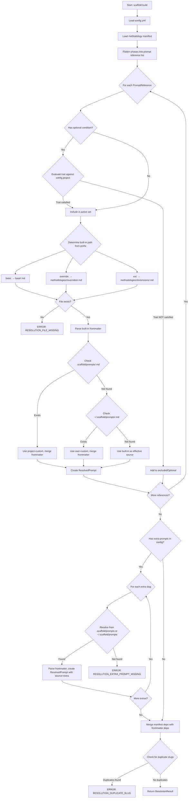

# Domain Model: Layered Prompt Resolution System

**Domain ID**: 01
**Phase**: 1 — Deep Domain Modeling
**Depends on**: None — first-pass modeling
**Last updated**: 2026-03-12
**Status**: draft

---

## Section 1: Domain Overview

The Layered Prompt Resolution System is the mechanism by which Scaffold v2 transforms a methodology name, a set of mixin selections, and optional user customizations into a concrete, ordered list of prompt file paths ready for mixin injection and platform adaptation. It implements a three-layer resolution strategy: **base prompts** (shared across methodologies), **methodology overrides and extensions** (methodology-specific replacements or additions), and **prompt customizations** (project-level and user-level overrides that take highest precedence). The system also handles optional prompt filtering based on project traits, extra-prompt integration from config, and frontmatter merging across layers.

**Role in the v2 architecture**: Prompt resolution is the first computational step after `scaffold build` reads `config.yml`. Its output — a list of `ResolvedPrompt` records — feeds directly into the mixin injection system ([domain 12](12-mixin-injection.md)), which performs text transformation on each prompt's content. After mixin injection, the dependency resolution system ([domain 02](02-dependency-resolution.md)) orders the prompts topologically, and platform adapters ([domain 05](05-platform-adapters.md)) transform them into platform-specific outputs. Config validation ([domain 06](06-config-validation.md)) runs before resolution to ensure the inputs are well-formed.

**Central design challenge**: Reconciling four sources of truth — the methodology manifest's `phases.prompts` list, the base/override/extension file directories, the prompt customization directories, and the per-prompt frontmatter — into a single coherent prompt set, with clear precedence rules, well-defined failure modes, and predictable frontmatter merging behavior.

---

## Section 2: Glossary

**base prompt** — A prompt file in the `base/` directory that is shared across methodologies. Base prompts use abstract task verbs and mixin insertion points rather than tool-specific commands.

**methodology** — A named pipeline configuration (e.g., `classic`, `classic-lite`) that defines which prompts to include, in what phases, with what dependencies. Stored as a directory under `methodologies/`.

**methodology manifest** — The `manifest.yml` file within a methodology directory. Declares the pipeline shape: phases, prompt references, defaults, and dependencies.

**override prompt** — A prompt file in a methodology's `overrides/` directory that completely replaces a base prompt of the same name. Referenced with the `override:` prefix in the manifest.

**extension prompt** — A prompt file in a methodology's `extensions/` directory that has no base equivalent — it exists only within this methodology. Referenced with the `ext:` prefix in the manifest.

**prompt reference** — A string in the manifest's `phases.prompts` list that specifies both the source layer and the prompt name. Format: `<prefix>:<name>` where prefix is `base`, `override`, or `ext`.

**prompt slug** — The short name of a prompt, matching the filename without extension (e.g., `tech-stack` from `tech-stack.md`). Used as the key in dependency graphs, state tracking, and cross-references.

**prompt customization** — A user-provided prompt file that overrides a built-in prompt. Project-level customizations live in `.scaffold/prompts/`, user-level in `~/.scaffold/prompts/`.

**resolved prompt** — The final data record for a prompt after resolution: source layer identified, file path determined, frontmatter merged, optional filtering applied. This is the input to the mixin injection phase.

**extra prompt** — A custom prompt listed in `config.yml` under `extra-prompts`. Added to the pipeline alongside built-in prompts, positioned by its own `depends-on` and `phase` declarations.

**source layer** — One of `base`, `override`, `ext`, `project-custom`, `user-custom`, or `extra`. Identifies where a resolved prompt's content originates.

**optional prompt** — A prompt in the manifest marked with `optional: { requires: <condition> }`. Excluded from the resolved set if the condition is not met by the project's traits.

**project trait** — A boolean capability of the project (e.g., `frontend`, `web`, `mobile`, `multi-platform`, `multi-model-cli`) set during `scaffold init` and stored in `config.yml` under `project`. Used to evaluate optional prompt conditions.

**mixin insertion point** — An HTML comment marker in a prompt file (e.g., `<!-- mixin:task-tracking -->`) that the mixin injection system replaces with concrete content. Not part of this domain, but prompt resolution must verify markers are present for configured axes.

**frontmatter** — YAML metadata at the top of a prompt file. Fields include `description`, `depends-on`, `phase`, `argument-hint`, `produces`, `reads`, `artifact-schema`, and `requires-capabilities`.

**built-in prompt** — Any prompt that ships with the scaffold CLI package (base prompts, methodology overrides, and methodology extensions). Distinguished from custom prompts.

---

## Section 3: Entity Model

```typescript
/**
 * A reference to a prompt in the methodology manifest.
 * Appears in manifest.yml under phases[].prompts[].
 */
interface PromptReference {
  /** The source layer prefix: base, override, or ext */
  prefix: 'base' | 'override' | 'ext';

  /** The prompt slug (filename without .md extension) */
  name: string;

  /**
   * Optional condition for inclusion. If present, the prompt is only
   * included when the project has the required trait.
   * Absent means the prompt is always included.
   */
  optional?: OptionalCondition;
}

/**
 * Condition for optional prompt inclusion.
 * Evaluated against project traits from config.yml.
 */
interface OptionalCondition {
  /**
   * The project trait that must be true for this prompt to be included.
   * Valid values: 'frontend', 'web', 'mobile', 'multi-platform', 'multi-model-cli'
   */
  requires: ProjectTrait;
}

type ProjectTrait = 'frontend' | 'web' | 'mobile' | 'multi-platform' | 'multi-model-cli';

/**
 * The methodology manifest file (manifest.yml).
 * Defines the pipeline shape for a methodology.
 */
interface MethodologyManifest {
  /** Human-readable methodology name */
  name: string;

  /** Short description */
  description: string;

  /**
   * Ordered list of phases, each containing prompt references.
   * Phases define display grouping; dependencies define execution order.
   */
  phases: Phase[];

  /**
   * Default mixin selections for each axis.
   * Can be overridden by config.yml.
   */
  defaults: Record<string, string>;

  /**
   * Dependency graph for execution ordering.
   * Keys are prompt slugs (without prefix).
   * Values are arrays of prompt slugs that must complete first.
   * Authoritative for ordering; phases are for display only.
   */
  dependencies: Record<string, string[]>;
}

/**
 * A phase within the methodology manifest.
 * Groups prompts for display purposes.
 */
interface Phase {
  /** Human-readable phase name */
  name: string;

  /** Ordered list of prompt references within this phase */
  prompts: PromptReference[];
}

/**
 * YAML frontmatter parsed from a prompt file.
 * All fields are optional except description.
 */
interface PromptFrontmatter {
  /** Short description for pipeline display and help. Required. */
  description: string;

  /**
   * Prompt slugs this prompt depends on.
   * Merged (union) with manifest dependencies if both declare deps.
   * Defaults to empty array.
   */
  'depends-on'?: string[];

  /**
   * Phase number for display grouping.
   * Defaults to phase of last dependency, or 1.
   */
  phase?: number;

  /** Hint for argument substitution, shown in help */
  'argument-hint'?: string;

  /**
   * Expected output file paths.
   * Required for built-in prompts, optional for custom.
   * Used by completion detection, v1 detection, and step gating.
   */
  produces?: string[];

  /**
   * Input file paths this prompt needs.
   * Supports both full-file strings and section-targeted objects.
   */
  reads?: Array<string | SectionTargetedRead>;

  /** Expected structure of produced artifacts for validation */
  'artifact-schema'?: Record<string, ArtifactSchema>;

  /** Platform capabilities the prompt requires */
  'requires-capabilities'?: Capability[];
}

/**
 * A section-targeted read reference.
 * Extracts only specific sections from a predecessor document.
 */
interface SectionTargetedRead {
  /** File path to read from */
  path: string;

  /** Heading text of sections to extract */
  sections: string[];
}

/**
 * Schema for validating a produced artifact.
 */
interface ArtifactSchema {
  /** Exact markdown heading strings that must appear */
  'required-sections'?: string[];

  /** Regex pattern for entity IDs (e.g., "US-\\d{3}"). Null if none. */
  'id-format'?: string | null;

  /** Whether a summary index table must appear in first 50 lines */
  'index-table'?: boolean;
}

type Capability = 'user-interaction' | 'filesystem-write' | 'subagent' | 'mcp' | 'git';

/**
 * The per-project configuration file (.scaffold/config.yml).
 * Only the fields relevant to prompt resolution are shown here.
 */
interface ScaffoldConfig {
  /** Config schema version */
  version: number;

  /** Selected methodology name (must match a methodology directory) */
  methodology: string;

  /** Selected mixin for each axis */
  mixins: Record<string, string>;

  /** Target platforms for adapter generation */
  platforms: string[];

  /** Project traits for optional prompt evaluation */
  project?: ProjectTraits;

  /** Additional custom prompt slugs to include */
  'extra-prompts'?: string[];
}

/**
 * Project traits derived from scaffold init.
 * Used to evaluate optional prompt conditions.
 */
interface ProjectTraits {
  /** Target platforms, e.g., ['web'], ['web', 'mobile'] */
  platforms?: string[];

  /** Whether Codex/Gemini CLIs are available */
  'multi-model-cli'?: boolean;
}

/**
 * The source layer of a resolved prompt.
 * Identifies where the prompt content was found.
 */
type SourceLayer =
  | 'base'             // From base/ directory
  | 'override'         // From methodologies/<m>/overrides/
  | 'ext'              // From methodologies/<m>/extensions/
  | 'project-custom'   // From .scaffold/prompts/ (project-level override)
  | 'user-custom'      // From ~/.scaffold/prompts/ (user-level override)
  | 'extra';           // From extra-prompts in config.yml

/**
 * The primary output of the resolution system.
 * One record per prompt in the resolved pipeline.
 */
interface ResolvedPrompt {
  /**
   * The prompt slug. Unique within the resolved set.
   * Used as the key in state.json, dependency graphs, etc.
   */
  slug: string;

  /**
   * Where the prompt content was found.
   * Records the effective source after customization precedence.
   */
  sourceLayer: SourceLayer;

  /**
   * Absolute file path to the prompt content.
   * This is the file that will be read for mixin injection.
   */
  filePath: string;

  /**
   * Merged frontmatter from all applicable layers.
   * See frontmatter merging rules in Section 5.
   */
  frontmatter: ResolvedFrontmatter;

  /**
   * The phase this prompt belongs to (for display grouping).
   * Derived from manifest phase or frontmatter.
   */
  phaseIndex: number;

  /** Human-readable phase name */
  phaseName: string;

  /**
   * Whether this prompt was originally a base, override, or ext
   * in the manifest — before customization precedence was applied.
   * Useful for diagnostics and error messages.
   */
  manifestPrefix: 'base' | 'override' | 'ext' | null;
}

/**
 * Frontmatter after merging across layers.
 * All fields have been resolved to their final values.
 */
interface ResolvedFrontmatter {
  /** Description from the effective source */
  description: string;

  /**
   * Merged dependencies: union of manifest dependencies and
   * frontmatter depends-on from the effective source.
   */
  dependsOn: string[];

  /** Phase number (from frontmatter, manifest, or inferred) */
  phase: number;

  /** Argument hint (from effective source) */
  argumentHint?: string;

  /** Produces list (from effective source) */
  produces: string[];

  /** Reads list (from effective source) */
  reads: Array<string | SectionTargetedRead>;

  /** Artifact schema (from effective source) */
  artifactSchema?: Record<string, ArtifactSchema>;

  /** Required capabilities (from effective source) */
  requiresCapabilities: Capability[];
}

/**
 * The complete output of the resolution pipeline.
 * Consumed by mixin injection, dependency resolution, and adapters.
 */
interface ResolutionResult {
  /** All resolved prompts, in manifest phase order (not dependency order) */
  prompts: ResolvedPrompt[];

  /** Methodology name that was resolved */
  methodology: string;

  /** Mixin selections used during resolution */
  mixins: Record<string, string>;

  /** Prompts that were excluded due to optional conditions */
  excludedOptional: ExcludedPrompt[];

  /** Warnings generated during resolution (non-fatal) */
  warnings: ResolutionWarning[];
}

/**
 * Record of a prompt excluded due to unmet optional condition.
 */
interface ExcludedPrompt {
  slug: string;
  reason: string;
  requiredTrait: ProjectTrait;
}

/**
 * A non-fatal warning from resolution.
 */
interface ResolutionWarning {
  code: string;
  message: string;
  slug?: string;
  filePath?: string;
}
```

**Entity relationships:**

```
ScaffoldConfig
  ├── references → MethodologyManifest (via config.methodology)
  ├── selects → mixin files (via config.mixins)
  └── lists → extra prompt slugs (via config.extra-prompts)

MethodologyManifest
  ├── contains → Phase[] → PromptReference[]
  └── declares → dependency graph (Record<string, string[]>)

PromptReference
  └── resolves to → prompt file (base/, overrides/, extensions/)
       └── may be overridden by → customization file (.scaffold/prompts/, ~/.scaffold/prompts/)

ResolvedPrompt (output)
  ├── points to → file path (effective source)
  ├── contains → ResolvedFrontmatter (merged)
  └── belongs to → phase (from manifest)

ResolutionResult (aggregate output)
  ├── contains → ResolvedPrompt[]
  ├── records → ExcludedPrompt[]
  └── records → ResolutionWarning[]
```

---

## Section 4: State Transitions

N/A — The prompt resolution system is a stateless transformation pipeline. It takes inputs (config, manifest, file system) and produces outputs (resolved prompt list) in a single pass. There are no persistent state changes or lifecycle transitions within this domain.

State tracking for prompt execution status (`pending`, `in_progress`, `completed`, `skipped`) belongs to the Pipeline State Machine domain ([domain 03](03-pipeline-state-machine.md)). Resolution runs once at `scaffold build` time and is cached; it does not maintain or mutate state between invocations.

---

## Section 5: Core Algorithms

### Algorithm 1: Prompt Set Resolution

The top-level algorithm that transforms config + manifest + file system into a `ResolutionResult`.

**Input**: `ScaffoldConfig`, file system access
**Output**: `ResolutionResult`

```
FUNCTION resolvePromptSet(config: ScaffoldConfig): ResolutionResult
  // Step 1: Load and validate methodology manifest
  manifest ← loadManifest(config.methodology)
  // Validation is assumed done by domain 06 before this point

  // Step 2: Flatten prompt references from all phases
  allRefs ← []
  FOR EACH phase IN manifest.phases
    FOR EACH ref IN phase.prompts
      allRefs.append({ ref, phaseIndex: indexOf(phase), phaseName: phase.name })

  // Step 3: Filter optional prompts
  activeRefs ← []
  excludedOptional ← []
  FOR EACH entry IN allRefs
    IF entry.ref.optional IS defined
      trait ← entry.ref.optional.requires
      IF NOT evaluateTrait(trait, config.project)
        excludedOptional.append({
          slug: entry.ref.name,
          reason: "Project does not have trait: " + trait,
          requiredTrait: trait
        })
        CONTINUE
    activeRefs.append(entry)

  // Step 4: Resolve each prompt reference to a file path
  resolvedPrompts ← []
  warnings ← []
  FOR EACH entry IN activeRefs
    resolved ← resolvePromptReference(
      entry.ref, config.methodology, config, warnings
    )
    resolved.phaseIndex ← entry.phaseIndex
    resolved.phaseName ← entry.phaseName
    resolvedPrompts.append(resolved)

  // Step 5: Integrate extra prompts from config
  IF config.extra-prompts IS defined
    FOR EACH extraSlug IN config.extra-prompts
      resolved ← resolveExtraPrompt(extraSlug, config, warnings)
      resolvedPrompts.append(resolved)

  // Step 6: Merge frontmatter dependencies with manifest dependencies
  FOR EACH rp IN resolvedPrompts
    manifestDeps ← manifest.dependencies[rp.slug] OR []
    frontmatterDeps ← rp.frontmatter.dependsOn OR []
    rp.frontmatter.dependsOn ← UNION(manifestDeps, frontmatterDeps)

  // Step 7: Validate no duplicate slugs
  slugs ← SET()
  FOR EACH rp IN resolvedPrompts
    IF rp.slug IN slugs
      THROW RESOLUTION_DUPLICATE_SLUG(rp.slug)
    slugs.add(rp.slug)

  RETURN {
    prompts: resolvedPrompts,
    methodology: config.methodology,
    mixins: config.mixins,
    excludedOptional,
    warnings
  }
```

**Complexity**: O(P) where P is the number of prompt references in the manifest, plus E extra prompts. File system lookups are O(1) per prompt (direct path construction). Trait evaluation is O(1) per prompt.

### Algorithm 2: Single Prompt Reference Resolution

Resolves one `PromptReference` (from the manifest) to a `ResolvedPrompt`, applying the customization precedence chain.

**Input**: `PromptReference`, methodology name, `ScaffoldConfig`, warnings accumulator
**Output**: `ResolvedPrompt`

```
FUNCTION resolvePromptReference(
  ref: PromptReference,
  methodology: string,
  config: ScaffoldConfig,
  warnings: ResolutionWarning[]
): ResolvedPrompt

  slug ← ref.name

  // Step 1: Determine the built-in file path based on prefix
  SWITCH ref.prefix
    CASE 'base':
      builtInPath ← "<scaffold-root>/base/" + slug + ".md"
    CASE 'override':
      builtInPath ← "<scaffold-root>/methodologies/" + methodology + "/overrides/" + slug + ".md"
    CASE 'ext':
      builtInPath ← "<scaffold-root>/methodologies/" + methodology + "/extensions/" + slug + ".md"

  // Step 2: Check built-in file exists
  IF NOT fileExists(builtInPath)
    THROW RESOLUTION_FILE_MISSING(ref.prefix, slug, builtInPath)

  // Step 3: Load built-in frontmatter (needed for fallback merge)
  builtInFrontmatter ← parseFrontmatter(builtInPath)

  // Step 4: Apply customization precedence chain
  //   1. Project-level: .scaffold/prompts/<slug>.md
  //   2. User-level:    ~/.scaffold/prompts/<slug>.md
  //   3. Built-in:      (determined in Step 1)
  projectCustomPath ← ".scaffold/prompts/" + slug + ".md"
  userCustomPath ← "~/.scaffold/prompts/" + slug + ".md"

  IF fileExists(projectCustomPath)
    effectivePath ← projectCustomPath
    sourceLayer ← 'project-custom'
    customFrontmatter ← parseFrontmatter(projectCustomPath)
    finalFrontmatter ← mergeFrontmatter(builtInFrontmatter, customFrontmatter)
  ELSE IF fileExists(userCustomPath)
    effectivePath ← userCustomPath
    sourceLayer ← 'user-custom'
    customFrontmatter ← parseFrontmatter(userCustomPath)
    finalFrontmatter ← mergeFrontmatter(builtInFrontmatter, customFrontmatter)
  ELSE
    effectivePath ← builtInPath
    sourceLayer ← ref.prefix  // 'base', 'override', or 'ext'
    finalFrontmatter ← normalizeFrontmatter(builtInFrontmatter)

  RETURN {
    slug,
    sourceLayer,
    filePath: effectivePath,
    frontmatter: finalFrontmatter,
    phaseIndex: 0,   // Set by caller
    phaseName: "",    // Set by caller
    manifestPrefix: ref.prefix
  }
```

**Complexity**: O(1) — fixed number of file existence checks (3 at most) and one frontmatter parse per source.

### Algorithm 3: Frontmatter Merging

When a customization overrides a built-in prompt, frontmatter fields are merged according to specific rules.

**Input**: built-in frontmatter, custom frontmatter
**Output**: `ResolvedFrontmatter`

```
FUNCTION mergeFrontmatter(
  builtIn: PromptFrontmatter,
  custom: PromptFrontmatter
): ResolvedFrontmatter

  // Rule: Custom frontmatter fields take precedence when present.
  // Absent custom fields inherit from the built-in.
  // Exception: depends-on is unioned if both declare it.

  merged ← {}

  // description: custom wins if present, else built-in
  merged.description ← custom.description OR builtIn.description

  // depends-on: UNION of both (not replacement)
  //   Rationale: a custom prompt may add new dependencies beyond
  //   what the built-in declares, but removing built-in deps could
  //   break the pipeline. The safe default is union.
  builtInDeps ← builtIn['depends-on'] OR []
  customDeps ← custom['depends-on'] OR []
  IF custom['depends-on'] IS explicitly set to empty array []
    // Explicit empty array in custom means "no deps from custom side"
    // Still union with built-in deps
    merged.dependsOn ← builtInDeps
  ELSE
    merged.dependsOn ← UNION(builtInDeps, customDeps)

  // phase: custom wins if present, else built-in
  merged.phase ← custom.phase OR builtIn.phase OR inferPhase(merged.dependsOn)

  // produces: custom wins entirely if present
  //   Rationale: if a custom prompt produces different artifacts,
  //   the custom's produces list is authoritative
  merged.produces ← custom.produces OR builtIn.produces OR []

  // reads: custom wins entirely if present
  merged.reads ← custom.reads OR builtIn.reads OR []

  // argument-hint: custom wins if present
  merged.argumentHint ← custom['argument-hint'] OR builtIn['argument-hint']

  // artifact-schema: custom wins entirely if present
  merged.artifactSchema ← custom['artifact-schema'] OR builtIn['artifact-schema']

  // requires-capabilities: custom wins entirely if present
  merged.requiresCapabilities ← custom['requires-capabilities'] OR builtIn['requires-capabilities'] OR []

  RETURN merged
```

**Edge cases**:
- Custom file has no frontmatter at all: all fields inherit from built-in
- Custom file has only `description`: description from custom, everything else from built-in
- Custom file explicitly sets `depends-on: []`: custom contributes no deps, but built-in deps still apply
- Custom file declares a `depends-on` that conflicts with manifest deps: union, so the dependency is additive. Circular dependencies caught downstream by domain 02.

**Complexity**: O(D) where D is the total number of dependency entries across both sources.

### Algorithm 4: Extra Prompt Resolution

Resolves a prompt from the `extra-prompts` list in config.yml.

**Input**: prompt slug, `ScaffoldConfig`, warnings accumulator
**Output**: `ResolvedPrompt`

```
FUNCTION resolveExtraPrompt(
  slug: string,
  config: ScaffoldConfig,
  warnings: ResolutionWarning[]
): ResolvedPrompt

  // Extra prompts can only come from customization directories
  projectPath ← ".scaffold/prompts/" + slug + ".md"
  userPath ← "~/.scaffold/prompts/" + slug + ".md"

  IF fileExists(projectPath)
    effectivePath ← projectPath
    sourceLayer ← 'extra'  // Use 'extra' rather than 'project-custom' to distinguish
  ELSE IF fileExists(userPath)
    effectivePath ← userPath
    sourceLayer ← 'extra'
  ELSE
    THROW RESOLUTION_EXTRA_PROMPT_MISSING(slug, projectPath, userPath)

  frontmatter ← parseFrontmatter(effectivePath)

  // Validate required fields for extra prompts
  IF frontmatter.description IS missing
    THROW RESOLUTION_EXTRA_PROMPT_INVALID_FRONTMATTER(slug, "missing description")

  // Phase defaults to 7 (Implementation) if not specified
  phase ← frontmatter.phase OR 7

  RETURN {
    slug,
    sourceLayer: 'extra',
    filePath: effectivePath,
    frontmatter: normalizeFrontmatter(frontmatter),
    phaseIndex: phase - 1,  // Zero-indexed
    phaseName: inferPhaseName(phase),
    manifestPrefix: null  // Not from the manifest
  }
```

**Complexity**: O(1) — two file existence checks and one frontmatter parse.

### Algorithm 5: Trait Evaluation

Evaluates whether a project trait is satisfied by the config.

**Input**: `ProjectTrait`, `ProjectTraits` (from config)
**Output**: boolean

```
FUNCTION evaluateTrait(
  trait: ProjectTrait,
  projectConfig: ProjectTraits | undefined
): boolean

  IF projectConfig IS undefined
    RETURN false

  SWITCH trait
    CASE 'frontend':
      // True if platforms include 'web' or 'mobile'
      RETURN projectConfig.platforms CONTAINS 'web'
          OR projectConfig.platforms CONTAINS 'mobile'
    CASE 'web':
      RETURN projectConfig.platforms CONTAINS 'web'
    CASE 'mobile':
      RETURN projectConfig.platforms CONTAINS 'mobile'
    CASE 'multi-platform':
      RETURN (projectConfig.platforms OR []).length >= 2
    CASE 'multi-model-cli':
      RETURN projectConfig['multi-model-cli'] === true
    DEFAULT:
      RETURN false  // Unknown traits evaluate to false
```

**Complexity**: O(1) per evaluation.

---

## Section 6: Error Taxonomy

### Resolution Errors (Fatal — build cannot proceed)

#### `RESOLUTION_FILE_MISSING`
- **Severity**: Error
- **When**: A prompt reference in the manifest points to a file that does not exist
- **Message template**: `Prompt "{prefix}:{slug}" references file "{path}" which does not exist.`
- **JSON structure**:
  ```json
  {
    "code": "RESOLUTION_FILE_MISSING",
    "prefix": "override",
    "slug": "implementation-plan",
    "expected_path": "methodologies/classic/overrides/implementation-plan.md",
    "methodology": "classic"
  }
  ```
- **Recovery**: Check the methodology manifest for typos. If the prompt was renamed, update the manifest. If the file was deleted, restore it or remove the reference from the manifest.

#### `RESOLUTION_EXTRA_PROMPT_MISSING`
- **Severity**: Error
- **When**: An `extra-prompts` entry in config.yml cannot be found in either `.scaffold/prompts/` or `~/.scaffold/prompts/`
- **Message template**: `Extra prompt "{slug}" not found. Searched: {projectPath}, {userPath}`
- **JSON structure**:
  ```json
  {
    "code": "RESOLUTION_EXTRA_PROMPT_MISSING",
    "slug": "security-audit",
    "searched_paths": [
      ".scaffold/prompts/security-audit.md",
      "~/.scaffold/prompts/security-audit.md"
    ]
  }
  ```
- **Recovery**: Create the prompt file in `.scaffold/prompts/` with valid YAML frontmatter, or remove the entry from `extra-prompts` in config.yml.

#### `RESOLUTION_EXTRA_PROMPT_INVALID_FRONTMATTER`
- **Severity**: Error
- **When**: An extra prompt file exists but has missing or malformed YAML frontmatter
- **Message template**: `Extra prompt "{slug}" has invalid frontmatter: {reason}`
- **JSON structure**:
  ```json
  {
    "code": "RESOLUTION_EXTRA_PROMPT_INVALID_FRONTMATTER",
    "slug": "security-audit",
    "path": ".scaffold/prompts/security-audit.md",
    "reason": "missing description"
  }
  ```
- **Recovery**: Add valid YAML frontmatter to the prompt file. At minimum, `description` is required.

#### `RESOLUTION_DUPLICATE_SLUG`
- **Severity**: Error
- **When**: Two prompts resolve to the same slug (e.g., a manifest lists the same prompt twice, or an extra prompt has the same name as a built-in)
- **Message template**: `Duplicate prompt slug "{slug}". A prompt with this name already exists in the resolved set.`
- **JSON structure**:
  ```json
  {
    "code": "RESOLUTION_DUPLICATE_SLUG",
    "slug": "tech-stack",
    "existing_source": "base",
    "conflicting_source": "extra"
  }
  ```
- **Recovery**: Rename the extra prompt to avoid the collision. If trying to override a built-in, use the customization layer (`.scaffold/prompts/`) rather than `extra-prompts`.

#### `RESOLUTION_MANIFEST_INVALID`
- **Severity**: Error
- **When**: The methodology manifest cannot be parsed or is structurally invalid
- **Message template**: `Invalid manifest for methodology "{methodology}": {reason}`
- **JSON structure**:
  ```json
  {
    "code": "RESOLUTION_MANIFEST_INVALID",
    "methodology": "classic",
    "path": "methodologies/classic/manifest.yml",
    "reason": "phases[2].prompts[0] missing prefix"
  }
  ```
- **Recovery**: Fix the manifest YAML. Every prompt reference must use the format `prefix:name`.

#### `RESOLUTION_METHODOLOGY_NOT_FOUND`
- **Severity**: Error
- **When**: The methodology specified in config.yml does not match any installed methodology directory
- **Message template**: `Methodology "{name}" not found. Valid options: {options}`
- **JSON structure**:
  ```json
  {
    "code": "RESOLUTION_METHODOLOGY_NOT_FOUND",
    "value": "clasic",
    "suggestion": "classic",
    "valid_options": ["classic", "classic-lite"]
  }
  ```
- **Recovery**: Fix the methodology name in config.yml. The error includes fuzzy-match suggestions if the Levenshtein distance is ≤ 2.

#### `RESOLUTION_FRONTMATTER_PARSE_ERROR`
- **Severity**: Error
- **When**: A prompt file's YAML frontmatter cannot be parsed
- **Message template**: `Cannot parse frontmatter in "{path}": {parseError}`
- **JSON structure**:
  ```json
  {
    "code": "RESOLUTION_FRONTMATTER_PARSE_ERROR",
    "path": "base/tech-stack.md",
    "parse_error": "unexpected token at line 3"
  }
  ```
- **Recovery**: Fix the YAML syntax in the prompt file's frontmatter block.

### Resolution Warnings (Non-fatal — build proceeds with caveats)

#### `RESOLUTION_CUSTOM_OVERRIDE_ACTIVE`
- **Severity**: Warning
- **When**: A customization file overrides a built-in prompt
- **Message template**: `Prompt "{slug}" overridden by {customPath} (built-in at {builtInPath} will not be used)`
- **JSON structure**:
  ```json
  {
    "code": "RESOLUTION_CUSTOM_OVERRIDE_ACTIVE",
    "slug": "tech-stack",
    "custom_path": ".scaffold/prompts/tech-stack.md",
    "builtin_path": "base/tech-stack.md",
    "source_layer": "project-custom"
  }
  ```
- **Recovery**: Informational only. Remove the custom file to revert to the built-in.

#### `RESOLUTION_UNKNOWN_TRAIT`
- **Severity**: Warning
- **When**: An optional prompt's `requires` condition references a trait not in the known set
- **Message template**: `Optional prompt "{slug}" requires unknown trait "{trait}". Prompt will be excluded.`
- **JSON structure**:
  ```json
  {
    "code": "RESOLUTION_UNKNOWN_TRAIT",
    "slug": "some-prompt",
    "trait": "serverless",
    "known_traits": ["frontend", "web", "mobile", "multi-platform", "multi-model-cli"]
  }
  ```
- **Recovery**: Check the trait name in the manifest for typos. If this is a new trait, add support for it.

#### `RESOLUTION_DEPENDENCY_ON_EXCLUDED`
- **Severity**: Warning
- **When**: A resolved prompt declares a dependency on a prompt that was excluded (optional, filtered out)
- **Message template**: `Prompt "{slug}" depends on "{depSlug}" which was excluded (optional, requires: {trait}). Dependency will be ignored.`
- **JSON structure**:
  ```json
  {
    "code": "RESOLUTION_DEPENDENCY_ON_EXCLUDED",
    "slug": "some-prompt",
    "excluded_dependency": "add-playwright",
    "excluded_reason": "requires: web"
  }
  ```
- **Recovery**: Informational. The dependency is removed from the resolved set. If the dependency is actually needed, enable the required trait in config.yml.

---

## Section 7: Integration Points

### Config Validation (Domain 06) → Prompt Resolution

- **Direction**: Domain 06 runs before domain 01
- **Data flow**: Domain 06 validates `config.yml` and produces a validated `ScaffoldConfig`. Resolution assumes the config is already valid (methodology exists, mixin values are valid, extra-prompt entries are syntactically correct).
- **Contract**: Resolution trusts that `config.methodology` matches an installed methodology directory. It performs its own file-existence checks for prompt files (since config validation doesn't load every prompt file).
- **Assumption**: Config validation catches unknown methodology names, invalid mixin axis/value combinations, and malformed YAML before resolution runs.

### Prompt Resolution → Mixin Injection (Domain 12)

- **Direction**: Domain 01 outputs feed domain 12
- **Data flow**: `ResolutionResult.prompts` (list of `ResolvedPrompt` records with file paths) is consumed by the mixin injection system. Each prompt's `filePath` is read, mixin markers are identified, and mixin content is injected.
- **Contract**: Resolution provides file paths that exist and are readable. Each `ResolvedPrompt` has a valid `filePath`. Resolution does NOT read prompt body content — only frontmatter. The mixin system reads the full file content.
- **Assumption**: Mixin injection expects that every prompt file is valid markdown with optional `<!-- mixin:<axis> -->` markers. Resolution does not validate mixin markers (that's domain 12's responsibility).

### Prompt Resolution → Dependency Resolution (Domain 02)

- **Direction**: Domain 01 outputs feed domain 02
- **Data flow**: `ResolutionResult.prompts` with their `frontmatter.dependsOn` arrays are consumed by the dependency resolution system, which performs topological sorting.
- **Contract**: Resolution provides each prompt's slug and its merged dependency list (union of manifest deps and frontmatter deps). Dependency keys use short names (slugs), not prefixed references.
- **Assumption**: Domain 02 expects all dependency targets to be present in the resolved prompt list. If a dependency target was excluded (optional) or doesn't exist, resolution either removes the dependency (if excluded) or errors (if genuinely missing).

### Prompt Resolution → Platform Adapters (Domain 05)

- **Direction**: Domain 01 outputs (post mixin injection) feed domain 05
- **Data flow**: Resolved and mixin-injected prompts are passed to platform adapters, which generate platform-specific outputs (commands/*.md, AGENTS.md, etc.).
- **Contract**: Each `ResolvedPrompt` includes `frontmatter` with `description`, `argumentHint`, `produces`, `reads`, and `requiresCapabilities`. Adapters use these for generating help text, navigation, and capability warnings.
- **Assumption**: Adapters receive fully resolved, mixin-injected prompt content. They do not perform any resolution or injection themselves.

### Prompt Resolution → Pipeline State Machine (Domain 03)

- **Direction**: Domain 01 outputs feed domain 03
- **Data flow**: The resolved prompt list is used to initialize `state.json` prompt entries and determine `next_eligible` prompts.
- **Contract**: Each prompt's slug, source layer, and produces list are recorded in state.json. State machine uses the dependency-sorted order from domain 02, but needs the source layer from domain 01.

### Prompt Frontmatter (Domain 08) → Prompt Resolution

- **Direction**: Domain 08 defines the schema; domain 01 parses and uses it
- **Data flow**: Resolution parses YAML frontmatter from prompt files according to the schema defined in domain 08.
- **Contract**: Resolution expects frontmatter to conform to the `PromptFrontmatter` interface. Unknown fields are ignored. Missing required fields (`description` for extra prompts) cause errors.

---

## Section 8: Edge Cases & Failure Modes

### Mandatory Question 1: Exact algorithm for resolving `base:tech-stack` to a file path

The resolution algorithm for a prompt reference `base:tech-stack`:

1. **Parse the reference**: Split on `:` to get `prefix = "base"`, `name = "tech-stack"`.
2. **Construct the built-in path** based on prefix:
   - `base:` → `<scaffold-install-dir>/base/tech-stack.md`
   - `override:` → `<scaffold-install-dir>/methodologies/<methodology>/overrides/tech-stack.md`
   - `ext:` → `<scaffold-install-dir>/methodologies/<methodology>/extensions/tech-stack.md`
3. **Verify the built-in file exists**. If not, error `RESOLUTION_FILE_MISSING`.
4. **Parse the built-in frontmatter** (needed for fallback values during merge).
5. **Check the customization chain** (first match wins):
   - `.scaffold/prompts/tech-stack.md` (project-level) — if exists, this is the effective file
   - `~/.scaffold/prompts/tech-stack.md` (user-level) — if exists, this is the effective file
   - Otherwise, the built-in file is the effective file
6. **If a customization was found**, parse its frontmatter and merge with the built-in frontmatter (see Algorithm 3).
7. **Return** the `ResolvedPrompt` with the effective file path, merged frontmatter, and source layer.

**Fallback behavior**: There is no silent fallback. If the built-in file doesn't exist, resolution fails with an error. The customization chain is a *precedence override*, not a fallback — the built-in must always exist, even if a customization will replace it. This ensures the dependency graph and frontmatter defaults are always derivable from the built-in.

**Category**: (a) Handled by design.

### Mandatory Question 2: Prompt customization precedence chain and frontmatter merging

**Precedence** (first match wins):
1. **Project-level override**: `.scaffold/prompts/<slug>.md`
2. **User-level override**: `~/.scaffold/prompts/<slug>.md`
3. **Built-in prompt**: resolved via methodology (base/, overrides/, extensions/)

**Frontmatter merge rules** when a customization overrides a built-in:

| Field | Rule | Rationale |
|-------|------|-----------|
| `description` | Custom wins if present, else built-in | Custom may want different help text |
| `depends-on` | Union of both | Removing built-in deps could break the pipeline; additions are safe |
| `phase` | Custom wins if present, else built-in | Custom may belong to a different phase |
| `produces` | Custom wins entirely if present, else built-in | Different prompt content may produce different files |
| `reads` | Custom wins entirely if present, else built-in | Different content may need different inputs |
| `argument-hint` | Custom wins if present, else built-in | — |
| `artifact-schema` | Custom wins entirely if present, else built-in | Schema must match actual produced content |
| `requires-capabilities` | Custom wins entirely if present, else built-in | — |

Key design choice: `depends-on` uses **union** while most other fields use **replace**. This is because dependencies are safety constraints (removing one could cause a prompt to run before its prerequisite), while other fields describe the custom prompt's own characteristics.

**Category**: (a) Handled by design.

### Mandatory Question 3: Missing override file behavior

If the manifest references `override:implementation-plan` but the file `methodologies/<methodology>/overrides/implementation-plan.md` does not exist, `scaffold build` fails with error `RESOLUTION_FILE_MISSING`.

There is **no fallback to the base prompt**. Rationale:
- An `override:` prefix is an explicit declaration that this methodology provides its own version of the prompt. A missing override file is a bug in the methodology, not a graceful degradation scenario.
- Silently falling back to the base would violate the methodology author's intent — they specifically chose `override:` over `base:` because the base version is inadequate for this methodology.
- The correct fix is to either create the override file or change the manifest reference to `base:implementation-plan`.

**Contrast with customization layer**: The customization layer (`.scaffold/prompts/`) is a *precedence chain* — it's designed for "use this if available, otherwise use the default." The manifest prefix system (`base:`, `override:`, `ext:`) is a *declaration* — it states definitively where the content lives.

**Category**: (b) Handled by explicit error.

### Mandatory Question 4: Extra-prompt integration

Extra prompts from `config.yml` are integrated in **Step 5** of the resolution pipeline (Algorithm 1), after all manifest prompt references have been resolved but before dependency merging.

The process:
1. For each slug in `config.extra-prompts`, resolve it via the customization directories only (`.scaffold/prompts/<slug>.md` first, then `~/.scaffold/prompts/<slug>.md`). Extra prompts have no built-in equivalent.
2. Parse the extra prompt's frontmatter. `description` is required; `depends-on` and `phase` are optional.
3. Phase defaults to 7 (Implementation) if not specified.
4. The extra prompt is added to the resolved set with `sourceLayer: 'extra'`.
5. In Step 6, the extra prompt's `depends-on` is included in the dependency graph (there are no manifest dependencies for extra prompts since they're not in the manifest).
6. In Step 7, a duplicate check ensures the extra prompt's slug doesn't collide with any built-in prompt slug. If it does, error `RESOLUTION_DUPLICATE_SLUG`.

Extra prompts participate in dependency resolution and topological sorting identically to built-in prompts. They can depend on built-in prompts and vice versa (though built-in prompts depending on extra prompts would be unusual).

**Category**: (a) Handled by design.

### Mandatory Question 5: Complete data structure of a resolved prompt

Before entering the mixin injection phase, each prompt is represented as a `ResolvedPrompt` record (see Section 3). The complete fields:

```typescript
{
  slug: string;              // e.g., "tech-stack"
  sourceLayer: SourceLayer;  // e.g., "base", "project-custom", "extra"
  filePath: string;          // e.g., "/usr/local/lib/scaffold/base/tech-stack.md"
  frontmatter: {
    description: string;         // "Research and document technology decisions"
    dependsOn: string[];         // ["create-prd", "beads-setup"]
    phase: number;               // 2
    argumentHint?: string;       // "<tech constraints or preferences>"
    produces: string[];          // ["docs/tech-stack.md"]
    reads: (string | SectionTargetedRead)[];  // ["docs/plan.md"]
    artifactSchema?: Record<string, ArtifactSchema>;
    requiresCapabilities: Capability[];  // ["user-interaction", "filesystem-write"]
  };
  phaseIndex: number;        // 1 (zero-indexed)
  phaseName: string;         // "Project Foundation"
  manifestPrefix: 'base' | 'override' | 'ext' | null;  // "base"
}
```

Note: The resolved prompt does **not** include the raw content of the prompt file. Only the file path is stored. The mixin injection system (domain 12) reads the file content at injection time. This keeps the resolution system lightweight — it only needs to read frontmatter, not the full multi-kilobyte prompt bodies.

**Category**: (a) Handled by design.

### Mandatory Question 6: Optional prompt exclusion timing

Optional prompts are filtered out in **Step 3** of Algorithm 1 — immediately after flattening all prompt references from the manifest phases, and before any file resolution occurs.

The process:
1. Each prompt reference is checked for an `optional` field.
2. If `optional.requires` is present, the trait is evaluated against `config.project`.
3. If the trait is not satisfied, the prompt is added to `excludedOptional` and skipped. No file resolution, frontmatter parsing, or customization lookup occurs for excluded prompts.
4. If a remaining prompt declares a `depends-on` that references an excluded prompt, a warning `RESOLUTION_DEPENDENCY_ON_EXCLUDED` is emitted and the dependency is removed from the resolved set.

**Rationale for early filtering**: Filtering before resolution avoids loading files that will never be used. It also avoids false `RESOLUTION_FILE_MISSING` errors for optional prompts whose files might not be installed (e.g., if a methodology ships mobile prompts only in a mobile-specific distribution).

**Category**: (a) Handled by design.

### Mandatory Question 7: Override prompt with different frontmatter

When an `override:` prompt declares different frontmatter (`depends-on`, `produces`, etc.) than the base prompt it conceptually replaces, **the override's frontmatter is authoritative**.

There is no merging between the base and the override because the override is not a customization of the base — it is a complete replacement defined by the methodology author. The manifest uses `override:` specifically to say "do not use the base version."

| Field | Behavior |
|-------|----------|
| `depends-on` | Override's deps are used. Manifest deps are merged via union (Step 6). |
| `produces` | Override's produces are used. |
| `reads` | Override's reads are used. |
| `phase` | From the manifest phase where the override appears. |
| All others | Override's values are used. |

**However**, if a *customization file* (`.scaffold/prompts/`) overrides the override, the same merge rules from Question 2 apply — the customization's frontmatter merges with the override's frontmatter (not the base's). The built-in for merge purposes is always the file that the manifest points to.

**Category**: (a) Handled by design.

### Mandatory Question 8: Version skew handling

**Scenario**: A methodology manifest references `base:tech-stack`, but the installed base prompts are from a newer scaffold version that renamed the prompt to `base:technology-decisions` or split it into `base:tech-stack-backend` and `base:tech-stack-frontend`.

**Behavior**: `scaffold build` fails with `RESOLUTION_FILE_MISSING` because `base/tech-stack.md` no longer exists at the expected path.

**Mitigation strategy** (multi-layered):

1. **Methodology manifests are bundled with the CLI**: In v2, methodologies ship as part of the npm/Homebrew package. When the base prompts are updated, the bundled methodology manifests are updated in the same release. Version skew between manifests and prompts within the same installation cannot occur.

2. **Custom methodology manifests may lag**: If a user creates a custom methodology or the team uses a git-tracked methodology, it could reference prompts from an older version. The `RESOLUTION_FILE_MISSING` error clearly identifies the broken reference. The user must update their manifest.

3. **Config version checking**: The config file includes a `version` field. If a breaking change occurs (prompt rename, split), the config version is incremented. `scaffold build` detects old configs and runs `scaffold config migrate` to update prompt references.

4. **`scaffold validate`**: Can be run after updates to detect broken references before attempting a build.

**Category**: (b) Handled by explicit error for the failure case; (a) handled by design for the common case (bundled manifests).

### Mandatory Question 9: Complete inventory of inputs and outputs

**Inputs to the resolution system:**

| Input | Source | Purpose |
|-------|--------|---------|
| `ScaffoldConfig` | `.scaffold/config.yml` (parsed) | Methodology name, mixin selections, extra prompts, project traits |
| Methodology manifest | `methodologies/<name>/manifest.yml` | Phase structure, prompt references, dependencies, defaults |
| Base prompt files | `base/*.md` | Frontmatter for base prompts |
| Override prompt files | `methodologies/<name>/overrides/*.md` | Frontmatter for overrides |
| Extension prompt files | `methodologies/<name>/extensions/*.md` | Frontmatter for extensions |
| Project custom prompts | `.scaffold/prompts/*.md` | Project-level overrides (if present) |
| User custom prompts | `~/.scaffold/prompts/*.md` | User-level overrides (if present) |
| File system state | existence checks | Whether files exist at expected paths |

**Outputs of the resolution system:**

| Output | Type | Consumer |
|--------|------|----------|
| `ResolutionResult.prompts` | `ResolvedPrompt[]` | Mixin injection (domain 12), dependency resolution (domain 02), platform adapters (domain 05), state machine (domain 03) |
| `ResolutionResult.methodology` | `string` | State tracking, adapter generation |
| `ResolutionResult.mixins` | `Record<string, string>` | Mixin injection (domain 12) |
| `ResolutionResult.excludedOptional` | `ExcludedPrompt[]` | Dashboard display, `scaffold status` output |
| `ResolutionResult.warnings` | `ResolutionWarning[]` | CLI output, `--format json` response |

**Category**: (a) Handled by design.

### Mandatory Question 10: Resolution pipeline flowchart



**Category**: (a) Handled by design.

### Additional Edge Cases

#### Edge Case 11: Customization overrides an extension prompt

A user places `.scaffold/prompts/beads-setup.md` to customize the classic methodology's `ext:beads-setup` extension. This works identically to customizing a base prompt — the customization precedence chain applies regardless of the manifest prefix. The built-in for merge purposes is the extension file.

**Category**: (a) Handled by design.

#### Edge Case 12: Empty manifest (no prompts)

A methodology manifest with an empty `phases` list (or where all prompts are optional and all are excluded) produces a `ResolutionResult` with an empty `prompts` array. This is valid — `scaffold build` generates no platform outputs and reports: "No prompts resolved. Check your config and project traits."

**Category**: (a) Handled by design.

#### Edge Case 13: Extra prompt with same slug as a manifest prompt

If `extra-prompts` includes `tech-stack` and the manifest also includes `base:tech-stack`, resolution fails with `RESOLUTION_DUPLICATE_SLUG`. The user should use the customization layer (`.scaffold/prompts/tech-stack.md`) instead of `extra-prompts` to override a built-in prompt.

**Category**: (b) Handled by explicit error.

#### Edge Case 14: Customization file with no frontmatter

If a project-level override file (`.scaffold/prompts/tech-stack.md`) exists but has no YAML frontmatter (or empty frontmatter), all frontmatter fields are inherited from the built-in prompt. The file content is still used — only the frontmatter is inherited.

**Category**: (a) Handled by design.

#### Edge Case 15: Circular dependency between extra prompts

If `extra-prompts` A depends on B and B depends on A, this is not detected during resolution. Circular dependencies are detected downstream by the dependency resolution system (domain 02), which runs Kahn's algorithm and reports cycles.

**Category**: (a) Handled by design — responsibility correctly delegated.

#### Edge Case 16: manifest `dependencies` section references a prompt not in `phases`

If the manifest's `dependencies` section includes a key for a prompt slug that doesn't appear anywhere in the `phases` list, the orphaned dependency entry is ignored during resolution. However, `scaffold validate` (domain 06) should flag this as a warning.

**Category**: (c) Accepted limitation — the manifest may have deprecated entries. Validation catches it.

---

## Section 9: Testing Considerations

### Key Properties to Verify

1. **Determinism**: Given identical inputs (config, manifest, file system), resolution always produces the same output.
2. **Precedence correctness**: Project-custom > user-custom > built-in, verified for each resolution.
3. **Optional filtering**: Excluded prompts never appear in the resolved set; their dependencies are cleaned up.
4. **Frontmatter merging**: `depends-on` is unioned; other fields replace.
5. **Extra prompt integration**: Extra prompts are included at the correct position with correct source layer.
6. **Error conditions**: Every error in Section 6 is triggered under the correct conditions.

### High-Priority Test Cases (by risk)

1. **Happy path — classic methodology, all defaults**: Resolve all prompts, verify count, source layers, and file paths.
2. **Optional prompt exclusion**: Set `project.platforms: ['web']` (no mobile), verify `add-maestro` is excluded but `add-playwright` is included.
3. **Project-level customization**: Place a custom `tech-stack.md` in `.scaffold/prompts/`, verify it takes precedence over the built-in.
4. **User-level customization**: Place a custom file in `~/.scaffold/prompts/`, verify it's used when no project-level custom exists.
5. **Customization precedence**: Both project and user custom files exist; verify project wins.
6. **Frontmatter merging — depends-on union**: Custom prompt adds deps; verify union with built-in deps.
7. **Frontmatter merging — produces replacement**: Custom prompt declares different `produces`; verify built-in's produces are replaced.
8. **Missing override file**: Manifest references `override:X` but file doesn't exist; verify `RESOLUTION_FILE_MISSING`.
9. **Missing extra prompt**: Config lists `extra-prompts: [nonexistent]`; verify `RESOLUTION_EXTRA_PROMPT_MISSING`.
10. **Duplicate slug between extra and built-in**: Verify `RESOLUTION_DUPLICATE_SLUG`.
11. **All optional prompts excluded**: Verify empty prompt list is valid, no errors.
12. **Dependency on excluded prompt**: Verify warning emitted and dependency removed.
13. **Extra prompt with dependencies on built-in prompts**: Verify extra prompt deps merge correctly.
14. **Custom file with no frontmatter**: Verify all fields inherited from built-in.

### Test Doubles / Mocks Needed

- **Virtual file system**: Resolution performs many file existence checks and reads. A virtual file system (in-memory) is essential for unit testing without touching disk. Mock `fileExists()` and `readFile()` to return controlled results.
- **Manifest loader mock**: Return predetermined manifest structures without YAML parsing.
- **Frontmatter parser mock**: Return predetermined frontmatter without YAML parsing (for testing merge logic in isolation).

### Property-Based Testing Opportunities

1. **No duplicate slugs in output**: For any valid input, the output never contains two prompts with the same slug.
2. **Excluded prompts disjoint from included**: The `excludedOptional` slugs and `prompts` slugs never overlap.
3. **All manifest prompts accounted for**: `|prompts| + |excludedOptional| == |manifest prompt references|` (plus extra prompts).
4. **Frontmatter merge idempotency**: Merging a frontmatter with itself produces the same result.
5. **Customization monotonicity**: Adding a customization file never causes a previously resolved prompt to disappear from the result (it changes the source, not the membership).

### Integration Test Scenarios

1. **Full `scaffold build` with classic methodology**: End-to-end from config.yml to `ResolutionResult`, feeding into mixin injection (domain 12).
2. **Resolution + dependency ordering**: Verify that resolution output feeds cleanly into Kahn's algorithm in domain 02 and produces a valid topological order.
3. **Resolution with config validation**: Verify that domain 06 catches bad configs before resolution runs, and that resolution never receives an invalid config.
4. **Rebuild idempotency**: Run resolution twice with the same inputs, verify identical outputs.

---

## Section 10: Open Questions & Recommendations

### Open Questions

1. **Should the built-in file be required to exist when a customization overrides it?**
   Currently, resolution requires the built-in file to exist even when a customization will replace it (the built-in frontmatter is needed for merge defaults). This means a customization cannot introduce a completely new prompt via the customization layer — only `extra-prompts` can do that. Is this the right constraint? It prevents users from "patching" a methodology by adding prompts through customizations, but it also prevents confusing situations where a customization references a built-in that doesn't exist.
   **Recommendation**: Keep the current design. The distinction between "override a built-in" (customization) and "add a new prompt" (extra-prompts) is clear and prevents ambiguity.

2. **Should frontmatter `depends-on` in customizations use replace instead of union?**
   The current design unions `depends-on` from built-in and custom. This means a customization can add dependencies but not remove them. If a user needs to remove a dependency (e.g., their custom `tech-stack` doesn't need `create-prd`), they have no mechanism to do so.
   **Recommendation**: Add a `depends-on-override: true` field to frontmatter that switches from union to replace semantics. Default to union for safety.

3. **How should resolution handle prompt files that are symlinks?**
   The spec doesn't address symlinks. Should resolution follow symlinks (treating them as regular files) or detect them and warn?
   **Recommendation**: Follow symlinks silently. This enables advanced use cases like symlinking a shared prompt library into `.scaffold/prompts/`. No special handling needed.

4. **Should `scaffold validate` check for unused prompts in methodology directories?**
   If `base/` contains `design-tokens.md` but no manifest references it, should `scaffold validate` warn about orphaned prompt files?
   **Recommendation**: Yes, as a warning. Orphaned files may indicate renamed or deprecated prompts that should be cleaned up.

### Recommendations

5. **Add a `--verbose` flag to `scaffold build`** that shows the full resolution trace: which files were checked, which customization was selected, which prompts were excluded and why. Essential for debugging resolution issues.

6. **Consider a `scaffold resolve` command** (read-only) that runs just the resolution phase and outputs the resolved prompt list without performing mixin injection or adapter generation. Useful for debugging and for tools that want to inspect the prompt set.

7. **ADR CANDIDATE: Frontmatter `depends-on` merge strategy (union vs. replace).** The union strategy is safe but inflexible. A `depends-on-override` escape hatch adds complexity. This tradeoff should be documented in an ADR with the rationale for the chosen approach.

8. **ADR CANDIDATE: Whether customizations must have a corresponding built-in.** The current design requires the built-in to exist for merge purposes. An alternative design would allow "standalone" customizations that don't override anything. This intersects with the extra-prompts feature and should be explicitly decided.

---

## Section 11: Concrete Examples

### Example 1: Happy Path — Classic Methodology, Web Project

**Scenario**: A solo developer initializes a web app project with the classic methodology and all defaults.

**Input — `.scaffold/config.yml`:**
```yaml
version: 1
methodology: classic
mixins:
  task-tracking: beads
  tdd: strict
  git-workflow: full-pr
  agent-mode: multi
  interaction-style: claude-code
platforms:
  - claude-code
project:
  platforms: [web]
  multi-model-cli: false
```

**Input — Methodology manifest** (`methodologies/classic/manifest.yml`) — abbreviated to show key phases:
```yaml
name: Scaffold Classic
phases:
  - name: Product Definition
    prompts:
      - base:create-prd
      - base:prd-gap-analysis
  - name: Project Foundation
    prompts:
      - ext:beads-setup
      - base:tech-stack
      - base:claude-code-permissions
      - base:coding-standards
      - base:tdd
      - base:project-structure
  - name: Development Environment
    prompts:
      - base:dev-env-setup
      - base:design-system
        optional: { requires: frontend }
      - base:git-workflow
  - name: Testing Integration
    prompts:
      - base:add-playwright
        optional: { requires: web }
      - base:add-maestro
        optional: { requires: mobile }
  - name: Stories and Planning
    prompts:
      - base:user-stories
      - base:user-stories-gaps
      - base:user-stories-multi-model-review
        optional: { requires: multi-model-cli }
      - base:platform-parity-review
        optional: { requires: multi-platform }
  - name: Consolidation
    prompts:
      - ext:claude-md-optimization
      - ext:workflow-audit
  - name: Implementation
    prompts:
      - override:implementation-plan
      - ext:implementation-plan-review
      - ext:single-agent-start
      - ext:multi-agent-start
dependencies:
  create-prd: []
  prd-gap-analysis: [create-prd]
  beads-setup: []
  tech-stack: [beads-setup]
  # ... (as in the spec)
```

**Input — File system state:**
- All `base/*.md` files exist
- All `methodologies/classic/overrides/*.md` files exist
- All `methodologies/classic/extensions/*.md` files exist
- No files in `.scaffold/prompts/` or `~/.scaffold/prompts/`

**Step-by-step processing:**

1. **Load manifest**: `methodologies/classic/manifest.yml` parsed successfully.
2. **Flatten phases**: 20 prompt references extracted.
3. **Filter optionals**:
   - `design-system` (`requires: frontend`): `web` is in platforms → `frontend` trait is true → **INCLUDED**
   - `add-playwright` (`requires: web`): `web` is in platforms → **INCLUDED**
   - `add-maestro` (`requires: mobile`): `mobile` NOT in platforms → **EXCLUDED**
   - `user-stories-multi-model-review` (`requires: multi-model-cli`): false → **EXCLUDED**
   - `platform-parity-review` (`requires: multi-platform`): only 1 platform → **EXCLUDED**
4. **Active set**: 17 prompts remain.
5. **Resolve each**: All resolve to their built-in paths (no customizations found). Source layers: `base` (13), `override` (1), `ext` (6).
6. **Extra prompts**: None in config.
7. **Merge dependencies**: Union of manifest deps and frontmatter deps for each prompt.
8. **Duplicate check**: No duplicates.

**Output — `ResolutionResult`:**
```
prompts: [
  { slug: "create-prd",            sourceLayer: "base",     filePath: ".../base/create-prd.md",                         phaseIndex: 0, phaseName: "Product Definition" },
  { slug: "prd-gap-analysis",      sourceLayer: "base",     filePath: ".../base/prd-gap-analysis.md",                   phaseIndex: 0, phaseName: "Product Definition" },
  { slug: "beads-setup",           sourceLayer: "ext",      filePath: ".../methodologies/classic/extensions/beads-setup.md", phaseIndex: 1, phaseName: "Project Foundation" },
  { slug: "tech-stack",            sourceLayer: "base",     filePath: ".../base/tech-stack.md",                          phaseIndex: 1, phaseName: "Project Foundation" },
  { slug: "claude-code-permissions", sourceLayer: "base",   filePath: ".../base/claude-code-permissions.md",             phaseIndex: 1, phaseName: "Project Foundation" },
  { slug: "coding-standards",      sourceLayer: "base",     filePath: ".../base/coding-standards.md",                   phaseIndex: 1, phaseName: "Project Foundation" },
  { slug: "tdd",                   sourceLayer: "base",     filePath: ".../base/tdd.md",                                phaseIndex: 1, phaseName: "Project Foundation" },
  { slug: "project-structure",     sourceLayer: "base",     filePath: ".../base/project-structure.md",                  phaseIndex: 1, phaseName: "Project Foundation" },
  { slug: "dev-env-setup",         sourceLayer: "base",     filePath: ".../base/dev-env-setup.md",                      phaseIndex: 2, phaseName: "Development Environment" },
  { slug: "design-system",         sourceLayer: "base",     filePath: ".../base/design-system.md",                      phaseIndex: 2, phaseName: "Development Environment" },
  { slug: "git-workflow",          sourceLayer: "base",     filePath: ".../base/git-workflow.md",                       phaseIndex: 2, phaseName: "Development Environment" },
  { slug: "add-playwright",        sourceLayer: "base",     filePath: ".../base/add-playwright.md",                     phaseIndex: 3, phaseName: "Testing Integration" },
  { slug: "user-stories",          sourceLayer: "base",     filePath: ".../base/user-stories.md",                       phaseIndex: 4, phaseName: "Stories and Planning" },
  { slug: "user-stories-gaps",     sourceLayer: "base",     filePath: ".../base/user-stories-gaps.md",                  phaseIndex: 4, phaseName: "Stories and Planning" },
  { slug: "claude-md-optimization", sourceLayer: "ext",     filePath: ".../methodologies/classic/extensions/claude-md-optimization.md", phaseIndex: 5, phaseName: "Consolidation" },
  { slug: "workflow-audit",        sourceLayer: "ext",      filePath: ".../methodologies/classic/extensions/workflow-audit.md", phaseIndex: 5, phaseName: "Consolidation" },
  { slug: "implementation-plan",   sourceLayer: "override", filePath: ".../methodologies/classic/overrides/implementation-plan.md", phaseIndex: 6, phaseName: "Implementation" },
  ... (3 more extensions)
]
excludedOptional: [
  { slug: "add-maestro", reason: "Project does not have trait: mobile", requiredTrait: "mobile" },
  { slug: "user-stories-multi-model-review", reason: "Project does not have trait: multi-model-cli", requiredTrait: "multi-model-cli" },
  { slug: "platform-parity-review", reason: "Project does not have trait: multi-platform", requiredTrait: "multi-platform" }
]
warnings: []
```

### Example 2: Project-Level Customization with Extra Prompt

**Scenario**: A team has company-specific coding standards and adds a custom security audit step.

**Input — `.scaffold/config.yml`:**
```yaml
version: 1
methodology: classic
mixins:
  task-tracking: beads
  tdd: strict
  git-workflow: full-pr
  agent-mode: single
  interaction-style: claude-code
platforms:
  - claude-code
project:
  platforms: [web]
extra-prompts:
  - security-audit
```

**Input — `.scaffold/prompts/coding-standards.md`:**
```yaml
---
description: "Acme Corp coding standards with internal guidelines"
depends-on: [tech-stack, beads-setup]
produces: ["docs/coding-standards.md"]
reads: ["docs/plan.md", "docs/tech-stack.md"]
---

## What to Produce
Create docs/coding-standards.md following Acme Corp internal guidelines...
(rest of custom prompt content)
```

**Input — `.scaffold/prompts/security-audit.md`:**
```yaml
---
description: "Run OWASP-based security audit on architecture"
depends-on: [coding-standards, project-structure]
phase: 6
produces: ["docs/security-audit.md"]
reads: ["docs/coding-standards.md", "docs/project-structure.md"]
---

## What to Produce
Create docs/security-audit.md with OWASP Top 10 review...
```

**Step-by-step processing:**

1. **Standard resolution** proceeds for all manifest prompts.
2. **`coding-standards` resolution**:
   - Built-in: `base/coding-standards.md` exists → parse frontmatter (deps: `[tech-stack]`).
   - Project custom: `.scaffold/prompts/coding-standards.md` exists → use this.
   - Parse custom frontmatter (deps: `[tech-stack, beads-setup]`).
   - Merge frontmatter:
     - `depends-on`: union of `[tech-stack]` (built-in) and `[tech-stack, beads-setup]` (custom) → `[tech-stack, beads-setup]`
     - `description`: custom wins → `"Acme Corp coding standards with internal guidelines"`
     - `produces`: custom wins → `["docs/coding-standards.md"]` (same as built-in in this case)
   - `sourceLayer: 'project-custom'`
3. **Extra prompt `security-audit`**:
   - Resolve from `.scaffold/prompts/security-audit.md` → found.
   - Parse frontmatter. `description` present. `phase: 6`.
   - `sourceLayer: 'extra'`.
4. **Duplicate check**: `security-audit` is not a built-in slug → no collision.
5. **Warnings**: `RESOLUTION_CUSTOM_OVERRIDE_ACTIVE` emitted for `coding-standards`.

**Output** (abbreviated):
```
prompts: [
  ...standard prompts...,
  { slug: "coding-standards",  sourceLayer: "project-custom", filePath: ".scaffold/prompts/coding-standards.md", ... },
  ...more standard prompts...,
  { slug: "security-audit",    sourceLayer: "extra",          filePath: ".scaffold/prompts/security-audit.md", phaseIndex: 5, phaseName: "Consolidation", manifestPrefix: null },
]
warnings: [
  { code: "RESOLUTION_CUSTOM_OVERRIDE_ACTIVE", slug: "coding-standards", message: "Prompt 'coding-standards' overridden by .scaffold/prompts/coding-standards.md" }
]
```

### Example 3: Error Path — Missing Override File

**Scenario**: A user edits the classic methodology manifest to reference an override that doesn't exist.

**Input — Manifest snippet:**
```yaml
phases:
  - name: Implementation
    prompts:
      - override:implementation-plan-v2
```

**Input — File system**: `methodologies/classic/overrides/implementation-plan-v2.md` does NOT exist.

**Step-by-step processing:**

1. Flatten phases → prompt reference: `{ prefix: 'override', name: 'implementation-plan-v2' }`.
2. No optional condition → include in active set.
3. Construct built-in path: `methodologies/classic/overrides/implementation-plan-v2.md`.
4. File existence check → **FAILS**.
5. **Throw `RESOLUTION_FILE_MISSING`**.

**Error output (human-readable):**
```
Error: Prompt "override:implementation-plan-v2" references file
"methodologies/classic/overrides/implementation-plan-v2.md" which does not exist.

Check the methodology manifest for typos. If the prompt was renamed,
update the manifest. Available overrides:
  - implementation-plan
```

**Error output (`--format json`):**
```json
{
  "success": false,
  "command": "build",
  "data": null,
  "errors": [
    {
      "code": "RESOLUTION_FILE_MISSING",
      "prefix": "override",
      "slug": "implementation-plan-v2",
      "expected_path": "methodologies/classic/overrides/implementation-plan-v2.md",
      "methodology": "classic",
      "suggestion": "implementation-plan",
      "available": ["implementation-plan"]
    }
  ],
  "exit_code": 1
}
```

**Recovery**: Fix the manifest to reference `override:implementation-plan` (the correct name), or create the missing file.

### Example 4: Minimal Methodology — All Prompts Optional and Excluded

**Scenario**: A methodology defines all prompts as optional, and the project has no traits.

**Input — `.scaffold/config.yml`:**
```yaml
version: 1
methodology: classic-lite
mixins:
  task-tracking: none
  tdd: relaxed
  git-workflow: simple
  agent-mode: manual
  interaction-style: universal
platforms:
  - claude-code
project: {}
```

**Input — Manifest** (hypothetical classic-lite where testing prompts are all optional):
```yaml
phases:
  - name: Foundation
    prompts:
      - base:create-prd
      - base:tech-stack
  - name: Testing
    prompts:
      - base:add-playwright
        optional: { requires: web }
      - base:add-maestro
        optional: { requires: mobile }
```

**Step-by-step processing:**

1. Flatten: 4 prompt references.
2. Filter optionals:
   - `add-playwright` requires `web` → no platforms → **EXCLUDED**
   - `add-maestro` requires `mobile` → no platforms → **EXCLUDED**
3. Active set: 2 prompts (`create-prd`, `tech-stack`).
4. Resolve both → built-in paths.
5. No extras, no duplicates.

**Output:**
```
prompts: [
  { slug: "create-prd", sourceLayer: "base", ... },
  { slug: "tech-stack",  sourceLayer: "base", ... }
]
excludedOptional: [
  { slug: "add-playwright", reason: "Project does not have trait: web" },
  { slug: "add-maestro",    reason: "Project does not have trait: mobile" }
]
warnings: []
```

This is valid — a minimal pipeline with only 2 prompts.
