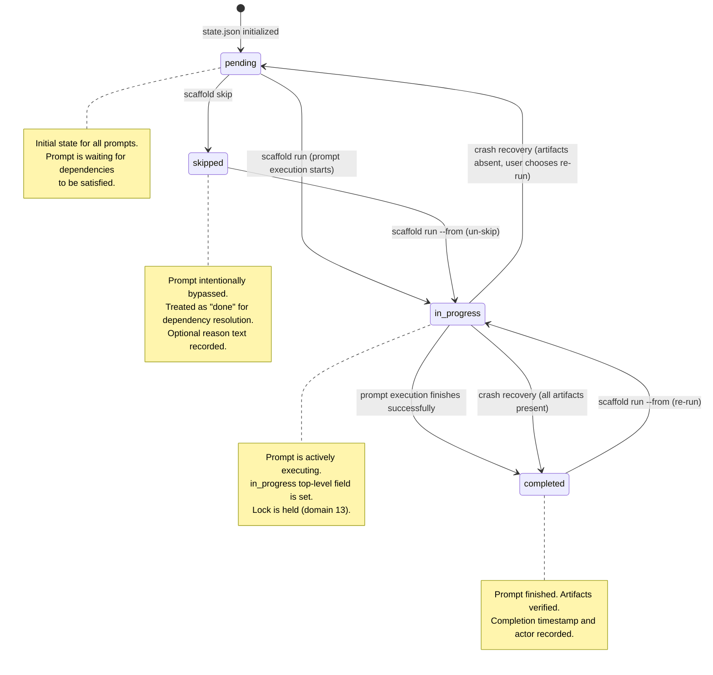
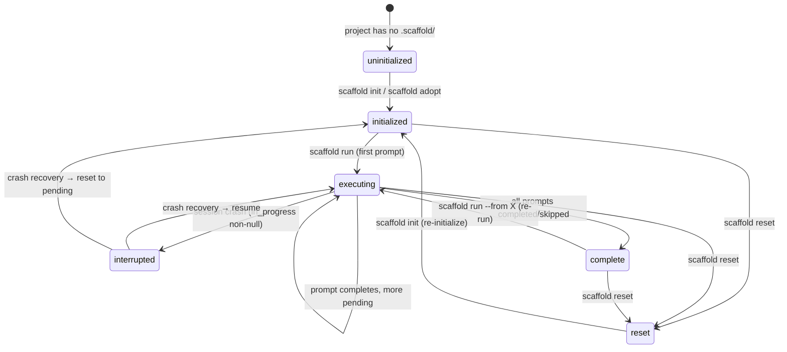

# Domain Model: Pipeline State Machine

**Domain ID**: 03
**Phase**: 1 — Deep Domain Modeling
**Depends on**: [02-dependency-resolution.md](02-dependency-resolution.md) (consumes the ordered prompt list to initialize state)
**Last updated**: 2026-03-12
**Status**: draft

---

## Section 1: Domain Overview

The Pipeline State Machine domain governs the runtime lifecycle of a scaffold pipeline execution. It centers on `.scaffold/state.json` — a file-based, git-committed state store that records which prompts have been completed, which were skipped, which are pending, and which (if any) was interrupted mid-execution. The domain defines the schema of this file, the valid state transitions for individual prompts (pending → in_progress → completed/skipped), the dual completion detection mechanism (artifact existence + state record), crash recovery semantics, multi-user merge behavior, and the initialization strategies for greenfield, brownfield, and v1 migration scenarios.

**Role in the v2 architecture**: The pipeline state machine sits between dependency resolution ([domain 02](02-dependency-resolution.md)) and pipeline execution locking ([domain 13](13-pipeline-locking.md)). Domain 02 produces a `DependencyResult` containing the topologically sorted prompt list and dependency graph. This domain initializes `state.json` from that ordered list, then manages prompt status transitions as the user progresses through the pipeline. Every CLI command that reads or mutates pipeline progress (`scaffold run`, `scaffold status`, `scaffold next`, `scaffold skip`, `scaffold reset`, `scaffold dashboard`) operates on the state machine. The decision log ([domain 11](11-decision-log.md)) is written as a side effect of prompt completion. Platform adapters ([domain 05](05-platform-adapters.md)) and the CLAUDE.md management system ([domain 10](10-claude-md-management.md)) are downstream consumers of completion status.

**Central design challenge**: Reconciling two independent sources of truth — the state file and the filesystem artifacts. A prompt may succeed (artifacts written) but the state file may not be updated (session crash). Conversely, state may record completion but artifacts may be deleted. The dual detection mechanism must handle every combination gracefully, favoring artifact presence as the primary signal while using state records for metadata (timestamps, actor identity, skip reasons).

---

## Section 2: Glossary

**state.json** — The JSON file at `.scaffold/state.json` that records pipeline execution progress. Committed to git for team sharing.

**prompt status** — One of four values (`pending`, `in_progress`, `skipped`, `completed`) describing where a prompt is in its lifecycle.

**in_progress field** — The top-level nullable field in state.json that tracks the currently executing prompt, its start time, and partial artifacts. Enables crash detection on resume.

**dual completion detection** — The two-mechanism system for determining whether a prompt has been completed: artifact-based (primary) and state-recorded (secondary).

**artifact-based detection** — Checking whether all files listed in a prompt's `produces` field exist on disk. File existence implies the prompt ran successfully.

**state-recorded detection** — Checking the `status` field in state.json. Updated by `scaffold run` after a prompt finishes.

**crash recovery** — The process of detecting and handling an interrupted session. Triggered when `in_progress` is non-null on resume.

**init mode** — One of `greenfield`, `brownfield`, or `v1-migration`, recorded in state.json to indicate how the pipeline was initialized.

**session bootstrap summary** — The structured context block output by `scaffold run` before executing a prompt, giving the agent pipeline state, context files, recent decisions, and crash recovery info.

**atomic write** — Writing state.json to a temporary file first, then renaming it into place. Prevents corruption from partial writes during crashes.

**map-keyed structure** — The design of state.json where prompts are stored as a map keyed by prompt slug rather than an array. Enables conflict-free git merges when two users update different prompt entries.

**eligible prompt** — A prompt whose status is `pending` and whose dependencies are all `completed` or `skipped`. Computed by combining domain 02's dependency graph with current state.

**superseded completion** — When `scaffold run --from X` re-runs a previously completed prompt, the old completion data is overwritten with new data.

**partial artifact** — A file listed in a prompt's `produces` that exists on disk but may be incomplete (e.g., truncated due to a crash).

**next_eligible** — The computed list of prompt slugs that are ready to run, stored in state.json for convenience.

**extra-prompts** — User-added custom prompts that are not part of the resolved methodology manifest.

---

## Section 3: Entity Model

```typescript
/**
 * Top-level state.json schema.
 * This file is committed to git and shared across team members.
 * Written atomically (temp file + rename) to prevent corruption.
 *
 * Invariants:
 * - Every prompt in the resolved pipeline appears as a key in `prompts`
 * - At most one prompt can be `in_progress` at any time (enforced by the `in_progress` field)
 * - `schema-version` must match the CLI's expected version
 * - `next_eligible` is a derived/cached field, recomputed on every state mutation
 */
interface PipelineState {
  /**
   * Schema version for forward/backward compatibility.
   * CLI refuses to operate if this doesn't match its expected version.
   * Currently: 1
   */
  "schema-version": number;

  /**
   * Version of scaffold CLI that created this state file.
   * Informational — used for debugging, not for gating.
   */
  "scaffold-version": string;

  /**
   * The methodology used for this pipeline (e.g., "deep", "mvp").
   * Copied from config.yml at initialization time.
   * Immutable after creation — changing methodology requires `scaffold reset`.
   */
  methodology: string;

  /**
   * How the state file was initialized.
   * - "greenfield": fresh project, all prompts start as pending
   * - "brownfield": existing codebase, some prompts pre-completed via artifact scan
   * - "v1-migration": v1 project detected, completed prompts inferred from v1 artifacts
   */
  "init-mode": InitMode;

  /**
   * ISO 8601 timestamp when state.json was first created.
   */
  created: string;

  /**
   * Tracks the currently executing prompt, if any.
   * null when no prompt is in progress.
   * Non-null indicates either active execution or a crashed session.
   */
  in_progress: InProgressRecord | null;

  /**
   * Map of prompt slug -> prompt state entry.
   * Every prompt in the resolved pipeline has an entry.
   * Map-keyed structure enables conflict-free git merges.
   */
  prompts: Record<string, PromptStateEntry>;

  /**
   * Cached list of prompt slugs eligible to run next.
   * Recomputed on every state mutation by combining the dependency
   * graph with current prompt statuses.
   * Convenience field — can always be recomputed from `prompts` + dependency graph.
   */
  next_eligible: string[];

  /**
   * User-added custom prompts not part of the resolved methodology manifest.
   * These are appended after the manifest prompts and may have
   * dependencies on manifest prompts.
   */
  "extra-prompts": ExtraPromptEntry[];
}

/**
 * How the pipeline was initialized.
 */
type InitMode = "greenfield" | "brownfield" | "v1-migration";

/**
 * Records the currently executing prompt for crash detection.
 * Present only while a prompt is actively running.
 *
 * Invariants:
 * - If non-null, exactly one prompt in `prompts` has status "in_progress"
 * - The `prompt` field must match the slug of that prompt
 */
interface InProgressRecord {
  /** Slug of the prompt currently executing */
  prompt: string;

  /** ISO 8601 timestamp when execution started */
  started: string;

  /**
   * Artifacts from the `produces` list that have been detected on disk
   * during the current execution. Updated periodically during long-running
   * prompts to track partial progress.
   * Empty array at the start of execution.
   */
  partial_artifacts: string[];

  /**
   * Identity of the user/agent running this prompt.
   * Used for attribution and lock coordination.
   */
  actor: string;
}

/**
 * State entry for a single prompt in the pipeline.
 * The specific fields present depend on the prompt's current status.
 */
interface PromptStateEntry {
  /**
   * Current lifecycle status of this prompt.
   * See state transition diagram in Section 4.
   */
  status: PromptStatus;

  /**
   * Resolution source — where this prompt came from.
   * - "base": from base prompt directory
   * - "override": from methodology override
   * - "ext": from methodology extension
   */
  source: PromptSource;

  /**
   * ISO 8601 timestamp. Meaning varies by status:
   * - pending: undefined (not yet acted on)
   * - in_progress: when execution started
   * - completed: when completion was recorded
   * - skipped: when the skip was recorded
   */
  at?: string;

  /**
   * Expected output file paths, copied from prompt frontmatter.
   * Present for all statuses so agents can verify artifacts
   * without loading prompt files.
   */
  produces?: string[];

  /**
   * Whether all `produces` artifacts have been verified to exist on disk.
   * Set to true after artifact verification succeeds.
   * Only meaningful when status is "completed".
   */
  artifacts_verified?: boolean;

  /**
   * Identity of the user/agent who completed or skipped this prompt.
   * Set when status transitions to "completed" or "skipped".
   */
  completed_by?: string;

  /**
   * Human-readable reason for skipping.
   * Only present when status is "skipped".
   */
  reason?: string;
}

/**
 * Valid prompt lifecycle statuses.
 */
type PromptStatus = "pending" | "in_progress" | "skipped" | "completed";

/**
 * Where a prompt was resolved from in the layered prompt system.
 */
type PromptSource = "base" | "override" | "ext";

/**
 * A user-added custom prompt not in the methodology manifest.
 */
interface ExtraPromptEntry {
  /** Unique slug for the custom prompt */
  slug: string;

  /** Path to the prompt file */
  path: string;

  /** Optional dependencies on manifest prompts or other extra prompts */
  "depends-on"?: string[];

  /** Phase number for display grouping */
  phase?: number;
}

/**
 * Result of the dual completion detection algorithm.
 * Returned when checking whether a prompt has been completed.
 */
interface CompletionDetectionResult {
  /**
   * The overall determination of whether the prompt is complete.
   */
  status: "confirmed_complete" | "likely_complete" | "incomplete" | "conflict";

  /** Whether all `produces` artifacts exist on disk */
  artifacts_present: boolean;

  /** Whether state.json records the prompt as completed */
  state_says_completed: boolean;

  /**
   * When status is "conflict", describes the nature of the disagreement.
   * - "artifacts_without_state": files exist but status != completed
   * - "state_without_artifacts": status == completed but files missing
   */
  conflict_type?: "artifacts_without_state" | "state_without_artifacts";

  /**
   * Per-artifact check results.
   * Only populated when artifacts_present is false (to identify which are missing).
   */
  artifact_details?: ArtifactCheckResult[];

  /** Recommended action for the CLI to take */
  recommended_action: CompletionAction;
}

/**
 * Result of checking a single artifact file.
 */
interface ArtifactCheckResult {
  /** Path to the artifact file */
  path: string;

  /** Whether the file exists on disk */
  exists: boolean;

  /**
   * File size in bytes if the file exists.
   * Used as a heuristic for truncation detection (not authoritative).
   */
  size_bytes?: number;
}

/**
 * Actions the CLI can take based on completion detection.
 */
type CompletionAction =
  | "none"                    // Already complete, no action needed
  | "mark_completed"         // Artifacts exist, update state to match
  | "warn_and_offer_rerun"   // State says complete but artifacts missing
  | "offer_rerun"            // In-progress prompt with partial artifacts
  | "clear_in_progress";     // In-progress prompt, all artifacts present

/**
 * Input to the state initialization algorithm.
 * Combines dependency resolution output with config and filesystem state.
 */
interface StateInitInput {
  /** Ordered prompt list from dependency resolution (domain 02) */
  ordered_prompts: OrderedPromptInfo[];

  /** The methodology from config.yml */
  methodology: string;

  /** Scaffold CLI version */
  scaffold_version: string;

  /** How to initialize (determined by scaffold init / scaffold adopt) */
  init_mode: InitMode;

  /**
   * Pre-completed prompts (for brownfield/v1-migration).
   * Map of slug -> artifact paths that were found on disk.
   */
  pre_completed?: Record<string, string[]>;
}

/**
 * Minimal prompt info needed for state initialization.
 * Subset of ResolvedPrompt (domain 01) + DependencyResult (domain 02).
 */
interface OrderedPromptInfo {
  /** Prompt slug (e.g., "create-prd") */
  slug: string;

  /** Resolution source */
  source: PromptSource;

  /** Expected output file paths */
  produces: string[];

  /** Phase number for display */
  phase: number;
}

/**
 * Result of a state mutation operation (complete, skip, reset, etc.).
 */
interface StateMutationResult {
  /** Whether the mutation succeeded */
  success: boolean;

  /** The updated state (if success) */
  state?: PipelineState;

  /** Error if the mutation failed */
  error?: StateError;

  /** Warnings generated during mutation */
  warnings: StateWarning[];

  /** Updated next_eligible list after the mutation */
  next_eligible: string[];
}

/**
 * Crash recovery analysis result.
 * Produced when `in_progress` is non-null on resume.
 */
interface CrashRecoveryAnalysis {
  /** Slug of the prompt that was interrupted */
  interrupted_prompt: string;

  /** When the interrupted session started */
  started_at: string;

  /** Who was running the interrupted prompt */
  actor: string;

  /** Completion detection result for the interrupted prompt */
  completion: CompletionDetectionResult;

  /**
   * The recommended recovery action:
   * - "mark_complete": All artifacts exist, just update state
   * - "rerun": Artifacts missing or incomplete, re-execute the prompt
   * - "ask_user": Ambiguous state, present options to the user
   */
  recommended_action: "mark_complete" | "rerun" | "ask_user";

  /** Human-readable explanation of the situation */
  explanation: string;
}

/**
 * Input for the `scaffold run --from X` operation.
 * Re-runs a specific prompt regardless of its current status.
 */
interface ResumeFromInput {
  /** Slug of the prompt to re-run */
  prompt: string;

  /** Actor identity for attribution */
  actor: string;

  /**
   * Whether to force re-run even if the prompt and its dependents
   * are all completed. Default: true (spec says old completion data
   * is overwritten).
   */
  force?: boolean;
}

/**
 * Metadata passed to state transition operations.
 * Provides actor identity, skip reasons, and other context
 * needed by the transition logic.
 */
interface TransitionMetadata {
  /** Identity of the user/agent performing the transition */
  actor: string;

  /** Reason for skipping (only used for pending → skipped transitions) */
  reason?: string;

  /** Whether artifacts have been verified post-completion */
  artifacts_verified?: boolean;

  /** Additional warnings to include in the mutation result */
  warnings?: StateWarning[];
}

/**
 * Merge scenario analysis result.
 * Used when two state.json versions need to be reconciled after a git merge.
 */
interface MergeAnalysis {
  /** Prompts completed only in the local version */
  local_only: string[];

  /** Prompts completed only in the remote version */
  remote_only: string[];

  /** Prompts completed in both (should have identical data) */
  both: string[];

  /**
   * True if the merge is conflict-free (different prompts updated).
   * False if the same prompt was updated in both versions.
   */
  conflict_free: boolean;

  /** Prompt slugs with conflicting updates (if any) */
  conflicts: string[];
}
```

**Entity relationships:**

```
PipelineState
├── contains 1 ── InProgressRecord (nullable)
├── contains N ── PromptStateEntry (map-keyed by slug)
├── contains N ── ExtraPromptEntry (array)
└── has derived ── next_eligible (string[])

StateInitInput
├── references N ── OrderedPromptInfo (from domain 02)
└── produces 1 ── PipelineState

CompletionDetectionResult
├── contains N ── ArtifactCheckResult
└── determines 1 ── CompletionAction

CrashRecoveryAnalysis
├── contains 1 ── CompletionDetectionResult
└── references 1 ── InProgressRecord

StateMutationResult
├── contains 1? ── PipelineState (updated)
├── contains 1? ── StateError
└── contains N ── StateWarning
```

---

## Section 4: State Transitions

### Prompt Status Lifecycle



### Transition Details

| Transition | Trigger | Guard Conditions | Side Effects |
|-----------|---------|-----------------|-------------|
| pending → in_progress | `scaffold run` begins executing this prompt | All dependencies completed/skipped; lock acquired (domain 13); no other prompt in_progress | Set `in_progress` top-level field; update prompt `status` and `at`; write state atomically |
| pending → skipped | `scaffold skip <prompt>` | Prompt exists and is pending | Set status to `skipped`; record `at`, `completed_by`, optional `reason`; recompute `next_eligible` |
| in_progress → completed | Prompt execution finishes | Prompt was the current `in_progress` prompt | Verify artifacts; set `artifacts_verified`; record `at`, `completed_by`; clear `in_progress`; log decisions; recompute `next_eligible`; release lock |
| in_progress → pending | Crash recovery: artifacts absent | `in_progress` non-null; artifacts check fails; user confirms re-run | Clear `in_progress`; reset prompt status to `pending`; recompute `next_eligible` |
| in_progress → completed | Crash recovery: artifacts present | `in_progress` non-null; all `produces` artifacts exist | Mark completed; set `artifacts_verified: true`; clear `in_progress`; recompute `next_eligible` |
| skipped → in_progress | `scaffold run --from <prompt>` | Prompt was previously skipped | Clear `reason`; set `in_progress` field; update status; begin execution |
| completed → in_progress | `scaffold run --from <prompt>` | Prompt was previously completed | Overwrite previous completion data; set `in_progress` field; begin execution |

### Invalid Transitions

| Transition | Why Invalid |
|-----------|-------------|
| pending → completed | A prompt cannot be completed without going through in_progress. The state machine requires execution (even if brief) to record actor identity and verify artifacts. |
| completed → pending | Reverting a completed prompt to pending has no use case. Use `scaffold run --from X` to re-run (goes through in_progress). Use `scaffold reset` to reset everything. |
| completed → skipped | A completed prompt cannot be retroactively skipped. This would break downstream prompts that consumed its artifacts. |
| skipped → completed | A skipped prompt cannot be marked completed without execution. Use `scaffold run --from X` to execute it. |
| skipped → pending | While conceptually valid, skipped prompts are un-skipped via `scaffold run --from X` which transitions through in_progress. There is no "revert to pending" command. |
| in_progress → skipped | Cannot skip a prompt that is actively executing. Complete or crash-recover first. |

### Pipeline-Level State Diagram



---

## Section 5: Core Algorithms

### Algorithm 1: Initialize State

Creates a fresh `state.json` from dependency resolution output.

**Input**: `StateInitInput`
**Output**: `PipelineState`
**Complexity**: O(n) where n is the number of prompts

```
FUNCTION initializeState(input: StateInitInput) -> PipelineState:
    state = {
        "schema-version": 1,
        "scaffold-version": input.scaffold_version,
        "methodology": input.methodology,
        "init-mode": input.init_mode,
        "created": NOW_ISO8601(),
        "in_progress": null,
        "prompts": {},
        "next_eligible": [],
        "extra-prompts": []
    }

    FOR EACH prompt IN input.ordered_prompts:
        entry = {
            "status": "pending",
            "source": prompt.source,
            "produces": prompt.produces
        }

        // For brownfield/v1-migration: pre-complete prompts with existing artifacts
        IF input.init_mode != "greenfield"
           AND prompt.slug IN input.pre_completed:
            existing_artifacts = input.pre_completed[prompt.slug]
            IF ALL paths in prompt.produces EXIST IN existing_artifacts:
                entry.status = "completed"
                entry.at = NOW_ISO8601()
                entry.artifacts_verified = true
                entry.completed_by = "scaffold-adopt"  // or "v1-migration"

        state.prompts[prompt.slug] = entry

    // Compute initial eligible list
    state.next_eligible = computeEligible(state, dependencyGraph)

    WRITE_ATOMIC(state, ".scaffold/state.json")
    RETURN state
```

**Edge cases**:
- Brownfield with partial artifacts (some but not all `produces` files exist): prompt remains `pending` — all artifacts must be present for pre-completion.
- v1-migration with extra prompts that don't exist in v2 manifest: ignored, only v2 prompts are initialized.

### Algorithm 2: Dual Completion Detection

Determines whether a prompt has been completed by checking both artifact existence and state records.

**Input**: `slug: string`, `state: PipelineState`, `produces: string[]`
**Output**: `CompletionDetectionResult`
**Complexity**: O(k) where k is the number of `produces` artifacts

```
FUNCTION detectCompletion(slug, state, produces) -> CompletionDetectionResult:
    entry = state.prompts[slug]
    state_says_completed = (entry.status == "completed")

    // Check all produces artifacts
    artifact_details = []
    all_present = true
    FOR EACH path IN produces:
        exists = FILE_EXISTS(path)
        size = IF exists THEN FILE_SIZE(path) ELSE undefined
        artifact_details.APPEND({ path, exists, size_bytes: size })
        IF NOT exists:
            all_present = false

    artifacts_present = all_present

    // Decision matrix
    IF artifacts_present AND state_says_completed:
        RETURN {
            status: "confirmed_complete",
            artifacts_present: true,
            state_says_completed: true,
            artifact_details: [],
            recommended_action: "none"
        }

    IF artifacts_present AND NOT state_says_completed:
        // Artifact takes precedence — prompt succeeded, state wasn't updated
        RETURN {
            status: "likely_complete",
            artifacts_present: true,
            state_says_completed: false,
            conflict_type: "artifacts_without_state",
            artifact_details: [],
            recommended_action: "mark_completed"
        }

    IF NOT artifacts_present AND state_says_completed:
        // State says done but files are gone — warn user
        RETURN {
            status: "conflict",
            artifacts_present: false,
            state_says_completed: true,
            conflict_type: "state_without_artifacts",
            artifact_details: artifact_details,
            recommended_action: "warn_and_offer_rerun"
        }

    // Neither present — definitely incomplete
    RETURN {
        status: "incomplete",
        artifacts_present: false,
        state_says_completed: false,
        artifact_details: artifact_details,
        recommended_action: "offer_rerun"
    }
```

**Edge cases**:
- Prompt with empty `produces` (no expected artifacts): artifact check is vacuously true. State is the only signal. This is valid for prompts that only modify existing files (e.g., review-prd updates `docs/plan.md` rather than creating it).
- Artifact exists but is zero bytes: detected by `size_bytes == 0` in artifact details. The algorithm does not reject zero-byte files — they count as "present." Zero-byte detection is deferred to `scaffold validate` (domain 09).

### Algorithm 3: Crash Recovery

Handles the case where `in_progress` is non-null when `scaffold run` starts.

**Input**: `state: PipelineState`
**Output**: `CrashRecoveryAnalysis`
**Complexity**: O(k) where k is the number of artifacts for the in-progress prompt

```
FUNCTION analyzeCrashRecovery(state) -> CrashRecoveryAnalysis:
    ip = state.in_progress
    IF ip IS null:
        ERROR "No crash to recover — in_progress is null"

    entry = state.prompts[ip.prompt]
    produces = entry.produces OR []

    // Run completion detection on the interrupted prompt
    completion = detectCompletion(ip.prompt, state, produces)

    IF completion.artifacts_present:
        // All artifacts exist — prompt completed but state wasn't updated
        RETURN {
            interrupted_prompt: ip.prompt,
            started_at: ip.started,
            actor: ip.actor,
            completion: completion,
            recommended_action: "mark_complete",
            explanation: "Previous session crashed during '{ip.prompt}' but all " +
                         "expected artifacts exist. Safe to mark as completed."
        }

    // Check if some (but not all) artifacts are present
    present_count = COUNT(a IN completion.artifact_details WHERE a.exists)
    total_count = LEN(produces)

    IF present_count > 0 AND present_count < total_count:
        // Partial artifacts — ambiguous. Artifacts may be incomplete.
        missing = [a.path FOR a IN completion.artifact_details WHERE NOT a.exists]
        RETURN {
            interrupted_prompt: ip.prompt,
            started_at: ip.started,
            actor: ip.actor,
            completion: completion,
            recommended_action: "ask_user",
            explanation: "Previous session crashed during '{ip.prompt}'. " +
                         "{present_count}/{total_count} artifacts found. " +
                         "Missing: {missing}. " +
                         "Existing artifacts may be incomplete."
        }

    // No artifacts at all — clearly needs re-run
    RETURN {
        interrupted_prompt: ip.prompt,
        started_at: ip.started,
        actor: ip.actor,
        completion: completion,
        recommended_action: "rerun",
        explanation: "Previous session crashed during '{ip.prompt}' " +
                     "before any artifacts were produced. Re-run recommended."
    }
```

### Algorithm 4: Transition Prompt Status

Performs a validated state transition and persists the result.

**Input**: `slug: string`, `target_status: PromptStatus`, `state: PipelineState`, `metadata: TransitionMetadata`
**Output**: `StateMutationResult`
**Complexity**: O(n) for next_eligible recomputation, O(1) for the transition itself

```
FUNCTION transitionPrompt(slug, target_status, state, metadata) -> StateMutationResult:
    entry = state.prompts[slug]
    IF entry IS undefined:
        RETURN error(PSM_PROMPT_NOT_FOUND, slug)

    current = entry.status
    warnings = []

    // Validate transition
    IF NOT isValidTransition(current, target_status):
        RETURN error(PSM_INVALID_TRANSITION, "{current} → {target_status} for {slug}")

    // Apply transition-specific logic
    SWITCH target_status:
        CASE "in_progress":
            // Guard: check dependencies are satisfied
            IF NOT allDependenciesSatisfied(slug, state, depGraph):
                RETURN error(PSM_DEPENDENCIES_UNSATISFIED, slug)
            // Guard: no other prompt in progress
            IF state.in_progress IS NOT null:
                RETURN error(PSM_ALREADY_IN_PROGRESS, state.in_progress.prompt)

            entry.status = "in_progress"
            entry.at = NOW_ISO8601()
            state.in_progress = {
                prompt: slug,
                started: entry.at,
                partial_artifacts: [],
                actor: metadata.actor
            }

        CASE "completed":
            entry.status = "completed"
            entry.at = NOW_ISO8601()
            entry.completed_by = metadata.actor
            entry.artifacts_verified = metadata.artifacts_verified OR false
            state.in_progress = null  // Clear in-progress

        CASE "skipped":
            entry.status = "skipped"
            entry.at = NOW_ISO8601()
            entry.completed_by = metadata.actor
            entry.reason = metadata.reason
            // Check if skipping breaks downstream eligibility
            dependents = getDependents(slug, depGraph)
            IF LEN(dependents) > 0:
                warnings.APPEND({
                    code: "PSM_SKIP_HAS_DEPENDENTS",
                    message: "Skipping {slug} may affect: {dependents}"
                })

        CASE "pending":
            // Only valid from crash recovery (in_progress → pending)
            entry.status = "pending"
            DELETE entry.at
            DELETE entry.completed_by
            DELETE entry.artifacts_verified
            DELETE entry.reason
            state.in_progress = null

    // Recompute eligible prompts
    state.next_eligible = computeEligible(state, depGraph)

    // Persist
    WRITE_ATOMIC(state, ".scaffold/state.json")

    RETURN {
        success: true,
        state: state,
        warnings: warnings,
        next_eligible: state.next_eligible
    }
```

### Algorithm 5: Compute Eligible Prompts

Determines which prompts are ready to execute based on current state and dependency graph.

**Input**: `state: PipelineState`, `depGraph: DependencyGraph` (from domain 02)
**Output**: `string[]` — list of eligible prompt slugs
**Complexity**: O(n * d) where n is prompt count and d is max dependency count per prompt

```
FUNCTION computeEligible(state, depGraph) -> string[]:
    eligible = []
    FOR EACH [slug, entry] IN state.prompts:
        IF entry.status != "pending":
            CONTINUE  // Only pending prompts can be eligible

        deps = depGraph.getDependencies(slug)
        all_satisfied = true
        FOR EACH dep IN deps:
            dep_entry = state.prompts[dep]
            IF dep_entry IS undefined:
                all_satisfied = false
                BREAK
            IF dep_entry.status NOT IN ["completed", "skipped"]:
                all_satisfied = false
                BREAK

        IF all_satisfied:
            eligible.APPEND(slug)

    // Sort by manifest phase order for deterministic output
    eligible.SORT_BY(slug => depGraph.getPhase(slug))

    RETURN eligible
```

### Algorithm 6: Resume From Specific Prompt

Handles `scaffold run --from X` which re-runs a previously completed or skipped prompt.

**Input**: `input: ResumeFromInput`, `state: PipelineState`
**Output**: `StateMutationResult`
**Complexity**: O(n) for next_eligible recomputation

```
FUNCTION resumeFrom(input, state) -> StateMutationResult:
    slug = input.prompt
    entry = state.prompts[slug]

    IF entry IS undefined:
        RETURN error(PSM_PROMPT_NOT_FOUND, slug)

    IF entry.status == "pending":
        // Nothing to undo — just proceed to execute
        RETURN transitionPrompt(slug, "in_progress", state, { actor: input.actor })

    IF entry.status == "in_progress":
        RETURN error(PSM_ALREADY_IN_PROGRESS, slug)

    // Status is "completed" or "skipped"
    // Overwrite previous completion/skip data
    // Note: we do NOT reset downstream prompts — their artifacts remain valid
    // unless the user explicitly re-runs them too

    warnings = []
    IF entry.status == "completed":
        warnings.APPEND({
            code: "PSM_OVERWRITING_COMPLETION",
            message: "Re-running '{slug}' will overwrite previous completion " +
                     "(completed by {entry.completed_by} at {entry.at})"
        })

    // Transition to in_progress
    RETURN transitionPrompt(slug, "in_progress", state, {
        actor: input.actor,
        warnings: warnings
    })
```

### Algorithm 7: State Regeneration from Artifacts

Fallback when state.json is corrupted — rebuilds state from filesystem artifacts.

**Input**: `ordered_prompts: OrderedPromptInfo[]`, `methodology: string`
**Output**: `PipelineState`
**Complexity**: O(n * k) where n is prompt count and k is max artifacts per prompt

```
FUNCTION regenerateStateFromArtifacts(ordered_prompts, methodology) -> PipelineState:
    state = initializeState({
        ordered_prompts: ordered_prompts,
        methodology: methodology,
        scaffold_version: CLI_VERSION,
        init_mode: "greenfield"  // Best guess; original init_mode is lost
    })

    FOR EACH prompt IN ordered_prompts:
        IF LEN(prompt.produces) == 0:
            CONTINUE  // Can't detect completion without produces

        all_exist = ALL(FILE_EXISTS(p) FOR p IN prompt.produces)
        IF all_exist:
            state.prompts[prompt.slug].status = "completed"
            state.prompts[prompt.slug].at = NOW_ISO8601()
            state.prompts[prompt.slug].artifacts_verified = true
            state.prompts[prompt.slug].completed_by = "state-recovery"

    state.next_eligible = computeEligible(state, depGraph)
    WRITE_ATOMIC(state, ".scaffold/state.json")

    LOG_WARNING("state.json was regenerated from artifacts. " +
                "Timestamps and actor information are approximate. " +
                "Prompts without 'produces' fields could not be detected.")

    RETURN state
```

---

## Section 6: Error Taxonomy

### Errors (Fatal — prevent the operation from completing)

| Code | Severity | Message Template | Recovery |
|------|----------|-----------------|----------|
| `PSM_STATE_NOT_FOUND` | error | `state.json not found at .scaffold/state.json. Run 'scaffold init' first.` | Run `scaffold init` to create the state file |
| `PSM_STATE_CORRUPT` | error | `state.json is unreadable or contains invalid JSON. Attempting artifact-based recovery.` | CLI auto-falls back to Algorithm 7 (regenerate from artifacts). If that fails, run `scaffold reset` |
| `PSM_SCHEMA_VERSION_MISMATCH` | error | `state.json schema version {found} does not match CLI expectation {expected}. Run 'scaffold update' to get a compatible CLI version.` | Update scaffold CLI or run `scaffold reset` to regenerate |
| `PSM_PROMPT_NOT_FOUND` | error | `Prompt '{slug}' not found in state.json. Valid prompts: {list}` | Check spelling; use `scaffold status` to see valid prompt names |
| `PSM_INVALID_TRANSITION` | error | `Cannot transition '{slug}' from '{current}' to '{target}'. See 'scaffold status' for current state.` | Check prompt's current status before attempting transition |
| `PSM_DEPENDENCIES_UNSATISFIED` | error | `Cannot run '{slug}' — prerequisites not met: {blocking_slugs}` | Complete or skip the blocking prompts first |
| `PSM_ALREADY_IN_PROGRESS` | error | `Cannot start '{slug}' — prompt '{current}' is already in progress.` | Complete the current prompt first, or use crash recovery if the session died |
| `PSM_WRITE_FAILED` | error | `Failed to write state.json: {os_error}` | Check filesystem permissions and disk space |
| `PSM_METHODOLOGY_MISMATCH` | error | `state.json methodology '{state_method}' does not match config.yml methodology '{config_method}'. Run 'scaffold reset' to re-initialize.` | Run `scaffold reset` then `scaffold init` with the desired methodology |

### Warnings (Non-fatal — operation continues)

| Code | Severity | Message Template | Context |
|------|----------|-----------------|---------|
| `PSM_ARTIFACTS_WITHOUT_STATE` | warning | `Prompt '{slug}' has all expected artifacts but status is '{status}'. Marking as completed.` | Artifact takes precedence; auto-corrects state |
| `PSM_STATE_WITHOUT_ARTIFACTS` | warning | `Prompt '{slug}' is marked completed but {count} artifact(s) are missing: {paths}. Consider re-running with 'scaffold run --from {slug}'.` | Presents to user; does not auto-correct |
| `PSM_SKIP_HAS_DEPENDENTS` | warning | `Skipping '{slug}' may affect dependent prompts: {dependents}. They will still be eligible to run.` | Informational; skipped prompts satisfy dependencies |
| `PSM_OVERWRITING_COMPLETION` | warning | `Re-running '{slug}' will overwrite previous completion (completed by {actor} at {timestamp}).` | Confirmation prompt in interactive mode |
| `PSM_CRASH_DETECTED` | warning | `Previous session crashed during '{slug}' (started {timestamp}).` | Followed by crash recovery analysis |
| `PSM_STATE_REGENERATED` | warning | `state.json was regenerated from filesystem artifacts. Timestamps and actor attribution are approximate.` | After state corruption recovery |
| `PSM_ZERO_BYTE_ARTIFACT` | warning | `Artifact '{path}' exists but is zero bytes. It may be corrupt or incomplete.` | Detected during artifact verification |
| `PSM_NEXT_ELIGIBLE_EMPTY` | warning | `No prompts are currently eligible to run. All remaining prompts have unsatisfied dependencies.` | Possible if all eligible prompts are skipped and remaining ones depend on skipped prompts |

### Error Object Structure

```typescript
interface StateError {
  /** Machine-readable error code from the table above */
  code: string;

  /** Human-readable error message */
  message: string;

  /** The prompt slug involved (if applicable) */
  slug?: string;

  /** Additional context fields */
  details?: Record<string, unknown>;

  /** Recovery guidance for the user */
  recovery: string;

  /** Exit code for CLI (from domain 09) */
  exit_code: number;  // 3 for state corruption, 2 for missing deps, 1 for validation
}

interface StateWarning {
  /** Machine-readable warning code */
  code: string;

  /** Human-readable warning message */
  message: string;

  /** The prompt slug involved (if applicable) */
  slug?: string;
}
```

---

## Section 7: Integration Points

### Domain 02 — Dependency Resolution & Pipeline Ordering

**Direction**: Domain 02 → Domain 03 (this domain consumes domain 02's output)
**Data flow**: `DependencyResult` (containing `sorted_order: string[]`, `phases: PromptPhaseInfo[]`, and the dependency graph) flows into state initialization
**Lifecycle stage**: Build time (during `scaffold init` and `scaffold build`)
**Contract**: This domain expects `DependencyResult.success == true` before initializing state. It uses `sorted_order` for prompt key ordering and `phases` for display grouping.
**Assumption**: The dependency graph is immutable after build. If config changes require re-resolving dependencies, `scaffold build` must be re-run and state re-initialized.

This domain also calls `computeEligible()` at runtime, which requires the dependency graph. The graph is loaded from the built prompt manifests, not re-resolved.

### Domain 05 — Platform Adapter System

**Direction**: Domain 03 → Domain 05 (adapters consume state)
**Data flow**: `PipelineState` is read by platform adapters to generate completion-aware output (e.g., dashboard shows progress)
**Lifecycle stage**: Runtime (during `scaffold dashboard`, `scaffold status`)
**Contract**: Adapters read `state.prompts` entries and `next_eligible`. They do not mutate state.
**Assumption**: Adapters treat state as read-only. Only CLI commands mutate state.

### Domain 09 — CLI Command Architecture

**Direction**: Bidirectional
**Data flow**: CLI commands (`run`, `status`, `next`, `skip`, `reset`) call state machine algorithms. State machine returns `StateMutationResult` which CLI formats for output.
**Lifecycle stage**: Runtime
**Contract**: CLI passes `TransitionMetadata` (actor, reason, etc.) to state transitions. State machine returns structured results including warnings and updated eligible list. Exit codes are defined in domain 09 and referenced here.
**Assumption**: CLI ensures locking (domain 13) before calling mutation functions.

### Domain 11 — Decision Log

**Direction**: Domain 03 → Domain 11 (state completion triggers decision logging)
**Data flow**: When a prompt transitions to `completed`, the CLI may append 1-3 decisions to `.scaffold/decisions.jsonl`
**Lifecycle stage**: Runtime (after prompt completion)
**Contract**: Decision log receives the prompt slug, actor identity, and `prompt_completed: true`. Decisions from crashed sessions have `prompt_completed: false`.
**Assumption**: Decision log is append-only. State machine does not read decisions — it only triggers writes.

### Domain 13 — Pipeline Execution Locking

**Direction**: Domain 13 gates Domain 03 mutations
**Data flow**: Lock must be acquired before state transitions that start prompt execution. Lock is released after completion or crash recovery.
**Lifecycle stage**: Runtime
**Contract**: Lock provides `acquireLock(actor, prompt) -> boolean` and `releaseLock()`. State machine calls `acquireLock` before `pending → in_progress` transitions.
**Assumption**: The lock is local-only (gitignored). Cross-machine coordination relies on git merge behavior of state.json. If `in_progress` is non-null but `lock.json` doesn't exist (different machine), the state machine still performs crash recovery — the lock is advisory, not authoritative.

### Domain 08 — Prompt Frontmatter

**Direction**: Domain 08 → Domain 03
**Data flow**: The `produces` field from prompt frontmatter is copied into `PromptStateEntry.produces` at initialization time
**Lifecycle stage**: Build/init time
**Contract**: Each prompt's `produces` field is an array of file paths. Empty or missing `produces` means the prompt has no artifact-based completion signal.
**Assumption**: `produces` paths are relative to the project root. The state machine checks for file existence at these paths without any transformation.

### Domain 10 — CLAUDE.md Management

**Direction**: Domain 03 → Domain 10
**Data flow**: Prompt completion status tells the CLAUDE.md management system which sections should be filled
**Lifecycle stage**: Runtime (during prompt execution)
**Contract**: When a prompt completes, the CLAUDE.md manager checks whether that prompt owns any CLAUDE.md sections and fills them
**Assumption**: CLAUDE.md section filling is a side effect of prompt execution, not a state machine responsibility. The state machine only records completion.

### Domain 16 — Methodology & Depth Resolution

**Direction**: Domain 16 → Domain 03 (this domain records depth from domain 16)
**Data flow**: When a step completes, the depth level resolved by domain 16 is recorded in `PromptStateEntry.depth`. This enables methodology change detection — domain 16 compares the recorded depth against the current config to identify steps completed at a different depth than currently configured. Domain 16 emits `COMPLETED_AT_LOWER_DEPTH` warnings when a step was completed at a lower depth than the current methodology specifies.
**Lifecycle stage**: Runtime (during step completion and methodology change detection)
**Contract**: `PromptStateEntry.depth` is a `DepthLevel` (integer 1-5), set once at completion time and not modified afterward. If a step is re-run at a different depth, the depth field is overwritten with the new value.
**Assumption**: Depth is informational in state — it records what happened, not what should happen. The authoritative depth for future runs comes from domain 16's resolution, not from state.

---

## Section 8: Edge Cases & Failure Modes

### MQ1: Complete State Transition Diagram

The complete state transition diagram for a single prompt's status is provided in Section 4. The diagram shows all four states (pending, in_progress, completed, skipped), all valid transitions with their triggers and guards, and explicitly lists the six invalid transitions with explanations.

Key design points:
- **Single entry to execution**: Only `pending → in_progress` starts normal execution. `skipped → in_progress` and `completed → in_progress` both go through `scaffold run --from`, making re-runs explicit.
- **No direct completion**: `pending → completed` is invalid — every completion goes through `in_progress` to ensure execution tracking.
- **Crash recovery creates two exit paths from in_progress**: to `completed` (artifacts present) or back to `pending` (artifacts absent, user chooses re-run).

### MQ2: Dual Completion Detection Decision Tree

The dual completion detection algorithm (Section 5, Algorithm 2) handles all four combinations of artifact presence and state record:

| Artifacts Present | State Says Completed | Result | Action |
|:-:|:-:|---|---|
| Yes | Yes | `confirmed_complete` | No action needed — both agree |
| Yes | No | `likely_complete` | Auto-mark as completed (artifact takes precedence) |
| No | Yes | `conflict` | Warn user; offer to re-run the prompt |
| No | No | `incomplete` | Prompt needs to be run |

**"Artifact takes precedence" rationale**: If the agent wrote the artifacts and then the session crashed before updating state.json, re-running the prompt would waste time and potentially overwrite correct output. The artifact is the actual deliverable; state.json is bookkeeping.

**"State says complete but artifacts missing" rationale**: This is a more dangerous state — the user or another process may have deleted the artifacts. Simply auto-completing would leave the pipeline in a broken state where downstream prompts expect inputs that don't exist. Requiring user confirmation prevents silent failures.

### MQ3: Artifact Validity Assessment

The spec states "artifact takes precedence" but does not define content validation beyond file existence. The state machine uses a pragmatic approach:

**Primary check: File existence.** If a file listed in `produces` exists at its expected path, the artifact is considered present. This is the only check that completion detection performs.

**Heuristic: Zero-byte detection.** If a file exists but is 0 bytes, the state machine still counts it as "present" for the artifact check (to maintain simple, deterministic logic) but emits a `PSM_ZERO_BYTE_ARTIFACT` warning. This flags likely-corrupt artifacts without blocking progress.

**Content validation is deferred to `scaffold validate` (domain 09).** The validate command checks:
- Required sections exist (via `artifact-schema.required-sections`)
- ID format matches (via `artifact-schema.id-format`)
- Index tables are present (via `artifact-schema.index-table`)
- Tracking comments are well-formed

**Rationale for not validating content during completion detection**: Content validation requires loading and parsing each artifact, understanding its expected schema, and making subjective judgments about completeness. This is expensive and fragile. The state machine's job is lifecycle tracking, not quality assurance. Separating these concerns keeps the state machine fast and predictable.

**Truncation detection**: There is no reliable way to detect truncation automatically. A markdown file that is 500 bytes might be a legitimate short document or a truncated 5000-byte document. The zero-byte heuristic catches the most extreme case (crash before any content was written). For partial content, the user must manually inspect or rely on `scaffold validate`.

### MQ4: Crash Recovery Flow

Detailed crash recovery flow (Algorithm 3 in Section 5):

```
1. scaffold run starts
2. Load state.json
3. Check: state.in_progress is non-null?
   ├── No → Normal resume flow (find next eligible, execute)
   └── Yes → Crash recovery:
       4. Read in_progress record: { prompt, started, partial_artifacts, actor }
       5. Run dual completion detection on the in_progress prompt
       6. Check artifact presence:
          ├── All artifacts present:
          │   → Recommend: "mark_complete"
          │   → Display: "Previous session completed {prompt} but crashed before
          │                updating state. All artifacts verified."
          │   → Action: Mark completed, clear in_progress, continue
          │
          ├── Some artifacts present:
          │   → Recommend: "ask_user"
          │   → Display: "Previous session crashed during {prompt}.
          │                {N}/{M} artifacts found. Missing: {list}.
          │                Existing artifacts may be incomplete."
          │   → Action: Present options:
          │     a) Re-run {prompt} from scratch
          │     b) Mark as completed anyway (user inspected artifacts)
          │     c) Skip {prompt} and continue
          │
          └── No artifacts present:
              → Recommend: "rerun"
              → Display: "Previous session crashed during {prompt} before
                          producing any artifacts. Re-run recommended."
              → Action: Clear in_progress, re-execute prompt
```

**Lock interaction during crash recovery**: When crash recovery runs, there may or may not be a stale lock file:
- If `lock.json` exists and the PID is dead → clear stale lock, proceed with recovery
- If `lock.json` doesn't exist (different machine) → proceed with recovery directly
- If `lock.json` exists and PID is alive → another session is running. Warn and exit. This is the rare case where two agents try to resume the same crashed session.

### MQ5: Concurrent State.json Merge Scenario

**Setup**: Two team members (Alice and Bob) work on the same project. Alice completes `coding-standards` while Bob completes `tdd` (both are eligible concurrently since they share the dependency `tech-stack`).

**state.json before (both start from this):**
```json
{
  "schema-version": 1,
  "scaffold-version": "2.0.0",
  "methodology": "deep",
  "init-mode": "greenfield",
  "created": "2026-03-12T10:00:00Z",
  "in_progress": null,
  "prompts": {
    "create-prd": { "status": "completed", "source": "base", "at": "...", "completed_by": "alice" },
    "tech-stack": { "status": "completed", "source": "base", "at": "...", "completed_by": "alice" },
    "coding-standards": { "status": "pending", "source": "base", "produces": ["docs/coding-standards.md"] },
    "tdd": { "status": "pending", "source": "base", "produces": ["docs/tdd-standards.md"] }
  },
  "next_eligible": ["coding-standards", "tdd"],
  "extra-prompts": []
}
```

**Alice's change (completes coding-standards):**
```diff
     "coding-standards": {
-      "status": "pending",
+      "status": "completed",
       "source": "base",
-      "produces": ["docs/coding-standards.md"]
+      "produces": ["docs/coding-standards.md"],
+      "at": "2026-03-12T11:00:00Z",
+      "artifacts_verified": true,
+      "completed_by": "alice"
     },
```

**Bob's change (completes tdd):**
```diff
     "tdd": {
-      "status": "pending",
+      "status": "completed",
       "source": "base",
-      "produces": ["docs/tdd-standards.md"]
+      "produces": ["docs/tdd-standards.md"],
+      "at": "2026-03-12T11:05:00Z",
+      "artifacts_verified": true,
+      "completed_by": "bob"
     }
```

**Why this merges cleanly**: Alice and Bob modified different keys in the `prompts` map. Git's merge algorithm handles this because the changes are in non-overlapping regions of the file. The map-keyed structure means each prompt's state is on distinct lines that don't interfere with each other.

**Potential conflict point**: The `next_eligible` field is a derived array that both would update. This is the only realistic merge conflict. **Resolution**: `next_eligible` is a cached convenience field that is recomputed on every state mutation. After merge, the first `scaffold run` or `scaffold status` recomputes it. If a git conflict occurs on this field, either version can be accepted — the CLI will fix it.

**If Alice and Bob completed the SAME prompt**: This is prevented by the locking mechanism (domain 13) on the same machine. Across machines, the lock is local-only, so it's theoretically possible. The merge would produce a conflict on the same prompt key. Resolution: accept the later completion (higher timestamp), or accept either since both produced the same artifacts.

### MQ6: Completed Status but Missing Artifacts

**Scenario**: `state.json` says `coding-standards` is `completed` with `artifacts_verified: true`, but `docs/coding-standards.md` has been deleted (by accident or intentionally).

**Exact interaction flow:**

```
$ scaffold run

=== Pipeline Status ===
Methodology: deep (5/18 complete, 0 skipped)
Last completed: tdd (2026-03-12T11:05:00Z)
Next eligible: project-structure

⚠ Warning: Prompt 'coding-standards' is marked completed but 1 artifact(s)
  are missing:
    - docs/coding-standards.md

  This prompt was completed by alice at 2026-03-12T11:00:00Z.

  Options:
    1. Re-run coding-standards to regenerate the artifact
    2. Continue without it (downstream prompts may fail)
    3. Cancel and investigate manually

  Choice [1]:
```

**State changes if user chooses option 1:**
1. `coding-standards.status` → `in_progress`
2. `in_progress` field set to `{ prompt: "coding-standards", started: NOW, ... }`
3. After successful re-execution: `coding-standards.status` → `completed` with new timestamp
4. `artifacts_verified` set to `true` after verification
5. `next_eligible` recomputed

**State changes if user chooses option 2:**
- No state change. Pipeline continues from `next_eligible`. Downstream prompts that `reads` `docs/coding-standards.md` will get a file-not-found error when they try to load context.

**In `--auto` mode**: Option 1 is selected automatically — re-run the prompt.

### MQ7: `scaffold run --from X` on Completed Prompt

**Scenario**: `create-prd` was completed in a previous session. User runs `scaffold run --from create-prd` to re-do the PRD.

**State changes:**

1. **Before**: `create-prd.status == "completed"`, `create-prd.at == "2026-03-12T10:35:00Z"`, `create-prd.completed_by == "ken"`

2. **CLI emits warning**: `PSM_OVERWRITING_COMPLETION` — "Re-running 'create-prd' will overwrite previous completion (completed by ken at 2026-03-12T10:35:00Z)"

3. **Transition**: `create-prd.status` → `in_progress`

4. **During execution**: `state.in_progress` is set. Old completion data (`at`, `completed_by`, `artifacts_verified`) is overwritten when the prompt re-completes.

5. **After re-execution**: `create-prd.status` → `completed` with new timestamp and actor.

**Old completion data is NOT preserved.** The spec says "marks previous completion as superseded" — the new execution fully replaces the old record. The old timestamp and actor are lost from state.json. If auditability is important, the decision log (domain 11) retains decisions from both runs (they're append-only, not overwritten).

**Downstream prompts are NOT automatically re-run.** If `create-prd` was re-run because the PRD changed, downstream prompts (`tech-stack`, `coding-standards`, etc.) still show as `completed`. The user must explicitly re-run them with `scaffold run --from <downstream>` if they want to propagate changes. This is intentional — the user knows which downstream prompts are affected by their change.

### MQ8: In_progress vs Lock Interaction

**Scenario**: `in_progress` is non-null (previous crash on machine A) but `lock.json` doesn't exist (running on machine B, or lock was already cleaned up).

**Behavior**: The state machine and lock system are independent by design:

- **`in_progress` field**: Lives in `state.json` (committed to git). Indicates a prompt was started and not finished. Present across machines.
- **`lock.json`**: Lives in `.scaffold/lock.json` (gitignored). Prevents concurrent local execution. Machine-local only.

When `in_progress` is non-null but `lock.json` is absent:

1. `scaffold run` detects `in_progress` non-null → enters crash recovery flow (MQ4)
2. No lock check needed for crash recovery — the lock is advisory and machine-local
3. If recovery decides to re-run the prompt, it acquires a new lock before execution
4. If recovery marks as completed, no lock needed (state update only)

**When BOTH are present (same machine, PID dead)**:
1. `scaffold run` checks lock → finds stale PID → clears lock
2. Then detects `in_progress` non-null → enters crash recovery
3. Normal recovery flow proceeds

**When lock is live but `in_progress` is null**: This means a prompt is currently running in another terminal. The lock prevents starting a new prompt. `scaffold run` warns: "Pipeline is in use by {holder}."

**When lock is live AND `in_progress` is non-null from a DIFFERENT prompt**: This is a consistency violation. The lock holder is running prompt A, but `in_progress` says prompt B was interrupted. The lock takes precedence for the current session — don't interfere with the live session. After the live session finishes, crash recovery for prompt B can proceed.

### MQ9: Complete state.json TypeScript Interface

The complete `PipelineState` interface with all fields is defined in Section 3 (Entity Model). Key additions beyond what the spec explicitly mentions:

- `InProgressRecord.actor`: Added for attribution in crash recovery reports
- `InProgressRecord.partial_artifacts`: Tracks partial progress during long-running prompts
- `CompletionDetectionResult`: Formalized the dual detection as a structured type
- `CrashRecoveryAnalysis`: Formalized the crash recovery analysis output
- `StateMutationResult`: Structured return type for all state transitions
- `ArtifactCheckResult.size_bytes`: Zero-byte detection heuristic

### MQ10: State Initialization for Three Scenarios

#### Greenfield

Fresh project, no existing code. All prompts start as `pending`.

```json
{
  "schema-version": 1,
  "scaffold-version": "2.0.0",
  "methodology": "deep",
  "init-mode": "greenfield",
  "created": "2026-03-12T10:00:00Z",
  "in_progress": null,
  "prompts": {
    "create-prd": {
      "status": "pending",
      "source": "base",
      "produces": ["docs/plan.md"]
    },
    "review-prd": {
      "status": "pending",
      "source": "base",
      "produces": ["docs/reviews/pre-review-prd.md"]
    },
    "innovate-prd": {
      "status": "pending",
      "source": "base",
      "produces": ["docs/prd-innovation.md"]
    },
    "beads-setup": {
      "status": "pending",
      "source": "ext",
      "produces": [".beads/config.yaml", "CLAUDE.md", "tasks/lessons.md"]
    },
    "tech-stack": {
      "status": "pending",
      "source": "base",
      "produces": ["docs/tech-stack.md"]
    },
    "coding-standards": {
      "status": "pending",
      "source": "base",
      "produces": ["docs/coding-standards.md"]
    },
    "tdd": {
      "status": "pending",
      "source": "base",
      "produces": ["docs/tdd-standards.md"]
    },
    "project-structure": {
      "status": "pending",
      "source": "base",
      "produces": ["docs/project-structure.md"]
    },
    "dev-env-setup": {
      "status": "pending",
      "source": "base",
      "produces": ["docs/dev-setup.md", "Makefile"]
    },
    "design-system": {
      "status": "pending",
      "source": "base",
      "produces": ["docs/design-system.md"]
    },
    "git-workflow": {
      "status": "pending",
      "source": "base",
      "produces": ["docs/git-workflow.md", "scripts/setup-agent-worktree.sh"]
    },
    "user-stories": {
      "status": "pending",
      "source": "base",
      "produces": ["docs/user-stories.md"]
    },
    "user-stories-gaps": {
      "status": "pending",
      "source": "base",
      "produces": ["docs/user-stories.md"]
    },
    "claude-md-optimization": {
      "status": "pending",
      "source": "ext",
      "produces": ["CLAUDE.md"]
    },
    "workflow-audit": {
      "status": "pending",
      "source": "ext"
    },
    "implementation-plan": {
      "status": "pending",
      "source": "ext",
      "produces": ["docs/implementation-plan.md"]
    },
    "implementation-plan-review": {
      "status": "pending",
      "source": "ext"
    }
  },
  "next_eligible": ["create-prd"],
  "extra-prompts": []
}
```

#### Brownfield

Existing codebase with some artifacts already in place. `scaffold adopt` scanned the filesystem and found matching files.

```json
{
  "schema-version": 1,
  "scaffold-version": "2.0.0",
  "methodology": "deep",
  "init-mode": "brownfield",
  "created": "2026-03-12T10:00:00Z",
  "in_progress": null,
  "prompts": {
    "create-prd": {
      "status": "completed",
      "source": "base",
      "at": "2026-03-12T10:00:00Z",
      "produces": ["docs/plan.md"],
      "artifacts_verified": true,
      "completed_by": "scaffold-adopt"
    },
    "tech-stack": {
      "status": "completed",
      "source": "base",
      "at": "2026-03-12T10:00:00Z",
      "produces": ["docs/tech-stack.md"],
      "artifacts_verified": true,
      "completed_by": "scaffold-adopt"
    },
    "coding-standards": {
      "status": "pending",
      "source": "base",
      "produces": ["docs/coding-standards.md"]
    },
    "tdd": {
      "status": "pending",
      "source": "base",
      "produces": ["docs/tdd-standards.md"]
    },
    "project-structure": {
      "status": "completed",
      "source": "base",
      "at": "2026-03-12T10:00:00Z",
      "produces": ["docs/project-structure.md"],
      "artifacts_verified": true,
      "completed_by": "scaffold-adopt"
    }
  },
  "next_eligible": ["review-prd", "coding-standards", "tdd"],
  "extra-prompts": []
}
```

Note: `review-prd` depends on `create-prd` (completed via adopt). `coding-standards` and `tdd` depend on `tech-stack` (completed via adopt). All three are immediately eligible.

#### V1 Migration

Existing v1 project with `.beads/` and v1 docs but no `.scaffold/` directory. `scaffold init` detected the v1 artifacts.

```json
{
  "schema-version": 1,
  "scaffold-version": "2.0.0",
  "methodology": "deep",
  "init-mode": "v1-migration",
  "created": "2026-03-12T10:00:00Z",
  "in_progress": null,
  "prompts": {
    "create-prd": {
      "status": "completed",
      "source": "base",
      "at": "2026-03-12T10:00:00Z",
      "produces": ["docs/plan.md"],
      "artifacts_verified": true,
      "completed_by": "v1-migration"
    },
    "beads-setup": {
      "status": "completed",
      "source": "ext",
      "at": "2026-03-12T10:00:00Z",
      "produces": [".beads/config.yaml", "CLAUDE.md", "tasks/lessons.md"],
      "artifacts_verified": true,
      "completed_by": "v1-migration"
    },
    "tech-stack": {
      "status": "completed",
      "source": "base",
      "at": "2026-03-12T10:00:00Z",
      "produces": ["docs/tech-stack.md"],
      "artifacts_verified": true,
      "completed_by": "v1-migration"
    },
    "coding-standards": {
      "status": "completed",
      "source": "base",
      "at": "2026-03-12T10:00:00Z",
      "produces": ["docs/coding-standards.md"],
      "artifacts_verified": true,
      "completed_by": "v1-migration"
    },
    "tdd": {
      "status": "completed",
      "source": "base",
      "at": "2026-03-12T10:00:00Z",
      "produces": ["docs/tdd-standards.md"],
      "artifacts_verified": true,
      "completed_by": "v1-migration"
    },
    "project-structure": {
      "status": "completed",
      "source": "base",
      "at": "2026-03-12T10:00:00Z",
      "produces": ["docs/project-structure.md"],
      "artifacts_verified": true,
      "completed_by": "v1-migration"
    },
    "dev-env-setup": {
      "status": "completed",
      "source": "base",
      "at": "2026-03-12T10:00:00Z",
      "produces": ["docs/dev-setup.md", "Makefile"],
      "artifacts_verified": true,
      "completed_by": "v1-migration"
    },
    "git-workflow": {
      "status": "completed",
      "source": "base",
      "at": "2026-03-12T10:00:00Z",
      "produces": ["docs/git-workflow.md", "scripts/setup-agent-worktree.sh"],
      "artifacts_verified": true,
      "completed_by": "v1-migration"
    },
    "user-stories": {
      "status": "completed",
      "source": "base",
      "at": "2026-03-12T10:00:00Z",
      "produces": ["docs/user-stories.md"],
      "artifacts_verified": true,
      "completed_by": "v1-migration"
    },
    "claude-md-optimization": {
      "status": "pending",
      "source": "ext"
    },
    "workflow-audit": {
      "status": "pending",
      "source": "ext"
    },
    "implementation-plan": {
      "status": "pending",
      "source": "ext",
      "produces": ["docs/implementation-plan.md"]
    }
  },
  "next_eligible": ["claude-md-optimization"],
  "extra-prompts": []
}
```

Note: v1 migration detects existing artifacts via the `produces` field. Prompts like `claude-md-optimization` and `workflow-audit` may not have artifacts distinguishable from their predecessor prompts (both may touch `CLAUDE.md`), so they remain pending even though `CLAUDE.md` exists.

### Additional Edge Cases

#### EC-1: Prompt with No `produces` Field

Some prompts don't create new files — they modify existing ones (e.g., `review-prd` updates `docs/plan.md`, `workflow-audit` fixes issues across docs). These prompts have `produces` pointing to files that other prompts also produce.

**Handling**: For prompts where the `produces` list contains files also produced by earlier prompts, artifact-based detection is unreliable — the file exists because the earlier prompt created it, not because this prompt ran. State-recorded completion is the primary signal for these prompts.

**Category**: Handled by design — the dual detection mechanism naturally falls through to state-based detection when artifact presence is ambiguous.

#### EC-2: state.json Deleted While Pipeline is Partially Complete

User accidentally deletes `.scaffold/state.json` mid-pipeline.

**Handling**: Next `scaffold run` call fails with `PSM_STATE_NOT_FOUND`. User can either:
1. Run `scaffold init` to re-create (enters greenfield mode, losing progress tracking)
2. Run `scaffold adopt` to scan for artifacts and rebuild state (brownfield mode)
3. Recover from git: `git checkout -- .scaffold/state.json`

**Category**: Handled by explicit error. Git recovery is the recommended path since state.json is committed.

#### EC-3: User Edits state.json Manually

User manually sets a prompt's status to `completed` to skip ahead.

**Handling**: The state machine doesn't validate manual edits at mutation time (it's just a JSON file). But `scaffold validate` checks for:
- `completed` prompts with `artifacts_verified: false` or missing artifacts
- Prompts marked `completed` whose dependencies are still `pending`
- `in_progress` field inconsistent with prompt statuses

**Category**: Accepted limitation with documented workaround — `scaffold validate` catches inconsistencies after the fact.

#### EC-4: Concurrent Prompt Execution on Same Machine

User opens two terminals and tries to run `scaffold run` simultaneously.

**Handling**: The locking mechanism (domain 13) prevents this. The second terminal sees `lock.json` with a live PID and warns: "Pipeline is in use." The state machine's `PSM_ALREADY_IN_PROGRESS` error also prevents setting `in_progress` when it's already non-null.

**Category**: Handled by design (lock + state guard).

#### EC-5: `scaffold reset` While Prompt is In-Progress

User runs `scaffold reset` in one terminal while a prompt is executing in another.

**Handling**: `scaffold reset` checks for `lock.json`. If a live process holds the lock, reset refuses: "Cannot reset while pipeline is in use." If the lock is stale (dead PID), reset proceeds — deleting `state.json` and `decisions.jsonl`. The executing process will fail on its next state write (file not found) and should handle gracefully.

**Category**: Handled by explicit error (lock check) + graceful degradation (write failure during execution).

#### EC-6: Schema Version Upgrade

User updates scaffold CLI from v2.0 (schema-version 1) to v2.5 (schema-version 2). Existing `state.json` has schema-version 1.

**Handling**: CLI detects version mismatch and emits `PSM_SCHEMA_VERSION_MISMATCH`. The CLI should provide automatic migration if the change is backward-compatible (e.g., new optional fields). For breaking changes, `scaffold reset` is required.

**Category**: Handled by explicit error with migration path.

---

## Section 9: Testing Considerations

### Properties to Verify

1. **State transition validity**: No invalid transitions can occur (the six listed in Section 4 should all be rejected)
2. **Atomic write safety**: State file is never in a partially-written state (test with simulated crash during write)
3. **Crash recovery correctness**: Every combination of `in_progress` state + artifact presence produces the correct `CrashRecoveryAnalysis`
4. **Dual detection consistency**: All four cells of the artifact/state matrix produce the correct `CompletionDetectionResult`
5. **Eligible computation correctness**: Eligible prompts are exactly those whose dependencies are all completed/skipped
6. **next_eligible determinism**: Same state always produces the same eligible list (sorted by phase)
7. **Merge safety**: Two concurrent modifications to different prompt entries produce a conflict-free merge
8. **Idempotency**: Running the same state transition twice produces the same result (or rejects the second attempt)

### Highest-Value Test Cases (by risk)

1. **Crash recovery with all artifacts present** — Most common crash scenario; must auto-recover
2. **Crash recovery with partial artifacts** — Ambiguous case; must present options to user
3. **`run <step>` on completed step** — Must correctly overwrite completion data
4. **`skip` with downstream dependents** — Must warn but allow; skipped prompt satisfies dependencies
5. **State regeneration from corrupt state.json** — Must rebuild accurately from filesystem
6. **Concurrent state modification (mock merge)** — Must produce mergeable JSON
7. **Schema version mismatch** — Must reject with clear error, not silently corrupt
8. **Greenfield/brownfield/v1 initialization** — Must produce correct initial state for each scenario

### Test Doubles/Mocks Needed

- **Filesystem mock**: For artifact existence checks (`FILE_EXISTS`, `FILE_SIZE`). Tests should control which files "exist" without creating real files.
- **Clock mock**: For timestamp generation. Tests need deterministic `NOW_ISO8601()` output.
- **Dependency graph stub**: For `computeEligible`. Provide a fixed graph rather than resolving from manifests.
- **Lock service mock**: For testing lock interaction scenarios. Simulate stale locks, live locks, absent locks.

### Property-Based Testing Candidates

- **State transition closure**: For any valid state and any sequence of valid transitions, the resulting state is always valid (no invariant violations)
- **Eligible prompt monotonicity**: Completing or skipping a prompt never reduces the eligible set to a subset (it only grows or stays the same, except for the completed prompt itself being removed)
- **Merge commutativity**: If Alice completes prompt A and Bob completes prompt B (A ≠ B), the merge result is the same regardless of merge order

### Cross-Domain Integration Tests

| Scenario | Domains | What to verify |
|----------|---------|---------------|
| Full init → run → complete flow | 02, 03, 09, 13 | Dependencies resolve, state initializes, lock acquired, prompt completes, state updates, lock released |
| Crash recovery with lock cleanup | 03, 13 | Stale lock detected, cleared, crash recovery proceeds, new lock acquired for re-run |
| `scaffold validate` on inconsistent state | 03, 09 | Completed prompt with missing artifacts produces validation error with clear message |
| Brownfield adoption | 03, 08 | Existing artifacts detected via `produces` field, state pre-populated correctly |
| Decision log after completion | 03, 11 | Prompt completion triggers decision append with `prompt_completed: true` |

---

## Section 10: Open Questions & Recommendations

### Open Questions

**OQ1: Should `next_eligible` be in state.json at all?**

It's a derived field that must be recomputed on every mutation and is the most likely source of merge conflicts (it's a sorted array, not a map). Options:
- **Keep it**: Convenience for agents that read state.json without access to the dependency graph
- **Remove it**: Compute on demand in the CLI; agents call `scaffold next --format json` instead
- **Keep but mark as advisory**: Document that it may be stale and should not be relied upon after merges

**Recommendation**: Keep it for agent ergonomics but document that it's a cached convenience field. The CLI should always recompute it before using it, and `scaffold validate` should verify it matches the recomputed value.

**OQ2: How should prompts with shared `produces` be handled?**

Multiple prompts can list the same file in `produces` (e.g., `create-prd` produces `docs/plan.md` and `review-prd` also references it; `beads-setup` and `claude-md-optimization` both list `CLAUDE.md`). This makes artifact-based detection unreliable for the later prompt — the file exists because the earlier prompt created it.

Options:
- **Accept ambiguity**: State-recorded detection is primary for these prompts. Artifact-based is a bonus.
- **Add unique markers**: Each prompt could add a tracking comment (e.g., `<!-- scaffold:review-prd v1 ... -->`) that distinguishes whether the file was updated by a specific prompt.
- **Add a `modifies` vs `creates` distinction**: `creates` means the prompt produces a new file. `modifies` means it updates an existing one. Only `creates` is used for artifact detection.

**Recommendation**: Introduce a `creates` vs `modifies` distinction in frontmatter. `produces` becomes the union of both for display, but only `creates` entries trigger artifact-based detection. `modifies` entries are verified by tracking comment presence (domain 10).

**OQ3: What is the data model for `extra-prompts` at runtime?**

The spec mentions `extra-prompts` as an array but doesn't define how they integrate with the state machine. Questions:
- Do extra prompts get entries in the `prompts` map?
- Can they have dependencies on manifest prompts?
- Can manifest prompts depend on extra prompts?
- How are they ordered relative to manifest prompts?

**Recommendation**: Extra prompts should get entries in the `prompts` map (keyed by slug, same as manifest prompts). They can depend on manifest prompts. Manifest prompts cannot depend on extra prompts (one-way dependency). They are ordered after all manifest prompts that they don't depend on.

**OQ4: Should state.json support multiple `in_progress` prompts?**

The current design allows only one `in_progress` prompt at a time. But the dependency graph may have parallel-eligible prompts that could theoretically execute concurrently (e.g., `coding-standards` and `tdd` after `tech-stack` completes).

Multi-prompt concurrency would require:
- Changing `in_progress` from a single record to an array
- The lock system (domain 13) supporting multiple concurrent locks
- Merge-safe writes when two prompts complete near-simultaneously

**Recommendation**: Defer to a future version. The complexity of concurrent prompt execution within a single session is high and the benefit is low — prompts are run by AI agents that work sequentially. Cross-machine concurrency is already handled by git merges on the map-keyed structure.

### Recommendations

**R1: Add a `state-version` counter.** Increment a monotonic counter on every state mutation. This enables optimistic concurrency control: before writing, check that the counter hasn't changed since you read. If it has, another process mutated state — re-read and retry.

**R2: Add `last_modified` top-level field.** Record the ISO 8601 timestamp of the most recent mutation for quick staleness checks.

**R3: Consider a `history` field for completed prompts.** When `scaffold run --from X` re-runs a completed prompt, the old completion data is lost. If auditability is important, consider storing previous completions in a `history: CompletionRecord[]` array within the prompt entry.

**ADR CANDIDATE: R4: Map-keyed structure vs. separate files per prompt.** The current design uses a single `state.json` with a map. An alternative is one file per prompt (`state/create-prd.json`, `state/tech-stack.json`, etc.). Per-file would eliminate all merge conflicts but increase filesystem complexity and make atomic pipeline-level operations harder. The map-keyed approach is simpler and merge conflicts are rare enough to not warrant the added complexity.

**R5: Define `extra-prompts` integration contract.** The spec mentions extra prompts but doesn't fully define their lifecycle. This should be resolved before implementation — see OQ3.

**R6: Emit structured telemetry events on state transitions.** Each state transition could emit a structured event (prompt, from_status, to_status, actor, timestamp) that enables pipeline analytics. This is low-cost to implement and valuable for understanding pipeline usage patterns.

---

## Section 11: Concrete Examples

### Example 1: Happy Path — Complete Pipeline Progression (Greenfield)

**Scenario**: Solo developer Alex runs through the first four pipeline prompts of a new project.

**Initial state** (after `scaffold init`):
```json
{
  "schema-version": 1,
  "scaffold-version": "2.0.0",
  "methodology": "deep",
  "init-mode": "greenfield",
  "created": "2026-03-12T10:00:00Z",
  "in_progress": null,
  "prompts": {
    "create-prd": { "status": "pending", "source": "base", "produces": ["docs/plan.md"] },
    "review-prd": { "status": "pending", "source": "base", "produces": ["docs/reviews/pre-review-prd.md"] },
    "innovate-prd": { "status": "pending", "source": "base", "produces": ["docs/prd-innovation.md"] },
    "beads-setup": { "status": "pending", "source": "ext", "produces": [".beads/config.yaml", "CLAUDE.md", "tasks/lessons.md"] },
    "tech-stack": { "status": "pending", "source": "base", "produces": ["docs/tech-stack.md"] }
  },
  "next_eligible": ["create-prd"],
  "extra-prompts": []
}
```

**Step 1: `scaffold run` — starts create-prd**

State after prompt begins:
```json
{
  "in_progress": {
    "prompt": "create-prd",
    "started": "2026-03-12T10:05:00Z",
    "partial_artifacts": [],
    "actor": "alex"
  },
  "prompts": {
    "create-prd": { "status": "in_progress", "source": "base", "at": "2026-03-12T10:05:00Z", "produces": ["docs/plan.md"] }
  }
}
```

**Step 2: create-prd completes**

Agent produces `docs/plan.md`. CLI verifies artifact exists.

State after completion:
```json
{
  "in_progress": null,
  "prompts": {
    "create-prd": {
      "status": "completed",
      "source": "base",
      "at": "2026-03-12T10:30:00Z",
      "produces": ["docs/plan.md"],
      "artifacts_verified": true,
      "completed_by": "alex"
    },
    "review-prd": { "status": "pending", "source": "base", "produces": ["docs/reviews/pre-review-prd.md"] }
  },
  "next_eligible": ["review-prd", "beads-setup"]
}
```

Both `review-prd` and `beads-setup` depend only on `create-prd`, so both become eligible.

**Step 3: `scaffold skip design-system --reason "CLI tool, no frontend"`**

```json
{
  "prompts": {
    "design-system": {
      "status": "skipped",
      "source": "base",
      "at": "2026-03-12T10:31:00Z",
      "completed_by": "alex",
      "reason": "CLI tool, no frontend"
    }
  }
}
```

Warning emitted: `PSM_SKIP_HAS_DEPENDENTS` — but in this case, `design-system` has no dependents, so no warning.

### Example 2: Crash Recovery — Session Dies Mid-Prompt

**Scenario**: Developer is running `coding-standards`. The Claude Code session crashes (network timeout) after the agent has written `docs/coding-standards.md` but before state.json was updated.

**State at crash time** (what's on disk):
```json
{
  "in_progress": {
    "prompt": "coding-standards",
    "started": "2026-03-12T11:00:00Z",
    "partial_artifacts": [],
    "actor": "alex"
  },
  "prompts": {
    "coding-standards": {
      "status": "in_progress",
      "source": "base",
      "at": "2026-03-12T11:00:00Z",
      "produces": ["docs/coding-standards.md"]
    }
  }
}
```

**File on disk**: `docs/coding-standards.md` exists (written by the agent before crash).

**Developer starts new session: `scaffold run`**

CLI output:
```
=== Pipeline Status ===
Methodology: deep (4/18 complete, 1 skipped)
Last completed: tech-stack (2026-03-12T10:55:00Z)

=== Crash Recovery ===
  Previous session crashed during: coding-standards
  Started at: 2026-03-12T11:00:00Z
  Actor: alex
  Artifact check: docs/coding-standards.md ✓ (exists, 4,521 bytes)
  All 1/1 expected artifacts found.

  Recommended action: Mark coding-standards as completed.
  The artifact appears to have been fully written before the crash.

  Mark as completed? [Y/n]
```

**User presses Y:**

State after recovery:
```json
{
  "in_progress": null,
  "prompts": {
    "coding-standards": {
      "status": "completed",
      "source": "base",
      "at": "2026-03-12T11:15:00Z",
      "produces": ["docs/coding-standards.md"],
      "artifacts_verified": true,
      "completed_by": "alex"
    }
  },
  "next_eligible": ["tdd"]
}
```

### Example 3: Error Path — Missing Artifacts on Completed Prompt

**Scenario**: Developer accidentally deletes `docs/tech-stack.md` after it was marked completed. They run `scaffold run`.

**State before run:**
```json
{
  "prompts": {
    "tech-stack": {
      "status": "completed",
      "source": "base",
      "at": "2026-03-12T10:55:00Z",
      "produces": ["docs/tech-stack.md"],
      "artifacts_verified": true,
      "completed_by": "alex"
    },
    "coding-standards": {
      "status": "pending",
      "source": "base",
      "produces": ["docs/coding-standards.md"]
    }
  },
  "next_eligible": ["coding-standards", "tdd"]
}
```

**File on disk**: `docs/tech-stack.md` does NOT exist.

**CLI output:**
```
=== Pipeline Status ===
Methodology: deep (5/18 complete, 1 skipped)

⚠ Warning [PSM_STATE_WITHOUT_ARTIFACTS]:
  Prompt 'tech-stack' is marked completed but 1 artifact(s) are missing:
    - docs/tech-stack.md

  This prompt was completed by alex at 2026-03-12T10:55:00Z.
  Downstream prompts (coding-standards, tdd) depend on this artifact.

  Options:
    1. Re-run tech-stack to regenerate docs/tech-stack.md
    2. Continue anyway (coding-standards and tdd may fail)
    3. Cancel

  Choice [1]: 1

Re-running tech-stack...
```

**State after user chooses re-run:**
```json
{
  "in_progress": {
    "prompt": "tech-stack",
    "started": "2026-03-12T12:00:00Z",
    "partial_artifacts": [],
    "actor": "alex"
  },
  "prompts": {
    "tech-stack": {
      "status": "in_progress",
      "source": "base",
      "at": "2026-03-12T12:00:00Z",
      "produces": ["docs/tech-stack.md"]
    }
  }
}
```

### Example 4: Team Merge — Concurrent Completions

**Scenario**: Alice and Bob both pull the latest state.json, then work on different prompts concurrently. Alice completes `user-stories` while Bob completes `user-stories-gaps` (which depends on `user-stories` — but Bob started after Alice pushed, so his local state already shows it complete).

**Alice pushes first. Bob pulls, sees no conflict (different map keys updated), pushes.**

This is the MQ5 scenario in detail. The merge succeeds automatically because:
1. Alice's diff changes the `user-stories` entry
2. Bob's diff changes the `user-stories-gaps` entry
3. Git merges both changes cleanly

The only potential conflict is `next_eligible`, which is resolved by the CLI recomputing it on next use.

### Example 5: V1 Migration with Partial Coverage

**Scenario**: Team has a v1 project with `docs/plan.md`, `docs/tech-stack.md`, `.beads/`, and `CLAUDE.md` but is missing `docs/coding-standards.md` and `docs/tdd-standards.md`. They run `scaffold init` in the project directory.

**Detection output:**
```
Detected v1 scaffold project (found .beads/, docs/plan.md, docs/tech-stack.md)

Artifact scan results:
  ✓ create-prd        → docs/plan.md (exists)
  ✓ beads-setup       → .beads/config.yaml, CLAUDE.md, tasks/lessons.md (all exist)
  ✓ tech-stack        → docs/tech-stack.md (exists)
  ✗ coding-standards  → docs/coding-standards.md (missing)
  ✗ tdd               → docs/tdd-standards.md (missing)
  ✓ project-structure → docs/project-structure.md (exists)
  ✓ dev-env-setup     → docs/dev-setup.md, Makefile (all exist)
  ✓ git-workflow      → docs/git-workflow.md, scripts/setup-agent-worktree.sh (all exist)
  ✓ user-stories      → docs/user-stories.md (exists)

Found 7/16 prompts with matching artifacts.

Create .scaffold/ with v1-migration state? [Y/n]
```

**Resulting state.json**: As shown in MQ10 (v1-migration), with 7 prompts pre-completed and the rest pending. `next_eligible` shows `coding-standards` and `tdd` as immediately eligible (their dependency `tech-stack` is pre-completed).
