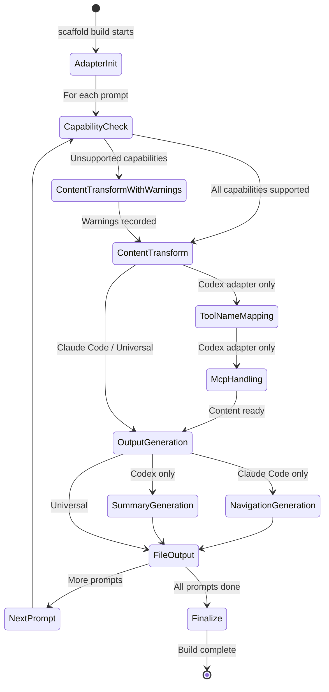

# Domain Model: Platform Adapter System

**Status: Transformed** — Simplified from full content transformation to thin delivery wrappers per meta-prompt architecture (ADR-041).

**Domain ID**: 05
**Phase**: 1 — Deep Domain Modeling
**Depends on**: [09-cli-architecture.md](09-cli-architecture.md) (adapters wrap the assembly trigger for platform delivery)
**Last updated**: 2026-03-14
**Status**: transformed

---

## Section 1: Domain Overview

The Platform Adapter System provides thin delivery wrappers that expose the meta-prompt assembly pipeline to different AI platforms. Adapters no longer transform prompt content — the assembly engine (which loads meta-prompts, knowledge base entries, and project context at runtime) produces platform-neutral assembled prompts. Each adapter simply wraps the assembly trigger in the platform's native format: **Claude Code** (generates `commands/*.md` that invoke `scaffold run <step>`), **Codex** (generates `AGENTS.md` entries pointing to the assembly pipeline), and **Universal** (outputs assembled prompts to stdout or file via `scaffold run <step>`).

**Role in the v2 architecture**: Platform adaptation is now a thin wrapper layer around the runtime assembly engine:

```
scaffold run <step> → [Assembly Engine] → [Platform Adapter wraps trigger] → AI executes assembled prompt
```

Each configured platform in `config.yml` triggers its adapter. Adapters produce platform-specific entry points that invoke the assembly pipeline — they do NOT transform prompt content themselves. Content transformation is handled entirely by the assembly engine at runtime.

**Central design challenge**: Adapters must correctly invoke the assembly pipeline in each platform's idiom while remaining thin enough that adding a new platform requires minimal code. The previous complexity around phrase-level tool-name mapping and mixin injection is eliminated — the AI handles tool adaptation natively based on project context in the assembled prompt.

---

## Section 2: Glossary

**adapter** — A module that transforms fully-injected prompt content into platform-specific output files. Each adapter implements the `PlatformAdapter` interface and is identified by a `PlatformId`.

**adapter pipeline** — The sequence of transformations an adapter applies to each prompt. The Claude Code adapter's pipeline is: frontmatter generation → content passthrough → navigation section. The Codex adapter's pipeline is: tool-name mapping → MCP handling → capability check → content summarization (for AGENTS.md) + full content (for codex-prompts/).

**AGENTS.md** — The instruction file that Codex reads for project context. The Codex adapter generates one section per pipeline phase, each containing prompt summaries and run commands. Full prompt content lives in `codex-prompts/*.md`, not inline.

**capability** — A platform-level feature declared in prompt frontmatter via `requires-capabilities`. Defined in [domain 08](08-prompt-frontmatter.md) as one of: `user-interaction`, `filesystem-write`, `subagent`, `mcp`, `git`. Adapters check declared capabilities against platform support.

**capability support matrix** — The mapping of which capabilities each platform supports. Used by adapters to produce warnings with adaptation guidance when a prompt requires an unsupported capability.

**condensed summary** — The first ~500 tokens of a resolved prompt's injected content, used in AGENTS.md sections to keep the file scannable. Full content is referenced via `codex-prompts/<slug>.md`.

**extension prompt** — A prompt that exists only within a specific methodology (no base equivalent). Referenced with the `ext:` prefix in the manifest. Adapters treat extensions identically to base and override prompts — the source layer distinction is irrelevant at the adapter stage.

**MCP tool handling** — The Codex adapter's strategy for prompt sections that reference MCP tools (e.g., Playwright MCP). MCP references are replaced with CLI equivalents where possible (e.g., `npx playwright screenshot`) or wrapped in platform notes where no equivalent exists.

**navigation section** — The "After This Step" section generated by the Claude Code adapter at the bottom of each command file. Shows the next prompt(s) in the pipeline based on manifest phase ordering and dependencies.

**pattern** — A single entry in the tool-name mapping table. Consists of a `match` string (the Claude Code-specific phrase) and a `replace` string (the Codex-compatible equivalent).

**phrase-level pattern** — A complete phrase used for tool-name mapping, as opposed to single-word replacement. Prevents grammatically broken output (e.g., replacing just "Read" everywhere would break "Read the PRD" → "read the PRD" but also "Reading" → "reading").

**platform** — An AI tool that can execute scaffold prompts. Currently three: `claude-code`, `codex`, and `universal`. Identified by `PlatformId`.

**platform note** — An HTML comment inserted by the Codex adapter when MCP-dependent content has no CLI equivalent: `<!-- Platform note: ... -->`.

**tool-name mapping** — The Codex adapter's system for translating Claude Code tool references into Codex-compatible language. Uses phrase-level patterns matched longest-first. Configured in `adapters/codex/tool-map.yml`.

---

## Section 3: Entity Model

```typescript
// ─── Platform Identification ────────────────────────────────────

/**
 * Identifies a target platform for output generation.
 * Matches values in config.yml `platforms` array.
 */
type PlatformId = 'claude-code' | 'codex' | 'universal';

/**
 * Capabilities that a platform may or may not support.
 * Defined canonically in domain 08; re-used here for the support matrix.
 */
type Capability =
  | 'user-interaction'
  | 'filesystem-write'
  | 'subagent'
  | 'mcp'
  | 'git';


// ─── Adapter Interface ─────────────────────────────────────────

/**
 * The core interface every platform adapter implements.
 * Called once per `scaffold build` invocation for each configured platform.
 */
interface PlatformAdapter {
  /** The platform this adapter generates output for */
  readonly platformId: PlatformId;

  /** Human-readable adapter name for logs and error messages */
  readonly displayName: string;

  /**
   * Capabilities this platform supports.
   * Prompts declaring unsupported capabilities trigger warnings.
   */
  readonly supportedCapabilities: Set<Capability>;

  /**
   * Initialize the adapter before processing prompts.
   * Called once per build. Loads tool mappings, validates output directories, etc.
   * Returns errors if initialization fails (e.g., missing tool-map.yml).
   */
  initialize(context: AdapterContext): Promise<AdapterInitResult>;

  /**
   * Transform a single injected prompt into platform-specific output.
   * Called once per prompt in pipeline order.
   */
  transformPrompt(input: AdapterPromptInput): AdapterPromptOutput;

  /**
   * Generate any aggregate output files after all prompts are processed.
   * For Claude Code: no-op (each prompt produces its own file).
   * For Codex: writes AGENTS.md (composed from all prompt summaries).
   * For Universal: writes scaffold-pipeline.md (pipeline reference).
   */
  finalize(results: AdapterPromptOutput[]): AdapterFinalizeResult;
}


// ─── Adapter Context & Inputs ───────────────────────────────────

/**
 * Build-wide context passed to every adapter during initialization.
 */
interface AdapterContext {
  /** Absolute path to the project root (where .scaffold/ lives) */
  projectRoot: string;

  /** The methodology being used */
  methodology: string;

  /** The manifest, for phase ordering and navigation generation */
  manifest: MethodologyManifest;

  /** All prompts in the resolved pipeline (for navigation/ordering) */
  allPrompts: ResolvedPrompt[];

  /** The dependency graph (from domain 02), for computing "next prompts" */
  dependencyGraph: DependencyGraph;

  /** Mixin selections from config.yml (for metadata in output files) */
  mixins: Record<string, string>;

  /** Platforms configured in config.yml */
  platforms: PlatformId[];
}

/**
 * Input for transforming a single prompt.
 * Combines the injection result with ordering context.
 */
interface AdapterPromptInput {
  /** The injection result containing fully-injected content */
  injectionResult: InjectionResult;

  /** The resolved prompt metadata (frontmatter, phase, source layer) */
  prompt: ResolvedPrompt;

  /**
   * Index of this prompt in manifest phase order (0-based).
   * Used for "After This Step" navigation.
   */
  pipelineIndex: number;

  /**
   * Prompts that directly depend on this one (reverse dependency edges).
   * Used to generate "After This Step" navigation.
   */
  dependents: string[];

  /**
   * Prompts that this prompt depends on.
   * Used for context in navigation sections.
   */
  dependencies: string[];
}


// ─── Adapter Outputs ────────────────────────────────────────────

/**
 * Result of adapter initialization.
 */
interface AdapterInitResult {
  /** Whether initialization succeeded */
  success: boolean;

  /** Errors that prevented initialization */
  errors: AdapterError[];

  /** Non-fatal warnings during initialization */
  warnings: AdapterWarning[];
}

/**
 * Result of transforming a single prompt.
 */
interface AdapterPromptOutput {
  /** The prompt slug (passed through from input) */
  slug: string;

  /** The platform this output targets */
  platformId: PlatformId;

  /** Files to write for this prompt */
  files: OutputFile[];

  /**
   * Capability warnings for this prompt.
   * Non-empty when the prompt requires capabilities the platform doesn't support.
   */
  capabilityWarnings: CapabilityWarning[];

  /** Errors encountered during transformation */
  errors: AdapterError[];

  /** Non-fatal warnings during transformation */
  warnings: AdapterWarning[];

  /** Whether transformation succeeded (no fatal errors) */
  success: boolean;
}

/**
 * A file that the adapter wants to write to disk.
 */
interface OutputFile {
  /**
   * Relative path from project root where the file should be written.
   * e.g., "commands/tech-stack.md", "codex-prompts/tech-stack.md",
   *        "AGENTS.md", "prompts/tech-stack.md"
   */
  relativePath: string;

  /** The full file content to write */
  content: string;

  /**
   * Write mode:
   * - 'create': Write the complete file (overwrite if exists).
   * - 'section': Append/replace a section in an existing file (AGENTS.md).
   */
  writeMode: 'create' | 'section';

  /**
   * For writeMode 'section': the section identifier to find/replace.
   * Used by the Codex adapter when building AGENTS.md incrementally.
   */
  sectionId?: string;
}

/**
 * Result of the finalize step (aggregate outputs).
 */
interface AdapterFinalizeResult {
  /** Aggregate files to write (AGENTS.md, scaffold-pipeline.md, etc.) */
  files: OutputFile[];

  /** Summary statistics */
  stats: AdapterStats;

  /** Errors during finalization */
  errors: AdapterError[];

  /** Warnings during finalization */
  warnings: AdapterWarning[];

  /** Whether finalization succeeded */
  success: boolean;
}


// ─── Tool-Name Mapping (Codex Adapter) ──────────────────────────

/**
 * A single pattern in the tool-name mapping table.
 * Loaded from adapters/codex/tool-map.yml.
 */
interface ToolNamePattern {
  /** The Claude Code-specific phrase to match. Case-sensitive. */
  match: string;

  /** The Codex-compatible replacement phrase */
  replace: string;
}

/**
 * The complete tool-name mapping configuration.
 * Loaded during Codex adapter initialization.
 */
interface ToolNameMapping {
  /**
   * Ordered list of patterns.
   * At runtime, patterns are sorted by match length (longest first)
   * regardless of file order.
   */
  patterns: ToolNamePattern[];
}

/**
 * Result of applying tool-name mapping to a prompt's content.
 */
interface ToolMappingResult {
  /** The content after all tool-name replacements */
  mappedContent: string;

  /** Patterns that were applied (matched at least once) */
  appliedPatterns: AppliedPattern[];

  /** Total number of replacements made */
  replacementCount: number;
}

/**
 * Record of a single pattern application.
 */
interface AppliedPattern {
  /** The pattern that matched */
  pattern: ToolNamePattern;

  /** Number of times this pattern matched in the content */
  matchCount: number;

  /**
   * Line numbers where replacements occurred (1-based).
   * For diagnostics and verbose output.
   */
  lines: number[];
}


// ─── Capability Checking ────────────────────────────────────────

/**
 * Result of checking a prompt's capability requirements against a platform.
 */
interface CapabilityCheckResult {
  /** Whether all required capabilities are supported */
  compatible: boolean;

  /** Capabilities that are supported */
  supported: Capability[];

  /** Capabilities that are NOT supported by this platform */
  unsupported: Capability[];

  /** Warnings with adaptation guidance for each unsupported capability */
  warnings: CapabilityWarning[];
}

/**
 * A warning produced when a prompt requires a capability the platform doesn't support.
 * Includes adaptation guidance — actionable advice for the user.
 */
interface CapabilityWarning {
  /** The prompt slug that requires the unsupported capability */
  promptSlug: string;

  /** The capability that's missing */
  capability: Capability;

  /** The platform that lacks the capability */
  platformId: PlatformId;

  /**
   * Human-readable adaptation guidance.
   * Describes how to work around the missing capability.
   * e.g., "Codex does not support subagents. Research tasks will run
   *         inline rather than being delegated. Consider reviewing the
   *         results for completeness."
   */
  guidance: string;
}


// ─── Platform Capability Matrix ─────────────────────────────────

/**
 * Static definition of which capabilities each platform supports.
 * Used by all adapters for capability checking.
 */
interface PlatformCapabilityMatrix {
  [platformId: string]: {
    supported: Set<Capability>;
    adaptationGuidance: Record<Capability, string>;
  };
}

/**
 * The concrete capability matrix.
 * Defined as a constant — not configurable by users.
 */
// PLATFORM_CAPABILITIES: PlatformCapabilityMatrix = {
//   'claude-code': {
//     supported: new Set(['user-interaction', 'filesystem-write', 'subagent', 'mcp', 'git']),
//     adaptationGuidance: {}  // Claude Code supports all capabilities
//   },
//   'codex': {
//     supported: new Set(['filesystem-write', 'git']),
//     adaptationGuidance: {
//       'user-interaction': 'Codex runs autonomously. Decisions that require user input will be made using best judgment based on project context. High-stakes decisions are tagged NEEDS_USER_REVIEW in decisions.jsonl.',
//       'subagent': 'Codex does not support subagents. Research and review tasks run inline sequentially. Results may benefit from manual review.',
//       'mcp': 'Codex does not support MCP tools. MCP-dependent instructions are replaced with CLI equivalents where available, or wrapped in <!-- Platform note --> comments.',
//     }
//   },
//   'universal': {
//     supported: new Set(['filesystem-write', 'git']),
//     adaptationGuidance: {
//       'user-interaction': 'Present options as numbered text lists. Choose options marked (recommended) in automated contexts.',
//       'subagent': 'Subagent delegation is not available. Perform research tasks sequentially.',
//       'mcp': 'MCP tools are not available in this context. Use CLI equivalents or skip tool-specific sections.',
//     }
//   }
// };


// ─── Claude Code Adapter Types ──────────────────────────────────

/**
 * YAML frontmatter generated for a Claude Code command file.
 */
interface ClaudeCodeFrontmatter {
  /** Short description from resolved frontmatter */
  description: string;

  /** Long description (optional, from resolved frontmatter or generated) */
  'long-description'?: string;

  /** Argument hint (optional, from resolved frontmatter) */
  'argument-hint'?: string;
}

/**
 * The "After This Step" navigation section appended to each command file.
 */
interface NavigationSection {
  /** The prompt slug this navigation belongs to */
  forPrompt: string;

  /**
   * Next prompt(s) in the pipeline.
   * Derived from direct dependents in the dependency graph.
   */
  nextPrompts: NavigationEntry[];

  /**
   * Overall pipeline progress context.
   * e.g., "You've completed 5 of 24 prompts in Phase 2."
   */
  progressContext: string;
}

/**
 * A single entry in the "After This Step" navigation.
 */
interface NavigationEntry {
  /** The prompt slug */
  slug: string;

  /** The prompt description */
  description: string;

  /** Whether this prompt is optional (includes the condition) */
  optional: boolean;

  /** The condition text if optional (e.g., "Frontend projects only") */
  optionalCondition?: string;

  /** The command to run this prompt */
  command: string;
}


// ─── Codex Adapter Types ────────────────────────────────────────

/**
 * A section in the generated AGENTS.md file.
 * One section per pipeline phase, containing prompt entries.
 */
interface AgentsMdPhaseSection {
  /** Phase number (for ordering) */
  phaseIndex: number;

  /** Phase name (e.g., "Project Foundation") */
  phaseName: string;

  /** Prompt entries within this phase */
  entries: AgentsMdPromptEntry[];
}

/**
 * A single prompt entry within an AGENTS.md phase section.
 */
interface AgentsMdPromptEntry {
  /** The prompt slug */
  slug: string;

  /** Artifacts this prompt produces */
  produces: string[];

  /** Artifacts this prompt reads */
  reads: string[];

  /** The Codex run command */
  runCommand: string;

  /**
   * Condensed summary — first ~500 tokens of the injected content.
   * Ends with "See codex-prompts/<slug>.md for full instructions."
   */
  summary: string;
}

/**
 * MCP handling result for a single prompt section.
 */
interface McpHandlingResult {
  /** Content after MCP handling */
  content: string;

  /** MCP references that were replaced with CLI equivalents */
  replacedReferences: McpReplacement[];

  /** MCP references that were wrapped in platform notes (no CLI equivalent) */
  wrappedReferences: McpWrappedReference[];
}

/**
 * An MCP reference that was replaced with a CLI equivalent.
 */
interface McpReplacement {
  /** The original MCP tool reference text */
  originalText: string;

  /** The CLI equivalent that replaced it */
  replacementText: string;

  /** Line number where the replacement occurred */
  line: number;
}

/**
 * An MCP reference wrapped in a platform note comment.
 */
interface McpWrappedReference {
  /** The MCP tool name (e.g., "Playwright MCP") */
  toolName: string;

  /** Line number where the wrapping occurred */
  line: number;

  /** The platform note comment that was inserted */
  noteText: string;
}


// ─── Universal Adapter Types ────────────────────────────────────

/**
 * The scaffold-pipeline.md reference file generated by the universal adapter.
 * Contains phase ordering and dependency information.
 */
interface PipelineReference {
  /** Methodology name */
  methodology: string;

  /** Phases in order, with prompts listed under each */
  phases: PipelineReferencePhase[];

  /** Key dependency constraints as prose */
  dependencyNotes: string[];
}

/**
 * A phase entry in the pipeline reference.
 */
interface PipelineReferencePhase {
  /** Phase number */
  index: number;

  /** Phase name */
  name: string;

  /** Prompts in this phase, in manifest order */
  prompts: PipelineReferencePrompt[];
}

/**
 * A prompt entry in the pipeline reference.
 */
interface PipelineReferencePrompt {
  /** The prompt slug */
  slug: string;

  /** Short description */
  description: string;

  /** What the prompt produces */
  produces: string[];

  /** Whether this prompt is optional */
  optional: boolean;

  /** File path to the universal prompt file */
  filePath: string;
}


// ─── Adapter Statistics ─────────────────────────────────────────

/**
 * Summary statistics for an adapter's build run.
 */
interface AdapterStats {
  /** The platform */
  platformId: PlatformId;

  /** Total prompts processed */
  totalPrompts: number;

  /** Files written */
  filesWritten: number;

  /** Capability warnings issued */
  capabilityWarnings: number;

  /** Tool-name replacements made (Codex adapter only) */
  toolNameReplacements: number;

  /** MCP references handled (Codex adapter only) */
  mcpReferencesHandled: number;
}


// ─── Errors and Warnings ────────────────────────────────────────

/**
 * Error codes for the adapter system.
 */
type AdapterErrorCode =
  | 'ADAPTER_INIT_FAILED'       // Adapter initialization failed
  | 'TOOL_MAP_NOT_FOUND'        // adapters/codex/tool-map.yml missing
  | 'TOOL_MAP_INVALID'          // tool-map.yml has invalid structure
  | 'OUTPUT_WRITE_FAILED'       // Could not write output file
  | 'FRONTMATTER_GENERATION'    // Failed to generate YAML frontmatter
  | 'SUMMARY_GENERATION'        // Failed to generate condensed summary
  | 'NAVIGATION_GENERATION'     // Failed to generate navigation section
  | 'UNKNOWN_PLATFORM'          // Platform ID not recognized
  | 'AGENTS_MD_ASSEMBLY';       // Failed to assemble AGENTS.md

/**
 * Warning codes for the adapter system.
 */
type AdapterWarningCode =
  | 'CAPABILITY_UNSUPPORTED'    // Prompt requires unsupported capability
  | 'MCP_NO_CLI_EQUIVALENT'     // MCP reference has no CLI equivalent
  | 'TOOL_MAP_NO_MATCH'         // Tool-map pattern never matched any content
  | 'SUMMARY_TRUNCATED'         // Condensed summary exceeded 500 tokens
  | 'EMPTY_PROMPT_CONTENT'      // Injected content was empty
  | 'DUPLICATE_PATTERN'         // Two patterns have the same match string
  | 'CASCADE_RISK';             // Replacement text contains a pattern match

/**
 * Adapter error structure.
 */
interface AdapterError {
  code: AdapterErrorCode;
  message: string;
  platformId: PlatformId;
  promptSlug?: string;
  cause?: Error;
}

/**
 * Adapter warning structure.
 */
interface AdapterWarning {
  code: AdapterWarningCode;
  message: string;
  platformId: PlatformId;
  promptSlug?: string;
  guidance?: string;
}


// ─── Aggregate Build Result ─────────────────────────────────────

/**
 * The aggregate output of running all configured adapters.
 * This is the final output of `scaffold build`.
 */
interface AdapterPipelineResult {
  /** Results per platform */
  platformResults: Map<PlatformId, AdapterFinalizeResult>;

  /** Whether all adapters succeeded */
  success: boolean;

  /** Aggregate errors across all platforms */
  errors: AdapterError[];

  /** Aggregate warnings across all platforms */
  warnings: AdapterWarning[];

  /** Summary statistics per platform */
  stats: Map<PlatformId, AdapterStats>;
}
```

---

## Section 4: State Transitions

The adapter system is stateless within a single build — it does not maintain state between `scaffold build` invocations. Each build regenerates all output files from scratch (idempotent). However, the adapter processing follows a well-defined sequential pipeline per prompt:



**Adapter processing order per `scaffold build`**:

1. **Initialization**: Each configured adapter's `initialize()` is called. Codex adapter loads `tool-map.yml`. All adapters validate output directories.
2. **Per-prompt transformation**: For each prompt in pipeline order, each adapter's `transformPrompt()` is called.
3. **Finalization**: Each adapter's `finalize()` is called with all prompt outputs. Codex writes `AGENTS.md`. Universal writes `scaffold-pipeline.md`. Claude Code has nothing to finalize.
4. **File writing**: The CLI writes all `OutputFile` records to disk.

---

## Section 5: Core Algorithms

### Algorithm 1: Tool-Name Mapping (Codex Adapter)

The critical algorithm that translates Claude Code tool references into Codex-compatible language.

```
FUNCTION applyToolNameMapping(content: string, mapping: ToolNameMapping): ToolMappingResult
  // Step 1: Sort patterns by match length (longest first)
  sortedPatterns ← SORT(mapping.patterns, BY pattern.match.length DESC)

  // Step 2: Deduplicate — if two patterns have the same match, warn and keep the first
  seen ← new Map<string, ToolNamePattern>()
  warnings ← []
  FOR each pattern IN sortedPatterns
    IF seen.has(pattern.match)
      warnings.push(DUPLICATE_PATTERN warning)
      CONTINUE
    seen.set(pattern.match, pattern)

  // Step 3: Build a single-pass replacement plan
  // Find all match positions for all patterns (non-overlapping, longest-first)
  replacements ← []  // Array of { start, end, replacement, pattern }

  FOR each pattern IN sortedPatterns (longest first)
    offset ← 0
    WHILE (pos ← content.indexOf(pattern.match, offset)) !== -1
      // Check this position doesn't overlap with an existing replacement
      overlaps ← replacements.any(r => pos < r.end AND pos + pattern.match.length > r.start)
      IF NOT overlaps
        replacements.push({
          start: pos,
          end: pos + pattern.match.length,
          replacement: pattern.replace,
          pattern: pattern
        })
      offset ← pos + 1

  // Step 4: Sort replacements by position (ascending) and apply
  SORT(replacements, BY r.start ASC)

  result ← ""
  lastEnd ← 0
  FOR each r IN replacements
    result += content.substring(lastEnd, r.start)
    result += r.replacement
    lastEnd ← r.end
  result += content.substring(lastEnd)

  // Step 5: Check for cascade risk
  // A cascade occurs when a replacement's text matches another pattern
  FOR each r IN replacements
    FOR each pattern IN sortedPatterns
      IF r.replacement.includes(pattern.match) AND r.pattern !== pattern
        warnings.push(CASCADE_RISK warning for r.pattern and pattern)

  // Step 6: Build applied patterns summary
  appliedMap ← new Map<string, AppliedPattern>()
  FOR each r IN replacements
    IF appliedMap.has(r.pattern.match)
      entry ← appliedMap.get(r.pattern.match)
      entry.matchCount++
      entry.lines.push(lineNumberAt(content, r.start))
    ELSE
      appliedMap.set(r.pattern.match, {
        pattern: r.pattern,
        matchCount: 1,
        lines: [lineNumberAt(content, r.start)]
      })

  RETURN {
    mappedContent: result,
    appliedPatterns: Array.from(appliedMap.values()),
    replacementCount: replacements.length
  }
```

**Key properties**:
- **Longest-first**: Prevents "use the Read tool" from matching "use the" before the full phrase is checked.
- **Non-overlapping**: Once a position is claimed by a longer pattern, shorter patterns cannot match at overlapping positions.
- **Single-pass**: All match positions are found before any replacements are applied. No cascading — the replacement text is NOT re-scanned for further matches.
- **Cascade detection**: After the single pass, the algorithm checks whether any replacement text contains another pattern's match string. This is a warning, not a blocking error, because the single-pass design prevents actual cascading.

### Algorithm 2: MCP Tool Handling (Codex Adapter)

```
FUNCTION handleMcpReferences(content: string): McpHandlingResult
  // Known MCP tools and their CLI equivalents
  mcpEquivalents ← {
    "Playwright MCP": {
      toolPatterns: [
        { match: "browser_navigate", replace: "npx playwright open" },
        { match: "browser_take_screenshot", replace: "npx playwright screenshot" },
        { match: "browser_click", replace: "npx playwright click" },
        { match: "browser_snapshot", replace: "npx playwright evaluate" },
        { match: "browser_fill_form", replace: "npx playwright fill" },
      ],
      genericFallback: "Use Playwright CLI (npx playwright) for browser automation"
    }
  }

  replacements ← []
  wrappedRefs ← []

  // Step 1: Find sections that reference MCP tools
  // MCP references appear as tool name mentions or mcp_<server>_<tool> patterns
  FOR each (lineContent, lineNumber) IN content.split('\n').entries()
    FOR each [toolName, equiv] IN mcpEquivalents
      // Check for specific tool function patterns
      FOR each tp IN equiv.toolPatterns
        IF lineContent.contains(tp.match)
          replacedLine ← lineContent.replace(tp.match, tp.replace)
          replacements.push({ originalText: tp.match, replacementText: tp.replace, line: lineNumber })

      // Check for generic MCP tool references without specific function
      IF lineContent.matches(/mcp.*tool/i) OR lineContent.contains("MCP")
        IF NOT alreadyHandled(lineContent, replacements)
          wrappedRefs.push({
            toolName: toolName,
            line: lineNumber,
            noteText: "<!-- Platform note: this section requires " + toolName +
                      " not available in Codex. " + equiv.genericFallback + " -->"
          })

  // Step 2: For MCP references without known equivalents, wrap in comment
  FOR each mcpRef IN findUnknownMcpReferences(content)
    wrappedRefs.push({
      toolName: mcpRef.name,
      line: mcpRef.line,
      noteText: "<!-- Platform note: this section requires MCP tools (" +
                mcpRef.name + ") not available in Codex. Skip or adapt manually. -->"
    })

  RETURN { content: applyAll(content, replacements, wrappedRefs), replacements, wrappedRefs }
```

### Algorithm 3: Capability Compatibility Check

```
FUNCTION checkCapabilities(
  prompt: ResolvedPrompt,
  platformId: PlatformId,
  matrix: PlatformCapabilityMatrix
): CapabilityCheckResult

  required ← prompt.frontmatter.requiresCapabilities
  platformInfo ← matrix[platformId]

  supported ← []
  unsupported ← []
  warnings ← []

  FOR each capability IN required
    IF platformInfo.supported.has(capability)
      supported.push(capability)
    ELSE
      unsupported.push(capability)
      warnings.push({
        promptSlug: prompt.slug,
        capability: capability,
        platformId: platformId,
        guidance: platformInfo.adaptationGuidance[capability]
      })

  RETURN {
    compatible: unsupported.length === 0,
    supported: supported,
    unsupported: unsupported,
    warnings: warnings
  }
```

### Algorithm 4: Claude Code Command File Generation

```
FUNCTION generateClaudeCodeCommand(input: AdapterPromptInput, context: AdapterContext): OutputFile
  prompt ← input.prompt
  content ← input.injectionResult.injectedContent

  // Step 1: Generate YAML frontmatter
  frontmatter ← {
    description: prompt.frontmatter.description
  }
  IF prompt.frontmatter.argumentHint
    frontmatter['argument-hint'] ← prompt.frontmatter.argumentHint

  // Step 2: Content is passed through unchanged
  // (Claude Code natively understands all tool references)
  body ← content

  // Step 3: Generate "After This Step" navigation
  nav ← generateNavigation(prompt, input.dependents, context)

  // Step 4: Assemble the command file
  output ← "---\n"
  output += yamlSerialize(frontmatter)
  output += "---\n\n"
  output += body
  output += "\n\n---\n\n"
  output += "## After This Step\n\n"
  output += nav.progressContext + "\n\n"
  FOR each entry IN nav.nextPrompts
    output += "- "
    IF entry.optional
      output += "**(optional"
      IF entry.optionalCondition
        output += " — " + entry.optionalCondition
      output += ")** "
    output += "`" + entry.command + "` — " + entry.description + "\n"

  RETURN {
    relativePath: "commands/" + prompt.slug + ".md",
    content: output,
    writeMode: 'create'
  }
```

### Algorithm 5: Codex Prompt File Generation

```
FUNCTION generateCodexPrompt(input: AdapterPromptInput, mapping: ToolNameMapping): OutputFile
  content ← input.injectionResult.injectedContent

  // Step 1: Apply tool-name mapping
  mappingResult ← applyToolNameMapping(content, mapping)

  // Step 2: Handle MCP references
  mcpResult ← handleMcpReferences(mappingResult.mappedContent)

  // Step 3: Add Codex-specific header
  header ← "# " + input.prompt.slug + "\n\n"
  header += "**Produces:** " + input.prompt.frontmatter.produces.join(", ") + "\n"
  IF input.prompt.frontmatter.reads.length > 0
    header += "**Reads:** " + formatReads(input.prompt.frontmatter.reads) + "\n"
  header += "\n---\n\n"

  RETURN {
    relativePath: "codex-prompts/" + input.prompt.slug + ".md",
    content: header + mcpResult.content,
    writeMode: 'create'
  }
```

### Algorithm 6: AGENTS.md Assembly (Codex Adapter Finalize)

```
FUNCTION assembleAgentsMd(
  results: AdapterPromptOutput[],
  context: AdapterContext
): OutputFile

  // Step 1: Group prompts by phase
  phases ← new Map<number, AgentsMdPhaseSection>()
  FOR each prompt IN context.allPrompts
    phaseIdx ← prompt.phaseIndex
    IF NOT phases.has(phaseIdx)
      phases.set(phaseIdx, {
        phaseIndex: phaseIdx,
        phaseName: prompt.phaseName,
        entries: []
      })

    // Generate condensed summary (first ~500 tokens)
    fullContent ← results.find(r => r.slug === prompt.slug)
    summary ← truncateToTokens(fullContent, 500)
    summary += "\n\nSee codex-prompts/" + prompt.slug + ".md for full instructions."

    phases.get(phaseIdx).entries.push({
      slug: prompt.slug,
      produces: prompt.frontmatter.produces,
      reads: formatReads(prompt.frontmatter.reads),
      runCommand: 'codex "Follow the instructions in codex-prompts/' + prompt.slug + '.md"',
      summary: summary
    })

  // Step 2: Generate markdown
  md ← "# AGENTS.md\n\n"
  md += "Auto-generated by `scaffold build` for the " + context.methodology + " methodology.\n"
  md += "Do not edit manually — changes will be overwritten on next build.\n\n"
  md += "---\n\n"

  FOR each [_, phase] IN phases (sorted by phaseIndex)
    md += "## Phase " + phase.phaseIndex + " — " + phase.phaseName + "\n\n"

    FOR each entry IN phase.entries
      md += "### " + entry.slug + "\n"
      md += "**Produces:** " + entry.produces.join(", ") + "\n"
      IF entry.reads.length > 0
        md += "**Reads:** " + entry.reads.join(", ") + "\n"
      md += "**Run:** `" + entry.runCommand + "`\n\n"
      md += entry.summary + "\n\n"

  RETURN {
    relativePath: "AGENTS.md",
    content: md,
    writeMode: 'create'
  }
```

### Algorithm 7: Condensed Summary Generation

```
FUNCTION truncateToTokens(content: string, maxTokens: number): string
  // Approximate: 1 token ≈ 4 characters (conservative estimate)
  // This is intentionally approximate — exact tokenization is model-specific
  maxChars ← maxTokens * 4

  IF content.length <= maxChars
    RETURN content

  // Find a clean break point: end of a paragraph, sentence, or line
  truncated ← content.substring(0, maxChars)

  // Prefer paragraph break
  lastParagraph ← truncated.lastIndexOf("\n\n")
  IF lastParagraph > maxChars * 0.7
    RETURN truncated.substring(0, lastParagraph)

  // Fall back to sentence break
  lastSentence ← truncated.lastIndexOf(". ")
  IF lastSentence > maxChars * 0.7
    RETURN truncated.substring(0, lastSentence + 1)

  // Fall back to line break
  lastLine ← truncated.lastIndexOf("\n")
  IF lastLine > maxChars * 0.5
    RETURN truncated.substring(0, lastLine)

  // Hard truncate with ellipsis
  RETURN truncated + "…"
```

---

## Section 6: Error Taxonomy

### Errors (Fatal)

| Code | Message | Recovery Guidance |
|------|---------|-------------------|
| `ADAPTER_INIT_FAILED` | `Adapter '{platformId}' failed to initialize: {reason}` | Check adapter configuration files exist and are valid. For Codex, verify `adapters/codex/tool-map.yml` is present. |
| `TOOL_MAP_NOT_FOUND` | `Tool mapping file not found: adapters/codex/tool-map.yml` | Ensure the scaffold package is installed correctly. The tool-map.yml ships with the Codex adapter. |
| `TOOL_MAP_INVALID` | `Tool mapping file has invalid structure: {details}` | Each entry must have `match` (non-empty string) and `replace` (string) fields. Check YAML syntax. |
| `OUTPUT_WRITE_FAILED` | `Could not write '{path}': {reason}` | Check directory exists, permissions allow writing, and disk has space. Parent directories are not auto-created — verify the project structure. |
| `FRONTMATTER_GENERATION` | `Failed to generate frontmatter for '{slug}': {reason}` | The prompt's resolved frontmatter is missing the required `description` field. Check the prompt file and resolution chain. |
| `SUMMARY_GENERATION` | `Failed to generate condensed summary for '{slug}': {reason}` | Injected content may be empty or malformed. Check mixin injection output for this prompt. |
| `NAVIGATION_GENERATION` | `Failed to generate navigation for '{slug}': {reason}` | The dependency graph may be inconsistent with the manifest. Run `scaffold validate` to check for graph errors. |
| `UNKNOWN_PLATFORM` | `Unknown platform '{id}' in config.yml. Valid platforms: claude-code, codex, universal` | Check `platforms` array in `.scaffold/config.yml`. Must be one of the three supported values. |
| `AGENTS_MD_ASSEMBLY` | `Failed to assemble AGENTS.md: {reason}` | An internal error in the Codex finalize step. Check that all prompt outputs were generated successfully. |

### Warnings (Non-Fatal)

| Code | Message | Guidance |
|------|---------|----------|
| `CAPABILITY_UNSUPPORTED` | `Prompt '{slug}' requires '{capability}' which is not supported by {platformId}. {adaptationGuidance}` | Not a build failure. The adapted prompt may need manual adjustment when executed on this platform. |
| `MCP_NO_CLI_EQUIVALENT` | `MCP tool '{toolName}' in prompt '{slug}' has no CLI equivalent for Codex. Section wrapped in platform note.` | Review the wrapped section. Consider adding a CLI workaround or removing the MCP dependency for cross-platform prompts. |
| `TOOL_MAP_NO_MATCH` | `Pattern '{match}' in tool-map.yml never matched any content across {count} prompts` | The pattern may be obsolete or the matching phrase may have been rewritten. Review and update tool-map.yml. |
| `SUMMARY_TRUNCATED` | `Condensed summary for '{slug}' exceeded 500 tokens and was truncated` | This is expected for large prompts. Full content is available in codex-prompts/<slug>.md. |
| `EMPTY_PROMPT_CONTENT` | `Injected content for '{slug}' is empty` | The prompt file may be missing content, or mixin injection may have stripped everything. Check the source prompt and injection result. |
| `DUPLICATE_PATTERN` | `Duplicate match pattern '{match}' in tool-map.yml (line {line}). Using first occurrence.` | Remove the duplicate entry from tool-map.yml. |
| `CASCADE_RISK` | `Pattern '{match1}' replaces with text containing pattern '{match2}'. No cascade occurs (single-pass), but this may indicate a mapping issue.` | Intentional in some cases (e.g., a replacement that coincidentally contains another tool name). Review for correctness. |

---

## Section 7: Integration Points

### Upstream Dependencies

| Domain | Interface | What This Domain Consumes |
|--------|-----------|--------------------------|
| 01 — Prompt Resolution | `ResolutionResult`, `ResolvedPrompt`, `ResolvedFrontmatter` | Prompt metadata: slug, description, phase, dependencies, produces, reads, requires-capabilities. Used for frontmatter generation, navigation, and capability checking. |
| 02 — Dependency Resolution | `DependencyGraph`, `DependencyResult` | The dependency graph provides "next prompts" for Claude Code navigation sections and phase ordering for AGENTS.md sections. |
| 12 — Mixin Injection | `InjectionPipelineResult`, `InjectionResult` | The `injectedContent` field — fully-injected prompt text with all mixin markers and task verb markers resolved. This is the primary input to each adapter's content transformation. |
| 08 — Prompt Frontmatter | `Capability`, `PromptFrontmatter` | The `requires-capabilities` field and the `Capability` type. Used for the capability compatibility check. |
| 06 — Config Validation | `ScaffoldConfig` | The `platforms` array in config.yml determines which adapters run. Config validation ensures platform values are valid. |

### Downstream Consumers

| Consumer | What This Domain Produces |
|----------|--------------------------|
| CLI (domain 09) | `AdapterPipelineResult` — the complete output of all adapters. The CLI writes `OutputFile` records to disk, reports errors/warnings, and includes adapter stats in `--format json` output. |
| Pipeline State Machine (domain 03) | Indirectly — adapter output files are the artifacts that state.json completion detection checks. The `produces` field links prompts to their adapter-generated output paths. |
| Human users / AI agents | The actual output files: `commands/*.md`, `AGENTS.md`, `codex-prompts/*.md`, `prompts/*.md`, `scaffold-pipeline.md`. These are consumed at runtime when the pipeline is executed. |

### Integration Contract

- **Input guarantee**: After successful mixin injection, `injectedContent` contains NO unresolved mixin markers or task verb markers. Adapters do not need to handle marker syntax.
- **Output guarantee**: Each adapter produces deterministic output given the same input. `scaffold build` is idempotent — running it twice with identical config and prompts produces identical files.
- **Isolation guarantee**: Adapters do NOT share state. If `platforms: [claude-code, codex]`, both adapters receive the same `InjectionPipelineResult` and produce independent output. Neither adapter reads the other's output.
- **Error propagation**: Adapter errors use exit code 5 (`BUILD_ERROR`). Adapter warnings are included in the CLI's JSON envelope and human-readable output.

---

## Section 8: Edge Cases & Failure Modes

### MQ1: Adapter Interface Definition

The `PlatformAdapter` interface (Section 3) defines the complete adapter contract:

- **Inputs**: `AdapterContext` during initialization (project root, manifest, all prompts, dependency graph, mixins, platforms); `AdapterPromptInput` per prompt (injection result, resolved prompt, pipeline index, dependents, dependencies).
- **Outputs**: `AdapterPromptOutput` per prompt (files to write, capability warnings, errors); `AdapterFinalizeResult` for aggregate outputs (AGENTS.md, scaffold-pipeline.md).
- **Lifecycle hooks**: `initialize()` → `transformPrompt()` (per prompt) → `finalize()` (once).

### MQ2: Claude Code Adapter Transformation Pipeline

The Claude Code adapter performs the simplest transformation:

1. **Frontmatter generation**: Extracts `description`, `argument-hint`, and optionally `long-description` from `ResolvedFrontmatter` and serializes as YAML.
2. **Content passthrough**: The injected content is included verbatim — Claude Code natively understands all tool references that appear in scaffold prompts (`Read`, `Edit`, `Write`, `Bash`, `Agent`, `AskUserQuestionTool`, `Glob`, `Grep`).
3. **Navigation generation**: The "After This Step" section is generated from the dependency graph:
   - Finds all direct dependents of this prompt (prompts that list this prompt in `depends-on`).
   - For each dependent, formats a navigation entry with the `/scaffold:<slug>` command, description, and optional indicator.
   - Adds a progress context line: "You've completed step {N} of {total} in Phase {P} — {phaseName}."
   - If no dependents exist (terminal prompt), says "Pipeline complete — begin implementation."

**Output**: One file per prompt at `commands/<slug>.md`.

### MQ3: Codex Adapter Transformation Pipeline

The Codex adapter performs the most complex transformation:

1. **Tool-name mapping** (Algorithm 1): Applies phrase-level patterns from `tool-map.yml` to the injected content. Patterns are sorted longest-first and applied in a single non-overlapping pass.
2. **MCP handling** (Algorithm 2): Scans for MCP tool references. Known tools (Playwright MCP) are replaced with CLI equivalents. Unknown MCP references are wrapped in `<!-- Platform note -->` comments.
3. **Capability check** (Algorithm 3): Checks `requires-capabilities` against Codex's supported capabilities (`filesystem-write`, `git`). Issues `CAPABILITY_UNSUPPORTED` warnings with adaptation guidance for `user-interaction`, `subagent`, and `mcp`.
4. **Full prompt file generation** (Algorithm 5): Writes the transformed content to `codex-prompts/<slug>.md` with a metadata header.
5. **Summary generation** (Algorithm 7): Extracts the first ~500 tokens for the AGENTS.md section entry. Appends "See codex-prompts/<slug>.md for full instructions."

**Output**: One file per prompt at `codex-prompts/<slug>.md`, plus a single aggregate `AGENTS.md` (from finalize).

**(a) Tool-name mapping application**: Applied to the fully-injected content — this includes both the base prompt text and any content injected by mixins. See Algorithm 1 for the precise matching algorithm.

**(b) AGENTS.md section generation**: One `##` section per phase, one `###` subsection per prompt. Each subsection includes: `Produces` (from frontmatter), `Reads` (from frontmatter), `Run` (the `codex "Follow the instructions..."` command), and a condensed summary. The 500-token summary strategy uses Algorithm 7 — approximate tokenization at 4 chars/token, with paragraph/sentence/line break preferences.

**(c) codex-prompts/*.md generation**: The fully tool-mapped, MCP-handled content with a metadata header showing produces/reads.

### MQ4: Tool-Name Mapping Algorithm

Defined precisely in Algorithm 1. Key behaviors:

**Pattern overlap**: Patterns are sorted longest-first. When a longer pattern's match range overlaps with a shorter pattern's potential match, the longer pattern wins. Example:
- Pattern A: "Use AskUserQuestionTool to" (27 chars)
- Pattern B: "use AskUserQuestionTool" (23 chars)

If the text contains "Use AskUserQuestionTool to confirm", Pattern A matches first (longer). Pattern B cannot match at the same position because it overlaps. If the text contains "Please use AskUserQuestionTool for this", only Pattern B matches (Pattern A requires the trailing " to").

**Cascading replacements**: The algorithm is explicitly single-pass. Replacement text is NOT re-scanned for further pattern matches. If Pattern A replaces "use the Read tool" with "read" and Pattern B matches "read the file", the replacement from Pattern A will NOT be re-scanned — "read" from the replacement will not trigger Pattern B. However, the algorithm does detect this situation and emits a `CASCADE_RISK` warning.

**Example walk-through**: Given input "Use the Bash tool to run `make check`, then use the Read tool to verify the output", with patterns sorted longest-first:
1. "Use the Bash tool to run" (24 chars) → "Run the command"
2. "use the Read tool" (17 chars) → "read"

Result: "Run the command `make check`, then read to verify the output"

### MQ5: MCP Tool Handling — Concrete Example

**Original prompt section (Claude Code, uses Playwright MCP)**:
```markdown
## Visual Verification

After generating the dashboard HTML, verify it visually:

1. Use Playwright MCP's browser_navigate to open the dashboard file
2. Use browser_take_screenshot for desktop (1280×800) and mobile (375×812) viewports
3. Use browser_snapshot to verify accessibility attributes
4. Use browser_click to test expand/collapse interactions
5. Compare screenshots against baselines in tests/screenshots/baseline/
```

**Codex-adapted version**:
```markdown
## Visual Verification

After generating the dashboard HTML, verify it visually:

1. Use `npx playwright open` to open the dashboard file
2. Use `npx playwright screenshot` for desktop (1280×800) and mobile (375×812) viewports
3. Use `npx playwright evaluate` to verify accessibility attributes
4. Use `npx playwright click` to test expand/collapse interactions
5. Compare screenshots against baselines in tests/screenshots/baseline/
```

For MCP tools without CLI equivalents (e.g., a hypothetical "Database MCP" tool):
```markdown
<!-- Platform note: this section requires MCP tools (Database MCP) not available in Codex. Skip or adapt manually. -->
```

The wrapped content is preserved as a comment — it's visible in the source file for reference but won't be parsed as instructions by Codex. Whether this is "useful or just noise" depends on context: for common MCP tools like Playwright where CLI equivalents exist, the wrapping is unnecessary (replaced instead). For uncommon or custom MCP tools, the comment provides context that helps users understand what was skipped and why.

### MQ6: Requires-Capabilities

**All capabilities** (from [domain 08](08-prompt-frontmatter.md)):

| Capability | Description | Claude Code | Codex | Universal |
|------------|-------------|:-----------:|:-----:|:---------:|
| `user-interaction` | Prompt asks the user questions | ✓ | ✗ | ✗ |
| `filesystem-write` | Prompt creates or modifies files | ✓ | ✓ | ✓ |
| `subagent` | Prompt delegates to subagents | ✓ | ✗ | ✗ |
| `mcp` | Prompt uses MCP tools | ✓ | ✗ | ✗ |
| `git` | Prompt runs git commands | ✓ | ✓ | ✓ |

**When a capability is missing**: The adapter emits a `CAPABILITY_UNSUPPORTED` warning with adaptation guidance. This is a warning, NOT an error — the build succeeds. The prompt is still generated for that platform, but the warning tells the user to expect limitations.

**Adaptation guidance examples**:
- `user-interaction` on Codex: "Codex runs autonomously. Decisions that require user input will be made using best judgment based on project context. High-stakes decisions are tagged NEEDS_USER_REVIEW in decisions.jsonl."
- `subagent` on Codex: "Codex does not support subagents. Research and review tasks run inline sequentially. Results may benefit from manual review."
- `mcp` on Codex: "Codex does not support MCP tools. MCP-dependent instructions are replaced with CLI equivalents where available, or wrapped in <!-- Platform note --> comments."
- `user-interaction` on Universal: "Present options as numbered text lists. Choose options marked (recommended) in automated contexts."

### MQ7: Universal Adapter

The Universal adapter produces **plain markdown** — the simplest possible output. Its handling of tool-specific references:

1. **Not a passthrough**: The Universal adapter does apply tool-name mappings using the same algorithm as the Codex adapter, but with a different mapping table (`adapters/universal/tool-map.yml`). Universal mappings are more aggressive — they replace ALL platform-specific tool names with generic language:
   - "Use the Read tool" → "Read"
   - "use AskUserQuestionTool" → "ask the user"
   - "spawn a review subagent" → "perform a review"
   - "Use the Bash tool to run" → "Run"

2. **MCP handling**: MCP references are stripped entirely rather than wrapped in comments. The Universal adapter assumes no MCP support. Sections that are entirely MCP-dependent are removed; mixed sections have the MCP-specific lines removed with the rest preserved.

3. **No YAML frontmatter**: Universal prompt files are pure markdown. Metadata is included as a plain markdown header block.

4. **Pipeline reference**: The `finalize()` step generates `scaffold-pipeline.md` — a human-readable document listing all phases, prompts, their descriptions, artifacts, and ordering constraints. This replaces the programmatic navigation that Claude Code and Codex provide.

### MQ8: Transformation Ordering

Tool-name mappings are applied to the **already-mixin-injected content**. This means:

1. Base prompt text is subject to tool-name mapping — YES
2. Mixin-injected content is subject to tool-name mapping — YES
3. Content from task verb replacement is subject to tool-name mapping — YES

**Implication**: If a base prompt incidentally mentions "the Read tool" in prose (e.g., "use the Read tool to examine the config file"), this WILL be mapped by the Codex adapter. This is intentional — the spec states: "The mapping handles cases where tool-specific language slips through." The recommendation in the spec is for base prompts and mixins to "prefer abstract language where possible (e.g., 'examine the file' rather than 'use the Read tool')," with tool-name mapping serving as a safety net for cases that slip through.

The transformation order within the Codex adapter is:
1. Tool-name mapping (longest-first phrase replacement)
2. MCP handling (CLI equivalent substitution or comment wrapping)
3. Capability check (warning generation)
4. Summary generation (for AGENTS.md)

This order matters: tool-name mapping happens before MCP handling because MCP handling looks for specific tool function names that are distinct from the general tool-name patterns.

### MQ9: Adapter Independence

When `platforms: [claude-code, codex]`, both adapters run with **complete independence**:

- **Shared input**: Both receive the same `InjectionPipelineResult` (read-only). Neither modifies it.
- **No shared state**: Each adapter maintains its own internal state (tool mappings, output buffers, statistics). There is no cross-adapter communication.
- **No shared intermediate results**: The Claude Code adapter's output is not available to the Codex adapter and vice versa.
- **Independent errors**: A failure in one adapter does not prevent the other from completing. If the Codex adapter fails (e.g., missing tool-map.yml), the Claude Code adapter still produces its output. The `AdapterPipelineResult.success` is `false` if ANY adapter fails.
- **Parallel execution**: Adapters could theoretically run in parallel (they have no dependencies on each other), though the current design processes them sequentially for simplicity.

### MQ10: Extension Prompt Handling

Extension prompts (`ext:` prefix in manifest) are prompts with no base equivalent — they exist only within a specific methodology. At the adapter stage, extensions are treated **identically** to base and override prompts:

- The adapter receives an `AdapterPromptInput` regardless of source layer. The `sourceLayer` field on `ResolvedPrompt` may be `ext`, but the adapter does not branch on this.
- Frontmatter generation uses the same fields (`description`, `argument-hint`, etc.).
- Tool-name mapping applies to extensions just as it does to base prompts.
- Capability checking applies to extensions.
- Navigation generation includes extensions in the dependency graph (they have `depends-on` like any prompt).

**The only visible difference**: Extensions may not appear in other methodologies. If a user switches from `deep` to `mvp`, extension prompts defined only in `deep` disappear. But the adapter is not responsible for this — prompt resolution (domain 01) handles inclusion/exclusion. By the time content reaches the adapter, all surviving prompts are equal.

---

## Section 9: Testing Considerations

### Unit Tests

| Component | Test Focus | Example Assertions |
|-----------|-----------|-------------------|
| `applyToolNameMapping` | Pattern matching correctness | Longest pattern wins overlap; non-overlapping positions all replaced; single-pass (no cascade); empty input returns empty; no patterns returns unchanged input |
| `applyToolNameMapping` | Edge cases | Pattern at start/end of string; adjacent patterns; pattern spans a line break; replacement is empty string; replacement is longer than match |
| `handleMcpReferences` | MCP substitution | Known tool functions replaced with CLI equivalents; unknown MCP wrapped in comment; mixed sections preserve non-MCP lines |
| `checkCapabilities` | Capability matrix | Claude Code supports all; Codex supports filesystem-write + git; unsupported capabilities produce warnings with guidance text |
| `generateClaudeCodeCommand` | Output format | YAML frontmatter valid; body matches injected content; "After This Step" lists dependents correctly; terminal prompts have completion message |
| `generateCodexPrompt` | Transformation chain | Tool mapping applied before MCP handling; metadata header present; produces/reads correct |
| `assembleAgentsMd` | Structure | One section per phase; prompts grouped correctly; run command format; summary truncated at ~500 tokens |
| `truncateToTokens` | Break point selection | Prefers paragraph break; falls back to sentence; falls back to line; hard truncates with ellipsis |

### Integration Tests

| Scenario | Setup | Assertion |
|----------|-------|-----------|
| Full build with all three adapters | Config with `platforms: [claude-code, codex, universal]`, 5+ prompts | All output files exist; Claude Code commands have valid frontmatter; AGENTS.md has correct structure; universal prompts are clean markdown |
| Rebuild idempotency | Run `scaffold build` twice with same config | All output files identical byte-for-byte |
| Tool mapping across entire pipeline | A prompt with multiple Claude Code tool references | All references mapped in codex-prompts output; none mapped in commands output; none mapped in universal output (generic mapping instead) |
| Adapter independence | One adapter fails (e.g., missing tool-map.yml) | Other adapters still produce output; error reported for failing adapter only |
| Capability warnings | Prompt with `requires-capabilities: [mcp, subagent]` | Codex adapter produces two warnings; Claude Code produces none; warning text includes adaptation guidance |

### Property-Based Tests

| Property | Invariant |
|----------|-----------|
| Tool mapping is idempotent | Applying the mapping twice produces the same result as applying it once (because single-pass means replacements aren't re-matched) |
| All adapters produce same prompt count | If `InjectionPipelineResult` has N successful results, each adapter produces exactly N per-prompt outputs |
| Claude Code content is superset | The Claude Code command content is identical to the injected content (no transformations remove content) |
| Codex mapping preserves line count | Tool-name mapping does not add or remove lines (only modifies within lines) |

### Snapshot Tests

- **Golden file tests**: Store expected output for a representative set of prompts across all three adapters. Compare against actual output after each build.
- **Tool mapping snapshots**: Store the complete mapping result (applied patterns, replacement count) for a sample prompt. Detect when tool-map.yml changes affect output.
- **AGENTS.md structure snapshot**: Store the expected AGENTS.md structure for a 5-prompt pipeline. Verify phase grouping, section ordering, and summary truncation.

---

## Section 10: Open Questions & Recommendations

### Open Questions

1. **Should the Universal adapter have its own tool-map.yml?** The current design assumes a separate `adapters/universal/tool-map.yml` with more aggressive generic mappings. An alternative is for the Universal adapter to strip all tool references entirely, leaving purely abstract instructions. **Recommendation**: Use a separate tool-map.yml — stripping all tool references loses instructional specificity that's valuable even in a platform-agnostic context. The Universal tool map should map tool names to generic verbs rather than removing them.

2. **How should adapters handle prompts that are 100% MCP-dependent?** If a prompt's entire purpose requires MCP (e.g., a Playwright visual testing prompt), wrapping the entire content in a platform note produces an empty prompt with a comment. Should the Codex adapter skip such prompts entirely? **Recommendation**: Include the prompt but add a top-level notice: "This prompt requires MCP capabilities not available in Codex. The instructions below are for reference only — equivalent functionality requires manual adaptation." This preserves visibility (the user knows the prompt exists) without pretending it's executable.

3. **Should tool-map.yml be user-extensible?** Currently it ships as part of the scaffold package. Users with custom prompts that reference non-standard tools would need to fork tool-map.yml to add patterns. **Recommendation**: Support a `.scaffold/tool-map-overrides.yml` that is merged with the built-in mapping. Overrides take precedence (matched before built-in patterns). This keeps the built-in mapping stable while allowing project-specific extensions.

4. **How should the condensed summary handle prompts with a "What to Produce" section?** The prompt structure convention (from the spec) puts the deliverable summary at the top. Should the condensed summary prefer the "What to Produce" and "Completion Criteria" sections rather than blindly taking the first 500 tokens? **Recommendation**: Yes — extract "What to Produce" and "Completion Criteria" sections if present, and use those as the summary. Fall back to first-500-tokens only if the prompt doesn't follow the structure convention. This produces more useful AGENTS.md entries. **(ADR candidate)**

### Recommendations

1. **Maintain a tool-map.yml regression test suite**: As prompts evolve, tool references change. A regression test that applies the current tool-map.yml to all prompts and flags unmapped tool references would catch drift early.

2. **Add a `--verbose` adapter mode**: In verbose mode, each adapter logs every transformation it applies (every pattern match, every MCP replacement, every capability warning). This aids debugging when adapted output is incorrect.

3. **Track MCP equivalents as structured data**: Rather than hardcoding MCP tool → CLI equivalent mappings in the algorithm, maintain them as a data file (`adapters/codex/mcp-equivalents.yml`). This makes the mappings visible, testable, and extensible.

4. **Consider AGENTS.md as a generated artifact, not a file to edit**: The spec says adapters "generate/update AGENTS.md." Since `scaffold build` is idempotent and regenerates from scratch, AGENTS.md should be treated as fully generated — any manual edits will be overwritten. This should be clearly documented and the generated file should include a "do not edit" header.

5. **Validate adapter output against frontmatter contracts**: After generating output files, verify that every path listed in `produces` frontmatter has a corresponding output file. This catches adapter bugs where a file is supposed to be generated but the adapter skips it.

6. **Consider a dry-run mode for adapter output**: `scaffold build --dry-run` should run all adapters without writing files, reporting what would be generated. Useful for verifying tool-map.yml changes before committing.

---

## Section 11: Concrete Examples

### Example 1: Happy Path — Claude Code Adapter

**Input**: Resolved and injected `tech-stack` prompt.

**ResolvedPrompt**:
```typescript
{
  slug: "tech-stack",
  sourceLayer: "base",
  filePath: "/scaffold/base/tech-stack.md",
  frontmatter: {
    description: "Research and document tech stack decisions",
    dependsOn: ["create-prd"],
    phase: 2,
    argumentHint: undefined,
    produces: ["docs/tech-stack.md"],
    reads: ["docs/plan.md"],
    requiresCapabilities: ["user-interaction", "filesystem-write"]
  },
  phaseIndex: 2,
  phaseName: "Project Foundation",
  manifestPrefix: "base"
}
```

**Injected content** (truncated): `"## What to Produce\n\nCreate docs/tech-stack.md...\n\n## Process\n\n1. Ask the user about preferences..."`

**AdapterPromptInput.dependents**: `["claude-code-permissions", "coding-standards"]`

**Output file** (`commands/tech-stack.md`):
```markdown
---
description: Research and document tech stack decisions
---

## What to Produce

Create docs/tech-stack.md...

## Process

1. Ask the user about preferences...

---

## After This Step

You've completed step 4 of 24 in Phase 2 — Project Foundation.

- `/scaffold:claude-code-permissions` — Configure Claude Code permissions for agents
- `/scaffold:coding-standards` — Create coding standards for the tech stack
```

### Example 2: Codex Adapter — Tool-Name Mapping + MCP Handling

**Input**: Injected content for `add-playwright` prompt:

```markdown
## Process

1. Use the Read tool to examine the current project structure
2. Use the Bash tool to run `npm install -D @playwright/test`
3. Use the Write tool to create `playwright.config.ts`
4. Use Playwright MCP's browser_navigate to verify the setup
5. Use browser_take_screenshot to capture baseline screenshots
6. Use AskUserQuestionTool to confirm the configuration looks correct
```

**After tool-name mapping** (Algorithm 1):
```markdown
## Process

1. read to examine the current project structure
2. Run the command `npm install -D @playwright/test`
3. write to create `playwright.config.ts`
4. Use Playwright MCP's browser_navigate to verify the setup
5. Use browser_take_screenshot to capture baseline screenshots
6. ask the user to confirm the configuration looks correct
```

Note: "Playwright MCP" references were not caught by tool-name mapping (they're not in tool-map.yml — they're handled by MCP handling).

**After MCP handling** (Algorithm 2):
```markdown
## Process

1. read to examine the current project structure
2. Run the command `npm install -D @playwright/test`
3. write to create `playwright.config.ts`
4. Use `npx playwright open` to verify the setup
5. Use `npx playwright screenshot` to capture baseline screenshots
6. ask the user to confirm the configuration looks correct
```

**Capability check**: `add-playwright` declares `requires-capabilities: [mcp, filesystem-write]`.
- `filesystem-write`: supported ✓
- `mcp`: NOT supported → Warning: "Codex does not support MCP tools. MCP-dependent instructions are replaced with CLI equivalents where available, or wrapped in <!-- Platform note --> comments."

**codex-prompts/add-playwright.md** output:
```markdown
# add-playwright

**Produces:** playwright.config.ts, tests/screenshots/
**Reads:** docs/project-structure.md, docs/tdd-standards.md

---

## Process

1. read to examine the current project structure
2. Run the command `npm install -D @playwright/test`
3. write to create `playwright.config.ts`
4. Use `npx playwright open` to verify the setup
5. Use `npx playwright screenshot` to capture baseline screenshots
6. ask the user to confirm the configuration looks correct
```

**AGENTS.md section** (from finalize):
```markdown
### add-playwright
**Produces:** playwright.config.ts, tests/screenshots/
**Reads:** docs/project-structure.md, docs/tdd-standards.md
**Run:** `codex "Follow the instructions in codex-prompts/add-playwright.md"`

## Process

1. read to examine the current project structure
2. Run the command `npm install -D @playwright/test`
3. write to create `playwright.config.ts`
4. Use `npx playwright open` to verify the setup…

See codex-prompts/add-playwright.md for full instructions.
```

### Example 3: Universal Adapter — Clean Markdown

**Input**: Same `tech-stack` prompt from Example 1.

**After Universal tool-name mapping** (more aggressive):
```markdown
## What to Produce

Create docs/tech-stack.md...

## Process

1. Ask the user about preferences (language, framework, database, deployment)
2. Research alternatives for each category
3. Document choices with rationale
```

Note: The Universal adapter uses its own tool-map.yml where "Ask the user" maps to itself (it's generic language) and "Use the Read tool" → "Read", "Use the Write tool" → "Write" (verb form only).

**Output file** (`prompts/tech-stack.md`):
```markdown
# tech-stack

**Description:** Research and document tech stack decisions
**Produces:** docs/tech-stack.md
**Reads:** docs/plan.md
**Phase:** 2 — Project Foundation
**Depends on:** create-prd

---

## What to Produce

Create docs/tech-stack.md...

## Process

1. Ask the user about preferences (language, framework, database, deployment)
2. Research alternatives for each category
3. Document choices with rationale
```

**scaffold-pipeline.md** (from finalize, includes all prompts):
```markdown
# Scaffold Pipeline Reference

**Methodology:** deep

## Phase 2 — Project Foundation

| # | Prompt | Description | Produces | Optional |
|---|--------|-------------|----------|----------|
| 4 | [tech-stack](prompts/tech-stack.md) | Research and document tech stack decisions | docs/tech-stack.md | |
| 5 | [claude-code-permissions](prompts/claude-code-permissions.md) | Configure permissions for agents | .claude/settings.json | |
...
```

### Example 4: Extension Prompt Through All Adapters

**Input**: An extension prompt `ext:parallel-agent-checklist` that exists only in the `deep` methodology (no base equivalent).

```typescript
{
  slug: "parallel-agent-checklist",
  sourceLayer: "ext",
  frontmatter: {
    description: "Pre-flight checklist for parallel agent execution",
    dependsOn: ["git-workflow", "implementation-plan"],
    produces: [],  // No artifact — it's a verification prompt
    requiresCapabilities: ["subagent", "git"]
  }
}
```

**Claude Code adapter**: Generates `commands/parallel-agent-checklist.md` with full frontmatter and navigation. Treated identically to base prompts.

**Codex adapter**: Generates `codex-prompts/parallel-agent-checklist.md` with tool-name mapping. Emits `CAPABILITY_UNSUPPORTED` warning for `subagent` capability. AGENTS.md includes it in the appropriate phase section.

**Universal adapter**: Generates `prompts/parallel-agent-checklist.md` as clean markdown. No special handling.

In all three cases, the `ext` source layer is invisible — the adapter does not differentiate.

### Example 5: Cascade Risk Detection

**Tool-map.yml patterns**:
```yaml
patterns:
  - match: "use the Read tool"
    replace: "read"
  - match: "read the file contents"
    replace: "examine the file"
```

**Input**: "use the Read tool to verify the configuration"

**Processing**:
1. Pattern 1 matches: "use the Read tool" → "read"
2. Result: "read to verify the configuration"
3. After all replacements, cascade check: Pattern 1's replacement ("read") is checked against all other patterns. Pattern 2 matches "read the file contents" — but "read" (the replacement) is not a full match for "read the file contents", so no cascade risk is flagged.

**However**, if Pattern 2 were `"read"` → `"examine"`:
1. Pattern 1 matches: "use the Read tool" → "read"
2. Cascade check: Pattern 1's replacement ("read") matches Pattern 2's match string ("read") → `CASCADE_RISK` warning emitted.
3. Despite the warning, no actual cascade occurs because the algorithm is single-pass.
