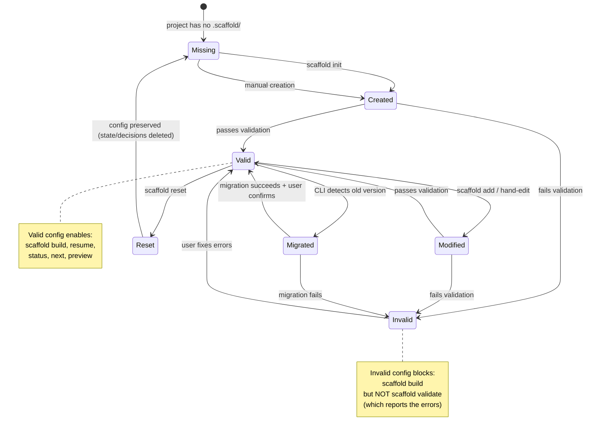
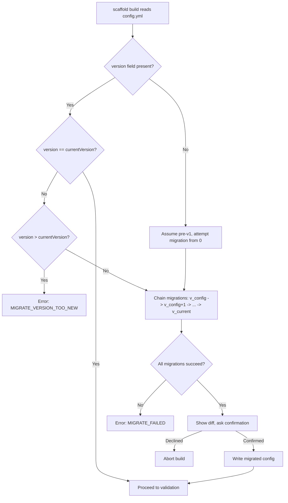

# Domain Model: Config Schema & Validation System

**Status: Transformed** — Simplified schema per meta-prompt architecture. Mixin axes removed, methodology + depth configuration added (ADR-043).

**Domain ID**: 06
**Phase**: 1 — Deep Domain Modeling
**Depends on**: None — first-pass modeling (config is consumed by nearly all other domains)
**Last updated**: 2026-03-14
**Status**: transformed

---

## Section 1: Domain Overview

The Config Schema & Validation System defines the structure, constraints, and validation logic for `.scaffold/config.yml` — the per-project configuration file that drives every other Scaffold v2 subsystem. This domain covers the complete config schema, all validation rules (type checks, value validation, cross-field constraints), the version migration system for schema evolution, fuzzy matching for typo correction, and error surfacing in both interactive and JSON output modes.

The config schema has been simplified under the meta-prompt architecture. The previous mixin axis system (`task-tracking`, `tdd`, `git-workflow`, `agent-mode`, `interaction-style`) has been removed. The new schema centers on methodology selection and depth configuration:

- `version: 2` — schema version
- `methodology: deep | mvp | custom` — methodology preset selection
- `custom:` block (only when `methodology: custom`) — contains `default_depth` (1-5) and per-step overrides with `enabled` and `depth` fields
- `platforms: [claude-code]` — target platform(s) for delivery wrappers
- `project:` — project metadata (`name`, `platforms` for conditional step detection)

**Role in the v2 architecture**: Config validation is the **first gate** in the pipeline. Before the assembly engine can load meta-prompts, before the methodology system can determine which steps are active and at what depth — the config must be valid. The config feeds the pipeline state machine ([domain 03](03-pipeline-state-machine.md)) for tracking execution, the init wizard ([domain 14](14-init-wizard.md)) for initial creation, and the CLI architecture ([domain 09](09-cli-architecture.md)) for command routing. Nearly every domain has a read dependency on this one.

**Central design challenge**: Balancing strictness (catching errors early, preventing confusing failures downstream) with permissiveness (allowing users to experiment, not blocking valid but unusual configurations). The system must produce error messages good enough that users never need to consult documentation — every error includes what went wrong, where, why it matters, and how to fix it. The dual output modes (interactive text and structured JSON) must carry identical semantic content.

---

## Section 2: Glossary

**config file** — The `.scaffold/config.yml` file at the project root. Created by `scaffold init`, editable by hand or via `scaffold add`. Read by `scaffold build` and most other CLI commands. Committed to git.

**config schema** — The TypeScript interface defining all valid fields, types, and constraints for `config.yml`. Versioned via the `version` field.

**config version** — An integer (starting at `1`) in the config file that tracks the schema version. Incremented only for breaking schema changes. New optional fields with defaults do not increment the version.

**breaking change** — A config schema change where existing valid configs would be invalid, existing fields change meaning, fields are removed, or field types change. Requires a version increment and migration function.

**migration function** — A forward-only transformation that converts a config from version N to version N+1. Migrations are chained: v1 → v2 → v3. No downgrades.

**mixin axis** — A dimension of configuration with multiple options. The five v2 axes are: `task-tracking`, `tdd`, `git-workflow`, `agent-mode`, and `interaction-style`.

**mixin value** — The selected option for a mixin axis (e.g., `beads` for `task-tracking`). Must match an installed mixin file at `mixins/<axis>/<value>.md`.

**incompatible combination** — A pair or set of mixin values that, while technically valid, produce suboptimal or contradictory behavior. Surfaced as warnings, not errors.

**fuzzy match** — A typo correction mechanism using Levenshtein distance. When a value doesn't match any valid option, the system suggests the closest match if the edit distance is ≤ 2.

**validation rule** — A single check applied during config validation. Each rule has: an ID, what it checks, the severity (error or warning), an error message template, and a JSON error object structure.

**validation result** — The aggregate output of running all validation rules against a config. Contains a list of errors, a list of warnings, and a boolean `valid` flag.

**known value** — A value that matches an installed resource (methodology directory, mixin file, adapter, project trait). Distinguished from unknown/typo'd values.

**extra prompt** — A custom prompt listed in `config.yml` under `extra-prompts`. Must resolve to a file in `.scaffold/prompts/` or `~/.scaffold/prompts/` with valid frontmatter.

**project trait** — A boolean capability derived from the `project` section of config. Used for optional prompt filtering. Valid traits: `frontend`, `web`, `mobile`, `multi-platform`, `multi-model-cli`.

**derived trait** — A trait inferred from explicit config values rather than stated directly. For example, `project.platforms: [web]` implies the `frontend` and `web` traits.

---

## Section 3: Entity Model

```typescript
// ============================================================
// Config Schema — the complete .scaffold/config.yml structure
// ============================================================

/**
 * The top-level config file schema.
 * Written by `scaffold init`, read by `scaffold build` and most CLI commands.
 */
interface ScaffoldConfig {
  /**
   * Schema version number. Starts at 1. Incremented only for
   * breaking changes. The CLI checks this before processing.
   * @required
   */
  version: number;

  /**
   * The selected methodology name. Must match an installed
   * methodology directory under `methodologies/<name>/`.
   * @required
   */
  methodology: string;

  /**
   * Mixin selections for each axis. Each key is an axis name,
   * each value is the selected mixin option.
   * @required — all axes must be present (the init wizard
   * populates defaults from the methodology manifest)
   */
  mixins: MixinSelections;

  /**
   * Target platform adapters to generate output for.
   * At least one must be specified.
   * @required
   */
  platforms: PlatformName[];

  /**
   * Project characteristics used for optional prompt filtering
   * and brownfield/greenfield behavior.
   * @optional — defaults to empty (greenfield, no traits)
   */
  project?: ProjectConfig;

  /**
   * Custom prompts to add to the pipeline.
   * Each entry is a slug that must resolve to a file in
   * `.scaffold/prompts/<name>.md` or `~/.scaffold/prompts/<name>.md`.
   * @optional — defaults to empty array
   */
  'extra-prompts'?: string[];
}

/**
 * Mixin axis selections.
 * All five axes are required — the init wizard always populates
 * them from methodology defaults or user choices.
 */
interface MixinSelections {
  /** Task tracking backend. */
  'task-tracking': TaskTrackingValue;

  /** TDD strictness level. */
  tdd: TddValue;

  /** Git workflow style. */
  'git-workflow': GitWorkflowValue;

  /** Agent execution mode. */
  'agent-mode': AgentModeValue;

  /** Interaction style for agent-user communication. */
  'interaction-style': InteractionStyleValue;
}

type TaskTrackingValue = 'beads' | 'github-issues' | 'none';
type TddValue = 'strict' | 'relaxed';
type GitWorkflowValue = 'full-pr' | 'simple';
type AgentModeValue = 'multi' | 'single' | 'manual';
type InteractionStyleValue = 'claude-code' | 'codex' | 'universal';

/**
 * Valid platform adapter names.
 * Each must have a corresponding adapter implementation.
 */
type PlatformName = 'claude-code' | 'codex';

/**
 * Project characteristics for optional prompt filtering
 * and brownfield behavior.
 */
interface ProjectConfig {
  /**
   * Target platforms for the project being scaffolded.
   * Drives trait derivation: [web] -> frontend+web traits.
   * @optional — defaults to empty array
   */
  platforms?: ProjectPlatform[];

  /**
   * Whether multi-model CLI tools (Codex, Gemini) are available.
   * Auto-detected during `scaffold init`.
   * @optional — defaults to false
   */
  'multi-model-cli'?: boolean;
}

type ProjectPlatform = 'web' | 'mobile' | 'desktop';

/**
 * All recognized project traits.
 * Some are explicit in config, others are derived.
 */
type ProjectTrait =
  | 'frontend'        // Derived: true when platforms includes 'web' or 'mobile'
  | 'web'             // Derived: true when platforms includes 'web'
  | 'mobile'          // Derived: true when platforms includes 'mobile'
  | 'multi-platform'  // Derived: true when platforms.length >= 2
  | 'multi-model-cli' // Explicit: from project.multi-model-cli
  ;

// ============================================================
// Validation Types
// ============================================================

/**
 * A single validation error or warning.
 * Produced by running a validation rule against the config.
 */
interface ValidationDiagnostic {
  /** Unique error code identifying the validation rule. */
  code: ConfigErrorCode;

  /** Severity: errors block the build, warnings do not. */
  severity: 'error' | 'warning';

  /** Human-readable message with context. */
  message: string;

  /**
   * The config field path that failed validation.
   * Uses dot notation: 'mixins.task-tracking', 'platforms[1]'.
   */
  field: string;

  /**
   * The invalid value that was found.
   * Null for structural errors (missing field, wrong type).
   */
  value: unknown | null;

  /**
   * Fuzzy match suggestion, if applicable.
   * Populated when a string value is within Levenshtein distance ≤ 2
   * of a valid option.
   */
  suggestion?: string;

  /**
   * All valid options for this field, if applicable.
   * Helps the user pick the right value without consulting docs.
   */
  validOptions?: string[];

  /**
   * Source file path containing the error.
   * Always '.scaffold/config.yml' for config validation,
   * but may differ for extra-prompt frontmatter validation.
   */
  file: string;

  /**
   * Line number in the source file where the error occurs.
   * Best-effort: YAML parsing may not preserve exact line numbers
   * for all error types. Null when line cannot be determined.
   */
  line: number | null;
}

/**
 * The aggregate result of config validation.
 */
interface ConfigValidationResult {
  /** True if there are zero errors (warnings are allowed). */
  valid: boolean;

  /** All errors found. Any error means valid=false. */
  errors: ValidationDiagnostic[];

  /** All warnings found. Warnings do not affect validity. */
  warnings: ValidationDiagnostic[];

  /**
   * The parsed config, if validation succeeded.
   * Null if parsing or structural validation failed.
   */
  config: ScaffoldConfig | null;

  /**
   * Whether a migration was applied.
   * True when the config version was old and auto-migrated.
   */
  migrated: boolean;

  /**
   * The version the config was migrated from, if migrated.
   */
  migratedFrom?: number;
}

// ============================================================
// Error Codes
// ============================================================

/**
 * Complete taxonomy of config validation error codes.
 * Codes are grouped by category prefix:
 *   CONFIG_*    — config file structural issues
 *   FIELD_*     — individual field validation
 *   COMBO_*     — cross-field incompatible combinations
 *   EXTRA_*     — extra-prompts validation
 *   MIGRATE_*   — version migration issues
 *   MANIFEST_*  — methodology manifest validation (run after config)
 */
type ConfigErrorCode =
  // --- Config file structural issues ---
  | 'CONFIG_MISSING'              // .scaffold/config.yml does not exist
  | 'CONFIG_EMPTY'                // File exists but is empty or whitespace-only
  | 'CONFIG_PARSE_ERROR'          // YAML syntax error
  | 'CONFIG_NOT_OBJECT'           // Parsed YAML is not a mapping (e.g., array or scalar)
  | 'CONFIG_UNKNOWN_FIELD'        // Unrecognized top-level key (typo check applies)

  // --- Required field validation ---
  | 'FIELD_MISSING'               // A required field is absent
  | 'FIELD_WRONG_TYPE'            // Field exists but has wrong YAML type
  | 'FIELD_EMPTY_VALUE'           // Field exists but is empty string/null/empty array

  // --- Value validation ---
  | 'FIELD_INVALID_METHODOLOGY'   // methodology value doesn't match any installed methodology
  | 'FIELD_INVALID_MIXIN_AXIS'    // A key under mixins is not a recognized axis name
  | 'FIELD_INVALID_MIXIN_VALUE'   // A mixin axis value doesn't match any installed mixin file
  | 'FIELD_INVALID_PLATFORM'      // A platforms entry doesn't match any installed adapter
  | 'FIELD_INVALID_PROJECT_PLATFORM' // A project.platforms entry is not a recognized platform
  | 'FIELD_INVALID_VERSION'       // version is not a positive integer
  | 'FIELD_DUPLICATE_PLATFORM'    // Same platform listed more than once in platforms array
  | 'FIELD_DUPLICATE_EXTRA_PROMPT' // Same slug listed more than once in extra-prompts

  // --- Incompatible combinations (warnings) ---
  | 'COMBO_MANUAL_FULL_PR'        // agent-mode:manual + git-workflow:full-pr
  | 'COMBO_NONE_MULTI'            // task-tracking:none + agent-mode:multi
  | 'COMBO_CODEX_NO_CODEX_PLATFORM' // interaction-style:codex but codex not in platforms
  | 'COMBO_MULTI_AGENT_SINGLE_STYLE' // agent-mode:multi + interaction-style:codex (no subagent support)
  | 'COMBO_NONE_STRICT_TDD'       // task-tracking:none + tdd:strict (no automated test gating)
  | 'COMBO_MANUAL_MULTI'          // agent-mode:manual + agent-mode concept conflict (not possible but similar: manual mode chosen with multi-agent prompts expected)

  // --- Extra-prompts validation ---
  | 'EXTRA_FILE_MISSING'          // Extra prompt file not found in any search path
  | 'EXTRA_FRONTMATTER_MISSING'   // Extra prompt file has no YAML frontmatter
  | 'EXTRA_FRONTMATTER_PARSE_ERROR' // Extra prompt frontmatter is invalid YAML
  | 'EXTRA_FRONTMATTER_FIELD_MISSING' // Required frontmatter field is missing
  | 'EXTRA_FRONTMATTER_FIELD_INVALID' // Frontmatter field has invalid value
  | 'EXTRA_SLUG_CONFLICT'         // Extra prompt slug conflicts with a built-in prompt name

  // --- Version migration ---
  | 'MIGRATE_VERSION_TOO_NEW'     // Config version is newer than CLI supports
  | 'MIGRATE_VERSION_MISSING'     // Config has no version field (assumed pre-v1)
  | 'MIGRATE_FAILED'              // Migration function threw an error

  // --- Methodology manifest validation (post-config) ---
  | 'MANIFEST_MISSING'            // Methodology directory has no manifest.yml
  | 'MANIFEST_PARSE_ERROR'        // manifest.yml is invalid YAML
  | 'MANIFEST_INVALID_PROMPT_REF' // A prompt reference doesn't resolve to a file
  | 'MANIFEST_CIRCULAR_DEPS'      // Circular dependency detected in dependency graph
  | 'MANIFEST_ORPHAN_DEPENDENCY'  // Dependency key references a prompt not in the phases list
  | 'MANIFEST_INVALID_TRAIT'      // Optional prompt references an unknown trait
  ;

// ============================================================
// Version Migration Types
// ============================================================

/**
 * A single version migration step.
 * Transforms config from one schema version to the next.
 */
interface ConfigMigration {
  /** The version this migration upgrades FROM. */
  fromVersion: number;

  /** The version this migration upgrades TO. Always fromVersion + 1. */
  toVersion: number;

  /** Human-readable description of what changed. */
  description: string;

  /**
   * The migration function. Takes a config object at fromVersion
   * and returns a config object at toVersion.
   * May throw MigrationError if the config cannot be migrated.
   */
  migrate: (config: Record<string, unknown>) => Record<string, unknown>;
}

/**
 * Registry of all known migrations.
 * Indexed by fromVersion for O(1) lookup.
 */
interface MigrationRegistry {
  /** Map from fromVersion to migration step. */
  migrations: Map<number, ConfigMigration>;

  /** The current (latest) schema version the CLI supports. */
  currentVersion: number;
}

// ============================================================
// Fuzzy Matching Types
// ============================================================

/**
 * A fuzzy match candidate.
 * Produced when a string value doesn't match any valid option.
 */
interface FuzzyMatchResult {
  /** The original (invalid) value from the config. */
  input: string;

  /** The closest valid option, if within threshold. Null if no close match. */
  suggestion: string | null;

  /** The Levenshtein distance between input and suggestion. */
  distance: number;

  /** All valid options for this field. */
  validOptions: string[];
}

// ============================================================
// Config Modification Types (scaffold add)
// ============================================================

/**
 * Represents a config modification request from `scaffold add`.
 */
interface ConfigModification {
  /** The axis or field to modify. */
  axis: string;

  /** The new value. */
  value: string;

  /**
   * Validation result after applying the modification.
   * Includes both structural validation and incompatible combo checks.
   */
  validationResult: ConfigValidationResult;

  /** Whether a rebuild is needed after this modification. */
  requiresRebuild: boolean;
}

// ============================================================
// Installed Resources Registry
// ============================================================

/**
 * Registry of installed methodologies, mixins, and adapters.
 * Built by scanning the scaffold installation directory at startup.
 * Used by validation to check whether values reference real resources.
 */
interface InstalledResources {
  /** Installed methodology names (directory names under methodologies/). */
  methodologies: string[];

  /**
   * Installed mixin options per axis.
   * Key: axis name, Value: array of option names (file stems under mixins/<axis>/).
   */
  mixins: Record<string, string[]>;

  /** Installed platform adapter names. */
  platforms: string[];

  /** Valid project platform values. */
  projectPlatforms: string[];

  /** Valid project trait names (both explicit and derived). */
  traits: string[];
}
```

---

## Section 4: State Transitions

Config validation does not have a persistent state machine, but the config itself undergoes a lifecycle:



### Config Version Migration Flow



---

## Section 5: Core Algorithms

### Algorithm 1: Full Config Validation Pipeline

The validation pipeline runs in strict order. Some checks depend on earlier checks passing (e.g., value validation requires structural validation to have succeeded). The pipeline short-circuits on fatal structural errors but collects all non-fatal errors before returning.

```
FUNCTION validateConfig(configPath: string, resources: InstalledResources): ConfigValidationResult
  result = { valid: true, errors: [], warnings: [], config: null, migrated: false }

  // Phase 1: File existence and parsing
  IF NOT fileExists(configPath)
    result.errors.push({ code: CONFIG_MISSING, ... })
    result.valid = false
    RETURN result
  END IF

  raw = readFile(configPath)
  IF raw is empty or whitespace
    result.errors.push({ code: CONFIG_EMPTY, ... })
    result.valid = false
    RETURN result
  END IF

  TRY
    parsed = parseYAML(raw)
  CATCH yamlError
    result.errors.push({ code: CONFIG_PARSE_ERROR, message: yamlError.message, ... })
    result.valid = false
    RETURN result
  END TRY

  IF typeof parsed !== 'object' OR parsed is array
    result.errors.push({ code: CONFIG_NOT_OBJECT, ... })
    result.valid = false
    RETURN result
  END IF

  // Phase 2: Version check and migration
  migrationResult = checkAndMigrateVersion(parsed, resources.currentVersion)
  IF migrationResult.error
    result.errors.push(migrationResult.error)
    result.valid = false
    RETURN result
  END IF
  IF migrationResult.migrated
    parsed = migrationResult.config
    result.migrated = true
    result.migratedFrom = migrationResult.fromVersion
  END IF

  // Phase 3: Structural validation (required fields, types)
  structuralErrors = validateStructure(parsed)
  result.errors.push(...structuralErrors)
  IF structuralErrors has any severity='error'
    result.valid = false
    RETURN result  // Can't do value validation without correct structure
  END IF

  // Phase 4: Unknown field detection
  unknownFieldWarnings = detectUnknownFields(parsed)
  result.warnings.push(...unknownFieldWarnings)

  // Phase 5: Value validation (methodology, mixins, platforms)
  valueErrors = validateValues(parsed, resources)
  result.errors.push(...valueErrors)

  // Phase 6: Cross-field incompatible combination checks
  comboWarnings = checkIncompatibleCombinations(parsed)
  result.warnings.push(...comboWarnings)

  // Phase 7: Extra-prompts validation chain
  IF parsed['extra-prompts'] exists and is non-empty
    extraErrors = validateExtraPrompts(parsed['extra-prompts'], resources)
    result.errors.push(...extraErrors.filter(e => e.severity === 'error'))
    result.warnings.push(...extraErrors.filter(e => e.severity === 'warning'))
  END IF

  result.valid = result.errors.length === 0
  IF result.valid
    result.config = parsed as ScaffoldConfig
  END IF

  RETURN result
END FUNCTION
```

### Algorithm 2: Fuzzy Matching

```
FUNCTION fuzzyMatch(input: string, validOptions: string[]): FuzzyMatchResult
  CONST THRESHOLD = 2  // Maximum Levenshtein distance for suggestions

  bestMatch = null
  bestDistance = Infinity

  FOR EACH option IN validOptions
    distance = levenshteinDistance(input.toLowerCase(), option.toLowerCase())
    IF distance < bestDistance
      bestDistance = distance
      bestMatch = option
    END IF
    // Tiebreaker: if same distance, prefer option that shares a longer prefix
    ELSE IF distance == bestDistance
      IF commonPrefixLength(input, option) > commonPrefixLength(input, bestMatch)
        bestMatch = option
      END IF
    END IF
  END FOR

  RETURN {
    input,
    suggestion: bestDistance <= THRESHOLD ? bestMatch : null,
    distance: bestDistance,
    validOptions
  }
END FUNCTION

FUNCTION levenshteinDistance(a: string, b: string): number
  // Standard dynamic programming implementation.
  // Matrix of size (a.length+1) x (b.length+1).
  // Cell [i][j] = minimum edits to transform a[0..i-1] to b[0..j-1].
  // Operations: insert (cost 1), delete (cost 1), substitute (cost 1).
  // Transposition is NOT included (this is standard Levenshtein, not Damerau).
  m = a.length, n = b.length
  dp = matrix of (m+1) x (n+1)
  FOR i = 0 TO m: dp[i][0] = i
  FOR j = 0 TO n: dp[0][j] = j
  FOR i = 1 TO m
    FOR j = 1 TO n
      cost = (a[i-1] === b[j-1]) ? 0 : 1
      dp[i][j] = min(dp[i-1][j]+1, dp[i][j-1]+1, dp[i-1][j-1]+cost)
    END FOR
  END FOR
  RETURN dp[m][n]
END FUNCTION
```

### Algorithm 3: Incompatible Combination Detection

```
FUNCTION checkIncompatibleCombinations(config: ScaffoldConfig): ValidationDiagnostic[]
  warnings = []
  mixins = config.mixins

  // Rule 1: agent-mode:manual + git-workflow:full-pr
  // Full PR flow assumes automated agent execution with branch management
  IF mixins['agent-mode'] === 'manual' AND mixins['git-workflow'] === 'full-pr'
    warnings.push({
      code: 'COMBO_MANUAL_FULL_PR',
      severity: 'warning',
      message: 'agent-mode "manual" with git-workflow "full-pr" may cause friction. '
             + 'Full PR flow assumes automated agent execution with branch management. '
             + 'Consider git-workflow "simple" for manual mode.',
      field: 'mixins.agent-mode + mixins.git-workflow',
      ...
    })
  END IF

  // Rule 2: task-tracking:none + agent-mode:multi
  // Parallel agents need shared task tracking to avoid claiming the same work
  IF mixins['task-tracking'] === 'none' AND mixins['agent-mode'] === 'multi'
    warnings.push({
      code: 'COMBO_NONE_MULTI',
      severity: 'warning',
      message: 'task-tracking "none" with agent-mode "multi" risks work duplication. '
             + 'Parallel agents need shared task tracking (beads or github-issues) '
             + 'to coordinate task claiming. Consider using beads or github-issues.',
      field: 'mixins.task-tracking + mixins.agent-mode',
      ...
    })
  END IF

  // Rule 3: interaction-style:codex but codex not in platforms
  // If using codex interaction style, you almost certainly want codex output
  IF mixins['interaction-style'] === 'codex'
     AND NOT config.platforms.includes('codex')
    warnings.push({
      code: 'COMBO_CODEX_NO_CODEX_PLATFORM',
      severity: 'warning',
      message: 'interaction-style "codex" is selected but "codex" is not in platforms. '
             + 'Prompts will use Codex-style autonomous decisions but no Codex output '
             + 'will be generated. Add "codex" to platforms or change interaction-style.',
      field: 'mixins.interaction-style + platforms',
      ...
    })
  END IF

  // Rule 4: agent-mode:multi + interaction-style:codex
  // Codex does not support subagent delegation; multi-agent with codex
  // interaction loses the ability to dispatch research subagents
  IF mixins['agent-mode'] === 'multi' AND mixins['interaction-style'] === 'codex'
    warnings.push({
      code: 'COMBO_MULTI_AGENT_SINGLE_STYLE',
      severity: 'warning',
      message: 'agent-mode "multi" with interaction-style "codex" may be suboptimal. '
             + 'Codex does not support subagent delegation. Multi-agent coordination '
             + 'prompts may reference subagent patterns that Codex cannot execute.',
      field: 'mixins.agent-mode + mixins.interaction-style',
      ...
    })
  END IF

  // Rule 5: task-tracking:none + tdd:strict
  // Strict TDD assumes task-based test gating; with no task tracker,
  // there's no automated mechanism to verify test passage before task closure
  IF mixins['task-tracking'] === 'none' AND mixins['tdd'] === 'strict'
    warnings.push({
      code: 'COMBO_NONE_STRICT_TDD',
      severity: 'warning',
      message: 'task-tracking "none" with tdd "strict" relies on manual discipline. '
             + 'Strict TDD expects automated test gating on task closure, but TODO.md '
             + 'has no mechanism to enforce this. Tests must be verified manually.',
      field: 'mixins.task-tracking + mixins.tdd',
      ...
    })
  END IF

  // Rule 6: agent-mode:manual + agent-mode:multi is impossible by schema,
  // but agent-mode:manual with methodology:deep is worth warning about
  // since deep methodology expects multi-agent extensions
  // (This is actually a manifest-level concern, checked separately.)

  RETURN warnings
END FUNCTION
```

### Algorithm 4: Extra-Prompt Validation Chain

```
FUNCTION validateExtraPrompts(
  slugs: string[],
  resources: InstalledResources
): ValidationDiagnostic[]
  diagnostics = []
  seenSlugs = new Set()

  FOR EACH slug IN slugs
    // Step 1: Check for duplicate slugs
    IF seenSlugs.has(slug)
      diagnostics.push({
        code: 'FIELD_DUPLICATE_EXTRA_PROMPT',
        severity: 'error',
        message: `Duplicate extra-prompt "${slug}". Remove the duplicate entry.`,
        field: 'extra-prompts',
        value: slug,
        ...
      })
      CONTINUE
    END IF
    seenSlugs.add(slug)

    // Step 2: Check for slug conflicts with built-in prompts
    IF resources.builtInPromptSlugs.includes(slug)
      diagnostics.push({
        code: 'EXTRA_SLUG_CONFLICT',
        severity: 'error',
        message: `Extra prompt "${slug}" conflicts with built-in prompt name. `
               + `Use a different name, or place your file in .scaffold/prompts/${slug}.md `
               + `to override the built-in prompt instead.`,
        field: 'extra-prompts',
        value: slug,
        ...
      })
      CONTINUE
    END IF

    // Step 3: Resolve file path (project-level first, then user-level)
    filePath = resolveExtraPromptFile(slug)
    IF filePath is null
      diagnostics.push({
        code: 'EXTRA_FILE_MISSING',
        severity: 'error',
        message: `Extra prompt "${slug}" not found. Searched:\n`
               + `  1. .scaffold/prompts/${slug}.md\n`
               + `  2. ~/.scaffold/prompts/${slug}.md`,
        field: 'extra-prompts',
        value: slug,
        ...
      })
      CONTINUE
    END IF

    // Step 4: Parse frontmatter
    TRY
      frontmatter = parseFrontmatter(filePath)
    CATCH parseError
      IF frontmatter is absent
        diagnostics.push({
          code: 'EXTRA_FRONTMATTER_MISSING',
          severity: 'error',
          message: `Extra prompt "${slug}" (${filePath}) has no YAML frontmatter. `
                 + `Add frontmatter with at least a "description" field.`,
          file: filePath,
          ...
        })
      ELSE
        diagnostics.push({
          code: 'EXTRA_FRONTMATTER_PARSE_ERROR',
          severity: 'error',
          message: `Extra prompt "${slug}" (${filePath}) has invalid YAML frontmatter: `
                 + parseError.message,
          file: filePath,
          ...
        })
      END IF
      CONTINUE
    END TRY

    // Step 5: Validate frontmatter fields
    IF NOT frontmatter.description
      diagnostics.push({
        code: 'EXTRA_FRONTMATTER_FIELD_MISSING',
        severity: 'error',
        message: `Extra prompt "${slug}" is missing required frontmatter field "description".`,
        field: 'description',
        file: filePath,
        ...
      })
    END IF

    // depends-on validation: each entry must be a known prompt slug
    IF frontmatter['depends-on']
      FOR EACH dep IN frontmatter['depends-on']
        IF NOT isKnownPromptSlug(dep, resources)
          diagnostics.push({
            code: 'EXTRA_FRONTMATTER_FIELD_INVALID',
            severity: 'error',
            message: `Extra prompt "${slug}" depends-on "${dep}" which is not a known prompt.`,
            field: 'depends-on',
            file: filePath,
            value: dep,
            ...
          })
        END IF
      END FOR
    END IF

    // phase validation: must be a positive integer
    IF frontmatter.phase AND (typeof phase !== 'number' OR phase < 1)
      diagnostics.push({
        code: 'EXTRA_FRONTMATTER_FIELD_INVALID',
        severity: 'error',
        message: `Extra prompt "${slug}" has invalid phase "${frontmatter.phase}". `
               + `Phase must be a positive integer.`,
        field: 'phase',
        file: filePath,
        value: frontmatter.phase,
        ...
      })
    END IF

    // produces validation: each entry should be a relative file path
    IF frontmatter.produces
      FOR EACH artifact IN frontmatter.produces
        IF artifact starts with '/' OR artifact contains '..'
          diagnostics.push({
            code: 'EXTRA_FRONTMATTER_FIELD_INVALID',
            severity: 'warning',
            message: `Extra prompt "${slug}" produces path "${artifact}" `
                   + `should be relative to project root without ".." segments.`,
            field: 'produces',
            file: filePath,
            value: artifact,
            ...
          })
        END IF
      END FOR
    END IF
  END FOR

  RETURN diagnostics
END FUNCTION

FUNCTION resolveExtraPromptFile(slug: string): string | null
  projectPath = '.scaffold/prompts/' + slug + '.md'
  IF fileExists(projectPath) RETURN projectPath

  userPath = homeDir + '/.scaffold/prompts/' + slug + '.md'
  IF fileExists(userPath) RETURN userPath

  RETURN null
END FUNCTION
```

### Algorithm 5: Config Modification (scaffold add)

```
FUNCTION modifyConfig(axis: string, value: string, configPath: string): ConfigModification
  // Step 1: Read and parse current config
  config = readAndParseConfig(configPath)

  // Step 2: Validate the axis is a known mixin axis
  validAxes = ['task-tracking', 'tdd', 'git-workflow', 'agent-mode', 'interaction-style']
  IF NOT validAxes.includes(axis)
    // Also try fuzzy match
    fuzzy = fuzzyMatch(axis, validAxes)
    IF fuzzy.suggestion
      THROW Error(`Unknown axis "${axis}". Did you mean "${fuzzy.suggestion}"?`)
    ELSE
      THROW Error(`Unknown axis "${axis}". Valid axes: ${validAxes.join(', ')}`)
    END IF
  END IF

  // Step 3: Apply the modification in memory
  config.mixins[axis] = value

  // Step 4: Re-validate the entire config (catches value errors AND combos)
  validationResult = validateConfig(config)

  // Step 5: If valid, write the modified config
  IF validationResult.valid
    writeYAML(configPath, config)
  END IF

  RETURN {
    axis,
    value,
    validationResult,
    requiresRebuild: true  // Any mixin change requires rebuild
  }
END FUNCTION
```

---

## Section 6: Error Taxonomy

This section catalogs every error and warning the config validation system can produce. Each entry includes: the error code, severity, when it fires, the message template, recovery guidance, and the JSON error object structure.

### Structural Errors

#### CONFIG_MISSING
- **Severity**: error
- **Fires when**: `.scaffold/config.yml` does not exist
- **Message**: `Config file not found at .scaffold/config.yml. Run "scaffold init" to create one.`
- **Recovery**: Run `scaffold init` or create the file manually
- **JSON**:
  ```json
  {
    "code": "CONFIG_MISSING",
    "severity": "error",
    "message": "Config file not found at .scaffold/config.yml. Run \"scaffold init\" to create one.",
    "field": null,
    "value": null,
    "file": ".scaffold/config.yml",
    "line": null
  }
  ```

#### CONFIG_EMPTY
- **Severity**: error
- **Fires when**: File exists but contains no content or only whitespace
- **Message**: `Config file .scaffold/config.yml is empty. Run "scaffold init" to regenerate, or add config content manually.`
- **Recovery**: Run `scaffold init` or add required fields

#### CONFIG_PARSE_ERROR
- **Severity**: error
- **Fires when**: YAML parser throws a syntax error
- **Message**: `Config file .scaffold/config.yml has invalid YAML syntax at line {line}: {parseError}`
- **Recovery**: Fix the YAML syntax error at the indicated line
- **JSON**:
  ```json
  {
    "code": "CONFIG_PARSE_ERROR",
    "severity": "error",
    "message": "Config file .scaffold/config.yml has invalid YAML syntax at line 5: unexpected end of stream",
    "field": null,
    "value": null,
    "file": ".scaffold/config.yml",
    "line": 5
  }
  ```

#### CONFIG_NOT_OBJECT
- **Severity**: error
- **Fires when**: Parsed YAML is a scalar, array, or null instead of a mapping
- **Message**: `Config file .scaffold/config.yml must be a YAML mapping (key: value), not a {actualType}.`
- **Recovery**: Restructure the file as a YAML mapping

#### CONFIG_UNKNOWN_FIELD
- **Severity**: warning
- **Fires when**: A top-level key is not one of: `version`, `methodology`, `mixins`, `platforms`, `project`, `extra-prompts`
- **Message**: `Unknown field "{field}" in config. {suggestion}. Known fields: version, methodology, mixins, platforms, project, extra-prompts.`
- **Recovery**: Remove or rename the unknown field. Fuzzy match suggestion provided if distance ≤ 2

### Required Field Errors

#### FIELD_MISSING
- **Severity**: error
- **Fires when**: A required field (`version`, `methodology`, `mixins`, `platforms`) is absent
- **Message**: `Required field "{field}" is missing from config.`
- **Recovery**: Add the missing field. Run `scaffold init` to regenerate a complete config.

#### FIELD_WRONG_TYPE
- **Severity**: error
- **Fires when**: A field has the wrong YAML type (e.g., `methodology: [deep]` instead of `methodology: deep`)
- **Message**: `Field "{field}" must be a {expectedType}, got {actualType}.`
- **Recovery**: Change the value to the correct type

#### FIELD_EMPTY_VALUE
- **Severity**: error
- **Fires when**: A required field is present but empty (empty string, null, or empty array for `platforms`)
- **Message**: `Field "{field}" must not be empty.`
- **Recovery**: Provide a value

### Value Validation Errors

#### FIELD_INVALID_METHODOLOGY
- **Severity**: error
- **Fires when**: `methodology` value doesn't match any installed methodology directory
- **Message**: `Methodology "{value}" not found. {suggestion}. Valid options: {validOptions}.`
- **JSON**:
  ```json
  {
    "code": "FIELD_INVALID_METHODOLOGY",
    "severity": "error",
    "message": "Methodology \"depe\" not found. Did you mean \"deep\"? Valid options: deep, mvp.",
    "field": "methodology",
    "value": "depe",
    "suggestion": "deep",
    "validOptions": ["deep", "mvp"],
    "file": ".scaffold/config.yml",
    "line": 2
  }
  ```

#### FIELD_INVALID_MIXIN_AXIS
- **Severity**: error
- **Fires when**: A key under `mixins` is not a recognized axis name
- **Message**: `Unknown mixin axis "{axis}". {suggestion}. Valid axes: {validAxes}.`
- **Recovery**: Fix the axis name. Fuzzy match suggestion provided

#### FIELD_INVALID_MIXIN_VALUE
- **Severity**: error
- **Fires when**: A mixin axis value doesn't match any installed mixin file for that axis
- **Message**: `Mixin value "{value}" not found for axis "{axis}". {suggestion}. Valid options: {validOptions}.`
- **JSON**:
  ```json
  {
    "code": "FIELD_INVALID_MIXIN_VALUE",
    "severity": "error",
    "message": "Mixin value \"bead\" not found for axis \"task-tracking\". Did you mean \"beads\"? Valid options: beads, github-issues, none.",
    "field": "mixins.task-tracking",
    "value": "bead",
    "suggestion": "beads",
    "validOptions": ["beads", "github-issues", "none"],
    "file": ".scaffold/config.yml",
    "line": 5
  }
  ```

#### FIELD_INVALID_PLATFORM
- **Severity**: error
- **Fires when**: A `platforms` entry doesn't match any installed adapter
- **Message**: `Platform "{value}" not recognized. {suggestion}. Valid options: {validOptions}.`

#### FIELD_INVALID_PROJECT_PLATFORM
- **Severity**: error
- **Fires when**: A `project.platforms` entry is not `web`, `mobile`, or `desktop`
- **Message**: `Project platform "{value}" not recognized. Valid options: web, mobile, desktop.`

#### FIELD_INVALID_VERSION
- **Severity**: error
- **Fires when**: `version` is not a positive integer (e.g., `version: "one"`, `version: 0`, `version: 1.5`)
- **Message**: `Config version must be a positive integer, got "{value}".`

#### FIELD_DUPLICATE_PLATFORM
- **Severity**: warning
- **Fires when**: Same platform appears more than once in the `platforms` array
- **Message**: `Duplicate platform "{value}" in platforms list. Duplicates are ignored.`

#### FIELD_DUPLICATE_EXTRA_PROMPT
- **Severity**: error
- **Fires when**: Same slug appears more than once in `extra-prompts`
- **Message**: `Duplicate extra-prompt "{value}". Remove the duplicate entry.`

### Incompatible Combination Warnings

All incompatible combinations are **warnings**, not errors. Users may have valid reasons.

#### COMBO_MANUAL_FULL_PR
- **Combination**: `agent-mode: manual` + `git-workflow: full-pr`
- **Reason**: Full PR flow assumes automated agent execution with branch management. Manual mode means a human is driving, so the full PR automation may be confusing.
- **Message**: `agent-mode "manual" with git-workflow "full-pr" may cause friction. Full PR flow assumes automated agent execution. Consider git-workflow "simple" for manual mode.`

#### COMBO_NONE_MULTI
- **Combination**: `task-tracking: none` + `agent-mode: multi`
- **Reason**: Parallel agents need shared task tracking to coordinate task claiming and avoid duplicated work. TODO.md has no claiming mechanism.
- **Message**: `task-tracking "none" with agent-mode "multi" risks work duplication. Parallel agents need shared task tracking to coordinate. Consider beads or github-issues.`

#### COMBO_CODEX_NO_CODEX_PLATFORM
- **Combination**: `interaction-style: codex` + codex not in `platforms`
- **Reason**: Using Codex interaction patterns but not generating Codex-specific output is likely a configuration oversight.
- **Message**: `interaction-style "codex" selected but "codex" not in platforms. Prompts will use Codex patterns but no Codex output will be generated.`

#### COMBO_MULTI_AGENT_SINGLE_STYLE
- **Combination**: `agent-mode: multi` + `interaction-style: codex`
- **Reason**: Multi-agent prompts reference subagent delegation patterns that Codex cannot execute.
- **Message**: `agent-mode "multi" with interaction-style "codex" may be suboptimal. Codex does not support subagent delegation referenced in multi-agent coordination prompts.`

#### COMBO_NONE_STRICT_TDD
- **Combination**: `task-tracking: none` + `tdd: strict`
- **Reason**: Strict TDD expects test-before-implementation to be verified before task closure. Without a task tracker's hooks, this relies entirely on agent discipline.
- **Message**: `task-tracking "none" with tdd "strict" relies on manual discipline for test gating. Consider beads for automated enforcement.`

### Extra-Prompt Errors

#### EXTRA_FILE_MISSING
- **Severity**: error
- **Message**: `Extra prompt "{slug}" not found. Searched: .scaffold/prompts/{slug}.md, ~/.scaffold/prompts/{slug}.md`

#### EXTRA_FRONTMATTER_MISSING
- **Severity**: error
- **Message**: `Extra prompt "{slug}" ({path}) has no YAML frontmatter. Add frontmatter with at least a "description" field.`

#### EXTRA_FRONTMATTER_PARSE_ERROR
- **Severity**: error
- **Message**: `Extra prompt "{slug}" ({path}) has invalid frontmatter YAML: {parseError}`

#### EXTRA_FRONTMATTER_FIELD_MISSING
- **Severity**: error
- **Message**: `Extra prompt "{slug}" is missing required frontmatter field "{fieldName}".`

#### EXTRA_FRONTMATTER_FIELD_INVALID
- **Severity**: error or warning (depends on field)
- **Message**: `Extra prompt "{slug}" has invalid value for frontmatter field "{fieldName}": {details}`

#### EXTRA_SLUG_CONFLICT
- **Severity**: error
- **Message**: `Extra prompt "{slug}" conflicts with built-in prompt name "{slug}". Use a different name, or place the file in .scaffold/prompts/ to override instead.`

### Version Migration Errors

#### MIGRATE_VERSION_TOO_NEW
- **Severity**: error
- **Fires when**: Config `version` is higher than the CLI's `currentVersion`
- **Message**: `Config version {version} is newer than this CLI supports (max: {currentVersion}). Update scaffold: npm update -g @scaffold-cli/scaffold`

#### MIGRATE_VERSION_MISSING
- **Severity**: error (auto-recoverable)
- **Fires when**: Config has no `version` field at all
- **Message**: `Config is missing the "version" field. Assuming pre-v1 format and attempting migration.`
- **Behavior**: Treated as version 0, migration chain starts from 0

#### MIGRATE_FAILED
- **Severity**: error
- **Fires when**: A migration function throws or produces invalid output
- **Message**: `Failed to migrate config from version {from} to {to}: {error}. Manually update your config to match the current schema.`

### Manifest Validation Errors (Post-Config)

These run after config validation succeeds, when the methodology is known.

#### MANIFEST_MISSING
- **Severity**: error
- **Message**: `Methodology "{methodology}" has no manifest.yml at methodologies/{methodology}/manifest.yml.`

#### MANIFEST_PARSE_ERROR
- **Severity**: error
- **Message**: `Methodology "{methodology}" manifest.yml has invalid YAML: {parseError}`

#### MANIFEST_INVALID_PROMPT_REF
- **Severity**: error
- **Message**: `Prompt reference "{ref}" in manifest does not resolve to a file. Expected: {expectedPath}`

#### MANIFEST_CIRCULAR_DEPS
- **Severity**: error
- **Message**: `Circular dependency detected in manifest: {cycle}. Break the cycle by removing one dependency.`

#### MANIFEST_ORPHAN_DEPENDENCY
- **Severity**: error
- **Message**: `Dependency key "{key}" references prompt not declared in any phase.`

#### MANIFEST_INVALID_TRAIT
- **Severity**: error
- **Message**: `Optional prompt condition requires trait "{trait}" which is not a known trait. Valid traits: {validTraits}.`

---

## Section 7: Integration Points

### Upstream (who creates the config)

| Source | Mechanism | Notes |
|--------|-----------|-------|
| `scaffold init` ([domain 14](14-init-wizard.md)) | Creates `.scaffold/config.yml` from wizard answers | Always produces a structurally valid config |
| `scaffold add` ([domain 09](09-cli-architecture.md)) | Modifies a single mixin axis value | Re-validates after modification |
| Manual editing | User edits YAML by hand | May introduce any error |

### Downstream (who consumes the config)

| Consumer | What it reads | Integration pattern |
|----------|--------------|---------------------|
| Prompt resolution ([domain 01](01-prompt-resolution.md)) | `methodology`, `mixins`, `project`, `extra-prompts` | Reads validated config; never runs without validation passing |
| Mixin injection ([domain 12](12-mixin-injection.md)) | `mixins` axis selections | Uses axis→value mapping to select mixin files |
| Platform adapters ([domain 05](05-platform-adapters.md)) | `platforms` | Determines which adapters to run |
| Pipeline state machine ([domain 03](03-pipeline-state-machine.md)) | `methodology`, `version` | Records in state.json for consistency checking |
| Dependency resolution ([domain 02](02-dependency-resolution.md)) | Indirectly via resolved prompt set | Config determines which prompts exist in the graph |
| CLI architecture ([domain 09](09-cli-architecture.md)) | All fields | Routes commands, determines behavior modes |
| Decision log ([domain 11](11-decision-log.md)) | `methodology` | Records methodology context in decisions |
| Brownfield mode ([domain 07](07-brownfield-adopt.md)) | `project` section (implicit mode field) | Determines brownfield vs. greenfield behavior |

### Validation triggers

| Event | What happens |
|-------|-------------|
| `scaffold build` | Full validation pipeline runs. Errors block the build. |
| `scaffold validate` | Full validation pipeline runs. Reports errors without building. |
| `scaffold add <axis> <value>` | Modifies config, then re-validates. Errors prevent write. |
| `scaffold resume` | Validates config is still consistent with state.json. |
| `scaffold preview` | Validates config as part of dry-run resolution. |
| `scaffold info` | Reads config; reports if invalid but doesn't block display. |

### CLI output modes

All validation errors and warnings are surfaced in both output modes:

**Interactive mode** (default):
```
Error: Methodology "depe" not found.
  Did you mean "deep"?
  Valid options: deep, mvp
  File: .scaffold/config.yml, line 2

Warning: agent-mode "manual" with git-workflow "full-pr" may cause friction.
  Full PR flow assumes automated agent execution.
  Consider git-workflow "simple" for manual mode.

Found 1 error and 1 warning.
```

**JSON mode** (`--format json`):
```json
{
  "success": false,
  "command": "build",
  "data": null,
  "errors": [
    {
      "code": "FIELD_INVALID_METHODOLOGY",
      "severity": "error",
      "message": "Methodology \"depe\" not found.",
      "field": "methodology",
      "value": "depe",
      "suggestion": "deep",
      "validOptions": ["deep", "mvp"],
      "file": ".scaffold/config.yml",
      "line": 2
    }
  ],
  "warnings": [
    {
      "code": "COMBO_MANUAL_FULL_PR",
      "severity": "warning",
      "message": "agent-mode \"manual\" with git-workflow \"full-pr\" may cause friction.",
      "field": "mixins.agent-mode + mixins.git-workflow",
      "value": null,
      "suggestion": null,
      "validOptions": null,
      "file": ".scaffold/config.yml",
      "line": null
    }
  ],
  "exit_code": 1
}
```

---

## Section 8: Edge Cases & Failure Modes

This section answers all 10 mandatory questions and documents additional edge cases.

### Q1: Complete config.yml schema

Defined in Section 3 as the `ScaffoldConfig` interface. Summary of all fields:

| Field | Required | Type | Default | Notes |
|-------|----------|------|---------|-------|
| `version` | yes | positive integer | (none) | Schema version, starts at 1 |
| `methodology` | yes | string | (none) | Must match installed methodology |
| `mixins.task-tracking` | yes | string | (from methodology defaults) | beads, github-issues, none |
| `mixins.tdd` | yes | string | (from methodology defaults) | strict, relaxed |
| `mixins.git-workflow` | yes | string | (from methodology defaults) | full-pr, simple |
| `mixins.agent-mode` | yes | string | (from methodology defaults) | multi, single, manual |
| `mixins.interaction-style` | yes | string | (from methodology defaults) | claude-code, codex, universal |
| `platforms` | yes | string[] | (none) | At least one; claude-code, codex |
| `project` | no | object | `{}` | Project characteristics |
| `project.platforms` | no | string[] | `[]` | web, mobile, desktop |
| `project.multi-model-cli` | no | boolean | `false` | Auto-detected at init |
| `extra-prompts` | no | string[] | `[]` | Custom prompt slugs |

**All mixin axes are required** because the init wizard always populates them (from methodology defaults or user choices). A hand-created config missing a mixin axis fails validation with `FIELD_MISSING`.

### Q2: Every validation rule

All validation rules are cataloged in Section 6 (Error Taxonomy) with error codes, severity levels, message templates, and JSON structures. The complete list:

**Structural checks (4)**: CONFIG_MISSING, CONFIG_EMPTY, CONFIG_PARSE_ERROR, CONFIG_NOT_OBJECT
**Field presence (3)**: FIELD_MISSING, FIELD_WRONG_TYPE, FIELD_EMPTY_VALUE
**Value checks (8)**: FIELD_INVALID_METHODOLOGY, FIELD_INVALID_MIXIN_AXIS, FIELD_INVALID_MIXIN_VALUE, FIELD_INVALID_PLATFORM, FIELD_INVALID_PROJECT_PLATFORM, FIELD_INVALID_VERSION, FIELD_DUPLICATE_PLATFORM, FIELD_DUPLICATE_EXTRA_PROMPT
**Unknown fields (1)**: CONFIG_UNKNOWN_FIELD
**Incompatible combos (5)**: COMBO_MANUAL_FULL_PR, COMBO_NONE_MULTI, COMBO_CODEX_NO_CODEX_PLATFORM, COMBO_MULTI_AGENT_SINGLE_STYLE, COMBO_NONE_STRICT_TDD
**Extra-prompts (6)**: EXTRA_FILE_MISSING, EXTRA_FRONTMATTER_MISSING, EXTRA_FRONTMATTER_PARSE_ERROR, EXTRA_FRONTMATTER_FIELD_MISSING, EXTRA_FRONTMATTER_FIELD_INVALID, EXTRA_SLUG_CONFLICT
**Version migration (3)**: MIGRATE_VERSION_TOO_NEW, MIGRATE_VERSION_MISSING, MIGRATE_FAILED
**Manifest (6)**: MANIFEST_MISSING, MANIFEST_PARSE_ERROR, MANIFEST_INVALID_PROMPT_REF, MANIFEST_CIRCULAR_DEPS, MANIFEST_ORPHAN_DEPENDENCY, MANIFEST_INVALID_TRAIT

**Total: 36 distinct validation codes.**

### Q3: Config version migration system

**What constitutes a "breaking change":**
1. **Field removal**: A previously required or optional field is deleted
2. **Field rename**: A field's key changes (e.g., `mixins.tdd` → `mixins.test-strategy`)
3. **Type change**: A field's type changes (e.g., `platforms` from string to array)
4. **Semantic change**: A value's meaning changes (e.g., `strict` in TDD now means something different)
5. **New required field**: A previously non-existent field becomes required without a default

**What is NOT a breaking change:**
1. Adding a new optional field with a sensible default
2. Adding a new valid value to an existing enum (e.g., new mixin option)
3. Adding a new mixin axis with a default value

**Example migration — v1 to v2 (hypothetical):**

Suppose in a future release, the `interaction-style` axis is renamed to `agent-style` and the `project` section gains a required `name` field:

**v1 schema** (current):
```yaml
version: 1
methodology: deep
mixins:
  task-tracking: beads
  tdd: strict
  git-workflow: full-pr
  agent-mode: multi
  interaction-style: claude-code
platforms:
  - claude-code
```

**v2 schema** (hypothetical future):
```yaml
version: 2
methodology: deep
mixins:
  task-tracking: beads
  tdd: strict
  git-workflow: full-pr
  agent-mode: multi
  agent-style: claude-code        # renamed from interaction-style
platforms:
  - claude-code
project:
  name: my-project                # new required field
```

**Migration function:**
```typescript
const v1ToV2: ConfigMigration = {
  fromVersion: 1,
  toVersion: 2,
  description: 'Rename interaction-style to agent-style; add project.name',
  migrate(config) {
    const result = { ...config, version: 2 };

    // Rename interaction-style to agent-style
    if (result.mixins?.['interaction-style']) {
      result.mixins['agent-style'] = result.mixins['interaction-style'];
      delete result.mixins['interaction-style'];
    }

    // Add project.name with default derived from directory name
    if (!result.project) result.project = {};
    if (!result.project.name) {
      result.project.name = path.basename(process.cwd());
    }

    return result;
  }
};
```

**Migration chaining**: Migrations are always chained forward. If a config is at v1 and the CLI supports v3, the system runs v1→v2 then v2→v3. Each migration is a pure function: `(configAtVersionN) => configAtVersionN+1`.

**User experience during migration**:
```
Config version 1 detected. Current CLI supports version 2.
Migrating config...

Changes:
  - Renamed mixins.interaction-style -> mixins.agent-style
  - Added project.name: "my-project" (derived from directory name)

Apply migration? [Y/n]
```

In `--auto` mode, migration is applied automatically with changes logged to stderr.

### Q4: Incompatible combinations

The spec lists 2 incompatible combinations. This model identifies **5 total** meaningful incompatible combinations:

| # | Combination | Code | Why it's problematic |
|---|------------|------|---------------------|
| 1 | `agent-mode: manual` + `git-workflow: full-pr` | COMBO_MANUAL_FULL_PR | Full PR flow assumes automated agent execution with branch management. Manual mode means a human is driving — the full PR automation workflow described in prompts may be confusing. |
| 2 | `task-tracking: none` + `agent-mode: multi` | COMBO_NONE_MULTI | Parallel agents need shared task tracking to coordinate task claiming. TODO.md has no claiming mechanism, so two agents may pick up the same work. |
| 3 | `interaction-style: codex` + codex not in `platforms` | COMBO_CODEX_NO_CODEX_PLATFORM | Prompts will use Codex-style autonomous decisions and carry-forward patterns, but no Codex-specific output (AGENTS.md, codex-prompts/) will be generated. Likely a config oversight. |
| 4 | `agent-mode: multi` + `interaction-style: codex` | COMBO_MULTI_AGENT_SINGLE_STYLE | Multi-agent coordination prompts reference subagent delegation patterns. Codex doesn't support subagents, so those instructions become dead prose. |
| 5 | `task-tracking: none` + `tdd: strict` | COMBO_NONE_STRICT_TDD | Strict TDD expects task-based test gating on closure. TODO.md has no hooks or automation for verifying test passage, so strict TDD enforcement relies entirely on agent discipline. |

**Systematically analyzed but NOT flagged** (valid combinations despite looking unusual):

| Combination | Why it's valid |
|-------------|---------------|
| `tdd: relaxed` + `agent-mode: multi` | Relaxed TDD with parallel agents is fine — tests are still run, just not mandated test-first. |
| `git-workflow: simple` + `agent-mode: multi` | Parallel agents committing to main is risky but the user may want it (fast iteration, small team). |
| `interaction-style: universal` + any other setting | Universal is the catch-all escape hatch — it works with everything. |
| `task-tracking: github-issues` + `agent-mode: multi` | GitHub Issues supports assignees, which provides task claiming. |
| `agent-mode: single` + `git-workflow: full-pr` | Single agent with full PR flow is reasonable — one agent, clean commit history. |

### Q5: Config validation and build pipeline interaction

Config validation is a **pre-flight check that gates the build**. No checks are deferred.

**Fail-fast behavior**:
1. **Phase 1** (file/parse): Fatal errors stop immediately. No point checking fields if YAML is broken.
2. **Phase 2** (version migration): Migration errors stop immediately. Can't validate fields against the wrong schema.
3. **Phase 3** (structural): If required fields are missing or wrong-typed, value validation is skipped (would produce misleading errors about values that might not even exist).
4. **Phases 4-7** (unknown fields, values, combos, extra-prompts): All errors are collected and reported together. This gives the user a complete picture rather than fixing one error, re-running, hitting the next.

**What config validation does NOT check** (checked elsewhere):
- Manifest internal consistency (checked by prompt resolution)
- Mixin marker presence in prompts (checked by mixin injection)
- State.json consistency with config (checked by resume/status)
- Prompt frontmatter in built-in prompts (checked by `scaffold validate`)
- Circular dependencies (checked by dependency resolution, but also caught by MANIFEST_CIRCULAR_DEPS)

**Pipeline sequence**:
```
scaffold build
  └─ 1. Config validation (this domain) — GATE: errors block everything
       └─ 2. Manifest validation (post-config) — GATE: errors block build
            └─ 3. Prompt resolution (domain 01)
                 └─ 4. Mixin injection (domain 12)
                      └─ 5. Dependency resolution (domain 02)
                           └─ 6. Platform adaptation (domain 05)
                                └─ 7. Output generation
```

### Q6: Fuzzy matching model

**Algorithm**: Standard Levenshtein distance (insertions, deletions, substitutions). Not Damerau-Levenshtein (no transposition bonus). This is simpler and sufficient for short strings like methodology/mixin names.

**Threshold**: ≤ 2. This catches common typos:
- Single character errors: `depp` → `deep` (distance 1)
- Doubled/missing characters: `beeads` → `beads` (distance 1)
- Adjacent key swaps: `stricy` → `strict` (distance 1)
- Two-character errors: `depe` → `deep` (distance 2)

**Ranking when multiple matches are within threshold**:
1. **Lowest distance first** — `deep` at distance 1 beats `mvp` at distance 2
2. **Longest common prefix** as tiebreaker — if `a` and `b` are equidistant, prefer the one sharing more leading characters with the input
3. **Alphabetical** as final tiebreaker — deterministic output

**Only the best match is suggested** (not a list). If the best match exceeds the threshold, no suggestion is offered — only the list of valid options.

**Output format — interactive**:
```
Error: Methodology "depe" not found.
  Did you mean "deep"?
  Valid options: deep, mvp
```

**Output format — JSON**:
```json
{
  "code": "FIELD_INVALID_METHODOLOGY",
  "field": "methodology",
  "value": "depe",
  "suggestion": "deep",
  "validOptions": ["deep", "mvp"],
  "file": ".scaffold/config.yml",
  "line": 2
}
```

**Fuzzy matching applies to these fields**: `methodology`, each `mixins.<axis>` value, each `platforms` entry, each `project.platforms` entry, unknown top-level field names, unknown mixin axis names. It does NOT apply to `extra-prompts` slugs (those are user-defined names, not from a fixed vocabulary).

### Q7: scaffold add behavior

`scaffold add <axis> <value>` modifies a single mixin axis in config.yml:

1. **Read**: Parse current `config.yml`
2. **Validate axis**: Check that `<axis>` is a known mixin axis. If not, fuzzy match and error.
3. **Validate value**: Check that `<value>` is a valid option for this axis. If not, fuzzy match and error.
4. **Apply in memory**: Set `config.mixins[axis] = value`
5. **Re-validate**: Run full validation (catches incompatible combinations introduced by the change)
6. **Report warnings**: If incompatible combos are detected, print warnings but proceed
7. **Write**: Write the modified config back to `config.yml`
8. **Report**: Print confirmation and `requiresRebuild: true`

**Does it trigger a rebuild?** No. `scaffold add` only modifies the config file. The user must run `scaffold build` separately. The CLI prints a reminder:

```
Updated mixins.task-tracking: beads -> github-issues
Run "scaffold build" to regenerate platform outputs.
```

**What if the new value is incompatible?** Warnings are printed but the modification proceeds:

```
Updated mixins.task-tracking: beads -> none

Warning: task-tracking "none" with agent-mode "multi" risks work duplication.
  Parallel agents need shared task tracking to coordinate.
  Consider beads or github-issues, or change agent-mode to single.

Run "scaffold build" to regenerate platform outputs.
```

**Invalid values are rejected** — the config file is not modified:

```
Error: Mixin value "bead" not found for axis "task-tracking".
  Did you mean "beads"?
  Valid options: beads, github-issues, none
Config was not modified.
```

### Q8: Error code taxonomy

Defined in Section 3 as the `ConfigErrorCode` type and fully documented in Section 6. Complete list organized by exit code mapping:

| Exit Code | Error Category | Codes |
|-----------|---------------|-------|
| 1 (Validation error) | Config structural | CONFIG_MISSING, CONFIG_EMPTY, CONFIG_PARSE_ERROR, CONFIG_NOT_OBJECT, CONFIG_UNKNOWN_FIELD |
| 1 (Validation error) | Field validation | FIELD_MISSING, FIELD_WRONG_TYPE, FIELD_EMPTY_VALUE, FIELD_INVALID_METHODOLOGY, FIELD_INVALID_MIXIN_AXIS, FIELD_INVALID_MIXIN_VALUE, FIELD_INVALID_PLATFORM, FIELD_INVALID_PROJECT_PLATFORM, FIELD_INVALID_VERSION, FIELD_DUPLICATE_PLATFORM, FIELD_DUPLICATE_EXTRA_PROMPT |
| 1 (Validation error) | Extra-prompts | EXTRA_FILE_MISSING, EXTRA_FRONTMATTER_MISSING, EXTRA_FRONTMATTER_PARSE_ERROR, EXTRA_FRONTMATTER_FIELD_MISSING, EXTRA_FRONTMATTER_FIELD_INVALID, EXTRA_SLUG_CONFLICT |
| 1 (Validation error) | Manifest | MANIFEST_MISSING, MANIFEST_PARSE_ERROR, MANIFEST_INVALID_PROMPT_REF, MANIFEST_CIRCULAR_DEPS, MANIFEST_ORPHAN_DEPENDENCY, MANIFEST_INVALID_TRAIT |
| 1 (Validation error) | Migration | MIGRATE_VERSION_TOO_NEW, MIGRATE_VERSION_MISSING, MIGRATE_FAILED |
| 0 (Success with warnings) | Combinations | COMBO_MANUAL_FULL_PR, COMBO_NONE_MULTI, COMBO_CODEX_NO_CODEX_PLATFORM, COMBO_MULTI_AGENT_SINGLE_STYLE, COMBO_NONE_STRICT_TDD |

All config validation errors map to **exit code 1** (validation error). Warnings produce exit code 0 (success). This aligns with the spec's exit code table.

### Q9: Missing, empty, and unknown field behavior

**Config file missing entirely**:
- Error: `CONFIG_MISSING`
- Exit code: 1
- Recovery guidance: `Run "scaffold init" to create one.`
- `scaffold validate` still runs and reports the error (doesn't crash)

**Config file empty** (0 bytes or whitespace-only):
- Error: `CONFIG_EMPTY`
- Exit code: 1
- Recovery guidance: `Run "scaffold init" to regenerate, or add config content manually.`

**Config file has unknown top-level fields**:
- Severity: **warning** (not error)
- Code: `CONFIG_UNKNOWN_FIELD`
- Behavior: Unknown fields are ignored by the build system. The warning alerts the user that the field has no effect, which may indicate a typo.
- Fuzzy matching: If the unknown field name is within Levenshtein distance ≤ 2 of a known field, a suggestion is provided.

```yaml
version: 1
methodolgy: deep    # Typo — warning with suggestion "methodology"
mixins: { ... }
platforms: [claude-code]
custom-field: true     # Unknown — warning, no suggestion (distance > 2 from all known fields)
```

Output:
```
Warning: Unknown field "methodolgy" in config. Did you mean "methodology"?
Warning: Unknown field "custom-field" in config. Known fields: version, methodology, mixins, platforms, project, extra-prompts.
Error: Required field "methodology" is missing from config.
```

Note: The `methodology` field is still missing even though `methodolgy` exists — the validator does not auto-correct.

**Known fields that are null or empty**:
- Required fields (`version`, `methodology`, `mixins`, `platforms`): Error `FIELD_EMPTY_VALUE`
- Optional fields (`project`, `extra-prompts`): Treated as their default (empty object, empty array)
- `platforms: []`: Error `FIELD_EMPTY_VALUE` (at least one platform required)

### Q10: Extra-prompts validation chain

Fully defined in Algorithm 4 (Section 5). The validation chain is:

1. **Duplicate detection**: Same slug appearing twice → `FIELD_DUPLICATE_EXTRA_PROMPT`
2. **Slug conflict check**: Slug matches a built-in prompt name → `EXTRA_SLUG_CONFLICT`
3. **File resolution**: Search `.scaffold/prompts/<slug>.md` then `~/.scaffold/prompts/<slug>.md` → `EXTRA_FILE_MISSING` if neither exists
4. **Frontmatter parsing**: Check for YAML frontmatter block → `EXTRA_FRONTMATTER_MISSING` or `EXTRA_FRONTMATTER_PARSE_ERROR`
5. **Field validation**:
   - `description` required → `EXTRA_FRONTMATTER_FIELD_MISSING`
   - `depends-on` entries must be known prompt slugs → `EXTRA_FRONTMATTER_FIELD_INVALID`
   - `phase` must be positive integer → `EXTRA_FRONTMATTER_FIELD_INVALID`
   - `produces` paths must be relative without `..` → `EXTRA_FRONTMATTER_FIELD_INVALID` (warning)

**Note on slug conflicts**: An extra-prompt slug that matches a built-in name (e.g., `tech-stack`) is an error because it creates ambiguity — is this an override or an addition? Overrides use a different mechanism: place a file at `.scaffold/prompts/tech-stack.md` and it will override the built-in via the prompt customization layer ([domain 01](01-prompt-resolution.md)). No need to list overrides in `extra-prompts`.

### Additional Edge Cases

**YAML anchors and aliases**: The YAML parser should support anchors (`&anchor`) and aliases (`*anchor`) since users may use them for DRY config. Validation operates on the resolved YAML, not the raw text — anchors are transparent.

**Comments in config.yml**: YAML comments (`#`) are preserved during `scaffold add` modifications. The system reads, modifies in memory, and writes back — comment preservation depends on the YAML library used. The domain model recommends using a comment-preserving YAML library (e.g., `yaml` npm package with `keepSourceTokens`).

**BOM (Byte Order Mark)**: If the config file starts with a UTF-8 BOM (`\xEF\xBB\xBF`), the YAML parser should strip it before parsing. This is a common issue with files created on Windows.

**Trailing newline**: A config file without a trailing newline is valid YAML. The validator does not require one. However, `scaffold add` and migration writes should always add a trailing newline (POSIX convention).

**Concurrent modification**: If two agents run `scaffold add` simultaneously, the last write wins. This is acceptable because config modification is a human-driven operation (not automated during build). The lock file mechanism ([domain 13](13-pipeline-locking.md)) protects pipeline execution, not config editing.

---

## Section 9: Testing Considerations

### Unit Tests

| Test Area | Key Scenarios |
|-----------|--------------|
| **YAML parsing** | Valid YAML, invalid YAML, empty file, non-object YAML, YAML with anchors, BOM-prefixed files |
| **Structural validation** | Missing each required field individually, wrong type for each field, null values, empty arrays |
| **Value validation** | Valid methodology, invalid methodology with fuzzy match, invalid without match, each mixin axis with valid/invalid values |
| **Unknown field detection** | Unknown field with fuzzy match, unknown field without match, multiple unknown fields |
| **Incompatible combos** | Each of the 5 defined combos, verify non-flagged combos produce no warnings |
| **Extra-prompts chain** | Valid extra prompt, missing file, missing frontmatter, invalid frontmatter, slug conflict, duplicate slug, invalid depends-on reference |
| **Fuzzy matching** | Distance 0 (exact match), distance 1, distance 2 (at threshold), distance 3 (over threshold), multiple candidates at same distance, tiebreaking by prefix length |
| **Version migration** | Current version (no migration), old version (chain migration), future version (error), missing version field, migration failure |
| **Config modification** | Valid axis/value, invalid axis with fuzzy match, invalid value, modification introducing combo warning |
| **Output formatting** | Interactive format matches expected text, JSON format matches schema |

### Integration Tests

| Test Scenario | What it validates |
|---------------|-------------------|
| `scaffold build` with valid config | Full pipeline succeeds, no errors/warnings |
| `scaffold build` with invalid config | Build blocked, errors reported, exit code 1 |
| `scaffold build` with warnings only | Build proceeds, warnings reported, exit code 0 |
| `scaffold validate` with various configs | Reports all errors/warnings without side effects |
| `scaffold add` then `scaffold build` | Modified config produces correct build output |
| Config migration then build | Migrated config is valid and produces correct output |
| `scaffold init` then validate | Generated config always passes validation |

### Property-Based Tests

| Property | Description |
|----------|-------------|
| **Idempotent validation** | Validating the same config twice produces identical results |
| **No false positives** | Any config generated by `scaffold init` always passes validation |
| **Complete error reporting** | Every invalid field produces at least one diagnostic |
| **Fuzzy match determinism** | Same input always produces same suggestion |
| **Migration chain correctness** | For any valid v1 config, migrating v1→v2→...→vN produces a valid vN config |

---

## Section 10: Open Questions & Recommendations

### Open Questions

1. **Should `project.mode` (brownfield/greenfield) be an explicit config field?**
   The spec mentions `mode: brownfield` in config but the brownfield detection section describes it as being set during `scaffold init`. The current model doesn't include `mode` as a config field — brownfield behavior is determined by the init wizard and recorded in `state.json` as `init-mode`. Should it also appear in config.yml for hand-editing scenarios?

2. **How strict should extra-prompt frontmatter validation be?**
   Currently, only `description` is required for extra-prompts. Should `produces` also be required? Without `produces`, the pipeline can't do artifact-based completion detection for custom prompts. The tradeoff is ease of authoring vs. pipeline reliability.

3. **Should config support future mixin axes without a CLI update?**
   If a methodology manifest references a mixin axis not in the hardcoded list (e.g., `documentation-style`), should the config validator accept it? This would enable methodology authors to define custom axes, but it weakens validation. Current model treats unknown axes as errors.

4. **What's the YAML library recommendation for comment preservation?**
   `scaffold add` needs to modify config without losing user comments. The `yaml` npm package supports this, but the specific API depends on implementation. This affects both config modification and migration write-back.

### Recommendations

1. **ADR Candidate: Config schema versioning strategy**
   Document the decision to use a single integer version with forward-only migration, as opposed to semver on the config file or a compatibility matrix. The integer approach is simpler but means any breaking change increments the version, even if the migration is trivial. This affects how aggressively the schema can evolve.

2. **ADR Candidate: Unknown fields as warnings vs. errors**
   The current model treats unknown fields as warnings (permissive). An alternative is strict mode where unknown fields are errors (prevents config drift). The permissive approach allows users to add custom metadata to their config without scaffold complaining, but it also means typos in field names are only warnings, not errors (as shown in the Q9 example where `methodolgy` is a warning but the missing `methodology` is the error).

3. **Include `mode` in config schema (resolves Open Question 1)**
   Add `mode?: 'greenfield' | 'brownfield'` to `ProjectConfig`. Set during `scaffold init`, also recorded in `state.json`. Having it in both places follows the principle that `config.yml` is the user-editable source of truth and `state.json` is the runtime record.

4. **Require `produces` in extra-prompt frontmatter (resolves Open Question 2)**
   Make `produces` required for extra-prompts. This enables completion detection, artifact verification, and dashboard display for custom prompts. Authors who don't know their output files yet can use `produces: []` (empty array) as an explicit "no artifacts" declaration.

5. **Consider Damerau-Levenshtein for fuzzy matching**
   Standard Levenshtein treats transpositions as two operations (delete + insert). Damerau-Levenshtein counts them as one. For typos like `depe` → `deep`, Damerau gives distance 1 (transposition) vs. standard Levenshtein distance 2. This makes suggestions more generous for common typing errors. The implementation cost is minimal (one additional check in the DP matrix).

---

## Section 11: Concrete Examples

### Example 1: Happy Path — Valid Deep Config

**Input** (`config.yml`):
```yaml
version: 1
methodology: deep
mixins:
  task-tracking: beads
  tdd: strict
  git-workflow: full-pr
  agent-mode: multi
  interaction-style: claude-code
platforms:
  - claude-code
  - codex
project:
  platforms: [web]
  multi-model-cli: true
extra-prompts:
  - security-audit
```

With `.scaffold/prompts/security-audit.md`:
```markdown
---
description: "Run a security audit on the codebase"
depends-on: [coding-standards, project-structure]
phase: 6
produces: ["docs/security-audit.md"]
---

## What to Produce
...
```

**Validation result**:
```json
{
  "valid": true,
  "errors": [],
  "warnings": [],
  "config": { /* parsed config */ },
  "migrated": false
}
```

**Interactive output**: (no output — validation passes silently during `scaffold build`)

### Example 2: Multiple Errors with Fuzzy Matching

**Input** (`config.yml`):
```yaml
version: 1
methodolgy: clasic
mixns:
  task-tracking: bead
  tdd: strickt
  git-workflow: full-pr
  agent-mode: multi
  interaction-style: claude-code
platforms:
  - claude-code
```

**Validation result**:
```json
{
  "valid": false,
  "errors": [
    {
      "code": "FIELD_MISSING",
      "severity": "error",
      "message": "Required field \"methodology\" is missing from config.",
      "field": "methodology",
      "value": null,
      "file": ".scaffold/config.yml",
      "line": null
    },
    {
      "code": "FIELD_MISSING",
      "severity": "error",
      "message": "Required field \"mixins\" is missing from config.",
      "field": "mixins",
      "value": null,
      "file": ".scaffold/config.yml",
      "line": null
    }
  ],
  "warnings": [
    {
      "code": "CONFIG_UNKNOWN_FIELD",
      "severity": "warning",
      "message": "Unknown field \"methodolgy\" in config. Did you mean \"methodology\"?",
      "field": "methodolgy",
      "value": null,
      "suggestion": "methodology",
      "validOptions": ["version", "methodology", "mixins", "platforms", "project", "extra-prompts"],
      "file": ".scaffold/config.yml",
      "line": 2
    },
    {
      "code": "CONFIG_UNKNOWN_FIELD",
      "severity": "warning",
      "message": "Unknown field \"mixns\" in config. Did you mean \"mixins\"?",
      "field": "mixns",
      "value": null,
      "suggestion": "mixins",
      "validOptions": ["version", "methodology", "mixins", "platforms", "project", "extra-prompts"],
      "file": ".scaffold/config.yml",
      "line": 3
    }
  ],
  "config": null,
  "migrated": false
}
```

**Interactive output**:
```
Error: Required field "methodology" is missing from config.
Error: Required field "mixins" is missing from config.

Warning: Unknown field "methodolgy" in config. Did you mean "methodology"?
Warning: Unknown field "mixns" in config. Did you mean "mixins"?

Found 2 errors and 2 warnings.
Run "scaffold init" to regenerate a valid config.
```

Note: Because `methodology` and `mixins` are missing (the typo'd versions are unknown fields, not recognized as the real fields), structural validation fails and value validation for those fields is skipped. The validator does NOT auto-correct typos — it reports the typo as a warning and the missing field as an error. This is intentional: auto-correction could mask genuine intent if the user meant something different.

### Example 3: Incompatible Combinations (Valid with Warnings)

**Input** (`config.yml`):
```yaml
version: 1
methodology: deep
mixins:
  task-tracking: none
  tdd: strict
  git-workflow: full-pr
  agent-mode: multi
  interaction-style: codex
platforms:
  - claude-code
```

**Validation result**:
```json
{
  "valid": true,
  "errors": [],
  "warnings": [
    {
      "code": "COMBO_NONE_MULTI",
      "severity": "warning",
      "message": "task-tracking \"none\" with agent-mode \"multi\" risks work duplication. Parallel agents need shared task tracking to coordinate.",
      "field": "mixins.task-tracking + mixins.agent-mode"
    },
    {
      "code": "COMBO_NONE_STRICT_TDD",
      "severity": "warning",
      "message": "task-tracking \"none\" with tdd \"strict\" relies on manual discipline for test gating.",
      "field": "mixins.task-tracking + mixins.tdd"
    },
    {
      "code": "COMBO_MULTI_AGENT_SINGLE_STYLE",
      "severity": "warning",
      "message": "agent-mode \"multi\" with interaction-style \"codex\" may be suboptimal. Codex does not support subagent delegation.",
      "field": "mixins.agent-mode + mixins.interaction-style"
    },
    {
      "code": "COMBO_CODEX_NO_CODEX_PLATFORM",
      "severity": "warning",
      "message": "interaction-style \"codex\" selected but \"codex\" not in platforms.",
      "field": "mixins.interaction-style + platforms"
    }
  ],
  "config": { /* parsed config */ },
  "migrated": false
}
```

**Interactive output**:
```
Warning: task-tracking "none" with agent-mode "multi" risks work duplication.
  Parallel agents need shared task tracking to coordinate.
  Consider beads or github-issues, or change agent-mode to single.

Warning: task-tracking "none" with tdd "strict" relies on manual discipline.
  Consider beads for automated enforcement.

Warning: agent-mode "multi" with interaction-style "codex" may be suboptimal.
  Codex does not support subagent delegation referenced in multi-agent prompts.

Warning: interaction-style "codex" selected but "codex" not in platforms.
  Prompts will use Codex patterns but no Codex output will be generated.

4 warnings. Config is valid — build will proceed.
```

This example triggers 4 of the 5 defined incompatible combinations. The build proceeds because all are warnings.

### Example 4: Version Migration

**Input** (`config.yml`) — hypothetical v1 config being read by a CLI that supports v2:
```yaml
version: 1
methodology: deep
mixins:
  task-tracking: beads
  tdd: strict
  git-workflow: full-pr
  agent-mode: multi
  interaction-style: claude-code
platforms:
  - claude-code
```

**Migration output** (interactive):
```
Config version 1 detected. Current CLI supports version 2.
Migrating config...

Changes:
  - Renamed mixins.interaction-style -> mixins.agent-style (value unchanged: claude-code)
  - Added project.name: "my-app" (derived from directory name)

Apply migration? [Y/n] y

Config migrated to version 2. Written to .scaffold/config.yml.
Proceeding with build...
```

**Migration output** (JSON, `--format json`):
```json
{
  "success": true,
  "command": "build",
  "data": {
    "migration": {
      "from": 1,
      "to": 2,
      "changes": [
        "Renamed mixins.interaction-style -> mixins.agent-style",
        "Added project.name: \"my-app\""
      ]
    }
  },
  "errors": [],
  "warnings": [],
  "exit_code": 0
}
```

### Example 5: Extra-Prompt Validation Failure

**Input** (`config.yml`):
```yaml
version: 1
methodology: deep
mixins:
  task-tracking: beads
  tdd: strict
  git-workflow: full-pr
  agent-mode: multi
  interaction-style: claude-code
platforms:
  - claude-code
extra-prompts:
  - security-audit
  - tech-stack
  - missing-prompt
```

Where `tech-stack` is a built-in prompt name and `missing-prompt.md` doesn't exist.

**Validation result**:
```json
{
  "valid": false,
  "errors": [
    {
      "code": "EXTRA_SLUG_CONFLICT",
      "severity": "error",
      "message": "Extra prompt \"tech-stack\" conflicts with built-in prompt name. Use a different name, or place the file in .scaffold/prompts/tech-stack.md to override instead.",
      "field": "extra-prompts",
      "value": "tech-stack",
      "file": ".scaffold/config.yml",
      "line": null
    },
    {
      "code": "EXTRA_FILE_MISSING",
      "severity": "error",
      "message": "Extra prompt \"missing-prompt\" not found. Searched:\n  1. .scaffold/prompts/missing-prompt.md\n  2. ~/.scaffold/prompts/missing-prompt.md",
      "field": "extra-prompts",
      "value": "missing-prompt",
      "file": ".scaffold/config.yml",
      "line": null
    }
  ],
  "warnings": [],
  "config": null,
  "migrated": false
}
```

**Interactive output**:
```
Error: Extra prompt "tech-stack" conflicts with built-in prompt name.
  Use a different name, or place the file in .scaffold/prompts/tech-stack.md
  to override the built-in prompt instead.

Error: Extra prompt "missing-prompt" not found.
  Searched:
    1. .scaffold/prompts/missing-prompt.md
    2. ~/.scaffold/prompts/missing-prompt.md

Found 2 errors.
```
