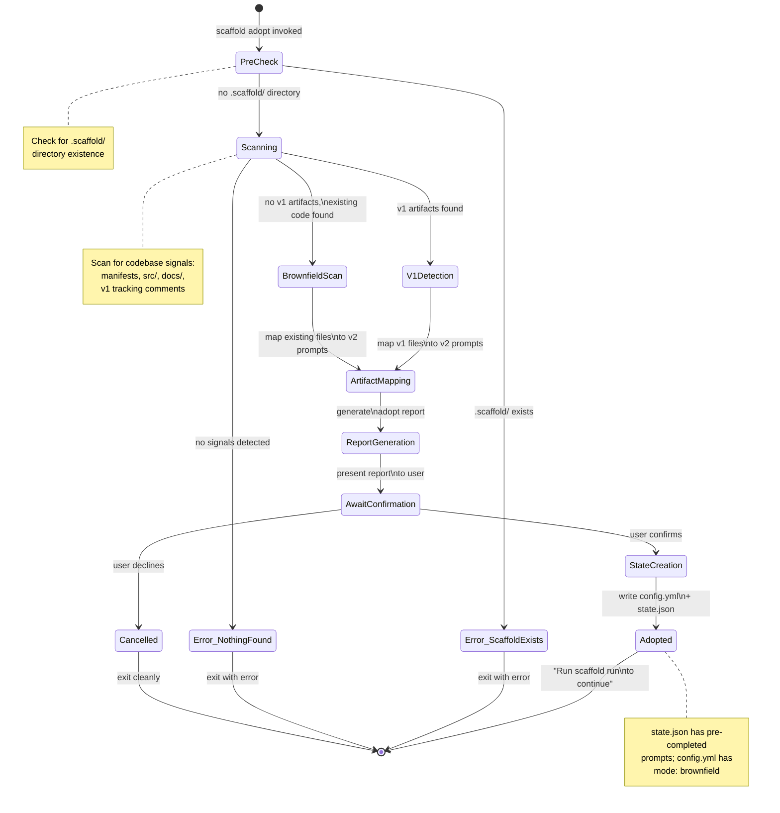
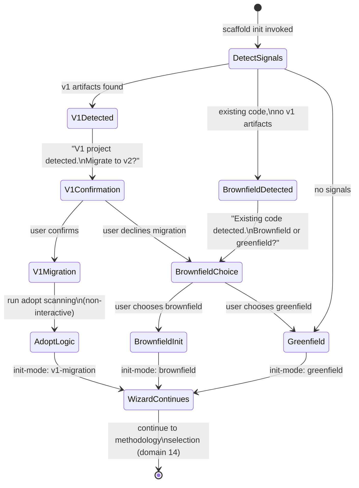

# Domain Model: Brownfield Mode & scaffold adopt

**Domain ID**: 07
**Phase**: 1 — Deep Domain Modeling
**Depends on**: [03-pipeline-state-machine.md](03-pipeline-state-machine.md) (adopt initializes state.json), [06-config-validation.md](06-config-validation.md) (adopt writes config.yml), [08-prompt-frontmatter.md](08-prompt-frontmatter.md) (adopt reads `produces` fields)
**Last updated**: 2026-03-13
**Status**: draft

---

## 1. Domain Overview

Brownfield Mode & scaffold adopt addresses the challenge of introducing Scaffold into projects that already have code, documentation, or prior Scaffold v1 usage. Rather than forcing users to start from scratch, this domain models three distinct initialization paths — greenfield (new project), brownfield (existing code), and v1 migration (upgrading from Scaffold v1) — and the `scaffold adopt` command that scans an existing codebase to infer pipeline state.

### Role in the v2 architecture

This domain sits at the very beginning of the Scaffold lifecycle, governing how the pipeline is initialized. It feeds directly into domain 03 (Pipeline State Machine) by providing a `pre_completed` map of prompts whose artifacts already exist, and into domain 06 (Config Schema & Validation) by writing an initial `config.yml` with the correct `mode` field. It also reads `produces` fields from prompt frontmatter (domain 08) to determine which files correspond to which prompts.

### What this domain covers

- The three-way mode distinction: greenfield, brownfield, v1 migration
- Detection signals for each mode (file/directory patterns, package manifests, v1 artifacts)
- The four brownfield-adapted prompts and how their behavior changes
- The `scaffold adopt` command: scanning algorithm, artifact-to-prompt mapping, partial match handling
- V1 artifact detection and mapping to v2 prompt completions
- User interaction flow for both `scaffold init` brownfield path and `scaffold adopt`
- Policy when `.scaffold/` already exists

### What this domain does NOT cover

- **The init wizard flow itself** — the interactive question sequence, methodology selection, and configuration writing belong to domain 14 (14-init-wizard.md, not yet modeled). This domain models the detection and scanning logic that the wizard consumes.
- **The state.json schema** — the structure of `state.json`, status transitions, and crash recovery belong to [domain 03](03-pipeline-state-machine.md). This domain specifies how adopt populates the initial state.
- **Config validation** — validation of `config.yml` after adopt writes it belongs to [domain 06](06-config-validation.md).

---

## 2. Glossary

**greenfield** — A project with no existing code, no documentation, and no prior Scaffold usage. The default initialization path. All prompts start in `pending` status.

**brownfield** — A project with existing code, dependencies, and/or directory structure but no prior Scaffold usage. Four prompts adapt their behavior to work with existing artifacts rather than creating from scratch.

**v1 migration** — A project that was previously scaffolded with Scaffold v1 (using the `prompts.md` pipeline directly). Detected by the presence of v1 artifacts with v1-format tracking comments. Treated as a special case of brownfield with additional artifact mappings.

**brownfield-adapted prompt** — One of four prompts (`create-prd`, `tech-stack`, `project-structure`, `dev-env-setup`) that modify their behavior when `mode: brownfield` is set in `config.yml`. All other prompts run identically in brownfield and greenfield modes.

**scaffold adopt** — A CLI command that scans an existing codebase, maps discovered files to Scaffold prompts via their `produces` fields, and generates `.scaffold/state.json` with pre-completed entries. Distinct from `scaffold init` — adopt is non-interactive and purely analytical.

**artifact match** — A mapping from an existing file on disk to a Scaffold prompt, established by matching the file path against a prompt's `produces` field. The match may be exact (same path) or fuzzy (same filename in a different directory).

**tracking comment** — A structured HTML comment on line 1 of a Scaffold-produced artifact. V2 format: `<!-- scaffold:<step-name> v<version> <date> <methodology> -->`. V1 format: `<!-- scaffold:<prompt-name> v<version> <date> -->`.

**codebase signal** — An observable indicator in the project directory that informs mode detection. Examples: a `package.json` with dependencies (brownfield signal), a `docs/plan.md` with a v1 tracking comment (v1 migration signal).


**pre-completed prompt** — A prompt that adopt marks as `completed` in `state.json` because its `produces` artifacts already exist on disk. These prompts are skipped when the user runs `scaffold run`.

**partial match** — An artifact that exists on disk and maps to a prompt's `produces` field, but fails artifact-schema validation (e.g., missing required sections). The file is present but the content may be incomplete.

---

## 3. Entity Model

### Init Mode

```typescript
/**
 * The three initialization modes that determine how the pipeline starts.
 * Recorded in state.json's `init-mode` field (domain 03) and influences
 * prompt behavior via config.yml's `mode` field (domain 06).
 */
type InitMode = 'greenfield' | 'brownfield' | 'v1-migration';
```

### Codebase Signal Detection

```typescript
/**
 * A single observable indicator found during codebase scanning.
 * Multiple signals are aggregated to determine init mode.
 */
interface CodebaseSignal {
  /** Classification of what was detected */
  category: SignalCategory;

  /** Relative path from project root to the detected file or directory */
  path: string;

  /** Human-readable description of what was found */
  description: string;
}

/**
 * Categories of codebase signals, ordered by detection priority.
 * V1 signals take priority over generic brownfield signals.
 */
type SignalCategory =
  | 'v1-tracking-comment'   // Line-1 tracking comment in v1 format
  | 'v1-scaffold-artifact'  // Known v1 artifact without tracking comment
  | 'package-manifest'      // package.json, pyproject.toml, go.mod, etc. with dependencies
  | 'source-directory'      // src/ or lib/ with source files
  | 'documentation'         // docs/ directory with markdown files
  | 'test-config'           // jest.config, vitest.config, pytest.ini, etc.
  | 'ci-config';            // .github/workflows/, .gitlab-ci.yml, etc.
```

### Brownfield Detection Result

```typescript
/**
 * Aggregate result of scanning the project directory for codebase signals.
 * Consumed by the init wizard (domain 14) to determine mode selection.
 */
interface BrownfieldDetectionResult {
  /** All signals found during scanning */
  signals: CodebaseSignal[];

  /**
   * Whether the directory contains existing code.
   * True if any package-manifest or source-directory signal was found.
   */
  hasExistingCode: boolean;

  /**
   * Whether v1 Scaffold artifacts were detected.
   * True if any v1-tracking-comment or v1-scaffold-artifact signal was found.
   */
  hasV1Artifacts: boolean;

  /**
   * Recommended init mode based on signal analysis.
   * Priority: v1-migration > brownfield > greenfield.
   * The user may override this recommendation.
   */
  suggestedMode: InitMode;

  /** V1-specific artifact mappings, populated only if hasV1Artifacts is true */
  v1Artifacts: V1ArtifactMapping[];
}
```

### Artifact Matching

```typescript
/**
 * A mapping from an existing file on disk to a Scaffold prompt.
 * Created during `scaffold adopt` scanning.
 */
interface ArtifactMatch {
  /** The prompt slug this file maps to */
  promptSlug: string;

  /** The `produces` path from the prompt's frontmatter */
  producesPath: string;

  /** Whether the file exists on disk at the expected path */
  fileExists: boolean;

  /**
   * Result of artifact-schema validation (domain 08).
   * True = all required-sections present, id-format matches, etc.
   * False = file exists but doesn't meet schema requirements.
   * Null = no artifact-schema defined for this prompt.
   */
  schemaValid: boolean | null;

  /** Specific schema validation failures, if any */
  schemaDiagnostics: string[];

  /** Tracking comment info from line 1, if present */
  trackingComment: TrackingCommentInfo | null;
}

/**
 * Quality assessment of an artifact match.
 * Determines whether the prompt should be marked completed, pending, or warned.
 */
type MatchQuality =
  | 'full'           // File exists, schema validates (or no schema defined)
  | 'partial'        // File exists but schema validation fails
  | 'tracking-only'  // File has tracking comment but schema fails
  | 'missing';       // File does not exist

/**
 * Parsed information from a tracking comment on line 1 of an artifact.
 */
interface TrackingCommentInfo {
  /** Detected format of the tracking comment */
  format: 'v2' | 'v1' | 'unknown';

  /** The prompt name extracted from the comment (e.g., "tech-stack") */
  promptName: string | null;

  /** The schema version (e.g., 1) */
  version: number | null;

  /** The date from the comment (ISO 8601) */
  date: string | null;

  /**
   * Methodology context (v2 only).
   * E.g., "deep". Null for v1 format.
   */
  methodology: string | null;
}
```

### V1 Migration

```typescript
/**
 * A mapping from a v1 Scaffold artifact to a v2 prompt.
 * V1 artifacts may use different file paths or tracking comment formats.
 */
interface V1ArtifactMapping {
  /** Path to the v1 artifact on disk */
  v1Path: string;

  /** The v2 prompt slug this artifact maps to */
  v2PromptSlug: string;

  /** The path where v2 expects this artifact (from `produces` field) */
  v2ProducesPath: string;

  /**
   * Whether the v1 path matches the v2 produces path.
   * If false, the file exists at a non-standard location.
   */
  pathMatch: boolean;
}

/**
 * V1 artifacts that don't directly map to a single prompt's `produces` field
 * but indicate overall v1 usage. These provide context for the migration.
 */
type V1ContextualArtifact =
  | '.beads/'            // Beads was initialized (maps to beads-setup)
  | 'tasks/lessons.md'   // Lessons file from beads-setup
  | 'CLAUDE.md'          // May have been created by beads-setup or manually
  | '.claude/';          // Claude Code configuration directory
```

### Adopt Scan Result

```typescript
/**
 * Complete result of the `scaffold adopt` scanning process.
 * Contains all artifact matches, inferred configuration, and diagnostics.
 */
interface AdoptScanResult {
  /**
   * Detected initialization mode.
   * Greenfield is excluded — adopt errors with ADOPT_NO_SIGNALS if no
   * codebase signals are found, so this result type only represents
   * successful scans of existing codebases.
   */
  mode: 'brownfield' | 'v1-migration';

  /** Per-prompt artifact matches */
  matches: ArtifactMatch[];

  /** Prompt slugs that have all `produces` artifacts present */
  completedPrompts: string[];

  /** Prompt slugs that are missing one or more `produces` artifacts */
  pendingPrompts: string[];

  /** Prompt slugs with partial matches (file exists but schema fails) */
  partialPrompts: string[];

  /** Total prompts in the resolved pipeline */
  totalPrompts: number;

  /** Non-fatal issues found during scanning */
  warnings: AdoptWarning[];

  /** Fatal issues that prevent adoption */
  errors: AdoptError[];
}

```

### Brownfield Prompt Adaptation

```typescript
/**
 * Identifies which prompts have brownfield-adapted behavior.
 * Only these four prompts change their behavior when mode: brownfield.
 */
type BrownfieldAdaptedPrompt =
  | 'create-prd'
  | 'tech-stack'
  | 'project-structure'
  | 'dev-env-setup';

/**
 * Describes how a brownfield-adapted prompt modifies its behavior.
 * Each adapted prompt has a specific adaptation strategy.
 */
interface PromptAdaptation {
  /** The prompt slug */
  prompt: BrownfieldAdaptedPrompt;

  /** What the prompt reads from the existing codebase */
  reads: string[];

  /** How the prompt's output differs from greenfield */
  strategy: AdaptationStrategy;

  /** Description of the adaptation for documentation */
  description: string;
}

/**
 * Strategy for how a brownfield prompt adapts its output.
 */
type AdaptationStrategy =
  | 'draft-from-existing'     // Reads existing artifacts to draft output (create-prd)
  | 'pre-populate-decisions'  // Reads manifests to pre-fill decisions (tech-stack)
  | 'document-existing'       // Documents what exists rather than creating new (project-structure)
  | 'discover-existing';      // Discovers running infrastructure (dev-env-setup)
```

### Adopt User Interaction

```typescript
/**
 * The report presented to the user after adopt scanning completes.
 * Displayed before confirmation is requested.
 */
interface AdoptReport {
  /** One-line summary (e.g., "Found 5/18 artifacts already in place.") */
  summary: string;

  /** Count of prompts with all produces artifacts present */
  completedCount: number;

  /** Count of prompts with some but not all produces artifacts */
  partialCount: number;

  /** Count of prompts with no produces artifacts */
  pendingCount: number;

  /** Total prompts in the pipeline */
  totalCount: number;

  /** Per-artifact details for the report table */
  artifacts: AdoptReportArtifact[];

  /** Suggested next command after adoption */
  nextStep: string;
}

/**
 * A single artifact entry in the adopt report.
 */
interface AdoptReportArtifact {
  /** File path */
  file: string;

  /** Prompt it maps to */
  mappedToPrompt: string;

  /** Whether the file exists and passes validation */
  status: 'present' | 'partial' | 'missing';

  /** Human-readable note (e.g., "3 of 5 required sections found") */
  note: string | null;
}

```

### Error and Warning Types

```typescript
/**
 * Error codes for adopt and brownfield operations.
 */
type AdoptErrorCode =
  | 'ADOPT_SCAFFOLD_EXISTS'      // .scaffold/ directory already exists
  | 'ADOPT_NO_METHODOLOGY'       // No methodology selected (required for scanning)
  | 'ADOPT_NO_SIGNALS'           // No existing code or artifacts detected
  | 'ADOPT_SCAN_FAILED'          // File system error during scanning
  | 'ADOPT_STATE_WRITE_FAILED'   // Could not write state.json
  | 'ADOPT_CONFIG_WRITE_FAILED'  // Could not write config.yml
  | 'ADOPT_CONFIRMATION_DECLINED'; // User declined adoption

/**
 * Warning codes for adopt and brownfield operations.
 */
type AdoptWarningCode =
  | 'ADOPT_PARTIAL_MATCH'         // File exists but schema validation fails
  | 'ADOPT_FUZZY_PATH_MATCH'     // File found at non-standard location
  | 'ADOPT_V1_TRACKING_FORMAT'   // V1 tracking comment detected (migration)
  | 'ADOPT_STALE_TRACKING'       // Tracking comment refers to unknown prompt
  | 'ADOPT_MIXIN_INFERENCE_WEAK' // Mixin inference has low confidence
  | 'ADOPT_EXTRA_ARTIFACTS';     // Files found that don't map to any prompt

/**
 * A fatal adopt error that prevents the operation from completing.
 */
interface AdoptError {
  code: AdoptErrorCode;
  message: string;
  recovery: string;
}

/**
 * A non-fatal adopt warning. The operation continues.
 */
interface AdoptWarning {
  code: AdoptWarningCode;
  message: string;
  /** The artifact or file involved, if applicable */
  artifact?: string;
}
```

### Entity Relationships

```
BrownfieldDetectionResult
  ├── contains → CodebaseSignal[] (raw observations)
  ├── contains → V1ArtifactMapping[] (v1-specific mappings)
  ├── produces → InitMode (recommended mode)
  └── consumed by → Init Wizard (domain 14)

AdoptScanResult
  ├── contains → ArtifactMatch[] (per-produces-path matches)
  ├── produces → pre_completed map (fed to domain 03 StateInitInput)
  ├── produces → config.yml (fed to domain 06)
  └── presented as → AdoptReport (user-facing)

ArtifactMatch
  ├── references → PromptFrontmatter.produces (domain 08)
  ├── references → ArtifactSchemaDefinition (domain 08)
  ├── contains → TrackingCommentInfo (parsed line 1)
  └── assessed as → MatchQuality (full/partial/missing)

PromptAdaptation
  ├── applies to → BrownfieldAdaptedPrompt (4 prompts only)
  ├── reads → config.yml mode field (domain 06)
  └── strategy → AdaptationStrategy (how output changes)

PipelineState (domain 03)
  ├── initialized by → adopt scan results
  ├── init-mode ← InitMode (greenfield/brownfield/v1-migration)
  └── prompts[].status ← 'completed' for pre-completed prompts
```

---

## 4. State Transitions

### Adopt Command Workflow



### Init Mode Detection Flow (within scaffold init)



### State Descriptions

| State | Meaning | Next Actions |
|-------|---------|-------------|
| PreCheck | Verifying preconditions before scanning | Check .scaffold/ existence |
| Scanning | Examining project directory for codebase signals | Categorize as v1, brownfield, or empty |
| V1Detection | V1 artifacts found, applying v1-specific mapping logic | Map v1 files to v2 prompts |
| BrownfieldScan | Existing code found, scanning against all prompt produces fields | Build artifact match list |
| ArtifactMapping | Matching discovered files to prompt produces fields | Validate matches with artifact-schema |
| ReportGeneration | Compiling scan results into user-facing report | Format and display |
| AwaitConfirmation | Report displayed, waiting for user to accept or decline | User decision |
| StateCreation | Writing config.yml and state.json | Atomic file writes |
| Adopted | Pipeline initialized with pre-completed prompts | User runs `scaffold run` |

---

## 5. Core Algorithms

### Algorithm 1: Codebase Detection

```
FUNCTION detectCodebase(projectRoot: string) → BrownfieldDetectionResult:
  // Scans the project directory for signals that indicate existing code,
  // v1 Scaffold artifacts, or a fresh directory.
  // Called by: scaffold init (domain 14), scaffold adopt

  signals ← []

  // Step 1: Check for v1 Scaffold artifacts
  v1Artifacts ← []

  // Check for v1 tracking comments in known artifact locations
  FOR EACH knownPath IN V1_KNOWN_PATHS  // see Algorithm 3 for full list
    IF FILE_EXISTS(projectRoot + '/' + knownPath)
      line1 ← READ_FIRST_LINE(projectRoot + '/' + knownPath)
      IF MATCHES(line1, V1_TRACKING_REGEX)
        // V1 tracking comment found
        parsed ← parseTrackingComment(line1)
        signals.push({
          category: 'v1-tracking-comment',
          path: knownPath,
          description: 'V1 tracking comment: ' + parsed.promptName + ' v' + parsed.version
        })
        v1Artifacts.push(mapV1Artifact(knownPath, parsed))
      ELSE
        // File exists at v1 location but no tracking comment
        signals.push({
          category: 'v1-scaffold-artifact',
          path: knownPath,
          description: 'File exists at v1 artifact path (no tracking comment)'
        })
        v1Artifacts.push(mapV1Artifact(knownPath, null))
      END IF
    END IF
  END FOR

  // Check for .beads/ directory (strong v1 signal)
  IF DIR_EXISTS(projectRoot + '/.beads')
    signals.push({
      category: 'v1-scaffold-artifact',
      path: '.beads/',
      description: 'Beads task tracking directory (v1 indicator)'
    })
  END IF

  // Step 2: Check for package manifests with dependencies
  FOR EACH manifest IN PACKAGE_MANIFESTS
    manifestPath ← projectRoot + '/' + manifest.filename
    IF FILE_EXISTS(manifestPath)
      IF manifestHasDependencies(manifestPath, manifest.type)
        signals.push({
          category: 'package-manifest',
          path: manifest.filename,
          description: manifest.type + ' manifest with dependencies'
        })
      END IF
    END IF
  END FOR

  // Step 3: Check for source directories with files
  FOR EACH dir IN ['src/', 'lib/']
    IF DIR_EXISTS(projectRoot + '/' + dir)
      fileCount ← COUNT_FILES(projectRoot + '/' + dir)
      IF fileCount > 0
        signals.push({
          category: 'source-directory',
          path: dir,
          description: 'Source directory with ' + fileCount + ' files'
        })
      END IF
    END IF
  END FOR

  // Step 4: Check for documentation
  IF DIR_EXISTS(projectRoot + '/docs')
    mdFiles ← GLOB(projectRoot + '/docs/**/*.md')
    IF mdFiles.length > 0
      signals.push({
        category: 'documentation',
        path: 'docs/',
        description: mdFiles.length + ' markdown files in docs/'
      })
    END IF
  END IF

  // Step 5: Check for test configuration
  FOR EACH config IN TEST_CONFIGS
    IF FILE_EXISTS(projectRoot + '/' + config.filename)
      signals.push({
        category: 'test-config',
        path: config.filename,
        description: config.framework + ' test configuration'
      })
    END IF
  END FOR

  // Step 6: Check for CI configuration
  FOR EACH ciPath IN CI_PATHS
    IF FILE_EXISTS(projectRoot + '/' + ciPath) OR DIR_EXISTS(projectRoot + '/' + ciPath)
      signals.push({
        category: 'ci-config',
        path: ciPath,
        description: 'CI/CD configuration'
      })
    END IF
  END FOR

  // Determine suggested mode
  hasV1 ← signals.some(s → s.category IN ['v1-tracking-comment', 'v1-scaffold-artifact'])
  hasCode ← signals.some(s → s.category IN ['package-manifest', 'source-directory'])

  IF hasV1
    suggestedMode ← 'v1-migration'
  ELSE IF hasCode
    suggestedMode ← 'brownfield'
  ELSE
    suggestedMode ← 'greenfield'
  END IF

  RETURN {
    signals,
    hasExistingCode: hasCode OR hasV1,
    hasV1Artifacts: hasV1,
    suggestedMode,
    v1Artifacts
  }
END FUNCTION
```

**Reference data used by Algorithm 1:**

```
PACKAGE_MANIFESTS ← [
  { filename: 'package.json',    type: 'npm' },
  { filename: 'pyproject.toml',  type: 'python' },
  { filename: 'go.mod',          type: 'go' },
  { filename: 'Cargo.toml',      type: 'rust' },
  { filename: 'Gemfile',         type: 'ruby' },
  { filename: 'pom.xml',         type: 'java-maven' },
  { filename: 'build.gradle',    type: 'java-gradle' }
]

TEST_CONFIGS ← [
  { filename: 'jest.config.js',     framework: 'Jest' },
  { filename: 'jest.config.ts',     framework: 'Jest' },
  { filename: 'vitest.config.ts',   framework: 'Vitest' },
  { filename: 'pytest.ini',         framework: 'pytest' },
  { filename: 'setup.cfg',          framework: 'pytest/setuptools' },
  { filename: '.mocharc.yml',       framework: 'Mocha' },
  { filename: 'phpunit.xml',        framework: 'PHPUnit' }
]

CI_PATHS ← [
  '.github/workflows/',
  '.gitlab-ci.yml',
  '.circleci/',
  'Jenkinsfile',
  '.travis.yml'
]

V1_TRACKING_REGEX ← /^<!-- scaffold:[a-z-]+ v\d+ \d{4}-\d{2}-\d{2} -->$/
V2_TRACKING_REGEX ← /^<!-- scaffold:[a-z-]+ v\d+ \d{4}-\d{2}-\d{2} [a-z0-9/-]+ -->$/
```

### Algorithm 2: Artifact Scanning (scaffold adopt)

```
FUNCTION scanArtifacts(
  projectRoot: string,
  orderedPrompts: OrderedPromptInfo[],  // from domain 02/03
  methodology: string
) → AdoptScanResult:
  // Scans the project directory for files matching prompt `produces` fields.
  // Each prompt with ALL produces files present is marked as completed.

  matches ← []
  completedPrompts ← []
  pendingPrompts ← []
  partialPrompts ← []
  warnings ← []

  FOR EACH prompt IN orderedPrompts
    promptMatches ← []
    allPresent ← true
    anyPresent ← false
    anyPartial ← false

    FOR EACH producesPath IN prompt.produces
      fullPath ← projectRoot + '/' + producesPath

      match ← {
        promptSlug: prompt.slug,
        producesPath: producesPath,
        fileExists: FILE_EXISTS(fullPath),
        schemaValid: null,
        schemaDiagnostics: [],
        trackingComment: null
      }

      IF match.fileExists
        anyPresent ← true

        // Check for tracking comment on line 1
        line1 ← READ_FIRST_LINE(fullPath)
        IF MATCHES(line1, V2_TRACKING_REGEX)
          match.trackingComment ← parseTrackingComment(line1)
          match.trackingComment.format ← 'v2'
        ELSE IF MATCHES(line1, V1_TRACKING_REGEX)
          match.trackingComment ← parseTrackingComment(line1)
          match.trackingComment.format ← 'v1'
          warnings.push({
            code: 'ADOPT_V1_TRACKING_FORMAT',
            message: producesPath + ' has v1 tracking comment (will be updated on next run)',
            artifact: producesPath
          })
        END IF

        // Validate against artifact-schema if defined
        IF prompt.artifactSchema AND prompt.artifactSchema[producesPath]
          schema ← prompt.artifactSchema[producesPath]
          validation ← validateArtifactSchema(fullPath, schema)  // domain 08, Algorithm 3
          match.schemaValid ← validation.valid
          match.schemaDiagnostics ← validation.diagnostics
          IF NOT validation.valid
            anyPartial ← true
            warnings.push({
              code: 'ADOPT_PARTIAL_MATCH',
              message: producesPath + ': ' + validation.diagnostics.join('; '),
              artifact: producesPath
            })
          END IF
        ELSE
          // No schema defined — existence is sufficient
          match.schemaValid ← null
        END IF
      ELSE
        allPresent ← false
      END IF

      promptMatches.push(match)
    END FOR

    matches.push(...promptMatches)

    // Classify the prompt
    IF allPresent AND NOT anyPartial
      completedPrompts.push(prompt.slug)
    ELSE IF allPresent AND anyPartial
      // All files exist but some fail schema validation
      // Mark as completed with a warning — the user can re-run if needed
      completedPrompts.push(prompt.slug)
      partialPrompts.push(prompt.slug)
    ELSE IF anyPresent
      // Some files exist, some don't — prompt is incomplete
      pendingPrompts.push(prompt.slug)
      partialPrompts.push(prompt.slug)
    ELSE
      pendingPrompts.push(prompt.slug)
    END IF
  END FOR

  RETURN {
    mode: detectV1Signals(matches) ? 'v1-migration' : 'brownfield',
    matches,
    completedPrompts,
    pendingPrompts,
    partialPrompts,
    totalPrompts: orderedPrompts.length,
    warnings,
    errors: []
  }
END FUNCTION
```

### Algorithm 3: V1 Artifact Detection

```
FUNCTION detectV1Artifacts(projectRoot: string) → V1ArtifactMapping[]:
  // Maps v1 Scaffold artifact paths to their v2 prompt equivalents.
  // V1 and v2 use the same file paths for most artifacts, so mapping
  // is primarily path-based with tracking comment detection as confirmation.

  mappings ← []

  // Known v1-to-v2 artifact mappings
  // V1 path → v2 prompt slug (using the prompt's `produces` field)
  V1_ARTIFACT_MAP ← {
    'docs/plan.md':               'create-prd',
    'docs/tech-stack.md':         'tech-stack',
    'docs/coding-standards.md':   'coding-standards',
    'docs/tdd-standards.md':      'tdd',
    'docs/project-structure.md':  'project-structure',
    'docs/dev-setup.md':          'dev-env-setup',
    'docs/design-system.md':      'design-system',
    'docs/git-workflow.md':       'git-workflow',
    'docs/user-stories.md':       'user-stories',
    'docs/implementation-plan.md': 'implementation-plan',
    '.beads/':                    'beads-setup',
    'tasks/lessons.md':           'beads-setup',
    '.claude/settings.json':      'claude-code-permissions'
  }

  FOR EACH [v1Path, v2Slug] IN V1_ARTIFACT_MAP
    exists ← false
    IF v1Path.endsWith('/')
      exists ← DIR_EXISTS(projectRoot + '/' + v1Path)
    ELSE
      exists ← FILE_EXISTS(projectRoot + '/' + v1Path)
    END IF

    IF exists
      // Look up the v2 produces path for this prompt
      // (usually identical to v1Path, but the mapping allows for future divergence)
      v2ProducesPath ← lookupProducesPath(v2Slug, v1Path)

      mappings.push({
        v1Path: v1Path,
        v2PromptSlug: v2Slug,
        v2ProducesPath: v2ProducesPath,
        pathMatch: v1Path === v2ProducesPath
      })
    END IF
  END FOR

  RETURN mappings
END FUNCTION
```

### Algorithm 4: State Initialization from Adopt

```
FUNCTION initializeFromAdopt(
  projectRoot: string,
  scanResult: AdoptScanResult,
  methodology: string,
  scaffoldVersion: string,
  orderedPrompts: OrderedPromptInfo[]  // from domain 02/03 dependency resolution
) → { warnings: AdoptWarning[], errors: AdoptError[] }:
  // Creates .scaffold/config.yml and .scaffold/state.json from adopt results.
  // Delegates to domain 03 (StateInitInput) and domain 06 (ScaffoldConfig).

  warnings ← scanResult.warnings
  errors ← []

  // Step 1: Create .scaffold/ directory
  scaffoldDir ← projectRoot + '/.scaffold'
  IF DIR_EXISTS(scaffoldDir)
    errors.push({
      code: 'ADOPT_SCAFFOLD_EXISTS',
      message: '.scaffold/ directory already exists. Use scaffold init --force to reinitialize.',
      recovery: 'Run scaffold init --force to overwrite, or scaffold run to continue existing pipeline.'
    })
    RETURN  // cannot proceed
  END IF
  MKDIR(scaffoldDir)

  // Step 2: Build pre_completed map for domain 03
  pre_completed ← {}
  FOR EACH slug IN scanResult.completedPrompts
    // Find the produces paths for this prompt
    prompt ← orderedPrompts.find(p → p.slug === slug)
    pre_completed[slug] ← prompt.produces
  END FOR

  // Step 3: Write config.yml (domain 06)
  // Both brownfield and v1-migration use mode: brownfield in config.yml.
  // The init-mode distinction is recorded in state.json, not config.yml.
  // NOTE: Cross-domain dependency — domain 06's ScaffoldConfig must be
  // extended to include a `mode` field. See domain 06 open question 1.
  config ← {
    version: 2,
    methodology: methodology,
    mode: 'brownfield',
    platforms: ['claude-code']  // default, user can change
  }

  TRY
    WRITE_FILE(scaffoldDir + '/config.yml', YAML_STRINGIFY(config))
  CATCH writeError
    errors.push({
      code: 'ADOPT_CONFIG_WRITE_FAILED',
      message: 'Could not write config.yml: ' + writeError.message,
      recovery: 'Check file system permissions on .scaffold/ directory.'
    })
    RETURN
  END TRY

  // Step 4: Write state.json via domain 03's initializeState
  stateInput ← {
    ordered_prompts: orderedPrompts,
    methodology: methodology,
    scaffold_version: scaffoldVersion,
    init_mode: scanResult.mode === 'v1-migration' ? 'v1-migration' : 'brownfield',
    pre_completed: pre_completed
  }

  TRY
    initializeState(stateInput)  // domain 03, Algorithm 1
  CATCH writeError
    errors.push({
      code: 'ADOPT_STATE_WRITE_FAILED',
      message: 'Could not write state.json: ' + writeError.message,
      recovery: 'Check file system permissions on .scaffold/ directory.'
    })
    RETURN
  END TRY

  // Step 5: Ensure .gitignore has lock.json entry
  ensureGitignore(projectRoot, '.scaffold/lock.json')

  // Step 6: Report results
  RETURN { warnings, errors }
END FUNCTION
```

### Algorithm 6: Tracking Comment Parsing

```
FUNCTION parseTrackingComment(line: string) → TrackingCommentInfo:
  // Parses a tracking comment from line 1 of an artifact.
  // Handles both v1 and v2 formats.

  // V2 format: <!-- scaffold:prompt-name v1 2026-03-12 classic/strict-tdd/beads -->
  v2Match ← MATCH(line, /^<!-- scaffold:([a-z-]+) v(\d+) (\d{4}-\d{2}-\d{2}) ([a-z0-9/-]+) -->$/)
  IF v2Match
    RETURN {
      format: 'v2',
      promptName: v2Match[1],
      version: parseInt(v2Match[2]),
      date: v2Match[3],
      methodology: v2Match[4]
    }
  END IF

  // V1 format: <!-- scaffold:prompt-name v1 2026-03-12 -->
  v1Match ← MATCH(line, /^<!-- scaffold:([a-z-]+) v(\d+) (\d{4}-\d{2}-\d{2}) -->$/)
  IF v1Match
    RETURN {
      format: 'v1',
      promptName: v1Match[1],
      version: parseInt(v1Match[2]),
      date: v1Match[3],
      methodology: null
    }
  END IF

  // Unknown format
  RETURN {
    format: 'unknown',
    promptName: null,
    version: null,
    date: null,
    methodology: null
  }
END FUNCTION
```

### Algorithm 7: Manifest Dependency Check

```
FUNCTION manifestHasDependencies(filePath: string, type: string) → boolean:
  // Checks whether a package manifest declares actual dependencies.
  // A manifest with zero dependencies suggests a fresh project (not brownfield).

  content ← READ_FILE(filePath)

  IF type === 'npm'
    parsed ← JSON.parse(content)
    deps ← Object.keys(parsed.dependencies ?? {}).length
    devDeps ← Object.keys(parsed.devDependencies ?? {}).length
    RETURN (deps + devDeps) > 0

  ELSE IF type === 'python'
    // pyproject.toml: check for [project.dependencies] or [tool.poetry.dependencies]
    RETURN CONTAINS(content, 'dependencies')
      AND NOT ONLY_CONTAINS_SELF_REFERENCE(content)

  ELSE IF type === 'go'
    // go.mod: check for require block
    RETURN CONTAINS(content, 'require')

  ELSE IF type === 'rust'
    // Cargo.toml: check for [dependencies] with entries
    RETURN CONTAINS(content, '[dependencies]')
      AND HAS_ENTRIES_AFTER(content, '[dependencies]')

  ELSE IF type === 'ruby'
    // Gemfile: check for gem declarations
    RETURN MATCHES(content, /^\s*gem\s+['"]/)

  ELSE
    // Unknown manifest type — assume it has dependencies if it exists
    RETURN true
  END IF
END FUNCTION
```

---

## 6. Error Taxonomy

### Adopt Errors

#### `ADOPT_SCAFFOLD_EXISTS`
- **Severity**: error
- **Fires when**: `scaffold adopt` is invoked in a directory that already has a `.scaffold/` directory
- **Message**: `.scaffold/ directory already exists. Use scaffold init --force to reinitialize.`
- **Recovery**: Run `scaffold init --force` to overwrite, or `scaffold run` to continue the existing pipeline
- **JSON**:
  ```json
  {
    "code": "ADOPT_SCAFFOLD_EXISTS",
    "message": ".scaffold/ directory already exists. Use scaffold init --force to reinitialize.",
    "recovery": "Run scaffold init --force to overwrite, or scaffold run to continue existing pipeline."
  }
  ```

#### `ADOPT_NO_METHODOLOGY`
- **Severity**: error
- **Fires when**: `scaffold adopt` is invoked without specifying a methodology and no default can be inferred
- **Message**: `No methodology specified. Use --methodology <name> or run scaffold init for interactive setup.`
- **Recovery**: Supply `--methodology classic` (or another installed methodology) on the command line
- **JSON**:
  ```json
  {
    "code": "ADOPT_NO_METHODOLOGY",
    "message": "No methodology specified. Use --methodology <name> or run scaffold init for interactive setup.",
    "recovery": "Supply --methodology classic or run scaffold init for interactive setup."
  }
  ```

#### `ADOPT_NO_SIGNALS`
- **Severity**: error
- **Fires when**: `scaffold adopt` finds no codebase signals (no package manifests, no source directories, no v1 artifacts, no documentation)
- **Message**: `No existing code or artifacts detected. Use scaffold init for a fresh project.`
- **Recovery**: Run `scaffold init` instead, or add source files before running `scaffold adopt`
- **JSON**:
  ```json
  {
    "code": "ADOPT_NO_SIGNALS",
    "message": "No existing code or artifacts detected. Use scaffold init for a fresh project.",
    "recovery": "Run scaffold init instead, or add source files before running scaffold adopt."
  }
  ```

#### `ADOPT_SCAN_FAILED`
- **Severity**: error
- **Fires when**: A file system error prevents scanning (permissions, I/O error)
- **Message**: `Scan failed: {systemError}`
- **Recovery**: Check file system permissions on the project directory
- **JSON**:
  ```json
  {
    "code": "ADOPT_SCAN_FAILED",
    "message": "Scan failed: EACCES: permission denied, scandir 'src/'",
    "recovery": "Check file system permissions on the project directory."
  }
  ```

#### `ADOPT_STATE_WRITE_FAILED`
- **Severity**: error
- **Fires when**: Cannot write `.scaffold/state.json` (permissions, disk full)
- **Message**: `Could not write state.json: {systemError}`
- **Recovery**: Check file system permissions on `.scaffold/` directory
- **JSON**:
  ```json
  {
    "code": "ADOPT_STATE_WRITE_FAILED",
    "message": "Could not write state.json: ENOSPC: no space left on device",
    "recovery": "Check file system permissions on .scaffold/ directory."
  }
  ```

#### `ADOPT_CONFIG_WRITE_FAILED`
- **Severity**: error
- **Fires when**: Cannot write `.scaffold/config.yml` (permissions, disk full)
- **Message**: `Could not write config.yml: {systemError}`
- **Recovery**: Check file system permissions on `.scaffold/` directory
- **JSON**:
  ```json
  {
    "code": "ADOPT_CONFIG_WRITE_FAILED",
    "message": "Could not write config.yml: EACCES: permission denied, open '.scaffold/config.yml'",
    "recovery": "Check file system permissions on .scaffold/ directory."
  }
  ```

#### `ADOPT_CONFIRMATION_DECLINED`
- **Severity**: error
- **Fires when**: The user declines the adoption confirmation prompt
- **Message**: `Adoption cancelled by user.`
- **Recovery**: Re-run `scaffold adopt` when ready, or use `scaffold init` for interactive setup
- **Note**: This is a clean exit (exit code 0), not a failure. Classified as an error code for result tracking but does not indicate a problem.
- **JSON**:
  ```json
  {
    "code": "ADOPT_CONFIRMATION_DECLINED",
    "message": "Adoption cancelled by user.",
    "recovery": "Re-run scaffold adopt when ready, or use scaffold init for interactive setup."
  }
  ```

### Adopt Warnings

#### `ADOPT_PARTIAL_MATCH`
- **Severity**: warning
- **Fires when**: A file exists at a prompt's `produces` path but fails artifact-schema validation (e.g., missing required sections)
- **Message**: `{path}: {diagnostics}` (e.g., `docs/tech-stack.md: missing required section "## Architecture Overview"`)

#### `ADOPT_FUZZY_PATH_MATCH`
- **Severity**: warning
- **Fires when**: A file matching a prompt's `produces` filename is found at a non-standard path (future enhancement — see Open Questions)
- **Message**: `Found {filename} at {actualPath} instead of expected {expectedPath}`

#### `ADOPT_V1_TRACKING_FORMAT`
- **Severity**: warning
- **Fires when**: An artifact has a v1-format tracking comment
- **Message**: `{path} has v1 tracking comment (will be updated on next run)`

#### `ADOPT_STALE_TRACKING`
- **Severity**: warning
- **Fires when**: A tracking comment references a prompt slug that doesn't exist in the current methodology
- **Message**: `{path}: tracking comment references unknown prompt "{name}"`

#### `ADOPT_EXTRA_ARTIFACTS`
- **Severity**: warning
- **Fires when**: Files with scaffold tracking comments are found that don't map to any prompt in the current methodology
- **Message**: `{path} has scaffold tracking comment but doesn't map to any prompt in {methodology}`

---

## 7. Integration Points

### Domain 03 — Pipeline State Machine

| Direction | Data | Purpose |
|-----------|------|---------|
| Domain 07 → Domain 03 | `StateInitInput` with `pre_completed` map | Adopt provides pre-completed prompts for state initialization |
| Domain 07 → Domain 03 | `init_mode: InitMode` | Records how the pipeline was initialized |
| Domain 03 → Domain 07 | `PipelineState` schema | Adopt must produce state.json conforming to domain 03's schema |

**Contract**: Adopt builds a `pre_completed` map (prompt slug → produces paths) and passes it to domain 03's `initializeState` algorithm. Domain 03 iterates this map, verifies that all listed artifacts exist on disk, and marks matching prompts as `completed` with `artifacts_verified: true`. The `init-mode` field in state.json is set to `'brownfield'` or `'v1-migration'` based on the adopt scan result.

### Domain 06 — Config Schema & Validation

| Direction | Data | Purpose |
|-----------|------|---------|
| Domain 07 → Domain 06 | `ScaffoldConfig` with methodology | Adopt writes initial config.yml |
| Domain 06 → Domain 07 | Validation result | Config is validated after writing |

**Contract**: Adopt writes a valid `config.yml` that conforms to domain 06's `ScaffoldConfig` schema. The `mode` field is set to `'brownfield'`. The `methodology` field is set to the user-selected methodology (deep, mvp, or custom). After writing, the CLI validates the config via domain 06 before proceeding.

**Cross-domain update required**: Domain 06's `ScaffoldConfig` interface does not currently include a `mode` field. Domain 06 lists this as open question 1 ("Should `project.mode` (brownfield/greenfield) be an explicit config field?"). This must be resolved before implementation — domain 07 requires `mode: 'brownfield'` to be a valid config field that brownfield-adapted prompts can read at runtime. Recommended addition: `mode?: 'greenfield' | 'brownfield'` on `ScaffoldConfig` (optional, defaults to `'greenfield'` when absent).

### Domain 08 — Prompt Frontmatter Schema

| Direction | Data | Purpose |
|-----------|------|---------|
| Domain 08 → Domain 07 | `produces` fields from prompt frontmatter | Adopt uses these to know which files to scan for |
| Domain 08 → Domain 07 | `artifact-schema` definitions | Adopt validates match quality against schema |
| Domain 08 → Domain 07 | `ArtifactSchemaDefinition` type | Schema validation interface |

**Contract**: Adopt iterates all resolved prompts, reads their `produces` and `artifact-schema` fields, and scans the file system for matches. The `produces` field is the authoritative source for artifact-to-prompt mapping. Adopt uses domain 08's `validateArtifactSchema` algorithm to assess match quality but does not modify the artifact files.

### Domain 14 — Init Wizard (not yet modeled)

| Direction | Data | Purpose |
|-----------|------|---------|
| Domain 07 → Domain 14 | `BrownfieldDetectionResult` | Init wizard uses detection results to present mode choice |
| Domain 14 → Domain 07 | User's mode selection | Wizard passes the chosen `InitMode` back for state creation |
| Domain 14 → Domain 07 | Methodology selection | Wizard finalizes config choices |

**Contract**: The init wizard (domain 14, not yet modeled) calls `detectCodebase()` early in the flow and uses the result to determine whether to present the greenfield/brownfield choice and v1 migration option. If the user selects brownfield or v1 migration, the wizard may trigger adopt-style scanning to determine pre-completed prompts before calling `initializeState`.

### Domain 01 — Layered Prompt Resolution

| Direction | Data | Purpose |
|-----------|------|---------|
| Domain 01 → Domain 07 | Resolved prompt list with frontmatter | Adopt needs the full set of prompts and their metadata |

**Contract**: Adopt requires the resolved prompt list (including produces, artifact-schema, and dependency information) to know what to scan for. This means `scaffold adopt` must resolve prompts from the methodology before scanning — it needs to know which prompts exist and what they produce.

### `.gitignore`

| Direction | Data | Purpose |
|-----------|------|---------|
| Domain 07 → `.gitignore` | Ensure `.scaffold/lock.json` entry | Adopt creates `.scaffold/` and must set up gitignore |

**Contract**: When adopt creates the `.scaffold/` directory, it must ensure `.scaffold/lock.json` is in `.gitignore`. If a `.gitignore` file already exists, append the entry. If not, create one. The `state.json` and `config.yml` files should NOT be gitignored (they are committed for team sharing).

---

## 8. Edge Cases & Failure Modes

### MQ1: Three-Way Distinction

The three initialization modes are determined by signal priority:

| Mode | Detection Signals | Priority | Config Effect |
|------|------------------|----------|--------------|
| **v1-migration** | V1 tracking comments (`<!-- scaffold:* v* date -->`), `.beads/` directory, `tasks/lessons.md` — with no `.scaffold/` directory | Highest | `init-mode: v1-migration`, `mode: brownfield` |
| **brownfield** | Package manifests with dependencies, `src/`/`lib/` with source files — with no `.scaffold/` and no v1 artifacts | Medium | `init-mode: brownfield`, `mode: brownfield` |
| **greenfield** | No signals detected, or user explicitly chooses greenfield | Lowest | `init-mode: greenfield`, `mode` field absent |

**Can they overlap?** Yes. A project can have both v1 artifacts AND existing code (e.g., a v1-scaffolded project that has been built out). In this case, v1-migration takes priority because it provides more precise artifact mapping. A project with v1 artifacts is always treated as v1-migration, never as generic brownfield.

**User override**: The user can always override the suggested mode. A user with a codebase full of code can still choose greenfield if they want fresh prompts. A user with v1 artifacts can decline migration and choose brownfield instead (losing the v1 tracking comment precision).

**state.json vs config.yml distinction**: The `init-mode` field in `state.json` records the actual initialization path (greenfield/brownfield/v1-migration) for history. The `mode` field in `config.yml` controls runtime behavior (brownfield-adapted prompts). Both v1-migration and brownfield set `config.yml` mode to `brownfield`.

### MQ2: Brownfield Detection Signals

Complete list of detection signals and their interpretation:

| Signal | Category | Interpretation | Brownfield? |
|--------|----------|---------------|-------------|
| `package.json` with `dependencies`/`devDependencies` | package-manifest | Node.js project with dependencies | Yes |
| `pyproject.toml` with `[project.dependencies]` | package-manifest | Python project with dependencies | Yes |
| `go.mod` with `require` block | package-manifest | Go project with dependencies | Yes |
| `Cargo.toml` with `[dependencies]` entries | package-manifest | Rust project with dependencies | Yes |
| `Gemfile` with `gem` declarations | package-manifest | Ruby project with dependencies | Yes |
| `pom.xml` | package-manifest | Java Maven project | Yes |
| `build.gradle` | package-manifest | Java Gradle project | Yes |
| `src/` with > 0 files | source-directory | Source code exists | Yes |
| `lib/` with > 0 files | source-directory | Library code exists | Yes |
| `docs/` with > 0 `.md` files | documentation | Documentation exists | Informational (not sufficient alone) |
| `jest.config.*`, `vitest.config.*`, `pytest.ini` | test-config | Test framework configured | Informational |
| `.github/workflows/`, `.gitlab-ci.yml`, etc. | ci-config | CI/CD configured | Informational |

**Key distinction**: Only `package-manifest` and `source-directory` signals are sufficient to trigger the brownfield prompt ("This directory has existing code. Scaffold around it or start fresh?"). Other signals (documentation, test-config, ci-config) are collected for context but do not by themselves trigger brownfield mode. A directory with only `docs/README.md` and no code is treated as greenfield.

**Empty manifests**: A `package.json` with `{}` or only `name`/`version` but no dependencies is NOT a brownfield signal. The `manifestHasDependencies` check (Algorithm 7) specifically validates that actual dependencies exist.

**Detection algorithm**: See [Algorithm 1: Codebase Detection](#algorithm-1-codebase-detection) for the full algorithm.

### MQ3: Brownfield-Adapted Prompts

Each of the four adapted prompts modifies its behavior when `mode: brownfield` is set in `config.yml`:

#### create-prd (brownfield adaptation)

| Aspect | Greenfield | Brownfield |
|--------|-----------|------------|
| **Input** | User's idea text only | Existing code, README, package manifests |
| **Behavior** | Asks user to describe the application | Reads existing artifacts to draft PRD, asks user to fill gaps |
| **Output** | Fresh `docs/plan.md` | `docs/plan.md` incorporating existing project context |

**What "adapted" means**: The prompt reads the project's existing `README.md`, package manifests, and source structure to pre-populate the PRD with features and architecture already present. The user is asked to validate and extend, not to describe from scratch. The prompt preserves existing feature IDs if any are found.

#### tech-stack (brownfield adaptation)

| Aspect | Greenfield | Brownfield |
|--------|-----------|------------|
| **Input** | PRD (`docs/plan.md`) | PRD + package manifests + existing config |
| **Behavior** | Researches and proposes technology choices | Reads package manifests to pre-populate decisions |
| **Output** | Fresh `docs/tech-stack.md` | `docs/tech-stack.md` with existing choices filled in |

**What "adapted" means**: The prompt extracts technology decisions from `package.json` (React, Express, PostgreSQL, etc.), `Dockerfile`, `docker-compose.yml`, and similar configuration files. It presents these as pre-made decisions for the user to confirm or override, rather than proposing alternatives. New decisions (for aspects not yet configured) are still researched.

#### project-structure (brownfield adaptation)

| Aspect | Greenfield | Brownfield |
|--------|-----------|------------|
| **Input** | Tech stack, coding standards | Tech stack, coding standards + actual directory tree |
| **Behavior** | Designs and scaffolds new directory structure | Documents existing structure with standards annotations |
| **Output** | `docs/project-structure.md` + created directories | `docs/project-structure.md` describing existing layout |

**What "adapted" means**: Instead of proposing a new directory layout and creating directories, the prompt reads the actual `tree` output and documents what exists. It annotates the structure with coding standards (e.g., "tests go in `__tests__/` adjacent to source files" based on existing patterns) and notes any organizational improvements as recommendations, not changes.

#### dev-env-setup (brownfield adaptation)

| Aspect | Greenfield | Brownfield |
|--------|-----------|------------|
| **Input** | Project structure, tech stack | Existing Makefile/scripts, package.json scripts, CI config |
| **Behavior** | Creates Makefile, dev scripts, .env.example | Documents existing dev commands and fills gaps |
| **Output** | `docs/dev-setup.md`, Makefile, scripts | `docs/dev-setup.md` documenting existing setup |

**What "adapted" means**: The prompt reads existing `Makefile`, `package.json` scripts section, `docker-compose.yml`, and similar infrastructure files. It documents existing commands (e.g., `npm run dev`, `make test`) in `docs/dev-setup.md` and only creates new scripts for gaps (e.g., if no linting command exists, it adds one based on the tech stack).

**All other prompts** run identically in both modes. Coding standards, TDD standards, user stories, implementation plan, etc. create new documents that reference the existing codebase. They don't need brownfield adaptation because they produce new standards documents, not documents that describe what already exists.

### MQ4: scaffold adopt Scanning Algorithm

The `scaffold adopt` scanning algorithm (see [Algorithm 2](#algorithm-2-artifact-scanning-scaffold-adopt)) works as follows:

1. **Resolve prompts**: Load the methodology manifest and resolve the full prompt list with frontmatter (domain 01). This gives us the `produces` field for every prompt.

2. **Scan per prompt**: For each prompt in the resolved list, iterate its `produces` paths:
   - Check if the file exists at the exact path
   - If it exists, read line 1 for tracking comment
   - If artifact-schema is defined, validate against it

3. **Classify per prompt**:
   - **All produces files present + schema valid**: mark as `completed`
   - **All produces files present + some schema failures**: mark as `completed` with `ADOPT_PARTIAL_MATCH` warning
   - **Some produces files present**: mark as `pending` with partial warning
   - **No produces files present**: mark as `pending`

4. **Match criteria**: A "match" is **exact path only**. `docs/plan.md` must exist at `docs/plan.md`. A file at `documentation/plan.md` would not match. This is deliberate — the `produces` field defines the canonical path, and adopt should not guess alternative locations. Fuzzy path matching (finding `plan.md` elsewhere) is deferred as a future enhancement (see Open Questions).

5. **Files without tracking comments**: A file that exists at the correct path but has no tracking comment is still considered a match. The tracking comment provides additional confidence (v1 vs v2 format, which prompt produced it) but is not required. Many projects will have `docs/plan.md` that was written manually.

### MQ5: Partial Match Handling

A partial match occurs when:
- A file exists at the `produces` path but fails `artifact-schema` validation (missing required sections, missing ID format, no index table)
- Some but not all of a prompt's `produces` files exist

**Policy: mark as completed with warning**. When all of a prompt's `produces` files exist but some fail schema validation, the prompt is still marked `completed` in state.json. The rationale:

1. **The file exists and has content** — the user invested effort in creating it
2. **Schema validation is about quality, not existence** — a file with 3 of 5 required sections is incomplete but not absent
3. **Re-running is cheap** — if the user wants to bring the file up to standard, they can re-run the prompt in update mode (Mode Detection handles this)
4. **Blocking on partial is frustrating** — forcing the user to re-run prompts for minor schema failures undermines the purpose of adopt (fast onboarding)

The `ADOPT_PARTIAL_MATCH` warning makes the situation visible:
```
⚠ docs/tech-stack.md: missing required section "## Architecture Overview"
  Prompt tech-stack marked as completed. Re-run to add missing sections.
```

**When some but not all produces files exist**: The prompt is marked `pending`, not completed. A prompt that produces `["docs/dev-setup.md", "Makefile"]` requires both files. If only `Makefile` exists, the prompt stays pending. This prevents partially-completed prompts from being skipped.

### MQ6: V1 Detection Flow

V1 detection is triggered when `scaffold init` runs in a directory with v1 artifacts but no `.scaffold/` directory.

**V1 artifacts detected** (in priority order):

| V1 Artifact | V2 Prompt | Detection Signal |
|-------------|-----------|-----------------|
| `docs/plan.md` with `<!-- scaffold:prd v* * -->` | `create-prd` | V1 tracking comment |
| `docs/tech-stack.md` with tracking comment | `tech-stack` | V1 tracking comment |
| `docs/coding-standards.md` | `coding-standards` | V1 tracking comment or path match |
| `docs/tdd-standards.md` | `tdd` | V1 tracking comment or path match |
| `docs/project-structure.md` | `project-structure` | V1 tracking comment or path match |
| `docs/dev-setup.md` | `dev-env-setup` | V1 tracking comment or path match |
| `docs/design-system.md` | `design-system` | V1 tracking comment or path match |
| `docs/git-workflow.md` | `git-workflow` | V1 tracking comment or path match |
| `docs/user-stories.md` | `user-stories` | V1 tracking comment or path match |
| `docs/implementation-plan.md` | `implementation-plan` | V1 tracking comment or path match |
| `.beads/` directory | `beads-setup` | Directory existence |
| `.claude/settings.json` | `claude-code-permissions` | File existence |

**V1 vs V2 tracking comment format**:
- V1: `<!-- scaffold:prd v1 2026-03-12 -->` (no methodology suffix)
- V2: `<!-- scaffold:prd v1 2026-03-12 deep -->` (with methodology suffix)

The absence of the methodology suffix is what distinguishes v1 from v2. When a v1 tracking comment is detected, the `ADOPT_V1_TRACKING_FORMAT` warning is emitted. The tracking comment will be updated to v2 format on the next step re-run (Mode Detection handles this).

**V1 artifacts that don't directly map**: Some v1 artifacts (`CLAUDE.md`, `tasks/lessons.md`) don't have a clean 1:1 mapping because they're produced by `beads-setup` alongside other files. The `.beads/` directory is the primary signal for `beads-setup` completion.

**Safety guarantees**:
- **Never modifies existing v1 artifacts** — all v1 files are treated as read-only input
- **User confirms before migration** — the detection result is shown and the user must approve
- **Pipeline continues with remaining prompts** — only pre-completed prompts are skipped

### MQ7: After Adopt + scaffold run

**Scenario**: A codebase with `docs/plan.md`, `docs/tech-stack.md`, `docs/coding-standards.md`, `docs/project-structure.md`, and `docs/dev-setup.md` present (5 of 18 prompts satisfied). User runs `scaffold adopt`, then `scaffold run`.

**Step 1 — scaffold adopt**:
```
Scanning project directory...

Found artifacts:
  ✓ docs/plan.md           → create-prd (completed)
  ✓ docs/tech-stack.md     → tech-stack (completed)
  ✓ docs/coding-standards.md → coding-standards (completed)
  ✓ docs/project-structure.md → project-structure (completed)
  ✓ docs/dev-setup.md      → dev-env-setup (completed)

Inferred configuration:
  task-tracking: none (no task tracker detected)
  tdd: strict (jest.config.ts found, 12 test files)
  git-workflow: full-pr (GitHub Actions workflows found)
  agent-mode: single (default)

Found 5/18 artifacts already in place. Confirm adoption? [Y/n]
```

**Step 2 — User confirms**: `Y`

**Step 3 — State created**:
```
Created .scaffold/config.yml
Created .scaffold/state.json (5 completed, 13 pending)

Run `scaffold run` to continue pipeline.
```

**Step 4 — scaffold run**:
```
Resuming pipeline...
Methodology: classic (brownfield mode)

Completed prompts:
  ✓ create-prd
  ✓ tech-stack
  ✓ coding-standards
  ✓ project-structure
  ✓ dev-env-setup

Next eligible prompts:
  ○ beads-setup (no dependencies on completed prompts)
  ○ tdd (depends on: tech-stack ✓)
  ○ prd-gap-analysis (depends on: create-prd ✓)

Executing: beads-setup
```

The `scaffold run` command uses domain 03's state machine to determine next eligible prompts. Since `create-prd` and `tech-stack` are already completed, prompts that depend on them (like `prd-gap-analysis`, `tdd`, `coding-standards`) become eligible. The dependency graph from the methodology manifest drives the ordering.

**Key behavior**: Pre-completed prompts are truly skipped — they don't re-execute. Their `produces` paths are already verified. The user can manually re-run any prompt with `scaffold run --prompt tech-stack` if they want to regenerate it (Mode Detection will use update mode).

### MQ8: Brownfield Mode and Mixin Interaction

Adopt detects existing tooling signals to inform methodology suggestion during the init wizard flow.

**Concrete example**: A project already uses GitHub Issues (not Beads):

1. **Detection**: Adopt finds `.github/ISSUE_TEMPLATE/` directory → infers `task-tracking: github-issues` with high confidence
2. **Suggestion**: Presented to the user:
   ```
   Inferred configuration:
     task-tracking: github-issues (GitHub issue templates found)
   ```
3. **User choice**: The user can accept or override. If they want Beads instead, they change it during the init wizard or re-run `scaffold init`.

**Mixin inference limitations**:
- **Agent mode cannot be inferred** from codebase. Defaults to `single`.
- **Interaction style** defaults to `claude-code` (the platform running adopt).
- **TDD style** (strict vs relaxed) is inferred from test file count: >5 test files → `strict`, otherwise `relaxed`. This is approximate — the user should verify.
- **Git workflow** is inferred from CI presence: GitHub Actions → `full-pr`, no CI → `simple`.

**After methodology selection**: The chosen methodology is written to `config.yml`. When `scaffold run` is invoked, the assembly engine constructs prompts using the methodology's depth settings and the project's user instructions. Brownfield-adapted steps receive the same assembly treatment as greenfield — the assembly engine adapts output based on project context regardless of mode.

### MQ9: Adopt on Existing .scaffold/ Directory

**Policy: error with recovery guidance**.

When `scaffold adopt` encounters an existing `.scaffold/` directory:

```
✗ .scaffold/ directory already exists. Use scaffold init --force to reinitialize.
```

Exit code: 1 (ADOPT_SCAFFOLD_EXISTS)

**Rationale**: Adopt's purpose is one-time initialization. If `.scaffold/` exists, the pipeline is already set up. Running adopt again would overwrite existing state (losing completion records, decision log, etc.).

**Available actions**:
1. `scaffold run` — continue the existing pipeline
2. `scaffold init --force` — reinitialize (destructive: deletes existing state.json, decisions.jsonl)
3. `scaffold status` — check current pipeline state

**No merge option**: Adopt does not attempt to merge scan results with existing state.json. The merge semantics would be complex (what if a prompt is `completed` in state but the artifact is now missing?) and error-prone. The user should either continue with `resume` or start fresh with `init --force`.

### MQ10: User Interaction Flow

#### scaffold adopt flow

```
$ scaffold adopt --methodology classic

Step 1: Scanning...
  Checking package manifests... ✓ (package.json with 23 dependencies)
  Checking source directories... ✓ (src/ with 47 files)
  Checking documentation... ✓ (docs/ with 6 markdown files)
  Checking test configuration... ✓ (jest.config.ts)
  Checking CI configuration... ✓ (.github/workflows/ with 3 workflows)
  Checking for v1 artifacts... ✗ (no tracking comments found)

Step 2: Matching artifacts to prompts...
  ✓ docs/plan.md           → create-prd         (full match)
  ✓ docs/tech-stack.md     → tech-stack          (full match)
  ⚠ docs/coding-standards.md → coding-standards  (partial: missing "## Error Handling" section)
  ✓ docs/tdd-standards.md  → tdd                 (full match)
  ✓ docs/project-structure.md → project-structure (full match)
  ✓ docs/dev-setup.md      → dev-env-setup       (full match)

Step 3: Inferred configuration
  task-tracking: none      (no task tracker detected)
  tdd:           strict    (jest.config.ts + 12 test files)
  git-workflow:  full-pr   (3 GitHub Actions workflows)
  agent-mode:    single    (default)

Step 4: Summary
  Found 6/18 artifacts. 1 partial match (will be marked complete with warning).
  Run `scaffold run` to continue with remaining 12 prompts.

Confirm? [Y/n] _
```

**Confirmations required**:
1. **Adoption confirmation**: Always required. Shows the full scan results before creating state.
2. **No per-artifact confirmations**: The user sees the full list but confirms once. Individual overrides are not supported in the initial flow (but could be added as `--interactive` mode in the future).

**User overrides**:
- `--methodology <name>`: Required. Specifies which methodology to use.
- `--no-confirm`: Skip the confirmation prompt (for CI/scripting). Adopt proceeds automatically.
- `--json`: Output scan results as JSON instead of interactive display.

#### scaffold init brownfield flow

The brownfield detection within `scaffold init` is less detailed:

```
$ scaffold init

This directory has existing code:
  • package.json with 23 dependencies
  • src/ directory with 47 files

Scaffold around existing code (brownfield) or start fresh (greenfield)?
  ❯ Brownfield — adapt prompts for existing code
    Greenfield — start from scratch

[User selects brownfield]

Select methodology:
  ❯ Scaffold Classic (Recommended)
    Scaffold Lite
    ...
```

The init wizard (domain 14) handles the remaining interactive flow. Brownfield detection provides the initial mode suggestion; the wizard handles methodology selection and configuration.

---

## 9. Testing Considerations

### Unit Tests

| Test Case | Input | Expected Output |
|-----------|-------|-----------------|
| Empty directory detection | Directory with only `.git/` | `suggestedMode: 'greenfield'`, no signals |
| Package manifest with deps | `package.json` with React dependency | `suggestedMode: 'brownfield'`, 1 package-manifest signal |
| Package manifest without deps | `package.json` with only name/version | `suggestedMode: 'greenfield'`, no signals |
| Source directory detection | `src/index.ts` exists | `suggestedMode: 'brownfield'`, 1 source-directory signal |
| Empty source directory | `src/` exists but empty | `suggestedMode: 'greenfield'`, no signals |
| V1 tracking comment detection | `docs/plan.md` with `<!-- scaffold:prd v1 2026-01-01 -->` | `suggestedMode: 'v1-migration'`, v1 signal |
| V2 tracking comment detection | `docs/plan.md` with v2 tracking comment | Not treated as v1 — classified as documentation signal |
| V1 priority over brownfield | Both v1 artifacts and package.json present | `suggestedMode: 'v1-migration'` (v1 wins) |
| Full artifact match | All `produces` files exist for a prompt | Prompt in `completedPrompts` |
| Partial artifact match | 1 of 2 `produces` files missing | Prompt in `pendingPrompts` |
| Schema validation failure | File exists but missing required section | `ADOPT_PARTIAL_MATCH` warning, prompt still in `completedPrompts` |
| Corrupt tracking comment | `<!-- scaffold:??? -->` | `format: 'unknown'` in TrackingCommentInfo |
| .scaffold/ already exists | `.scaffold/` directory present | `ADOPT_SCAFFOLD_EXISTS` error |
| Mixin inference — Beads | `.beads/` directory exists | `taskTracking.value: 'beads'`, confidence: 'high' |
| Mixin inference — GitHub Issues | `.github/ISSUE_TEMPLATE/` exists | `taskTracking.value: 'github-issues'`, confidence: 'high' |
| Mixin inference — no evidence | No task tracker signals | `taskTracking.value: 'none'`, confidence: 'none' |
| V1 artifact mapping | `docs/tech-stack.md` at expected path | `pathMatch: true` in V1ArtifactMapping |

### Integration Tests

| Test Case | Setup | Verification |
|-----------|-------|-------------|
| Full adopt flow | Create temp dir with 5 v1 artifacts | `scaffold adopt` creates state.json with 5 completed prompts |
| Adopt → resume lifecycle | Run adopt, then resume | Resume skips completed prompts, starts with first pending |
| Brownfield init flow | Create temp dir with package.json + src/ | `scaffold init` detects brownfield, wizard offers mode choice |
| V1 migration flow | Create temp dir with v1 tracking comments | `scaffold init` suggests v1-migration, maps artifacts correctly |
| Adopt with no signals | Run adopt on empty directory | Error: no signals detected |
| Adopt with existing .scaffold/ | Run adopt in initialized project | Error: ADOPT_SCAFFOLD_EXISTS |
| Partial schema match | Create docs/tech-stack.md missing a section | Warning emitted, prompt still marked completed |
| Mixin inference accuracy | Create project with jest + GitHub Actions | Infers `tdd: strict` and `git-workflow: full-pr` |

### Property-Based Tests

- **Completeness**: Every prompt in the resolved list appears in either `completedPrompts` or `pendingPrompts` (no prompt is lost).
- **Consistency**: A prompt in `completedPrompts` has ALL its `produces` files existing on disk.
- **Monotonicity**: Adding a file to the project can only move prompts from pending to completed, never the reverse.
- **Determinism**: Running adopt twice on the same directory produces identical `AdoptScanResult` (no random or time-dependent behavior).
- **Partial subset**: Every slug in `partialPrompts` also appears in either `completedPrompts` or `pendingPrompts`.
- **V1 superset**: Every v1 artifact mapping references a valid v2 prompt slug.

---

## 10. Open Questions & Recommendations

### Open Questions

1. **Fuzzy path matching**: Should adopt look for files at non-standard paths? For example, if `produces` says `docs/plan.md` but the user's PRD is at `documentation/prd.md`, should adopt find it? **Recommendation**: Not for v2 launch. Exact path matching is simple, predictable, and covers the common case. Fuzzy matching adds complexity (how similar must the filename be? what about directory depth?) and may produce false positives. If user feedback indicates this is a common pain point, add it as a `--fuzzy` flag in a future release.

2. **Adopt as a subcommand of init**: Should `scaffold adopt` be a separate top-level command or a mode of `scaffold init` (e.g., `scaffold init --adopt`)? **Recommendation**: Keep as a separate command. `scaffold init` is interactive; `scaffold adopt` is batch-friendly and non-interactive by design. Having both as top-level commands makes their different interaction models clear. The init wizard can internally use adopt's scanning logic without exposing it as a flag.

3. **Multi-produces prompts with partial files**: When a prompt produces multiple files and only some exist, should the user be prompted about what to do? **Recommendation**: Mark as pending and note the partial state in the report. The user sees "2 of 3 artifacts found" and can decide to re-run. No interactive per-prompt decision during adopt — that would undermine the batch workflow.

4. **Adopt in CI/CD**: Should `scaffold adopt` support a fully non-interactive mode for use in CI pipelines? **Recommendation**: Yes, via `--no-confirm --json`. This allows CI scripts to set up Scaffold on existing projects automatically. The JSON output includes the scan results for logging/auditing.

### Recommendations

1. **Emit tracking comments on adopt**: When adopt marks a prompt as completed, consider writing a tracking comment to the artifact (if one doesn't already exist). This gives future Mode Detection runs a reference point. **Counter-argument**: Adopt should be read-only (never modifies existing files). Tracking comments can be added on the next prompt re-run. **Decision**: Do not write tracking comments during adopt. Read-only is safer and simpler.

2. **Smart methodology suggestion integration**: The keyword and file-based methodology suggestion system (described in the spec at lines 1152-1167) should feed into adopt's methodology selection. If the user runs `scaffold adopt` without `--methodology`, analyze the codebase to suggest one. This is more useful than requiring an explicit flag.

3. **Post-adopt validation**: After creating state.json and config.yml, run `scaffold validate` automatically to ensure the configuration is sound. Report any validation warnings alongside the adopt summary.

4. **V1 migration guide**: Create a user-facing document that explains the v1-to-v2 migration path, what changes, and what stays the same. This reduces anxiety for v1 users upgrading.

5. **Adopt report persistence**: Save the adopt scan results to `.scaffold/adopt-report.json` for later reference. This helps users understand why certain prompts were pre-completed and provides an audit trail.

6. **Brownfield prompt detection in Mode Detection**: The four brownfield-adapted prompts check `config.yml` for `mode: brownfield` at runtime. This check should be in the Mode Detection block (consistent with existing prompts) rather than in a separate brownfield-specific block.

---

## 11. Concrete Examples

### Example 1: Greenfield Init (No Signals)

User creates a new empty directory and runs `scaffold init`.

**Project structure**:
```
my-project/
  .git/
```

**Detection result**:
```typescript
{
  signals: [],
  hasExistingCode: false,
  hasV1Artifacts: false,
  suggestedMode: 'greenfield',
  v1Artifacts: []
}
```

**User experience**:
```
$ scaffold init

No existing code detected. Starting fresh.

Select methodology:
  ❯ Scaffold Classic
    Scaffold Lite
```

**state.json created** (all prompts pending):
```json
{
  "schema-version": 1,
  "scaffold-version": "2.0.0",
  "methodology": "classic",
  "init-mode": "greenfield",
  "created": "2026-03-13T10:00:00Z",
  "in_progress": null,
  "prompts": {
    "create-prd": { "status": "pending", "source": "base", "produces": ["docs/plan.md"] },
    "tech-stack": { "status": "pending", "source": "base", "produces": ["docs/tech-stack.md"] }
  },
  "next_eligible": ["create-prd", "beads-setup"]
}
```

### Example 2: Brownfield Detection (React App)

User has an existing React application and wants to add Scaffold.

**Project structure**:
```
my-app/
  .git/
  package.json          ← has react, react-dom, express, jest
  src/
    App.tsx
    index.tsx
    components/
      Header.tsx
  __tests__/
    App.test.tsx
  .github/
    workflows/
      ci.yml
```

**Detection result**:
```typescript
{
  signals: [
    { category: 'package-manifest', path: 'package.json', description: 'npm manifest with dependencies' },
    { category: 'source-directory', path: 'src/', description: 'Source directory with 4 files' },
    { category: 'test-config', path: 'jest.config.ts', description: 'Jest test configuration' },
    { category: 'ci-config', path: '.github/workflows/', description: 'CI/CD configuration' }
  ],
  hasExistingCode: true,
  hasV1Artifacts: false,
  suggestedMode: 'brownfield',
  v1Artifacts: []
}
```

**User experience**:
```
$ scaffold init

This directory has existing code:
  • package.json with 12 dependencies
  • src/ directory with 4 files

Scaffold around existing code (brownfield) or start fresh (greenfield)?
  ❯ Brownfield — adapt prompts for existing code
    Greenfield — start from scratch
```

**After wizard completes and user runs `scaffold run`**:
```
Resuming pipeline...
Methodology: classic (brownfield mode)

Executing: create-prd

--- Brownfield adaptation active ---
Reading existing code to draft PRD...
  • Found: React frontend with component library
  • Found: Express backend with REST API
  • Found: Jest test framework configured
```

The create-prd prompt reads the existing codebase and pre-populates the PRD.

### Example 3: V1 Migration

User has a project scaffolded with Scaffold v1 and wants to upgrade to v2.

**Project structure**:
```
my-v1-project/
  .git/
  .beads/
    beads.db
  tasks/
    lessons.md
  CLAUDE.md
  .claude/
    settings.json
  docs/
    plan.md              ← line 1: <!-- scaffold:prd v1 2026-02-15 -->
    tech-stack.md         ← line 1: <!-- scaffold:tech-stack v1 2026-02-16 -->
    coding-standards.md   ← line 1: <!-- scaffold:coding-standards v1 2026-02-16 -->
    tdd-standards.md      ← line 1: <!-- scaffold:tdd v1 2026-02-16 -->
    project-structure.md  ← line 1: <!-- scaffold:project-structure v1 2026-02-17 -->
    dev-setup.md          ← line 1: <!-- scaffold:dev-env-setup v1 2026-02-17 -->
    user-stories.md       ← line 1: <!-- scaffold:user-stories v1 2026-02-18 -->
    implementation-plan.md ← line 1: <!-- scaffold:implementation-plan v1 2026-02-19 -->
  package.json
  src/
    ...existing implementation...
```

**Detection result**:
```typescript
{
  signals: [
    { category: 'v1-tracking-comment', path: 'docs/plan.md', description: 'V1 tracking comment: prd v1' },
    { category: 'v1-tracking-comment', path: 'docs/tech-stack.md', description: 'V1 tracking comment: tech-stack v1' },
    // ... more v1 tracking comments ...
    { category: 'v1-scaffold-artifact', path: '.beads/', description: 'Beads task tracking directory (v1 indicator)' },
    { category: 'package-manifest', path: 'package.json', description: 'npm manifest with dependencies' },
    { category: 'source-directory', path: 'src/', description: 'Source directory with 30 files' }
  ],
  hasExistingCode: true,
  hasV1Artifacts: true,
  suggestedMode: 'v1-migration',
  v1Artifacts: [
    { v1Path: 'docs/plan.md', v2PromptSlug: 'create-prd', v2ProducesPath: 'docs/plan.md', pathMatch: true },
    { v1Path: 'docs/tech-stack.md', v2PromptSlug: 'tech-stack', v2ProducesPath: 'docs/tech-stack.md', pathMatch: true },
    // ... 6 more mappings ...
    { v1Path: '.beads/', v2PromptSlug: 'beads-setup', v2ProducesPath: '.beads/', pathMatch: true }
  ]
}
```

**User experience**:
```
$ scaffold init

V1 Scaffold project detected (8 artifacts with v1 tracking comments).
Migrate to v2? [Y/n]

> Y

Mapping v1 artifacts to v2 pipeline...
  ✓ docs/plan.md           → create-prd         (v1 tracking comment)
  ✓ docs/tech-stack.md     → tech-stack          (v1 tracking comment)
  ✓ docs/coding-standards.md → coding-standards  (v1 tracking comment)
  ✓ docs/tdd-standards.md  → tdd                 (v1 tracking comment)
  ✓ docs/project-structure.md → project-structure (v1 tracking comment)
  ✓ docs/dev-setup.md      → dev-env-setup       (v1 tracking comment)
  ✓ docs/user-stories.md   → user-stories        (v1 tracking comment)
  ✓ docs/implementation-plan.md → implementation-plan (v1 tracking comment)
  ✓ .beads/                → beads-setup          (directory exists)
  ✓ .claude/settings.json  → claude-code-permissions (file exists)

  ⚠ 8 files have v1 tracking comments (will be updated on next prompt run)

Mapped 10/18 prompts as completed.

Select methodology:
  ❯ Scaffold Classic (Recommended — matches v1 pipeline)
```

**state.json created**:
```json
{
  "schema-version": 1,
  "scaffold-version": "2.0.0",
  "methodology": "classic",
  "init-mode": "v1-migration",
  "created": "2026-03-13T10:00:00Z",
  "prompts": {
    "create-prd": { "status": "completed", "source": "base", "produces": ["docs/plan.md"], "artifacts_verified": true },
    "tech-stack": { "status": "completed", "source": "base", "produces": ["docs/tech-stack.md"], "artifacts_verified": true },
    "beads-setup": { "status": "completed", "source": "ext", "artifacts_verified": true },
    "coding-standards": { "status": "completed", "source": "base", "artifacts_verified": true },
    "tdd": { "status": "completed", "source": "base", "artifacts_verified": true },
    "project-structure": { "status": "completed", "source": "base", "artifacts_verified": true },
    "dev-env-setup": { "status": "completed", "source": "base", "artifacts_verified": true },
    "user-stories": { "status": "completed", "source": "base", "artifacts_verified": true },
    "implementation-plan": { "status": "completed", "source": "override", "artifacts_verified": true },
    "claude-code-permissions": { "status": "completed", "source": "base", "artifacts_verified": true },
    "prd-gap-analysis": { "status": "pending", "source": "base" },
    "design-system": { "status": "pending", "source": "base" },
    "git-workflow": { "status": "pending", "source": "base" }
  },
  "next_eligible": ["prd-gap-analysis", "design-system", "git-workflow"]
}
```

### Example 4: scaffold adopt on a Real Project Structure

User has a full-stack TypeScript project and runs `scaffold adopt`.

**Project structure**:
```
saas-platform/
  .git/
  package.json            ← Next.js, Prisma, tRPC
  src/
    app/                  ← Next.js App Router pages
    components/           ← React components
    server/               ← tRPC routers
    lib/                  ← Shared utilities
  prisma/
    schema.prisma
  docs/
    README.md             ← no tracking comment
    architecture.md       ← no tracking comment
  jest.config.ts
  .github/
    workflows/
      ci.yml
      deploy.yml
    ISSUE_TEMPLATE/
      bug.yml
      feature.yml
  Dockerfile
  docker-compose.yml
```

**Adopt scan**:
```
$ scaffold adopt --methodology classic

Scanning project directory...

Artifact matches:
  ✗ docs/plan.md                → create-prd (not found)
  ✗ docs/tech-stack.md          → tech-stack (not found)
  ✗ docs/coding-standards.md    → coding-standards (not found)
  ✗ docs/tdd-standards.md       → tdd (not found)
  ✗ docs/project-structure.md   → project-structure (not found)
  ✗ docs/dev-setup.md           → dev-env-setup (not found)
  ✗ docs/user-stories.md        → user-stories (not found)

Inferred configuration:
  task-tracking: github-issues  (GitHub issue templates found)
  tdd:           strict         (jest.config.ts + 8 test files)
  git-workflow:  full-pr        (2 GitHub Actions workflows)
  agent-mode:    single         (default)

Found 0/18 artifacts. All prompts will start from pending.
Run `scaffold run` to start pipeline in brownfield mode.

Confirm? [Y/n]
```

**Key insight**: Even with zero artifact matches, adopt is still useful because it:
1. Sets `mode: brownfield` so the four adapted steps read existing code
2. Creates the `.scaffold/` directory and pipeline state

The user could achieve the same with `scaffold init` (choosing brownfield), but `scaffold adopt` is faster (non-interactive, one command).

### Example 5: Adopt with Partial Matches

A project has some Scaffold-like documentation but not from a Scaffold pipeline.

**Relevant files**:
```
docs/
  plan.md               ← PRD-like document, no tracking comment, missing 2 required sections
  tech-stack.md          ← Has "## Backend" and "## Frontend" but missing "## Architecture Overview"
  coding-standards.md    ← Complete, well-structured, no tracking comment
```

**Adopt output**:
```
$ scaffold adopt --methodology classic

Artifact matches:
  ⚠ docs/plan.md           → create-prd     (partial: missing "## Data Model", "## API Surface")
  ⚠ docs/tech-stack.md     → tech-stack      (partial: missing "## Architecture Overview")
  ✓ docs/coding-standards.md → coding-standards (full match)
  ✗ docs/tdd-standards.md  → tdd             (not found)
  ✗ docs/project-structure.md → project-structure (not found)
  ...

Found 3/18 artifacts. 2 partial matches (will be marked complete with warnings).
Re-run partial prompts to add missing sections.

Confirm? [Y/n]
```

All three prompts are marked `completed`. The partial matches emit `ADOPT_PARTIAL_MATCH` warnings so the user knows they can re-run those prompts to bring the documents up to standard. Mode Detection will detect the existing file and use update mode, adding missing sections while preserving existing content.
