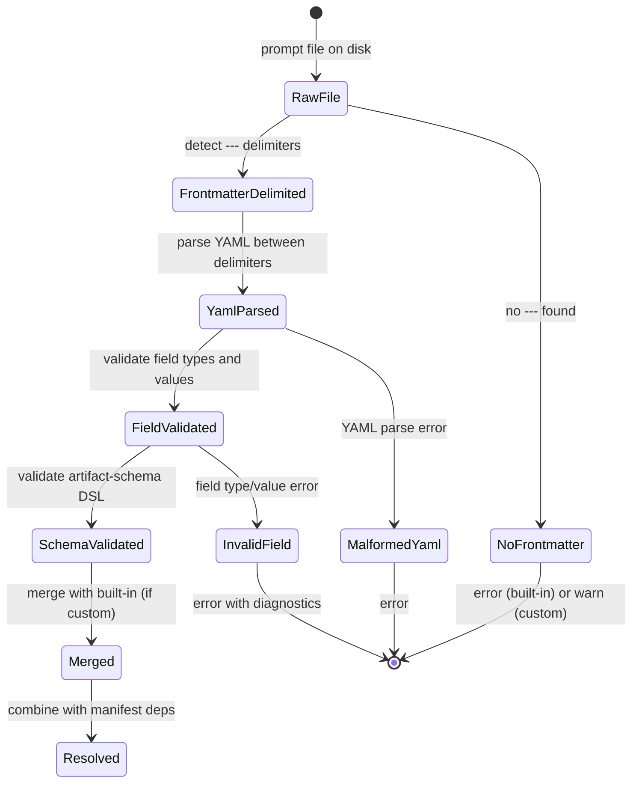

# Domain Model: Prompt Frontmatter Schema & Section Targeting

**Domain ID**: 08
**Phase**: 1 — Deep Domain Modeling
**Depends on**: None — first-pass modeling (defines schema consumed by domains 01, 02, 03, 05, 06, 07)
**Last updated**: 2026-03-12
**Status**: draft

---

## Section 1: Domain Overview

The Prompt Frontmatter Schema & Section Targeting domain defines the YAML metadata contract that every prompt file (base, override, extension, custom) must satisfy. Frontmatter is the declarative interface between prompt authors and the scaffold CLI — it tells the CLI what a prompt depends on, what it produces, what predecessor artifacts it needs to read, what structure its output must have, and what platform capabilities it requires.

**Role in the v2 architecture**: Frontmatter is the metadata glue that enables nearly every other domain:

- **Prompt resolution** ([domain 01](01-prompt-resolution.md)) reads frontmatter to merge metadata across override layers and resolve the effective prompt configuration.
- **Dependency resolution** ([domain 02](02-dependency-resolution.md)) reads `depends-on` to build the execution DAG.
- **Pipeline state machine** ([domain 03](03-pipeline-state-machine.md)) reads `produces` for completion detection and step gating.
- **Platform adapters** ([domain 05](05-platform-adapters.md)) read `requires-capabilities` to determine adapter compatibility.
- **Config validation** ([domain 06](06-config-validation.md)) validates `extra-prompts` entries resolve to files with valid frontmatter.
- **Brownfield/adopt** ([domain 07](07-brownfield-adopt.md)) uses `produces` to map existing files to completed prompts during v1 detection.

**Central design challenge**: Frontmatter must be simple enough for prompt authors to write by hand, yet precise enough for machine parsing and validation. The `reads` field with section targeting introduces a sub-language for extracting content from predecessor documents — this requires a well-defined heading-matching algorithm with clear behavior for edge cases (duplicate headings, nested headings, missing sections). The `artifact-schema` field introduces a validation DSL that must be expressive enough to catch real structural errors without becoming a full schema language.

---

## Section 2: Glossary

**frontmatter** — YAML metadata enclosed in `---` delimiters at the top of a prompt file. Parsed before the prompt body. All fields except `description` are optional for built-in prompts; all fields are optional for custom prompts.

**prompt file** — A markdown file containing frontmatter and prompt body text. One of four types: base prompt, override prompt, extension prompt, or custom prompt.

**base prompt** — A prompt file in the `base/` directory, shared across methodologies. Uses abstract task verbs and mixin insertion points.

**override prompt** — A prompt file in a methodology's `overrides/` directory that replaces a base prompt of the same slug.

**extension prompt** — A prompt file in a methodology's `extensions/` directory with no base equivalent. Exists only within that methodology.

**custom prompt** — A user-provided prompt in `.scaffold/prompts/` (project-level) or `~/.scaffold/prompts/` (user-level). Either overrides a built-in prompt (same slug) or adds a new prompt (listed in `extra-prompts`).

**section targeting** — The mechanism by which the `reads` field specifies individual sections of a predecessor document to extract, rather than loading the entire file. Reduces context window consumption.

**section extraction** — The algorithm that, given a file path and a list of heading texts, returns the content under those headings. The core algorithm of this domain.

**artifact schema** — A validation DSL declared in frontmatter under `artifact-schema` that defines the expected structure of produced artifacts. Checked by `scaffold validate`.

**tracking comment** — An HTML comment on line 1 of a produced artifact that records the prompt name, version, date, and methodology/mixin context. Separate from frontmatter (tracking comments are in *artifacts*, frontmatter is in *prompts*).

**predecessor artifact** — A file produced by a prompt earlier in the pipeline that the current prompt reads as input. Referenced via the `reads` field.

**capability** — A platform-level feature that a prompt declares it needs via `requires-capabilities`. Platform adapters check these declarations against platform support.

**effective source** — The final prompt file selected after applying the customization precedence chain (project-custom > user-custom > built-in). Its frontmatter is merged with the built-in's frontmatter per the merge rules.

---

## Section 3: Entity Model

```typescript
/**
 * Complete YAML frontmatter parsed from a prompt file.
 * This is the canonical schema — every frontmatter field is defined here.
 */
interface PromptFrontmatter {
  /**
   * Short description for pipeline display and help text.
   * Required for built-in prompts. Optional for custom prompts
   * (inherits from built-in if overriding, defaults to slug if extra).
   * Max recommended length: 80 characters.
   */
  description: string;

  /**
   * Prompt slugs this prompt depends on.
   * Used by dependency resolution (domain 02) to build the execution DAG.
   * Merged (union) with manifest dependencies if both declare deps.
   * Defaults to empty array if omitted.
   */
  'depends-on'?: string[];

  /**
   * Phase number for display grouping (1-based).
   * Used by prompt resolution for phase assignment, and by
   * `scaffold status` / `scaffold list` for display grouping.
   * Defaults to the phase of the last dependency, or 1 if no deps.
   */
  phase?: number;

  /**
   * Hint for argument substitution, shown in help output.
   * Displayed after the prompt name in `scaffold list` and `scaffold info`.
   * Example: "<tech constraints or preferences>"
   */
  'argument-hint'?: string;

  /**
   * Expected output file paths relative to the project root.
   * Required for built-in prompts. Optional for custom prompts.
   *
   * Consumers:
   * - Completion detection (domain 03): checks all files exist on disk
   * - Step gating (domain 03): verifies predecessor artifacts before execution
   * - v1 detection (domain 07): maps existing files to completed prompts
   * - Artifact-schema validation: validates structure of produced files
   * - state.json: copied into prompt status for quick lookup
   */
  produces?: string[];

  /**
   * Input file paths this prompt needs as context.
   * Supports two forms:
   * - Plain string: loads the full file (e.g., "docs/plan.md")
   * - Object with section targeting: loads specific sections only
   *
   * The CLI pre-loads these files (or sections) into context
   * before presenting the prompt to the agent.
   */
  reads?: ReadReference[];

  /**
   * Defines the expected structure of produced artifacts.
   * Keys are file paths (must be a subset of `produces`).
   * Used by `scaffold validate` to verify artifact structure.
   */
  'artifact-schema'?: Record<string, ArtifactSchemaDefinition>;

  /**
   * Platform capabilities the prompt requires to execute.
   * Checked by platform adapters against platform support.
   * Missing capabilities produce warnings with adaptation guidance,
   * not hard errors.
   */
  'requires-capabilities'?: Capability[];
}

/**
 * A single entry in the `reads` array.
 * Either a plain file path string or a section-targeted object.
 */
type ReadReference = string | SectionTargetedRead;

/**
 * A section-targeted read reference.
 * Extracts only specific sections from a predecessor document,
 * reducing context window consumption.
 */
interface SectionTargetedRead {
  /**
   * File path relative to project root.
   * Must match a `produces` entry of some predecessor prompt
   * (not validated at parse time — validated at step gating time).
   */
  path: string;

  /**
   * Heading texts of sections to extract.
   * Matched against markdown headings after stripping the `#` prefix
   * and leading/trailing whitespace.
   * Each entry matches the first heading in the document whose
   * stripped text equals the entry (case-sensitive).
   */
  sections: string[];
}

/**
 * Schema for validating a produced artifact's structure.
 * Each field is optional — omit fields where no validation is needed.
 */
interface ArtifactSchemaDefinition {
  /**
   * Exact markdown heading strings that must appear in the artifact.
   * Each entry includes the heading level prefix (e.g., "## Backend").
   * `scaffold validate` checks for literal string match on each line.
   * Order is not enforced — only presence.
   */
  'required-sections'?: string[];

  /**
   * Regex pattern for entity IDs within the artifact.
   * Example: "US-\\d{3}" for user story IDs.
   * Null explicitly means "no IDs are expected in this artifact."
   * When set, `scaffold validate` checks that at least one ID
   * matching this pattern exists in the artifact.
   */
  'id-format'?: string | null;

  /**
   * Whether the artifact must contain a summary index table
   * within the first 50 lines.
   * A table is detected by the presence of a markdown table header
   * row (a line matching /^\|.*\|$/) followed by a separator row
   * (a line matching /^\|[-:|]+\|$/).
   */
  'index-table'?: boolean;

  /**
   * Minimum number of entities matching `id-format` expected.
   * Used when a specific count is required (e.g., user stories
   * must have at least 10 entries). Defaults to 1 if `id-format`
   * is set and this is omitted.
   */
  'min-count'?: number;
}

/**
 * Platform capabilities that prompts can declare they need.
 * Each maps to a concrete platform feature:
 *
 * - 'user-interaction': prompt asks the user questions (e.g., via
 *   AskUserQuestionTool). Not available in fully automated/CI runs.
 * - 'filesystem-write': prompt creates or modifies files on disk.
 * - 'subagent': prompt delegates work to subagents (e.g., review agents).
 *   Not supported by all platforms (e.g., Codex lacks subagent support).
 * - 'mcp': prompt uses MCP tools (e.g., Playwright MCP).
 * - 'git': prompt runs git commands (branch, commit, push).
 */
type Capability =
  | 'user-interaction'
  | 'filesystem-write'
  | 'subagent'
  | 'mcp'
  | 'git';

/**
 * The result of parsing and validating a single prompt file's frontmatter.
 * Returned by the frontmatter parser before any cross-prompt merging.
 */
interface ParsedFrontmatter {
  /** Whether the file contained a valid frontmatter block */
  valid: boolean;

  /** The parsed frontmatter data (null if parsing failed) */
  data: PromptFrontmatter | null;

  /** Parsing errors, if any */
  errors: FrontmatterError[];

  /** Whether each field was explicitly present (vs. defaulted) */
  explicitFields: Set<keyof PromptFrontmatter>;

  /** The raw YAML text between the --- delimiters */
  rawYaml: string;

  /** Line number where frontmatter begins (always 1 for valid files) */
  startLine: number;

  /** Line number where frontmatter ends (the closing --- line) */
  endLine: number;
}

/**
 * Frontmatter after merging across override layers.
 * All fields have been resolved to their final values.
 * Produced by the merge algorithm in domain 01.
 */
interface ResolvedFrontmatter {
  /** Description from the effective source */
  description: string;

  /**
   * Merged dependencies: union of manifest dependencies and
   * frontmatter depends-on from the effective source.
   */
  dependsOn: string[];

  /** Phase number (from frontmatter, manifest, or inferred) */
  phase: number;

  /** Argument hint (from effective source) */
  argumentHint?: string;

  /** Produces list (from effective source) */
  produces: string[];

  /** Reads list (from effective source) */
  reads: ReadReference[];

  /** Artifact schema (from effective source) */
  artifactSchema?: Record<string, ArtifactSchemaDefinition>;

  /** Required capabilities (from effective source) */
  requiresCapabilities: Capability[];
}

/**
 * The result of extracting targeted sections from a document.
 */
interface SectionExtractionResult {
  /** The file path that was read */
  path: string;

  /** Successfully extracted sections */
  extractedSections: ExtractedSection[];

  /** Sections requested but not found */
  missingSections: string[];

  /** Total token estimate for the extracted content */
  estimatedTokens: number;
}

/**
 * A single section extracted from a document.
 */
interface ExtractedSection {
  /** The heading text that was matched */
  heading: string;

  /** The heading level (1-6, from # count) */
  level: number;

  /** The line number where the heading was found (1-based) */
  line: number;

  /**
   * The extracted content: everything from the heading line
   * to (but not including) the next heading at the same or
   * higher level, or end of file.
   */
  content: string;
}

/**
 * Result of validating a single artifact against its schema.
 */
interface ArtifactValidationResult {
  /** The artifact file path */
  path: string;

  /** Whether all schema checks passed */
  valid: boolean;

  /** Individual check results */
  checks: ArtifactCheck[];
}

/**
 * A single schema validation check result.
 */
interface ArtifactCheck {
  /** What was checked */
  check: 'required-section' | 'id-format' | 'index-table' | 'min-count';

  /** Whether the check passed */
  passed: boolean;

  /** Human-readable detail */
  detail: string;

  /** For required-section: the section heading that was checked */
  section?: string;

  /** For id-format/min-count: the count of matching IDs found */
  foundCount?: number;
}
```

**Entity relationships:**

```
PromptFrontmatter (parsed from prompt file)
  ├── contains → ReadReference[] (reads field)
  │     └── may be → SectionTargetedRead (with heading targets)
  ├── contains → ArtifactSchemaDefinition (per produces entry)
  ├── contains → Capability[] (requires-capabilities)
  ├── references → predecessor prompt slugs (depends-on)
  └── references → artifact file paths (produces, reads)

ParsedFrontmatter (parser output)
  ├── wraps → PromptFrontmatter
  ├── tracks → explicit vs. defaulted fields
  └── contains → FrontmatterError[] (parsing errors)

ResolvedFrontmatter (merge output, from domain 01)
  └── produced by merging → built-in PromptFrontmatter + custom PromptFrontmatter

SectionExtractionResult (section targeting output)
  ├── contains → ExtractedSection[] (found sections)
  └── contains → string[] (missing sections)

ArtifactValidationResult (validation output)
  └── contains → ArtifactCheck[] (per-check results)
```

---

## Section 4: State Transitions

Frontmatter itself is static data — it does not transition between states. However, frontmatter validation has a well-defined lifecycle during the `scaffold build` pipeline:



The lifecycle shows a linear validation pipeline applied to each prompt file during `scaffold build`. Errors at any stage halt processing for that specific prompt file but do not prevent other prompt files from being processed (errors are collected and reported together).

---

## Section 5: Core Algorithms

### Algorithm 1: Frontmatter Parsing

Extracts and validates YAML frontmatter from a prompt file.

**Input**: file path (string)
**Output**: `ParsedFrontmatter`

```
FUNCTION parseFrontmatter(filePath: string): ParsedFrontmatter
  content ← readFile(filePath)
  errors ← []

  // Step 1: Detect frontmatter delimiters
  // Frontmatter must start on line 1 with exactly "---"
  lines ← content.split("\n")
  IF lines[0].trim() ≠ "---"
    errors.append(FRONTMATTER_MISSING(filePath))
    RETURN { valid: false, data: null, errors, explicitFields: {}, rawYaml: "", startLine: 0, endLine: 0 }

  // Step 2: Find closing delimiter
  closingLine ← null
  FOR i FROM 1 TO lines.length - 1
    IF lines[i].trim() = "---"
      closingLine ← i
      BREAK

  IF closingLine IS null
    errors.append(FRONTMATTER_UNCLOSED(filePath))
    RETURN { valid: false, data: null, errors, explicitFields: {}, rawYaml: "", startLine: 1, endLine: 0 }

  // Step 3: Extract and parse YAML
  rawYaml ← lines[1..closingLine-1].join("\n")
  TRY
    parsed ← yamlParse(rawYaml)
  CATCH yamlError
    errors.append(FRONTMATTER_YAML_ERROR(filePath, yamlError.message, yamlError.line))
    RETURN { valid: false, data: null, errors, explicitFields: {}, rawYaml, startLine: 1, endLine: closingLine + 1 }

  // Step 4: Track which fields were explicitly set
  explicitFields ← SET(keys(parsed))

  // Step 5: Validate field types
  data ← {}
  data.description ← validateString(parsed, "description", errors, filePath)
  data["depends-on"] ← validateStringArray(parsed, "depends-on", errors, filePath)
  data.phase ← validatePositiveInteger(parsed, "phase", errors, filePath)
  data["argument-hint"] ← validateString(parsed, "argument-hint", errors, filePath)
  data.produces ← validateStringArray(parsed, "produces", errors, filePath)
  data.reads ← validateReadsArray(parsed, "reads", errors, filePath)
  data["artifact-schema"] ← validateArtifactSchema(parsed, "artifact-schema", errors, filePath)
  data["requires-capabilities"] ← validateCapabilities(parsed, "requires-capabilities", errors, filePath)

  // Step 6: Check for unknown fields
  knownFields ← {"description", "depends-on", "phase", "argument-hint",
                  "produces", "reads", "artifact-schema", "requires-capabilities"}
  FOR EACH key IN keys(parsed)
    IF key NOT IN knownFields
      errors.append(FRONTMATTER_UNKNOWN_FIELD(filePath, key, knownFields))

  RETURN {
    valid: errors.length = 0,
    data: errors.length = 0 ? data : null,
    errors,
    explicitFields,
    rawYaml,
    startLine: 1,
    endLine: closingLine + 1
  }
```

**Complexity**: O(L) where L is the number of lines in the file (for delimiter scanning), plus O(F) for field validation where F is the number of frontmatter fields.

### Algorithm 2: Section Extraction

The most important algorithm in this domain. Given a file path and a list of heading texts, extracts the content under those headings.

**Input**: file path (string), target headings (string[])
**Output**: `SectionExtractionResult`

```
FUNCTION extractSections(
  filePath: string,
  targetHeadings: string[]
): SectionExtractionResult

  content ← readFile(filePath)
  lines ← content.split("\n")
  extractedSections ← []
  missingSections ← []
  matchedHeadings ← SET()

  // Step 1: Build a heading index — scan the entire file for markdown headings
  headingIndex ← []
  FOR i FROM 0 TO lines.length - 1
    line ← lines[i]
    match ← line.match(/^(#{1,6})\s+(.+)$/)
    IF match IS NOT null
      level ← match[1].length        // number of # characters
      text ← match[2].trim()         // heading text after stripping # and whitespace
      headingIndex.append({ line: i + 1, level, text, rawLine: line })

  // Step 2: For each target heading, find the first match
  FOR EACH target IN targetHeadings
    // Normalize target: strip leading # if the user included them
    normalizedTarget ← target.replace(/^#+\s*/, "").trim()

    // Find first heading whose text matches (case-sensitive, exact match)
    matchIdx ← null
    FOR j FROM 0 TO headingIndex.length - 1
      IF headingIndex[j].text = normalizedTarget AND j NOT IN matchedHeadings
        matchIdx ← j
        matchedHeadings.add(j)
        BREAK

    IF matchIdx IS null
      missingSections.append(target)
      CONTINUE

    heading ← headingIndex[matchIdx]

    // Step 3: Extract content from heading to next same-or-higher-level heading
    // "Same or higher level" means heading level ≤ the matched heading's level.
    // For a ## heading (level 2), extraction stops at the next ## or #.
    // Nested headings (###, ####, etc.) are included in the extraction.
    startLine ← heading.line  // 1-based, inclusive (includes the heading line itself)

    // Find the end boundary
    endLine ← lines.length    // default: end of file
    FOR k FROM matchIdx + 1 TO headingIndex.length - 1
      IF headingIndex[k].level ≤ heading.level
        endLine ← headingIndex[k].line - 1  // stop before the next same/higher heading
        BREAK

    // Extract content (includes the heading line)
    sectionContent ← lines[startLine - 1 .. endLine - 1].join("\n")

    extractedSections.append({
      heading: target,
      level: heading.level,
      line: heading.line,
      content: sectionContent
    })

  RETURN {
    path: filePath,
    extractedSections,
    missingSections,
    estimatedTokens: estimateTokens(extractedSections.map(s => s.content).join("\n"))
  }
```

**Heading matching rules:**

1. **Case-sensitive exact match**: The heading text (after stripping `#` prefix and whitespace) must exactly match the target string. `"Quick Reference"` matches `## Quick Reference` but not `## quick reference` or `## Quick Reference Table`.

2. **Level-insensitive matching**: The match considers only the text, not the heading level. `"Backend"` matches both `## Backend` and `### Backend`. The first match wins.

3. **First-match semantics**: If a document contains multiple headings with the same text (at any level), only the first occurrence is matched. Subsequent identical headings are not extracted.

4. **Target normalization**: If the target string includes `#` prefixes (e.g., `"## Backend"`), they are stripped before matching. This allows targets to be written either as `"Backend"` or `"## Backend"` — both match the same heading.

5. **Nested heading inclusion**: Content extraction includes all nested headings under the matched heading. A `## Backend` section includes any `### ...` or `#### ...` headings within it, up to the next `##` or `#` heading.

6. **No overlap**: Each heading in the source document can be matched by at most one target. If targets `["Backend", "Backend"]` appear in the list, only the first occurrence matches and the second is reported as missing.

**Complexity**: O(L + T×H) where L is file line count, T is target count, H is heading count. In practice, T and H are small (typically <20), making this effectively O(L).

### Algorithm 3: Artifact Schema Validation

Validates a produced artifact against its declared schema.

**Input**: artifact file path, `ArtifactSchemaDefinition`
**Output**: `ArtifactValidationResult`

```
FUNCTION validateArtifactSchema(
  artifactPath: string,
  schema: ArtifactSchemaDefinition
): ArtifactValidationResult

  content ← readFile(artifactPath)
  lines ← content.split("\n")
  checks ← []

  // Check 1: Required sections
  IF schema["required-sections"] IS defined
    FOR EACH sectionHeading IN schema["required-sections"]
      // Exact line match — the heading string must appear as a complete line
      // (after trimming trailing whitespace)
      found ← lines.some(line => line.trimEnd() = sectionHeading)
      checks.append({
        check: "required-section",
        passed: found,
        detail: found
          ? "Found: " + sectionHeading
          : "Missing required section: " + sectionHeading,
        section: sectionHeading
      })

  // Check 2: ID format
  IF schema["id-format"] IS defined AND schema["id-format"] ≠ null
    regex ← new RegExp(schema["id-format"], "g")
    allMatches ← content.match(regex) OR []
    uniqueIds ← SET(allMatches)
    minCount ← schema["min-count"] OR 1
    checks.append({
      check: "id-format",
      passed: uniqueIds.size ≥ minCount,
      detail: "Found " + uniqueIds.size + " unique IDs matching " + schema["id-format"]
        + " (minimum: " + minCount + ")",
      foundCount: uniqueIds.size
    })

  // Check 3: Index table
  IF schema["index-table"] IS defined AND schema["index-table"] = true
    // Search first 50 lines for a markdown table
    searchLines ← lines[0..49]
    hasTable ← false
    FOR i FROM 0 TO searchLines.length - 2
      IF searchLines[i].match(/^\|.*\|$/) AND searchLines[i+1].match(/^\|[-:|]+\|$/)
        hasTable ← true
        BREAK
    checks.append({
      check: "index-table",
      passed: hasTable,
      detail: hasTable
        ? "Index table found within first 50 lines"
        : "No index table found in first 50 lines"
    })

  RETURN {
    path: artifactPath,
    valid: checks.every(c => c.passed),
    checks
  }
```

**Complexity**: O(L×S + L×R) where L is line count, S is number of required sections, and R is regex complexity. In practice, S < 20 and R is simple pattern matching.

### Algorithm 4: Frontmatter Merging

When a project-level or user-level custom prompt overrides a built-in prompt, frontmatter fields are merged according to per-field rules. This algorithm is defined here but executed within prompt resolution ([domain 01](01-prompt-resolution.md)).

**Input**: built-in `PromptFrontmatter`, custom `PromptFrontmatter`, custom `explicitFields`
**Output**: `ResolvedFrontmatter`

```
FUNCTION mergeFrontmatter(
  builtIn: PromptFrontmatter,
  custom: PromptFrontmatter,
  customExplicit: Set<string>
): ResolvedFrontmatter

  merged ← {}

  // === Per-field merge rules ===

  // description: custom wins if explicitly present, else built-in
  merged.description ← "description" IN customExplicit
    ? custom.description
    : builtIn.description

  // depends-on: UNION (additive merge)
  //   Rationale: removing built-in deps could break the pipeline.
  //   Custom can ADD deps but not REMOVE them.
  //   An explicit empty [] in custom means "no custom deps" — built-in deps still apply.
  builtInDeps ← builtIn["depends-on"] OR []
  customDeps ← custom["depends-on"] OR []
  merged.dependsOn ← UNION(builtInDeps, customDeps)

  // phase: custom wins if explicitly present, else built-in, else inferred
  IF "phase" IN customExplicit
    merged.phase ← custom.phase
  ELSE IF builtIn.phase IS defined
    merged.phase ← builtIn.phase
  ELSE
    merged.phase ← inferPhaseFromDeps(merged.dependsOn)

  // argument-hint: custom wins if explicitly present
  merged.argumentHint ← "argument-hint" IN customExplicit
    ? custom["argument-hint"]
    : builtIn["argument-hint"]

  // produces: custom REPLACES entirely if explicitly present
  //   Rationale: if a custom prompt produces different artifacts,
  //   the custom list is authoritative.
  merged.produces ← "produces" IN customExplicit
    ? custom.produces
    : (builtIn.produces OR [])

  // reads: custom REPLACES entirely if explicitly present
  merged.reads ← "reads" IN customExplicit
    ? custom.reads
    : (builtIn.reads OR [])

  // artifact-schema: custom REPLACES entirely if explicitly present
  merged.artifactSchema ← "artifact-schema" IN customExplicit
    ? custom["artifact-schema"]
    : builtIn["artifact-schema"]

  // requires-capabilities: custom REPLACES entirely if explicitly present
  merged.requiresCapabilities ← "requires-capabilities" IN customExplicit
    ? custom["requires-capabilities"]
    : (builtIn["requires-capabilities"] OR [])

  RETURN merged
```

**Merge rule summary table:**

| Field | Merge Strategy | Rationale |
|-------|---------------|-----------|
| `description` | Custom wins | Custom prompt may have different purpose |
| `depends-on` | Union (additive) | Removing deps could break pipeline ordering |
| `phase` | Custom wins | Custom may belong in different phase |
| `argument-hint` | Custom wins | Custom may have different arguments |
| `produces` | Custom replaces | Custom produces different artifacts |
| `reads` | Custom replaces | Custom may need different inputs |
| `artifact-schema` | Custom replaces | Custom artifacts have different structure |
| `requires-capabilities` | Custom replaces | Custom may need different platform features |

**Key design decision**: `depends-on` uses union (additive) merge while all other list/object fields use replacement. This asymmetry exists because dependency removal is dangerous (could create ordering violations that break the pipeline), while other fields are genuinely independent per-prompt metadata where the custom version is authoritative.

### Algorithm 5: Reads Pre-loading

Loads predecessor artifacts into context before prompt execution. Called by `scaffold resume` to build the context block.

**Input**: `ReadReference[]` from resolved frontmatter
**Output**: structured context for the agent

```
FUNCTION preloadReads(
  reads: ReadReference[],
  projectRoot: string
): PreloadResult

  sections ← []
  warnings ← []

  FOR EACH ref IN reads
    IF typeof ref = "string"
      // Full-file read
      path ← resolve(projectRoot, ref)
      IF NOT fileExists(path)
        warnings.append(READS_FILE_MISSING(ref))
        CONTINUE
      content ← readFile(path)
      sections.append({
        source: ref,
        type: "full-file",
        content: content
      })

    ELSE
      // Section-targeted read
      path ← resolve(projectRoot, ref.path)
      IF NOT fileExists(path)
        warnings.append(READS_FILE_MISSING(ref.path))
        CONTINUE
      result ← extractSections(path, ref.sections)
      FOR EACH missing IN result.missingSections
        warnings.append(READS_SECTION_MISSING(ref.path, missing))
      FOR EACH extracted IN result.extractedSections
        sections.append({
          source: ref.path + " > " + extracted.heading,
          type: "section",
          content: extracted.content
        })

  RETURN { sections, warnings }
```

---

## Section 6: Error Taxonomy

All error codes use the prefix `FRONTMATTER_` for parsing/validation errors, `READS_` for section targeting errors, `SCHEMA_` for artifact-schema errors, and `ARTIFACT_` for runtime artifact validation errors.

### Parsing Errors

| Code | Severity | Message Template | Recovery |
|------|----------|-----------------|----------|
| `FRONTMATTER_MISSING` | error | `Prompt file '{path}' has no YAML frontmatter (no opening --- delimiter on line 1)` | Add `---` delimiters and required fields to the prompt file |
| `FRONTMATTER_UNCLOSED` | error | `Prompt file '{path}' has unclosed frontmatter (opening --- but no closing ---)` | Add closing `---` delimiter |
| `FRONTMATTER_YAML_ERROR` | error | `Malformed YAML in frontmatter of '{path}' at line {line}: {yamlError}` | Fix the YAML syntax error at the indicated line |
| `FRONTMATTER_UNKNOWN_FIELD` | warning | `Unknown field '{field}' in frontmatter of '{path}'. Known fields: {knownFields}` | Remove the unknown field or check for typos |

### Field Validation Errors

| Code | Severity | Message Template | Recovery |
|------|----------|-----------------|----------|
| `FRONTMATTER_DESCRIPTION_MISSING` | error | `Required field 'description' missing in frontmatter of '{path}'` | Add a `description` field (required for built-in prompts) |
| `FRONTMATTER_DESCRIPTION_TYPE` | error | `Field 'description' in '{path}' must be a string, got {type}` | Change `description` value to a quoted string |
| `FRONTMATTER_DEPENDS_TYPE` | error | `Field 'depends-on' in '{path}' must be an array of strings, got {type}` | Use array syntax: `depends-on: [prompt-a, prompt-b]` |
| `FRONTMATTER_DEPENDS_INVALID_SLUG` | error | `Dependency '{slug}' in '{path}' is not a valid prompt slug (must be kebab-case, a-z0-9 and hyphens)` | Fix the slug to use kebab-case |
| `FRONTMATTER_PHASE_TYPE` | error | `Field 'phase' in '{path}' must be a positive integer, got {value}` | Use a positive integer (1-7) |
| `FRONTMATTER_PRODUCES_TYPE` | error | `Field 'produces' in '{path}' must be an array of strings, got {type}` | Use array syntax: `produces: ["docs/output.md"]` |
| `FRONTMATTER_READS_TYPE` | error | `Field 'reads' in '{path}' must be an array of strings or section-target objects, got {type}` | Use array syntax with strings or `{path, sections}` objects |
| `FRONTMATTER_READS_INVALID_ENTRY` | error | `Entry {index} in 'reads' of '{path}' is invalid: must be a string or object with 'path' and 'sections' fields` | Fix the entry to be either a string or `{path: "...", sections: [...]}` |
| `FRONTMATTER_READS_SECTIONS_TYPE` | error | `Field 'sections' in reads entry for '{readsPath}' in '{path}' must be a non-empty array of strings` | Provide at least one section heading string |
| `FRONTMATTER_CAPABILITIES_TYPE` | error | `Field 'requires-capabilities' in '{path}' must be an array of valid capability strings, got {type}` | Use array syntax with valid values: user-interaction, filesystem-write, subagent, mcp, git |
| `FRONTMATTER_CAPABILITY_UNKNOWN` | warning | `Unknown capability '{value}' in '{path}'. Valid capabilities: {validList}` | Use one of the recognized capability values |
| `FRONTMATTER_PRODUCES_MISSING` | warning | `Built-in prompt '{path}' has no 'produces' field — completion detection will be unavailable` | Add a `produces` field listing output file paths |

### Artifact Schema Errors

| Code | Severity | Message Template | Recovery |
|------|----------|-----------------|----------|
| `SCHEMA_INVALID_STRUCTURE` | error | `Field 'artifact-schema' in '{path}' must be an object mapping file paths to schema definitions` | Restructure as `artifact-schema: { "file.md": { ... } }` |
| `SCHEMA_PATH_NOT_IN_PRODUCES` | warning | `Artifact schema key '{schemaPath}' in '{path}' is not listed in 'produces'` | Either add the path to `produces` or remove it from `artifact-schema` |
| `SCHEMA_SECTIONS_TYPE` | error | `Field 'required-sections' for '{schemaPath}' in '{path}' must be an array of strings` | Use array syntax: `required-sections: ["## Section A"]` |
| `SCHEMA_ID_FORMAT_INVALID` | error | `Field 'id-format' for '{schemaPath}' in '{path}' is not a valid regex: {regexError}` | Fix the regex pattern |
| `SCHEMA_INDEX_TABLE_TYPE` | error | `Field 'index-table' for '{schemaPath}' in '{path}' must be a boolean` | Use `true` or `false` |

### Section Targeting Errors

| Code | Severity | Message Template | Recovery |
|------|----------|-----------------|----------|
| `READS_FILE_MISSING` | warning | `Reads target '{path}' does not exist on disk. It may not have been produced yet.` | Run the predecessor prompt that produces this file, or check the path |
| `READS_SECTION_MISSING` | warning | `Section '{heading}' not found in '{path}'. Available headings: {availableList}` | Check spelling, case, and heading level in the target document |
| `READS_FILE_EMPTY` | warning | `Reads target '{path}' exists but is empty` | Run the predecessor prompt to populate the file |

### Artifact Validation Errors (runtime, from `scaffold validate`)

| Code | Severity | Message Template | Recovery |
|------|----------|-----------------|----------|
| `ARTIFACT_SECTION_MISSING` | error | `Required section '{section}' not found in '{artifactPath}' (expected by prompt '{promptSlug}')` | Add the missing section heading to the artifact |
| `ARTIFACT_NO_IDS` | error | `No IDs matching pattern '{pattern}' found in '{artifactPath}' (expected by prompt '{promptSlug}')` | Add entities with IDs matching the declared pattern |
| `ARTIFACT_ID_COUNT_LOW` | warning | `Found {count} IDs matching '{pattern}' in '{artifactPath}', expected at least {min}` | Add more entities or adjust the min-count in the schema |
| `ARTIFACT_NO_INDEX_TABLE` | error | `No index table found in first 50 lines of '{artifactPath}' (expected by prompt '{promptSlug}')` | Add a markdown table summarizing entities near the top of the file |
| `ARTIFACT_FILE_MISSING` | error | `Artifact '{artifactPath}' declared in 'produces' by prompt '{promptSlug}' does not exist` | Run the prompt to produce the artifact |

**JSON error format** (consistent with [domain 06](06-config-validation.md)):

```json
{
  "code": "FRONTMATTER_YAML_ERROR",
  "severity": "error",
  "file": "base/tech-stack.md",
  "line": 3,
  "field": null,
  "message": "Malformed YAML in frontmatter of 'base/tech-stack.md' at line 3: unexpected end of stream",
  "recovery": "Fix the YAML syntax error at the indicated line"
}
```

---

## Section 7: Integration Points

This domain has the most consumers of any domain in the system. Frontmatter fields are read by nearly every other domain.

### Consumers by Field

| Field | Consumer Domain | How It's Used |
|-------|----------------|---------------|
| `description` | 01 (Prompt Resolution) | Copied to `ResolvedFrontmatter` for display |
| `description` | 09 (CLI Architecture) | Shown in `scaffold list`, `scaffold info` |
| `depends-on` | 01 (Prompt Resolution) | Merged with manifest dependencies |
| `depends-on` | 02 (Dependency Resolution) | Input to Kahn's topological sort |
| `phase` | 01 (Prompt Resolution) | Phase assignment for display grouping |
| `phase` | 09 (CLI Architecture) | Phase headers in `scaffold status` |
| `argument-hint` | 09 (CLI Architecture) | Shown in `scaffold list --verbose` |
| `produces` | 03 (Pipeline State Machine) | Completion detection (artifact existence check) |
| `produces` | 03 (Pipeline State Machine) | Step gating (predecessor artifact verification) |
| `produces` | 07 (Brownfield/Adopt) | v1 artifact detection and prompt mapping |
| `produces` | 09 (CLI Architecture) | Shown in `scaffold info <prompt>` |
| `reads` | 03 (Pipeline State Machine) | Context pre-loading before prompt execution |
| `reads` | 09 (CLI Architecture) | Context file list in `scaffold resume` output |
| `artifact-schema` | 06 (Config Validation) | Input to `scaffold validate` |
| `artifact-schema` | 12 (Mixin Injection) | Constraint: mixins must not add `##`+ headings |
| `requires-capabilities` | 05 (Platform Adapters) | Capability compatibility check |

### Producers (Who Writes Frontmatter)

| Source | Description |
|--------|-------------|
| Prompt authors | Write frontmatter in base/override/extension prompt files |
| Custom prompt users | Write frontmatter in `.scaffold/prompts/` or `~/.scaffold/prompts/` files |
| `scaffold build` | Parses and validates frontmatter, passes to resolution |
| Domain 01 (Prompt Resolution) | Merges frontmatter across override layers |

### Integration with Tracking Comments

Tracking comments and frontmatter serve different roles and appear in different files:

| Aspect | Frontmatter | Tracking Comment |
|--------|------------|------------------|
| Location | In **prompt files** (`.md` files in `base/`, `overrides/`, etc.) | On line 1 of **produced artifacts** (e.g., `docs/tech-stack.md`) |
| Format | YAML between `---` delimiters | `<!-- scaffold:<prompt-name> v<version> <date> <methodology>/<mixin-summary> -->` |
| Purpose | Declares prompt metadata for CLI orchestration | Records which prompt produced the artifact and under what config |
| Consumers | Resolution, dependency, state, adapters, validation | Mode Detection (update vs. fresh), `scaffold adopt`, implementation agents |
| Authoring | Written by prompt authors | Generated by the CLI when producing artifacts |

The tracking comment includes methodology/mixin context because the same prompt may produce different output under different configurations. Frontmatter does not include this context because prompts are configuration-independent — the same frontmatter applies regardless of which methodology or mixins are active.

---

## Section 8: Edge Cases & Failure Modes

This section answers every mandatory question from the domain definition.

### MQ1: Complete Frontmatter Schema

Fully defined in Section 3 as the `PromptFrontmatter` interface. Summary of all fields:

| Field | Type | Required | Default | Validation | Consumers |
|-------|------|----------|---------|------------|-----------|
| `description` | `string` | Yes (built-in), No (custom) | slug name | Non-empty string, max 80 chars recommended | Resolution, CLI display |
| `depends-on` | `string[]` | No | `[]` | Each entry must be a valid kebab-case slug | Resolution, Dependency DAG |
| `phase` | `number` | No | Phase of last dep, or 1 | Positive integer 1-7 | Resolution, CLI display |
| `argument-hint` | `string` | No | `undefined` | Non-empty string if present | CLI help display |
| `produces` | `string[]` | Yes (built-in), No (custom) | `[]` | Each entry is a relative file path | Completion, Step gating, v1 detection |
| `reads` | `ReadReference[]` | No | `[]` | Each entry is a string or `{path, sections}` | Context pre-loading |
| `artifact-schema` | `Record<string, ArtifactSchemaDefinition>` | No | `undefined` | Keys must be in `produces`, valid DSL | `scaffold validate` |
| `requires-capabilities` | `Capability[]` | No | `[]` | Each entry must be a known capability | Platform adapters |

### MQ2: Section Targeting Heading Matching

Defined in Algorithm 2 (Section Extraction). Key rules:

- **Exact text match**: After stripping `#` prefix and whitespace, the heading text must exactly match the target (case-sensitive).
- **Duplicate headings**: First match wins. If a document has two `## Backend` headings, only the first is extracted. The second identical target in the `sections` array would be reported as missing.
- **Nested headings**: Included in the extraction. A `## Backend` extraction includes all `###`, `####`, etc. headings beneath it, stopping at the next `##` or `#`.
- **Level sensitivity**: Matching is level-insensitive (text only). Extraction boundary is level-sensitive (stops at same or higher level).

### MQ3: Missing Targeted Section Behavior

When a targeted section doesn't exist in the predecessor artifact:

- **During `scaffold build`**: No error — `reads` validation is deferred to runtime because artifacts may not exist yet at build time. The `reads` field is syntactically validated (correct structure) but not semantically validated (files/sections exist).
- **During `scaffold resume` (runtime)**: A **warning** is emitted listing the missing section and available headings. The prompt still executes — the missing section is simply omitted from the pre-loaded context. This is a warning, not an error, because:
  1. The predecessor artifact may have been written without the expected section (e.g., the user manually edited it).
  2. The prompt may still function without that specific section (it's context, not a hard dependency).
  3. Hard errors would block the pipeline for non-critical context loading issues.

The warning includes available headings to help the user identify typos:
```
Warning: Section 'Quick Referencee' not found in 'docs/tech-stack.md'.
Available headings: Architecture Overview, Backend, Database, Frontend,
Infrastructure & DevOps, Developer Tooling, Third-Party Services, Quick Reference
```

### MQ4: Artifact-Schema DSL

Fully defined in Section 3 (`ArtifactSchemaDefinition`). The spec defines three fields plus one addition:

| Field | Definition | Syntax | Validation Behavior |
|-------|-----------|--------|-------------------|
| `required-sections` | Exact markdown heading strings that must appear | Array of strings including `##` prefix, e.g., `["## Backend", "## Frontend"]` | `scaffold validate` checks each line for exact match |
| `id-format` | Regex pattern for entity IDs | String (regex), or `null` for no IDs | `scaffold validate` scans artifact content for matches |
| `index-table` | Whether a summary table must exist in first 50 lines | Boolean | `scaffold validate` checks for markdown table pattern |
| `min-count` | Minimum number of entities matching `id-format` | Positive integer, defaults to 1 | `scaffold validate` counts unique ID matches |

**Additional useful validation fields not in the spec** (recommended for future ADR):

- `tracking-comment`: Boolean — whether the artifact must have a tracking comment on line 1. Could be implied for all built-in prompt artifacts.
- `max-length`: Integer — maximum line count for the artifact. Useful for enforcing CLAUDE.md's ~2000 token budget.

These are documented in Section 10 (Open Questions) as candidates for future addition rather than being included in the schema now, to avoid scope creep.

### MQ5: Frontmatter Merging Rules

Fully defined in Algorithm 4 (Frontmatter Merging). Per-field rules:

| Field | Rule | Detail |
|-------|------|--------|
| `description` | Custom wins | If custom explicitly declares `description`, it replaces built-in |
| `depends-on` | Union | Both built-in and custom deps apply; custom cannot remove built-in deps |
| `phase` | Custom wins | Custom can reassign the prompt to a different phase |
| `argument-hint` | Custom wins | Custom may have different argument semantics |
| `produces` | Custom replaces | Custom artifacts are authoritative if explicitly declared |
| `reads` | Custom replaces | Custom context needs are authoritative |
| `artifact-schema` | Custom replaces | Custom artifact structure is authoritative |
| `requires-capabilities` | Custom replaces | Custom platform needs are authoritative |

The `explicitFields` tracking in `ParsedFrontmatter` is critical: it distinguishes "field was not present" (inherit from built-in) from "field was explicitly set to an empty value" (custom is authoritative). For example, a custom prompt with `reads: []` explicitly declares it needs no context, while a custom prompt that omits `reads` entirely inherits the built-in's reads list.

### MQ6: Extension Prompts with No Base

Extension prompts (prefixed `ext:` in the manifest) have no corresponding base prompt. All metadata comes from the extension's own frontmatter.

**Mandatory fields for extension prompts:**

| Field | Required? | Reason |
|-------|-----------|--------|
| `description` | Yes | Same as base — needed for display |
| `depends-on` | Yes (recommended) | Extensions must declare their position in the DAG. Without deps, they float to the beginning of their phase, which may be incorrect. |
| `phase` | Yes (recommended) | Without a base to inherit from, phase must be explicitly declared or it defaults to 1 |
| `produces` | Yes (for built-in extensions) | Completion detection requires this |
| All others | No | Same optional rules as base/override |

**Difference from base/override prompts**: Base and override prompts have a fallback — the manifest's `dependencies` section declares dependencies that supplement frontmatter `depends-on`. Extensions may or may not appear in the manifest's `dependencies`. If an extension is referenced in a manifest phase but has no entry in the manifest `dependencies` and declares no frontmatter `depends-on`, it has zero dependencies and will be among the first prompts eligible for execution — which is rarely correct for an extension.

**Recommendation**: The frontmatter validator should emit a warning (not error) when an extension prompt omits `depends-on` and is not listed in the manifest's `dependencies` section.

### MQ7: The `produces` Field in Detail

The `produces` field is the most cross-domain field in frontmatter. Its consumers and their behavior when `produces` is missing:

| Consumer | Domain | Behavior When `produces` Missing |
|----------|--------|--------------------------------|
| Completion detection | 03 | Cannot detect completion automatically. The prompt's status must be set manually or via timeout. |
| Step gating | 03 | No artifacts to verify for downstream prompts. Downstream prompts skip the gating check for this predecessor. |
| v1 detection | 07 | Cannot map this prompt to existing files. The prompt is always marked `pending` in the inferred state. |
| Artifact-schema validation | 08 | No artifacts to validate — `artifact-schema` has no effect without `produces`. A warning is emitted if `artifact-schema` is present but `produces` is empty/missing. |
| `state.json` | 03 | The `produces` array in the state entry is empty — agents querying state cannot determine expected outputs. |
| `scaffold info` | 09 | Shows "No artifacts" in the output display. |

**Important**: `produces` is required for built-in prompts specifically because these consumers need it. Custom/extra prompts can omit it, but doing so disables completion detection and step gating for that prompt.

### MQ8: Frontmatter Validation Timing

Frontmatter is validated at **build time** (`scaffold build`), not at load time or runtime:

1. **Build time** (`scaffold build`): All prompt files are located, their frontmatter is parsed and validated, and the resolved prompt set is generated. This is the single point where frontmatter errors are caught. Invalid frontmatter causes a build failure (exit code 1).

2. **Runtime** (`scaffold resume`): Frontmatter is already parsed and cached from the build step. Runtime only uses the resolved frontmatter — it does not re-parse prompt files.

**Malformed YAML handling**:
- Malformed YAML in a prompt file's frontmatter produces an error with the YAML parser's line number and error message.
- The error includes the file path, the offending line, and the YAML error message.
- The prompt is excluded from the resolved set, and `scaffold build` fails.

**Unknown field handling**:
- Unknown fields produce a **warning**, not an error. This allows forward compatibility — if a future version adds a new field, prompts authored for that version can be used with an older CLI without breaking.
- The warning lists the unknown field name and all known field names.

### MQ9: Tracking Comments vs. Frontmatter

These serve fundamentally different purposes and exist in different files:

| Aspect | Tracking Comment | Frontmatter |
|--------|-----------------|-------------|
| **In what file** | Produced artifacts (`docs/tech-stack.md`) | Prompt files (`base/tech-stack.md`) |
| **Written by** | CLI (injected on line 1 when artifact is produced) | Prompt author (handwritten) |
| **Contains** | Prompt name, version, date, methodology, mixin summary | Dependencies, produces, reads, schema, capabilities |
| **Purpose** | Runtime provenance — "what produced this file and when" | Build-time orchestration — "how to schedule this prompt" |
| **Mutability** | Updated each time the prompt runs (new version, date) | Static (changed only by prompt authors) |
| **Consumed by** | Mode Detection, `scaffold adopt`, human readers | Prompt resolution, dependency resolution, state machine |

**Coexistence**: They never conflict because they're in different files. A prompt file has frontmatter at the top; the artifact that prompt produces has a tracking comment at the top. The only potential confusion is when reading a prompt file that itself was produced by another tool — in that case, the prompt file might have both a tracking comment (from the tool) and frontmatter (for scaffold). The frontmatter parser only looks for `---` delimiters, so an HTML comment on line 1 before the `---` would cause a `FRONTMATTER_MISSING` error. **Rule**: Prompt files must always start with `---` on line 1 — no content before frontmatter.

### MQ10: Section Extraction Algorithm

Fully defined in Algorithm 2 (Section Extraction). Summary of edge case handling:

| Scenario | Behavior |
|----------|----------|
| Heading found | Content extracted from heading line to next same-or-higher-level heading (or EOF) |
| Heading not found | Added to `missingSections` list, warning emitted, prompt continues without it |
| Multiple matches | First match wins; subsequent identical headings are ignored |
| Heading at different levels | Level-insensitive matching — `"Backend"` matches both `## Backend` and `### Backend` |
| Content between target and next same-level heading | Included (this is the extraction boundary rule) |
| Target includes `#` prefix | Stripped before matching — `"## Backend"` and `"Backend"` are equivalent targets |
| Empty section (heading immediately followed by same-level heading) | Extracted content is just the heading line itself |
| Heading with inline formatting | Matched after formatting — `## **Backend**` does NOT match `"Backend"` (the `**` is part of the text). This is intentional to keep matching simple and predictable. |
| File does not exist | `READS_FILE_MISSING` warning, no extraction attempted |
| File is empty | `READS_FILE_EMPTY` warning, no headings to extract |
| Heading at EOF (no content after it) | Extracted content is the heading line plus any trailing content to EOF |

---

## Section 9: Testing Considerations

### Unit Tests

| Component | Test Strategy | Key Cases |
|-----------|--------------|-----------|
| Frontmatter parser | Parse various prompt files, verify `ParsedFrontmatter` output | Valid complete, valid minimal, missing delimiters, unclosed delimiters, malformed YAML, unknown fields, wrong field types |
| Section extraction | Provide markdown content + targets, verify extraction | Single heading, multiple headings, nested headings, duplicate headings, missing headings, heading at different levels, heading at EOF, empty file |
| Artifact schema validation | Provide artifact content + schema, verify checks | All sections present, missing section, ID format match/miss, index table present/absent, min-count threshold |
| Frontmatter merging | Provide built-in + custom frontmatter, verify merge | All fields custom, no fields custom, depends-on union, explicit empty arrays, missing built-in fields |
| Reads pre-loading | Provide reads list + file system state, verify output | Full-file reads, section-targeted reads, missing files, missing sections, mixed reads |

### Integration Tests

| Scenario | Description |
|----------|-------------|
| `scaffold build` with valid prompts | Build resolves all frontmatter, produces correct `ResolutionResult` |
| `scaffold build` with frontmatter error | Build fails with exit code 1, error message includes file path and line |
| `scaffold validate` with schema | Validates produced artifacts against declared schemas |
| `scaffold resume` with section targeting | Pre-loads correct sections, emits warnings for missing sections |
| Custom prompt override with partial frontmatter | Merges correctly, inherited fields match built-in |

### Edge Case Tests

- Frontmatter with only `---` delimiters and no content between them (empty frontmatter)
- Frontmatter with Unicode characters in field values
- `reads` with deeply nested section targeting (heading level 5+)
- `produces` with paths containing special characters
- `artifact-schema` with regex that contains YAML-special characters (requires escaping)
- `depends-on` containing a self-reference (prompt depends on itself)
- `reads` containing a circular reference (prompt reads its own produces)
- Section extraction on a file with no headings at all
- Section extraction where target heading appears inside a code block (should not match)

### Performance Tests

- Section extraction on a large file (>10,000 lines) — should complete in <100ms
- Frontmatter parsing for the full prompt set (30+ prompts) — should complete in <500ms total
- Artifact schema validation with complex regex patterns — no exponential backtracking

---

## Section 10: Open Questions & Recommendations

### Open Questions

1. **Should section extraction honor code blocks?** The current algorithm treats every line starting with `#` as a heading, including headings inside fenced code blocks (`` ``` ``). A more robust algorithm would track code fence state and skip headings inside code blocks. This adds complexity but prevents false matches. **Recommendation**: Track code fence state — the implementation cost is low (one boolean toggle) and the correctness benefit is high.

2. **Should `required-sections` in artifact-schema match with or without leading `#`?** The spec shows entries like `"## Backend"` that include the heading level. Should `"Backend"` also match? Current design requires exact line match (including `##`), which is precise but fragile if authors use different heading levels. **Recommendation**: Require the `##` prefix for precision — it's what `scaffold validate` checks.

3. **Should frontmatter support `long-description`?** The v1 command files have a `long-description` field in their YAML frontmatter for `scaffold list --verbose`. The v2 spec's frontmatter schema doesn't include this. Should it be added for richer CLI display? **Recommendation**: Defer — `description` is sufficient for v2 MVP. `long-description` can be added later as a non-breaking extension.

4. **Should `reads` support glob patterns?** Currently `reads` only supports exact file paths. A prompt that reads all files in a directory (e.g., `docs/*.md`) would need to list each file individually. Glob support would be convenient but adds complexity to resolution. **Recommendation**: Defer — no current prompt needs globs in `reads`. The `implementation-plan` prompt explicitly lists its 9 inputs.

### Recommendations

1. **ADR Candidate: Section extraction code-fence awareness.** The decision whether to skip headings inside code blocks affects correctness for prompts that read technical documents containing markdown examples. This should be an explicit architectural decision.

2. **ADR Candidate: Frontmatter field extensibility.** Define a policy for adding new frontmatter fields in future versions. Currently unknown fields produce warnings, which provides forward compatibility, but there's no versioning mechanism for the frontmatter schema itself. A `frontmatter-version` field could enable breaking changes to the schema.

3. **Validate `artifact-schema` keys against `produces`.** When `artifact-schema` declares a key that isn't in the `produces` list, emit a warning. This catches typos in schema paths early.

4. **Emit warning for extension prompts without `depends-on`.** Extension prompts with no dependencies and no manifest dependency entry float to position 1 in their phase, which is almost never intentional.

5. **Consider case-insensitive heading matching as an option.** While the default is case-sensitive (predictable), a `case-insensitive: true` flag on `SectionTargetedRead` would handle documents where heading case varies. This is a future enhancement, not a v2 MVP requirement.

---

## Section 11: Concrete Examples

### Example 1: Complete Frontmatter for a Built-In Prompt

```yaml
---
description: "Research and document technology decisions"
depends-on: [create-prd, beads-setup]
phase: 2
argument-hint: "<tech constraints or preferences>"
produces: ["docs/tech-stack.md"]
reads: ["docs/plan.md"]
artifact-schema:
  "docs/tech-stack.md":
    required-sections:
      - "## Architecture Overview"
      - "## Backend"
      - "## Database"
      - "## Frontend"
      - "## Infrastructure & DevOps"
      - "## Developer Tooling"
      - "## Third-Party Services"
      - "## Quick Reference"
    id-format: null
requires-capabilities:
  - user-interaction
  - filesystem-write
---
```

This is the `tech-stack` prompt's frontmatter. It depends on `create-prd` and `beads-setup`, belongs to phase 2, produces `docs/tech-stack.md`, reads the full PRD, defines 8 required sections for validation, and needs user interaction and filesystem write capabilities.

### Example 2: Section Targeting in `reads`

```yaml
---
description: "Create task graph from stories and standards"
depends-on: [user-stories, coding-standards, tdd, project-structure, dev-env-setup, git-workflow]
phase: 7
produces: ["docs/implementation-plan.md"]
reads:
  - "docs/plan.md"
  - "docs/user-stories.md"
  - path: "docs/tech-stack.md"
    sections: ["Quick Reference"]
  - path: "docs/coding-standards.md"
    sections: ["Code Patterns & Conventions", "Commit Messages"]
  - path: "docs/tdd-standards.md"
    sections: ["TDD Workflow", "Test Architecture"]
  - path: "docs/project-structure.md"
    sections: ["Directory Tree", "Module Organization Strategy"]
  - path: "CLAUDE.md"
    sections: ["Key Commands"]
  - path: "docs/dev-setup.md"
    sections: ["Key Commands"]
  - path: "docs/git-workflow.md"
    sections: ["Branching Strategy", "PR Workflow"]
artifact-schema:
  "docs/implementation-plan.md":
    required-sections:
      - "## Architecture Overview"
      - "## Task Graph"
    id-format: null
    index-table: true
requires-capabilities:
  - filesystem-write
  - subagent
---
```

This is the `implementation-plan` prompt's frontmatter — the most complex `reads` usage in the pipeline. It reads 9 documents, but 7 of them use section targeting. Given that the full set of 9 documents is ~15,000 tokens, section targeting reduces pre-loaded context to ~5,000 tokens — a 67% reduction.

**Section extraction walkthrough** for `docs/tech-stack.md` with target `["Quick Reference"]`:

Given a `docs/tech-stack.md` containing:

```markdown
<!-- scaffold:tech-stack v1 2026-03-12 classic/strict-tdd/beads -->
# Tech Stack

## Architecture Overview
Client-server with REST API...

## Backend
- Runtime: Node.js 22 LTS
- Framework: Fastify 5.x
...

## Quick Reference

| Category | Choice | Version |
|----------|--------|---------|
| Runtime | Node.js | 22 LTS |
| Framework | Fastify | 5.x |
| Database | PostgreSQL | 16 |
| ORM | Drizzle | 0.36 |
| Test | Vitest | 2.x |

## Third-Party Services
- Stripe for payments
...
```

The extraction algorithm:
1. Builds heading index: `[{line:3, level:1, text:"Tech Stack"}, {line:5, level:2, text:"Architecture Overview"}, {line:8, level:2, text:"Backend"}, {line:13, level:2, text:"Quick Reference"}, {line:23, level:2, text:"Third-Party Services"}]`
2. Target `"Quick Reference"` matches heading at line 13, level 2
3. Extraction boundary: next heading at same or higher level (≤2) is `"Third-Party Services"` at line 23
4. Extracts lines 13-22 (the heading + table + blank line)

Result:
```
## Quick Reference

| Category | Choice | Version |
|----------|--------|---------|
| Runtime | Node.js | 22 LTS |
| Framework | Fastify | 5.x |
| Database | PostgreSQL | 16 |
| ORM | Drizzle | 0.36 |
| Test | Vitest | 2.x |
```

### Example 3: Custom Prompt Override with Partial Frontmatter

A user creates `.scaffold/prompts/tech-stack.md` to customize the tech-stack prompt:

```yaml
---
description: "Research tech stack with company-approved vendor list"
reads:
  - "docs/plan.md"
  - "docs/approved-vendors.md"
requires-capabilities:
  - user-interaction
  - filesystem-write
---

[Custom prompt body referencing the company vendor list...]
```

**Merge result** (built-in + custom):

| Field | Built-in Value | Custom Value | Merged Value | Rule |
|-------|---------------|-------------|-------------|------|
| `description` | "Research and document technology decisions" | "Research tech stack with company-approved vendor list" | **Custom** | Custom wins |
| `depends-on` | `[create-prd, beads-setup]` | *(not set)* | `[create-prd, beads-setup]` | Inherited from built-in |
| `phase` | `2` | *(not set)* | `2` | Inherited from built-in |
| `produces` | `["docs/tech-stack.md"]` | *(not set)* | `["docs/tech-stack.md"]` | Inherited from built-in |
| `reads` | `["docs/plan.md"]` | `["docs/plan.md", "docs/approved-vendors.md"]` | **Custom**: `["docs/plan.md", "docs/approved-vendors.md"]` | Custom replaces |
| `artifact-schema` | `{...8 required sections...}` | *(not set)* | Inherited from built-in | Inherited |
| `requires-capabilities` | `[user-interaction, filesystem-write]` | `[user-interaction, filesystem-write]` | **Custom** (same values) | Custom replaces |

The custom prompt adds `docs/approved-vendors.md` to its reads list while keeping the original `docs/plan.md`. Dependencies, phase, produces, and artifact-schema are all inherited from the built-in because the custom prompt didn't declare them.

### Example 4: Extension Prompt Frontmatter

A methodology extension prompt `methodologies/classic/extensions/security-audit.md`:

```yaml
---
description: "Run security audit on project dependencies and configurations"
depends-on: [tech-stack, project-structure]
phase: 4
produces: ["docs/security-audit.md"]
reads:
  - "docs/tech-stack.md"
  - path: "docs/project-structure.md"
    sections: ["Directory Tree"]
artifact-schema:
  "docs/security-audit.md":
    required-sections:
      - "## Dependency Audit"
      - "## Configuration Review"
      - "## Recommendations"
    id-format: "SEC-\\d{3}"
    index-table: true
    min-count: 3
requires-capabilities:
  - filesystem-write
---
```

This extension has no base equivalent — all metadata is self-contained. It explicitly declares `depends-on` and `phase` (both recommended for extensions). It uses section targeting to read only the directory tree from project-structure. Its artifact schema requires 3 specific sections, security finding IDs matching `SEC-\d{3}`, at least 3 findings, and an index table.

### Example 5: Artifact Schema Validation Failure

Given prompt frontmatter:
```yaml
artifact-schema:
  "docs/user-stories.md":
    required-sections:
      - "## Best Practices Summary"
      - "## User Personas"
      - "## Story Index"
    id-format: "US-\\d{3}"
    index-table: true
    min-count: 10
```

And a `docs/user-stories.md` artifact:
```markdown
<!-- scaffold:user-stories v1 2026-03-12 classic/strict-tdd/beads -->
# User Stories

## User Personas
...

## Stories

### Epic: Authentication
US-001: User login...
US-002: Password reset...
US-003: OAuth integration...
```

Validation result:
```json
{
  "path": "docs/user-stories.md",
  "valid": false,
  "checks": [
    {
      "check": "required-section",
      "passed": false,
      "detail": "Missing required section: ## Best Practices Summary",
      "section": "## Best Practices Summary"
    },
    {
      "check": "required-section",
      "passed": true,
      "detail": "Found: ## User Personas",
      "section": "## User Personas"
    },
    {
      "check": "required-section",
      "passed": false,
      "detail": "Missing required section: ## Story Index",
      "section": "## Story Index"
    },
    {
      "check": "id-format",
      "passed": false,
      "detail": "Found 3 unique IDs matching US-\\d{3} (minimum: 10)",
      "foundCount": 3
    },
    {
      "check": "index-table",
      "passed": false,
      "detail": "No index table found in first 50 lines"
    }
  ]
}
```

Three failures: missing `## Best Practices Summary` section, missing `## Story Index` section, only 3 IDs found (minimum 10), and no index table in the first 50 lines.
