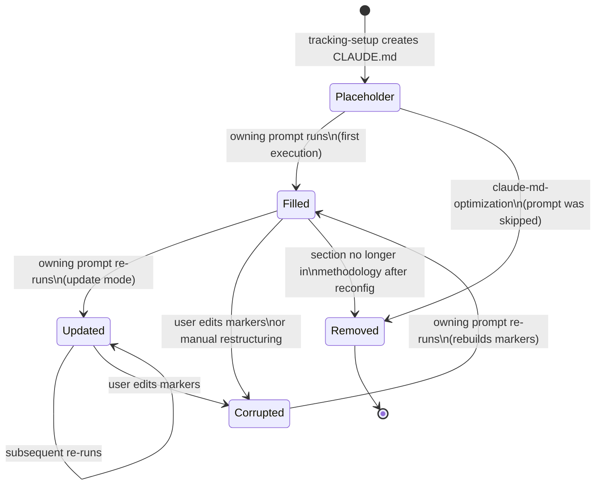
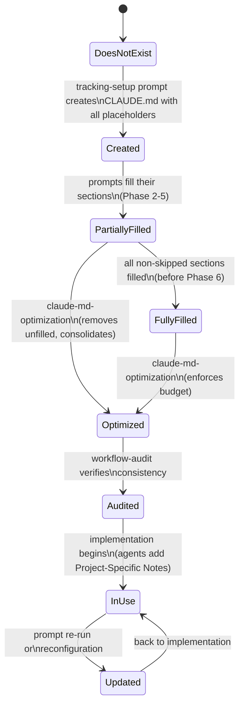

# Domain Model: CLAUDE.md Management Model

**Domain ID**: 10
**Phase**: 1 — Deep Domain Modeling
**Depends on**: Methodology configuration (determines section structure), [08-prompt-frontmatter.md](08-prompt-frontmatter.md) (meta-prompts declare which sections they own)
**Last updated**: 2026-03-12
**Status**: draft

---

## Section 1: Domain Overview

CLAUDE.md is the primary agent instruction file for Claude Code in target projects. It is loaded into every Claude Code agent session, consuming context window tokens. In a scaffold-managed project, CLAUDE.md is a **multi-writer artifact** — multiple pipeline prompts each contribute content to their own reserved sections, and implementation agents add project-specific content to unmanaged areas. This creates three systemic risks:

1. **Unbounded growth**: Each prompt that runs appends content, potentially pushing CLAUDE.md beyond useful size. Agent context windows are finite; a bloated CLAUDE.md crowds out working memory.
2. **Structural drift**: Without a fixed structure, prompts add sections with ad-hoc naming, making it hard for agents and users to find information.
3. **Write conflicts**: Multiple prompts (and implementation agents) write to the same file, creating ownership ambiguity — which content can be updated by whom?

This domain models the management system that addresses all three risks: a **reserved section registry** with named owners, **ownership markers** that delineate scaffold-managed content from user-managed content, a **2000-token size budget** enforced by the optimization prompt, and the **section fill/replace algorithm** that prompts use to update their reserved sections without disturbing other content.

**Role in the v2 architecture**: CLAUDE.md management sits at the intersection of prompt execution and platform adaptation. After `scaffold build` resolves and injects prompts ([domain 12](12-mixin-injection.md)), the Claude Code adapter generates the initial CLAUDE.md with all reserved sections. As prompts execute (via `scaffold run`), each prompt fills its section using the fill algorithm defined here. The optimization prompt ([Phase 6](01-prompt-resolution.md)) consolidates the result. For non-Claude-Code platforms, a parallel system exists for AGENTS.md (Codex) with different structural conventions.

**What this domain covers**:
- The complete reserved section registry and ownership model
- Ownership marker syntax and semantics
- The section fill/replace algorithm
- The 2000-token budget and its enforcement
- Lifecycle of sections (empty placeholder → filled → updated → removed)
- Methodology-dependent section structure
- The boundary between managed and unmanaged content
- Cross-platform considerations (AGENTS.md)

**What this domain does NOT cover**:
- The actual prose content of individual CLAUDE.md sections (that's prompt-specific)
- The `claude-md-optimization` prompt's consolidation logic (that's a specific prompt within the classic methodology)
- Meta-prompt loading mechanics (assembly engine)
- Artifact schema validation rules ([domain 08](08-prompt-frontmatter.md))

---

## Section 2: Glossary

**reserved section** — A `##`-level section heading in CLAUDE.md that is pre-defined when the file is created. Each reserved section has a named owner (a prompt slug) and a content budget. Reserved sections form the fixed structural skeleton of CLAUDE.md.

**section owner** — The prompt that has exclusive write access to a reserved section's content. Only the owner may fill or update the content between the section's ownership markers. The owner is identified by its slug (e.g., `coding-standards`, `dev-env-setup`).

**ownership marker** — An HTML comment pair (`<!-- scaffold:managed by <slug> -->` / `<!-- /scaffold:managed -->`) that delineates scaffold-managed content within CLAUDE.md. Content between these markers is read-only for implementation agents.

**tracking comment** — A line-1 HTML comment on scaffold artifacts that records the step name, version, date, and methodology. Format: `<!-- scaffold:<step-name> v<version> <date> <methodology> -->`. Used by Mode Detection for update-mode awareness.

**reservation placeholder** — An HTML comment (`<!-- Reserved for: <slug> -->`) that marks an unfilled reserved section. Replaced when the owning prompt runs, or removed by `claude-md-optimization` if the prompt was skipped.

**managed content** — Content between ownership markers. Scaffold owns this content; implementation agents must not modify it.

**unmanaged content** — Content outside any ownership markers. Implementation agents may freely add, modify, or remove this content.

**Project-Specific Notes** — A dedicated `##`-level section at the bottom of CLAUDE.md where implementation agents add project-specific guidance. This section is never scaffold-managed.

**section budget** — The target token allocation for a single section. All section budgets sum to the total 2000-token file budget.

**pointer pattern** — The structural convention for section content: 2–5 bullet points summarizing key rules + a pointer to the full document (`see docs/X.md`). Keeps sections concise within budget.

**fill** — The act of replacing a reservation placeholder with actual content. Happens when the owning prompt executes.

**re-fill** — Updating an already-filled section with new content. Happens when a prompt re-runs in update mode (e.g., after config change).

**agent instruction file** — A platform-specific file that AI tools read for project context. CLAUDE.md for Claude Code, AGENTS.md for Codex.

---

## Section 3: Entity Model

### Section Registry

```typescript
/**
 * A single reserved section within CLAUDE.md.
 * Defined by the section registry and created by the tracking setup prompt.
 */
interface ReservedSection {
  /** The exact `##`-level heading text (e.g., "Core Principles") */
  heading: string;

  /** Prompt slug that owns this section (e.g., "tracking-setup", "coding-standards") */
  owner: string;

  /** Target token budget for this section's content (sum of all ≤ 2000) */
  budgetTokens: number;

  /**
   * Whether this section is optional — linked to a project trait.
   * If the owning prompt is skipped (optional and condition not met),
   * the section remains as a placeholder until optimization removes it.
   * Null means the section is always present.
   */
  optionalRequires: string | null;

  /**
   * The docs file this section's pointer references.
   * Null for sections that don't point to a dedicated doc (e.g., Core Principles).
   */
  pointerTarget: string | null;

  /** Display order within CLAUDE.md (1-based) */
  order: number;
}

/**
 * The complete section registry for a methodology.
 * Derived from the methodology manifest and the prompt set.
 */
interface SectionRegistry {
  /** Methodology name (e.g., "classic", "classic-lite") */
  methodology: string;

  /** Ordered list of all reserved sections */
  sections: ReservedSection[];

  /** Total token budget (always 2000) */
  totalBudget: number;

  /**
   * Whether the registry was derived from the manifest
   * or from a default template. Manifest-derived registries
   * may have methodology-specific sections.
   */
  source: 'manifest' | 'default';
}
```

### Ownership Markers

```typescript
/**
 * A tracking comment on line 1 of a scaffold artifact.
 * Present on CLAUDE.md and all other scaffold-produced files.
 */
interface TrackingComment {
  /** The raw HTML comment string */
  raw: string;

  /** Prompt name that last wrote this file */
  promptName: string;

  /** Schema version of the artifact */
  version: number;

  /** ISO date when last written */
  date: string;

  /** Methodology active when the artifact was produced */
  methodology: string;

  /** Methodology name (e.g., "deep", "mvp") */
  methodology: string;
}

/**
 * A section ownership marker pair within CLAUDE.md.
 * Content between the open and close markers is scaffold-managed.
 */
interface OwnershipMarker {
  /** The prompt slug that owns this section */
  owner: string;

  /** The opening marker: <!-- scaffold:managed by <owner> --> */
  openMarker: string;

  /** The closing marker: <!-- /scaffold:managed --> */
  closeMarker: string;

  /** Line number of the opening marker (1-based) */
  openLine: number;

  /** Line number of the closing marker (1-based) */
  closeLine: number;

  /** The content between the markers (excluding markers themselves) */
  managedContent: string;
}

/**
 * A reservation placeholder within an unfilled section.
 */
interface ReservationPlaceholder {
  /** The raw HTML comment */
  raw: string;

  /** The prompt slug this section is reserved for */
  reservedFor: string;

  /** Optional annotation (e.g., "brief — see docs/coding-standards.md") */
  annotation: string | null;

  /** Line number where the placeholder appears (1-based) */
  line: number;
}
```

### CLAUDE.md Document Model

```typescript
/**
 * The parsed structure of a CLAUDE.md file.
 */
interface ClaudeMdDocument {
  /** Tracking comment from line 1 (null if missing — legacy/user-created file) */
  trackingComment: TrackingComment | null;

  /** All parsed sections in document order */
  sections: ClaudeMdSection[];

  /** The "Project-Specific Notes" section (null if not present) */
  projectNotes: UnmanagedSection | null;

  /** Any content before the first ## heading (typically just the # CLAUDE.md title) */
  preamble: string;

  /** Total approximate token count */
  estimatedTokens: number;
}

/**
 * A single section within CLAUDE.md.
 */
interface ClaudeMdSection {
  /** The ## heading text (e.g., "Core Principles") */
  heading: string;

  /** The full heading line including ## prefix */
  headingLine: string;

  /** Line number of the heading (1-based) */
  headingLineNumber: number;

  /** The current state of this section */
  state: SectionState;

  /** Ownership marker pair (present if section is managed) */
  ownershipMarker: OwnershipMarker | null;

  /** Reservation placeholder (present if section is unfilled) */
  placeholder: ReservationPlaceholder | null;

  /** The full content of the section (between heading and next heading) */
  rawContent: string;

  /** Approximate token count of section content */
  estimatedTokens: number;
}

type SectionState =
  | 'placeholder'   // Reservation placeholder present, no content filled
  | 'filled'        // Ownership markers present with content between them
  | 'unmanaged'     // No ownership markers — user-created or Project-Specific Notes
  | 'corrupted';    // Ownership markers are malformed or mismatched

/**
 * An unmanaged section — not owned by any scaffold prompt.
 * Typically the "Project-Specific Notes" section at the bottom.
 */
interface UnmanagedSection {
  heading: string;
  headingLine: string;
  headingLineNumber: number;
  rawContent: string;
  estimatedTokens: number;
}
```

### Section Fill Operation

```typescript
/**
 * Input to the section fill algorithm.
 * Provided by a prompt when it fills its reserved section.
 */
interface SectionFillRequest {
  /** Prompt slug performing the fill */
  promptSlug: string;

  /** The section heading to fill (must match a reserved section owned by this prompt) */
  targetHeading: string;

  /** The content to place between ownership markers */
  content: string;

  /** Whether this is an update to already-filled content */
  isUpdate: boolean;
}

/**
 * Result of a section fill operation.
 */
interface SectionFillResult {
  /** Whether the fill succeeded */
  success: boolean;

  /** The section heading that was filled */
  heading: string;

  /** Previous content (for update mode diff display) */
  previousContent: string | null;

  /** Token count of the new content */
  contentTokens: number;

  /** Whether the content exceeds the section's budget */
  overBudget: boolean;

  /** Warnings generated during the fill */
  warnings: ClaudeMdWarning[];

  /** Errors that prevented the fill */
  errors: ClaudeMdError[];
}
```

### Budget Tracking

```typescript
/**
 * Token budget status for the entire CLAUDE.md file.
 */
interface BudgetStatus {
  /** Total budget (always 2000) */
  totalBudget: number;

  /** Current estimated token count */
  currentTokens: number;

  /** Whether the file exceeds the budget */
  overBudget: boolean;

  /** Per-section breakdown */
  sectionBreakdown: SectionBudgetEntry[];

  /** Tokens used by structural elements (headings, markers, preamble) */
  structuralOverhead: number;
}

interface SectionBudgetEntry {
  /** Section heading */
  heading: string;

  /** Owner prompt slug */
  owner: string;

  /** Allocated budget */
  budgetTokens: number;

  /** Actual token count */
  actualTokens: number;

  /** Whether this section is over its individual budget */
  overBudget: boolean;
}
```

### Platform Adaptation

```typescript
/**
 * Configuration for generating agent instruction files
 * for different platforms.
 */
interface AgentInstructionConfig {
  /** Target platform */
  platform: 'claude-code' | 'codex' | 'universal';

  /** Output file name */
  outputFile: string;

  /** The section registry to use */
  registry: SectionRegistry;

  /** Whether to include ownership markers */
  includeOwnershipMarkers: boolean;

  /** Whether to include tracking comments */
  includeTrackingComment: boolean;

  /** Platform-specific structural conventions */
  conventions: PlatformConventions;
}

/**
 * Platform-specific conventions for agent instruction files.
 */
interface PlatformConventions {
  /** File name (CLAUDE.md, AGENTS.md, etc.) */
  fileName: string;

  /**
   * How sections are organized:
   * - 'flat': All sections at ## level (CLAUDE.md style)
   * - 'phased': Grouped by pipeline phase with ## phase headings
   *   and ### prompt headings (AGENTS.md style)
   */
  sectionOrganization: 'flat' | 'phased';

  /**
   * Whether to include inline prompt summaries (AGENTS.md)
   * or just pointer references (CLAUDE.md).
   */
  contentStyle: 'pointer' | 'inline-summary';

  /** Maximum recommended tokens (CLAUDE.md: 2000, AGENTS.md: larger) */
  tokenBudget: number;
}
```

### Entity Relationships

```
SectionRegistry
  ├── contains → ReservedSection[] (ordered)
  ├── derived from → Methodology configuration
  └── constrains → ClaudeMdDocument (structure)

ClaudeMdDocument
  ├── contains → ClaudeMdSection[] (ordered)
  ├── contains → UnmanagedSection (optional, at bottom)
  ├── has → TrackingComment (line 1)
  └── constrained by → BudgetStatus (≤ 2000 tokens)

ClaudeMdSection
  ├── has → OwnershipMarker (if filled)
  ├── has → ReservationPlaceholder (if unfilled)
  ├── owned by → prompt slug (from ReservedSection)
  └── filled by → SectionFillRequest

SectionFillRequest
  ├── targets → ClaudeMdSection (by heading)
  ├── produces → SectionFillResult
  └── authorized by → section ownership (promptSlug must match owner)

AgentInstructionConfig
  ├── uses → SectionRegistry
  ├── produces → CLAUDE.md or AGENTS.md
  └── follows → PlatformConventions
```

---

## Section 4: State Transitions

### Section Lifecycle



**State descriptions:**

| State | Description | Markers Present | Content Present |
|-------|-------------|-----------------|-----------------|
| `placeholder` | Section heading exists with `<!-- Reserved for: X -->` comment. No actual content. | No ownership markers | No (only placeholder comment) |
| `filled` | Section heading exists with ownership markers and content between them. | Yes | Yes |
| `updated` | Same as `filled` but content has been replaced at least once. Functionally identical to `filled`. | Yes | Yes (new content) |
| `corrupted` | Ownership markers are malformed, mismatched, or removed by manual editing. | Partial or absent | May be present but unprotected |
| `removed` | Section heading and all content removed. Occurs when `claude-md-optimization` removes a skipped section or when methodology change removes a section. | N/A | N/A |

### Document Lifecycle



---

## Section 5: Core Algorithms

### Algorithm 1: Parse CLAUDE.md Structure

Reads an existing CLAUDE.md file and produces a `ClaudeMdDocument`.

```
FUNCTION parseClaudeMd(filePath: string) → ClaudeMdDocument:
  content ← readFile(filePath)
  lines ← content.split('\n')

  // Step 1: Parse tracking comment (line 1)
  trackingComment ← null
  IF lines[0] matches /^<!-- scaffold:[a-z-]+ v\d+ .+ -->$/
    trackingComment ← parseTrackingComment(lines[0])

  // Step 2: Extract preamble (everything before first ## heading)
  preamble ← ""
  firstHeadingLine ← null
  FOR i ← 0 TO lines.length - 1
    IF lines[i] matches /^## /
      firstHeadingLine ← i
      BREAK
    preamble ← preamble + lines[i] + '\n'

  // Step 3: Split into sections by ## headings
  sectionRanges ← []
  currentStart ← firstHeadingLine
  FOR i ← firstHeadingLine + 1 TO lines.length - 1
    IF lines[i] matches /^## /
      sectionRanges.push({ start: currentStart, end: i - 1 })
      currentStart ← i
  sectionRanges.push({ start: currentStart, end: lines.length - 1 })

  // Step 4: Parse each section
  sections ← []
  projectNotes ← null
  FOR EACH range IN sectionRanges
    section ← parseSingleSection(lines, range)
    IF section.heading = "Project-Specific Notes"
      projectNotes ← { heading: section.heading, ... }
    ELSE
      sections.push(section)

  // Step 5: Estimate total tokens
  estimatedTokens ← estimateTokens(content)

  RETURN { trackingComment, sections, projectNotes, preamble, estimatedTokens }
```

### Algorithm 2: Parse Single Section

```
FUNCTION parseSingleSection(lines, range) → ClaudeMdSection:
  headingLine ← lines[range.start]
  heading ← headingLine.replace(/^## /, '')
  rawContent ← lines[range.start + 1 ... range.end].join('\n')

  // Check for reservation placeholder
  placeholder ← null
  FOR EACH line IN lines[range.start + 1 ... range.end]
    IF line matches /^<!-- Reserved for: (.+) -->$/
      placeholder ← {
        raw: line,
        reservedFor: match[1].split(' ')[0],  // slug before any annotation
        annotation: extractAnnotation(match[1]),
        line: lineNumber
      }

  // Check for ownership markers
  ownershipMarker ← null
  openLine ← null
  closeLine ← null
  FOR i ← range.start + 1 TO range.end
    IF lines[i] matches /^<!-- scaffold:managed by ([a-z-]+) -->$/
      openLine ← i + 1  // 1-based
      owner ← match[1]
    IF lines[i] matches /^<!-- \/scaffold:managed -->$/
      closeLine ← i + 1

  IF openLine != null AND closeLine != null AND closeLine > openLine
    managedContent ← lines[openLine ... closeLine - 2].join('\n')
    ownershipMarker ← { owner, openMarker: ..., closeMarker: ...,
                         openLine, closeLine, managedContent }

  // Determine state
  state ← 'unmanaged'
  IF placeholder != null
    state ← 'placeholder'
  ELSE IF ownershipMarker != null
    state ← 'filled'
  ELSE IF openLine != null XOR closeLine != null
    state ← 'corrupted'  // Mismatched markers

  estimatedTokens ← estimateTokens(rawContent)

  RETURN { heading, headingLine, headingLineNumber: range.start + 1,
           state, ownershipMarker, placeholder, rawContent, estimatedTokens }
```

### Algorithm 3: Fill Section

The core algorithm used when a prompt fills or updates its reserved section.

```
FUNCTION fillSection(filePath, request: SectionFillRequest) → SectionFillResult:
  // Step 1: Parse the existing document
  doc ← parseClaudeMd(filePath)

  // Step 2: Find the target section
  targetSection ← null
  FOR EACH section IN doc.sections
    IF section.heading = request.targetHeading
      targetSection ← section
      BREAK

  IF targetSection = null
    RETURN error(CMD_SECTION_NOT_FOUND, request.targetHeading)

  // Step 3: Verify ownership
  IF targetSection.state = 'filled' OR targetSection.state = 'corrupted'
    IF targetSection.ownershipMarker != null
      AND targetSection.ownershipMarker.owner != request.promptSlug
      RETURN error(CMD_OWNERSHIP_VIOLATION, request.promptSlug,
                   targetSection.ownershipMarker.owner)

  IF targetSection.state = 'placeholder'
    IF targetSection.placeholder.reservedFor != request.promptSlug
      RETURN error(CMD_OWNERSHIP_VIOLATION, request.promptSlug,
                   targetSection.placeholder.reservedFor)

  // Step 4: Build the replacement content
  newContent ← buildManagedBlock(request.promptSlug, request.content)
  //  <!-- scaffold:managed by <slug> -->
  //  <content>
  //  <!-- /scaffold:managed -->

  // Step 5: Check budget
  contentTokens ← estimateTokens(request.content)
  registryEntry ← lookupSectionBudget(request.targetHeading)
  overBudget ← contentTokens > registryEntry.budgetTokens

  warnings ← []
  IF overBudget
    warnings.push(warning(CMD_SECTION_OVER_BUDGET,
      request.targetHeading, contentTokens, registryEntry.budgetTokens))

  // Step 6: Replace content in the file
  previousContent ← null
  IF targetSection.state = 'filled'
    previousContent ← targetSection.ownershipMarker.managedContent

  // Replace everything between the heading and the next heading
  // with the heading + new managed block
  fileContent ← readFile(filePath)
  updatedContent ← replaceSectionContent(fileContent, targetSection, newContent)
  writeFile(filePath, updatedContent)

  RETURN {
    success: true,
    heading: request.targetHeading,
    previousContent,
    contentTokens,
    overBudget,
    warnings,
    errors: []
  }
```

### Algorithm 4: Build Managed Block

```
FUNCTION buildManagedBlock(owner: string, content: string) → string:
  RETURN [
    "<!-- scaffold:managed by " + owner + " -->",
    content,
    "<!-- /scaffold:managed -->"
  ].join('\n')
```

### Algorithm 5: Replace Section Content

Replaces the body of a section (between its heading and the next heading) while preserving the heading itself and all other sections.

```
FUNCTION replaceSectionContent(fileContent, section, newBody) → string:
  lines ← fileContent.split('\n')

  // Find the range to replace: from line after heading to line before next heading
  startReplace ← section.headingLineNumber  // 1-based, line after heading
  endReplace ← findNextHeadingLine(lines, startReplace) - 1

  // If no next heading, replace to end of file
  IF endReplace < startReplace
    endReplace ← lines.length - 1

  // Build replacement: heading line stays, body is replaced
  beforeSection ← lines[0 ... section.headingLineNumber - 1]
  headingLine ← [section.headingLine]
  afterSection ← lines[endReplace + 1 ... lines.length - 1]

  RETURN [...beforeSection, ...headingLine, newBody, '', ...afterSection].join('\n')
```

### Algorithm 6: Generate Initial CLAUDE.md

Called by the tracking-setup prompt (or equivalent) to create CLAUDE.md with all reserved sections.

```
FUNCTION generateInitialClaudeMd(
  methodology: string,
  registry: SectionRegistry,
  methodology: string
) → string:
  lines ← []

  // Line 1: tracking comment
  trackingComment ← "<!-- scaffold:tracking-setup v1 "
    + today() + " " + methodology + " -->"
  lines.push(trackingComment)
  lines.push("")

  // Title
  lines.push("# CLAUDE.md")
  lines.push("")

  // Reserved sections in order
  FOR EACH section IN registry.sections ORDER BY section.order
    lines.push("## " + section.heading)

    // Build placeholder with annotation
    annotation ← section.owner
    IF section.pointerTarget != null
      annotation ← annotation + " (brief — see " + section.pointerTarget + ")"
    IF section.optionalRequires != null
      annotation ← annotation + " (optional — only if " + section.optionalRequires + ")"

    lines.push("<!-- Reserved for: " + annotation + " -->")
    lines.push("")

  // Project-Specific Notes (always last, always unmanaged)
  lines.push("## Project-Specific Notes")
  lines.push("")
  lines.push("_Implementation agents: add project-specific guidance here._")
  lines.push("")

  RETURN lines.join('\n')
```

### Algorithm 7: Check Budget

```
FUNCTION checkBudget(doc: ClaudeMdDocument, registry: SectionRegistry) → BudgetStatus:
  sectionBreakdown ← []
  structuralOverhead ← estimateTokens(doc.preamble)

  FOR EACH section IN doc.sections
    registryEntry ← findRegistryEntry(registry, section.heading)
    budget ← registryEntry?.budgetTokens OR 0
    actual ← section.estimatedTokens
    structuralOverhead ← structuralOverhead
      + estimateTokens(section.headingLine)
      + estimateTokens(section.ownershipMarker?.openMarker OR "")
      + estimateTokens(section.ownershipMarker?.closeMarker OR "")

    sectionBreakdown.push({
      heading: section.heading,
      owner: registryEntry?.owner OR "unknown",
      budgetTokens: budget,
      actualTokens: actual,
      overBudget: actual > budget
    })

  // Include Project-Specific Notes if present
  IF doc.projectNotes != null
    structuralOverhead ← structuralOverhead + doc.projectNotes.estimatedTokens

  currentTokens ← doc.estimatedTokens

  RETURN {
    totalBudget: 2000,
    currentTokens,
    overBudget: currentTokens > 2000,
    sectionBreakdown,
    structuralOverhead
  }
```

### Token Estimation

Token estimation uses a simple heuristic rather than a tokenizer, since CLAUDE.md is plain text/markdown:

```
FUNCTION estimateTokens(text: string) → number:
  // Rule of thumb: ~4 characters per token for English text
  // This is a deliberately conservative estimate
  RETURN Math.ceil(text.length / 4)
```

This is intentionally approximate. The budget is a guideline, not a hard limit. The `claude-md-optimization` prompt performs the actual consolidation when the budget is exceeded.

---

## Section 6: Error Taxonomy

All error codes use the prefix `CMD_` (CLAUDE.md Management Domain).

### Errors (Fatal)

| Code | Severity | Message Template | Recovery |
|------|----------|-----------------|----------|
| `CMD_SECTION_NOT_FOUND` | error | `Section "{heading}" not found in CLAUDE.md. Available sections: {list}` | Check the section heading matches the registry. If CLAUDE.md was manually restructured, re-run the tracking-setup prompt to recreate the structure. |
| `CMD_OWNERSHIP_VIOLATION` | error | `Prompt "{requestor}" cannot fill section "{heading}" — owned by "{owner}"` | Use the correct section for your prompt. If ownership needs to change, update the section registry. |
| `CMD_FILE_NOT_FOUND` | error | `CLAUDE.md not found at {path}. Run the tracking-setup prompt first.` | Run the tracking-setup prompt (or equivalent) to create CLAUDE.md. |
| `CMD_MARKERS_MALFORMED` | error | `Ownership markers in section "{heading}" are malformed: {detail}` | Re-run the owning prompt to rebuild the markers. If manually edited, restore the marker syntax. |
| `CMD_WRITE_FAILED` | error | `Failed to write CLAUDE.md: {ioError}` | Check file permissions and disk space. |

### Warnings (Non-Fatal)

| Code | Severity | Message Template | Recovery |
|------|----------|-----------------|----------|
| `CMD_SECTION_OVER_BUDGET` | warning | `Section "{heading}" uses {actual} tokens (budget: {budget}). Consider condensing.` | Reduce content to bullet points and pointers. The optimization prompt will address this in Phase 6. |
| `CMD_FILE_OVER_BUDGET` | warning | `CLAUDE.md is ~{total} tokens (budget: 2000). The optimization prompt will consolidate.` | Let the pipeline continue — `claude-md-optimization` addresses this in Phase 6. |
| `CMD_TRACKING_COMMENT_MISSING` | warning | `CLAUDE.md has no tracking comment on line 1. Mode Detection may not work correctly.` | Re-run the tracking-setup prompt, or manually add a tracking comment. |
| `CMD_TRACKING_COMMENT_MALFORMED` | warning | `Tracking comment on line 1 of CLAUDE.md does not match expected format.` | Check the tracking comment syntax. Expected: `<!-- scaffold:<name> v<N> <date> <methodology> -->` |
| `CMD_UNKNOWN_SECTION` | warning | `Section "{heading}" in CLAUDE.md is not in the section registry for methodology "{methodology}".` | This section may have been added manually or by a different methodology. The optimization prompt will evaluate it. |
| `CMD_PLACEHOLDER_STALE` | warning | `Section "{heading}" still has a reservation placeholder after prompt "{owner}" has completed.` | The owning prompt may have failed to fill its section. Re-run it. |
| `CMD_MARKERS_CORRUPTED` | warning | `Section "{heading}" has mismatched ownership markers. Content may be unprotected.` | Re-run the owning prompt to rebuild markers, or manually fix the marker syntax. |

---

## Section 7: Integration Points

### Domain 01: Prompt Resolution

| Direction | Data | Purpose |
|-----------|------|---------|
| Domain 01 → Domain 10 | `ResolutionResult.methodology` | Determines which section registry to use |
| Domain 01 → Domain 10 | `ResolutionResult.prompts[]` | List of prompts that may own CLAUDE.md sections |
| Domain 01 → Domain 10 | `ResolutionResult.excludedOptional[]` | Prompts whose sections should be placeholder-only (later removed) |

**Contract**: The section registry for a methodology is derived from the manifest. Each prompt in the resolved set may declare (via its frontmatter or an annotation in the manifest) which CLAUDE.md section it owns. Prompts excluded by optional filtering have their sections remain as placeholders.

### Domain 08: Prompt Frontmatter

| Direction | Data | Purpose |
|-----------|------|---------|
| Domain 08 → Domain 10 | `produces: ["CLAUDE.md"]` | Indicates the prompt writes to CLAUDE.md (shared artifact) |
| Domain 08 → Domain 10 | `artifact-schema.CLAUDE.md` | Optional schema defining required sections and `max-length` |
| Domain 08 → Domain 10 | `reads[].path: "CLAUDE.md"` | Prompts that read CLAUDE.md for context |

**Contract**: When a prompt's `produces` list includes `CLAUDE.md`, it is a multi-writer artifact. The prompt does not "own" the entire file — it owns only its designated section. The `artifact-schema` for CLAUDE.md, if declared, should include `required-sections` listing all non-optional section headings from the registry.

### Assembly Engine

| Direction | Data | Purpose |
|-----------|------|---------|
| Assembly Engine → Domain 10 | Assembled prompt output | After a step executes, its output may include content destined for CLAUDE.md sections |

**Contract**: The assembly engine constructs prompts at runtime. When a step fills its CLAUDE.md section, the content it writes includes tool-specific commands determined by the project's user instructions and methodology configuration.

### Domain 09: CLI Architecture

| Direction | Data | Purpose |
|-----------|------|---------|
| Domain 10 → Domain 09 | `scaffold validate` rules | CLI validates CLAUDE.md structure against the registry |
| Domain 09 → Domain 10 | `scaffold run` context | CLI includes CLAUDE.md in context files list for session bootstrap |

**Contract**: The CLI's `scaffold validate` command checks CLAUDE.md against the section registry — verifying that all expected sections exist, ownership markers are well-formed, and the tracking comment is present. The CLI's `scaffold run` command includes CLAUDE.md in the session bootstrap context files.

### Platform Adapters

| Direction | Data | Purpose |
|-----------|------|---------|
| Domain 10 → Claude Code Adapter | `SectionRegistry`, fill algorithm | Adapter creates and manages CLAUDE.md |
| Domain 10 → Codex Adapter | Structural conventions | Adapter creates AGENTS.md with phase-based organization |

**Contract**: The Claude Code adapter uses the section registry and fill algorithm defined in this domain to manage CLAUDE.md. The Codex adapter generates AGENTS.md with a different structural convention (phase-grouped sections rather than flat topic-based sections). Both files serve as agent instruction files but follow different management models appropriate to their platforms.

---

## Section 8: Edge Cases & Failure Modes

### MQ1: Complete CLAUDE.md Reserved Section Structure

The reserved section structure for the `classic` methodology:

| # | Section Heading | Owner Prompt | Budget (tokens) | Pointer Target | Optional |
|---|----------------|-------------|-----------------|----------------|----------|
| 1 | Core Principles | `tracking-setup` | 150 | None | No |
| 2 | Task Management | `tracking-setup` | 300 | None | No |
| 3 | Key Commands | `dev-env-setup` | 250 | `docs/dev-setup.md` | No |
| 4 | Project Structure Quick Reference | `project-structure` | 200 | `docs/project-structure.md` | No |
| 5 | Coding Standards Summary | `coding-standards` | 200 | `docs/coding-standards.md` | No |
| 6 | Git Workflow | `git-workflow` | 250 | `docs/git-workflow.md` | No |
| 7 | Testing | `tdd` | 200 | `docs/tdd-standards.md` | No |
| 8 | Design System | `design-system` | 150 | `docs/design-system.md` | `frontend` |
| 9 | Self-Improvement | `tracking-setup` | 100 | None | No |

**Budget allocation**: The 9 sections sum to ~1,800 tokens, leaving ~200 tokens for structural overhead (title, headings, markers, tracking comment) and the unmanaged Project-Specific Notes section. This is intentionally below the 2,000-token budget to allow some flexibility.

**Tracking-setup owns three sections** (Core Principles, Task Management, Self-Improvement). This is because the tracking-setup prompt is the one that creates CLAUDE.md initially — it fills its own sections immediately and creates placeholders for the rest.

### MQ2: How Ownership Markers Work

**Marker syntax:**

Opening marker:
```
<!-- scaffold:managed by <prompt-slug> -->
```

Closing marker:
```
<!-- /scaffold:managed -->
```

Where `<prompt-slug>` is the kebab-case prompt name (e.g., `coding-standards`, `dev-env-setup`).

**What "managed" means:**

Content between these markers is scaffold-owned. The rules are:

1. **Only the owning prompt may modify this content.** When the owning prompt re-runs (update mode), it replaces the content between the markers entirely.
2. **Implementation agents must not edit managed content.** Implementation agents should treat everything between `<!-- scaffold:managed -->` and `<!-- /scaffold:managed -->` as read-only.
3. **The markers themselves are part of the managed boundary.** Moving, deleting, or modifying markers constitutes corruption.

**What happens when a user edits a managed section:**

If a user manually edits content within a managed block:
- **On next prompt re-run**: The user's edits are overwritten. The owning prompt replaces all content between markers with its current output. This is by design — managed sections are scaffold's territory.
- **If markers are removed or corrupted**: The section enters the `corrupted` state. The next prompt re-run detects the corruption (via `CMD_MARKERS_CORRUPTED` warning), rebuilds the markers, and fills the section fresh.
- **If the heading is renamed**: The fill algorithm cannot find the section (`CMD_SECTION_NOT_FOUND` error). The user must restore the heading or the tracking-setup prompt must re-run to recreate the structure.

**Idempotency**: Re-running the owning prompt always produces a valid state — it rebuilds markers and replaces content regardless of the current state (placeholder, filled, or corrupted).

### MQ3: Methodology-Dependent Section Structure

Different methodologies need different sections because they have different prompts. The section registry is **derived from the methodology**, not hardcoded.

**Classic methodology** (shown in MQ1): Full registry with 9 sections covering task management, standards, workflow, and testing.

**Classic-lite methodology**: A lighter variant that uses `simple-tracking` instead of `beads-setup` and has fewer prompts. Its registry would differ:

| # | Section Heading | Owner Prompt | Notes |
|---|----------------|-------------|-------|
| 1 | Core Principles | `simple-tracking` | Different owner (simple-tracking vs. beads-setup) |
| 2 | Task Tracking | `simple-tracking` | Different heading ("Task Tracking" vs. "Task Management") |
| 3 | Key Commands | `dev-env-setup` | Same |
| 4 | Project Structure Quick Reference | `project-structure` | Same |
| 5 | Coding Standards Summary | `coding-standards` | Same |
| 6 | Git Workflow | `git-workflow` | May differ if classic-lite uses `simple` git workflow |
| 7 | Testing | `tdd` | Same |
| 8 | Self-Improvement | `simple-tracking` | Different owner |

Note: `classic-lite` likely omits the optional Design System section entirely (not relevant to its target audience).

**How the registry varies by methodology:**

The section registry is **not** declared explicitly in the manifest. Instead, it is derived:

1. The methodology's tracking-setup prompt (or equivalent extension like `simple-tracking`) declares the section headings it creates in its prompt text.
2. Each prompt in the resolved set knows which section it owns (encoded in the prompt's instructions, not in frontmatter).
3. The `scaffold build` process can extract the registry by analyzing the tracking-setup prompt and the section ownership declarations across all prompts.

**Future consideration**: The manifest could include an explicit `claude-md-sections` field to make the registry first-class data. This is recorded in Section 10 (Open Questions).

### MQ4: Section Fill Mechanism

When a prompt runs and fills its reserved section, the exact process is:

1. **Read CLAUDE.md** — Parse the file using Algorithm 1.
2. **Find the section** — Match the section heading from the registry.
3. **Verify ownership** — Confirm the current prompt's slug matches the section owner.
4. **Replace content** — If the section is in `placeholder` state, remove the `<!-- Reserved for: X -->` comment and insert the managed block (ownership markers + content). If the section is in `filled` state (re-run), replace the content between existing ownership markers.
5. **Write back** — Write the entire updated file atomically (write to temp, rename).

**What if the section was already filled by a previous run?**

This is the update mode case. The fill algorithm detects the existing ownership markers, extracts the previous content (for diff display), and replaces it entirely with the new content. The previous content is returned in `SectionFillResult.previousContent` so the prompt can display a diff to the user if desired.

**Concrete example**: The `coding-standards` prompt runs and fills its section:

Before (placeholder state):
```markdown
## Coding Standards Summary
<!-- Reserved for: coding-standards (brief — see docs/coding-standards.md) -->
```

After (filled state):
```markdown
## Coding Standards Summary
<!-- scaffold:managed by coding-standards -->
- Commit format: `[BD-<id>] type(scope): description`
- Linter: Biome (replaces ESLint + Prettier)
- Strict TypeScript: `noUncheckedIndexedAccess`, `exactOptionalPropertyTypes`
- See `docs/coding-standards.md` for full rules
<!-- /scaffold:managed -->
```

### MQ5: 2000-Token Budget Enforcement

The budget is enforced at **three levels**, none of which are hard blockers during prompt execution:

1. **Per-section advisory (during prompt execution)**: When a prompt fills its section, the fill algorithm checks whether the content exceeds the section's individual budget. If yes, it emits `CMD_SECTION_OVER_BUDGET` as a warning. The fill succeeds — the warning is informational.

2. **File-level advisory (during prompt execution)**: After a fill, the total file token count is checked. If over 2,000, `CMD_FILE_OVER_BUDGET` is emitted as a warning. Again, the fill succeeds.

3. **Active enforcement (by claude-md-optimization)**: The `claude-md-optimization` prompt in Phase 6 is the actual enforcement mechanism. It reads the current CLAUDE.md, checks the total size, identifies sections that are over-budget, and consolidates content to fit within the 2,000-token budget. This is an active prompt that an agent runs — not a build-time validation.

**Why not a hard limit?** A hard limit during prompt execution would prevent prompts from filling their sections when the file is already large, which could leave sections unfilled. The better approach is to let all prompts fill their sections (potentially over budget) and then have a dedicated optimization step consolidate the result.

**`scaffold validate` check**: The `scaffold validate` command checks whether CLAUDE.md exceeds the budget and reports it as a warning (not an error). This provides a check that the optimization prompt can be run but does not block the pipeline.

**Potential `artifact-schema` integration**: The `max-length` field proposed in [domain 08](08-prompt-frontmatter.md) could enforce a line-count limit on CLAUDE.md. If the tracking-setup prompt declares `artifact-schema: { "CLAUDE.md": { max-length: 120 } }`, `scaffold validate` would flag files exceeding 120 lines. This is a future enhancement (see Section 10).

### MQ6: Managed vs. Unmanaged Boundary

**How implementation agents know which sections are managed:**

1. **Ownership markers are explicit.** Any content between `<!-- scaffold:managed by X -->` and `<!-- /scaffold:managed -->` is managed. Agents can parse these markers trivially.
2. **The Project-Specific Notes section is explicitly unmanaged.** It is established by the tracking-setup prompt with the text: `_Implementation agents: add project-specific guidance here._`
3. **Content outside managed blocks within a reserved section is ambiguous.** If a user adds content below a managed block but within the same section (before the next `##` heading), that content is unmanaged. However, this is fragile — the next prompt re-run may not preserve it. The recommendation is to put all user content in Project-Specific Notes.

**How Project-Specific Notes is established:**

The tracking-setup prompt creates this section at the bottom of CLAUDE.md during initial generation (Algorithm 6). It has:
- A `## Project-Specific Notes` heading
- No ownership markers (it is never managed)
- A placeholder text inviting implementation agents to use it

**Implementation agent rules:**
- DO NOT modify content between `<!-- scaffold:managed -->` markers
- DO add your own guidance to `## Project-Specific Notes`
- DO NOT add new `##`-level sections (this would break the registry structure)
- You MAY add `###`-level subsections within `## Project-Specific Notes`

### MQ7: Lifecycle of a Skipped Optional Section

Example: The `design-system` prompt is optional (requires `frontend`). If the project has no frontend:

1. **Creation** (`tracking-setup`): CLAUDE.md is created with a placeholder:
   ```markdown
   ## Design System
   <!-- Reserved for: design-system (optional — only if frontend) -->
   ```

2. **During pipeline execution** (Phases 2-5): The placeholder remains untouched because the `design-system` prompt is excluded from the resolved prompt set. No prompt attempts to fill it.

3. **Optimization** (`claude-md-optimization` in Phase 6): The optimization prompt reads CLAUDE.md, identifies sections that are still in `placeholder` state, checks whether the owning prompt was skipped (by querying `state.json`), and removes the entire section (heading + placeholder) if the prompt was skipped.

4. **Result**: The section heading and placeholder are completely removed from CLAUDE.md. No trace remains.

**What if the user manually adds content to a skipped section?**

If the user writes content under the `## Design System` heading before optimization runs, the optimization prompt detects that the section has content but no ownership markers. It treats this as user-added content and asks the user whether to keep it (move to Project-Specific Notes) or remove it.

### MQ8: Mode Detection Interaction

**What happens if a user manually restructured CLAUDE.md?**

Scenario: User renames `## Git Workflow` to `## Git Strategy` and reorganizes bullet points.

When the next scaffold prompt (e.g., `git-workflow` re-running in update mode) tries to fill the `## Git Workflow` section:

1. **Section not found**: The fill algorithm searches for `## Git Workflow` and fails → `CMD_SECTION_NOT_FOUND` error.
2. **Recovery options**:
   - The prompt can offer to re-create the section at its proper position
   - The user can rename the section back to `## Git Workflow`
   - The tracking-setup prompt can be re-run to rebuild the entire structure

**What if the user deleted ownership markers but kept the heading?**

1. The fill algorithm finds the section by heading.
2. It detects no ownership markers and no placeholder → section state is `unmanaged`.
3. It treats this as a corrupted state and re-applies ownership markers around the existing content, emitting `CMD_MARKERS_CORRUPTED` warning.

**What if the tracking comment on line 1 was removed or corrupted?**

1. `CMD_TRACKING_COMMENT_MISSING` or `CMD_TRACKING_COMMENT_MALFORMED` warning is emitted.
2. Mode Detection falls back to structural analysis (checking for section headings rather than tracking metadata).
3. The fill algorithm works normally — it doesn't depend on the tracking comment for section identification.

**What if the user replaced CLAUDE.md entirely with custom content?**

1. No reserved sections are found → all `CMD_SECTION_NOT_FOUND` errors.
2. The tracking-setup prompt (or `scaffold run`) detects that CLAUDE.md exists but has no scaffold structure.
3. It offers: "CLAUDE.md exists but has no scaffold-managed sections. Recreate with scaffold structure (your content will be moved to Project-Specific Notes)?"

### MQ9: Pointer Pattern — Concrete Examples

Each section follows the pointer pattern: 2-5 bullet points + reference to the full document.

**Core Principles** (~150 tokens, owner: `tracking-setup`):
```markdown
<!-- scaffold:managed by tracking-setup -->
- **Simplicity First**: Every change as simple as possible
- **TDD Always**: Write failing tests first, then make them pass
- **Prove It Works**: Never mark a task complete without verification
- **No Laziness**: Find root causes — no temporary fixes
<!-- /scaffold:managed -->
```

**Task Management** (~300 tokens, owner: `tracking-setup`):
```markdown
<!-- scaffold:managed by tracking-setup -->
- All work tracked in Beads (`bd` CLI) — no separate todo files
- Priority: 0=blocking, 1=must-have, 2=should-have, 3=nice-to-have
- Commit format: `[BD-<id>] type(scope): description`
- Workflow: `bd ready` → claim → implement → `bd close <id>`
- **Never** use `bd edit` (breaks AI agents)
<!-- /scaffold:managed -->
```

**Key Commands** (~250 tokens, owner: `dev-env-setup`):
```markdown
<!-- scaffold:managed by dev-env-setup -->
| Command | Purpose |
|---------|---------|
| `make check` | Run all quality gates |
| `make test` | Run test suite |
| `make dev` | Start dev server |
| `make lint` | Run linter |

See `docs/dev-setup.md` for full setup guide.
<!-- /scaffold:managed -->
```

**Coding Standards Summary** (~200 tokens, owner: `coding-standards`):
```markdown
<!-- scaffold:managed by coding-standards -->
- Linter: Biome (format + lint in one tool)
- Strict TypeScript with `noUncheckedIndexedAccess`
- Commit: `[BD-<id>] type(scope): description`
- See `docs/coding-standards.md` for full rules
<!-- /scaffold:managed -->
```

**Git Workflow** (~250 tokens, owner: `git-workflow`):
```markdown
<!-- scaffold:managed by git-workflow -->
- Branch: `bd-<task-id>/<short-description>` from main
- PR: rebase on main → push → `gh pr create` → squash merge
- Parallel agents: separate worktrees, `BD_ACTOR` identity
- See `docs/git-workflow.md` for full workflow
<!-- /scaffold:managed -->
```

**Testing** (~200 tokens, owner: `tdd`):
```markdown
<!-- scaffold:managed by tdd -->
- TDD cycle: Red → Green → Refactor
- No implementation without a failing test
- Test behavior, not implementation details
- See `docs/tdd-standards.md` for patterns
<!-- /scaffold:managed -->
```

**Design System** (~150 tokens, owner: `design-system`, optional):
```markdown
<!-- scaffold:managed by design-system -->
- Use ONLY colors from CSS custom properties
- Follow component patterns in design system doc
- Always provide light and dark mode tokens
- See `docs/design-system.md` for full system
<!-- /scaffold:managed -->
```

**Self-Improvement** (~100 tokens, owner: `tracking-setup`):
```markdown
<!-- scaffold:managed by tracking-setup -->
- After any correction: update `tasks/lessons.md`
- Review `tasks/lessons.md` at session start
<!-- /scaffold:managed -->
```

### MQ10: Non-Claude-Code Platforms

**CLAUDE.md vs. AGENTS.md:**

| Aspect | CLAUDE.md (Claude Code) | AGENTS.md (Codex) |
|--------|------------------------|-------------------|
| File name | `CLAUDE.md` | `AGENTS.md` |
| Auto-loaded by tool | Yes (always in context) | Yes (always in context) |
| Section organization | Flat topic-based (`##` per topic) | Phase-grouped (`##` per phase, `###` per prompt) |
| Content style | Pointer pattern (bullets + "see docs/X.md") | Inline summary (first 500 tokens + "see codex-prompts/X.md") |
| Ownership markers | Yes (`<!-- scaffold:managed -->`) | No (entire file is scaffold-generated) |
| Multi-writer | Yes (prompts fill sections incrementally) | No (regenerated entirely by `scaffold build`) |
| Token budget | ~2,000 tokens | Larger (Codex handles larger instruction files) |
| User editing | Permitted in unmanaged sections | Not recommended (overwritten by build) |
| Management model | Section-based fill/replace | Full-file regeneration |

**Does the management model apply to AGENTS.md?**

No. AGENTS.md uses a fundamentally different management model:

1. **Full regeneration**: `scaffold build` generates the entire AGENTS.md from scratch every time. There is no incremental fill mechanism.
2. **No ownership markers needed**: Since the entire file is regenerated, there's no need to delineate managed vs. unmanaged sections.
3. **No section registry**: The structure is derived directly from the manifest's phase ordering at build time.
4. **No user editing expected**: Users are not expected to add custom content to AGENTS.md. If they need custom Codex instructions, they add them to a separate file.

**The Universal adapter** generates `prompts/*.md` and `scaffold-pipeline.md` — plain markdown files with no management model at all. They are read-only reference files.

**Why the difference?** CLAUDE.md is a living document that accumulates content as prompts execute over time. AGENTS.md is a build artifact regenerated from the resolved prompt set. The incremental fill model is only needed for CLAUDE.md because prompts execute sequentially within a Claude Code session, adding their content as they go.

---

## Section 9: Testing Considerations

### Unit Tests

| Test | Input | Expected Output |
|------|-------|----------------|
| Parse CLAUDE.md with all sections filled | Full CLAUDE.md with markers | All sections identified with `filled` state |
| Parse CLAUDE.md with placeholders | Fresh CLAUDE.md from tracking-setup | All sections identified with `placeholder` state |
| Parse CLAUDE.md with corrupted markers | Missing close marker | Affected section in `corrupted` state |
| Parse CLAUDE.md with no tracking comment | User-created file | `trackingComment: null`, `CMD_TRACKING_COMMENT_MISSING` warning |
| Fill placeholder section | Placeholder + fill request | Placeholder replaced with managed block |
| Fill already-filled section | Filled section + new content | Content replaced, previous content returned |
| Fill with wrong owner | Prompt A tries to fill Prompt B's section | `CMD_OWNERSHIP_VIOLATION` error |
| Fill nonexistent section | Heading not in file | `CMD_SECTION_NOT_FOUND` error |
| Generate initial CLAUDE.md | Section registry | All sections with placeholders, Project-Specific Notes at bottom |
| Budget check under limit | File with ~1500 tokens | `overBudget: false` |
| Budget check over limit | File with ~2500 tokens | `overBudget: true`, `CMD_FILE_OVER_BUDGET` warning |
| Section budget check | Section with 400 tokens, budget 200 | `CMD_SECTION_OVER_BUDGET` warning |
| Token estimation | Known text samples | Within 20% of actual tokenizer count |

### Integration Tests

| Test | Scenario | Verification |
|------|----------|-------------|
| Full pipeline section filling | Run tracking-setup → coding-standards → dev-env-setup → tdd | Each section transitions from placeholder to filled |
| Update mode re-fill | Fill a section, then re-fill with different content | Previous content returned, new content in place |
| Skipped optional section lifecycle | Skip design-system, then run optimization | Design System section removed from file |
| Corrupted marker recovery | Manually corrupt markers, then re-run owning prompt | Markers rebuilt, content restored |
| Cross-methodology switch | Create with classic, switch to classic-lite, re-run tracking | Sections updated to new registry |
| Project-Specific Notes preserved | Fill all sections, add user content to notes, re-run a prompt | User content in Project-Specific Notes unchanged |

### Property-Based Tests

| Property | Description |
|----------|-------------|
| Fill idempotency | Filling the same section with the same content twice produces identical output |
| Ownership exclusivity | No two sections in the registry share the same owner for different headings (one owner may have multiple sections) |
| Budget consistency | Sum of all section budgets + overhead ≤ 2000 |
| Parse roundtrip | `parseClaudeMd(generateInitialClaudeMd(...))` produces a document with all sections in `placeholder` state |
| Section isolation | Filling section N does not modify the content of section M (for M ≠ N) |

### Validation Tests

| Test | What's Validated |
|------|-----------------|
| `scaffold validate` on fresh CLAUDE.md | All sections present, all placeholders valid |
| `scaffold validate` on filled CLAUDE.md | All markers well-formed, no orphaned markers |
| `scaffold validate` on over-budget file | Warning emitted, not error |
| `scaffold validate` with missing section | Error identifying which section is missing |

---

## Section 10: Open Questions & Recommendations

### Open Questions

1. **Should the section registry be declared in the manifest?** Currently, the registry is implicitly defined by the tracking-setup prompt's text and each prompt's knowledge of its own section. Making it explicit in `manifest.yml` (e.g., a `claude-md-sections` field) would make the registry machine-readable and enable CLI validation. Trade-off: adds manifest complexity.

2. **Should there be a `claude-md-section` frontmatter field?** Instead of prompts knowing their section heading by convention, they could declare `claude-md-section: "Coding Standards Summary"` in frontmatter. This would make the ownership model explicit in the data rather than in the prompt prose. Trade-off: adds frontmatter surface area for a niche use case.

3. **How should the `artifact-schema` `max-length` field interact with the 2000-token budget?** Domain 08 proposes `max-length` as a line-count limit. Should this be the primary enforcement mechanism for the budget (making it a build-time check) or remain separate from the advisory budget? Recommendation: keep them separate — `max-length` is a hard limit for `scaffold validate`, while the 2000-token budget is a guideline enforced by the optimization prompt.

4. **Should AGENTS.md support a managed-sections model in the future?** If Codex adds support for incremental instruction updates (rather than full-file loading), the section-based model could be applied. Currently not needed, but worth monitoring.

### Recommendations

1. **Add `claude-md-sections` to the manifest** (addresses OQ1): Each methodology manifest should include:
   ```yaml
   claude-md-sections:
     - heading: "Core Principles"
       owner: tracking-setup
       budget: 150
     - heading: "Task Management"
       owner: tracking-setup
       budget: 300
     # ...
   ```
   This makes the registry authoritative data, not implicit knowledge. The CLI can validate section ownership at build time and generate the initial CLAUDE.md structure from the manifest.

2. **Implement `max-length` in artifact-schema** (addresses OQ3): The tracking-setup prompt should declare:
   ```yaml
   artifact-schema:
     CLAUDE.md:
       max-length: 120
       required-sections:
         - "## Core Principles"
         - "## Task Management"
         - "## Key Commands"
   ```
   This gives `scaffold validate` a concrete check for CLAUDE.md size.

3. **Add a `--check-budget` flag to `scaffold validate`**: When passed, `scaffold validate` reads CLAUDE.md, estimates tokens, and reports per-section breakdowns. This gives users visibility into budget usage without running the full optimization prompt.

4. **Document the pointer pattern as a first-class convention**: Create a short reference in the v2 spec (or a dedicated doc) that describes the pointer pattern with examples. Prompt authors need clear guidance on how to write section content.

5. **Treat Project-Specific Notes as append-only during implementation**: Implementation agents should only append to this section, not rewrite or reorganize it. This prevents one agent from clobbering another's notes during parallel execution.

6. **Consider a `scaffold claude-md diff` command**: Show the diff between the current CLAUDE.md and what the registry expects. Useful for debugging structural drift without re-running prompts.

---

## Section 11: Concrete Examples

### Example 1: Fresh CLAUDE.md (After Tracking-Setup, Classic Methodology)

This is what CLAUDE.md looks like immediately after the tracking-setup prompt creates it. Three sections are filled (owned by tracking-setup), and the rest have placeholders.

```markdown
<!-- scaffold:tracking-setup v1 2026-03-12 classic/beads/strict/full-pr -->

# CLAUDE.md

## Core Principles
<!-- scaffold:managed by tracking-setup -->
- **Simplicity First**: Every change as simple as possible
- **TDD Always**: Write failing tests first, then make them pass
- **Prove It Works**: Never mark a task complete without verification
- **No Laziness**: Find root causes — no temporary fixes
<!-- /scaffold:managed -->

## Task Management
<!-- scaffold:managed by tracking-setup -->
- All work tracked in Beads (`bd` CLI) — no separate todo files
- Priority: 0=blocking, 1=must-have, 2=should-have, 3=nice-to-have
- Commit format: `[BD-<id>] type(scope): description`
- Workflow: `bd ready` → claim → implement → `bd close <id>`
- **Never** use `bd edit` (breaks AI agents)
<!-- /scaffold:managed -->

## Key Commands
<!-- Reserved for: dev-env-setup (brief — see docs/dev-setup.md) -->

## Project Structure Quick Reference
<!-- Reserved for: project-structure (brief — see docs/project-structure.md) -->

## Coding Standards Summary
<!-- Reserved for: coding-standards (brief — see docs/coding-standards.md) -->

## Git Workflow
<!-- Reserved for: git-workflow (brief — see docs/git-workflow.md) -->

## Testing
<!-- Reserved for: tdd (brief — see docs/tdd-standards.md) -->

## Design System
<!-- Reserved for: design-system (optional — only if frontend) -->

## Self-Improvement
<!-- scaffold:managed by tracking-setup -->
- After any correction: update `tasks/lessons.md`
- Review `tasks/lessons.md` at session start
<!-- /scaffold:managed -->

## Project-Specific Notes

_Implementation agents: add project-specific guidance here._
```

### Example 2: Mid-Pipeline CLAUDE.md (After Phase 3)

After running tech-stack, coding-standards, tdd, project-structure, dev-env-setup, and git-workflow. Design System was skipped (no frontend).

```markdown
<!-- scaffold:tracking-setup v1 2026-03-12 classic/beads/strict/full-pr -->

# CLAUDE.md

## Core Principles
<!-- scaffold:managed by tracking-setup -->
- **Simplicity First**: Every change as simple as possible
- **TDD Always**: Write failing tests first, then make them pass
- **Prove It Works**: Never mark a task complete without verification
- **No Laziness**: Find root causes — no temporary fixes
<!-- /scaffold:managed -->

## Task Management
<!-- scaffold:managed by tracking-setup -->
- All work tracked in Beads (`bd` CLI) — no separate todo files
- Priority: 0=blocking, 1=must-have, 2=should-have, 3=nice-to-have
- Commit format: `[BD-<id>] type(scope): description`
- Workflow: `bd ready` → claim → implement → `bd close <id>`
- **Never** use `bd edit` (breaks AI agents)
<!-- /scaffold:managed -->

## Key Commands
<!-- scaffold:managed by dev-env-setup -->
| Command | Purpose |
|---------|---------|
| `make check` | Run all quality gates (lint + test) |
| `make test` | Run vitest suite |
| `make dev` | Start dev server (port 3000) |
| `make lint` | Run Biome |
| `make db:migrate` | Run database migrations |

See `docs/dev-setup.md` for full setup guide.
<!-- /scaffold:managed -->

## Project Structure Quick Reference
<!-- scaffold:managed by project-structure -->
| Directory | Purpose |
|-----------|---------|
| `src/` | Application source code |
| `src/routes/` | API route handlers |
| `src/services/` | Business logic |
| `tests/` | Test files (mirrored layout) |

See `docs/project-structure.md` for full structure.
<!-- /scaffold:managed -->

## Coding Standards Summary
<!-- scaffold:managed by coding-standards -->
- Linter: Biome (format + lint in one tool)
- Strict TypeScript with `noUncheckedIndexedAccess`
- Commit: `[BD-<id>] type(scope): description`
- See `docs/coding-standards.md` for full rules
<!-- /scaffold:managed -->

## Git Workflow
<!-- scaffold:managed by git-workflow -->
- Branch: `bd-<task-id>/<short-description>` from main
- PR: rebase on main → push → `gh pr create` → squash merge
- Parallel agents: separate worktrees, `BD_ACTOR` identity
- See `docs/git-workflow.md` for full workflow
<!-- /scaffold:managed -->

## Testing
<!-- scaffold:managed by tdd -->
- TDD cycle: Red → Green → Refactor
- No implementation without a failing test
- Test behavior, not implementation details
- See `docs/tdd-standards.md` for patterns and examples
<!-- /scaffold:managed -->

## Design System
<!-- Reserved for: design-system (optional — only if frontend) -->

## Self-Improvement
<!-- scaffold:managed by tracking-setup -->
- After any correction: update `tasks/lessons.md`
- Review `tasks/lessons.md` at session start
<!-- /scaffold:managed -->

## Project-Specific Notes

_Implementation agents: add project-specific guidance here._
```

### Example 3: Fully Optimized CLAUDE.md (After Phase 6)

After `claude-md-optimization` runs: the skipped Design System section is removed, content is consolidated within budget, and the tracking comment is updated.

```markdown
<!-- scaffold:claude-md-optimization v1 2026-03-12 classic/beads/strict/full-pr -->

# CLAUDE.md

## Core Principles
<!-- scaffold:managed by tracking-setup -->
- **Simplicity First**: Every change as simple as possible
- **TDD Always**: Write failing tests first, then make them pass
- **Prove It Works**: Never mark a task complete without verification
<!-- /scaffold:managed -->

## Task Management
<!-- scaffold:managed by tracking-setup -->
- All work tracked in Beads (`bd` CLI) — no separate todo files
- Priority: 0=blocking, 1=must-have, 2=should-have, 3=nice-to-have
- Commit: `[BD-<id>] type(scope): description`
- Workflow: `bd ready` → claim → implement → `bd close <id>`
<!-- /scaffold:managed -->

## Key Commands
<!-- scaffold:managed by dev-env-setup -->
| Command | Purpose |
|---------|---------|
| `make check` | All quality gates |
| `make test` | Run vitest |
| `make dev` | Dev server (port 3000) |
| `make lint` | Biome |

See `docs/dev-setup.md`
<!-- /scaffold:managed -->

## Project Structure Quick Reference
<!-- scaffold:managed by project-structure -->
| Directory | Purpose |
|-----------|---------|
| `src/routes/` | API handlers |
| `src/services/` | Business logic |
| `tests/` | Mirrored test layout |

See `docs/project-structure.md`
<!-- /scaffold:managed -->

## Coding Standards Summary
<!-- scaffold:managed by coding-standards -->
- Biome (lint + format), strict TypeScript
- Commit: `[BD-<id>] type(scope): description`
- See `docs/coding-standards.md`
<!-- /scaffold:managed -->

## Git Workflow
<!-- scaffold:managed by git-workflow -->
- Branch: `bd-<task-id>/<desc>` → rebase → PR → squash merge
- Parallel: worktrees + `BD_ACTOR`
- See `docs/git-workflow.md`
<!-- /scaffold:managed -->

## Testing
<!-- scaffold:managed by tdd -->
- Red → Green → Refactor. No code without a failing test.
- See `docs/tdd-standards.md`
<!-- /scaffold:managed -->

## Self-Improvement
<!-- scaffold:managed by tracking-setup -->
- After corrections: update `tasks/lessons.md`
- Review at session start
<!-- /scaffold:managed -->

## Project-Specific Notes

_Implementation agents: add project-specific guidance here._
```

Note: The Design System section was removed (prompt was skipped). The `claude-md-optimization` prompt updated the tracking comment (now shows its own name as the last prompt to write the file). Content was tightened to stay within the ~2000 token budget.

### Example 4: CLAUDE.md With Implementation Agent Content

After implementation begins, agents add project-specific notes:

```markdown
<!-- scaffold:claude-md-optimization v1 2026-03-12 classic/beads/strict/full-pr -->

# CLAUDE.md

## Core Principles
<!-- scaffold:managed by tracking-setup -->
- **Simplicity First**: Every change as simple as possible
- **TDD Always**: Write failing tests first, then make them pass
- **Prove It Works**: Never mark a task complete without verification
<!-- /scaffold:managed -->

## Task Management
<!-- scaffold:managed by tracking-setup -->
- All work tracked in Beads (`bd` CLI) — no separate todo files
- Priority: 0=blocking, 1=must-have, 2=should-have, 3=nice-to-have
- Commit: `[BD-<id>] type(scope): description`
- Workflow: `bd ready` → claim → implement → `bd close <id>`
<!-- /scaffold:managed -->

## Key Commands
<!-- scaffold:managed by dev-env-setup -->
| Command | Purpose |
|---------|---------|
| `make check` | All quality gates |
| `make test` | Run vitest |
| `make dev` | Dev server (port 3000) |

See `docs/dev-setup.md`
<!-- /scaffold:managed -->

## Project Structure Quick Reference
<!-- scaffold:managed by project-structure -->
| Directory | Purpose |
|-----------|---------|
| `src/routes/` | API handlers |
| `src/services/` | Business logic |
| `tests/` | Mirrored test layout |

See `docs/project-structure.md`
<!-- /scaffold:managed -->

## Coding Standards Summary
<!-- scaffold:managed by coding-standards -->
- Biome (lint + format), strict TypeScript
- See `docs/coding-standards.md`
<!-- /scaffold:managed -->

## Git Workflow
<!-- scaffold:managed by git-workflow -->
- Branch: `bd-<task-id>/<desc>` → rebase → PR → squash merge
- See `docs/git-workflow.md`
<!-- /scaffold:managed -->

## Testing
<!-- scaffold:managed by tdd -->
- Red → Green → Refactor. No code without a failing test.
- See `docs/tdd-standards.md`
<!-- /scaffold:managed -->

## Self-Improvement
<!-- scaffold:managed by tracking-setup -->
- After corrections: update `tasks/lessons.md`
<!-- /scaffold:managed -->

## Project-Specific Notes

### Database Conventions
- All migrations are idempotent — use `CREATE TABLE IF NOT EXISTS`
- Connection pooling via `pg-pool` with max 10 connections
- Always use parameterized queries — never string interpolation

### API Conventions
- All endpoints return `{ data, error, meta }` envelope
- Authentication via JWT in `Authorization: Bearer` header
- Rate limiting: 100 req/min per IP on public endpoints

### Known Gotchas
- The `users.email` column has a unique constraint — tests must use unique emails
- Redis is required for session storage in dev — run `make redis` first
```

Note: Implementation agents added three subsections under Project-Specific Notes. All scaffold-managed sections remain untouched with their ownership markers intact.

### Example 5: Error Scenario — Ownership Violation

A prompt tries to fill a section it doesn't own:

```
Prompt "tdd" attempts to fill section "Coding Standards Summary"

→ Error CMD_OWNERSHIP_VIOLATION:
  Prompt "tdd" cannot fill section "Coding Standards Summary" — owned by "coding-standards"

  Recovery: Use the correct section. The "tdd" prompt should fill the "Testing" section.
```

### Example 6: Classic-Lite CLAUDE.md (Different Methodology)

A `classic-lite` project uses `simple-tracking` instead of `beads-setup`, and uses `TODO.md` instead of Beads:

```markdown
<!-- scaffold:simple-tracking v1 2026-03-12 classic-lite/none/relaxed/simple -->

# CLAUDE.md

## Core Principles
<!-- scaffold:managed by simple-tracking -->
- Keep it simple — avoid over-engineering
- Write tests for critical paths
<!-- /scaffold:managed -->

## Task Tracking
<!-- scaffold:managed by simple-tracking -->
- Tasks tracked in `TODO.md` (checkbox format)
- Commit format: `type(scope): description`
- Mark tasks done with `[x]` when complete
<!-- /scaffold:managed -->

## Key Commands
<!-- Reserved for: dev-env-setup -->

## Project Structure Quick Reference
<!-- Reserved for: project-structure -->

## Coding Standards Summary
<!-- Reserved for: coding-standards -->

## Git Workflow
<!-- Reserved for: git-workflow -->

## Testing
<!-- Reserved for: tdd -->

## Self-Improvement
<!-- scaffold:managed by simple-tracking -->
- Note patterns in `TODO.md` comments
<!-- /scaffold:managed -->

## Project-Specific Notes

_Implementation agents: add project-specific guidance here._
```

Note the differences from classic: "Task Tracking" instead of "Task Management", lighter principles, no Design System section, different content reflecting methodology depth and user instruction choices.
