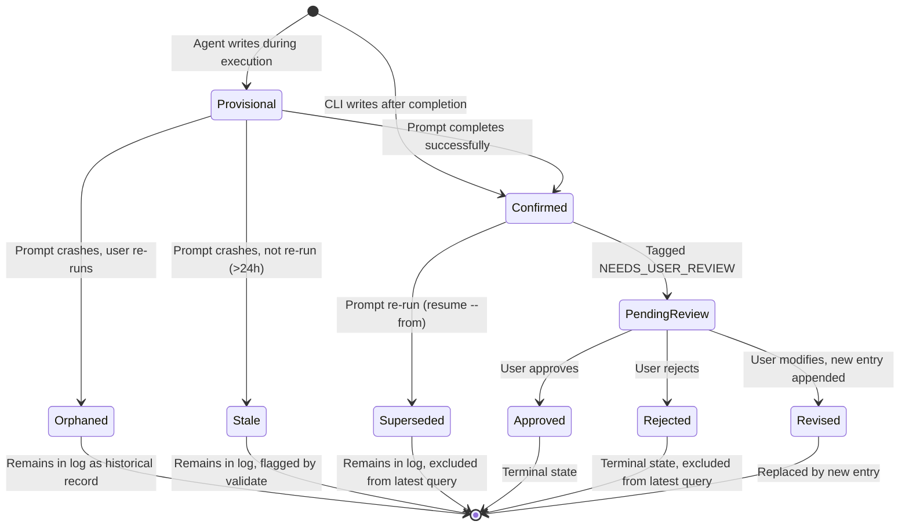

# Domain Model: Decision Log Lifecycle

**Domain ID**: 11
**Phase**: 1 — Deep Domain Modeling
**Depends on**: [03-pipeline-state-machine.md](03-pipeline-state-machine.md) (decision writes are tied to prompt completion), [09-cli-architecture.md](09-cli-architecture.md) (CLI orchestrates decision recording)
**Last updated**: 2026-03-12
**Status**: draft

---

## Section 1: Domain Overview

The Decision Log domain governs `.scaffold/decisions.jsonl` — an append-only JSONL file that persists key decisions made during pipeline execution across sessions. Every time a prompt completes, the executing agent may record 1–3 decisions capturing the reasoning behind significant choices (technology selections, architectural patterns, process trade-offs). These entries form a lightweight audit trail that downstream prompts consume for cross-session context continuity.

**Role in the v2 architecture**: The decision log sits downstream of the pipeline state machine ([domain 03](03-pipeline-state-machine.md)) and is orchestrated by the CLI ([domain 09](09-cli-architecture.md)). When the state machine transitions a prompt to `completed`, the CLI triggers decision recording as a post-completion side effect. Downstream prompts read the decision log via the session bootstrap summary (produced by `scaffold resume`) to understand prior choices without re-reading all predecessor artifacts. Platform adapters ([domain 05](05-platform-adapters.md)) determine how decisions are logged in practice: Claude Code agents interact with the user and record decisions conversationally; Codex agents make autonomous decisions and tag high-stakes ones with `NEEDS_USER_REVIEW`.

**Central design challenge**: Decisions are produced by AI agents with filesystem write access, yet the decision log must remain consistent, queryable, and merge-safe. The agent may crash mid-execution, leaving provisional entries. Multiple agents (in worktree-based parallel execution) may append concurrently. Re-running a prompt appends new decisions without removing old ones. The domain must define clear write semantics, a reliable "latest per prompt" query, and a crash recovery strategy that handles provisional entries gracefully — all while keeping the file format simple enough that `git merge` resolves concurrent appends without conflicts.

**Format rationale**: JSONL (one JSON object per line, no wrapping array) is chosen because it is append-only at the line level. JSON arrays conflict on every append because the closing bracket moves. JSONL appends are independent line additions that git can auto-merge.

---

## Section 2: Glossary

**decisions.jsonl** — The file at `.scaffold/decisions.jsonl` containing the append-only decision log. One JSON object per line. Committed to git.

**decision entry** — A single line in decisions.jsonl representing one key decision made during prompt execution. Contains the decision text, attribution, timestamp, and confirmation status.

**decision ID** — A sequential identifier in the format `D-NNN` (e.g., `D-001`, `D-042`). Unique within a single decisions.jsonl file. Assigned by reading the current max ID and incrementing.

**prompt_completed flag** — A boolean on each decision entry. `true` means the decision was written after the prompt completed successfully (confirmed). `false` means the decision was written during execution and the prompt may not have completed (provisional).

**provisional decision** — A decision entry with `prompt_completed: false`. May be from a crashed session where the agent's reasoning was incomplete. Downstream prompts should treat provisional decisions as uncertain.

**confirmed decision** — A decision entry with `prompt_completed: true`. The prompt that produced this decision completed successfully.

**latest decisions per prompt** — The algorithm for finding the current decisions when a prompt has been re-run. Since new decisions are appended (not replaced), consumers must identify which entries belong to the most recent execution.

**decision batch** — The set of 1–3 decision entries written during a single prompt execution. All entries in a batch share the same prompt slug and have temporally close timestamps. Exception: `scaffold adopt` may write more than 3 decisions per prompt when pre-populating from detected existing choices.

**NEEDS_USER_REVIEW** — A tag applied by Codex agents to high-stakes decisions (database choice, auth approach, infrastructure) that should be reviewed by a human before downstream work depends on them.

**decision category** — A classification of the decision type (technology, architecture, process, convention, infrastructure). Aids filtering and downstream consumption.

**session bootstrap** — The structured context block output by `scaffold resume` that includes recent decisions for the agent's context. Defined in [domain 09](09-cli-architecture.md).

**superseded decision** — A decision from a previous execution of the same prompt that has been replaced by a newer decision from a re-run. The old entry remains in the file (append-only) but is no longer returned by the "latest per prompt" query.

---

## Section 3: Entity Model

```typescript
// ============================================================
// Core Decision Types
// ============================================================

/**
 * A unique identifier for a decision entry.
 * Format: "D-" followed by a zero-padded sequential number.
 * Examples: "D-001", "D-042", "D-100"
 *
 * Invariant: IDs are unique within a single decisions.jsonl file.
 * Invariant: IDs are monotonically increasing (D-002 was written after D-001).
 */
type DecisionId = string;

/**
 * Classification of a decision's subject area.
 * Used for filtering and downstream consumption.
 *
 * - "technology": Choice of a specific library, framework, or tool
 *   (e.g., "Chose Vitest over Jest for speed")
 * - "architecture": Structural or design pattern decision
 *   (e.g., "Monorepo with shared packages")
 * - "process": Workflow, methodology, or team process choice
 *   (e.g., "Trunk-based development with short-lived branches")
 * - "convention": Coding style, naming, or formatting decision
 *   (e.g., "Using Biome instead of ESLint+Prettier")
 * - "infrastructure": Deployment, hosting, or CI/CD decision
 *   (e.g., "Deploy to Fly.io with GitHub Actions")
 */
type DecisionCategory =
  | 'technology'
  | 'architecture'
  | 'process'
  | 'convention'
  | 'infrastructure';

/**
 * Tags that can be applied to decision entries for special handling.
 *
 * - "NEEDS_USER_REVIEW": Decision was made autonomously (typically by
 *   Codex agents) and should be reviewed by a human before downstream
 *   work depends on it.
 */
type DecisionTag = 'NEEDS_USER_REVIEW';

/**
 * Review status for decisions tagged NEEDS_USER_REVIEW.
 * Transitions: pending → approved | rejected | revised
 *
 * - "pending": Not yet reviewed by a human
 * - "approved": Reviewed and accepted as-is
 * - "rejected": Reviewed and rejected; the decision should be superseded
 * - "revised": Reviewed and modified; a new decision entry was appended
 */
type ReviewStatus = 'pending' | 'approved' | 'rejected' | 'revised';

/**
 * A single entry in the decision log.
 * Each line in decisions.jsonl is one DecisionEntry serialized as JSON.
 *
 * This is the authoritative definition. Domain 09's DecisionEntry is
 * a subset used for CLI integration (omits category, tags, review_status).
 *
 * Invariants:
 * - id is unique within the file
 * - at is a valid ISO 8601 timestamp
 * - prompt matches a prompt slug in the resolved pipeline
 * - decision is non-empty (1–500 characters)
 * - completed_by is non-empty
 */
interface DecisionEntry {
  /**
   * Sequential decision ID.
   * Format: "D-NNN" where NNN is zero-padded to 3 digits.
   * Assigned at write time by reading the current max ID and incrementing.
   */
  id: DecisionId;

  /**
   * The slug of the prompt that produced this decision.
   * Matches the prompt key in state.json and the methodology manifest.
   * Used for grouping decisions by prompt and for the "latest per prompt" query.
   */
  prompt: string;

  /**
   * The decision text — a concise description of what was decided and why.
   * Should be self-contained: readable without other context.
   * Examples:
   *   "Chose Vitest over Jest for speed — 3x faster on cold starts"
   *   "Using PostgreSQL for ACID compliance; Redis for session cache"
   */
  decision: string;

  /**
   * ISO 8601 timestamp of when this decision was recorded.
   * Used for ordering within the "latest per prompt" query.
   */
  at: string;

  /**
   * Identity of who made this decision.
   * For human users: username or identifier.
   * For agents: the BD_ACTOR value (e.g., "agent-1", "codex-main").
   * For CLI-generated entries (brownfield adoption): "scaffold-adopt".
   */
  completed_by: string;

  /**
   * Whether the prompt completed successfully after this decision was recorded.
   * - true: Written by the CLI after confirmed prompt completion.
   *         This is the normal, reliable path.
   * - false: Written during execution before completion was confirmed.
   *          May indicate a crashed session with incomplete reasoning.
   *
   * Downstream consumers should prefer prompt_completed: true entries
   * and treat false entries as provisional.
   */
  prompt_completed: boolean;

  /**
   * Optional classification of the decision type.
   * Omitted if the agent doesn't categorize (backward-compatible).
   */
  category?: DecisionCategory;

  /**
   * Optional tags for special handling.
   * Used by Codex agents to flag high-stakes decisions for user review.
   */
  tags?: DecisionTag[];

  /**
   * Review status for decisions tagged NEEDS_USER_REVIEW.
   * Only present when tags includes NEEDS_USER_REVIEW.
   * Defaults to "pending" when first written.
   *
   * Note: Since JSONL is append-only, status changes are recorded by
   * appending a new entry with the same id and updated review_status.
   * The latest entry for a given id is authoritative.
   */
  review_status?: ReviewStatus;
}

// ============================================================
// Decision Write Types
// ============================================================

/**
 * Input for writing one or more decisions after prompt completion.
 * Produced by the CLI from the agent's structured output.
 */
interface DecisionWriteInput {
  /** Prompt slug that produced these decisions */
  prompt: string;

  /** Identity of the decision-maker (user, agent name, BD_ACTOR) */
  actor: string;

  /** Whether the prompt completed successfully */
  promptCompleted: boolean;

  /** The decisions to record (1–3 per prompt execution) */
  decisions: DecisionContent[];
}

/**
 * The content of a single decision, before ID assignment and timestamping.
 */
interface DecisionContent {
  /** The decision text */
  decision: string;

  /** Optional category classification */
  category?: DecisionCategory;

  /** Optional tags */
  tags?: DecisionTag[];
}

/**
 * Result of writing decisions to the log.
 */
interface DecisionWriteResult {
  /** Whether all decisions were written successfully */
  success: boolean;

  /** The entries that were written (with assigned IDs and timestamps) */
  entries: DecisionEntry[];

  /** Warnings encountered during writing */
  warnings: DecisionWarning[];

  /** Errors encountered during writing (success will be false) */
  errors: DecisionError[];
}

// ============================================================
// Decision Query Types
// ============================================================

/**
 * Result of the "latest decisions per prompt" query.
 * Maps each prompt slug to its most recent decision batch.
 */
interface LatestDecisionMap {
  /**
   * Map from prompt slug to the latest batch of decisions for that prompt.
   * Only includes prompts that have at least one decision entry.
   */
  byPrompt: Record<string, DecisionBatch>;

  /** Total number of entries in the file (including superseded) */
  totalEntries: number;

  /** Number of provisional entries (prompt_completed: false) */
  provisionalCount: number;

  /** Number of entries pending user review */
  pendingReviewCount: number;
}

/**
 * A batch of decisions from a single prompt execution.
 * Contains 1–3 entries, all for the same prompt, from the same run.
 */
interface DecisionBatch {
  /** The prompt slug */
  prompt: string;

  /** The decision entries in this batch */
  entries: DecisionEntry[];

  /** Whether all entries in this batch are confirmed (prompt_completed: true) */
  confirmed: boolean;

  /**
   * Whether earlier batches for this prompt exist (i.e., this is a re-run).
   * If true, this batch supersedes previous decisions for the same prompt.
   */
  supersedes: boolean;
}

/**
 * Filter criteria for querying decisions.
 */
interface DecisionQueryFilter {
  /** Filter by prompt slug(s) */
  prompts?: string[];

  /** Filter by category */
  categories?: DecisionCategory[];

  /** Filter by confirmation status */
  confirmedOnly?: boolean;

  /** Filter by review status */
  reviewStatus?: ReviewStatus;

  /** Filter by tag */
  tags?: DecisionTag[];

  /** Maximum number of entries to return (most recent first) */
  limit?: number;
}

// ============================================================
// Decision Validation Types
// ============================================================

/**
 * Result of validating all entries in decisions.jsonl.
 * Used by `scaffold validate`.
 */
interface DecisionValidationResult {
  /** Whether all entries are valid */
  valid: boolean;

  /** Total number of entries checked */
  totalEntries: number;

  /** Number of invalid entries */
  invalidCount: number;

  /** Validation errors, one per invalid entry */
  errors: DecisionValidationError[];

  /** Warnings (non-fatal issues) */
  warnings: DecisionWarning[];
}

/**
 * A validation error for a specific entry in decisions.jsonl.
 */
interface DecisionValidationError {
  /** 1-based line number in decisions.jsonl */
  line: number;

  /** The raw line content (truncated to 200 chars for display) */
  rawContent: string;

  /** What's wrong with this entry */
  reason: DecisionValidationReason;

  /** Machine-readable error code */
  code: DecisionErrorCode;
}

/**
 * Reasons a decision entry can be invalid.
 */
type DecisionValidationReason =
  | 'invalid_json'           // Line is not valid JSON
  | 'missing_field'          // Required field is absent
  | 'invalid_id_format'      // ID doesn't match D-NNN pattern
  | 'duplicate_id'           // Same ID appears more than once (within confirmed entries)
  | 'invalid_timestamp'      // 'at' field is not valid ISO 8601
  | 'empty_decision'         // 'decision' field is empty string
  | 'empty_actor'            // 'completed_by' field is empty string
  | 'unknown_prompt'         // 'prompt' doesn't match any prompt in the resolved pipeline
  | 'invalid_category'       // 'category' value is not a valid DecisionCategory
  | 'invalid_tag'            // 'tags' contains an unknown tag
  | 'invalid_review_status'; // 'review_status' is not a valid ReviewStatus

// ============================================================
// Brownfield / Adopt Types
// ============================================================

/**
 * A decision entry generated by `scaffold adopt` for an existing
 * codebase where implicit decisions can be detected from existing
 * files (package.json, existing code, CI config, etc.).
 */
interface AdoptedDecision {
  /** What was detected */
  decision: string;

  /** Source of the detection */
  detectedFrom: string;

  /** The prompt this decision is associated with */
  prompt: string;

  /** Category based on what was detected */
  category: DecisionCategory;

  /**
   * Confidence level of the detection.
   * - "high": Explicit dependency (e.g., "react" in package.json)
   * - "medium": Inferred from patterns (e.g., folder structure suggests monorepo)
   * - "low": Heuristic guess (e.g., .env file suggests specific hosting)
   */
  confidence: 'high' | 'medium' | 'low';
}

/**
 * Result of the adopt process's decision detection.
 */
interface AdoptDetectionResult {
  /** Detected decisions to write */
  decisions: AdoptedDecision[];

  /** Files that were scanned */
  scannedFiles: string[];

  /** Warnings during scanning */
  warnings: DecisionWarning[];
}

// ============================================================
// Error and Warning Types
// ============================================================

/**
 * Machine-readable error codes for the decision log domain.
 * Prefixed with "DECISION_" to avoid collision with other domains.
 */
type DecisionErrorCode =
  | 'DECISION_PARSE_ERROR'          // decisions.jsonl contains invalid JSON
  | 'DECISION_WRITE_FAILED'         // Failed to append to decisions.jsonl
  | 'DECISION_FILE_NOT_FOUND'       // decisions.jsonl does not exist when expected
  | 'DECISION_ID_COLLISION'         // ID assignment resulted in a duplicate
  | 'DECISION_VALIDATION_FAILED'    // One or more entries failed validation
  | 'DECISION_SCHEMA_ERROR'         // Entry has correct JSON but wrong shape
  | 'DECISION_PERMISSION_ERROR';    // Cannot read/write decisions.jsonl

/**
 * Machine-readable warning codes for the decision log domain.
 */
type DecisionWarningCode =
  | 'DECISION_PROVISIONAL_EXISTS'   // Provisional entries exist from possible crash
  | 'DECISION_PENDING_REVIEW'       // Entries tagged NEEDS_USER_REVIEW not yet reviewed
  | 'DECISION_UNKNOWN_PROMPT'       // Entry references a prompt not in current pipeline
  | 'DECISION_SUPERSEDED'           // Entry was superseded by a re-run
  | 'DECISION_EMPTY_LOG'            // decisions.jsonl exists but is empty
  | 'DECISION_HIGH_COUNT'           // More than 3 decisions for a single prompt execution
  | 'DECISION_STALE_PROVISIONAL';   // Provisional entry is older than 24 hours

/**
 * A structured error from the decision log domain.
 */
interface DecisionError {
  /** Machine-readable error code */
  code: DecisionErrorCode;

  /** Human-readable error message */
  message: string;

  /** Recovery guidance for the user */
  recovery: string;

  /** Optional: the line number in decisions.jsonl where the error was found */
  line?: number;
}

/**
 * A structured warning from the decision log domain.
 */
interface DecisionWarning {
  /** Machine-readable warning code */
  code: DecisionWarningCode;

  /** Human-readable warning message */
  message: string;

  /** Optional: the decision entry that triggered the warning */
  entry?: DecisionEntry;
}
```

---

## Section 4: State Transitions

A decision entry itself is immutable once written (append-only log). However, the *effective status* of a decision changes over its lifecycle. Since entries cannot be modified in place, status changes are modeled as new entries that supersede old ones.

### Decision Lifecycle



### State Definitions

| State | `prompt_completed` | Condition | Visibility in "Latest" Query |
|-------|:-:|---|---|
| Provisional | `false` | No confirmed entries exist for this prompt | Visible (best available) |
| Confirmed | `true` | Written after successful prompt completion | Visible |
| Orphaned | `false` | A confirmed entry exists for the same prompt from a later re-run | Hidden (superseded by confirmed) |
| Stale | `false` | Provisional for >24 hours, no re-run | Visible with warning |
| Superseded | `true` | A newer confirmed entry exists for the same prompt | Hidden |
| PendingReview | `true` | `tags` includes `NEEDS_USER_REVIEW`, `review_status: 'pending'` | Visible with warning |
| Approved | `true` | `review_status: 'approved'` | Visible |
| Rejected | `true` | `review_status: 'rejected'` | Hidden |
| Revised | `true` | `review_status: 'revised'`, newer entry exists | Hidden |

### Transition Mechanisms

Since JSONL is append-only, "transitions" are modeled by appending new entries:

1. **Provisional → Confirmed**: After the prompt completes, the CLI appends new entries with `prompt_completed: true` containing the same decisions. The provisional entries remain but are superseded by the newer confirmed entries in the "latest per prompt" query.

2. **Confirmed → Superseded**: When a prompt is re-run (`scaffold resume --from X`), new decisions are appended. The old confirmed entries remain but are no longer returned by the "latest per prompt" query.

3. **PendingReview → Approved/Rejected/Revised**: A new entry is appended with a new sequential ID, updated `review_status`, and the reviewer's identity in `completed_by`. The original entry remains in the file but is superseded by the review entry in the "latest per prompt" query.

---

## Section 5: Core Algorithms

### Algorithm 1: Decision ID Assignment

Assigns the next sequential ID, avoiding collisions even with concurrent appends.

```
function assignDecisionId(logPath: string): DecisionId
  INPUT: path to decisions.jsonl
  OUTPUT: next available DecisionId

  if not FILE_EXISTS(logPath):
    return "D-001"

  lines = READ_LINES(logPath)
  maxNum = 0

  FOR each line IN lines:
    if line.trim() is empty:
      CONTINUE
    entry = JSON.parse(line)
    // Extract numeric part: "D-042" → 42
    num = parseInt(entry.id.substring(2), 10)
    if num > maxNum:
      maxNum = num

  nextNum = maxNum + 1
  return "D-" + String(nextNum).padStart(3, '0')
```

**Collision handling**: If two agents append concurrently, both may compute the same next ID. This is detected during validation (`duplicate_id` reason). Resolution: the validation step assigns corrected IDs to the later entries (by file position). This is acceptable because IDs are for human reference and ordering, not for foreign key relationships.

### Algorithm 2: Write Decisions

Appends decision entries to the log file with atomic safety.

```
function writeDecisions(input: DecisionWriteInput, logPath: string): DecisionWriteResult
  INPUT: DecisionWriteInput with prompt, actor, decisions[]
  OUTPUT: DecisionWriteResult with assigned entries

  warnings = []
  errors = []
  entries = []

  // Guard: 1–3 decisions per prompt execution
  if input.decisions.length === 0:
    errors.push({ code: 'DECISION_WRITE_FAILED',
      message: 'No decisions to write', recovery: 'Provide at least one decision' })
    return { success: false, entries: [], warnings, errors }

  if input.decisions.length > 3:
    warnings.push({ code: 'DECISION_HIGH_COUNT',
      message: `${input.decisions.length} decisions for prompt '${input.prompt}' exceeds the recommended maximum of 3` })

  // Assign IDs
  nextId = assignDecisionId(logPath)

  timestamp = NOW_ISO8601()

  FOR each (content, index) IN input.decisions:
    idNum = parseInt(nextId.substring(2), 10) + index
    id = "D-" + String(idNum).padStart(3, '0')

    entry = {
      id: id,
      prompt: input.prompt,
      decision: content.decision,
      at: timestamp,
      completed_by: input.actor,
      prompt_completed: input.promptCompleted,
      ...(content.category ? { category: content.category } : {}),
      ...(content.tags ? { tags: content.tags } : {}),
      ...(content.tags?.includes('NEEDS_USER_REVIEW')
        ? { review_status: 'pending' } : {})
    }
    entries.push(entry)

  // Serialize and append (create file if it doesn't exist)
  lines = entries.map(e => JSON.stringify(e))
  appendText = lines.join('\n') + '\n'

  TRY:
    if not FILE_EXISTS(logPath):
      WRITE_FILE(logPath, appendText)
    else:
      APPEND_FILE(logPath, appendText)
  CATCH (err):
    errors.push({ code: 'DECISION_WRITE_FAILED',
      message: `Failed to write to ${logPath}: ${err.message}`,
      recovery: 'Check file permissions and disk space' })
    return { success: false, entries: [], warnings, errors }

  return { success: true, entries, warnings, errors }
```

**Atomicity note**: Unlike state.json (which uses atomic write-then-rename), decisions.jsonl uses simple append. This is intentional — appending to a file is atomic at the OS level for writes under the pipe buffer size (typically 4KB), and each decision entry is well under this limit. A partial write (power failure mid-append) would produce a truncated final line, which is detected and handled during parsing (the truncated line is skipped with a warning).

### Algorithm 3: Latest Decisions Per Prompt

The core query algorithm for finding the current decisions when prompts have been re-run.

```
function latestDecisionsPerPrompt(entries: DecisionEntry[]): LatestDecisionMap
  INPUT: all parsed entries from decisions.jsonl, in file order
  OUTPUT: LatestDecisionMap with the latest batch per prompt

  // Phase 1: Group entries by prompt slug, preserving file order
  byPrompt: Record<string, DecisionEntry[]> = {}
  FOR each entry IN entries:
    if entry.prompt not in byPrompt:
      byPrompt[entry.prompt] = []
    byPrompt[entry.prompt].push(entry)

  // Phase 2: For each prompt, identify the latest batch
  result: Record<string, DecisionBatch> = {}
  totalEntries = entries.length
  provisionalCount = 0
  pendingReviewCount = 0

  FOR each (prompt, promptEntries) IN byPrompt:
    // Find the index of the last confirmed entry (prompt_completed: true)
    lastConfirmedIdx = -1
    FOR i FROM promptEntries.length - 1 DOWN TO 0:
      if promptEntries[i].prompt_completed:
        lastConfirmedIdx = i
        BREAK

    if lastConfirmedIdx >= 0:
      // Collect the batch: all consecutive confirmed entries ending at lastConfirmedIdx
      // (a batch shares the same timestamp or is within 60 seconds)
      batchTimestamp = promptEntries[lastConfirmedIdx].at
      batchStart = lastConfirmedIdx

      WHILE batchStart > 0:
        prevEntry = promptEntries[batchStart - 1]
        if prevEntry.prompt_completed AND
           timeDiffSeconds(prevEntry.at, batchTimestamp) < 60:
          batchStart -= 1
        else:
          BREAK

      batchEntries = promptEntries.slice(batchStart, lastConfirmedIdx + 1)

      // Filter out rejected entries
      batchEntries = batchEntries.filter(e =>
        e.review_status !== 'rejected' AND e.review_status !== 'revised')

      result[prompt] = {
        prompt: prompt,
        entries: batchEntries,
        confirmed: true,
        supersedes: batchStart > 0  // earlier entries exist
      }
    else:
      // No confirmed entries — use all provisional entries as best-available
      result[prompt] = {
        prompt: prompt,
        entries: promptEntries,
        confirmed: false,
        supersedes: false
      }
      provisionalCount += promptEntries.length

    // Count pending reviews
    FOR each entry IN result[prompt].entries:
      if entry.review_status === 'pending':
        pendingReviewCount += 1

  return {
    byPrompt: result,
    totalEntries,
    provisionalCount,
    pendingReviewCount
  }
```

**Batch identification heuristic**: Entries from the same prompt execution share a timestamp within 60 seconds (decisions are written in rapid succession). This avoids the need for an explicit "execution ID" or "batch ID" field while correctly grouping decisions from a single run.

### Algorithm 4: Parse and Load Decision Log

Reads and parses decisions.jsonl, handling malformed entries gracefully.

```
function loadDecisionLog(logPath: string):
  { entries: DecisionEntry[], errors: DecisionError[], warnings: DecisionWarning[] }
  INPUT: path to decisions.jsonl
  OUTPUT: parsed entries, parse errors (skipped lines), and warnings

  entries = []
  errors = []
  warnings = []

  if not FILE_EXISTS(logPath):
    return { entries: [], errors: [], warnings: [] }

  lines = READ_LINES(logPath)

  FOR each (lineContent, lineNumber) IN lines:
    if lineContent.trim() === '':
      CONTINUE  // skip blank lines

    TRY:
      parsed = JSON.parse(lineContent)

      // Validate required fields
      if not parsed.id OR not parsed.prompt OR not parsed.decision OR
         not parsed.at OR not parsed.completed_by OR
         typeof parsed.prompt_completed !== 'boolean':
        errors.push({
          code: 'DECISION_SCHEMA_ERROR',
          message: `Line ${lineNumber + 1}: entry has valid JSON but missing required fields`,
          recovery: 'Add the missing required fields to this entry',
          line: lineNumber + 1
        })
        CONTINUE

      entries.push(parsed as DecisionEntry)

    CATCH (parseError):
      errors.push({
        code: 'DECISION_PARSE_ERROR',
        message: `Line ${lineNumber + 1}: invalid JSON (${parseError.message}). Skipped.`,
        recovery: 'Fix or remove the malformed line',
        line: lineNumber + 1
      })

  return { entries, errors, warnings }
```

**Resilience design**: Malformed lines are skipped with warnings rather than causing a hard failure. This ensures the log remains usable even if a crash produced a truncated final line or if a manual edit introduced an error.

### Algorithm 5: Validate Decision Log

Full validation used by `scaffold validate`.

```
function validateDecisionLog(
  logPath: string,
  pipelinePrompts: string[]
): DecisionValidationResult
  INPUT: path to decisions.jsonl, list of valid prompt slugs
  OUTPUT: DecisionValidationResult

  errors = []
  warnings = []
  seenIds = new Set<string>()
  totalEntries = 0

  if not FILE_EXISTS(logPath):
    return { valid: true, totalEntries: 0, invalidCount: 0, errors: [], warnings: [] }

  lines = READ_LINES(logPath)

  FOR each (lineContent, lineNumber) IN lines:
    if lineContent.trim() === '':
      CONTINUE

    totalEntries += 1
    lineNum = lineNumber + 1  // 1-based for display

    // Check 1: Valid JSON
    TRY:
      entry = JSON.parse(lineContent)
    CATCH:
      errors.push({
        line: lineNum,
        rawContent: lineContent.substring(0, 200),
        reason: 'invalid_json',
        code: 'DECISION_PARSE_ERROR'
      })
      CONTINUE

    // Check 2: Required fields present
    requiredFields = ['id', 'prompt', 'decision', 'at', 'completed_by', 'prompt_completed']
    FOR each field IN requiredFields:
      if field not in entry:
        errors.push({
          line: lineNum, rawContent: lineContent.substring(0, 200),
          reason: 'missing_field', code: 'DECISION_SCHEMA_ERROR'
        })
        CONTINUE outer

    // Check 3: ID format
    if not /^D-\d{3,}$/.test(entry.id):
      errors.push({
        line: lineNum, rawContent: lineContent.substring(0, 200),
        reason: 'invalid_id_format', code: 'DECISION_SCHEMA_ERROR'
      })

    // Check 4: Duplicate ID (among confirmed entries only)
    if entry.prompt_completed AND seenIds.has(entry.id):
      errors.push({
        line: lineNum, rawContent: lineContent.substring(0, 200),
        reason: 'duplicate_id', code: 'DECISION_ID_COLLISION'
      })
    seenIds.add(entry.id)

    // Check 5: Valid timestamp
    if not isValidISO8601(entry.at):
      errors.push({
        line: lineNum, rawContent: lineContent.substring(0, 200),
        reason: 'invalid_timestamp', code: 'DECISION_SCHEMA_ERROR'
      })

    // Check 6: Non-empty decision text (1–500 characters)
    if entry.decision.trim() === '':
      errors.push({
        line: lineNum, rawContent: lineContent.substring(0, 200),
        reason: 'empty_decision', code: 'DECISION_SCHEMA_ERROR'
      })
    else if entry.decision.length > 500:
      warnings.push({
        code: 'DECISION_HIGH_COUNT',
        message: `Line ${lineNum}: decision text is ${entry.decision.length} characters (recommended max: 500)`,
        entry: entry
      })

    // Check 7: Non-empty actor
    if entry.completed_by.trim() === '':
      errors.push({
        line: lineNum, rawContent: lineContent.substring(0, 200),
        reason: 'empty_actor', code: 'DECISION_SCHEMA_ERROR'
      })

    // Check 8: Known prompt (warning, not error — prompt may have been removed)
    if not pipelinePrompts.includes(entry.prompt):
      warnings.push({
        code: 'DECISION_UNKNOWN_PROMPT',
        message: `Line ${lineNum}: prompt '${entry.prompt}' is not in the current pipeline`,
        entry: entry
      })

    // Check 9: Valid category (if present)
    validCategories = ['technology', 'architecture', 'process', 'convention', 'infrastructure']
    if entry.category AND not validCategories.includes(entry.category):
      errors.push({
        line: lineNum, rawContent: lineContent.substring(0, 200),
        reason: 'invalid_category', code: 'DECISION_SCHEMA_ERROR'
      })

    // Check 10: Valid tags (if present)
    validTags = ['NEEDS_USER_REVIEW']
    if entry.tags:
      FOR each tag IN entry.tags:
        if not validTags.includes(tag):
          errors.push({
            line: lineNum, rawContent: lineContent.substring(0, 200),
            reason: 'invalid_tag', code: 'DECISION_SCHEMA_ERROR'
          })

    // Check 11: Valid review status (if present)
    validStatuses = ['pending', 'approved', 'rejected', 'revised']
    if entry.review_status AND not validStatuses.includes(entry.review_status):
      errors.push({
        line: lineNum, rawContent: lineContent.substring(0, 200),
        reason: 'invalid_review_status', code: 'DECISION_SCHEMA_ERROR'
      })

  // Post-scan checks
  if totalEntries === 0:
    warnings.push({
      code: 'DECISION_EMPTY_LOG',
      message: 'decisions.jsonl exists but contains no entries'
    })

  // Check for stale provisional entries
  { entries: parsedEntries } = loadDecisionLog(logPath)
  FOR each entry IN parsedEntries:
    if not entry.prompt_completed AND
       hoursSince(entry.at) > 24:
      warnings.push({
        code: 'DECISION_STALE_PROVISIONAL',
        message: `Decision ${entry.id} for prompt '${entry.prompt}' has been provisional for ${hoursSince(entry.at)} hours`,
        entry: entry
      })

  return {
    valid: errors.length === 0,
    totalEntries,
    invalidCount: errors.length,
    errors,
    warnings
  }
```

### Algorithm 6: Brownfield Decision Detection

Scans an existing codebase for implicit decisions that can be pre-populated during `scaffold adopt`.

```
function detectBrownfieldDecisions(projectRoot: string): AdoptDetectionResult
  INPUT: project root directory
  OUTPUT: detected decisions with confidence levels

  decisions = []
  scannedFiles = []
  warnings = []

  // 1. Scan package.json for technology decisions
  pkgPath = projectRoot + '/package.json'
  if FILE_EXISTS(pkgPath):
    scannedFiles.push(pkgPath)
    pkg = JSON.parse(READ_FILE(pkgPath))

    // Runtime framework
    if 'react' in pkg.dependencies:
      decisions.push({
        decision: `Using React ${pkg.dependencies.react} as UI framework`,
        detectedFrom: 'package.json dependencies',
        prompt: 'tech-stack',
        category: 'technology',
        confidence: 'high'
      })
    // (similar checks for vue, angular, svelte, next, express, etc.)

    // Test framework
    if 'vitest' in pkg.devDependencies:
      decisions.push({
        decision: `Using Vitest ${pkg.devDependencies.vitest} for testing`,
        detectedFrom: 'package.json devDependencies',
        prompt: 'tech-stack',
        category: 'technology',
        confidence: 'high'
      })

    // Linter/formatter
    if '@biomejs/biome' in pkg.devDependencies:
      decisions.push({
        decision: 'Using Biome for linting and formatting',
        detectedFrom: 'package.json devDependencies',
        prompt: 'coding-standards',
        category: 'convention',
        confidence: 'high'
      })

  // 2. Scan for CI/CD configuration
  FOR each ciPath IN ['.github/workflows/', '.gitlab-ci.yml', 'Jenkinsfile']:
    if FILE_EXISTS(projectRoot + '/' + ciPath):
      scannedFiles.push(ciPath)
      decisions.push({
        decision: `Using ${inferCIName(ciPath)} for CI/CD`,
        detectedFrom: ciPath,
        prompt: 'dev-env-setup',
        category: 'infrastructure',
        confidence: 'high'
      })

  // 3. Scan for project structure patterns
  if DIR_EXISTS(projectRoot + '/packages/') OR
     FILE_EXISTS(projectRoot + '/pnpm-workspace.yaml'):
    decisions.push({
      decision: 'Monorepo project structure',
      detectedFrom: 'packages/ directory or pnpm-workspace.yaml',
      prompt: 'project-structure',
      category: 'architecture',
      confidence: 'medium'
    })

  // 4. Scan for database choices
  // (check docker-compose.yml, .env, config files for postgres, mysql, etc.)

  return { decisions, scannedFiles, warnings }
```

### Algorithm 7: Decision Review Update

Records the result of a human reviewing a `NEEDS_USER_REVIEW` decision.

```
function reviewDecision(
  logPath: string,
  decisionId: DecisionId,
  newStatus: ReviewStatus,
  reviewer: string,
  revisedDecision?: string
): DecisionWriteResult
  INPUT: log path, decision to review, new status, reviewer identity
  OUTPUT: write result for the review update entry

  { entries: allEntries } = loadDecisionLog(logPath)

  // Find the original entry
  original = allEntries.find(e => e.id === decisionId)
  if not original:
    return { success: false, entries: [], warnings: [],
      errors: [{ code: 'DECISION_VALIDATION_FAILED',
        message: `Decision ${decisionId} not found in the log`, recovery: 'Check the decision ID with `scaffold validate`' }] }

  if not original.tags?.includes('NEEDS_USER_REVIEW'):
    return { success: false, entries: [], warnings: [],
      errors: [{ code: 'DECISION_SCHEMA_ERROR',
        message: `Decision ${decisionId} is not tagged NEEDS_USER_REVIEW`,
        recovery: 'Only decisions tagged NEEDS_USER_REVIEW can be reviewed' }] }

  // Construct the review entry directly (not via writeDecisions,
  // because writeDecisions does not support review_status passthrough)
  reviewEntry: DecisionEntry = {
    id: assignDecisionId(logPath),
    prompt: original.prompt,
    decision: revisedDecision || original.decision,
    at: NOW_ISO8601(),
    completed_by: reviewer,
    prompt_completed: true,
    category: original.category,
    tags: original.tags,
    review_status: newStatus
  }

  // Append directly
  appendText = JSON.stringify(reviewEntry) + '\n'
  TRY:
    APPEND_FILE(logPath, appendText)
  CATCH (err):
    return { success: false, entries: [], warnings: [],
      errors: [{ code: 'DECISION_WRITE_FAILED',
        message: `Failed to write review to ${logPath}: ${err.message}`,
        recovery: 'Check file permissions and disk space' }] }

  return { success: true, entries: [reviewEntry], warnings: [], errors: [] }
```

---

## Section 6: Error Taxonomy

### 6.1 Parse Errors

| Code | Message Template | Recovery Guidance |
|------|-----------------|-------------------|
| `DECISION_PARSE_ERROR` | `Line {n} in decisions.jsonl is not valid JSON: {parseError}` | Fix the malformed line or remove it. If the last line is truncated (crash during write), delete it. |

### 6.2 Schema Errors

| Code | Message Template | Recovery Guidance |
|------|-----------------|-------------------|
| `DECISION_SCHEMA_ERROR` | `Line {n} in decisions.jsonl: {reason}` | Fix the entry to match the required schema. Required fields: id, prompt, decision, at, completed_by, prompt_completed. |

### 6.3 Write Errors

| Code | Message Template | Recovery Guidance |
|------|-----------------|-------------------|
| `DECISION_WRITE_FAILED` | `Failed to append to decisions.jsonl: {osError}` | Check file permissions and available disk space. Ensure `.scaffold/` directory exists. |
| `DECISION_PERMISSION_ERROR` | `Cannot {read\|write} decisions.jsonl: {osError}` | Fix file permissions. The file should be readable and writable by the current user. |

### 6.4 ID Errors

| Code | Message Template | Recovery Guidance |
|------|-----------------|-------------------|
| `DECISION_ID_COLLISION` | `Decision ID {id} appears multiple times among confirmed entries (lines {n1}, {n2})` | This typically happens after concurrent appends. Run `scaffold validate --fix` to reassign duplicate IDs. |

### 6.5 File Errors

| Code | Message Template | Recovery Guidance |
|------|-----------------|-------------------|
| `DECISION_FILE_NOT_FOUND` | `Expected decisions.jsonl at {path} but file does not exist` | Run `scaffold init` to create the file, or create an empty file manually. |

### 6.6 Validation Errors

| Code | Message Template | Recovery Guidance |
|------|-----------------|-------------------|
| `DECISION_VALIDATION_FAILED` | `{count} entries in decisions.jsonl failed validation` | Run `scaffold validate` for details. Fix or remove invalid entries. |

### 6.7 Warnings

| Code | Severity | Message Template | Action |
|------|----------|-----------------|--------|
| `DECISION_PROVISIONAL_EXISTS` | medium | `{count} provisional decision(s) found. Prompt(s) {prompts} may not have completed.` | Review provisional entries. Re-run affected prompts if they crashed. |
| `DECISION_PENDING_REVIEW` | medium | `{count} decision(s) tagged NEEDS_USER_REVIEW are pending human review.` | Review decisions with `scaffold decisions --review`. |
| `DECISION_UNKNOWN_PROMPT` | low | `Decision {id} references prompt '{prompt}' which is not in the current pipeline.` | May indicate the pipeline was reconfigured. Safe to ignore if intentional. |
| `DECISION_SUPERSEDED` | info | `Decision {id} for prompt '{prompt}' was superseded by {newId}.` | Informational. The old decision remains for audit purposes. |
| `DECISION_EMPTY_LOG` | low | `decisions.jsonl exists but contains no entries.` | Normal for a freshly initialized pipeline. |
| `DECISION_HIGH_COUNT` | low | `Prompt '{prompt}' recorded {count} decisions (recommended max: 3).` | Consider consolidating related decisions. |
| `DECISION_STALE_PROVISIONAL` | high | `Decision {id} has been provisional for {hours} hours. The originating session may have crashed.` | Re-run the affected prompt or manually confirm the decision. |

---

## Section 7: Integration Points

### Domain 03 — Pipeline State Machine

**Direction**: Domain 03 → Domain 11 (state completion triggers decision write)
**Data flow**: When a prompt transitions to `completed` in state.json, the CLI's prompt-completion handler calls `writeDecisions()` with the decisions extracted from the prompt's output.
**Lifecycle stage**: Runtime (immediately after prompt completion)
**Contract**: Domain 03 provides the prompt slug, actor identity (from `TransitionMetadata.actor`), and `prompt_completed: true`. Domain 11 accepts a `DecisionWriteInput` and appends to decisions.jsonl.
**Assumption**: Decision writing is a side effect of prompt completion, not a prerequisite. If decision writing fails, the prompt is still marked complete in state.json (with a warning). The state machine does not read decisions.

### Domain 09 — CLI Command Architecture

**Direction**: Bidirectional
**Data flow**:
- **CLI → Domain 11**: `scaffold resume` loads decisions for the session bootstrap summary. `scaffold validate` calls the validation algorithm. `scaffold reset` deletes decisions.jsonl.
- **Domain 11 → CLI**: Decision entries are included in `ProjectContext.decisions` (loaded by `loadProjectContext`). Recent decisions appear in `ResumeData.recent_decisions`.

**Lifecycle stage**: Runtime (during CLI command execution)
**Contract**: Domain 09 defines `DecisionEntry` as a simplified interface in its `ProjectContext`. Domain 11's `DecisionEntry` is the authoritative schema. The CLI should use domain 11's full type internally and project to domain 09's subset for output.
**Assumption**: The CLI is the only writer to decisions.jsonl (no direct filesystem writes by agents during normal operation — see MQ2 for the full mechanism).

### Domain 05 — Platform Adapter System

**Direction**: Domain 05 → Domain 11 (adapters influence decision writing behavior)
**Data flow**: The platform adapter determines how decisions are collected from agent output:
- **Claude Code**: Decisions may be explicitly stated in conversational output. The CLI extracts them from the agent's structured response or the agent uses a tool call to record them.
- **Codex**: Decisions are made autonomously. High-stakes decisions are tagged `NEEDS_USER_REVIEW`. The CLI extracts decision markers from the agent's output and appends with appropriate tags.
- **Universal**: Decisions are presented as text in the agent's output and manually copied by the CLI.

**Lifecycle stage**: Build time (adapter determines collection mechanism) + Runtime (collection happens during prompt execution)
**Contract**: The adapter does not write to decisions.jsonl directly. It shapes the prompt text to include decision-recording instructions, and the CLI handles the actual write.

### Domain 06 — Config Schema & Validation

**Direction**: Domain 06 → Domain 11 (config provides methodology context)
**Data flow**: The methodology name from config.yml is not stored in decision entries directly, but is used for context when generating brownfield decisions during `scaffold adopt`.
**Lifecycle stage**: Init time (during adopt/brownfield detection)
**Contract**: Config provides `methodology` field. Decision entries do not carry methodology as a field — it's implicit from the pipeline context.

### Domain 07 — Adopt Command (Brownfield)

*Note: Domain 07 has not been modeled yet. This integration point is defined based on the spec's description of `scaffold adopt` behavior.*

**Direction**: Domain 07 → Domain 11 (adopt generates initial decisions)
**Data flow**: `scaffold adopt` runs `detectBrownfieldDecisions()` to scan the codebase for implicit decisions, then writes them as confirmed entries with `completed_by: "scaffold-adopt"`.
**Lifecycle stage**: Init time (during `scaffold adopt`)
**Contract**: Brownfield decisions have `prompt_completed: true` (they represent existing facts, not in-progress reasoning) and `confidence` metadata for human review.

---

## Section 8: Edge Cases & Failure Modes

### MQ1: Complete Decision Entry Schema

The complete `DecisionEntry` interface is defined in Section 3 (Entity Model). Key additions beyond what the spec explicitly specifies:

**Spec-defined fields** (6):
- `id`: Sequential ID in D-NNN format
- `prompt`: Prompt slug that produced the decision
- `decision`: The decision text
- `at`: ISO 8601 timestamp
- `completed_by`: Actor identity
- `prompt_completed`: Completion confirmation flag

**Domain-model additions** (3 optional fields):
- `category?: DecisionCategory` — Classification of the decision type (`technology`, `architecture`, `process`, `convention`, `infrastructure`). Aids downstream filtering. Made optional for backward compatibility — agents that don't categorize can omit it.
- `tags?: DecisionTag[]` — For special handling. The primary use case is `NEEDS_USER_REVIEW` for Codex autonomous decisions. Made optional and array-typed for extensibility.
- `review_status?: ReviewStatus` — Tracks the lifecycle of `NEEDS_USER_REVIEW` decisions (`pending`, `approved`, `rejected`, `revised`). Only present when `tags` includes `NEEDS_USER_REVIEW`.

**Rationale for not adding `superseded_by`**: Since the file is append-only and the "latest per prompt" query handles supersession algorithmically, a `superseded_by` field would require updating old entries (impossible in JSONL) or maintaining a separate index. The algorithm-based approach is simpler and consistent with the append-only design.

### MQ2: Decision Write Mechanism

The spec says "each prompt optionally records 1-3 key decisions after execution." The mechanism has two components:

**1. Decision extraction from prompt output**

Prompts include instructions in their "Process" section directing the agent to output decisions in a recognizable format. The recommended format is a markdown section at the end of the prompt's output:

```markdown
## Key Decisions

1. **[technology]** Chose Vitest over Jest — 3x faster cold starts, native ESM support
2. **[convention]** Using Biome instead of ESLint+Prettier — single tool, faster, simpler config
```

The CLI parses the agent's output for this `## Key Decisions` section and extracts entries. The `[category]` prefix is optional — if absent, no category is assigned.

**2. CLI writes after completion**

The CLI — not the agent — writes to decisions.jsonl. This ensures:
- The `prompt_completed` flag is set correctly (the CLI knows whether the prompt completed)
- IDs are assigned sequentially without race conditions within a single session
- The write uses the correct format and required fields
- Validation happens at write time

**Crash path (provisional entries)**: If the agent has filesystem write access and writes to decisions.jsonl directly during execution (before the CLI's post-completion handler runs), those entries have `prompt_completed: false` because the CLI hasn't confirmed completion. This is the origin of provisional entries — they bypass the CLI's controlled write path.

**Why the CLI extracts rather than the agent writing directly**: Direct agent writes would create coordination problems (ID collisions, format inconsistencies) and make the `prompt_completed` flag unreliable. The CLI as sole writer is a simpler, more reliable design. The provisional path exists as a safety net for crash scenarios, not as a primary mechanism.

### MQ3: Latest Decision Per Prompt Query

The "latest decisions per prompt" query algorithm is defined in Algorithm 3 (Section 5). Key design decisions:

**Batch identification**: Entries from a single prompt execution are grouped by temporal proximity (within 60 seconds of each other) and shared `prompt_completed` status. This avoids needing an explicit batch ID field.

**Confirmed vs. provisional preference**: When both confirmed and provisional entries exist for a prompt, the algorithm uses the latest confirmed batch. Provisional entries are only returned when no confirmed entries exist for that prompt.

**Re-run handling**: When a prompt is re-run, the new entries have later timestamps. The algorithm naturally selects the latest batch, making earlier entries "superseded" without explicit marking.

**Example walkthrough**:

Given this decisions.jsonl:
```
{"id":"D-001","prompt":"tech-stack","decision":"Chose Jest","at":"2026-03-12T10:00:00Z","completed_by":"ken","prompt_completed":true}
{"id":"D-002","prompt":"tech-stack","decision":"Using PostgreSQL","at":"2026-03-12T10:00:01Z","completed_by":"ken","prompt_completed":true}
{"id":"D-003","prompt":"tech-stack","decision":"Chose Vitest over Jest","at":"2026-03-12T14:00:00Z","completed_by":"ken","prompt_completed":true}
{"id":"D-004","prompt":"tech-stack","decision":"Using PostgreSQL","at":"2026-03-12T14:00:01Z","completed_by":"ken","prompt_completed":true}
```

Query result for `tech-stack`:
- Batch = [D-003, D-004] (latest confirmed batch, timestamps within 60s)
- D-001 and D-002 are superseded (earlier batch)
- `supersedes: true` (earlier batch exists)

### MQ4: Provisional Decision Crash Scenario

**Scenario**: Agent starts `tech-stack`, writes D-001 (`prompt_completed: false`), crashes. User re-runs `tech-stack`, writes D-002 (`prompt_completed: true`).

**State of decisions.jsonl after re-run**:
```
{"id":"D-001","prompt":"tech-stack","decision":"Leaning toward SQLite","at":"2026-03-12T10:40:00Z","completed_by":"agent-1","prompt_completed":false}
{"id":"D-002","prompt":"tech-stack","decision":"Chose PostgreSQL for ACID compliance","at":"2026-03-12T11:15:00Z","completed_by":"ken","prompt_completed":true}
```

**How D-001 is handled**:
1. D-001 is **never cleaned up**. It remains in the file permanently (append-only log).
2. The "latest per prompt" algorithm finds D-002 as the latest confirmed entry for `tech-stack`.
3. D-001 is classified as "orphaned" — a provisional entry superseded by a confirmed entry from a later run.
4. D-001 serves as a historical record of the crashed session's partial reasoning. This can be valuable for debugging or understanding why a prompt was re-run.
5. `scaffold validate` does NOT flag D-001 as an error — orphaned provisional entries are expected after crash recovery.

**What if the user does NOT re-run?**:
1. D-001 remains as the only entry for `tech-stack`, with `prompt_completed: false`.
2. The "latest per prompt" query returns D-001 as the best-available (provisional) decision.
3. After 24 hours, `scaffold validate` warns: `DECISION_STALE_PROVISIONAL` — "Decision D-001 has been provisional for 24+ hours."
4. Downstream prompts that consume decisions see D-001 with a note that it's provisional.

### MQ5: Decisions and `scaffold reset`

**Designed behavior**: `scaffold reset` deletes `.scaffold/decisions.jsonl` along with `.scaffold/state.json`. This is intentional — reset is a "start completely fresh" operation.

**Git preservation**: Since decisions.jsonl is committed to git, `git log` preserves the full history. A user can recover deleted decisions via `git show HEAD:..scaffold/decisions.jsonl` or by reverting the reset commit.

**What if the user wants to preserve decisions across a reset?**:

The spec does not provide a `--keep-decisions` flag. Three options are available:

1. **Manual backup**: Copy decisions.jsonl before reset, restore after.
   ```bash
   cp .scaffold/decisions.jsonl /tmp/decisions-backup.jsonl
   scaffold reset
   scaffold init
   cp /tmp/decisions-backup.jsonl .scaffold/decisions.jsonl
   ```

2. **Git recovery**: After reset, recover from git history.
   ```bash
   scaffold reset
   scaffold init
   git checkout HEAD~1 -- .scaffold/decisions.jsonl
   ```

3. **Selective reset** (recommended as future enhancement — see Open Questions): A `scaffold reset --keep-decisions` flag that preserves decisions.jsonl while resetting state.json. This would be useful when the user wants to restart the pipeline but retain the record of prior technology choices.

**Rationale for full deletion**: Decisions reference prompt slugs. If the user changes methodology (a common reason for resetting), the old decisions may reference prompts that no longer exist in the new pipeline. Keeping stale decisions would produce `DECISION_UNKNOWN_PROMPT` warnings and potentially mislead downstream prompts.

### MQ6: Brownfield Mode and Decision Log

In brownfield mode, existing projects have implicit decisions embedded in their codebase (e.g., `react` in `package.json` means "we chose React"). The `scaffold adopt` command detects these and generates initial decision entries.

**Detection mechanism**: Algorithm 6 (`detectBrownfieldDecisions`) scans:

| Source | What's Detected | Prompt | Confidence |
|--------|----------------|--------|:---:|
| `package.json` dependencies | Runtime framework (React, Vue, etc.) | `tech-stack` | high |
| `package.json` devDependencies | Test framework, linter, formatter | `tech-stack`, `coding-standards` | high |
| CI config files | CI/CD platform | `dev-env-setup` | high |
| `docker-compose.yml` | Database, cache, message queue | `tech-stack` | high |
| Directory structure | Monorepo vs. single-package | `project-structure` | medium |
| `.env` files | Hosting/deployment clues | `dev-env-setup` | low |

**Entry format**: Brownfield decisions are written with:
- `completed_by: "scaffold-adopt"` — clear attribution to the automated process
- `prompt_completed: true` — they represent existing facts, not in-progress reasoning
- `category` — always set based on the detection type
- No `NEEDS_USER_REVIEW` tag — the user is presented the full list during `scaffold adopt` and confirms before writing

**User confirmation flow** (in `scaffold adopt`):
```
Detected decisions from existing codebase:

  [tech-stack]
    ✓ Using React 18.3.1 as UI framework (from package.json)
    ✓ Using Vitest 2.1.0 for testing (from package.json)
    ✓ Using PostgreSQL (from docker-compose.yml)

  [coding-standards]
    ✓ Using Biome for linting and formatting (from package.json)

  [dev-env-setup]
    ✓ Using GitHub Actions for CI/CD (from .github/workflows/)

Record these decisions? [Y/n/edit]
```

The `edit` option lets the user modify or remove detected decisions before they're written.

### MQ7: Git Merge Scenario

**Initial state** (both Alice and Bob start from):
```
{"id":"D-001","prompt":"tech-stack","decision":"Chose Vitest over Jest","at":"2026-03-12T10:00:00Z","completed_by":"ken","prompt_completed":true}
```

**Alice's branch** (adds coding-standards decision):
```
{"id":"D-001","prompt":"tech-stack","decision":"Chose Vitest over Jest","at":"2026-03-12T10:00:00Z","completed_by":"ken","prompt_completed":true}
{"id":"D-002","prompt":"coding-standards","decision":"Using Biome instead of ESLint+Prettier","at":"2026-03-12T10:30:00Z","completed_by":"alice","prompt_completed":true}
```

**Bob's branch** (adds project-structure decision):
```
{"id":"D-001","prompt":"tech-stack","decision":"Chose Vitest over Jest","at":"2026-03-12T10:00:00Z","completed_by":"ken","prompt_completed":true}
{"id":"D-003","prompt":"project-structure","decision":"Monorepo with pnpm workspaces","at":"2026-03-12T10:45:00Z","completed_by":"bob","prompt_completed":true}
```

**Merged result** (git auto-merge succeeds):
```
{"id":"D-001","prompt":"tech-stack","decision":"Chose Vitest over Jest","at":"2026-03-12T10:00:00Z","completed_by":"ken","prompt_completed":true}
{"id":"D-002","prompt":"coding-standards","decision":"Using Biome instead of ESLint+Prettier","at":"2026-03-12T10:30:00Z","completed_by":"alice","prompt_completed":true}
{"id":"D-003","prompt":"project-structure","decision":"Monorepo with pnpm workspaces","at":"2026-03-12T10:45:00Z","completed_by":"bob","prompt_completed":true}
```

**Why this works**: Both branches appended new lines after the shared D-001 line. Git's merge algorithm sees each branch adding new content at the end of the file. Since the additions are at different positions relative to the common ancestor (both after line 1, but git treats concurrent appends as non-conflicting), git includes both additions.

**Edge case — same final line**: If the file does NOT end with a trailing newline and both branches append, they may "modify" the last line (by adding `\n` to it). This can cause a merge conflict. **Mitigation**: Algorithm 2 always appends with a trailing newline (`appendText = lines.join('\n') + '\n'`), ensuring the file always ends with `\n`.

**Edge case — duplicate IDs**: Alice assigns D-002, Bob assigns D-003. But if both had started from an empty file (only D-001), and both assigned the next ID (D-002), the merge would contain two entries with ID D-002. This is detected by `scaffold validate` and corrected by reassigning one of them. See MQ8 for the full ID collision strategy.

### MQ8: ID Generation Strategy

**Current design**: Sequential IDs in `D-NNN` format, assigned by reading the max ID from the file and incrementing (Algorithm 1).

**Collision scenarios and mitigations**:

| Scenario | Risk | Mitigation |
|----------|------|------------|
| Single agent, sequential prompts | None | Normal sequential assignment |
| Single agent, re-run prompt | None | New ID is higher than all previous |
| Two agents on same machine (worktrees) | Low | Both read the same file (shared `.scaffold/`) and increment. If appends interleave, one agent's ID assignment may be stale. |
| Two agents on different machines | Medium | Each reads their local copy. After merge, duplicate IDs may appear. |
| `scaffold adopt` + concurrent prompt | Low | Adopt writes before any prompt executes |

**Collision resolution**: ID collisions are handled as a validation concern, not a write-time concern. This keeps the write path simple and fast.

1. `scaffold validate` detects duplicate IDs among confirmed entries.
2. When `--fix` is passed, it reassigns IDs to the later-occurring entries (by file position) while preserving the `D-NNN` format with higher numbers.
3. This is acceptable because decision IDs are for human reference and log ordering, not for foreign key relationships. No other system references decisions by ID.

**Why not UUIDs or timestamps**: The `D-NNN` format is chosen for human readability. A user reviewing the decision log should be able to say "D-005 was the Vitest decision" without parsing UUIDs. The collision risk is low (it requires concurrent appends from separate machines) and the resolution is straightforward.

**Future consideration**: If parallel execution becomes the norm, a compound ID format like `D-{actor}-NNN` (e.g., `D-alice-002`) would eliminate collisions entirely while remaining human-readable. This is listed as an open question.

### MQ9: Decision Categories

Five categories are defined, based on the types of decisions pipeline prompts typically make:

| Category | Description | Typical Prompts | Examples |
|----------|-------------|----------------|----------|
| `technology` | Choice of specific library, framework, runtime, or tool | `tech-stack`, `tdd` | "Chose Vitest over Jest", "Using PostgreSQL" |
| `architecture` | Structural or design pattern decisions | `project-structure`, `tech-stack` | "Monorepo with shared packages", "Event-driven architecture" |
| `process` | Workflow, methodology, or team process choices | `git-workflow`, `coding-standards` | "Trunk-based development", "PR reviews required" |
| `convention` | Coding style, naming, formatting decisions | `coding-standards`, `design-system` | "Using Biome", "BEM naming for CSS" |
| `infrastructure` | Deployment, hosting, CI/CD decisions | `dev-env-setup`, `tech-stack` | "Deploy to Fly.io", "GitHub Actions for CI" |

**How categorization aids downstream consumption**:

1. **Filtering**: `scaffold decisions --category technology` shows only technology choices, useful when reviewing what tech was selected without wading through process decisions.

2. **Context relevance**: When the `coding-standards` prompt runs, it primarily needs `technology` and `convention` decisions from upstream prompts, not `infrastructure` decisions. The category enables targeted filtering in the session bootstrap.

3. **Review prioritization**: For Codex's `NEEDS_USER_REVIEW` decisions, `technology` and `infrastructure` decisions are typically higher-stakes than `convention` decisions. Categories help prioritize the review queue.

**Optional field rationale**: Categories are optional in the `DecisionEntry` schema for backward compatibility. Agents that don't categorize produce valid entries without the field. Over time, prompts should be updated to include category instructions, making uncategorized entries increasingly rare.

### MQ10: Codex Agent Decision Flow

In Claude Code, the agent interacts with the user for decisions (`AskUserQuestionTool`). In Codex, the agent runs autonomously and must make decisions without user input.

**Codex decision flow**:

```
1. Codex agent executes a prompt (e.g., tech-stack)
2. Agent encounters a decision point (which testing framework?)
3. Agent makes best-judgment decision based on:
   - Project context (existing code, dependencies)
   - PRD requirements
   - Previous decisions in decisions.jsonl
4. If decision is high-stakes (database, auth, infrastructure):
   a. Agent tags decision with NEEDS_USER_REVIEW
   b. Decision is recorded with tags: ['NEEDS_USER_REVIEW']
   c. review_status is set to 'pending'
5. If decision is routine (formatting tool, naming convention):
   a. Agent records decision without special tagging
6. CLI appends entries to decisions.jsonl after prompt completion
```

**Where do NEEDS_USER_REVIEW decisions surface?**

They are stored in decisions.jsonl — the same file as all other decisions. They surface through multiple channels:

1. **Session bootstrap** (`scaffold resume`): The "Recent Decisions" section flags pending reviews:
   ```
   === Recent Decisions ===
     - [tech-stack] Chose PostgreSQL for ACID compliance
     - [tech-stack] ⚠️ NEEDS REVIEW: Using Firebase Auth for authentication (by codex-main)
   ```

2. **JSON output** (`scaffold resume --format json`): The `recent_decisions` array includes `review_status: "pending"` for flagged entries, enabling automated tooling to detect unreviewed decisions.

3. **Validation** (`scaffold validate`): Produces `DECISION_PENDING_REVIEW` warning listing all unreviewed decisions.

4. **Status display** (`scaffold status`): Shows a count of pending reviews in the pipeline summary.

**Review workflow**: The user reviews decisions via `scaffold validate` output or by reading decisions.jsonl directly. To approve or reject:

```bash
# Future: dedicated review command
scaffold decisions review D-003 --approve
scaffold decisions review D-004 --reject --reason "Use Auth0 instead"
```

Until the dedicated command is implemented, the user can manually append a review entry:
```bash
echo '{"id":"D-005","prompt":"tech-stack","decision":"Using Auth0 instead of Firebase Auth","at":"2026-03-12T15:00:00Z","completed_by":"ken","prompt_completed":true,"category":"technology","tags":["NEEDS_USER_REVIEW"],"review_status":"revised"}' >> .scaffold/decisions.jsonl
```

**Cross-platform decision consistency**: Both Claude Code and Codex agents write to the same decisions.jsonl. The file format is identical regardless of which platform produced the decision. The only difference is:
- Claude Code entries typically lack `NEEDS_USER_REVIEW` tags (decisions were confirmed interactively)
- Codex entries may include `NEEDS_USER_REVIEW` tags (decisions were made autonomously)
- Both use the same schema, same ID format, same file

---

## Section 9: Testing Considerations

### Properties to Verify

1. **Append-only integrity**: Writing never modifies or removes existing entries
2. **Parse resilience**: Malformed lines are skipped without affecting valid entries
3. **Latest-per-prompt correctness**: The query algorithm returns exactly the most recent batch for each prompt, handling re-runs, crashes, and reviews
4. **ID uniqueness**: Sequential IDs are correctly assigned and collisions are detected during validation
5. **Batch grouping**: Entries from a single prompt execution are correctly grouped as a batch (60-second window)
6. **Provisional handling**: Provisional entries are returned only when no confirmed entries exist for the same prompt
7. **Review status tracking**: NEEDS_USER_REVIEW entries track review status correctly through the append-only mechanism
8. **Validation completeness**: All 11 validation checks in Algorithm 5 correctly identify errors and warnings

### Highest-Value Test Cases (by risk)

1. **Re-run with provisional + confirmed entries**: Prompt runs (provisional D-001), crashes, re-runs (confirmed D-002). Verify D-002 is returned, D-001 is orphaned.
2. **Concurrent append from two agents**: Both append at the same time. Verify file is not corrupted and both entries are present.
3. **Truncated last line (crash during write)**: Simulate a crash mid-append. Verify the truncated line is skipped with a warning and all previous entries are intact.
4. **Git merge of concurrent appends**: Two branches append different decisions. Verify the merge result contains both and validation passes.
5. **Empty file**: decisions.jsonl exists but is empty. Verify no errors, correct handling by all algorithms.
6. **Brownfield detection accuracy**: Verify package.json parsing correctly identifies frameworks, test tools, linters.
7. **ID collision detection and resolution**: Two entries with the same ID. Verify validation catches it and fix reassigns correctly.
8. **NEEDS_USER_REVIEW lifecycle**: Create → review → approve. Verify latest query returns the approved version.

### Test Doubles/Mocks Needed

- **Filesystem mock**: For controlling file content, simulating missing files, permission errors, and append failures.
- **Clock mock**: For deterministic timestamps. Tests need reproducible `NOW_ISO8601()` output.
- **Package.json fixtures**: Various package.json files with different dependency configurations for brownfield detection testing.
- **Git merge simulation**: Pre-computed merge results for testing the JSONL merge properties.

### Property-Based Testing Candidates

- **Append monotonicity**: After any write operation, the file contains all previous entries plus the new ones. No entry is ever removed or modified.
- **Latest query stability**: Running the latest-per-prompt query twice on the same file produces identical results.
- **ID ordering**: For any two entries where entry A appears before entry B in the file, `parseInt(A.id.substring(2)) < parseInt(B.id.substring(2))` (within a single-agent session).
- **Validation idempotency**: Running validate twice on the same file produces the same error/warning list.

### Cross-Domain Integration Tests

| Scenario | Domains | What to verify |
|----------|---------|---------------|
| Prompt completion triggers decision write | 03, 09, 11 | State transition to `completed` → CLI calls `writeDecisions()` → entries appear in decisions.jsonl with `prompt_completed: true` |
| Session bootstrap includes recent decisions | 09, 11 | `scaffold resume` loads decisions and includes the latest 5 in the session bootstrap summary |
| `scaffold validate` checks decision log | 09, 11 | Malformed entries produce `VALIDATE_DECISIONS_INVALID` error in the validation report |
| `scaffold reset` deletes decision log | 03, 09, 11 | After reset, decisions.jsonl is deleted; `scaffold resume` starts with an empty decision set |
| `scaffold adopt` generates brownfield decisions | 07, 11 | Adopt scans codebase, generates detected decisions, user confirms, entries written |
| Crash recovery with provisional decisions | 03, 11 | Session crashes → provisional entries remain → re-run appends confirmed entries → latest query returns confirmed |
| Codex NEEDS_USER_REVIEW in session bootstrap | 05, 09, 11 | Codex-tagged decisions appear with review flag in `scaffold resume` output |

---

## Section 10: Open Questions & Recommendations

### Open Questions

**OQ1: Should `scaffold reset` support `--keep-decisions`?**

Current behavior: reset deletes decisions.jsonl entirely. A `--keep-decisions` flag would preserve the decision log while resetting pipeline state, useful when the user wants to restart the pipeline but retain the record of prior decisions. The risk is that preserved decisions may reference prompts that no longer exist after a methodology change.

**Recommendation**: Implement `--keep-decisions` with a warning that decisions referencing removed prompts will produce `DECISION_UNKNOWN_PROMPT` warnings. The decision log is valuable as a historical record even if some entries don't map to the current pipeline.

**OQ2: Should decision IDs include actor identity to prevent collisions?**

Current design uses simple sequential `D-NNN` IDs. A compound format like `D-{actor}-NNN` would eliminate concurrent-append collisions entirely. Trade-offs:
- Pro: Zero collision risk, clear attribution in the ID itself
- Con: Longer IDs, less human-friendly, the actor is already in the `completed_by` field

**Recommendation**: Keep `D-NNN` for v2.0. The collision risk is low (requires concurrent appends from different machines) and the resolution is straightforward. If parallel execution adoption grows and collisions become frequent, migrate to compound IDs in a future version.

**OQ3: Should there be a dedicated `scaffold decisions` command?**

Current design surfaces decisions through `scaffold resume` (session bootstrap), `scaffold validate` (validation), and `scaffold status` (summary). A dedicated `scaffold decisions` command could offer:
- `scaffold decisions list` — show all decisions
- `scaffold decisions list --latest` — show latest per prompt
- `scaffold decisions review` — interactive review of NEEDS_USER_REVIEW entries
- `scaffold decisions export` — export as markdown table for documentation

**Recommendation**: Implement `scaffold decisions` as a subcommand in Phase 2. For v2.0, decisions are accessible through existing commands. This is a candidate for an ADR once implementation begins.

**OQ4: How should the 60-second batch window be configurable?**

The "latest per prompt" algorithm uses a 60-second window to group entries into batches from the same execution. This works for most cases but could fail if:
- An agent takes >60 seconds between writing two decisions (unlikely but possible for slow models)
- Two rapid re-runs of the same prompt occur within 60 seconds (decisions from different runs could be incorrectly grouped)

**Recommendation**: Keep 60 seconds as a hard-coded default. If edge cases emerge in practice, add a configurable `decision_batch_window_seconds` to config.yml.

### Recommendations

**R1**: Add `## Key Decisions` section instructions to all base prompts to standardize decision extraction by the CLI. Without consistent formatting, the CLI's extraction logic would need to handle arbitrary output formats.

**R2**: Implement `scaffold validate --fix` for decision ID collision resolution before launching parallel execution support. Collisions will be rare but confusing without automated repair.

**R3**: Surface `NEEDS_USER_REVIEW` counts prominently in `scaffold status` output, especially after Codex runs. A user who doesn't notice unreviewed decisions may proceed with incorrect assumptions.

**R4**: Consider adding a `confidence` field to standard decision entries (not just brownfield). An agent could express uncertainty: "Chose SQLite (confidence: medium — may need to upgrade to PostgreSQL at scale)." This would help downstream prompts assess how firm prior decisions are.

**R5**: Document the `## Key Decisions` output format in the prompt writing guide so custom prompt authors know how to enable decision recording in their prompts.

**R6**: Add a pre-commit hook or CI check that runs `scaffold validate` on decisions.jsonl to catch malformed entries before they're shared via git push.

---

## Section 11: Concrete Examples

### Example 1: Normal Pipeline Execution with Decisions

A user runs three prompts, each recording decisions.

**decisions.jsonl after three completed prompts**:
```jsonl
{"id":"D-001","prompt":"tech-stack","decision":"Chose Vitest over Jest for speed — 3x faster on cold starts, native ESM support","at":"2026-03-12T10:40:00Z","completed_by":"ken","prompt_completed":true,"category":"technology"}
{"id":"D-002","prompt":"tech-stack","decision":"Using PostgreSQL for ACID compliance; Redis for session cache only","at":"2026-03-12T10:40:01Z","completed_by":"ken","prompt_completed":true,"category":"technology"}
{"id":"D-003","prompt":"coding-standards","decision":"Using Biome instead of ESLint+Prettier — single tool, 10x faster, simpler config","at":"2026-03-12T10:55:00Z","completed_by":"ken","prompt_completed":true,"category":"convention"}
{"id":"D-004","prompt":"project-structure","decision":"Monorepo with pnpm workspaces — shared types package between API and frontend","at":"2026-03-12T11:10:00Z","completed_by":"ken","prompt_completed":true,"category":"architecture"}
{"id":"D-005","prompt":"project-structure","decision":"Using path aliases (@app/, @shared/) for clean imports","at":"2026-03-12T11:10:01Z","completed_by":"ken","prompt_completed":true,"category":"convention"}
```

**Session bootstrap output for the next prompt** (`scaffold resume`):
```
=== Recent Decisions ===
  - [tech-stack] Chose Vitest over Jest for speed
  - [tech-stack] Using PostgreSQL for ACID compliance; Redis for session cache
  - [coding-standards] Using Biome instead of ESLint+Prettier
  - [project-structure] Monorepo with pnpm workspaces
  - [project-structure] Using path aliases (@app/, @shared/) for clean imports
```

### Example 2: Crash Recovery with Re-run

An agent starts `tech-stack`, writes provisional decisions, crashes. The user re-runs the prompt.

**After initial (crashed) execution**:
```jsonl
{"id":"D-001","prompt":"tech-stack","decision":"Leaning toward SQLite for simplicity","at":"2026-03-12T10:40:00Z","completed_by":"agent-1","prompt_completed":false}
```

**After re-run completes successfully**:
```jsonl
{"id":"D-001","prompt":"tech-stack","decision":"Leaning toward SQLite for simplicity","at":"2026-03-12T10:40:00Z","completed_by":"agent-1","prompt_completed":false}
{"id":"D-002","prompt":"tech-stack","decision":"Chose PostgreSQL for ACID compliance — SQLite wouldn't handle concurrent writes from multiple API instances","at":"2026-03-12T11:15:00Z","completed_by":"ken","prompt_completed":true,"category":"technology"}
{"id":"D-003","prompt":"tech-stack","decision":"Using Redis for session cache and rate limiting","at":"2026-03-12T11:15:01Z","completed_by":"ken","prompt_completed":true,"category":"technology"}
```

**"Latest per prompt" query result for `tech-stack`**: [D-002, D-003] (confirmed batch). D-001 is orphaned.

### Example 3: Codex Autonomous Execution with NEEDS_USER_REVIEW

A Codex agent runs multiple prompts autonomously, tagging high-stakes decisions.

**decisions.jsonl after Codex run**:
```jsonl
{"id":"D-001","prompt":"tech-stack","decision":"Using Next.js 15 with App Router — matches PRD requirement for SSR","at":"2026-03-12T10:00:00Z","completed_by":"codex-main","prompt_completed":true,"category":"technology"}
{"id":"D-002","prompt":"tech-stack","decision":"Using Supabase (PostgreSQL + Auth + Storage) as backend platform","at":"2026-03-12T10:00:01Z","completed_by":"codex-main","prompt_completed":true,"category":"technology","tags":["NEEDS_USER_REVIEW"],"review_status":"pending"}
{"id":"D-003","prompt":"tech-stack","decision":"Using Stripe for payment processing","at":"2026-03-12T10:00:02Z","completed_by":"codex-main","prompt_completed":true,"category":"infrastructure","tags":["NEEDS_USER_REVIEW"],"review_status":"pending"}
{"id":"D-004","prompt":"coding-standards","decision":"Using ESLint + Prettier (Biome doesn't support all Next.js plugins yet)","at":"2026-03-12T10:15:00Z","completed_by":"codex-main","prompt_completed":true,"category":"convention"}
```

**Validation output** (`scaffold validate`):
```
Decisions
  ⚠ 2 decisions tagged NEEDS_USER_REVIEW are pending human review:
    D-002: [tech-stack] Using Supabase as backend platform (by codex-main)
    D-003: [tech-stack] Using Stripe for payment processing (by codex-main)
```

**After user reviews and revises D-002**:
```jsonl
{"id":"D-001","prompt":"tech-stack","decision":"Using Next.js 15 with App Router — matches PRD requirement for SSR","at":"2026-03-12T10:00:00Z","completed_by":"codex-main","prompt_completed":true,"category":"technology"}
{"id":"D-002","prompt":"tech-stack","decision":"Using Supabase (PostgreSQL + Auth + Storage) as backend platform","at":"2026-03-12T10:00:01Z","completed_by":"codex-main","prompt_completed":true,"category":"technology","tags":["NEEDS_USER_REVIEW"],"review_status":"pending"}
{"id":"D-003","prompt":"tech-stack","decision":"Using Stripe for payment processing","at":"2026-03-12T10:00:02Z","completed_by":"codex-main","prompt_completed":true,"category":"infrastructure","tags":["NEEDS_USER_REVIEW"],"review_status":"pending"}
{"id":"D-004","prompt":"coding-standards","decision":"Using ESLint + Prettier (Biome doesn't support all Next.js plugins yet)","at":"2026-03-12T10:15:00Z","completed_by":"codex-main","prompt_completed":true,"category":"convention"}
{"id":"D-005","prompt":"tech-stack","decision":"Using Auth0 instead of Supabase Auth — team already has Auth0 SSO configured","at":"2026-03-12T15:00:00Z","completed_by":"ken","prompt_completed":true,"category":"technology","tags":["NEEDS_USER_REVIEW"],"review_status":"revised"}
{"id":"D-006","prompt":"tech-stack","decision":"Using Stripe for payment processing","at":"2026-03-12T15:00:01Z","completed_by":"ken","prompt_completed":true,"category":"infrastructure","tags":["NEEDS_USER_REVIEW"],"review_status":"approved"}
```

### Example 4: Concurrent Append and Git Merge

Two team members work on different prompts in parallel using worktrees.

**Common ancestor** (after init):
```jsonl
{"id":"D-001","prompt":"tech-stack","decision":"Using React with TypeScript","at":"2026-03-12T09:00:00Z","completed_by":"ken","prompt_completed":true,"category":"technology"}
```

**Alice's worktree** (completes `coding-standards`):
```jsonl
{"id":"D-001","prompt":"tech-stack","decision":"Using React with TypeScript","at":"2026-03-12T09:00:00Z","completed_by":"ken","prompt_completed":true,"category":"technology"}
{"id":"D-002","prompt":"coding-standards","decision":"Using Biome for linting and formatting","at":"2026-03-12T10:30:00Z","completed_by":"alice","prompt_completed":true,"category":"convention"}
```

**Bob's worktree** (completes `project-structure`):
```jsonl
{"id":"D-001","prompt":"tech-stack","decision":"Using React with TypeScript","at":"2026-03-12T09:00:00Z","completed_by":"ken","prompt_completed":true,"category":"technology"}
{"id":"D-002","prompt":"project-structure","decision":"Feature-based directory structure","at":"2026-03-12T10:45:00Z","completed_by":"bob","prompt_completed":true,"category":"architecture"}
```

**After git merge** (auto-merged, no conflicts):
```jsonl
{"id":"D-001","prompt":"tech-stack","decision":"Using React with TypeScript","at":"2026-03-12T09:00:00Z","completed_by":"ken","prompt_completed":true,"category":"technology"}
{"id":"D-002","prompt":"coding-standards","decision":"Using Biome for linting and formatting","at":"2026-03-12T10:30:00Z","completed_by":"alice","prompt_completed":true,"category":"convention"}
{"id":"D-002","prompt":"project-structure","decision":"Feature-based directory structure","at":"2026-03-12T10:45:00Z","completed_by":"bob","prompt_completed":true,"category":"architecture"}
```

**Note**: Both assigned D-002 (ID collision). `scaffold validate` detects:
```
Decisions
  ✗ Decision ID D-002 appears on lines 2 and 3 (among confirmed entries)
```

Running `scaffold validate --fix` reassigns Bob's entry to D-003:
```jsonl
{"id":"D-001","prompt":"tech-stack","decision":"Using React with TypeScript","at":"2026-03-12T09:00:00Z","completed_by":"ken","prompt_completed":true,"category":"technology"}
{"id":"D-002","prompt":"coding-standards","decision":"Using Biome for linting and formatting","at":"2026-03-12T10:30:00Z","completed_by":"alice","prompt_completed":true,"category":"convention"}
{"id":"D-003","prompt":"project-structure","decision":"Feature-based directory structure","at":"2026-03-12T10:45:00Z","completed_by":"bob","prompt_completed":true,"category":"architecture"}
```

### Example 5: Brownfield Adoption

User runs `scaffold adopt` on an existing Next.js project.

**Existing project files scanned**:
- `package.json` with React 18, Next.js 15, Vitest, Biome
- `.github/workflows/ci.yml` for GitHub Actions
- `docker-compose.yml` with PostgreSQL service
- `packages/` directory (monorepo)

**Generated decisions.jsonl**:
```jsonl
{"id":"D-001","prompt":"tech-stack","decision":"Using React 18.3.1 as UI framework","at":"2026-03-12T09:00:00Z","completed_by":"scaffold-adopt","prompt_completed":true,"category":"technology"}
{"id":"D-002","prompt":"tech-stack","decision":"Using Next.js 15.1.0 as application framework","at":"2026-03-12T09:00:00Z","completed_by":"scaffold-adopt","prompt_completed":true,"category":"technology"}
{"id":"D-003","prompt":"tech-stack","decision":"Using Vitest 2.1.0 for testing","at":"2026-03-12T09:00:00Z","completed_by":"scaffold-adopt","prompt_completed":true,"category":"technology"}
{"id":"D-004","prompt":"tech-stack","decision":"Using PostgreSQL (detected from docker-compose.yml)","at":"2026-03-12T09:00:00Z","completed_by":"scaffold-adopt","prompt_completed":true,"category":"technology"}
{"id":"D-005","prompt":"coding-standards","decision":"Using Biome for linting and formatting","at":"2026-03-12T09:00:00Z","completed_by":"scaffold-adopt","prompt_completed":true,"category":"convention"}
{"id":"D-006","prompt":"dev-env-setup","decision":"Using GitHub Actions for CI/CD","at":"2026-03-12T09:00:00Z","completed_by":"scaffold-adopt","prompt_completed":true,"category":"infrastructure"}
{"id":"D-007","prompt":"project-structure","decision":"Monorepo project structure (detected packages/ directory)","at":"2026-03-12T09:00:00Z","completed_by":"scaffold-adopt","prompt_completed":true,"category":"architecture"}
```

All entries share the same timestamp (written in a single batch by adopt) and are attributed to `scaffold-adopt`.
