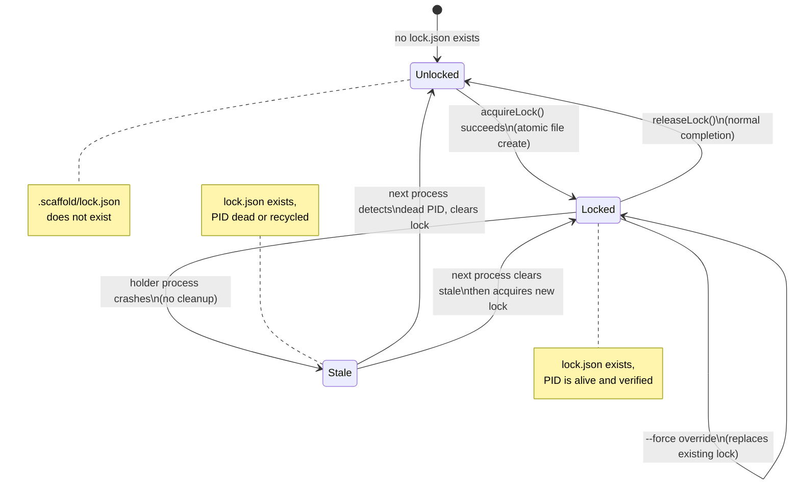

# Domain Model: Pipeline Execution Locking

**Domain ID**: 13
**Phase**: 1 — Deep Domain Modeling
**Depends on**: [03-pipeline-state-machine.md](03-pipeline-state-machine.md) (lock interacts with in_progress field), [09-cli-architecture.md](09-cli-architecture.md) (CLI acquires/releases locks)
**Last updated**: 2026-03-13
**Status**: draft

---

## 1. Domain Overview

Pipeline Execution Locking is the advisory lock mechanism that prevents concurrent prompt execution within the same project on the same machine. When a user runs `scaffold resume`, the CLI writes a small JSON file (`.scaffold/lock.json`) containing the holder identity, the prompt being executed, the process ID, and a timestamp. Any subsequent attempt to run a mutating scaffold command checks for this file and — if the PID is still alive — refuses to proceed unless `--force` is supplied.

The lock is **local-only** (gitignored) and **advisory** (can be overridden). It does not prevent concurrent execution across machines; cross-machine coordination relies on git's merge behavior on `state.json` and `decisions.jsonl`, which are designed to be merge-safe (see [domain 03](03-pipeline-state-machine.md) and [domain 11](11-decision-log.md)).

### Role in the v2 architecture

The lock sits at the outermost edge of the CLI execution lifecycle. It is the first thing acquired after project context is loaded and the last thing released after a prompt completes (or on crash, left for the next process to clean up). It does not participate in the build pipeline (config → prompt resolution → mixin injection → platform adaptation) but guards the runtime execution that the build pipeline feeds into.

### What this domain covers

- The `lock.json` schema and all its fields
- Lock acquisition algorithm (including atomic file creation and race condition handling)
- PID liveness checking (platform-specific mechanisms, containerized environments)
- Stale lock detection and automatic cleanup
- PID recycling detection and mitigation
- `--force` override semantics and interaction with `--auto`
- Lock scope (which commands require it, which don't)
- Lock release (normal, crash, explicit)
- Relationship between `lock.json` and `in_progress` in `state.json`

### What this domain does NOT cover

- **Pipeline state tracking** — the `state.json` file that records prompt completion status, the `in_progress` field's lifecycle, and crash recovery logic belong to [domain 03](03-pipeline-state-machine.md)
- **Git merge behavior** of state files — conflict resolution for `state.json` and `decisions.jsonl` across machines belongs to domains [03](03-pipeline-state-machine.md) and [11](11-decision-log.md)
- **Distributed locking** — this domain models only local, single-machine locking; there is no cross-machine lock coordinator

---

## 2. Glossary

**advisory lock** — A lock that warns and blocks by convention but can be overridden with `--force`. Unlike mandatory locks (enforced by the OS kernel), advisory locks rely on all participants voluntarily checking the lock before proceeding.

**lock file** — The `.scaffold/lock.json` file written to the project's `.scaffold/` directory when a mutating command begins execution. Its presence indicates that a process claims exclusive access.

**holder** — A human-readable identifier for the machine that created the lock, derived from `os.hostname()`. Used in error messages so team members can identify who holds the lock.

**PID** — Process Identifier. The OS-assigned integer that uniquely identifies a running process. Used for stale detection: if the PID in the lock file is no longer alive, the lock is stale.

**stale lock** — A lock file left behind by a process that exited without cleaning up (crash, `kill -9`, power loss). Detected by checking whether the recorded PID is still alive.

**PID recycling** — The scenario where an OS reassigns a previously used PID to a new, unrelated process. This can cause a stale lock to appear active because the PID check returns "alive" even though the original locking process is gone.

**process start time** — The timestamp at which a process was created by the OS. Stored in the lock file and compared against the actual start time of the running PID to detect recycling.

**force override** — Using `--force` to acquire a lock even when another process appears to hold it. Appropriate for stuck locks or legitimate concurrent use; risky if the other process is genuinely running.

**lockable command** — A CLI command that mutates scaffold state and therefore requires the lock before execution (e.g., `resume`, `init`, `reset`).

**read-only command** — A CLI command that only reads scaffold state and does not require the lock (e.g., `status`, `validate`, `build`).

**atomic file creation** — Writing a file with an exclusive-create flag (`wx` in Node.js) so that the operation fails if the file already exists, preventing two processes from both creating the lock simultaneously.

**lock scope** — The granularity of the lock: per-project (one lock per `.scaffold/` directory). The lock does not distinguish between prompts — any lockable command contends with any other.

---

## 3. Entity Model

### Lock File Schema

```typescript
/**
 * The on-disk representation of the advisory lock.
 * Written to `.scaffold/lock.json`.
 * All fields are required — a lock file missing any field is invalid.
 */
interface LockFile {
  /** Human-readable machine identifier, from os.hostname() */
  holder: string;

  /**
   * Slug of the prompt currently being executed (e.g., "dev-env-setup").
   * For non-prompt commands (init, reset), holds the command name instead.
   */
  prompt: string;

  /** ISO 8601 timestamp when the lock was acquired */
  started: string;

  /** OS process ID of the lock holder */
  pid: number;

  /**
   * ISO 8601 timestamp of the locking process's creation time.
   * Used to detect PID recycling: if the current process at `pid`
   * has a different start time, the PID was recycled.
   */
  processStartedAt: string;

  /**
   * The CLI command that acquired the lock (e.g., "resume", "init", "reset").
   * Helps users understand what operation is in progress.
   */
  command: string;
}
```

### Runtime Lock Types

```typescript
/**
 * Lock information loaded into ProjectContext at startup.
 * See domain 09 for ProjectContext definition.
 */
interface LockInfo {
  /** Parsed lock file contents */
  file: LockFile;

  /** Absolute path to the lock file */
  filePath: string;

  /** Assessed status based on PID liveness check */
  status: LockStatus;
}

/**
 * The assessed status of an existing lock.
 *
 * - 'active': PID is alive and process start time matches — genuine lock
 * - 'stale_dead_pid': PID is not running — process exited without cleanup
 * - 'stale_recycled_pid': PID is alive but process start time doesn't match —
 *   a different process now occupies that PID
 * - 'stale_unverifiable': PID is alive but process start time could not be
 *   determined (e.g., permission denied, containerized environment) —
 *   treated as potentially stale with a warning
 */
type LockStatus =
  | 'active'
  | 'stale_dead_pid'
  | 'stale_recycled_pid'
  | 'stale_unverifiable';
```

### PID Check

```typescript
/**
 * Result of checking whether a PID is alive and matches the lock's
 * recorded process identity.
 */
interface PidCheckResult {
  /** Whether the OS reports the PID as alive */
  alive: boolean;

  /**
   * Whether the running process matches the lock's recorded identity.
   * True only if alive AND processStartedAt matches.
   * Null if alive but start time could not be determined.
   */
  isOriginalProcess: boolean | null;

  /**
   * The command line of the running process, if retrievable.
   * Used as a secondary heuristic: if the process is not a Node.js/scaffold
   * process, it's almost certainly a recycled PID.
   */
  processCommand: string | null;

  /**
   * The actual start time of the running PID, if retrievable.
   * Compared against LockFile.processStartedAt.
   */
  processStartedAt: string | null;
}
```

### Acquisition and Release Results

```typescript
/**
 * Result of attempting to acquire the lock.
 */
interface LockAcquisitionResult {
  /** Whether the lock was successfully acquired */
  acquired: boolean;

  /** The previous lock file contents, if one existed */
  previousLock: LockFile | null;

  /** Whether a stale lock was cleared to make way for this acquisition */
  staleLockCleared: boolean;

  /** Whether --force was used to override an active lock */
  forceOverride: boolean;

  /** Non-fatal issues encountered during acquisition */
  warnings: LockWarning[];

  /** Fatal issues that prevented acquisition */
  errors: LockError[];
}

/**
 * Result of releasing the lock.
 */
interface LockReleaseResult {
  /** Whether the lock file was successfully deleted */
  released: boolean;

  /** Non-fatal issues encountered during release */
  warnings: LockWarning[];

  /** Fatal issues that prevented release */
  errors: LockError[];
}
```

### Command Classification

```typescript
/**
 * Commands that mutate scaffold state and require the lock.
 * Only these commands call acquireLock() / releaseLock().
 */
type LockableCommand = 'resume' | 'init' | 'reset';

/**
 * Commands that only read state and never acquire the lock.
 * These can run freely while another process holds the lock.
 */
type ReadOnlyCommand = 'status' | 'validate' | 'build';
```

### Error and Warning Types

```typescript
/**
 * Error codes for lock operations.
 * All lock errors use exit code 5.
 */
type LockErrorCode =
  | 'LOCK_HELD'              // Another process actively holds the lock
  | 'LOCK_WRITE_FAILED'      // Could not write lock.json (permissions, disk full)
  | 'LOCK_RELEASE_FAILED'    // Could not delete lock.json on release
  | 'LOCK_ACQUISITION_RACE'; // Lost atomic create race (another process won)

/**
 * Warning codes for lock operations.
 * Warnings are informational — the operation still proceeds.
 */
type LockWarningCode =
  | 'LOCK_STALE_CLEARED'    // Cleared a stale lock (dead PID)
  | 'LOCK_FORCE_OVERRIDE'   // Overrode an active lock with --force
  | 'LOCK_PID_RECYCLED'     // Detected PID recycling (stale, auto-cleared)
  | 'LOCK_PID_UNVERIFIABLE' // Could not verify process identity (proceed with caution)
  | 'LOCK_RELEASE_ORPHAN';  // Lock file didn't exist when trying to release

/**
 * A fatal lock error that prevents the operation from proceeding.
 */
interface LockError {
  code: LockErrorCode;
  message: string;
  recovery: string;
  /** The existing lock that caused the conflict, if applicable */
  existingLock?: LockFile;
}

/**
 * A non-fatal lock warning. The operation continues.
 */
interface LockWarning {
  code: LockWarningCode;
  message: string;
  /** The lock involved, if applicable */
  lock?: LockFile;
}
```

### Entity Relationships

```
LockFile (on disk: .scaffold/lock.json)
  ├── loaded into → LockInfo (runtime, in ProjectContext)
  ├── assessed via → PidCheckResult (PID liveness + identity)
  ├── acquired by → LockableCommand (resume, init, reset)
  └── ignored by → ReadOnlyCommand (status, validate, build)

LockAcquisitionResult
  ├── references → LockFile (previousLock, if contention)
  ├── contains → LockWarning[] (stale cleared, force override)
  └── contains → LockError[] (held, write failed, race lost)

LockReleaseResult
  ├── contains → LockWarning[] (orphan lock)
  └── contains → LockError[] (release failed)

ProjectContext (domain 09)
  └── contains → LockInfo | null (loaded at startup)

PipelineState.in_progress (domain 03)
  └── overlaps with → LockFile (both indicate "something is running")
```

---

## 4. State Transitions

### Lock Lifecycle



### State Descriptions

| State | lock.json exists | PID alive | Process matches | Meaning |
|-------|-----------------|-----------|-----------------|---------|
| Unlocked | No | N/A | N/A | No process claims the pipeline |
| Locked (active) | Yes | Yes | Yes | A scaffold process is running |
| Stale (dead PID) | Yes | No | N/A | Holder crashed without cleanup |
| Stale (recycled PID) | Yes | Yes | No | PID reused by unrelated process |
| Stale (unverifiable) | Yes | Yes | Unknown | Cannot confirm process identity |

### Transition Triggers

| # | From | To | Trigger | Side Effects |
|---|------|----|---------|-------------|
| 1 | Unlocked | Locked | `acquireLock()` called by lockable command | Writes lock.json atomically |
| 2 | Locked | Unlocked | `releaseLock()` called after prompt completion | Deletes lock.json |
| 3 | Locked | Stale | Holder process exits abnormally (crash, kill, power loss) | lock.json remains on disk |
| 4 | Stale | Unlocked | Next process detects stale lock and clears it (without acquiring) | Deletes lock.json |
| 5 | Stale | Locked | Next process detects stale lock, clears it, acquires new lock | Deletes old lock.json, writes new one |
| 6 | Locked | Locked | `--force` flag overrides active lock | Deletes old lock.json, writes new one; warns |

---

## 5. Core Algorithms

### Algorithm 1: Lock Acquisition

```
FUNCTION acquireLock(
  projectRoot: string,
  command: LockableCommand,
  prompt: string,
  force: boolean
) → LockAcquisitionResult:

  lockPath ← projectRoot + '/.scaffold/lock.json'
  warnings ← []
  errors ← []
  previousLock ← null
  staleLockCleared ← false
  forceOverride ← false

  // Step 1: Check for existing lock
  IF FILE_EXISTS(lockPath)
    TRY
      existingLock ← JSON.parse(READ_FILE(lockPath))
      previousLock ← existingLock
    CATCH parseError
      // Corrupt lock file — treat as stale, remove it
      DELETE_FILE(lockPath)
      warnings.push({
        code: 'LOCK_STALE_CLEARED',
        message: 'Removed corrupt lock file'
      })
      staleLockCleared ← true
      existingLock ← null
    END TRY

    // Step 2: Check PID liveness (skip if corrupt lock was already cleared)
    IF existingLock === null
      // Corrupt lock already cleared in Step 1 — skip to acquisition
    ELSE

    pidResult ← checkPid(existingLock.pid, existingLock.processStartedAt)

    IF pidResult.alive AND pidResult.isOriginalProcess === true
      // Lock is genuinely active
      IF force
        // --force override: delete existing lock, proceed
        DELETE_FILE(lockPath)
        forceOverride ← true
        warnings.push({
          code: 'LOCK_FORCE_OVERRIDE',
          message: 'Overrode active lock held by ' + existingLock.holder
            + ' (PID ' + existingLock.pid + ', running ' + existingLock.prompt + ')',
          lock: existingLock
        })
      ELSE
        // Lock is active and --force not supplied — refuse
        errors.push({
          code: 'LOCK_HELD',
          message: 'Pipeline is in use by ' + existingLock.holder
            + ' (running ' + existingLock.prompt + ', PID ' + existingLock.pid
            + '). Use --force to override.',
          recovery: 'Wait for the other process to finish, or use --force to override.',
          existingLock: existingLock
        })
        RETURN { acquired: false, previousLock, staleLockCleared, forceOverride, warnings, errors }
      END IF

    ELSE IF pidResult.alive AND pidResult.isOriginalProcess === null
      // PID alive but cannot verify identity (containerized env, permissions)
      IF force
        DELETE_FILE(lockPath)
        forceOverride ← true
        warnings.push({
          code: 'LOCK_FORCE_OVERRIDE',
          message: 'Overrode unverifiable lock (PID ' + existingLock.pid + ' alive but identity unknown)',
          lock: existingLock
        })
      ELSE
        // Warn but treat as potentially stale — still block
        warnings.push({
          code: 'LOCK_PID_UNVERIFIABLE',
          message: 'Lock held by PID ' + existingLock.pid + ' — process is alive but identity '
            + 'could not be verified. Use --force if this is a stale lock.',
          lock: existingLock
        })
        errors.push({
          code: 'LOCK_HELD',
          message: 'Pipeline may be in use by ' + existingLock.holder
            + ' (PID ' + existingLock.pid + ' alive but unverifiable). Use --force to override.',
          recovery: 'Use --force to override if you are certain no other scaffold process is running.',
          existingLock: existingLock
        })
        RETURN { acquired: false, previousLock, staleLockCleared, forceOverride, warnings, errors }
      END IF

    ELSE IF pidResult.alive AND pidResult.isOriginalProcess === false
      // PID recycled — the PID belongs to a different process
      DELETE_FILE(lockPath)
      staleLockCleared ← true
      warnings.push({
        code: 'LOCK_PID_RECYCLED',
        message: 'Cleared stale lock: PID ' + existingLock.pid + ' is alive but belongs to '
          + 'a different process (started at ' + pidResult.processStartedAt
          + ', lock recorded ' + existingLock.processStartedAt + ')',
        lock: existingLock
      })

    ELSE
      // PID is dead — stale lock
      DELETE_FILE(lockPath)
      staleLockCleared ← true
      warnings.push({
        code: 'LOCK_STALE_CLEARED',
        message: 'Cleared stale lock from ' + existingLock.holder
          + ' (PID ' + existingLock.pid + ' is no longer running)',
        lock: existingLock
      })
    END IF

    END IF  // existingLock null check
  END IF

  // Step 3: Acquire new lock via atomic file creation
  newLock ← {
    holder: os.hostname(),
    prompt: prompt,
    started: NOW_ISO(),
    pid: process.pid,
    processStartedAt: getProcessStartTime(process.pid),
    command: command
  }

  TRY
    WRITE_FILE_EXCLUSIVE(lockPath, JSON.stringify(newLock, null, 2) + '\n')
  CATCH existsError
    // Another process won the race — atomic create failed
    IF existsError.code === 'EEXIST'
      errors.push({
        code: 'LOCK_ACQUISITION_RACE',
        message: 'Another process acquired the lock simultaneously. Retry.',
        recovery: 'Wait a moment and try again.'
      })
      RETURN { acquired: false, previousLock, staleLockCleared, forceOverride, warnings, errors }
    ELSE
      errors.push({
        code: 'LOCK_WRITE_FAILED',
        message: 'Could not write lock file: ' + existsError.message,
        recovery: 'Check file system permissions on .scaffold/ directory.'
      })
      RETURN { acquired: false, previousLock, staleLockCleared, forceOverride, warnings, errors }
    END IF
  END TRY

  // Step 4: Verify we hold the lock (read-back check)
  TRY
    readBack ← JSON.parse(READ_FILE(lockPath))
    IF readBack.pid !== process.pid
      // Extremely unlikely: another process overwrote between our write and read
      errors.push({
        code: 'LOCK_ACQUISITION_RACE',
        message: 'Lock file was overwritten by another process immediately after creation.',
        recovery: 'Wait a moment and try again.'
      })
      RETURN { acquired: false, previousLock, staleLockCleared, forceOverride, warnings, errors }
    END IF
  CATCH readError
    // If we can't read back, assume success (write succeeded)
  END TRY

  RETURN { acquired: true, previousLock, staleLockCleared, forceOverride, warnings, errors }
END FUNCTION
```

### Algorithm 2: PID Liveness Check

```
FUNCTION checkPid(pid: number, recordedStartTime: string) → PidCheckResult:

  // Step 1: Check if PID is alive
  alive ← false
  TRY
    process.kill(pid, 0)  // Signal 0: no signal sent, just checks existence
    alive ← true
  CATCH error
    IF error.code === 'ESRCH'
      // No such process
      RETURN { alive: false, isOriginalProcess: false, processCommand: null, processStartedAt: null }
    ELSE IF error.code === 'EPERM'
      // Process exists but we don't have permission to signal it.
      // This means the PID belongs to a different user — almost certainly
      // not our scaffold process (scaffold runs as the current user).
      RETURN { alive: true, isOriginalProcess: false, processCommand: null, processStartedAt: null }
    END IF
  END TRY

  // Step 2: Get process start time for recycling detection
  actualStartTime ← null
  processCommand ← null

  IF PLATFORM === 'darwin'
    TRY
      // macOS: ps returns process start time
      output ← EXEC('ps -o lstart= -p ' + pid)
      actualStartTime ← PARSE_DATE_TO_ISO(output.trim())
      cmdOutput ← EXEC('ps -o command= -p ' + pid)
      processCommand ← cmdOutput.trim()
    CATCH
      // ps failed — cannot determine start time
    END TRY
  ELSE IF PLATFORM === 'linux'
    TRY
      // Linux: read /proc/pid/stat for start time (field 22)
      stat ← READ_FILE('/proc/' + pid + '/stat')
      startTicks ← PARSE_FIELD_22(stat)
      bootTime ← READ_FILE('/proc/stat')  // btime line
      actualStartTime ← TICKS_TO_ISO(startTicks, bootTime)
      cmdline ← READ_FILE('/proc/' + pid + '/cmdline')
      processCommand ← cmdline.replace(/\0/g, ' ').trim()
    CATCH
      // /proc not available or permission denied
    END TRY
  ELSE IF PLATFORM === 'win32'
    TRY
      // Windows: WMIC or PowerShell
      output ← EXEC('wmic process where processid=' + pid + ' get creationdate /format:value')
      actualStartTime ← PARSE_WMIC_DATE(output)
    CATCH
      // WMIC failed
    END TRY
  END IF

  // Step 3: Compare start times
  IF actualStartTime === null
    // Cannot verify — return unknown
    RETURN { alive: true, isOriginalProcess: null, processCommand, processStartedAt: actualStartTime }
  END IF

  // Allow 2-second tolerance for clock skew between lock write and ps output
  isOriginal ← ABS(DATE_DIFF_SECONDS(actualStartTime, recordedStartTime)) < 2

  RETURN { alive: true, isOriginalProcess: isOriginal, processCommand, processStartedAt: actualStartTime }
END FUNCTION
```

### Algorithm 3: Get Process Start Time

```
FUNCTION getProcessStartTime(pid: number) → string:
  // Returns the ISO 8601 start time of the given PID.
  // Called when creating a lock to record the current process's birth time.

  IF PLATFORM === 'darwin'
    TRY
      output ← EXEC('ps -o lstart= -p ' + pid)
      RETURN PARSE_DATE_TO_ISO(output.trim())
    CATCH
      RETURN NOW_ISO()  // Fallback: use current time (less precise but functional)
    END TRY
  ELSE IF PLATFORM === 'linux'
    TRY
      stat ← READ_FILE('/proc/' + pid + '/stat')
      startTicks ← PARSE_FIELD_22(stat)
      bootTime ← READ_FILE('/proc/stat')
      RETURN TICKS_TO_ISO(startTicks, bootTime)
    CATCH
      RETURN NOW_ISO()
    END TRY
  ELSE IF PLATFORM === 'win32'
    TRY
      output ← EXEC('wmic process where processid=' + pid + ' get creationdate /format:value')
      RETURN PARSE_WMIC_DATE(output)
    CATCH
      RETURN NOW_ISO()
    END TRY
  ELSE
    RETURN NOW_ISO()
  END IF
END FUNCTION
```

### Algorithm 4: Lock Release

```
FUNCTION releaseLock(projectRoot: string) → LockReleaseResult:

  lockPath ← projectRoot + '/.scaffold/lock.json'
  warnings ← []
  errors ← []

  IF NOT FILE_EXISTS(lockPath)
    // Lock already gone — not an error, but worth noting
    warnings.push({
      code: 'LOCK_RELEASE_ORPHAN',
      message: 'Lock file did not exist at release time (may have been cleared by another process)'
    })
    RETURN { released: true, warnings, errors }
  END IF

  // Verify we own the lock before deleting
  TRY
    existingLock ← JSON.parse(READ_FILE(lockPath))
    IF existingLock.pid !== process.pid
      // Lock belongs to a different process — do not delete it
      // This can happen if --force was used by another process
      warnings.push({
        code: 'LOCK_RELEASE_ORPHAN',
        message: 'Lock file belongs to PID ' + existingLock.pid + ', not this process ('
          + process.pid + '). Skipping release.'
      })
      RETURN { released: false, warnings, errors }
    END IF
  CATCH parseError
    // Corrupt lock — safe to delete
  END TRY

  TRY
    DELETE_FILE(lockPath)
  CATCH deleteError
    errors.push({
      code: 'LOCK_RELEASE_FAILED',
      message: 'Could not delete lock file: ' + deleteError.message,
      recovery: 'Manually delete .scaffold/lock.json'
    })
    RETURN { released: false, warnings, errors }
  END TRY

  RETURN { released: true, warnings, errors }
END FUNCTION
```

### Algorithm 5: Lock Status Assessment

```
FUNCTION assessLockStatus(lockPath: string) → LockInfo | null:
  // Called during ProjectContext loading (domain 09, Algorithm loadProjectContext).
  // Returns null if no lock file exists.

  IF NOT FILE_EXISTS(lockPath)
    RETURN null
  END IF

  TRY
    file ← JSON.parse(READ_FILE(lockPath))
  CATCH
    // Corrupt lock file — report as stale
    RETURN {
      file: { holder: 'unknown', prompt: 'unknown', started: '', pid: -1, processStartedAt: '', command: 'unknown' },
      filePath: lockPath,
      status: 'stale_dead_pid'
    }
  END TRY

  pidResult ← checkPid(file.pid, file.processStartedAt)

  IF NOT pidResult.alive
    status ← 'stale_dead_pid'
  ELSE IF pidResult.isOriginalProcess === true
    status ← 'active'
  ELSE IF pidResult.isOriginalProcess === false
    status ← 'stale_recycled_pid'
  ELSE
    status ← 'stale_unverifiable'
  END IF

  RETURN { file, filePath: lockPath, status }
END FUNCTION
```

---

## 6. Error Taxonomy

### Lock Errors (exit code 5)

#### `LOCK_HELD`
- **Severity**: error
- **Fires when**: A lockable command is invoked while another process actively holds the lock and `--force` is not supplied
- **Message**: `Pipeline is in use by {holder} (running {prompt}, PID {pid}). Use --force to override.`
- **Recovery**: Wait for the other process to finish, or use `--force` to override
- **JSON**:
  ```json
  {
    "code": "LOCK_HELD",
    "message": "Pipeline is in use by ken-macbook (running dev-env-setup, PID 12345). Use --force to override.",
    "recovery": "Wait for the other process to finish, or use --force to override.",
    "existingLock": {
      "holder": "ken-macbook",
      "prompt": "dev-env-setup",
      "started": "2026-03-13T11:00:00Z",
      "pid": 12345,
      "processStartedAt": "2026-03-13T10:58:32Z",
      "command": "resume"
    }
  }
  ```

#### `LOCK_WRITE_FAILED`
- **Severity**: error
- **Fires when**: The lock file cannot be written due to file system issues (permissions, disk full, read-only mount)
- **Message**: `Could not write lock file: {systemError}`
- **Recovery**: Check file system permissions on `.scaffold/` directory
- **JSON**:
  ```json
  {
    "code": "LOCK_WRITE_FAILED",
    "message": "Could not write lock file: EACCES: permission denied, open '.scaffold/lock.json'",
    "recovery": "Check file system permissions on .scaffold/ directory."
  }
  ```

#### `LOCK_RELEASE_FAILED`
- **Severity**: error
- **Fires when**: The lock file cannot be deleted during release (permissions changed, directory removed)
- **Message**: `Could not delete lock file: {systemError}`
- **Recovery**: Manually delete `.scaffold/lock.json`
- **JSON**:
  ```json
  {
    "code": "LOCK_RELEASE_FAILED",
    "message": "Could not delete lock file: EACCES: permission denied, unlink '.scaffold/lock.json'",
    "recovery": "Manually delete .scaffold/lock.json."
  }
  ```

#### `LOCK_ACQUISITION_RACE`
- **Severity**: error
- **Fires when**: Two processes attempt to create the lock file simultaneously and this process lost the race (atomic `wx` create returned `EEXIST`)
- **Message**: `Another process acquired the lock simultaneously. Retry.`
- **Recovery**: Wait a moment and try again
- **JSON**:
  ```json
  {
    "code": "LOCK_ACQUISITION_RACE",
    "message": "Another process acquired the lock simultaneously. Retry.",
    "recovery": "Wait a moment and try again."
  }
  ```

### Lock Warnings

#### `LOCK_STALE_CLEARED`
- **Severity**: warning
- **Fires when**: A stale lock (dead PID) is detected and automatically cleared before acquiring a new lock
- **Message**: `Cleared stale lock from {holder} (PID {pid} is no longer running)`

#### `LOCK_FORCE_OVERRIDE`
- **Severity**: warning
- **Fires when**: `--force` is used to override an active or unverifiable lock
- **Message**: `Overrode active lock held by {holder} (PID {pid}, running {prompt})`

#### `LOCK_PID_RECYCLED`
- **Severity**: warning
- **Fires when**: The PID in the lock file is alive but belongs to a different process (start time mismatch)
- **Message**: `Cleared stale lock: PID {pid} is alive but belongs to a different process (started at {actual}, lock recorded {recorded})`

#### `LOCK_PID_UNVERIFIABLE`
- **Severity**: warning
- **Fires when**: The PID in the lock file is alive but the process's identity cannot be verified (permissions, container namespace)
- **Message**: `Lock held by PID {pid} — process is alive but identity could not be verified. Use --force if this is a stale lock.`

#### `LOCK_RELEASE_ORPHAN`
- **Severity**: warning
- **Fires when**: The lock file does not exist at release time, or belongs to a different PID
- **Message**: `Lock file did not exist at release time (may have been cleared by another process)`

---

## 7. Integration Points

### Domain 03 — Pipeline State Machine

| Direction | Data | Purpose |
|-----------|------|---------|
| Domain 13 → Domain 03 | Lock acquired (side effect) | Lock is acquired before `in_progress` is set in state.json |
| Domain 03 → Domain 13 | Crash recovery context | When `in_progress` is non-null and lock is stale, both indicate a crashed session |
| Domain 13 → Domain 03 | Lock released (side effect) | Lock is released after `in_progress` is cleared and status is updated |

**Contract**: The lock is the outermost wrapper around state mutations. The execution timeline is:

1. Acquire lock (domain 13)
2. Set `in_progress` in state.json (domain 03)
3. Execute prompt
4. Clear `in_progress`, update status (domain 03)
5. Release lock (domain 13)

The lock and `in_progress` serve different purposes: the lock prevents concurrent local execution (runtime safety), while `in_progress` tracks interrupted sessions for crash recovery (persistent state). They can be inconsistent — see [MQ7](#mq7-lockjson-vs-in_progress-relationship) for the full consistency matrix.

### Domain 09 — CLI Command Architecture

| Direction | Data | Purpose |
|-----------|------|---------|
| Domain 09 → Domain 13 | `acquireLock()` call | CLI commands invoke lock acquisition before mutating state |
| Domain 13 → Domain 09 | `LockAcquisitionResult` | CLI handles lock errors (display to user, exit with code 5) |
| Domain 13 → Domain 09 | `LockInfo` in `ProjectContext` | Lock status loaded at startup for all commands (informational) |
| Domain 09 → Domain 13 | `releaseLock()` call | CLI releases lock after command completion |

**Contract**: The CLI is responsible for calling `acquireLock()` and `releaseLock()` at the appropriate lifecycle points. Lock acquisition failures produce `LOCK_HELD` errors that the CLI formats and presents to the user. The `ProjectContext.lock` field is populated by `assessLockStatus()` for informational display (e.g., `scaffold status` can show "pipeline locked by ken-macbook").

**Cross-domain update required**: Domain 09's `loadProjectContext` algorithm (line ~1400) currently does a raw `JSON.parse` of lock.json. It must be updated to call `assessLockStatus()` instead, so that `ProjectContext.lock` is a `LockInfo` (with assessed `status` field) rather than a raw `LockFile`. Additionally, domain 09's `ScaffoldErrorCode` union (line ~502) currently only includes `LOCK_HELD`. It should be extended to include all lock error codes: `LOCK_WRITE_FAILED`, `LOCK_RELEASE_FAILED`, and `LOCK_ACQUISITION_RACE`. All lock errors map to exit code 5.

### Domain 11 — Decision Log

| Direction | Data | Purpose |
|-----------|------|---------|
| Domain 13 → Domain 11 | Lock guarantees single writer | While the lock is held, only one process writes to `decisions.jsonl` locally |

**Contract**: The lock ensures that on a single machine, only one process appends to `decisions.jsonl` at a time. This prevents interleaved writes that could corrupt a JSONL line. Cross-machine concurrent appends are safe because JSONL is append-only and each write is a complete line.

### `.gitignore`

| Direction | Data | Purpose |
|-----------|------|---------|
| `.gitignore` → Domain 13 | `lock.json` excluded from git | Lock is purely local; never committed |

**Contract**: The `.scaffold/lock.json` entry in `.gitignore` is critical. If the lock file were committed, it would create false contention on other machines and merge conflicts. The `scaffold init` command must ensure `.scaffold/lock.json` is in `.gitignore` when creating the project.

---

## 8. Edge Cases & Failure Modes

### MQ1: Lock.json Schema

The complete lock file schema is defined in [Section 3](#lock-file-schema). It extends the spec's four fields (`holder`, `prompt`, `started`, `pid`) with two additional fields:

- **`processStartedAt`**: ISO 8601 timestamp of the locking process's creation time. Essential for PID recycling detection (see [MQ5](#mq5-pid-recycling-scenario)).
- **`command`**: The CLI command that acquired the lock (e.g., `"resume"`). Provides context in error messages so users understand what operation is blocked.

A machine identifier beyond `holder` (hostname) is not needed because the lock is gitignored and never shared across machines. The hostname is sufficient for error messages when a user has multiple terminal windows open.

Example lock file:
```json
{
  "holder": "ken-macbook",
  "prompt": "dev-env-setup",
  "started": "2026-03-13T11:00:00Z",
  "pid": 12345,
  "processStartedAt": "2026-03-13T10:58:32Z",
  "command": "resume"
}
```

### MQ2: Lock Acquisition Algorithm

The full algorithm is defined in [Algorithm 1](#algorithm-1-lock-acquisition). Key design decisions:

1. **Atomic file creation**: Uses `fs.writeFile` with `{ flag: 'wx' }` (exclusive create). This is the standard POSIX `O_CREAT | O_EXCL` pattern — the OS guarantees that exactly one process succeeds when two attempt to create the same file simultaneously. The loser gets `EEXIST`.

2. **Read-back verification**: After successfully creating the file, the algorithm reads it back to confirm our PID is in it. This guards against the astronomically unlikely scenario where another process deletes and recreates the file between our write and read.

3. **Race condition handling**: If two processes both detect "no lock" and both attempt atomic create, exactly one wins (the OS guarantees this). The loser receives `LOCK_ACQUISITION_RACE` and should retry. If two processes both detect a stale lock, both delete it, and both attempt atomic create — again, exactly one wins.

4. **No retry loop**: The acquisition algorithm does not automatically retry. The caller (CLI) receives the error and can retry at its discretion. Automatic retries with backoff would add complexity for a scenario that's already unlikely.

### MQ3: PID Liveness Checking

PID liveness is checked via `process.kill(pid, 0)` in Node.js, which sends signal 0 (a null signal that checks process existence without actually signaling). See [Algorithm 2](#algorithm-2-pid-liveness-check) for the full implementation.

**Platform-specific behaviors:**

| Platform | Alive check | Start time source | Command line source |
|----------|------------|-------------------|-------------------|
| macOS | `process.kill(pid, 0)` | `ps -o lstart= -p PID` | `ps -o command= -p PID` |
| Linux | `process.kill(pid, 0)` | `/proc/PID/stat` field 22 | `/proc/PID/cmdline` |
| Windows | `process.kill(pid, 0)` | `wmic process ... creationdate` | N/A |

**Different users**: If the PID belongs to a different user, `process.kill(pid, 0)` throws `EPERM` ("operation not permitted"). The algorithm treats this as "alive but definitely not our process" — since scaffold runs as the current user, a PID owned by a different user cannot be a scaffold lock holder. The lock is cleared as stale.

**Containerized environments**: If the lock file was written inside a container and the checking process runs outside (or in a different container with a different PID namespace), the PID will either not exist (`ESRCH`) or refer to a different process. The `processStartedAt` comparison catches the latter case. If PID namespaces are completely isolated (e.g., Docker with `--pid=host` not set), the PID will simply not be found and the lock is treated as stale — which is the correct behavior.

**CI environments**: In CI, each job typically runs in a fresh container or VM. Any lock file from a previous run refers to a PID from a dead environment. The stale detection handles this correctly.

### MQ4: Stale Lock Scenario

**Scenario**: Process A acquires the lock, then crashes (e.g., `kill -9`, OOM kill, power loss). Process B starts and runs `scaffold resume`.

Step-by-step walkthrough:

1. **Process A** runs `scaffold resume`:
   - Checks for `.scaffold/lock.json` — does not exist
   - Creates lock atomically: `{ holder: "ken-macbook", prompt: "tech-stack", started: "2026-03-13T11:00:00Z", pid: 42000, processStartedAt: "2026-03-13T10:59:55Z", command: "resume" }`
   - Sets `in_progress` in `state.json` for prompt `tech-stack`
   - Begins executing the prompt

2. **Process A crashes** (e.g., `kill -9 42000` or OOM):
   - No cleanup runs — `lock.json` remains on disk
   - `state.json` still has `in_progress` set for `tech-stack`

3. **Process B** runs `scaffold resume`:
   - Loads `ProjectContext`, which calls `assessLockStatus()`
   - Reads `.scaffold/lock.json`: PID 42000, started at 2026-03-13T11:00:00Z
   - Calls `checkPid(42000, "2026-03-13T10:59:55Z")`
   - `process.kill(42000, 0)` throws `ESRCH` — process does not exist
   - Returns `{ alive: false, ... }`
   - `assessLockStatus` returns `status: 'stale_dead_pid'`

4. **Process B** calls `acquireLock()`:
   - Detects existing lock, checks PID → dead
   - Deletes stale `lock.json`
   - Emits `LOCK_STALE_CLEARED` warning: "Cleared stale lock from ken-macbook (PID 42000 is no longer running)"
   - Creates new lock with Process B's PID
   - Returns `{ acquired: true, staleLockCleared: true }`

5. **Process B** then enters domain 03's crash recovery:
   - Detects `in_progress` is non-null in `state.json`
   - Runs `CrashRecoveryAnalysis` (domain 03) for prompt `tech-stack`
   - Checks artifacts, offers to re-run or mark complete

### MQ5: PID Recycling Scenario

**Scenario**: Process A acquires lock with PID 12345, crashes. The OS assigns PID 12345 to an unrelated process (e.g., a web browser tab). Process B checks the lock.

**The problem**: `process.kill(12345, 0)` returns success — the PID is alive. Without additional checks, Process B concludes the lock is active and refuses to proceed. The user is stuck.

**Mitigation via `processStartedAt`**:

1. **When Process A acquired the lock**, it recorded its own process start time:
   ```json
   {
     "pid": 12345,
     "processStartedAt": "2026-03-13T10:58:32Z"
   }
   ```

2. **Process A crashes**. The OS eventually reassigns PID 12345 to a Chrome renderer process that starts at `2026-03-13T14:22:17Z`.

3. **Process B checks the lock**:
   - `process.kill(12345, 0)` → success (PID is alive)
   - `ps -o lstart= -p 12345` → returns `"Thu Mar 13 14:22:17 2026"`
   - Parses to ISO: `"2026-03-13T14:22:17Z"`
   - Compares with lock's `processStartedAt`: `"2026-03-13T10:58:32Z"`
   - Difference: ~3.4 hours → far exceeds the 2-second tolerance
   - Conclusion: **PID recycled** — the lock is stale

4. **Process B clears the lock** and emits `LOCK_PID_RECYCLED` warning.

**Secondary heuristic (future enhancement)**: If the process start time cannot be retrieved (permissions, platform limitations), a future iteration could inspect the process command line (`PidCheckResult.processCommand`). If PID 12345 is running `/Applications/Chrome.app/...` instead of something containing `node` or `scaffold`, the lock is almost certainly stale. The current algorithm retrieves `processCommand` for diagnostic purposes but does not use it in decision logic — it conservatively treats unverifiable PIDs as potentially active (requiring `--force` to override). Implementing the command-line heuristic is deferred because it adds platform-specific complexity and the `processStartedAt` check covers the vast majority of cases.

**Residual risk**: If the OS recycles the PID within 2 seconds and the new process is also a Node.js process, the `processStartedAt` check would produce a false match. This is astronomically unlikely — PID recycling typically takes hours or days on modern systems with PID ranges of 32768+ (Linux) or 99998 (macOS). The 2-second tolerance exists only to account for clock precision differences between the lock write and the `ps` query.

### MQ6: --force and --auto Interaction

**Policy**: Lock override via `--force` is **not classified as a destructive action**. It does not delete data, modify files, or alter project state. It overrides a safety mechanism that prevents concurrent execution.

**Rationale**:
- The spec defines destructive actions as those requiring explicit second flags with `--auto` (e.g., `scaffold reset` deletes `state.json` and `decisions.jsonl`)
- A lock override merely allows a second process to run — the worst outcome is two processes executing simultaneously, which may cause state conflicts but not data loss
- The lock is advisory by design — it exists to warn, not to enforce

**Interaction matrix**:

| Flags | Lock active | Behavior |
|-------|------------|----------|
| (none) | Yes | Error: `LOCK_HELD`. User must decide. |
| `--force` | Yes | Override: clears existing lock, acquires new one. Warning emitted. |
| `--auto` | Yes | Error: `LOCK_HELD`. `--auto` does not imply `--force`. |
| `--auto --force` | Yes | Override: same as `--force` alone. Both flags are respected. |
| `--force` | No (stale) | Stale lock is cleared normally. `--force` has no additional effect. |
| `--force` | No (none) | No lock contention. `--force` has no effect. |

**Key rule**: `--auto` never implies `--force`. A user running in `--auto` mode (unattended, Codex, CI) should not silently override another process's lock. If a lock is held, the `--auto` process should fail with `LOCK_HELD` so the orchestrating system can handle it (retry, alert, etc.).

### MQ7: lock.json vs in_progress Relationship

`lock.json` and `in_progress` in `state.json` serve different purposes and have different lifecycles:

| Aspect | `lock.json` | `in_progress` (state.json) |
|--------|------------|---------------------------|
| Purpose | Prevent concurrent local execution | Track interrupted sessions for crash recovery |
| Scope | Local machine only (gitignored) | Committed to git (shared across machines) |
| Lifetime | Acquired before prompt starts, released after | Set when prompt execution begins, cleared when prompt completes |
| Crash behavior | Left behind (stale detection cleans up) | Left behind (crash recovery handles it) |
| Deleted by | `releaseLock()` on completion, stale detection on crash | State machine on completion/recovery |

**Consistency matrix** — all four combinations are possible:

| lock.json | in_progress | Meaning | Expected? |
|-----------|-------------|---------|-----------|
| Absent | Null | No prompt running. Idle state. | Yes (normal) |
| Present | Non-null | Prompt actively executing. Both set correctly. | Yes (normal) |
| Present | Null | Lock acquired but prompt not yet started (between steps 1 and 2 of execution) OR prompt completed but lock not yet released (between steps 4 and 5). | Yes (transient) |
| Absent | Non-null | Process crashed after setting `in_progress` but lock was already cleared (e.g., by stale detection from another process, or by `--force` override). | Yes (crash/override) |

**Important**: These two mechanisms are intentionally independent. Neither should be used to infer the other's state:
- The lock acquisition algorithm does NOT check `in_progress`
- The crash recovery algorithm (domain 03) does NOT check `lock.json`
- Each handles its own stale-state detection independently

### MQ8: Cross-Machine Concurrent Execution

**Scenario**: Two team members on different machines both run `scaffold resume` on the same project (checked out via git).

Since `lock.json` is gitignored, the lock provides no protection here. Both processes acquire their local lock successfully and proceed independently.

**Step-by-step**:

1. **Machine A** (ken-macbook): runs `scaffold resume`, completes `dev-env-setup`
   - Updates `state.json`: sets `dev-env-setup` status to `completed`
   - Appends to `decisions.jsonl`
   - Commits and pushes

2. **Machine B** (sarah-laptop): runs `scaffold resume`, completes `coding-standards` (different prompt)
   - Updates `state.json`: sets `coding-standards` status to `completed`
   - Appends to `decisions.jsonl`
   - Commits and attempts to push

3. **Git push from Machine B fails** — remote has Machine A's commit

4. **Machine B pulls/rebases**:
   - `state.json` merge: **auto-merges cleanly** because `state.json` uses a map-keyed-by-prompt structure. Machine A modified the `dev-env-setup` key; Machine B modified the `coding-standards` key. No conflict.
   - `decisions.jsonl` merge: **auto-merges cleanly** because JSONL is append-only. Machine A appended lines at the end; Machine B appended different lines at the end. Git's merge algorithm appends both (though line order between the two appends is non-deterministic). Edge case: if the file didn't end with a newline before either append, the two appended blocks may merge onto the same line — mitigated by always appending a trailing `\n`.

5. **Machine B pushes** — succeeds.

**Conflict scenario**: If both machines complete the **same** prompt, `state.json` will have a merge conflict on that prompt's status entry. This requires manual resolution but is unlikely in practice — the pipeline's dependency ordering naturally serializes prompt execution, and teams typically coordinate which prompts each member works on.

### MQ9: Lock Release Algorithm

The full algorithm is defined in [Algorithm 4](#algorithm-4-lock-release). Three release paths exist:

1. **Normal completion**: After a prompt finishes, the CLI calls `releaseLock()`, which deletes `lock.json`. This is the happy path.

2. **Crash recovery (passive)**: If the lock holder crashes, the lock file remains on disk. The next process to run a lockable command detects the stale PID and clears the lock automatically via `acquireLock()`. There is no background daemon or watchdog — cleanup is lazy, triggered by the next invocation.

3. **Explicit release**: There is **no dedicated `scaffold unlock` command**. This is intentional:
   - Stale locks are cleared automatically by the next invocation — no user action required
   - Active locks can be overridden with `--force` on any lockable command
   - A dedicated `unlock` command adds API surface for an edge case that's already handled
   - Users who want to manually clear a lock can simply `rm .scaffold/lock.json`

**Design rationale for no `scaffold unlock`**: Adding an explicit unlock command creates a risk of misuse — a user might routinely `scaffold unlock && scaffold resume` as a habit, defeating the purpose of the lock. The current design forces users to either (a) let stale detection work automatically or (b) consciously supply `--force`, which makes the override visible in their command history.

### MQ10: Lock Scope

The lock is **per-project, command-class scoped**:

- **Per-project**: One lock per `.scaffold/` directory. The lock file is always at `.scaffold/lock.json`.
- **Command-class scoped**: Only commands that mutate scaffold state require the lock. Read-only commands do not.

**Lockable commands** (mutate state):
| Command | Why it needs the lock |
|---------|----------------------|
| `resume` | Executes prompts, updates `state.json`, appends to `decisions.jsonl` |
| `init` | Creates `.scaffold/` directory and initial files |
| `reset` | Deletes `state.json`, `decisions.jsonl`, and other scaffold files |

**Read-only commands** (no lock needed):
| Command | Why it doesn't need the lock |
|---------|------------------------------|
| `status` | Only reads `state.json` and `lock.json` (displays lock info to user) |
| `validate` | Only reads and validates files — no mutations |
| `build` | Builds resolved prompts from source files — no runtime state changes |

**Practical implication**: A user can run `scaffold status` while another terminal has `scaffold resume` running. The status output will show that the pipeline is locked:

```
Pipeline: locked by ken-macbook (running dev-env-setup, PID 12345)
```

This is explicitly supported and useful — users should be able to check progress without contending with the lock.

---

## 9. Testing Considerations

### Unit Tests

| Test Case | Input | Expected Output |
|-----------|-------|-----------------|
| Acquire lock on empty project | No lock.json exists | `{ acquired: true, staleLockCleared: false }`, lock.json created |
| Acquire lock with active PID | lock.json exists, PID alive | `{ acquired: false }`, error `LOCK_HELD` |
| Acquire lock with dead PID | lock.json exists, PID dead | `{ acquired: true, staleLockCleared: true }`, warning `LOCK_STALE_CLEARED` |
| Acquire lock with `--force` | lock.json exists, PID alive, force=true | `{ acquired: true, forceOverride: true }`, warning `LOCK_FORCE_OVERRIDE` |
| Acquire lock with recycled PID | lock.json exists, PID alive, start time mismatch | `{ acquired: true, staleLockCleared: true }`, warning `LOCK_PID_RECYCLED` |
| Race condition (EEXIST) | Two processes create simultaneously | Exactly one succeeds; other gets `LOCK_ACQUISITION_RACE` |
| Release owned lock | lock.json exists with our PID | `{ released: true }`, lock.json deleted |
| Release unowned lock | lock.json exists with different PID | `{ released: false }`, warning `LOCK_RELEASE_ORPHAN` |
| Release missing lock | No lock.json exists | `{ released: true }`, warning `LOCK_RELEASE_ORPHAN` |
| Read-only command with active lock | `scaffold status` while locked | Command succeeds, displays lock info |
| Corrupt lock file | lock.json contains invalid JSON | Treated as stale, cleared with warning |
| EPERM on PID check | PID belongs to different user | Treated as stale (different user = not scaffold) |

### Integration Tests

| Test Case | Setup | Verification |
|-----------|-------|-------------|
| Full lifecycle: acquire → execute → release | Run `scaffold resume` on a simple prompt | lock.json exists during execution, absent after |
| Crash simulation | Acquire lock, kill process, run new `scaffold resume` | New process clears stale lock, acquires its own |
| Concurrent local processes | Two `scaffold resume` in parallel (same project) | One succeeds, other gets `LOCK_HELD` |
| Status during locked execution | `scaffold resume` in background, then `scaffold status` | Status shows lock info, does not block |
| Force override | First process locks, second uses `--force` | Second process acquires lock, first process may produce state conflicts |

### Test Utilities

```typescript
/**
 * Test helper: create a lock file with a specific PID for testing.
 * The PID can be set to a known-dead value (e.g., 999999) for stale tests
 * or process.pid for active lock tests.
 */
function createTestLock(projectRoot: string, overrides?: Partial<LockFile>): LockFile;

/**
 * Test helper: assert that no lock file exists.
 */
function assertNoLock(projectRoot: string): void;

/**
 * Test helper: mock process.kill to simulate PID states
 * without depending on actual OS processes.
 */
function mockPidCheck(pid: number, behavior: 'alive' | 'dead' | 'eperm'): void;
```

### Property-Based Tests

- **Lock exclusivity**: If two lock acquisitions run concurrently (no `--force`), at most one succeeds.
- **Stale detection convergence**: A lock with a dead PID is always cleared by the next acquisition attempt (no infinite loop, no missed stale locks).
- **Release idempotency**: Calling `releaseLock()` twice does not cause errors (second call gets `LOCK_RELEASE_ORPHAN` warning).
- **Read-only isolation**: Read-only commands never modify `lock.json` regardless of lock state.

---

## 10. Open Questions & Recommendations

### Open Questions

1. **Lock file format versioning**: Should `lock.json` include a `version` field for forward compatibility? If a future scaffold version adds fields to the lock schema, older versions would ignore them (JSON parsing is lenient). But if the schema changes structurally, a version field would help. **Recommendation**: Do not add a version field now. The lock is ephemeral (never committed, deleted on completion) and not shared across machines. Schema changes can be handled by treating unparseable locks as stale.

2. **Lock timeout**: Should locks have a maximum age? A lock older than, say, 24 hours is almost certainly stale regardless of PID status (the user walked away, the terminal disconnected). **Recommendation**: Add a 24-hour heuristic in a future iteration. For v2 launch, PID-based detection is sufficient. A timeout adds complexity (what if a prompt legitimately takes a long time?) and the PID check already handles the common cases.

3. **`scaffold unlock` command**: Should there be an explicit unlock command? Currently, stale locks are auto-cleared and active locks can be overridden with `--force`. **Recommendation**: Do not add `scaffold unlock` for v2. It encourages cargo-cult usage (`scaffold unlock && scaffold resume`) that defeats the lock's purpose. Users who need manual cleanup can `rm .scaffold/lock.json`. Revisit if user feedback indicates the current approach is confusing.

4. **Cross-machine lock visibility**: Should `scaffold status` show a warning when `state.json` has `in_progress` set by a different machine (indicating a remote user is actively running a prompt)? This is outside the lock domain but related to concurrent execution awareness. **Recommendation**: Yes — `scaffold status` should check `in_progress.actor` against `os.hostname()` and warn if they differ: "Prompt {prompt} may be in progress on {actor}". This belongs in domain 03's status rendering, not in the lock domain.

### Recommendations

1. **Ensure `.gitignore` includes lock.json on init**: The `scaffold init` command must add `.scaffold/lock.json` to `.gitignore`. If a user manually creates `.scaffold/` or migrates from v1, validate that the gitignore entry exists and warn if missing.

2. **Log lock events to stderr**: All lock warnings (`LOCK_STALE_CLEARED`, `LOCK_FORCE_OVERRIDE`, `LOCK_PID_RECYCLED`) should be emitted to stderr so they're visible to the user but don't interfere with JSON output mode.

3. **Graceful shutdown handler**: Register a `process.on('SIGTERM')` and `process.on('SIGINT')` handler that calls `releaseLock()` before exiting. This reduces the frequency of stale locks (though `kill -9` and OOM kills will still leave stale locks, which is why PID-based detection exists).

4. **Atomic write via temp file**: For the lock acquisition, consider writing to a temp file (`.scaffold/lock.json.tmp`) and renaming it atomically, rather than using `wx` flag directly. On some file systems, `rename` is more reliably atomic than `open(O_CREAT|O_EXCL)`. However, for v2 launch, the `wx` approach is simpler and sufficient for the advisory lock use case.

5. **Include lock info in `scaffold status --json`**: The JSON output of `scaffold status` should include the lock assessment so that CI scripts and tooling can programmatically check lock state.

6. **Lock contention metrics**: Consider logging lock contention events (how often users hit `LOCK_HELD`, how often stale locks are cleared) to understand usage patterns. This is low priority but useful for future improvements.

---

## 11. Concrete Examples

### Example 1: Normal Lock Lifecycle

A user runs `scaffold resume` to execute the `tech-stack` prompt.

**Step 1 — Acquire lock**:
```json
// .scaffold/lock.json (created)
{
  "holder": "ken-macbook",
  "prompt": "tech-stack",
  "started": "2026-03-13T14:30:00Z",
  "pid": 54321,
  "processStartedAt": "2026-03-13T14:29:45Z",
  "command": "resume"
}
```

**Step 2 — Execute prompt**: User/agent works on technology decisions. During this time, `.scaffold/lock.json` exists on disk.

**Step 3 — Release lock**: Prompt completes. CLI calls `releaseLock()`. `.scaffold/lock.json` is deleted. No warnings, no errors.

**CLI output during execution**:
```
Resuming pipeline...
Executing: tech-stack (prompt 4 of 12)
```

**CLI output after completion**:
```
✓ tech-stack completed
```

### Example 2: Stale Lock from Crash

Process A was running `scaffold resume` for `coding-standards` but was killed by OOM.

**State on disk**:
```json
// .scaffold/lock.json (stale — PID 42000 is dead)
{
  "holder": "ken-macbook",
  "prompt": "coding-standards",
  "started": "2026-03-13T10:00:00Z",
  "pid": 42000,
  "processStartedAt": "2026-03-13T09:59:50Z",
  "command": "resume"
}
```

```json
// .scaffold/state.json (in_progress still set)
{
  "prompts": {
    "coding-standards": {
      "status": "in_progress",
      "started": "2026-03-13T10:00:05Z"
    }
  },
  "in_progress": {
    "prompt": "coding-standards",
    "started": "2026-03-13T10:00:05Z",
    "partial_artifacts": [],
    "actor": "ken-macbook"
  }
}
```

**Process B runs `scaffold resume`**:
```
⚠ Cleared stale lock from ken-macbook (PID 42000 is no longer running)
⚠ Crash detected: coding-standards was in progress but did not complete.
  Artifacts found: 0 of 1 (docs/coding-standards.md missing)
  Recommendation: re-run coding-standards

Resuming pipeline...
Executing: coding-standards (prompt 5 of 12)
```

### Example 3: Lock Contention

User has two terminal windows open. Terminal 1 is running `scaffold resume`. Terminal 2 tries to run `scaffold resume`.

**Terminal 1 output** (running normally):
```
Resuming pipeline...
Executing: user-stories (prompt 6 of 12)
```

**Terminal 2 output** (blocked):
```
✗ Pipeline is in use by ken-macbook (running user-stories, PID 54321). Use --force to override.
```
Exit code: 5

**Terminal 2 with `--force`**:
```
⚠ Overrode active lock held by ken-macbook (PID 54321, running user-stories)
Resuming pipeline...
```

**Important**: Using `--force` here may cause both processes to execute prompts simultaneously, potentially corrupting `state.json`. The warning makes this risk visible.

### Example 4: PID Recycling Detection

Process A (PID 12345) acquired the lock at 10:58 and crashed. Hours later, the OS assigned PID 12345 to a Chrome process that started at 14:22.

**Lock file on disk**:
```json
{
  "holder": "ken-macbook",
  "prompt": "project-structure",
  "started": "2026-03-13T10:58:40Z",
  "pid": 12345,
  "processStartedAt": "2026-03-13T10:58:32Z",
  "command": "resume"
}
```

**Process B runs `scaffold resume`**:
```
⚠ Cleared stale lock: PID 12345 is alive but belongs to a different process
  (started at 2026-03-13T14:22:17Z, lock recorded 2026-03-13T10:58:32Z)
Resuming pipeline...
```

The algorithm detects the 3+ hour gap between the lock's `processStartedAt` and the actual process's start time, correctly identifying PID recycling.

### Example 5: Read-Only Command During Active Lock

Terminal 1 is running `scaffold resume` (lock held). Terminal 2 runs `scaffold status`.

**Terminal 2 output** (no lock contention):
```
Pipeline: locked by ken-macbook (running dev-env-setup, PID 54321)

Prompt Status:
  ✓ prd                    completed
  ✓ tech-stack             completed
  ● dev-env-setup          in progress (started 2m ago)
  ○ coding-standards       pending
  ○ user-stories           pending
```

The `status` command reads `lock.json` for display purposes but does not attempt to acquire the lock. It runs without interference.

### Example 6: `scaffold init` Lock Behavior

When `scaffold init` creates a new project, it acquires the lock to prevent concurrent initialization.

```
Initializing scaffold project...
```

**Lock file during init**:
```json
{
  "holder": "ken-macbook",
  "prompt": "init",
  "started": "2026-03-13T09:00:00Z",
  "pid": 11111,
  "processStartedAt": "2026-03-13T08:59:55Z",
  "command": "init"
}
```

After `scaffold init` completes, the lock is released. The `prompt` field is set to `"init"` since initialization is not associated with a specific pipeline prompt.
