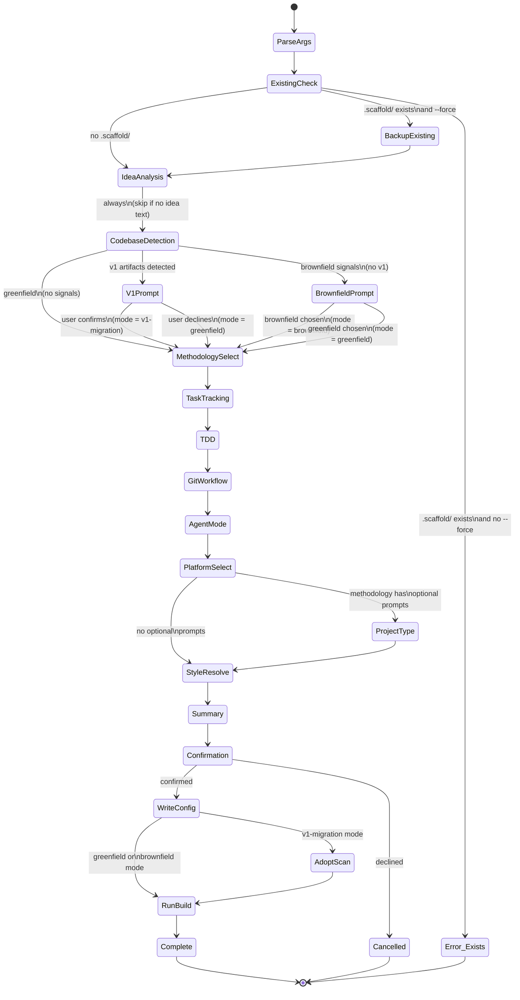
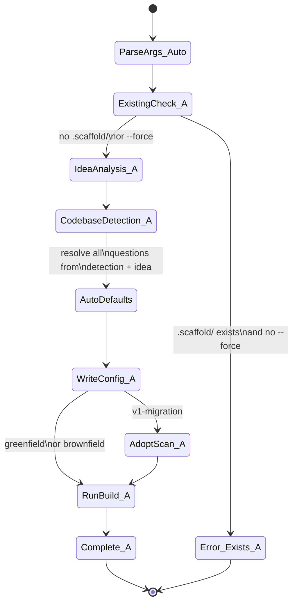

# Domain Model: Init Wizard & Methodology Selection

**Status: Transformed** — Wizard simplified to methodology selection (ADR-043).

**Domain ID**: 14
**Phase**: 1 — Deep Domain Modeling
**Depends on**: [06-config-validation.md](06-config-validation.md) (wizard output must be valid config), [07-brownfield-adopt.md](07-brownfield-adopt.md) (wizard triggers brownfield/v1 detection)
**Last updated**: 2026-03-14
**Status**: transformed

---

## 1. Domain Overview

The init wizard is the entry point for every new scaffold project. It runs as `scaffold init` (optionally with idea text: `scaffold init "I want to build a CLI tool..."`) and produces `.scaffold/config.yml` — the configuration file that drives all subsequent scaffold operations.

The wizard has been simplified under the meta-prompt architecture. Instead of collecting mixin axis values (task-tracking, tdd, git-workflow, agent-mode, interaction-style), the wizard now focuses on methodology selection:

- **Asks methodology**: Deep Domain Modeling, MVP, or Custom
- **For Custom**: Presents the step list with toggle (enabled/disabled) and depth (1-5) for each step
- **Detects existing project files**: Examines the codebase for signals (database files, API routes, frontend frameworks, `project.platforms` config) to suggest which conditional steps (database, API, UI/UX) should be enabled
- **Writes `.scaffold/config.yml`**: With the selected methodology, depth configuration, platform targets, and project metadata

### Role in the v2 architecture

The wizard sits at the boundary between user intent and the pipeline engine. It collects methodology choices through interactive questions, analyzes existing code for smart defaults on conditional steps, and produces a valid config (domain 06). It also triggers brownfield/v1 detection (domain 07).

### What this domain covers

- Methodology selection (Deep/MVP/Custom)
- Custom methodology step and depth configuration
- Conditional step detection from existing project files
- Smart methodology suggestion (keyword + file-based signal analysis)
- Brownfield and v1 detection triggers and their effect on the wizard flow
- The `--auto` mode for non-interactive initialization
- The `--force` flag for reinitializing existing projects
- Config.yml generation for all init scenarios

### What this domain does NOT cover

- The config schema itself (domain 06 — [06-config-validation.md](06-config-validation.md))
- Brownfield adaptation logic and adopt scanning (domain 07 — [07-brownfield-adopt.md](07-brownfield-adopt.md))
- The assembly engine that generates prompts at runtime
- Prompt resolution and dependency ordering (domain 02 — [02-dependency-resolution.md](02-dependency-resolution.md))
- Platform adapter output generation (domain 05 — [05-platform-adapters.md](05-platform-adapters.md))

---

## 2. Glossary

| Term | Definition |
|------|------------|
| **Idea text** | Optional free-text description passed as positional argument to `scaffold init`. Analyzed for keyword signals to inform smart defaults. |
| **Smart suggestion** | The algorithm that analyzes idea text and existing files to recommend a methodology and project traits. |
| **Keyword signal** | A word or phrase extracted from idea text that maps to a methodology or trait suggestion. |
| **File signal** | A file or directory detected in the project root that indicates technology choices (e.g., `package.json` with React → web trait). |
| **Methodology** | A named pipeline configuration (e.g., `classic`, `classic-lite`) that defines which prompts to include and their ordering. Defined by a `manifest.yml`. |
| **Mixin axis** | One of 5 configurable dimensions: task-tracking, tdd, git-workflow, agent-mode, interaction-style. Each axis has 2–3 options. |
| **Project trait** | A derived boolean flag (`frontend`, `web`, `mobile`, `multi-platform`, `multi-model-cli`) that controls optional prompt inclusion during build. |
| **Adaptive default** | A question default that changes based on prior answers (e.g., methodology selection changes mixin defaults). |
| **Auto mode** | Non-interactive mode (`--auto`) where all questions use deterministic defaults without user input. |
| **Init-to-build handoff** | The automatic transition from config generation to `scaffold build` after the wizard completes. |
| **Wizard step** | A single state in the wizard state machine — either interactive (requires user input) or automatic (computed from context). |

---

## 3. Entity Model

### 3.1 Wizard State Machine Types

```typescript
/**
 * Identifies each step in the wizard flow.
 * Steps are visited in order, with conditional skips
 * based on detection results and user answers.
 */
type WizardStepId =
  | 'parse-args'
  | 'existing-scaffold-check'
  | 'backup-existing'
  | 'idea-analysis'
  | 'codebase-detection'
  | 'v1-migration-prompt'
  | 'brownfield-prompt'
  | 'methodology-selection'
  | 'task-tracking-selection'
  | 'tdd-selection'
  | 'git-workflow-selection'
  | 'agent-mode-selection'
  | 'platform-selection'
  | 'project-type-selection'
  | 'interaction-style-resolution'
  | 'summary'
  | 'confirmation'
  | 'writing-config'
  | 'adopt-scan'
  | 'running-build'
  | 'complete'
  | 'error'
  | 'cancelled';
```

```typescript
/**
 * A single step in the wizard flow.
 * Each step is either automatic (computed without user input)
 * or interactive (presents a question via @inquirer/prompts).
 */
interface WizardStep {
  /** Unique step identifier */
  id: WizardStepId;

  /** Whether this step requires user input */
  type: 'automatic' | 'interactive';

  /**
   * The question to present. Only set when type is 'interactive'.
   * Automatic steps compute their result from WizardContext.
   */
  question?: WizardQuestion;

  /**
   * Transition rules evaluated in order. First matching
   * condition determines the next step. If no condition
   * matches, the wizard transitions to the error state.
   */
  transitions: WizardTransition[];
}
```

```typescript
/**
 * Defines an interactive question presented to the user.
 * Uses @inquirer/prompts for the CLI implementation.
 */
interface WizardQuestion {
  /** The prompt text shown to the user */
  text: string;

  /** Question input type */
  inputType: 'select' | 'multi-select' | 'confirm';

  /**
   * Available options for select/multi-select types.
   * Order matters — recommended option appears first.
   */
  options?: WizardOption[];

  /**
   * Static default value. Used when no adaptive default applies.
   */
  default: string | string[] | boolean;

  /**
   * Dynamic default computed from wizard context.
   * When set, overrides the static default.
   * Used for methodology-driven defaults and smart suggestions.
   */
  adaptiveDefault?: (context: WizardContext) => string | string[] | boolean;
}
```

```typescript
/**
 * A selectable option within a question.
 */
interface WizardOption {
  /** Internal value stored in config */
  value: string;

  /** Display label (e.g., "Scaffold Classic") */
  label: string;

  /** Description shown as hint text */
  description: string;

  /**
   * Whether this option is marked "(Recommended)".
   * Set dynamically by the smart suggestion algorithm.
   */
  recommended?: boolean;
}
```

```typescript
/**
 * A conditional transition between wizard steps.
 */
interface WizardTransition {
  /** Human-readable condition (for documentation and diagnostics) */
  condition: string;

  /** Predicate evaluated against the current wizard context */
  predicate: (context: WizardContext) => boolean;

  /** The step to transition to when predicate is true */
  target: WizardStepId;
}
```

### 3.2 Wizard Context

```typescript
/**
 * Accumulates state as the wizard progresses through steps.
 * Passed to every step for adaptive behavior and transition evaluation.
 */
interface WizardContext {
  /** The project root directory (cwd at invocation) */
  projectRoot: string;

  /** Idea text from positional argument (null if not provided) */
  ideaText: string | null;

  /**
   * Result of analyzing idea text for keyword signals.
   * Null if no idea text was provided.
   */
  ideaAnalysis: IdeaAnalysisResult | null;

  /**
   * Result of scanning the codebase for brownfield/v1 signals.
   * From domain 07's detectCodebase() algorithm.
   */
  codebaseDetection: BrownfieldDetectionResult | null;

  /**
   * The determined init mode. Starts as 'greenfield' and may
   * be updated based on detection results and user choices.
   */
  mode: InitMode;

  /**
   * Answers collected so far. Partial during the wizard flow,
   * complete after the confirmation step.
   */
  answers: Partial<WizardAnswers>;

  /** CLI flags that affect wizard behavior */
  flags: WizardFlags;

  /**
   * Available methodologies loaded from installed manifests.
   * Used to populate the methodology question and retrieve
   * per-methodology defaults.
   */
  availableMethodologies: MethodologyInfo[];

  /** Warnings accumulated during the wizard flow */
  warnings: InitWarning[];
}
```

```typescript
/**
 * The complete set of answers collected by the wizard.
 */
interface WizardAnswers {
  /** Selected methodology slug (e.g., "classic", "classic-lite") */
  methodology: string;

  /** Task tracking mixin value */
  taskTracking: TaskTrackingValue;

  /** TDD mixin value */
  tdd: TddValue;

  /** Git workflow mixin value */
  gitWorkflow: GitWorkflowValue;

  /** Agent mode mixin value */
  agentMode: AgentModeValue;

  /** Target platform adapters (at least one required) */
  platforms: PlatformName[];

  /** Project platforms for trait derivation */
  projectPlatforms: ProjectPlatform[];

  /**
   * Derived interaction style. Not directly asked —
   * computed from the first entry in platforms selection.
   */
  interactionStyle: InteractionStyleValue;

  /** User confirmed the summary */
  confirmed: boolean;
}
```

```typescript
/**
 * CLI flags that modify wizard behavior.
 */
interface WizardFlags {
  /** Overwrite existing .scaffold/ directory */
  force: boolean;

  /** Non-interactive mode — use computed defaults for all questions */
  auto: boolean;

  /** JSON output mode */
  formatJson: boolean;

  /** Dry run — show what would be created without writing files */
  dryRun: boolean;
}
```

### 3.3 Smart Suggestion Types

```typescript
/**
 * Result of analyzing idea text for keyword signals.
 */
interface IdeaAnalysisResult {
  /** All keywords extracted from the idea text */
  keywords: ExtractedKeyword[];

  /** Suggested methodology based on keyword analysis */
  suggestedMethodology: string | null;

  /** Suggested project traits based on keyword analysis */
  suggestedTraits: ProjectTrait[];

  /**
   * Confidence level of the suggestion.
   * high: multiple corroborating signals.
   * medium: single clear signal.
   * low: weak or ambiguous signals.
   */
  confidence: SuggestionConfidence;
}
```

```typescript
/**
 * A keyword extracted from idea text and classified.
 */
interface ExtractedKeyword {
  /** The matched keyword or phrase */
  keyword: string;

  /** Which category this keyword maps to */
  category: KeywordCategory;

  /** Character position in the idea text (for diagnostics) */
  position: number;
}
```

```typescript
/**
 * Keyword categories that map to methodology and trait suggestions.
 */
type KeywordCategory = 'web' | 'cli' | 'mobile' | 'api' | 'general';
```

```typescript
/**
 * A file-based signal detected in the project directory.
 * Complements keyword signals with concrete evidence from existing files.
 */
interface FileSignal {
  /** Path relative to project root */
  path: string;

  /** Classification of the file signal */
  signalType: FileSignalType;

  /** Human-readable description of what was detected */
  detail: string;

  /** Trait implications of this signal */
  impliedTraits: ProjectTrait[];

  /**
   * Methodology implication (null if signal only affects traits).
   * File signals that imply a methodology override keyword suggestions.
   */
  impliedMethodology: string | null;
}
```

```typescript
/**
 * Types of file-based signals the wizard scans for.
 */
type FileSignalType =
  | 'react-dependency'       // package.json with react/react-dom
  | 'nextjs-config'          // next.config.js/ts
  | 'vue-dependency'         // package.json with vue
  | 'svelte-config'          // svelte.config.js
  | 'expo-config'            // app.json with "expo" key, or app.config.js
  | 'react-native-dep'       // package.json with react-native (no expo)
  | 'bin-directory'          // bin/ directory with executable scripts
  | 'cli-entry-point'        // package.json with "bin" field
  | 'dockerfile'             // Dockerfile present
  | 'go-module'              // go.mod present
  | 'rust-cargo'             // Cargo.toml present
  | 'python-project';        // pyproject.toml present
```

```typescript
type SuggestionConfidence = 'high' | 'medium' | 'low';
```

```typescript
/**
 * The merged result of keyword and file signal analysis.
 * Drives the "(Recommended)" label in the wizard and
 * pre-selects defaults in --auto mode.
 */
interface MethodologySuggestion {
  /** Recommended methodology slug */
  methodology: string;

  /** Recommended project traits */
  traits: ProjectTrait[];

  /** All signals that contributed to this suggestion */
  sources: SuggestionSource[];

  /** Overall confidence after merging keyword and file signals */
  confidence: SuggestionConfidence;
}
```

```typescript
/**
 * A single signal source contributing to the methodology suggestion.
 */
interface SuggestionSource {
  /** Whether this came from idea text or file scanning */
  type: 'keyword' | 'file';

  /** The specific signal (keyword text or file path) */
  signal: string;

  /** What this signal contributed (e.g., "methodology: classic-lite") */
  contribution: string;
}
```

### 3.4 Methodology Info

```typescript
/**
 * Metadata about an installed methodology, loaded from its manifest.yml.
 * Used to populate the methodology selection question and retrieve defaults.
 */
interface MethodologyInfo {
  /** Methodology slug (directory name under methodologies/) */
  slug: string;

  /** Display name from manifest (e.g., "Scaffold Classic") */
  name: string;

  /** Short description from manifest */
  description: string;

  /**
   * Default mixin values defined in the methodology's manifest.
   * Used as adaptive defaults for mixin questions when this
   * methodology is selected.
   */
  defaults: Partial<MixinSelections>;

  /**
   * Whether this methodology has optional prompts with trait
   * conditions (requires: frontend, web, mobile, etc.).
   * When false, the project-type-selection step is skipped.
   */
  hasOptionalPrompts: boolean;

  /** Total prompt count including extensions (for summary display) */
  promptCount: number;
}
```

### 3.5 Init Result Types

```typescript
/**
 * The result of running `scaffold init`.
 * Returned as JSON envelope when --format json is used.
 */
interface InitResult {
  /** Whether init completed successfully */
  success: boolean;

  /** Path to the generated config file */
  configPath: string;

  /**
   * Path to the generated state file.
   * Only set for v1-migration mode, where state.json is
   * pre-populated with completed prompts from the adopt scan.
   * For greenfield and brownfield, state.json is created by
   * the first `scaffold resume` invocation.
   */
  statePath: string | null;

  /** The generated config (validated via domain 06) */
  config: ScaffoldConfig;

  /**
   * Build result if build ran after init.
   * Null if --dry-run or if build was skipped due to error.
   */
  buildResult: BuildResult | null;

  /** Warnings accumulated during init */
  warnings: InitWarning[];

  /** Errors (only populated if success is false) */
  errors: InitError[];
}
```

```typescript
/**
 * Summary of what `scaffold build` produced after init.
 */
interface BuildResult {
  /** Number of prompts in the resolved pipeline */
  promptCount: number;

  /** Platforms output was generated for */
  platforms: PlatformName[];

  /** Files created by the build step */
  generatedFiles: string[];
}
```

### 3.6 Error and Warning Types

```typescript
/**
 * Error codes specific to the init wizard.
 */
type InitErrorCode =
  | 'INIT_SCAFFOLD_EXISTS'       // .scaffold/ exists without --force
  | 'INIT_METHODOLOGY_NOT_FOUND' // selected methodology not installed
  | 'INIT_NO_PLATFORMS'          // no target platforms selected
  | 'INIT_WIZARD_CANCELLED'      // user declined at confirmation
  | 'INIT_CONFIG_WRITE_FAILED'   // filesystem error writing config.yml
  | 'INIT_STATE_WRITE_FAILED'    // filesystem error writing state.json (v1 migration)
  | 'INIT_BUILD_FAILED'          // build step failed after config was written
  | 'INIT_MANIFEST_LOAD_FAILED'; // couldn't load methodology manifests
```

```typescript
/**
 * Warning codes specific to the init wizard.
 */
type InitWarningCode =
  | 'INIT_FORCE_OVERWRITE'        // existing .scaffold/ overwritten with --force
  | 'INIT_AUTO_DEFAULTS_USED'     // --auto mode used computed defaults
  | 'INIT_MIXIN_COMBO_WARNING'    // incompatible mixin combination (from domain 06)
  | 'INIT_IDEA_NO_SIGNALS'        // idea text provided but no keywords matched
  | 'INIT_CODEX_NOT_DETECTED'     // codex platform selected but CLI not found on PATH
  | 'INIT_V1_DETECTED'            // v1 artifacts found, migration mode available
  | 'INIT_BROWNFIELD_DETECTED'    // existing code found, brownfield mode available
  | 'INIT_FILE_OVERRIDES_KEYWORD' // file signal overrode a conflicting keyword signal
  | 'INIT_BACKUP_CREATED';        // existing .scaffold/ backed up before --force overwrite
```

```typescript
/**
 * An init error with full context.
 */
interface InitError {
  code: InitErrorCode;
  message: string;
  recovery: string;
}
```

```typescript
/**
 * An init warning with full context.
 */
interface InitWarning {
  code: InitWarningCode;
  message: string;
  detail?: string;
}
```

---

## 4. State Transitions

### 4.1 Wizard State Machine



### 4.2 Auto Mode Flow

In `--auto` mode, the same state machine executes but all interactive steps resolve instantly using computed defaults. No user prompts are shown. The confirmation step is auto-confirmed.



### 4.3 Transition Rules

| From | Condition | To |
|------|-----------|-----|
| `parse-args` | always | `existing-scaffold-check` |
| `existing-scaffold-check` | `.scaffold/` exists AND no `--force` | `error` |
| `existing-scaffold-check` | `.scaffold/` exists AND `--force` | `backup-existing` |
| `existing-scaffold-check` | no `.scaffold/` | `idea-analysis` |
| `backup-existing` | always | `idea-analysis` |
| `idea-analysis` | always (runs analysis if idea text present) | `codebase-detection` |
| `codebase-detection` | `detection.hasV1Artifacts === true` | `v1-migration-prompt` |
| `codebase-detection` | `detection.hasExistingCode === true` AND no v1 | `brownfield-prompt` |
| `codebase-detection` | no signals | `methodology-selection` |
| `v1-migration-prompt` | user confirms migration | `methodology-selection` (mode = `v1-migration`) |
| `v1-migration-prompt` | user declines | `methodology-selection` (mode = `greenfield`) |
| `brownfield-prompt` | user chooses brownfield | `methodology-selection` (mode = `brownfield`) |
| `brownfield-prompt` | user chooses greenfield | `methodology-selection` (mode = `greenfield`) |
| `methodology-selection` | methodology selected | `task-tracking-selection` |
| `task-tracking-selection` | value selected | `tdd-selection` |
| `tdd-selection` | value selected | `git-workflow-selection` |
| `git-workflow-selection` | value selected | `agent-mode-selection` |
| `agent-mode-selection` | value selected | `platform-selection` |
| `platform-selection` | methodology `hasOptionalPrompts` | `project-type-selection` |
| `platform-selection` | methodology has NO optional prompts | `interaction-style-resolution` |
| `project-type-selection` | platforms selected | `interaction-style-resolution` |
| `interaction-style-resolution` | always (automatic) | `summary` |
| `summary` | always | `confirmation` |
| `confirmation` | user confirms | `writing-config` |
| `confirmation` | user declines | `cancelled` |
| `writing-config` | mode = `v1-migration` | `adopt-scan` |
| `writing-config` | mode = `greenfield` or `brownfield` | `running-build` |
| `adopt-scan` | always | `running-build` |
| `running-build` | always | `complete` |

---

## 5. Core Algorithms

### Algorithm 1: Idea Text Analysis

Extracts keyword signals from the user's idea text and maps them to methodology and trait suggestions.

```
FUNCTION analyzeIdeaText(ideaText: string) → IdeaAnalysisResult:

  keywords ← []

  // Keyword-to-category mapping (longest match first to avoid partial matches)
  KEYWORD_MAP ← [
    // Web category
    { phrases: ["web app", "webapp", "single page", "next.js"],
      category: 'web' },
    { phrases: ["dashboard", "frontend", "react", "vue", "angular",
                "nuxt", "svelte", "website", "spa"],
      category: 'web' },

    // CLI category
    { phrases: ["command-line", "command line"],
      category: 'cli' },
    { phrases: ["cli", "library", "sdk", "package", "module", "tool"],
      category: 'cli' },

    // Mobile category
    { phrases: ["react native", "app store", "play store"],
      category: 'mobile' },
    { phrases: ["mobile", "ios", "android", "expo", "phone"],
      category: 'mobile' },

    // API category
    { phrases: ["microservice", "graphql"],
      category: 'api' },
    { phrases: ["api", "backend", "server", "rest", "endpoint", "service"],
      category: 'api' }
  ]

  normalizedText ← LOWERCASE(ideaText)

  // Extract keywords (longest match first across all categories)
  FOR EACH entry IN KEYWORD_MAP:
    FOR EACH phrase IN entry.phrases:
      pos ← FIND(normalizedText, phrase)
      IF pos >= 0:
        keywords.push({
          keyword: phrase,
          category: entry.category,
          position: pos
        })
      END IF
    END FOR
  END FOR

  // Deduplicate: if a shorter keyword overlaps a longer one, keep the longer
  keywords ← DEDUPLICATE_BY_OVERLAP(keywords)

  // Determine methodology suggestion from keyword categories
  categories ← UNIQUE(keywords.map(k → k.category))

  suggestedMethodology ← null
  suggestedTraits ← []

  IF categories.includes('cli') AND NOT categories.includes('web')
     AND NOT categories.includes('mobile'):
    suggestedMethodology ← 'classic-lite'
  ELSE IF categories.length > 0:
    suggestedMethodology ← 'classic'
  END IF

  IF categories.includes('web'):
    suggestedTraits.push('frontend', 'web')
  END IF
  IF categories.includes('mobile'):
    suggestedTraits.push('frontend', 'mobile')
  END IF
  IF categories.includes('web') AND categories.includes('mobile'):
    suggestedTraits.push('multi-platform')
  END IF

  // Determine confidence
  confidence ← 'low'
  IF keywords.length >= 3:
    confidence ← 'high'
  ELSE IF keywords.length >= 1:
    confidence ← 'medium'
  END IF

  RETURN {
    keywords: keywords,
    suggestedMethodology: suggestedMethodology,
    suggestedTraits: UNIQUE(suggestedTraits),
    confidence: confidence
  }
END FUNCTION
```

### Algorithm 2: File Signal Scanning

Scans the project directory for files that indicate technology choices, complementing keyword analysis with concrete evidence.

```
FUNCTION scanFileSignals(projectRoot: string) → FileSignal[]:

  signals ← []

  // Check package.json for framework dependencies
  pkgPath ← projectRoot + '/package.json'
  IF FILE_EXISTS(pkgPath):
    pkg ← JSON_PARSE(READ_FILE(pkgPath))
    allDeps ← MERGE(pkg.dependencies ?? {}, pkg.devDependencies ?? {})

    IF 'react' IN allDeps OR 'react-dom' IN allDeps:
      IF 'react-native' IN allDeps:
        IF 'expo' IN allDeps:
          signals.push({
            path: 'package.json', signalType: 'expo-config',
            detail: 'Expo dependency found',
            impliedTraits: ['frontend', 'mobile'],
            impliedMethodology: 'classic'
          })
        ELSE:
          signals.push({
            path: 'package.json', signalType: 'react-native-dep',
            detail: 'React Native dependency found',
            impliedTraits: ['frontend', 'mobile'],
            impliedMethodology: 'classic'
          })
        END IF
      ELSE:
        signals.push({
          path: 'package.json', signalType: 'react-dependency',
          detail: 'React dependency found',
          impliedTraits: ['frontend', 'web'],
          impliedMethodology: 'classic'
        })
      END IF
    END IF

    IF 'vue' IN allDeps:
      signals.push({
        path: 'package.json', signalType: 'vue-dependency',
        detail: 'Vue dependency found',
        impliedTraits: ['frontend', 'web'],
        impliedMethodology: 'classic'
      })
    END IF

    // CLI indicators
    IF 'bin' IN pkg AND TYPEOF(pkg.bin) !== 'undefined':
      signals.push({
        path: 'package.json', signalType: 'cli-entry-point',
        detail: 'package.json has "bin" field',
        impliedTraits: [],
        impliedMethodology: 'classic-lite'
      })
    END IF
  END IF

  // Check for framework config files
  IF FILE_EXISTS(projectRoot + '/next.config.js')
     OR FILE_EXISTS(projectRoot + '/next.config.ts')
     OR FILE_EXISTS(projectRoot + '/next.config.mjs'):
    signals.push({
      path: 'next.config.*', signalType: 'nextjs-config',
      detail: 'Next.js configuration found',
      impliedTraits: ['frontend', 'web'],
      impliedMethodology: 'classic'
    })
  END IF

  IF FILE_EXISTS(projectRoot + '/svelte.config.js'):
    signals.push({
      path: 'svelte.config.js', signalType: 'svelte-config',
      detail: 'SvelteKit configuration found',
      impliedTraits: ['frontend', 'web'],
      impliedMethodology: 'classic'
    })
  END IF

  // Check for Expo config (standalone)
  IF FILE_EXISTS(projectRoot + '/app.json'):
    appJson ← JSON_PARSE(READ_FILE(projectRoot + '/app.json'))
    IF 'expo' IN appJson:
      signals.push({
        path: 'app.json', signalType: 'expo-config',
        detail: 'Expo app configuration found',
        impliedTraits: ['frontend', 'mobile'],
        impliedMethodology: 'classic'
      })
    END IF
  END IF
  IF FILE_EXISTS(projectRoot + '/app.config.js')
     OR FILE_EXISTS(projectRoot + '/app.config.ts'):
    signals.push({
      path: 'app.config.*', signalType: 'expo-config',
      detail: 'Expo dynamic config found',
      impliedTraits: ['frontend', 'mobile'],
      impliedMethodology: 'classic'
    })
  END IF

  // Check for bin/ directory
  IF DIR_EXISTS(projectRoot + '/bin') AND COUNT_FILES(projectRoot + '/bin') > 0:
    signals.push({
      path: 'bin/', signalType: 'bin-directory',
      detail: 'bin/ directory with executable scripts',
      impliedTraits: [],
      impliedMethodology: 'classic-lite'
    })
  END IF

  // Check for Go module
  IF FILE_EXISTS(projectRoot + '/go.mod'):
    signals.push({
      path: 'go.mod', signalType: 'go-module',
      detail: 'Go module found',
      impliedTraits: [],
      impliedMethodology: null
    })
  END IF

  // Check for Rust project
  IF FILE_EXISTS(projectRoot + '/Cargo.toml'):
    signals.push({
      path: 'Cargo.toml', signalType: 'rust-cargo',
      detail: 'Rust Cargo project found',
      impliedTraits: [],
      impliedMethodology: null
    })
  END IF

  // Check for Python project
  IF FILE_EXISTS(projectRoot + '/pyproject.toml'):
    signals.push({
      path: 'pyproject.toml', signalType: 'python-project',
      detail: 'Python project found',
      impliedTraits: [],
      impliedMethodology: null
    })
  END IF

  // Check for Dockerfile
  IF FILE_EXISTS(projectRoot + '/Dockerfile'):
    signals.push({
      path: 'Dockerfile', signalType: 'dockerfile',
      detail: 'Dockerfile found',
      impliedTraits: [],
      impliedMethodology: null
    })
  END IF

  RETURN signals
END FUNCTION
```

### Algorithm 3: Smart Methodology Suggestion

Merges keyword signals (from idea text) and file signals (from existing files) into a single recommendation. File signals override keyword signals when they conflict.

```
FUNCTION computeMethodologySuggestion(
  ideaAnalysis: IdeaAnalysisResult | null,
  fileSignals: FileSignal[]
) → MethodologySuggestion:

  sources ← []
  keywordMethodology ← ideaAnalysis?.suggestedMethodology ?? null
  keywordTraits ← ideaAnalysis?.suggestedTraits ?? []
  fileMethodology ← null
  fileTraits ← []

  // Collect keyword sources
  IF ideaAnalysis !== null:
    FOR EACH kw IN ideaAnalysis.keywords:
      sources.push({
        type: 'keyword',
        signal: kw.keyword,
        contribution: 'category: ' + kw.category
      })
    END FOR
  END IF

  // Collect file sources and aggregate their implications.
  // Methodology priority: 'classic' > 'classic-lite' when both are signaled,
  // because a project with frontend deps is more likely full-scale even if it
  // also has a CLI entry point.
  METHODOLOGY_PRIORITY ← { 'classic': 2, 'classic-lite': 1 }

  FOR EACH fs IN fileSignals:
    sources.push({
      type: 'file',
      signal: fs.path,
      contribution: fs.detail
    })
    fileTraits ← UNION(fileTraits, fs.impliedTraits)
    IF fs.impliedMethodology !== null:
      IF fileMethodology === null
         OR METHODOLOGY_PRIORITY[fs.impliedMethodology] > METHODOLOGY_PRIORITY[fileMethodology]:
        fileMethodology ← fs.impliedMethodology
      END IF
    END IF
  END FOR

  // Resolve methodology: file signals override keywords on conflict
  finalMethodology ← 'classic'  // ultimate default
  IF fileMethodology !== null:
    finalMethodology ← fileMethodology
    IF keywordMethodology !== null AND keywordMethodology !== fileMethodology:
      // File evidence overrides keyword suggestion
      // e.g., user says "CLI tool" but files show React → classic wins
      EMIT_WARNING('INIT_FILE_OVERRIDES_KEYWORD',
        'File signals suggest ' + fileMethodology +
        ', overriding keyword suggestion of ' + keywordMethodology)
    END IF
  ELSE IF keywordMethodology !== null:
    finalMethodology ← keywordMethodology
  END IF

  // Resolve traits: union of keyword + file traits (file signals add, never remove)
  finalTraits ← UNIQUE(UNION(keywordTraits, fileTraits))

  // Derive additional traits
  IF finalTraits.includes('web') AND finalTraits.includes('mobile'):
    finalTraits ← UNION(finalTraits, ['multi-platform'])
  END IF

  // Determine overall confidence
  confidence ← 'low'
  keywordCount ← ideaAnalysis?.keywords.length ?? 0
  fileCount ← fileSignals.length
  IF keywordCount >= 2 AND fileCount >= 1:
    confidence ← 'high'
  ELSE IF keywordCount >= 1 OR fileCount >= 1:
    confidence ← 'medium'
  END IF

  RETURN {
    methodology: finalMethodology,
    traits: finalTraits,
    sources: sources,
    confidence: confidence
  }
END FUNCTION
```

### Algorithm 4: Adaptive Default Resolution

Given the selected methodology, retrieves the methodology's default mixin values to pre-populate subsequent questions.

```
FUNCTION resolveAdaptiveDefaults(
  methodologySlug: string,
  availableMethodologies: MethodologyInfo[]
) → Partial<MixinSelections>:

  methodology ← availableMethodologies.find(m → m.slug === methodologySlug)
  IF methodology === null:
    RETURN {}  // no defaults; static defaults will be used
  END IF

  RETURN methodology.defaults
END FUNCTION
```

### Algorithm 5: Interaction Style Resolution

Derives the `interaction-style` mixin value from the selected target platforms. Not asked as a direct question — computed automatically.

```
FUNCTION resolveInteractionStyle(
  platforms: PlatformName[]
) → InteractionStyleValue:

  // Primary platform determines interaction style.
  // The first platform in the array is the primary.
  IF platforms.length === 0:
    RETURN 'claude-code'  // fallback (should not happen; validation catches this)
  END IF

  primary ← platforms[0]

  IF primary === 'claude-code':
    RETURN 'claude-code'
  ELSE IF primary === 'codex':
    RETURN 'codex'
  ELSE:
    RETURN 'universal'
  END IF

  // Note: when both platforms are selected, the primary determines
  // the interaction style for prompt content. Each platform adapter
  // applies its own tool-name mapping independently during build.
END FUNCTION
```

### Algorithm 6: Auto Mode Default Resolution

Computes all wizard answers deterministically for `--auto` mode, using smart suggestion results and methodology defaults.

```
FUNCTION resolveAutoDefaults(
  context: WizardContext
) → WizardAnswers:

  // Step 1: Determine mode from codebase detection.
  // In --auto mode, require at least one v1 tracking comment (not just
  // .beads/ or tasks/lessons.md) to trigger v1-migration. Weak v1 signals
  // in auto mode fall through to brownfield detection. This prevents
  // unexpected v1 migration in CI/scripting contexts.
  detection ← context.codebaseDetection
  IF detection !== null AND detection.hasV1Artifacts:
    hasTrackingComment ← detection.signals.some(
      s → s.category === 'v1-tracking-comment')
    IF hasTrackingComment:
      mode ← 'v1-migration'
    ELSE:
      // Weak v1 signal only (e.g., .beads/ dir) — treat as brownfield
      mode ← detection.hasExistingCode ? 'brownfield' : 'greenfield'
    END IF
  ELSE IF detection !== null AND detection.hasExistingCode:
    mode ← 'brownfield'
  ELSE:
    mode ← 'greenfield'
  END IF
  context.mode ← mode

  // Step 2: Determine methodology from smart suggestion
  suggestion ← computeMethodologySuggestion(
    context.ideaAnalysis,
    scanFileSignals(context.projectRoot)
  )
  methodology ← suggestion.methodology

  // Step 3: Load methodology defaults
  methodologyDefaults ← resolveAdaptiveDefaults(
    methodology, context.availableMethodologies
  )

  // Step 4: Determine project platforms from suggestion traits
  projectPlatforms ← []
  IF suggestion.traits.includes('web'):
    projectPlatforms.push('web')
  END IF
  IF suggestion.traits.includes('mobile'):
    projectPlatforms.push('mobile')
  END IF

  // Step 5: Auto-detect available platforms
  platforms ← ['claude-code']
  IF COMMAND_EXISTS('codex'):
    platforms.push('codex')
  END IF

  // Step 6: Derive interaction style
  interactionStyle ← resolveInteractionStyle(platforms)

  RETURN {
    methodology: methodology,
    taskTracking: methodologyDefaults['task-tracking'] ?? 'beads',
    tdd: methodologyDefaults.tdd ?? 'strict',
    gitWorkflow: methodologyDefaults['git-workflow'] ?? 'full-pr',
    agentMode: methodologyDefaults['agent-mode'] ?? 'multi',
    platforms: platforms,
    projectPlatforms: projectPlatforms,
    interactionStyle: interactionStyle,
    confirmed: true  // auto-confirmed
  }
END FUNCTION
```

### Algorithm 7: Config Generation

Assembles a valid `ScaffoldConfig` (domain 06) from the completed wizard answers.

```
FUNCTION generateConfig(
  answers: WizardAnswers,
  mode: InitMode
) → ScaffoldConfig:

  // Derive project traits from project platforms
  traits ← deriveTraits(answers.projectPlatforms)

  config ← {
    version: 1,
    methodology: answers.methodology,
    mixins: {
      'task-tracking': answers.taskTracking,
      'tdd': answers.tdd,
      'git-workflow': answers.gitWorkflow,
      'agent-mode': answers.agentMode,
      'interaction-style': answers.interactionStyle
    },
    platforms: answers.platforms,
    project: {
      platforms: answers.projectPlatforms,
      'multi-model-cli': COMMAND_EXISTS('codex') OR COMMAND_EXISTS('gemini')
    }
  }

  // Add mode field for brownfield/v1-migration
  // Both brownfield and v1-migration set mode to 'brownfield'.
  // See domain 06 open question 1 and domain 07 Section 7.
  IF mode === 'brownfield' OR mode === 'v1-migration':
    config.project.mode ← 'brownfield'
  END IF

  RETURN config
END FUNCTION

FUNCTION deriveTraits(projectPlatforms: ProjectPlatform[]) → ProjectTrait[]:
  traits ← []
  IF projectPlatforms.includes('web') OR projectPlatforms.includes('mobile'):
    traits.push('frontend')
  END IF
  IF projectPlatforms.includes('web'):
    traits.push('web')
  END IF
  IF projectPlatforms.includes('mobile'):
    traits.push('mobile')
  END IF
  IF projectPlatforms.length >= 2:
    traits.push('multi-platform')
  END IF
  // Note: 'desktop' has no corresponding ProjectTrait in domain 06.
  // Selecting Desktop currently has no effect on optional prompt inclusion.
  // Reserved for future methodology extensions that add desktop-specific prompts.
  RETURN traits
END FUNCTION
```

### Algorithm 8: Init Orchestration

The main flow that drives the wizard from start to finish.

```
FUNCTION runInit(
  projectRoot: string,
  ideaText: string | null,
  flags: WizardFlags
) → InitResult:

  warnings ← []
  errors ← []

  // Step 1: Load available methodologies from installed manifests
  TRY
    methodologies ← loadMethodologyManifests()
  CATCH err
    RETURN failure(INIT_MANIFEST_LOAD_FAILED, err.message)
  END TRY

  // Step 2: Check for existing .scaffold/
  IF DIR_EXISTS(projectRoot + '/.scaffold'):
    IF NOT flags.force:
      RETURN failure(INIT_SCAFFOLD_EXISTS,
        '.scaffold/ already exists. Use --force to reinitialize.')
    ELSE:
      BACKUP(projectRoot + '/.scaffold', projectRoot + '/.scaffold.backup')
      warnings.push({ code: 'INIT_FORCE_OVERWRITE',
        message: 'Existing .scaffold/ backed up to .scaffold.backup' })
      warnings.push({ code: 'INIT_BACKUP_CREATED',
        message: '.scaffold.backup created',
        detail: 'Delete manually after verifying the new config' })
    END IF
  END IF

  // Step 3: Analyze idea text (if provided)
  ideaAnalysis ← null
  IF ideaText !== null:
    ideaAnalysis ← analyzeIdeaText(ideaText)
    IF ideaAnalysis.keywords.length === 0:
      warnings.push({ code: 'INIT_IDEA_NO_SIGNALS',
        message: 'No keyword signals found in idea text',
        detail: 'Using default methodology suggestion' })
    END IF
  END IF

  // Step 4: Run codebase detection (domain 07)
  detection ← detectCodebase(projectRoot)

  // Step 5: Build wizard context
  context ← {
    projectRoot: projectRoot,
    ideaText: ideaText,
    ideaAnalysis: ideaAnalysis,
    codebaseDetection: detection,
    mode: 'greenfield',
    answers: {},
    flags: flags,
    availableMethodologies: methodologies,
    warnings: warnings
  }

  // Step 6: Resolve answers (auto or interactive)
  IF flags.auto:
    context.answers ← resolveAutoDefaults(context)
    warnings.push({ code: 'INIT_AUTO_DEFAULTS_USED',
      message: 'All wizard questions resolved using computed defaults' })
  ELSE:
    // Run interactive wizard step by step
    TRY
      context ← runInteractiveWizard(context)
    CATCH WizardCancelled
      RETURN failure(INIT_WIZARD_CANCELLED,
        'Init cancelled by user.')
    END TRY
  END IF

  answers ← context.answers AS WizardAnswers
  mode ← context.mode

  // Step 6b: Check platform availability
  IF answers.platforms.includes('codex') AND NOT COMMAND_EXISTS('codex'):
    warnings.push({ code: 'INIT_CODEX_NOT_DETECTED',
      message: 'Codex CLI not found on PATH.',
      detail: 'Codex output will still be generated but may not be usable until Codex is installed.' })
  END IF

  // Step 7: Validate mixin combinations (domain 06)
  comboWarnings ← validateMixinCombinations(answers)
  FOR EACH w IN comboWarnings:
    warnings.push({ code: 'INIT_MIXIN_COMBO_WARNING',
      message: w.message })
  END FOR

  // Step 8: Generate config
  config ← generateConfig(answers, mode)

  // Step 9: Dry-run check
  IF flags.dryRun:
    RETURN {
      success: true,
      configPath: projectRoot + '/.scaffold/config.yml',
      statePath: null,
      config: config,
      buildResult: null,
      warnings: warnings,
      errors: []
    }
  END IF

  // Step 10: Write config
  TRY
    MKDIR(projectRoot + '/.scaffold')
    WRITE_YAML(projectRoot + '/.scaffold/config.yml', config)
  CATCH err
    RETURN failure(INIT_CONFIG_WRITE_FAILED, err.message)
  END TRY

  configPath ← projectRoot + '/.scaffold/config.yml'
  statePath ← null

  // Step 11: For v1-migration, run adopt scan and write state.json
  IF mode === 'v1-migration':
    TRY
      // Uses domain 07's adopt scanning algorithms
      adoptResult ← runAdoptScan(projectRoot, config, methodologies)
      statePath ← projectRoot + '/.scaffold/state.json'
      warnings ← warnings.concat(adoptResult.warnings)
    CATCH err
      RETURN failure(INIT_STATE_WRITE_FAILED, err.message)
    END TRY
  END IF

  // Step 12: Run scaffold build
  TRY
    buildResult ← runBuild(projectRoot)
  CATCH err
    // Config was written successfully; build failure is recoverable
    warnings.push({ code: 'INIT_BUILD_FAILED',
      message: 'Build failed after config was written.',
      detail: err.message })
    RETURN {
      success: true,  // init succeeded; build is a separate concern
      configPath: configPath,
      statePath: statePath,
      config: config,
      buildResult: null,
      warnings: warnings,
      errors: [{ code: 'INIT_BUILD_FAILED', message: err.message,
                 recovery: 'Run scaffold build manually to retry.' }]
    }
  END TRY

  RETURN {
    success: true,
    configPath: configPath,
    statePath: statePath,
    config: config,
    buildResult: buildResult,
    warnings: warnings,
    errors: []
  }
END FUNCTION
```

---

## 6. Error Taxonomy

### Errors

#### `INIT_SCAFFOLD_EXISTS`
- **Severity**: error
- **Fires when**: `scaffold init` runs in a directory with an existing `.scaffold/` and `--force` is not set
- **Message**: `.scaffold/ directory already exists. Use --force to reinitialize, or scaffold resume to continue.`
- **Recovery**: Run `scaffold init --force` to overwrite (backs up existing config) or `scaffold resume` to continue the existing pipeline.
- **JSON**:
  ```json
  {
    "code": "INIT_SCAFFOLD_EXISTS",
    "message": ".scaffold/ directory already exists. Use --force to reinitialize, or scaffold resume to continue.",
    "recovery": "Run scaffold init --force or scaffold resume."
  }
  ```

#### `INIT_METHODOLOGY_NOT_FOUND`
- **Severity**: error
- **Fires when**: The user-selected methodology slug does not match any installed methodology directory under `methodologies/`
- **Message**: `Methodology '{slug}' not found. Available: {list}.`
- **Recovery**: Choose from the available methodologies or install the missing one.
- **JSON**:
  ```json
  {
    "code": "INIT_METHODOLOGY_NOT_FOUND",
    "message": "Methodology 'ddd' not found. Available: classic, classic-lite.",
    "recovery": "Choose from the available methodologies."
  }
  ```

#### `INIT_NO_PLATFORMS`
- **Severity**: error
- **Fires when**: The user deselects all platforms in the multi-select (empty array)
- **Message**: `At least one target platform must be selected.`
- **Recovery**: Select at least one platform (claude-code or codex).
- **JSON**:
  ```json
  {
    "code": "INIT_NO_PLATFORMS",
    "message": "At least one target platform must be selected.",
    "recovery": "Select at least one platform."
  }
  ```

#### `INIT_WIZARD_CANCELLED`
- **Severity**: error
- **Fires when**: The user declines at the confirmation step or presses Ctrl+C
- **Message**: `Init cancelled. No files were created.`
- **Recovery**: Run `scaffold init` again to restart.
- **JSON**:
  ```json
  {
    "code": "INIT_WIZARD_CANCELLED",
    "message": "Init cancelled. No files were created.",
    "recovery": "Run scaffold init again."
  }
  ```

#### `INIT_CONFIG_WRITE_FAILED`
- **Severity**: error
- **Fires when**: Filesystem error creating `.scaffold/` directory or writing `config.yml`
- **Message**: `Failed to write config: {error}.`
- **Recovery**: Check directory permissions and disk space.
- **JSON**:
  ```json
  {
    "code": "INIT_CONFIG_WRITE_FAILED",
    "message": "Failed to write config: EACCES: permission denied, mkdir '.scaffold'",
    "recovery": "Check directory permissions and disk space."
  }
  ```

#### `INIT_STATE_WRITE_FAILED`
- **Severity**: error
- **Fires when**: Filesystem error writing `state.json` during v1 migration
- **Message**: `Failed to write state.json for v1 migration: {error}.`
- **Recovery**: Config was written successfully. Run `scaffold adopt` manually to complete the migration.
- **JSON**:
  ```json
  {
    "code": "INIT_STATE_WRITE_FAILED",
    "message": "Failed to write state.json for v1 migration: ENOSPC: no space left on device",
    "recovery": "Config was written successfully. Run scaffold adopt manually."
  }
  ```

#### `INIT_BUILD_FAILED`
- **Severity**: error
- **Fires when**: `scaffold build` fails after config was successfully written
- **Message**: `Build failed: {error}. Config was written to .scaffold/config.yml.`
- **Recovery**: Run `scaffold build` manually to retry.
- **JSON**:
  ```json
  {
    "code": "INIT_BUILD_FAILED",
    "message": "Build failed: manifest parse error in classic/manifest.yml. Config was written to .scaffold/config.yml.",
    "recovery": "Run scaffold build manually to retry."
  }
  ```

#### `INIT_MANIFEST_LOAD_FAILED`
- **Severity**: error
- **Fires when**: Unable to load methodology manifests at wizard startup (corrupt install, missing files)
- **Message**: `Failed to load methodology manifests: {error}.`
- **Recovery**: Run `scaffold update` to repair the installation, or reinstall.
- **JSON**:
  ```json
  {
    "code": "INIT_MANIFEST_LOAD_FAILED",
    "message": "Failed to load methodology manifests: ENOENT: methodologies/classic/manifest.yml not found",
    "recovery": "Run scaffold update to repair the installation."
  }
  ```

### Warnings

#### `INIT_FORCE_OVERWRITE`
- **Severity**: warning
- **Fires when**: `--force` is used and `.scaffold/` exists — existing directory is backed up and overwritten
- **Message**: `Existing .scaffold/ backed up to .scaffold.backup and overwritten.`

#### `INIT_AUTO_DEFAULTS_USED`
- **Severity**: warning
- **Fires when**: `--auto` mode resolves all questions using computed defaults
- **Message**: `All wizard questions resolved using computed defaults.`

#### `INIT_MIXIN_COMBO_WARNING`
- **Severity**: warning
- **Fires when**: Selected mixin combination triggers a compatibility warning from domain 06 (e.g., `agent-mode: manual` + `git-workflow: full-pr`)
- **Message**: `{combo_message}` (message from domain 06's validation)

#### `INIT_IDEA_NO_SIGNALS`
- **Severity**: warning
- **Fires when**: Idea text was provided but no keyword signals were extracted
- **Message**: `No keyword signals found in idea text. Using default methodology suggestion.`

#### `INIT_CODEX_NOT_DETECTED`
- **Severity**: warning
- **Fires when**: User selected `codex` as a target platform but the `codex` CLI is not found on PATH
- **Message**: `Codex CLI not found on PATH. Codex output will still be generated but may not be usable until Codex is installed.`

#### `INIT_V1_DETECTED`
- **Severity**: warning
- **Fires when**: Codebase detection finds v1 scaffold artifacts
- **Message**: `V1 scaffold artifacts detected. Migration to v2 is available.`

#### `INIT_BROWNFIELD_DETECTED`
- **Severity**: warning
- **Fires when**: Codebase detection finds existing code (package manifest with deps, or src/lib with files)
- **Message**: `Existing code detected. Brownfield mode is available.`

#### `INIT_FILE_OVERRIDES_KEYWORD`
- **Severity**: warning
- **Fires when**: File signal suggests a different methodology than keyword signals
- **Message**: `File signals suggest {file_methodology}, overriding keyword suggestion of {keyword_methodology}.`

#### `INIT_BACKUP_CREATED`
- **Severity**: warning
- **Fires when**: `--force` creates a backup of existing `.scaffold/`
- **Message**: `.scaffold.backup created. Delete manually after verifying the new config.`

---

## 7. Integration Points

### 7.1 Domain 06 — Config Validation

The wizard produces a `ScaffoldConfig` object (domain 06). Before writing to disk, the config is validated using domain 06's validation pipeline. Any `ValidationDiagnostic` with severity `error` prevents the write. Warnings are surfaced as `INIT_MIXIN_COMBO_WARNING`.

**Cross-domain dependency (blocking)**: Domain 06's `ProjectConfig` does NOT currently include a `mode` field. This domain writes `project.mode: 'brownfield'` to config.yml (Algorithm 7, lines 1177–1182). Domain 06 must be updated to add `mode?: 'greenfield' | 'brownfield'` to `ProjectConfig` before implementation. This is documented as domain 06's Open Question 1 and domain 07's Section 7. Without this update, the generated config would trigger domain 06's `CONFIG_UNKNOWN_FIELD` warning for the `mode` key.

### 7.2 Domain 07 — Brownfield & V1 Detection

The wizard calls domain 07's `detectCodebase()` algorithm (Algorithm 1) early in the flow to determine the `InitMode`. Detection results affect the wizard flow:

- `v1-migration` → asks the user to confirm migration, then runs adopt scan after config is written
- `brownfield` → asks the user to choose brownfield or greenfield mode
- `greenfield` → proceeds normally

For v1 migration, the wizard delegates to domain 07's adopt scanning (Algorithms 2–5) after writing config.yml. This produces `state.json` with pre-completed prompts.

### 7.3 Domain 03 — Pipeline State Machine

For v1 migration, the wizard calls domain 03's `initializeState()` with the `pre_completed` map from domain 07's adopt scan. For greenfield and brownfield modes, `state.json` is NOT created by init — it is created by the first `scaffold resume` invocation.

### 7.4 Domain 02 — Dependency Resolution

The wizard does not resolve dependencies directly. It selects the methodology and mixins; the actual prompt resolution and ordering happens during `scaffold build` (which runs automatically after init). The wizard displays the expected prompt count from `MethodologyInfo.promptCount` in the summary.

### 7.5 Domain 05 — Platform Adapters

The `platforms` array in config.yml determines which platform adapters run during `scaffold build`. The wizard validates platform selections and auto-detects available CLIs (codex).

### 7.6 Domain 13 — Pipeline Locking

The wizard does not acquire a pipeline lock. Locking is only needed for `scaffold resume` (prompt execution). The init and build steps create/overwrite files and do not interfere with locking.

---

## 8. Edge Cases & Failure Modes

### MQ1: Complete wizard question flow as a state machine

The wizard consists of 22 states (matching the `WizardStepId` type) organized into three phases, plus 2 terminal states (`error`, `cancelled`):

**Phase A — Detection** (automatic, no user input):
1. `parse-args` — Parse CLI arguments: idea text, --force, --auto, --format, --dry-run
2. `existing-scaffold-check` — Check for `.scaffold/` directory
3. `backup-existing` (conditional) — Back up `.scaffold/` when `--force` is set
4. `idea-analysis` — Analyze idea text for keyword signals (skip analysis if no idea text)
5. `codebase-detection` — Run domain 07's `detectCodebase()`

**Phase B — Interactive Questions** (requires user input in non-auto mode):
6. `v1-migration-prompt` (conditional) — "V1 scaffold artifacts detected. Migrate to v2? [Y/n]"
7. `brownfield-prompt` (conditional) — "This directory has existing code. Scaffold around it (brownfield) or start fresh (greenfield)?"
8. `methodology-selection` — "Choose a methodology:" with options from installed manifests, smart suggestion marked "(Recommended)"
9. `task-tracking-selection` — "Task tracking:" with options from mixin axis, default from methodology manifest
10. `tdd-selection` — "TDD approach:" with options from mixin axis, default from methodology manifest
11. `git-workflow-selection` — "Git workflow:" with options from mixin axis, default from methodology manifest
12. `agent-mode-selection` — "Agent mode:" with options from mixin axis, default from methodology manifest
13. `platform-selection` — "Target platforms:" multi-select with auto-detection of installed CLIs
14. `project-type-selection` (conditional) — "Project type:" multi-select [Web, Mobile, Desktop], only asked if methodology has optional prompts with trait conditions
15. `interaction-style-resolution` (automatic) — Derive interaction-style from platforms selection

**Phase C — Confirmation & Execution** (mixed):
16. `summary` — Display all selections for review
17. `confirmation` — "Proceed? [Y/n]"
18. `writing-config` — Write `.scaffold/config.yml`
19. `adopt-scan` (conditional) — Run domain 07's adopt scan for v1-migration mode
20. `running-build` — Execute `scaffold build`
21. `complete` — Display results

Each question's text, options, default, and transitions are defined in the state machine diagram (Section 4.1) and the transition rules table (Section 4.3).

### MQ2: Smart methodology suggestion algorithm

The algorithm has three stages:

**Stage 1 — Keyword extraction** (Algorithm 1): The idea text is scanned for phrases that map to four categories:

| Category | Keywords | Methodology | Traits |
|----------|----------|-------------|--------|
| `web` | "web app", "webapp", "dashboard", "frontend", "react", "vue", "angular", "next.js", "nuxt", "svelte", "website", "spa", "single page" | classic | frontend, web |
| `cli` | "cli", "command-line", "command line", "library", "sdk", "package", "module", "tool" | classic-lite | (none) |
| `mobile` | "mobile", "ios", "android", "expo", "react native", "app store", "play store", "phone" | classic | frontend, mobile |
| `api` | "api", "backend", "microservice", "server", "rest", "graphql", "endpoint", "service" | classic | (none) |

**Stage 2 — File scanning** (Algorithm 2): The project directory is scanned for framework-specific files:

| Signal | File | Methodology | Traits |
|--------|------|-------------|--------|
| `react-dependency` | package.json with `react` | classic | frontend, web |
| `nextjs-config` | next.config.* | classic | frontend, web |
| `vue-dependency` | package.json with `vue` | classic | frontend, web |
| `svelte-config` | svelte.config.js | classic | frontend, web |
| `expo-config` | app.json with "expo", app.config.* | classic | frontend, mobile |
| `react-native-dep` | package.json with `react-native` | classic | frontend, mobile |
| `bin-directory` | bin/ with files | classic-lite | (none) |
| `cli-entry-point` | package.json with "bin" field | classic-lite | (none) |

**Stage 3 — Conflict resolution** (Algorithm 3): When keyword and file signals disagree:

- **Methodology conflict**: File signals win. If keywords suggest `classic-lite` (user said "CLI tool") but files show React, `classic` is used. Rationale: file evidence is concrete; idea text may be aspirational.
- **Trait conflict**: Traits are unioned, never removed. File signals add traits on top of keyword-derived traits.
- **No signals at all**: Default to `classic` with no traits.

The recommended methodology appears first in the selection list with "(Recommended)" appended to its label.

### MQ3: Adaptive questions — dependencies between questions

| Answer | Effect on Later Questions |
|--------|--------------------------|
| Methodology = X | Mixin questions (8–11) use X's manifest defaults as pre-selected values |
| Methodology has no optional prompts | ProjectType question (13) is skipped |
| Agent mode = "manual" | No direct skip, but `COMBO_MANUAL_FULL_PR` warning if git-workflow = full-pr |
| Agent mode = "single" | No direct skip (multi-agent prompts are excluded by methodology during build, not by wizard) |
| Platforms = [claude-code] | Interaction-style auto-resolves to claude-code |
| Platforms = [codex] | Interaction-style auto-resolves to codex |
| Platforms = [claude-code, codex] | Interaction-style auto-resolves to claude-code (primary platform) |
| Project platforms include web | `web` and `frontend` traits are set; design-system and add-playwright become eligible during build |
| Project platforms include mobile | `mobile` and `frontend` traits are set; add-maestro becomes eligible during build |
| Project platforms include desktop | No trait effect (no `desktop` ProjectTrait in domain 06); reserved for future methodology extensions |

**Not a wizard question**: `multi-model-cli` is auto-detected at config generation time (Algorithm 7) by checking `COMMAND_EXISTS('codex')` and `COMMAND_EXISTS('gemini')`. It is not presented as a wizard question because it depends on the local environment, not user preference. The value may differ between machines; `scaffold build` re-evaluates it at build time.

The wizard does NOT skip mixin questions based on other mixin answers. All 4 mixin questions are always asked (unless in --auto mode). Incompatible combinations produce warnings, not blocks — the user may have valid reasons.

### MQ4: When does brownfield detection fire?

Brownfield detection fires **after** the existing-scaffold check and idea analysis, but **before** the first interactive question. The exact insertion point:

1. `ExistingCheck` — if `.scaffold/` exists, error (or backup with --force)
2. `IdeaAnalysis` — analyze idea text (if provided)
3. **`CodebaseDetection` — runs domain 07's `detectCodebase()` HERE**
4. `V1Prompt` or `BrownfieldPrompt` — present detection results to user (if applicable)
5. `MethodologySelect` — first standard interactive question

This ordering ensures:
- The wizard never asks methodology questions before establishing the mode
- Idea analysis results are available for the methodology question (which comes after detection prompts)
- File signals from codebase detection feed into the smart suggestion

**How brownfield alters the flow**: If the user chooses brownfield mode, `context.mode` is set to `brownfield`. This value propagates to `generateConfig()` which adds `project.mode: 'brownfield'` to the config. The wizard questions themselves do not change — the same methodology and mixin questions are asked. The behavioral differences happen later, during prompt execution (four adapted prompts in domain 07).

### MQ5: When does v1 detection fire?

V1 detection fires as part of the same `CodebaseDetection` step as brownfield detection. Domain 07's `detectCodebase()` algorithm checks for v1 artifacts first (highest priority), then brownfield signals:

**Priority order**:
1. **v1-migration** (highest): V1 tracking comments, `.beads/` directory, `tasks/lessons.md`, or known v1 artifact paths (e.g., `docs/plan.md` with v1 tracking comment format)
2. **brownfield** (medium): Package manifest with dependencies OR `src/`/`lib/` with source files, but NO v1 artifacts
3. **greenfield** (lowest): No detection signals

When v1 artifacts are detected:
- The `V1Prompt` step asks: "V1 scaffold artifacts detected (found: docs/plan.md, docs/tech-stack.md, .beads/). Migrate to v2? [Y/n]"
- If confirmed: `context.mode ← 'v1-migration'`, proceed to methodology selection. After config is written, adopt scan maps v1 artifacts to v2 prompts.
- If declined: `context.mode ← 'greenfield'`, proceed normally. V1 artifacts are left untouched.

V1 detection is NOT separate from brownfield detection — it's the same `detectCodebase()` call. The `BrownfieldDetectionResult.hasV1Artifacts` flag determines which prompt is shown.

### MQ6: Wizard output for 4 representative scenarios

See Section 11 (Concrete Examples) for complete config.yml output for all four scenarios.

### MQ7: How `scaffold init "I want to build a CLI tool..."` works

The idea text is captured as a positional argument and analyzed at the `IdeaAnalysis` step — **before any interactive question**.

**Stage 1 — Analysis**: `analyzeIdeaText("I want to build a CLI tool...")` extracts keywords:
- "cli" → category `cli`
- "tool" → category `cli`

Result: `suggestedMethodology: 'classic-lite'`, `suggestedTraits: []`, `confidence: 'medium'`

**Stage 2 — File scanning**: `scanFileSignals()` runs independently. If files contradict the keyword suggestion (e.g., `package.json` has React), the file signal overrides (Algorithm 3).

**Stage 3 — Defaults**: The merged `MethodologySuggestion` is used to:
- Pre-select `classic-lite` (with "(Recommended)") in the methodology question
- Pre-populate mixin defaults from classic-lite's manifest

**User can still change everything**: The suggestion only affects defaults. The user sees all methodologies and can select any one. All subsequent questions still appear with their adaptive defaults.

**In --auto mode**: The suggestion becomes the final answer. `resolveAutoDefaults()` uses `suggestion.methodology` as the methodology and `suggestion.traits` for project platforms. No questions are shown.

### MQ8: Existing `.scaffold/config.yml` policy

**Without `--force`**: Hard error (`INIT_SCAFFOLD_EXISTS`). No files are created or modified.

```
Error: .scaffold/ directory already exists.
  Use `scaffold init --force` to reinitialize (backs up existing config).
  Use `scaffold resume` to continue the existing pipeline.
```

**With `--force`**:
1. The existing `.scaffold/` is renamed to `.scaffold.backup`
2. `INIT_FORCE_OVERWRITE` and `INIT_BACKUP_CREATED` warnings are emitted
3. The wizard proceeds normally, writing a fresh `.scaffold/config.yml`
4. If `state.json` existed, it is lost (included in the backup)

**No merge option**: Merging a new config with an existing one would require resolving conflicts in methodology, mixins, state, and decision history — too complex and error-prone. The user should use `scaffold resume` to continue an existing pipeline or `--force` to start over.

### MQ9: `--auto` mode behavior

In `--auto` mode, all questions are resolved deterministically without user prompts:

| Question | Default (no idea text) | Default (with idea text) |
|----------|----------------------|------------------------|
| Methodology | `classic` | Smart suggestion result |
| Task tracking | Methodology manifest default | Same |
| TDD | Methodology manifest default | Same |
| Git workflow | Methodology manifest default | Same |
| Agent mode | Methodology manifest default | Same |
| Platforms | `[claude-code]` + auto-detect codex | Same |
| Project platforms | `[]` (no optional prompts) | Inferred from suggestion traits |
| Interaction style | Derived from platforms | Same |
| Brownfield/v1 | Auto-detect via codebase detection | Same |
| Confirmation | Auto-confirmed | Same |

**Classic methodology defaults**: `task-tracking: beads`, `tdd: strict`, `git-workflow: full-pr`, `agent-mode: multi`

**Auto mode + brownfield**: If codebase detection finds brownfield signals, `--auto` mode automatically uses brownfield mode (no prompt to choose greenfield).

**Auto mode + v1**: If v1 artifacts are detected, `--auto` mode automatically uses v1-migration mode and runs the adopt scan.

**No `--auto --confirm-reset` equivalent for init**: Unlike `scaffold reset`, init in --auto mode doesn't require a second flag because creating a config is non-destructive (unless `--force` is also set, which is an explicit user choice).

### MQ10: After wizard completes — init-to-build transition

After the user confirms (or --auto auto-confirms), the following happens:

**Step 1 — Write config**:
```
Config written to .scaffold/config.yml
```

**Step 2 — V1 migration (conditional)**:
```
Scanning for v1 artifacts...
Found 8/18 artifacts. Mapping to v2 pipeline state.
State written to .scaffold/state.json (8 prompts pre-completed)
```

**Step 3 — Run build automatically**:
```
Running scaffold build...
```

**Step 4 — Build output**:
```
Generated 24 Claude Code commands
Generated AGENTS.md sections
Generated universal prompts
```

**Step 5 — Pipeline display**:
```
=== Your Pipeline ===
Methodology: Scaffold Classic (24 prompts, 7 phases)
Mode: greenfield
Platforms: Claude Code, Codex

Run /scaffold:prompt-pipeline to see your full pipeline.
Run scaffold resume to start executing prompts.
```

For v1 migration, the pipeline display additionally shows:
```
=== V1 Migration ===
Pre-completed: 8 prompts (from existing artifacts)
Remaining: 10 prompts
Next eligible: dev-env-setup

Run scaffold resume to continue from where v1 left off.
```

In `--format json` mode, all of this is returned as a JSON envelope:
```json
{
  "success": true,
  "command": "init",
  "data": {
    "configPath": ".scaffold/config.yml",
    "statePath": null,
    "methodology": "classic",
    "mode": "greenfield",
    "promptCount": 24,
    "platforms": ["claude-code", "codex"],
    "buildResult": {
      "promptCount": 24,
      "platforms": ["claude-code", "codex"],
      "generatedFiles": ["commands/*.md", "AGENTS.md", "codex-prompts/*.md", "prompts/*.md"]
    }
  },
  "errors": [],
  "warnings": [],
  "exit_code": 0
}
```

---

## 9. Testing Considerations

### Unit Tests

| Test Case | Input | Expected Output |
|-----------|-------|-----------------|
| Keyword extraction — web signals | `"I want to build a web app with React"` | keywords: [{keyword:"web app", category:"web"}, {keyword:"react", category:"web"}], methodology: "classic", traits: ["frontend","web"] |
| Keyword extraction — CLI signals | `"Build a CLI tool for data processing"` | keywords: [{keyword:"cli", category:"cli"}, {keyword:"tool", category:"cli"}], methodology: "classic-lite", traits: [] |
| Keyword extraction — mobile signals | `"Create a mobile app with Expo"` | keywords: [{keyword:"mobile", category:"mobile"}, {keyword:"expo", category:"mobile"}], methodology: "classic", traits: ["frontend","mobile"] |
| Keyword extraction — mixed signals | `"Build a web app with a CLI admin tool"` | keywords from both categories; methodology: "classic" (web wins over cli) |
| Keyword extraction — no signals | `"Make something cool"` | keywords: [], methodology: null, traits: [] |
| File signal — React project | package.json with `react` dep | signal: react-dependency, traits: ["frontend","web"] |
| File signal — Expo project | app.json with "expo" key | signal: expo-config, traits: ["frontend","mobile"] |
| File signal — CLI entry point | package.json with "bin" field | signal: cli-entry-point, methodology: "classic-lite" |
| Conflict resolution — file overrides keyword | keyword: "cli" + file: react-dependency | methodology: "classic" (file wins), traits: ["frontend","web"] |
| Interaction style — single platform | platforms: ["claude-code"] | interactionStyle: "claude-code" |
| Interaction style — codex only | platforms: ["codex"] | interactionStyle: "codex" |
| Interaction style — both platforms | platforms: ["claude-code","codex"] | interactionStyle: "claude-code" |
| Adaptive defaults — classic | methodology: "classic" | taskTracking: "beads", tdd: "strict", gitWorkflow: "full-pr", agentMode: "multi" |
| Auto mode — no idea text | ideaText: null, auto: true | methodology: "classic", all defaults from classic manifest |
| Auto mode — with idea text | ideaText: "CLI tool", auto: true | methodology: "classic-lite", defaults from classic-lite manifest |
| Existing scaffold — no force | `.scaffold/` exists, force: false | error: INIT_SCAFFOLD_EXISTS |
| Existing scaffold — with force | `.scaffold/` exists, force: true | backup created, proceeds normally |
| Config generation — greenfield | mode: greenfield | no `project.mode` field |
| Config generation — brownfield | mode: brownfield | `project.mode: 'brownfield'` |
| Config generation — v1 migration | mode: v1-migration | `project.mode: 'brownfield'` |
| Trait derivation — web | projectPlatforms: ["web"] | traits: ["frontend","web"] |
| Trait derivation — web + mobile | projectPlatforms: ["web","mobile"] | traits: ["frontend","web","mobile","multi-platform"] |

### Integration Tests

| Test Case | Setup | Verification |
|-----------|-------|-------------|
| Full greenfield init | Empty directory, --auto | config.yml created with classic defaults, build produces command files |
| Full brownfield init | Directory with package.json + React, --auto | config.yml with `project.mode: brownfield`, traits: [frontend, web] |
| Full v1 migration | Directory with docs/plan.md + .beads/, --auto | config.yml + state.json with pre-completed prompts |
| Interactive flow cancellation | User presses Ctrl+C at methodology question | No files created, exit code non-zero |
| Force reinitialize | Existing .scaffold/ + --force + --auto | .scaffold.backup exists, new config.yml written |
| Idea text suggestion | `scaffold init "React dashboard" --auto` | methodology: classic, traits: [frontend, web] |
| Dry run | `scaffold init --auto --dry-run` | No files created, output shows what would be created |
| JSON output | `scaffold init --auto --format json` | Valid JSON envelope with all fields |

### Property-Based Tests

- **Config validity**: Every config generated by the wizard passes domain 06's `validateConfig()`.
- **Methodology reference**: `answers.methodology` always matches an entry in `availableMethodologies`.
- **Platform non-empty**: `answers.platforms.length >= 1` after wizard completion.
- **Mixin completeness**: All 5 mixin axes are present in the generated config.
- **Trait derivation idempotence**: `deriveTraits(deriveTraits(platforms)) === deriveTraits(platforms)`.
- **Auto mode determinism**: Same inputs to `resolveAutoDefaults()` always produce the same outputs.
- **File signal override**: When file and keyword signals conflict on methodology, the final suggestion always matches the file signal's methodology.

### Test Utilities

```typescript
/**
 * Creates a temporary directory with specified files for testing.
 * Files are written relative to the temp root.
 */
function createTestProject(files: Record<string, string>): string;

/**
 * Creates a WizardContext with sensible defaults for testing.
 * Override specific fields as needed.
 */
function createTestContext(overrides?: Partial<WizardContext>): WizardContext;

/**
 * Simulates interactive wizard answers for integration tests.
 * Answers are provided in order and fed to the wizard prompts.
 */
function simulateWizardAnswers(answers: string[]): void;
```

---

## 10. Open Questions & Recommendations

### Open Questions

1. **Should the wizard ask about interaction-style explicitly?** Currently, interaction-style is auto-derived from the primary platform (first in the `platforms` array). This works when the user only targets one platform, but when both are selected, the primary platform determines the style. Should the wizard ask "Which AI tool will you use most?" to determine the primary?

   **Recommendation**: Keep automatic derivation. The interaction-style is a technical detail most users shouldn't need to think about. Power users can edit config.yml after init. If needed, add an advanced question behind a `--verbose` flag in a future release.

2. **Should `scaffold init` detect installed methodology plugins?** Currently the wizard only shows methodologies shipped with scaffold (classic, classic-lite). If third-party methodologies (DDD, Lean MVP) are installed as npm packages or in `~/.scaffold/methodologies/`, should they appear in the selection list?

   **Recommendation**: Yes, scan `~/.scaffold/methodologies/` in addition to the bundled ones. This enables the methodology extension story in Phase 3 without requiring CLI changes later.

3. **How should `--auto` handle ambiguous codebase detection?** If both v1 artifacts AND brownfield signals are present, `--auto` uses v1-migration (higher priority). But what if v1 detection finds only weak signals (e.g., `.beads/` exists but no tracking comments)? Should auto mode still commit to v1 migration?

   **Recommendation**: In `--auto` mode, require at least one v1 tracking comment (not just `.beads/` or `tasks/lessons.md`) to trigger v1-migration. Weak v1 signals in auto mode should fall through to brownfield detection. Interactive mode can still offer the v1 migration prompt for any v1 signal.

4. **Should the wizard offer a "preview pipeline" step before confirmation?** The summary shows methodology, mixins, and prompt count, but not the full resolved pipeline. Should the wizard optionally expand to show all prompts grouped by phase (similar to `scaffold preview`)?

   **Recommendation**: Add a "Show full pipeline?" prompt after the summary (default: No) in interactive mode. In --auto mode, include the full pipeline in the JSON output. This helps users verify that trait-driven optional prompts are correctly included/excluded.

### Recommendations

1. **Use @inquirer/prompts for the interactive wizard.** The v2 spec mentions this library. It provides select, multi-select, and confirm prompts with keyboard navigation, theming, and accessibility.

2. **Persist smart suggestion results in config.yml comments.** Write the idea text and suggestion sources as YAML comments at the top of config.yml. This provides context for why the methodology was chosen and helps when reviewing a project's config months later.

3. **Validate platform availability at init time.** When the user selects `codex` as a target platform, check if the `codex` CLI is on PATH. Emit `INIT_CODEX_NOT_DETECTED` warning if not found. Don't block — the user may be configuring for a CI environment.

4. **Support `scaffold init --methodology classic --auto` shorthand.** Allow methodology to be specified as a CLI flag, skipping the methodology question in both interactive and auto modes. Other mixin values could also be passed as flags for scripting.

5. **Cache methodology manifest parsing.** Manifests are read once at wizard startup and stored in `WizardContext.availableMethodologies`. This avoids re-parsing during adaptive default resolution.

6. **Log smart suggestion reasoning.** In `--format json` mode, include the full `MethodologySuggestion` object (with all sources and confidence) in the output envelope. This makes the suggestion auditable and debuggable.

---

## 11. Concrete Examples

### Example 1: Classic Web App, Greenfield

**Setup**: Empty directory. User runs `scaffold init "I want to build a task management web app"`.

**Step 1 — Idea analysis**:
Keywords extracted: "web app" (web), "task" (none — not in keyword map)
Suggestion: methodology=classic, traits=[frontend, web], confidence=medium

**Step 2 — Codebase detection**:
No files found. Mode: greenfield.

**Step 3 — Wizard questions** (user accepts all defaults):
```
Welcome to Scaffold!

? Choose a methodology:
  > Scaffold Classic (Recommended) -- Full pipeline, parallel agents, comprehensive standards
    Scaffold Lite -- Streamlined pipeline for solo developers

? Task tracking:
  > Beads (AI-native, git-backed)
    GitHub Issues
    None

? TDD approach:
  > Strict (test-first always)
    Relaxed (tests encouraged)

? Git workflow:
  > Full PR flow (branches, review, squash merge)
    Simple (commit to main)

? Agent mode:
  > Multi-agent (parallel worktrees)
    Single agent
    Manual (human-driven)

? Target platforms:
  [x] Claude Code
  [ ] Codex

? Project type (select platforms your app targets):
  [x] Web
  [ ] Mobile
  [ ] Desktop
```

**Step 4 — Summary and confirmation**:
```
=== Scaffold Configuration ===
Methodology: Scaffold Classic
Mode: greenfield
Task tracking: Beads
TDD: Strict
Git workflow: Full PR
Agent mode: Multi-agent
Platforms: Claude Code
Project type: Web (frontend, web)
Pipeline: 22 prompts across 7 phases
  Includes: design-system, add-playwright
  Excludes: add-maestro (requires mobile), platform-parity-review (requires multi-platform)

Proceed? [Y/n]
```

**Step 5 — Output config.yml**:
```yaml
version: 1
methodology: classic
mixins:
  task-tracking: beads
  tdd: strict
  git-workflow: full-pr
  agent-mode: multi
  interaction-style: claude-code
platforms:
  - claude-code
project:
  platforms: [web]
  multi-model-cli: false
```

### Example 2: Classic-Lite CLI Tool, Greenfield

**Setup**: Empty directory. User runs `scaffold init "I need a CLI tool for processing CSV files"`.

**Step 1 — Idea analysis**:
Keywords: "cli" (cli), "tool" (cli)
Suggestion: methodology=classic-lite, traits=[], confidence=medium

**Step 2 — Codebase detection**: No files. Greenfield.

**Step 3 — Wizard questions** (user accepts defaults):
```
? Choose a methodology:
  > Scaffold Lite (Recommended) -- Streamlined pipeline for solo developers
    Scaffold Classic -- Full pipeline, parallel agents, comprehensive standards

? Task tracking:
  > None
    Beads (AI-native, git-backed)
    GitHub Issues

? TDD approach:
  > Relaxed (tests encouraged)
    Strict (test-first always)

? Git workflow:
  > Simple (commit to main)
    Full PR flow (branches, review, squash merge)

? Agent mode:
  > Single agent
    Multi-agent (parallel worktrees)
    Manual (human-driven)

? Target platforms:
  [x] Claude Code
  [ ] Codex
```

Note: No project-type question because classic-lite has no optional prompts with trait conditions.

**Output config.yml**:
```yaml
version: 1
methodology: classic-lite
mixins:
  task-tracking: none
  tdd: relaxed
  git-workflow: simple
  agent-mode: single
  interaction-style: claude-code
platforms:
  - claude-code
project:
  platforms: []
  multi-model-cli: false
```

### Example 3: Brownfield React App

**Setup**: Existing directory with `package.json` (React + Next.js deps), `src/` with components, `README.md`. User runs `scaffold init`.

**Step 1 — Idea analysis**: No idea text provided.

**Step 2 — Codebase detection**:
```
Signals found:
  - package-manifest: package.json with 12 dependencies
  - source-directory: src/ with 47 files
  - react-dependency: package.json has react, react-dom
  - nextjs-config: next.config.ts found
```
Result: `hasExistingCode: true`, `hasV1Artifacts: false`, `suggestedMode: brownfield`

**Step 3 — Brownfield prompt**:
```
This directory has existing code (package.json with dependencies, src/ with 47 files).
? Scaffold around existing code (brownfield) or start fresh (greenfield)?
  > Brownfield (adapt to existing code)
    Greenfield (ignore existing code)
```
User chooses brownfield. Mode set to `brownfield`.

**Step 4 — Methodology selection** (file signals inform smart suggestion):
```
? Choose a methodology:
  > Scaffold Classic (Recommended) -- Full pipeline, parallel agents, comprehensive standards
    Scaffold Lite -- Streamlined pipeline for solo developers
```
File signals (React + Next.js) suggest classic with web traits.

**Step 5 — Remaining questions**: User accepts defaults. Project type pre-selects "Web" from file signals.

**Output config.yml**:
```yaml
version: 1
methodology: classic
mixins:
  task-tracking: beads
  tdd: strict
  git-workflow: full-pr
  agent-mode: multi
  interaction-style: claude-code
platforms:
  - claude-code
project:
  platforms: [web]
  multi-model-cli: false
  mode: brownfield
```

**Post-init behavior**: Four prompts will adapt to brownfield mode during execution:
- `create-prd`: Reads existing code and README to draft PRD
- `tech-stack`: Reads package.json to pre-populate decisions
- `project-structure`: Documents existing structure
- `dev-env-setup`: Discovers existing dev commands

### Example 4: V1 Migration

**Setup**: Existing v1 scaffold project with `docs/plan.md`, `docs/tech-stack.md`, `docs/coding-standards.md`, `docs/tdd-standards.md`, `docs/project-structure.md`, `docs/dev-setup.md`, `.beads/`, `docs/git-workflow.md`, `docs/user-stories.md`. No `.scaffold/` directory.

**Step 1 — Idea analysis**: No idea text.

**Step 2 — Codebase detection**:
```
Signals found:
  - v1-tracking-comment: docs/plan.md (<!-- scaffold:create-prd v1 2026-01-15 -->)
  - v1-tracking-comment: docs/tech-stack.md
  - v1-tracking-comment: docs/coding-standards.md
  - v1-scaffold-artifact: .beads/ directory
  - v1-scaffold-artifact: docs/tdd-standards.md
  ... (8 v1 artifacts total)
  - package-manifest: package.json (also detected as brownfield signal)
```
Result: `hasV1Artifacts: true`, `suggestedMode: v1-migration`

**Step 3 — V1 migration prompt**:
```
V1 scaffold artifacts detected:
  - docs/plan.md (v1 tracking comment)
  - docs/tech-stack.md (v1 tracking comment)
  - docs/coding-standards.md (v1 tracking comment)
  - .beads/ directory
  - ... and 4 more

? Migrate to Scaffold v2? This will create .scaffold/config.yml and map existing
  artifacts to the v2 pipeline. Your existing files will NOT be modified. [Y/n]
```
User confirms. Mode set to `v1-migration`.

**Step 4 — Wizard questions**: Standard methodology and mixin questions. Mixin inference from domain 07 pre-selects: task-tracking=beads (from .beads/), tdd=strict (from test config).

**Step 5 — Config + adopt scan**:
```
Config written to .scaffold/config.yml

Scanning for v1 artifacts...
Mapped 8 artifacts to v2 prompts:
  + create-prd (docs/plan.md)
  + tech-stack (docs/tech-stack.md)
  + coding-standards (docs/coding-standards.md)
  + tdd (docs/tdd-standards.md)
  + project-structure (docs/project-structure.md)
  + dev-env-setup (docs/dev-setup.md)
  + git-workflow (docs/git-workflow.md)
  + user-stories (docs/user-stories.md)

State written to .scaffold/state.json (8 prompts pre-completed)
```

**Output config.yml**:
```yaml
version: 1
methodology: classic
mixins:
  task-tracking: beads
  tdd: strict
  git-workflow: full-pr
  agent-mode: multi
  interaction-style: claude-code
platforms:
  - claude-code
project:
  platforms: [web]
  multi-model-cli: false
  mode: brownfield
```

**Output state.json** (abbreviated):
```json
{
  "schema-version": 1,
  "scaffold-version": "2.0.0",
  "methodology": "classic",
  "init-mode": "v1-migration",
  "created": "2026-03-13T14:00:00Z",
  "in_progress": null,
  "prompts": {
    "create-prd": {
      "status": "completed",
      "source": "base",
      "at": "2026-03-13T14:00:00Z",
      "produces": ["docs/plan.md"],
      "artifacts_verified": true,
      "completed_by": "scaffold-adopt"
    },
    "tech-stack": {
      "status": "completed",
      "source": "base",
      "at": "2026-03-13T14:00:00Z",
      "produces": ["docs/tech-stack.md"],
      "artifacts_verified": true,
      "completed_by": "scaffold-adopt"
    },
    "prd-gap-analysis": {
      "status": "pending",
      "source": "base",
      "produces": ["docs/plan.md"]
    }
  }
}
```

**Post-init output**:
```
=== Your Pipeline ===
Methodology: Scaffold Classic (22 prompts, 7 phases)
Mode: v1-migration (brownfield)
Platforms: Claude Code

=== V1 Migration ===
Pre-completed: 8 prompts (from existing artifacts)
Remaining: 14 prompts
Next eligible: prd-gap-analysis, beads-setup

Run scaffold resume to continue from where v1 left off.
```

### Example 5: Auto Mode with No Idea Text

**Setup**: Empty directory. User runs `scaffold init --auto`.

**Flow**: No interactive prompts. All defaults computed:
1. Codebase detection: no signals → greenfield
2. Methodology: classic (hardcoded default)
3. All mixins: classic manifest defaults
4. Platforms: [claude-code] (codex not on PATH)
5. Project platforms: [] (no signals)
6. Interaction style: claude-code

**Output config.yml**:
```yaml
version: 1
methodology: classic
mixins:
  task-tracking: beads
  tdd: strict
  git-workflow: full-pr
  agent-mode: multi
  interaction-style: claude-code
platforms:
  - claude-code
project:
  platforms: []
  multi-model-cli: false
```

**Console output**:
```
scaffold init --auto
  Mode: greenfield
  Methodology: classic (default)
  Warning: All wizard questions resolved using computed defaults.

Config written to .scaffold/config.yml
Running scaffold build...
Generated 18 Claude Code commands
Generated universal prompts

Run scaffold resume to start executing prompts.
```
