# Scaffold v2 Implementation Task Breakdown

> **For agentic workers:** REQUIRED: Use superpowers:subagent-driven-development (if subagents available) or superpowers:executing-plans to implement this plan. Steps use checkbox (`- [ ]`) syntax for tracking.

**Goal:** Build a TypeScript/Node.js CLI (`scaffold`) that replaces the v1 Bash-based prompt pipeline with a meta-prompt architecture, runtime assembly engine, and methodology/depth system.

**Architecture:** 9-step runtime assembly engine constructs 7-section prompts from meta-prompts + knowledge base + project context + user instructions. Three methodology presets (deep/mvp/custom) with integer depth scale 1-5. 15 CLI commands via yargs. State managed through atomic JSON writes with advisory file locking.

**Tech Stack:** TypeScript, Node.js 18+, yargs (CLI), @inquirer/prompts (wizard), js-yaml (YAML), vitest (tests), eslint (lint)

---

## Executive Summary

| Metric | Value |
|--------|-------|
| **Total tasks** | 55 |
| **Phases** | 8 (0-7) |
| **Critical path length** | 10 tasks (T-001 → T-002 → T-004 → T-006 → T-012 → T-017 → T-018 → T-029 → T-052 → T-053) |
| **Max parallelism** | Phase 1: 5 concurrent / Phase 4: 10+ concurrent / Phase 6: 6 concurrent |
| **Code tasks** | 43 |
| **Content tasks** | 8 |
| **Integration tasks** | 4 |

---

## Dependency Graph

```mermaid
graph TD
    subgraph Phase0["Phase 0 — Bootstrap"]
        T001["T-001: Project scaffolding"]
        T002["T-002: Core types"]
        T003["T-003: Utilities"]
        T001 --> T002
        T001 --> T003
    end

    subgraph Phase1["Phase 1 — Data Layer"]
        T004["T-004: Frontmatter parser"]
        T005["T-005: Config loader"]
        T006["T-006: Methodology presets"]
        T007["T-007: State manager"]
        T008["T-008: Completion detection"]
        T009["T-009: Decision logger"]
        T010["T-010: Lock manager"]
    end

    T002 --> T004
    T003 --> T004
    T002 --> T005
    T002 --> T007
    T002 --> T009
    T002 --> T010
    T003 --> T005
    T003 --> T007
    T003 --> T009
    T003 --> T010
    T004 --> T006
    T005 --> T006
    T007 --> T008
    T004 --> T008

    subgraph Phase2["Phase 2 — Core Engine"]
        T011["T-011: Dependency resolver"]
        T012["T-012: Depth resolution"]
        T013["T-013: Meta-prompt loader"]
        T014["T-014: Knowledge loader"]
        T015["T-015: Context gatherer"]
        T016["T-016: Instruction loader"]
        T017["T-017: Assembly engine"]
        T018["T-018: Update/change detection"]
    end

    T004 --> T011
    T006 --> T012
    T005 --> T012
    T004 --> T013
    T004 --> T014
    T007 --> T015
    T005 --> T015
    T009 --> T015
    T003 --> T016
    T013 --> T017
    T014 --> T017
    T015 --> T017
    T016 --> T017
    T012 --> T017
    T017 --> T018
    T007 --> T018

    subgraph Phase3["Phase 3 — CLI Shell"]
        T019["T-019: CLI framework"]
        T020["T-020: Output context"]
        T021["T-021: Error display"]
        T022["T-022: Middleware"]
    end

    T002 --> T019
    T003 --> T019
    T019 --> T020
    T020 --> T021
    T019 --> T022
    T005 --> T022

    subgraph Phase4A["Phase 4A — Read Commands"]
        T023["T-023: status"]
        T024["T-024: next"]
        T025["T-025: info"]
        T026["T-026: list"]
        T027["T-027: decisions"]
        T028["T-028: version"]
    end

    T021 --> T023
    T022 --> T023
    T007 --> T023
    T011 --> T023
    T021 --> T024
    T011 --> T024
    T007 --> T024
    T021 --> T025
    T013 --> T025
    T007 --> T025
    T021 --> T026
    T006 --> T026
    T007 --> T026
    T021 --> T027
    T009 --> T027
    T021 --> T028

    subgraph Phase4B["Phase 4B — Mutating Commands"]
        T029["T-029: run"]
        T030["T-030: skip"]
        T031["T-031: reset"]
    end

    T017 --> T029
    T018 --> T029
    T010 --> T029
    T008 --> T029
    T011 --> T029
    T021 --> T029
    T022 --> T029
    T010 --> T030
    T007 --> T030
    T021 --> T030
    T007 --> T031
    T010 --> T031
    T021 --> T031

    subgraph Phase4C["Phase 4C — Setup Commands"]
        T032["T-032: Project detector"]
        T033["T-033: Init wizard"]
        T034["T-034: build"]
        T035["T-035: adopt"]
    end

    T004 --> T032
    T005 --> T032
    T032 --> T033
    T006 --> T033
    T007 --> T033
    T021 --> T033
    T011 --> T034
    T006 --> T034
    T021 --> T034
    T032 --> T035
    T007 --> T035
    T009 --> T035
    T010 --> T035
    T021 --> T035

    subgraph Phase4D["Phase 4D — Utility Commands"]
        T036["T-036: validate"]
        T037["T-037: dashboard"]
        T038["T-038: update"]
    end

    T005 --> T036
    T007 --> T036
    T011 --> T036
    T004 --> T036
    T021 --> T036
    T007 --> T037
    T005 --> T037
    T009 --> T037
    T021 --> T037
    T021 --> T038

    subgraph Phase5["Phase 5 — Platform Adapters"]
        T039["T-039: Adapter interface"]
        T040["T-040: Claude Code adapter"]
        T041["T-041: Codex adapter"]
        T042["T-042: Universal adapter"]
        T043["T-043: CLAUDE.md manager"]
    end

    T034 --> T039
    T039 --> T040
    T039 --> T041
    T039 --> T042
    T007 --> T043
    T004 --> T043

    subgraph Phase6["Phase 6 — Content"]
        T044["T-044: Methodology presets"]
        T045["T-045: Core KB (10)"]
        T046["T-046: Review KB (11)"]
        T047["T-047: Validation KB (11)"]
        T048["T-048: Meta-prompts: product"]
        T049["T-049: Meta-prompts: architecture"]
        T050["T-050: Meta-prompts: impl/test"]
        T051["T-051: Meta-prompts: reviews"]
    end

    T006 --> T044
    T004 --> T048
    T004 --> T049
    T004 --> T050
    T004 --> T051
    T045 --> T048
    T045 --> T049
    T045 --> T050
    T047 --> T050
    T046 --> T051

    subgraph Phase7["Phase 7 — Integration"]
        T052["T-052: E2E tests"]
        T053["T-053: npm packaging"]
        T054["T-054: Migration guide"]
        T055["T-055: Performance validation"]
    end

    T029 --> T052
    T033 --> T052
    T034 --> T052
    T044 --> T052
    T048 --> T052
    T040 --> T053
    T052 --> T053
    T029 --> T054
    T052 --> T055
```



---

## Phase 0 — Project Bootstrap

Phase 0 establishes the TypeScript project infrastructure. Zero spec-specific logic — just the foundation that every subsequent task builds on.

### T-001: Initialize TypeScript project scaffolding

**Implements**: ADR-001 (TypeScript/Node.js), PRD §18 (Node.js 18+)
**Depends on**: none
**Enables**: T-002, T-003

**Files**:
- Create: `package.json`
- Create: `tsconfig.json`
- Create: `vitest.config.ts`
- Create: `eslint.config.js`
- Create: `src/index.ts` (entry point stub)
- Create: `tests/helpers/test-utils.ts` (shared test utilities)
- Create: `.gitignore` (update for dist/, node_modules/)

**Description**: Set up the TypeScript project with strict compiler settings, ES2022 target, vitest for testing, and eslint for linting. Configure `package.json` with `bin.scaffold` pointing to the compiled entry point, `engines.node >= 18`, and scripts for build/test/lint. This task produces zero business logic — just the build toolchain. Use @typescript-eslint/parser and @typescript-eslint/eslint-plugin with flat config. Enable recommended type-checked rules. Runtime dependencies (js-yaml, yargs, @inquirer/prompts) are added by their respective tasks.

**Acceptance Criteria**:
- [ ] `npm run build` compiles TypeScript without errors
- [ ] `npm test` runs vitest and reports 0 tests (no tests yet)
- [ ] `npm run lint` runs eslint and reports 0 errors
- [ ] `tsconfig.json` has `strict: true`, `target: "ES2022"`, `module: "Node16"`
- [ ] `package.json` has `engines.node: ">=18"` and `bin.scaffold` field
- [ ] `tests/helpers/test-utils.ts` exports shared utilities (temp directory creation, fixture loading)
- [ ] tests/helpers/test-utils.ts exports `createTempDir(): Promise<string>` and `loadFixture(name: string): string`
- [ ] `node dist/index.js` prints a placeholder message without errors

---

### T-002: Define core shared type definitions

**Implements**: All domain models (types extracted from domains 02, 03, 05, 06, 08, 09, 10, 11, 13, 14, 15, 16), state-json-schema, config-yml-schema, decisions-jsonl-schema, lock-json-schema, frontmatter-schema, manifest-yml-schema, cli-contract
**Depends on**: T-001
**Enables**: T-004, T-005, T-007, T-009, T-010, T-019

**Files**:
- Create: `src/types/enums.ts`
- Create: `src/types/config.ts`
- Create: `src/types/state.ts`
- Create: `src/types/assembly.ts`
- Create: `src/types/dependency.ts`
- Create: `src/types/frontmatter.ts`
- Create: `src/types/decision.ts`
- Create: `src/types/lock.ts`
- Create: `src/types/cli.ts`
- Create: `src/types/adapter.ts`
- Create: `src/types/wizard.ts`
- Create: `src/types/errors.ts`
- Create: `src/types/claude-md.ts`
- Create: `src/types/index.ts`
- Create: `src/types/enums.test.ts`

**Description**: Define all shared TypeScript types, interfaces, and enums extracted from the v2 specification documents. This is the type foundation that every module imports. Key enums: `MethodologyName` (deep/mvp/custom), `DepthLevel` (1-5 branded integer), `PromptSource` (pipeline/extra), `StepStatus` (pending/in_progress/completed/skipped), `ExitCode` (0-5), `OutputMode` (interactive/json/auto). Key interfaces: `ScaffoldConfig`, `PipelineState`, `PromptStateEntry`, `AssembledPrompt`, `DependencyGraph`, `MetaPromptFrontmatter`, `DecisionEntry`, `LockFile`, `PlatformAdapter`. No business logic — pure type definitions with JSDoc comments referencing source specs. **Context management note**: This task creates 15 files but all are pure type definitions (no business logic). Agent should work through reference documents in groups: (1) data schemas for config/state/decisions/lock types, (2) domain models 08+15 for assembly/frontmatter types, (3) domain models 02+03+09 for dependency/state/CLI types. Each type file is 30-80 lines.

Per-file type mapping: `enums.ts` — MethodologyName, DepthLevel, PromptSource, StepStatus, ExitCode (Success=0, ValidationError=1, MissingDependency=2, StateCorruption=3, UserCancellation=4, BuildError=5), OutputMode. `config.ts` — ScaffoldConfig, CustomConfig, MethodologyPreset. `state.ts` — PipelineState, PromptStateEntry, ExtraPromptEntry, InProgressRecord. `assembly.ts` — AssembledPrompt, PromptSection, AssemblyResult, AssemblyMetadata, ProjectContext, ArtifactEntry, ExistingArtifact. `frontmatter.ts` — MetaPromptFrontmatter, MetaPromptFile. `dependency.ts` — DependencyGraph, DependencyNode. `decision.ts` — DecisionEntry. `lock.ts` — LockFile, LockableCommand. `cli.ts` — GlobalFlags, CommandResult. `adapter.ts` — PlatformAdapter, AdapterContext, AdapterStepInput, AdapterStepOutput (per adapter-interface.md). `wizard.ts` — WizardAnswers, DetectionResult. `errors.ts` — ScaffoldError, ScaffoldWarning. `claude-md.ts` — ReservedSection, SectionRegistry. OutputMode is a three-value enum (interactive/json/auto). Combined auto+json mode is derived from flags at runtime, not a separate enum value.

**Acceptance Criteria**:
- [ ] All enums match exact values from specs: MethodologyName = 'deep' | 'mvp' | 'custom'; DepthLevel = 1-5; PromptSource = 'pipeline' | 'extra'; StepStatus = 'pending' | 'in_progress' | 'completed' | 'skipped'; ExitCode = 0-5
- [ ] ScaffoldConfig interface matches config-yml-schema exactly (version, methodology, custom?, platforms, project?)
- [ ] PipelineState interface matches state-json-schema exactly (schema-version matching state-json-schema.md — currently 1, config_methodology, prompts, in_progress)
- [ ] All interfaces have JSDoc comments citing their source spec document
- [ ] `src/types/index.ts` re-exports all types
- [ ] TypeScript compiles without errors
- [ ] No runtime code — only type definitions, enums, and type guards

---

### T-003: Implement utility modules and error system

**Implements**: ADR-040 (error handling philosophy), ADR-025 (exit codes), cli-contract (exit codes 0-5), error-messages.md (error code registry)
**Depends on**: T-001
**Enables**: T-004, T-005, T-007, T-009, T-010, T-016, T-019

**Files**:
- Create: `src/utils/fs.ts`
- Create: `src/utils/fs.test.ts`
- Create: `src/utils/levenshtein.ts`
- Create: `src/utils/levenshtein.test.ts`
- Create: `src/utils/errors.ts`
- Create: `src/utils/errors.test.ts`
- Create: `src/utils/index.ts`

**Description**: Implement three foundational utility modules. (1) `fs.ts`: atomic file write via temp-file-then-rename pattern (write to `<path>.tmp`, then `fs.renameSync()`), file existence check, directory creation. (2) `levenshtein.ts`: Levenshtein distance calculation for fuzzy matching (used in error messages to suggest corrections when users mistype methodology names, step slugs, etc. — threshold of distance <= 2). (3) `errors.ts`: `ScaffoldError` base class with `code` (error code string like 'CONFIG_MISSING'), `exitCode` (0-5), `recovery` (suggested fix string), `context` (affected file/line). Error factory functions for each error code prefix (CONFIG_, FIELD_, STATE_, LOCK_, etc.). Exit code mapping per ADR-025. Create factories for Phase 0-1 error codes: CONFIG_MISSING, CONFIG_EMPTY, CONFIG_PARSE_ERROR, CONFIG_NOT_OBJECT, CONFIG_UNKNOWN_FIELD, FIELD_MISSING, FIELD_WRONG_TYPE, FIELD_EMPTY_VALUE, FIELD_INVALID_*, FRONTMATTER_*, STATE_*, LOCK_*, DECISION_*. Later tasks add factories for their own error codes. `ScaffoldError.context` type is `Record<string, string | number | undefined>` — a bag of template variables matching error-messages.md `{variable}` placeholders.

**Acceptance Criteria**:
- [ ] `atomicWriteFile(path, content)` writes to temp file then renames; survives simulated crash (file either has old or new content, never partial)
- [ ] `levenshteinDistance('deap', 'deep')` returns 1; `levenshteinDistance('clasic', 'classic')` returns 1
- [ ] `findClosestMatch('deap', ['deep', 'mvp', 'custom'], 2)` returns 'deep'
- [ ] `ScaffoldError` has code, message, exitCode, recovery, context properties
- [ ] Error factory `configMissing(path)` returns error with code 'CONFIG_MISSING', exitCode 1
- [ ] `atomicWriteFile(path: string, content: string): Promise<void>`, `fileExists(path: string): Promise<boolean>`, `ensureDir(path: string): Promise<void>` (recursive mkdir) exported from fs.ts
- [ ] All tests pass
- [ ] No lint errors

---

## Phase 1 — Data Layer

Pure data modules with no CLI dependency. Each reads/writes one file format. Heavily parallelizable — T-004 through T-010 can run concurrently (except T-006 depends on T-004+T-005, and T-008 depends on T-007+T-004).

### T-004: Implement frontmatter parser

**Implements**: Domain 08 (meta-prompt frontmatter schema), frontmatter-schema, ADR-041
**Depends on**: T-002, T-003
**Enables**: T-006, T-008, T-011, T-013, T-014, T-025, T-032, T-036, T-043, T-048-T-051

**Files**:
- Create: `src/project/frontmatter.ts`
- Create: `src/project/frontmatter.test.ts`

**Description**: Parse YAML frontmatter from markdown files (delimited by `---` on lines 1 and closing). Extract and validate fields per frontmatter-schema: `name` (required, kebab-case), `description` (required, max 200 chars), `phase` (required, valid phase ID), `dependencies` (optional, array of kebab-case slugs), `outputs` (required, array of relative paths), `conditional` (optional, 'if-needed' or null), `knowledge-base` (optional, array of entry names). Validate all constraints: name matches `^[a-z][a-z0-9-]*$`, dependencies are unique, outputs use forward slashes. Return structured `MetaPromptFrontmatter` object. Emit typed errors (FRONTMATTER_MISSING, FRONTMATTER_UNCLOSED, FRONTMATTER_YAML_ERROR, FRONTMATTER_NAME_INVALID, etc.). Parse and return the `reads` field (optional array of kebab-case step names). Structural validation: entries must be valid kebab-case. Semantic validation (step existence) deferred to the cross-file validator. Convert kebab-case YAML keys to camelCase TypeScript properties during parsing (e.g., `knowledge-base` → `knowledgeBase`) per frontmatter-schema.md §6. Use `js-yaml` for YAML parsing. Configure to reject anchors, aliases, and custom tags. Note: File path is `src/project/frontmatter.ts` per system-architecture.md §3a.

**Acceptance Criteria**:
- [ ] Parses valid frontmatter from markdown file and returns typed object
- [ ] Rejects file without opening `---` on line 1 (FRONTMATTER_MISSING error)
- [ ] Rejects unclosed frontmatter (FRONTMATTER_UNCLOSED error)
- [ ] Rejects invalid YAML between delimiters (FRONTMATTER_YAML_ERROR)
- [ ] Validates `name` field is kebab-case; rejects 'Create PRD' (FRONTMATTER_NAME_INVALID)
- [ ] Validates `outputs` field is present and non-empty
- [ ] Returns body text (everything after closing `---`)
- [ ] Warns on unknown fields (FRONTMATTER_UNKNOWN_FIELD)
- [ ] Converts kebab-case YAML keys to camelCase TypeScript properties
- [ ] Parses and returns `reads` field when present
- [ ] All tests pass with >=90% branch coverage

---

### T-005: Implement config loader and validator

**Implements**: Domain 06 (config validation), config-yml-schema, ADR-014, ADR-033, ADR-043
**Depends on**: T-002, T-003
**Enables**: T-006, T-012, T-015, T-022, T-032, T-036, T-037

**Files**:
- Create: `src/config/loader.ts`
- Create: `src/config/schema.ts`
- Create: `src/config/migration.ts`
- Create: `src/config/loader.test.ts`
- Create: `src/config/schema.test.ts`
- Create: `src/config/migration.test.ts`

**Description**: Load and validate `.scaffold/config.yml`. Schema validation for all fields: `version` (must be 2), `methodology` (deep/mvp/custom enum), `custom` (optional object with `default_depth` 1-5 and `steps` map), `platforms` (array, at least one of claude-code/codex), `project` (optional name + platforms). Fuzzy matching with Levenshtein distance for mistyped methodology names and platform names. Config migration from v1 to v2 (removes `mixins`, maps methodology names, sets version to 2). Forward compatibility: warn on unknown fields (ADR-033). Uses `js-yaml` for YAML parsing. Returns validated `ScaffoldConfig` object or accumulated errors. Implement validation in the 6-phase pipeline per config-yml-schema.md §7. Phases 1-3 short-circuit on failure. Phases 4-6 accumulate and report all findings. Known step names are provided as a parameter to the validation function (injected by the caller, not discovered by the loader). V1 config format: has `version: 1` (or no version field), a `mixins` object (removed during migration), and a methodology string. Mapping: `classic` → `deep`, `classic-lite` → `mvp`, anything else → `custom`. Return type: `{ config: ScaffoldConfig | null; errors: ScaffoldError[]; warnings: ScaffoldWarning[] }`. When errors is non-empty, config is null.

**Acceptance Criteria**:
- [ ] Loads valid config.yml and returns typed ScaffoldConfig
- [ ] Rejects missing file (CONFIG_MISSING, exit code 1)
- [ ] Rejects invalid YAML syntax (CONFIG_PARSE_ERROR)
- [ ] Rejects unknown methodology with fuzzy suggestion: 'deap' → "Did you mean 'deep'?"
- [ ] Rejects depth outside 1-5 range (FIELD_INVALID_DEPTH)
- [ ] Validates custom.steps entries match known step names
- [ ] Warns on unknown fields without failing (CONFIG_UNKNOWN_FIELD)
- [ ] Migrates v1 config (removes mixins, maps methodology names)
- [ ] All tests pass

---

### T-006: Implement methodology preset loader

**Implements**: Domain 16 (methodology/depth resolution), manifest-yml-schema, ADR-043
**Depends on**: T-004, T-005
Note: "T-006 tests require fixture preset YAML files. The production preset files are created by T-044 (content task)."
**Enables**: T-012, T-026, T-033, T-034, T-044

**Files**:
- Create: `src/core/assembly/preset-loader.ts`
- Create: `src/core/assembly/preset-loader.test.ts`

**Description**: Load methodology preset YAML files from `methodology/` directory (deep.yml, mvp.yml, custom-defaults.yml). Each preset defines: `name` (display name), `description`, `default_depth` (1-5), and `steps` map (step name → `{enabled: boolean, conditional?: 'if-needed'}`). Validate that all step names in the preset match known meta-prompt names. Validate preset structure. Report PRESET_MISSING, PRESET_PARSE_ERROR, PRESET_INVALID_STEP, PRESET_MISSING_STEP warnings. Return structured `MethodologyPreset` object with resolved step list and depth defaults. Preset files are resolved relative to the scaffold package installation directory (not the user's project root). In development, use `import.meta.url` or `__dirname` to locate bundled content. The preset loader receives a list of known step names as a parameter (from a pipeline directory scan performed by the caller). T-006 tests use fixture preset files in `tests/fixtures/methodology/`. Actual preset content is authored by T-044.

**Acceptance Criteria**:
- [ ] Loads deep.yml preset with all 32 steps enabled, default_depth 5
- [ ] Loads mvp.yml preset with 4 steps enabled, default_depth 1
- [ ] Loads custom-defaults.yml with all steps enabled, default_depth 3
- [ ] Rejects preset with invalid step name (PRESET_INVALID_STEP)
- [ ] Warns when meta-prompt exists but is not listed in preset (PRESET_MISSING_STEP)
- [ ] Returns structured MethodologyPreset with step enablement map
- [ ] Error codes PRESET_MISSING, PRESET_PARSE_ERROR, PRESET_INVALID_STEP (error, exit 1), PRESET_MISSING_STEP (warning, exit 0) — see error-messages.md
- [ ] All tests pass

---

### T-007: Implement state manager with atomic writes

**Implements**: Domain 03 (pipeline state machine), state-json-schema, ADR-012 (state file design), ADR-018 (completion detection)
**Depends on**: T-002, T-003
**Enables**: T-008, T-015, T-018, T-023, T-024, T-025, T-026, T-029, T-030, T-031, T-033, T-035, T-036, T-037, T-043

**Files**:
- Create: `src/state/state-manager.ts`
- Create: `src/state/state-manager.test.ts`

**Description**: CRUD operations on `.scaffold/state.json` with atomic writes. Core operations: `loadState()` reads and validates state file; `initializeState(enabledSteps)` creates initial state with all steps pending; `setInProgress(step)` marks step as in_progress and sets `in_progress` record; `markCompleted(step, outputs)` marks step completed with timestamp and outputs, clears `in_progress`; `markSkipped(step, reason)` marks step skipped with timestamp and reason; `getStepStatus(step)` returns current status. Support `extra_prompts` array for ExtraPromptEntry objects (steps not in active pipeline but tracked for methodology change recovery). All write operations use atomic temp-file-then-rename pattern. State validation: schema_version must be 2, all required fields present, status values valid, timestamps valid ISO 8601. Map-keyed structure for merge-safe git operations. All required top-level state.json fields must be populated: `schema-version` (1), `scaffold-version` (CLI semver from package.json), `methodology` (current methodology name), `init_methodology` (methodology at init time), `config_methodology` (methodology from config.yml), `init-mode` (greenfield/brownfield/v1-migration), `created` (ISO 8601 timestamp), `in_progress` (null or InProgressRecord), `prompts` (step map), `next_eligible` (array of step slugs — recomputed on every mutation), `extra-prompts` (array for methodology change recovery). `markCompleted(step: string, outputs: string[], completedBy: string, depth: DepthLevel)` — sets status to completed, records timestamp, outputs, completedBy, and depth. Clears `in_progress`. `setInProgress` throws PSM_ALREADY_IN_PROGRESS (exit code 3) if `in_progress` is already non-null. Crash recovery must clear `in_progress` before calling `setInProgress`. The `next_eligible` array requires dependency graph knowledge. Accept a `computeEligible` callback or dependency graph parameter in the state manager constructor. Recompute and write `next_eligible` on every state mutation.

**Acceptance Criteria**:
- [ ] `initializeState()` creates valid state.json with all steps pending, schema-version 1 (per state-json-schema.md)
- [ ] `setInProgress('create-prd')` sets step to in_progress and populates in_progress record
- [ ] `markCompleted('create-prd', ['docs/prd.md'])` sets status to completed, records timestamp and outputs, clears in_progress
- [ ] `markSkipped('review-prd', 'Not needed for MVP')` sets status to skipped with reason
- [ ] Writes are atomic: state.json.tmp → rename to state.json
- [ ] Rejects state with invalid schema_version
- [ ] Only one step can be in_progress at a time
- [ ] Populates all 11 required top-level fields per state-json-schema.md
- [ ] `markCompleted` records `completed_by` and `depth` fields
- [ ] All tests pass

---

### T-008: Implement completion detection and crash recovery

**Implements**: Domain 03 (crash recovery), ADR-018 (dual completion detection)
**Depends on**: T-007, T-004
**Enables**: T-029

**Files**:
- Create: `src/state/completion.ts`
- Create: `src/state/completion.test.ts`

**Description**: Dual completion detection: check both state.json status AND artifact existence on disk. When `in_progress` is non-null (indicating a crash), apply the recovery decision matrix: (1) all artifacts present → auto-mark completed, (2) no artifacts present → recommend re-run, (3) partial artifacts → ask user. Uses `outputs` from meta-prompt frontmatter to know which files to check. Zero-byte files count as "present" (existence check, not size). Artifacts are the source of truth — when artifacts exist but state says pending, update state to match reality. Provides `detectCrash()` and `checkCompletion(step)` functions. For partial artifacts, return a `CrashRecoveryAction` of type `'ask_user'` with lists of `presentArtifacts` and `missingArtifacts`. The CLI command layer handles the actual user prompt. In `--auto` mode, the default action is to recommend re-run. Return type for `checkCompletion`: `{ status: 'confirmed_complete' | 'likely_complete' | 'conflict' | 'incomplete'; presentArtifacts: string[]; missingArtifacts: string[] }`. Read `produces` from the step's `PromptStateEntry` in state.json (do not re-parse frontmatter — the state manager copies outputs into state at initialization).

**Acceptance Criteria**:
- [ ] `checkCompletion('create-prd')` returns 'confirmed_complete' when state=completed AND docs/prd.md exists
- [ ] Returns 'likely_complete' when state!=completed BUT all artifacts exist on disk
- [ ] Returns 'conflict' when state=completed BUT artifacts missing
- [ ] Returns 'incomplete' when state!=completed AND artifacts missing
- [ ] `detectCrash()` detects non-null in_progress record and checks artifacts
- [ ] Auto-marks completed when all artifacts present after crash
- [ ] Recommends re-run when no artifacts present after crash
- [ ] Handles zero-byte files as "present"
- [ ] All tests pass

---

### T-009: Implement decision logger

**Implements**: Domain 11 (decision log lifecycle), decisions-jsonl-schema, ADR-013
**Depends on**: T-002, T-003
**Enables**: T-015, T-027, T-035

**Files**:
- Create: `src/state/decision-logger.ts`
- Create: `src/state/decision-logger.test.ts`

**Description**: Append-only JSONL logger for `.scaffold/decisions.jsonl`. Operations: `appendDecision(entry)` writes one line with all required fields (id, prompt, decision, at, completed_by, prompt_completed) plus optional fields (category, tags, review_status, depth). `readDecisions(filter?)` reads all entries with optional filter by prompt slug or last N. `getNextId()` returns next sequential D-NNN ID. `validateEntry(entry)` checks all field constraints. JSONL format rules: one compact JSON object per line, newline-terminated, no wrapping array, UTF-8, entries <= 4KB for POSIX atomic write. Validation errors: DECISION_PARSE_ERROR, DECISION_SCHEMA_ERROR, DECISION_ID_COLLISION, DECISION_TRUNCATED_LINE. Use `fs.appendFileSync()` for atomic line-level writes per decisions-jsonl-schema.md §6. Read the file, find the highest existing D-NNN ID, and return `D-(max+1)`. Concurrent writers may produce duplicate IDs; this is by design and resolved by `scaffold validate --fix`. `appendDecision` accepts and serializes optional fields (category, tags, review_status, depth) when provided.

**Acceptance Criteria**:
- [ ] `appendDecision()` appends one JSONL line to decisions.jsonl
- [ ] Each line is valid JSON parseable independently
- [ ] ID format is D-NNN (zero-padded 3+ digits, monotonically increasing)
- [ ] `readDecisions()` returns all entries parsed from JSONL
- [ ] `readDecisions({prompt: 'tech-stack'})` filters by prompt slug
- [ ] `readDecisions({last: 5})` returns last 5 entries
- [ ] Validates required fields (id, prompt, decision, at, completed_by, prompt_completed)
- [ ] Tolerates blank lines in JSONL file
- [ ] All tests pass

---

### T-010: Implement lock manager with PID liveness detection

**Implements**: Domain 13 (pipeline locking), lock-json-schema, ADR-019, ADR-036
**Depends on**: T-002, T-003
**Enables**: T-029, T-030, T-031, T-035

**Files**:
- Create: `src/state/lock-manager.ts`
- Create: `src/state/lock-manager.test.ts`

**Description**: Advisory file-based locking on `.scaffold/lock.json`. Operations: `acquireLock(step, command)` creates lock file atomically using `fs.openSync` with `wx` flag (exclusive create). `releaseLock()` deletes lock file. `checkLock()` reads lock and checks status. Stale detection: (1) `process.kill(pid, 0)` — if ESRCH, lock is stale; (2) PID recycling check — compare `processStartedAt` with actual process start time; if differs by >2s, PID was recycled. Auto-clear stale locks with LOCK_STALE_CLEARED warning. Lock fields: holder (hostname), prompt (step slug), pid (process ID), started (ISO 8601), processStartedAt (process creation time), command (run/skip/init/reset/adopt). Lockable commands: run, skip, init, reset, adopt. Read-only commands (status, list, next, etc.) do not acquire locks. Implement `getProcessStartTime(pid: number): Promise<Date | null>` with platform-specific logic: use `child_process.execSync('ps -o lstart= -p ${pid}')` to get process creation timestamp. Parse output into Date. Return null if command fails. For the current process, use `process.pid`. Function signature: `acquireLock(step: string, command: LockableCommand, options?: { force?: boolean }): Promise<LockAcquisitionResult>`. When force is true and lock is held, delete existing lock before creating new one. Return `{ acquired: boolean; warning?: ScaffoldWarning }`. `releaseLock()` reads lock.json, verifies `pid === process.pid`, and only deletes if the current process is the holder. If PID does not match, logs a warning and does not delete. Exit codes: LOCK_HELD exits 3 (all modes). LOCK_WRITE_FAILED, LOCK_RELEASE_FAILED, LOCK_ACQUISITION_RACE exit 5.

**Acceptance Criteria**:
- [ ] `acquireLock('create-prd', 'run')` creates lock.json with correct fields
- [ ] `acquireLock()` fails with LOCK_HELD when lock already exists and PID alive
- [ ] `releaseLock()` deletes lock.json
- [ ] Auto-clears stale lock when PID is dead (LOCK_STALE_CLEARED warning)
- [ ] Detects PID recycling via processStartedAt comparison
- [ ] `--force` flag bypasses lock contention
- [ ] Lock file creation is atomic (wx flag)
- [ ] Handles LOCK_HELD (exit 3), LOCK_STALE_CLEARED (warning), LOCK_PID_RECYCLED (warning), LOCK_CORRUPT (auto-clear with warning), LOCK_WRITE_FAILED (exit 5), LOCK_ACQUISITION_RACE (EEXIST from wx flag — report error)
- [ ] `releaseLock()` verifies PID ownership before deleting
- [ ] All tests pass

---

## Phase 2 — Core Engine

The assembly engine and its dependencies. Tasks T-011 through T-016 can run in parallel; T-017 depends on all of them. T-018 depends on T-017 + T-007.

### T-011: Implement dependency resolver with Kahn's algorithm

**Implements**: Domain 02 (dependency resolution), ADR-009 (Kahn's algorithm), ADR-011 (depends-on semantics)
**Depends on**: T-004
**Enables**: T-023, T-024, T-029, T-034, T-036

**Files**:
- Create: `src/core/dependency/dependency.ts`
- Create: `src/core/dependency/graph.ts`
- Create: `src/core/dependency/eligibility.ts`
- Create: `src/core/dependency/dependency.test.ts`
- Create: `src/core/dependency/eligibility.test.ts`

**Description**: Topological sort of pipeline steps using Kahn's algorithm. Build adjacency list from meta-prompt `dependencies` fields. Algorithm: (1) count in-degrees, (2) enqueue nodes with in-degree 0, (3) process queue — for each node, output it and decrement successors' in-degrees, enqueue when zero. Phase-based tiebreaker for deterministic ordering within same in-degree level. Cycle detection: if any node unvisited after algorithm completes, cycle exists (DEP_CYCLE_DETECTED, exit code 1). `computeEligible(state)` returns steps whose dependencies are all completed and that are not themselves completed/in_progress. `getParallelSets()` groups eligible steps by phase for parallel execution display. Validate: DEP_TARGET_MISSING (dependency references non-existent step), DEP_SELF_REFERENCE. Phase sort order (ascending): pre < 1 < 1a < 2 < 2a < ... < 10 < 10a < validation < finalization. Define a `PHASE_SORT_ORDER: Record<string, number>` constant mapping each valid phase string to a numeric sort key.

**Acceptance Criteria**:
- [ ] Topological sort of 32 steps produces valid ordering (no step before its dependencies)
- [ ] Detects cycles and returns DEP_CYCLE_DETECTED error with cycle path
- [ ] `computeEligible(state)` returns only steps whose deps are all completed
- [ ] Phase tiebreaker produces deterministic output (same input → same order)
- [ ] `getParallelSets()` correctly groups independent steps by phase
- [ ] Rejects self-referencing dependency (DEP_SELF_REFERENCE)
- [ ] Rejects dependency on non-existent step (DEP_TARGET_MISSING)
- [ ] Algorithm is O(V+E) where V=steps, E=dependency edges
- [ ] Phase sort order constant maps all valid phase strings to numeric sort keys for deterministic tiebreaking
- [ ] All tests pass

---

### T-012: Implement methodology and depth resolution

**Implements**: Domain 16 (methodology/depth resolution), ADR-043 (depth scale), ADR-049 (methodology changeable)
**Depends on**: T-006, T-005
**Enables**: T-017

**Files**:
- Create: `src/core/assembly/depth-resolver.ts`
- Create: `src/core/assembly/methodology-resolver.ts`
- Create: `src/core/assembly/depth-resolver.test.ts`
- Create: `src/core/assembly/methodology-resolver.test.ts`

**Description**: Two resolvers. (1) Depth resolver: four-level precedence chain — CLI `--depth` flag (highest) > custom per-step override in config.yml > methodology preset default_depth > built-in default (3). Returns integer 1-5. (2) Methodology resolver: determines which steps are enabled and their effective depth. Loads preset, applies custom overrides, evaluates conditional steps against project traits. Handles methodology change detection: compares `state.json.config_methodology` with `config.yml.methodology`; emits ASM_METHODOLOGY_CHANGED warning on mismatch. Emits ASM_COMPLETED_AT_LOWER_DEPTH warning when completed step's depth < current config depth. Config is source of truth for current methodology; state is historical record. The `resolveDepth` function accepts an optional `cliDepthOverride?: DepthLevel` parameter for the CLI `--depth` flag. Four-level precedence chain handled within this function: CLI flag (highest) > custom per-step override > methodology preset `default_depth` > built-in fallback (3). The built-in fallback of 3 applies only when no preset is loaded. Methodology change detection is delegated to T-018's methodology-change.ts. Tests use fixture preset data. MVP step names: create-prd, testing-strategy, implementation-tasks, implementation-playbook.

**Acceptance Criteria**:
- [ ] Depth resolution follows precedence: CLI flag > custom override > preset default > built-in
- [ ] `resolveDepth('create-prd', config, preset, cliArgs)` returns correct depth
- [ ] Methodology resolver returns set of enabled steps with per-step depth
- [ ] Custom methodology with per-step overrides correctly merges with defaults
- [ ] Detects methodology change between state and config (ASM_METHODOLOGY_CHANGED) (Note: methodology change detection moved to T-018)
- [ ] Warns when completed step depth < current config depth (ASM_COMPLETED_AT_LOWER_DEPTH) (Note: methodology change detection moved to T-018)
- [ ] MVP preset enables exactly 4 steps at depth 1
- [ ] Deep preset enables all 32 steps at depth 5
- [ ] All tests pass

---

### T-013: Implement meta-prompt loader

**Implements**: Domain 15 (assembly engine step 1), ADR-041 (meta-prompt architecture)
**Depends on**: T-004
**Enables**: T-017, T-025

**Files**:
- Create: `src/core/assembly/meta-prompt-loader.ts`
- Create: `src/core/assembly/meta-prompt-loader.test.ts`

**Description**: Load and parse a single meta-prompt file from `pipeline/<step>.md`. Uses the frontmatter parser (T-004) to extract structured metadata. The meta-prompt loader parses the markdown body by identifying level-2 headings (`## Purpose`, `## Inputs`, `## Expected Outputs`, `## Quality Criteria`, `## Methodology Scaling`, `## Mode Detection`) per the meta-prompt body convention in system-architecture.md §4a-1. Returns a `MetaPromptFile` object (matching Domain 15's interface) with `stepName: string`, `frontmatter: MetaPromptFrontmatter`, `body: string` (raw body), and `sections: Record<string, string>` (heading → content map for identified sections). Unrecognized headings are included in `body` but not in `sections`. Validates that the meta-prompt includes methodology scaling section with depth 1 and depth 5 specifics. Returns a `MetaPrompt` object containing both frontmatter and structured body sections. Scans `pipeline/` directory to discover all available meta-prompts. Validates that meta-prompt names match filenames (stem must equal `name` field).

**Acceptance Criteria**:
- [ ] Loads `pipeline/pre/create-prd.md` and returns MetaPrompt object
- [ ] MetaPrompt contains frontmatter (name, phase, dependencies, outputs, knowledge-base) and body sections
- [ ] `discoverMetaPrompts()` scans pipeline/ and returns list of all available meta-prompts
- [ ] Validates that filename stem matches frontmatter `name` field
- [ ] Returns structured body with identifiable sections (purpose, inputs, outputs, quality criteria, scaling)
- [ ] Returns error for meta-prompt file with invalid or missing frontmatter
- [ ] MetaPrompt object includes `reads` and `conditional` fields from frontmatter
- [ ] Parses body sections by level-2 heading convention; returns section map
- [ ] All tests pass

---

### T-014: Implement knowledge base loader

**Implements**: Domain 15 (assembly engine step 3), ADR-042 (knowledge base)
**Depends on**: T-004
**Enables**: T-017

**Files**:
- Create: `src/core/assembly/knowledge-loader.ts`
- Create: `src/core/assembly/knowledge-loader.test.ts`

**Description**: Load knowledge base entries from `knowledge/` directory. Each entry is a markdown file with YAML frontmatter (name, description, topics). Given a list of entry names from a meta-prompt's `knowledge-base` field, load each referenced file and return a dictionary of name → content. Validate that referenced entries exist (FRONTMATTER_KB_ENTRY_MISSING error if not). Knowledge base entries are topic-organized (not step-organized) and methodology-independent. Entries must not contain tool-specific commands or project-specific context. Resolution algorithm: Recursively scan `knowledge/` subdirectories (`core/`, `review/`, `validation/`, `product/`, `finalization/`) for `.md` files. Build a name-to-filepath index using each file's frontmatter `name` field (which must match the filename stem). Given a reference name from a meta-prompt's `knowledge-base` field, look up the index. If not found, report FRONTMATTER_KB_ENTRY_MISSING. `knowledge/` is relative to the CLI package root (shipped content), not the user's project root. Use `import.meta.url` or `__dirname` for resolution. Validate KB entry frontmatter against knowledge-entry-schema.md: `name` (required, kebab-case), `description` (required, max 200 chars), `topics` (required, array of strings, at least 1). Report KB_NAME_MISSING, KB_NAME_INVALID, KB_DESCRIPTION_MISSING, KB_TOPICS_EMPTY for invalid entries.

**Acceptance Criteria**:
- [ ] `loadEntries(['system-architecture', 'database-design'])` loads two KB files and returns name→content map
- [ ] Parses KB entry frontmatter (name, description, topics)
- [ ] Reports error when referenced entry doesn't exist (FRONTMATTER_KB_ENTRY_MISSING)
- [ ] `discoverEntries()` scans knowledge/ and returns list of all available entries
- [ ] Returns full markdown content (after frontmatter) for each entry
- [ ] Returns empty map when knowledge/ directory doesn't exist (graceful degradation)
- [ ] All tests pass

---

### T-015: Implement context gatherer

**Implements**: Domain 15 (assembly engine step 4), ADR-044 (runtime prompt generation)
**Depends on**: T-007, T-005, T-009
**Enables**: T-017

**Files**:
- Create: `src/core/assembly/context-gatherer.ts`
- Create: `src/core/assembly/context-gatherer.test.ts`

**Description**: Assemble project context from four sources for the assembled prompt's context section. (1) Completed artifacts: read file contents for all artifacts produced by completed steps (from `outputs` fields in state.json). (2) Config: load config.yml (methodology, depth, platforms, project metadata). (3) Pipeline state: snapshot of state.json (completed steps, next eligible, in-progress). (4) Decisions: read decisions.jsonl and format as readable summary. For update mode: also load existing output artifact content with previous depth and completion timestamp as `ExistingArtifact` object. Returns structured `ProjectContext` object containing all four sources. Gather artifacts from the current step's dependency chain plus any steps listed in the `reads` frontmatter field — not all completed steps. This scoping prevents context window bloat for late pipeline steps. See ADR-050 and ADR-053. Decisions: include confirmed decisions (`promptCompleted: true`) from dependency-chain steps, formatted as `D-NNN: <text> (<step>)`.

**Acceptance Criteria**:
- [ ] Gathers artifacts from all completed steps' output paths
- [ ] Includes config.yml content (methodology, depth, platforms)
- [ ] Includes pipeline state snapshot (per-step status)
- [ ] Includes formatted decision log summary
- [ ] For update mode: includes ExistingArtifact with content, previousDepth, completionTimestamp
- [ ] Handles missing artifact files gracefully (warns, continues)
- [ ] Returns structured ProjectContext object
- [ ] All tests pass

---

### T-016: Implement user instruction loader (three-layer precedence)

**Implements**: ADR-047 (user instruction three-layer precedence), Domain 15 (assembly engine step 5)
**Depends on**: T-003
**Enables**: T-017

**Files**:
- Create: `src/core/assembly/instruction-loader.ts`
- Create: `src/core/assembly/instruction-loader.test.ts`

**Description**: Load user instructions from three layers with later-overrides-earlier precedence. Layer 1 (lowest): `.scaffold/instructions/global.md` — applies to all steps, optional. Layer 2: `.scaffold/instructions/<step-name>.md` — applies to one step, optional. Layer 3 (highest): `--instructions` CLI flag value — applies to current invocation, ephemeral. Missing files are silently skipped. Returns structured object with each layer's content separately (for display in assembled prompt with clear separation showing which layer each instruction came from). Emits ASM_INSTRUCTION_EMPTY warning when instruction file exists but is empty.

**Acceptance Criteria**:
- [ ] Loads global.md when present, returns its content
- [ ] Loads <step>.md when present, returns its content
- [ ] Accepts inline instructions from CLI flag
- [ ] Returns all three layers separately (for display with provenance)
- [ ] Silently skips missing files (no error for absent global.md)
- [ ] Warns on empty instruction files (ASM_INSTRUCTION_EMPTY)
- [ ] All tests pass

---

### T-017: Implement assembly engine orchestrator

**Implements**: Domain 15 (assembly engine), ADR-044 (runtime assembly), ADR-045 (7-section structure)
**Depends on**: T-013, T-014, T-015, T-016, T-012
**Enables**: T-018, T-029

**Files**:
- Create: `src/core/assembly/engine.ts`
- Create: `src/core/assembly/engine.test.ts`

**Description**: Orchestrate the 9-step assembly sequence and construct the 7-section assembled prompt. Steps: (1) load meta-prompt via T-013, (2) check prerequisites (deps completed, step status, lock — delegated to callers), (3) load knowledge base via T-014, (4) gather context via T-015, (5) load instructions via T-016, (6) determine depth via T-012, (7) construct 7-section prompt in fixed order: System framing → Meta-prompt → Knowledge base entries → Project context → Methodology (depth + scaling guidance) → User instructions (all three layers, clearly separated) → Execution instruction. Assembly must be deterministic: same inputs → identical output. Returns `AssemblyResult` containing the assembled prompt text and metadata (step, depth, sections included, assembly duration). Support `--dry-run` by returning assembled prompt without execution. Section 1 (System framing) and Section 7 (Execution instruction) use scaffold-generated boilerplate templates defined in system-architecture.md §4b-1 'Assembled Prompt Boilerplate'. The assembly engine fills `{variable}` placeholders at runtime (project name, methodology, depth, progress). Section headers use markdown level-1 headings: `# System`, `# Meta-Prompt`, `# Knowledge Base`, `# Project Context`, `# Methodology`, `# Instructions`, `# Execution`. Knowledge base entries within the KB section are delimited by level-2 headings: `## <entry-name>: <description>`. Artifacts within the context section are delimited by: `## Artifact: <file-path>`. Step 2 (check prerequisites) is delegated to callers. The assembly engine trusts that prerequisites have been validated. If the engine detects an invalid state (e.g., step not found), it returns `AssemblyResult` with `success: false` and appropriate errors. Reference Domain 15 §3 for `AssemblyMetadata` interface: `stepName`, `depth`, `depthProvenance`, `updateMode`, `assemblyDuration`, `sectionsIncluded`.

**Acceptance Criteria**:
- [ ] Assembles 7-section prompt in correct fixed order
- [ ] Each section has clear header identifying source/purpose
- [ ] Knowledge base entries are individually delimited with name/topic
- [ ] Project context artifacts are labeled with file paths
- [ ] User instructions appear after all other sections
- [ ] Execution instruction is always the final section
- [ ] Assembly is deterministic (same inputs produce identical output)
- [ ] Returns AssemblyResult with prompt text and metadata
- [ ] Assembly completes within 500ms performance budget (for typical 32-step pipeline)
- [ ] All tests pass

---

### T-018: Implement update mode and methodology change detection

**Implements**: ADR-048 (update mode), ADR-049 (methodology changeable mid-pipeline)
**Depends on**: T-017, T-007
**Enables**: T-029

**Files**:
- Create: `src/core/assembly/update-mode.ts`
- Create: `src/core/assembly/methodology-change.ts`
- Create: `src/core/assembly/update-mode.test.ts`
- Create: `src/core/assembly/methodology-change.test.ts`

**Description**: Two detection modules. (1) Update mode: automatically detect when a step is being re-run by checking artifact existence AND step completion status in state.json. When detected, include existing artifact content as `ExistingArtifact` in context section. Include depth change context (previousDepth, currentDepth, depthIncreased boolean). Emit ASM_DEPTH_CHANGED warning when step executing at different depth than original. Emit ASM_DEPTH_DOWNGRADE warning when re-running at lower depth. (2) Methodology change: compare state.json `config_methodology` with config.yml `methodology`. On mismatch, emit ASM_METHODOLOGY_CHANGED warning. Scan completed steps for depth mismatches against current config (ASM_COMPLETED_AT_LOWER_DEPTH). Config is source of truth for current; state is historical record. T-018's `methodology-change.ts` owns methodology change detection (ASM_METHODOLOGY_CHANGED, ASM_COMPLETED_AT_LOWER_DEPTH). T-012's `methodology-resolver.ts` handles depth resolution only. ASM_DEPTH_CHANGED fires when the current effective depth differs from the methodology default due to a per-step override (current invocation scenario). ASM_DEPTH_DOWNGRADE fires when re-running a previously completed step at a lower depth than the original execution (re-run scenario). These are distinct triggers.

**Acceptance Criteria**:
- [ ] Detects update mode when artifact exists AND step is completed in state
- [ ] Does NOT trigger update mode for pending steps with missing artifacts
- [ ] Includes ExistingArtifact with content and previousDepth in update mode context
- [ ] Emits ASM_DEPTH_CHANGED when depth differs from original execution
- [ ] Emits ASM_DEPTH_DOWNGRADE when re-running at lower depth
- [ ] Detects methodology change between state and config
- [ ] Emits ASM_METHODOLOGY_CHANGED warning on methodology mismatch
- [ ] Emits ASM_COMPLETED_AT_LOWER_DEPTH per completed step with depth < current
- [ ] All tests pass

---

## Phase 3 — CLI Shell

The command-line interface framework. T-019 can start as soon as T-002 and T-003 are done (parallel with Phase 1-2).

### T-019: Set up CLI framework with yargs

**Implements**: Domain 09 (CLI architecture), ADR-001 (Node.js + yargs)
**Depends on**: T-002, T-003
**Enables**: T-020, T-022

**Files**:
- Create: `src/cli/index.ts`
- Create: `src/cli/types.ts`
- Create: `src/cli/index.test.ts`

**Description**: Set up yargs CLI framework with all 15 commands registered as stubs. Each command: `init`, `run`, `build`, `adopt`, `skip`, `reset`, `status`, `next`, `validate`, `list`, `info`, `version`, `update`, `dashboard`, `decisions`. Define global options: `--format` (json), `--auto` (boolean), `--verbose` (boolean), `--root` (path), `--force` (boolean). Each command stub returns exit code 0 with "not implemented" message. Entry point parses args via yargs and dispatches to command handler. Set up `process.exitCode` based on handler return value. Configure yargs strict mode for unknown command detection.

**Acceptance Criteria**:
- [ ] `scaffold --help` lists all 15 commands with descriptions
- [ ] `scaffold status --help` shows command-specific help
- [ ] `scaffold --version` prints version from package.json
- [ ] `scaffold unknown` produces "Unknown command" error (exit code 1)
- [ ] Global flags (--format, --auto, --verbose, --root, --force) are parsed and available to handlers
- [ ] Each command stub handler is callable and returns exit code 0
- [ ] `scaffold run --format json` sets output mode correctly
- [ ] Commands registered via file imports from src/cli/commands/ (not inline handlers) to enable parallel implementation
- [ ] All tests pass

---

### T-020: Implement output context system

**Implements**: ADR-025 (CLI output contract), Domain 09 (output modes), cli-output-formats.md
**Depends on**: T-019
**Enables**: T-021

**Files**:
- Create: `src/cli/output/context.ts`
- Create: `src/cli/output/interactive.ts`
- Create: `src/cli/output/json.ts`
- Create: `src/cli/output/auto.ts`
- Create: `src/cli/output/context.test.ts`

**Description**: OutputContext strategy pattern with three implementations. (1) InteractiveOutput: colored text (green checkmark, red X, yellow warning, cyan prompt), progress indicators (spinner for 1-5s operations at 80ms interval, progress bar for >5s), table formatting (80-char max, 2-space column gap). Respects NO_COLOR env var and non-TTY detection. (2) JsonOutput: single JSON envelope to stdout `{success, command, data, errors, warnings, exit_code}`. Human messages go to stderr. (3) AutoOutput: suppresses interactive prompts, resolves with safe defaults. Does NOT imply force — lock contention → exit 3. Factory function `createOutputContext(mode)` returns appropriate implementation. Typography: checkmark (green), warning triangle (yellow), X (red), arrow (default), dot/circle for status badges. `OutputContext` interface includes progress methods: `startSpinner(message: string): void`, `stopSpinner(success?: boolean): void`, `startProgress(total: number, label: string): void`, `updateProgress(current: number): void`, `stopProgress(): void`. Spinner for 1-5s operations; progress bar for >5s operations. `AutoOutput`'s `prompt<T>(message: string, defaultValue: T): Promise<T>` returns the default value immediately without user interaction.

**Acceptance Criteria**:
- [ ] `InteractiveOutput.success('Config written')` prints green checkmark + message
- [ ] `InteractiveOutput.error(scaffoldError)` prints formatted error with code, message, recovery
- [ ] `JsonOutput.result(data)` prints JSON envelope to stdout
- [ ] `JsonOutput` sends human messages to stderr, structured data to stdout
- [ ] `AutoOutput` resolves prompts with safe defaults without user interaction
- [ ] Non-TTY detection disables colors and spinners
- [ ] NO_COLOR env var disables colors
- [ ] Factory creates correct implementation based on mode
- [ ] All tests pass

---

### T-021: Implement error display and formatting

**Implements**: error-messages.md, ADR-040 (error handling philosophy)
**Depends on**: T-020
**Enables**: T-023-T-038

**Files**:
- Create: `src/cli/output/error-display.ts`
- Create: `src/cli/output/error-display.test.ts`

**Description**: Format error messages for display according to error-messages.md patterns. Single error: `✗ error [CODE]: message` + context line (file, line) + fix suggestion. Multiple errors grouped by source file: file header, then errors before warnings per file. Warning format: `⚠ warning [CODE]: message`. Fuzzy match suggestions in error context (e.g., "Did you mean 'deep'?"). Build-time error display: accumulate all errors and warnings, report after processing (ADR-040). Runtime error display: fail-fast on first structural error, but report warnings without blocking. Interactive mode: colored, indented, with icons. JSON mode: errors/warnings arrays in envelope. Auto mode: same as interactive but no prompts. Consumes `findClosestMatch()` from `src/utils/levenshtein.ts` (created by T-003). Threshold: Levenshtein distance ≤ 2. Error-display is responsible for formatting only. Error accumulation is owned by calling code (e.g., the validate command accumulates errors across all files before passing the batch to error-display for formatting).

**Acceptance Criteria**:
- [ ] Single error displays as: icon + error code + message + context + fix
- [ ] Multiple errors group by source file with file header
- [ ] Errors display before warnings within each file group
- [ ] Fuzzy match suggestions appear in error context
- [ ] Build-time mode accumulates all errors before displaying
- [ ] Runtime mode fails fast on first error
- [ ] JSON mode puts errors in envelope's errors array
- [ ] All tests pass

---

### T-022: Implement CLI middleware

**Implements**: Domain 09 (CLI architecture), cli-contract (project root detection)
**Depends on**: T-019, T-005
**Enables**: T-023-T-038

**Files**:
- Create: `src/cli/middleware/project-root.ts`
- Create: `src/cli/middleware/output-mode.ts`
- Create: `src/cli/middleware/project-root.test.ts`
- Create: `src/cli/middleware/output-mode.test.ts`

**Description**: Two yargs middleware functions. (1) Project root detection: walk up directory tree looking for `.scaffold/` directory. If found, set `projectRoot` in context. If `--root` flag provided, use that instead. Error if not found and command requires it (all commands except init, version, update). (2) Output mode resolution: parse `--format` and `--auto` flags, detect TTY, check NO_COLOR env var. Set `outputMode` in context (interactive/json/auto). Verbose flag requires interactive mode.

**Acceptance Criteria**:
- [ ] Finds `.scaffold/` by walking up from cwd
- [ ] `--root /path` overrides auto-detection
- [ ] Errors when no .scaffold/ found and command requires it
- [ ] Does not error for init/version/update when .scaffold/ missing
- [ ] Output mode correctly resolves from --format and --auto flags
- [ ] Verbose requires interactive mode (error if combined with --format json)
- [ ] All tests pass

---

## Phase 4 — Commands

Each command handler is independent after the CLI shell is set up. Groups A-D can run in parallel. Within each group, commands are largely independent.

### T-023: Implement scaffold status command

**Implements**: Domain 09 (status command), cli-contract (status), cli-output-formats.md (status output), error-messages.md
**Depends on**: T-021, T-022, T-007, T-011
**Enables**: T-052

**Files**:
- Create: `src/cli/commands/status.ts`
- Create: `src/cli/commands/status.test.ts`

**Description**: Display pipeline progress. Load state, compute dependency graph, show per-phase completion. Interactive output: header with methodology/depth/progress, phase-by-phase table with step status icons (checkmark=completed, circle=pending, dot=in_progress, arrow=skipped), completion percentage. Show next eligible steps at bottom. JSON output: StatusResult with pipeline, progress (completed/skipped/pending/in_progress counts), phases array, nextEligible array. Exit code 0 on success, 1 on validation error. `--phase <n>` flag filters output to a specific phase number (per cli-contract.md). Show 'Orphaned (methodology changed)' section when state.json entries reference steps no longer in the resolved pipeline. JSON output includes `orphaned_entries` array.

**Acceptance Criteria**:
- [ ] Displays pipeline methodology, depth, and progress percentage
- [ ] Shows per-phase completion (e.g., "Phase 1 — Product Definition: 2/5 complete")
- [ ] Lists each step with status icon and description
- [ ] Shows next eligible steps at bottom
- [ ] JSON mode returns StatusResult with pipeline, progress, phases, nextEligible fields
- [ ] Exit code 0 on success, exit code 1 if state.json invalid
- [ ] Interactive mode uses status icons and colored formatting; auto mode suppresses prompts
- [ ] All tests pass

---

### T-024: Implement scaffold next command

**Implements**: Domain 09 (next command), cli-contract (next), cli-output-formats.md (next output), error-messages.md
**Depends on**: T-021, T-011, T-007
**Enables**: T-052

**Files**:
- Create: `src/cli/commands/next.ts`
- Create: `src/cli/commands/next.test.ts`

**Description**: Show next eligible step(s) ready for execution. Uses dependency resolver to compute steps whose dependencies are all completed and that are not themselves completed/in_progress/skipped. Interactive output: list of eligible steps with description, depth, and run command. If pipeline is complete, show "Pipeline complete" message. If blocked (all remaining steps have unmet deps), show "Blocked" with list of blocking steps. JSON output: NextResult with eligible array and optional blocked info. `--count <n>` flag shows up to N next eligible steps (parallel set, per cli-contract.md).

**Acceptance Criteria**:
- [ ] Lists eligible steps when dependencies are met
- [ ] Shows "Pipeline complete" when all steps done/skipped
- [ ] Shows "Blocked" when remaining steps have unmet dependencies
- [ ] Each eligible step shows depth level and `scaffold run <step>` command
- [ ] JSON mode returns NextResult with eligible array
- [ ] Exit code 0 on success, exit code 1 if state or config invalid
- [ ] JSON output includes structured `blocked_prompts` array with `slug` and `blocked_by` fields per json-output-schemas.md
- [ ] All tests pass

---

### T-025: Implement scaffold info command

**Implements**: Domain 09 (info command), cli-contract (info), cli-output-formats.md (info output), error-messages.md
**Depends on**: T-021, T-013, T-007
**Enables**: T-052

**Files**:
- Create: `src/cli/commands/info.ts`
- Create: `src/cli/commands/info.test.ts`

**Description**: Show detailed information about a specific pipeline step. Load meta-prompt frontmatter and display: name, description, phase, dependencies (with completion status), outputs (artifact paths), knowledge base entries referenced, depth (configured or executed), conditional status. For completed steps: also show completion timestamp, actor, artifacts verified status. For pending steps: show prerequisite completion status. JSON output: InfoResult with all fields. Error if step slug not found (with fuzzy match suggestion). Dual-mode behavior: `scaffold info` (no step argument) shows project configuration summary (methodology, depth, platforms, progress). `scaffold info <step>` shows step details. JSON output uses `InfoData` (project) or `InfoStepData` (step) schemas per json-output-schemas.md §2.11.

**Acceptance Criteria**:
- [ ] Shows step metadata (name, description, phase, dependencies, outputs)
- [ ] Shows knowledge base entries referenced
- [ ] Shows depth level (configured for pending, executed for completed)
- [ ] For completed steps: shows timestamp and artifacts
- [ ] Suggests fuzzy match when step slug not found
- [ ] JSON mode returns InfoResult
- [ ] Exit code 0 on success, exit code 1 if step not found
- [ ] Project-info mode (no step) shows config summary with InfoData schema
- [ ] Step-not-found exits with code 1
- [ ] All tests pass

---

### T-026: Implement scaffold list command

**Implements**: Domain 09 (list command), cli-contract (list), cli-output-formats.md (list output), error-messages.md
**Depends on**: T-021, T-006, T-007
**Enables**: T-052

**Files**:
- Create: `src/cli/commands/list.ts`
- Create: `src/cli/commands/list.test.ts`

**Description**: List installed methodologies and pipeline steps. Default (no flags): Display available methodology presets and registered platform adapters. Does not require a project (no `.scaffold/` needed). `--section <name>` flag (valid values: `methodologies`, `platforms`): Filter to show only the specified section. Interactive output: formatted table. JSON output: ListResult with methodologies and/or steps arrays. Shows step count: "32 defined / 29 enabled (3 conditional disabled)".

**Acceptance Criteria**:
- [ ] Default shows available methodology presets and registered platform adapters
- [ ] `--section methodologies` shows deep, mvp, custom presets with details
- [ ] `--section platforms` shows registered adapters
- [ ] Shows enabled/disabled step counts
- [ ] JSON mode returns ListResult
- [ ] Exit code 0 on success
- [ ] All tests pass

---

### T-027: Implement scaffold decisions command

**Implements**: Domain 09 (decisions command), cli-contract (decisions), error-messages.md, cli-output-formats.md
**Depends on**: T-021, T-009
**Enables**: T-052

**Files**:
- Create: `src/cli/commands/decisions.ts`
- Create: `src/cli/commands/decisions.test.ts`

**Description**: Display decision log. Default: show all decisions chronologically. `--prompt <slug>` flag: filter by step. `--last N` flag: show last N decisions. Interactive output: formatted table with ID (D-NNN badge), step, decision text, timestamp, actor, category. Highlight provisional decisions (prompt_completed=false) with amber indicator. JSON output: DecisionsResult with decisions array.

**Acceptance Criteria**:
- [ ] Shows all decisions chronologically by default
- [ ] `--prompt tech-stack` filters to tech-stack decisions only
- [ ] `--last 5` shows last 5 decisions
- [ ] Provisional decisions highlighted differently
- [ ] Shows category badge when present
- [ ] JSON mode returns DecisionsResult
- [ ] Exit code 0 on success
- [ ] All tests pass

---

### T-028: Implement scaffold version command

**Implements**: Domain 09 (version command), cli-contract (version), cli-output-formats.md, error-messages.md
**Depends on**: T-021
**Enables**: T-052

**Files**:
- Create: `src/cli/commands/version.ts`
- Create: `src/cli/commands/version.test.ts`

**Description**: Display installed Scaffold CLI version from package.json. Interactive output: `scaffold v2.0.0`. JSON output: VersionResult with `current` field. Best-effort network check: query npm registry for latest version. If network unavailable, `latest_version` is null and `update_available` is null. Network timeout: 3 seconds. JSON output: `VersionResult` with `version` (string), `node_version` (string, from `process.version`), `platform` (string, from `process.platform`), `latest_version` (string | null), `update_available` (boolean | null) per json-output-schemas.md §2.12.

**Acceptance Criteria**:
- [ ] Reads version from package.json
- [ ] Interactive output: `scaffold v2.0.0`
- [ ] JSON output: VersionResult with current version
- [ ] Network check with 3-second timeout; null fallback on failure
- [ ] Exit code 0 always (no failure mode)
- [ ] All tests pass

---

### T-029: Implement scaffold run command

**Implements**: Domain 09 (run command), Domain 15 (assembly engine), cli-contract (run), cli-output-formats.md (run output), error-messages.md, ADR-048 (update mode), ADR-049 (methodology changeable)
**Depends on**: T-017, T-018, T-010, T-008, T-011, T-021, T-022
**Enables**: T-052, T-054

**Files**:
- Create: `src/cli/commands/run.ts`
- Create: `src/cli/commands/run.test.ts`

**Description**: The core command — assemble and execute a pipeline step. Orchestration flow: (1) parse flags (--depth, --instructions, --auto, --force), (2) acquire lock via lock manager, (3) check state — if in_progress non-null, run crash recovery, (4) check dependencies via dependency resolver — error if unmet (exit code 2), (5) if step already completed and not --force, prompt for update mode confirmation, (6) set step to in_progress in state, (7) call assembly engine to construct 7-section prompt, (8) output assembled prompt (to stdout for AI agent consumption), (9) after AI execution: mark step completed in state, (10) log decisions to decisions.jsonl, (11) release lock, (12) show next eligible steps. Handle update mode (ADR-048): when re-running completed step, include existing artifact in context. Handle methodology change warnings (ADR-049). Exit codes: 0 success, 1 validation, 2 dependency, 3 lock, 4 cancel, 5 assembly error. Completion gate: In interactive mode, after outputting the assembled prompt, block with an @inquirer/prompts confirmation: `Step '<step>' complete? [Y/n/skip]`. In auto mode, exit immediately after prompt output — step remains `in_progress`; crash recovery (ADR-018) handles completion on next invocation. Depth downgrade check (step 6 per cli-contract.md): If the step was previously completed at a higher depth, the CLI prompts (interactive), warns and continues (auto), or skips the check (`--force`). See cli-contract.md `scaffold run` interactive behavior step 6. Post-completion: (a) fill CLAUDE.md managed section via T-043's CLAUDE.md manager, (b) emit downstream stale warning if dependent steps were completed at a lower depth.

**Acceptance Criteria**:
- [ ] Acquires lock before execution, releases on completion
- [ ] Checks dependencies — exits with code 2 if unmet
- [ ] Calls assembly engine and outputs 7-section prompt
- [ ] Marks step completed in state after execution
- [ ] Handles crash recovery when in_progress is non-null
- [ ] Prompts for update mode confirmation on re-run (interactive mode; auto mode proceeds without confirmation)
- [ ] Warns about methodology change if detected
- [ ] `--depth N` overrides configured depth for this execution
- [ ] `--instructions "..."` passes inline instructions to assembly
- [ ] JSON output returns RunResult with step, depth, status, nextEligible
- [ ] Exit codes correct for each error scenario
- [ ] `--depth N` populates `depth_source` field in JSON output (one of cli-flag, custom-override, preset-default, built-in-default)
- [ ] Interactive mode blocks with completion prompt after prompt output
- [ ] Auto mode exits immediately after prompt output (step stays in_progress)
- [ ] All tests pass

---

### T-030: Implement scaffold skip command

**Implements**: Domain 09 (skip command), cli-contract (skip), error-messages.md, cli-output-formats.md
**Depends on**: T-010, T-007, T-021
**Enables**: T-052

**Files**:
- Create: `src/cli/commands/skip.ts`
- Create: `src/cli/commands/skip.test.ts`

**Description**: Mark a step as explicitly skipped. Acquires lock, marks step as skipped in state with timestamp and optional reason (`--reason` flag), releases lock. Error if step already completed (can't skip a completed step). JSON output: SkipResult with step, reason, skippedAt. If step is already completed, present interactive confirmation: 'Prompt is already completed. Re-mark as skipped?' (matching cli-contract.md). In auto mode without `--force`, error with PSM_INVALID_TRANSITION (exit 3). Compute and return `newly_eligible` steps after skipping (required field in json-output-schemas.md `SkipData`). If step is `in_progress`, warn that a session may be actively executing it.

**Acceptance Criteria**:
- [ ] Marks step as skipped in state.json
- [ ] Records skip reason when --reason provided
- [ ] Acquires and releases lock
- [ ] If step already completed, prompts for confirmation (interactive) or errors with PSM_INVALID_TRANSITION (auto without --force)
- [ ] Errors if step slug not found (with fuzzy match suggestion)
- [ ] JSON output returns SkipResult
- [ ] Exit code 0 on success, exit code 1 if step not found or already completed, exit code 3 if lock held
- [ ] JSON output includes `newly_eligible` array
- [ ] Warns when skipping an `in_progress` step
- [ ] All tests pass

---

### T-031: Implement scaffold reset command

**Implements**: Domain 09 (reset command), cli-contract (reset), error-messages.md, cli-output-formats.md
**Depends on**: T-007, T-010, T-021
**Enables**: T-052

**Files**:
- Create: `src/cli/commands/reset.ts`
- Create: `src/cli/commands/reset.test.ts`

**Description**: Reset all pipeline progress. Deletes `state.json` and `decisions.jsonl`. Preserves `config.yml`. Requires confirmation in interactive mode. In auto mode, requires `--confirm-reset` flag — without it, exit with RESET_CONFIRM_REQUIRED (exit 1). `--force` skips the lock check.

**Acceptance Criteria**:
- [ ] `scaffold reset` deletes state.json and decisions.jsonl
- [ ] Preserves config.yml
- [ ] Requires interactive confirmation or `--auto --confirm-reset`
- [ ] `--auto` without `--confirm-reset` errors with RESET_CONFIRM_REQUIRED (exit 1)
- [ ] JSON output: ResetResult with `files_deleted` (string[]) and `files_preserved` (string[]) per json-output-schemas.md §2.6
- [ ] Acquires and releases lock
- [ ] `--force` skips lock check
- [ ] All tests pass

---

### T-032: Implement project detector

**Implements**: Domain 07 (brownfield adopt), ADR-017 (tracking comments), ADR-028 (detection priority)
**Depends on**: T-004, T-005
**Enables**: T-033, T-035

**Files**:
- Create: `src/project/detector.ts`
- Create: `src/project/signals.ts`
- Create: `src/project/detector.test.ts`

**Description**: Detect project mode (greenfield/brownfield/v1-migration) and project signals. Detection priority: (1) V1 tracking comments (`<!-- scaffold:<slug> v<N> <date> -->`) — highest priority, (2) brownfield signals (package manifest + source directory), (3) greenfield (default). Scan for signals by category: package-manifest (package.json, pyproject.toml, etc.), source-directory (src/, lib/), documentation (docs/, README), test-config (jest.config, vitest.config), ci-config (.github/workflows). Also detect framework signals (React, Vue, FastAPI) for smart methodology suggestion. Returns `DetectionResult` with mode, signals, and methodology suggestion.

**Acceptance Criteria**:
- [ ] Detects v1 project via tracking comments in artifact files
- [ ] Detects brownfield via package.json + src/ directory
- [ ] Defaults to greenfield when no signals found
- [ ] V1 detection takes priority over brownfield
- [ ] Returns categorized signals (package-manifest, source-directory, etc.)
- [ ] Provides smart methodology suggestion based on signals
- [ ] All tests pass

---

### T-033: Implement init wizard and scaffold init command

**Implements**: Domain 14 (init wizard), cli-contract (init), init-wizard-flow.md, ADR-027, error-messages.md, cli-output-formats.md
**Depends on**: T-032, T-006, T-007, T-021, T-034
**Enables**: T-052

**Files**:
- Create: `src/wizard/wizard.ts`
- Create: `src/wizard/questions.ts`
- Create: `src/wizard/suggestion.ts`
- Create: `src/cli/commands/init.ts`
- Create: `src/wizard/wizard.test.ts`
- Create: `src/cli/commands/init.test.ts`

**Description**: Interactive methodology wizard via @inquirer/prompts. Wizard flow: (1) Run project detector, (2) Display smart suggestion based on keyword analysis of `idea` argument + file signals, (3) Methodology selection (deep/mvp/custom radio), (4) For custom: per-step toggle with depth slider (only for custom methodology), (5) Platform selection (claude-code always, codex optional), (6) Project traits (web/mobile/desktop — determines conditional steps), (7) Confirmation with summary display, (8) Write config.yml + state.json + empty decisions.jsonl + create instructions/ directory, (9) Auto-run `scaffold build`. Handle existing .scaffold/ (INIT_SCAFFOLD_EXISTS, exit 1; `--force` backs up to .scaffold.backup/). Handle `--auto`: use smart suggestion defaults, no prompts. Handle `--methodology`: skip methodology question. Project traits selection uses `project.platforms` enum from config-yml-schema.md: `web`, `mobile`, `desktop` (not `frontend` or `multi-platform`). Smart suggestion algorithm: If idea argument contains keywords like 'prototype', 'mvp', 'quick', 'hack' → suggest mvp. If signals detect large codebase (>10 source files) or complex structure → suggest deep. Default → suggest deep. Backup collision: If `.scaffold.backup/` already exists, rename to `.scaffold.backup.<timestamp>/`. Auto-run build: import the build command handler directly from `src/cli/commands/build.ts` (programmatic invocation, not subprocess).

**Acceptance Criteria**:
- [ ] Wizard presents methodology selection with smart recommendation
- [ ] Custom methodology allows per-step toggle and depth override
- [ ] Platform selection defaults claude-code on, codex if detected
- [ ] Writes valid config.yml, state.json, empty decisions.jsonl
- [ ] Creates .scaffold/instructions/ directory
- [ ] Auto-runs scaffold build after config write
- [ ] `--force` backs up existing .scaffold/ and reinitializes
- [ ] `--auto` mode uses defaults without prompts
- [ ] `--methodology deep` skips methodology question
- [ ] Errors on existing .scaffold/ without --force (exit 1)
- [ ] JSON output returns InitResult
- [ ] Exit code 0 on success, exit code 1 if .scaffold/ exists without --force
- [ ] All tests pass

---

### T-034: Implement scaffold build command

**Implements**: Domain 09 (build command), Domain 05 (platform adapters), cli-contract (build), error-messages.md, cli-output-formats.md
**Depends on**: T-011, T-006, T-021
**Enables**: T-039, T-052

**Files**:
- Create: `src/cli/commands/build.ts`
- Create: `src/cli/commands/build.test.ts`

**Description**: Generate thin platform wrappers for all enabled steps. Flow: (1) load and validate config, (2) load methodology preset, (3) scan pipeline/ for meta-prompts, (4) resolve step enablement, (5) compute dependency graph (validate no cycles), (6) for each platform adapter: generate wrapper files. Build is metadata-only transformation — no prompt assembly. Deterministic and idempotent. `--validate-only`: check config and manifest without generating files. `--force`: regenerate even if outputs exist. Output: step count, platforms, generated files, build time. Performance budget: < 2s.

**Acceptance Criteria**:
- [ ] Generates wrapper files for all enabled platforms
- [ ] Validates config and manifest before generating
- [ ] Detects and reports dependency cycles (exit 1)
- [ ] `--validate-only` checks without generating
- [ ] `--force` overwrites existing outputs
- [ ] Build completes within 2s performance budget
- [ ] JSON output returns BuildResult with file counts
- [ ] Exit code 0 on success, exit code 1 if config invalid or dependency cycle detected
- [ ] All tests pass

---

### T-035: Implement scaffold adopt command

**Implements**: Domain 07 (brownfield adopt), cli-contract (adopt), error-messages.md, cli-output-formats.md
**Depends on**: T-032, T-007, T-009, T-010, T-021
**Enables**: T-052

**Files**:
- Create: `src/project/adopt.ts`
- Create: `src/cli/commands/adopt.ts`
- Create: `src/project/adopt.test.ts`
- Create: `src/cli/commands/adopt.test.ts`

**Description**: Brownfield adoption — scan existing codebase artifacts, map to pipeline steps, pre-populate state. Uses project detector signals + meta-prompt `outputs` fields to match existing files to steps. For each matched step, determine AdaptationStrategy: 'update-mode' (artifacts detected, step should re-run with existing context), 'skip-recommended' (artifacts fully satisfy requirements), 'context-only' (use artifacts as context but still run), 'full-run' (no artifacts detected). For v1 migration: detect tracking comments, map v1 artifacts to v2 step slugs. `--dry-run`: show matches without writing state. Writes state.json with matched steps pre-completed. Acquires lock. JSON output: AdoptResult with found matches, adaptation strategies, skipped, stateWritten. `AdaptationStrategy` enum values: `update-mode`, `skip-recommended`, `context-only`, `full-run`. These strategy names are the canonical v2 values. JSON output includes `strategy` field per artifact. V1 migration flow: For v1 migration, the user runs `scaffold init` first (which detects v1 via project detector and creates config.yml), then `scaffold adopt` maps existing artifacts to v2 steps. Artifact matching: Exact path match against meta-prompt `outputs` arrays. For fuzzy matching (e.g., `docs/architecture.md` matching `docs/system-architecture.md`), use filename-stem Levenshtein distance ≤ 2.

**Acceptance Criteria**:
- [ ] Scans for existing artifacts matching meta-prompt outputs
- [ ] Maps found artifacts to pipeline steps and marks pre-completed
- [ ] Detects v1 tracking comments for migration
- [ ] `--dry-run` shows matches without modifying state
- [ ] Writes state.json with pre-completed entries
- [ ] Acquires and releases lock
- [ ] JSON output returns AdoptResult
- [ ] All tests pass

---

### T-036: Implement scaffold validate command

**Implements**: Domain 09 (validate command), cli-contract (validate), ADR-040 (accumulate and report), error-messages.md, cli-output-formats.md
**Depends on**: T-005, T-007, T-011, T-004, T-021
**Enables**: T-052

**Files**:
- Create: `src/validation/index.ts`
- Create: `src/validation/config-validator.ts`
- Create: `src/validation/state-validator.ts`
- Create: `src/validation/frontmatter-validator.ts`
- Create: `src/validation/dependency-validator.ts`
- Create: `src/cli/commands/validate.ts`
- Create: `src/validation/index.test.ts`
- Create: `src/cli/commands/validate.test.ts`

**Description**: Comprehensive validation of all scaffold configuration and state files. Validates: (1) config.yml schema and field values, (2) state.json structure and status values, (3) meta-prompt frontmatter in all pipeline/*.md files, (4) dependency graph (no cycles, no missing targets), (5) methodology preset consistency, (6) cross-file consistency (state references valid steps, decision references valid prompts). Accumulate-and-report pattern (ADR-040): process all files before reporting. Group errors by source file, errors before warnings. `--verbose`: show file-by-file detail with component tags. Exit 0 if valid (warnings OK), exit 1 if errors found. Note: validators are internal modules testable independently; the command handler orchestrates them. Agent should implement validators first, then wire into command handler. `--fix` flag: Apply safe auto-fixes where available (e.g., reassign duplicate decision IDs, fix missing schema-version). Only non-destructive fixes. `--scope <list>` flag: Comma-separated list of validation scopes. Valid values: `config`, `manifests`, `frontmatter`, `artifacts`, `state`, `decisions`. Default: all scopes.

**Acceptance Criteria**:
- [ ] Validates config.yml schema and methodology
- [ ] Validates state.json structure and status values
- [ ] Validates all meta-prompt frontmatter files
- [ ] Validates dependency graph (no cycles)
- [ ] Accumulates all errors before reporting (not fail-fast)
- [ ] Groups errors by source file
- [ ] `--verbose` shows component-tagged detail
- [ ] Exit 0 when valid (warnings OK), exit 1 on errors
- [ ] JSON output returns ValidateResult
- [ ] `--fix` applies safe auto-fixes
- [ ] `--scope` limits validation to specified scopes
- [ ] All tests pass

---

### T-037: Implement scaffold dashboard command

**Implements**: dashboard-spec.md, Domain 09 (dashboard command), cli-output-formats.md, error-messages.md
**Depends on**: T-007, T-005, T-009, T-021
**Enables**: T-052

**Files**:
- Create: `src/dashboard/generator.ts`
- Create: `src/dashboard/template.ts`
- Create: `src/cli/commands/dashboard.ts`
- Create: `src/dashboard/generator.test.ts`
- Create: `src/cli/commands/dashboard.test.ts`

**Description**: Generate self-contained HTML dashboard from pipeline state. Single HTML file with inline CSS/JS, no external dependencies. Embeds state as JSON in `<script id="scaffold-data">` tag. Sections: header bar (methodology, depth, progress), progress bar (green completed + gray skipped), summary cards (4 counts), pipeline phases (collapsible accordions with step rows showing status badges), What's Next banner, decision log (grouped by step, provisional highlighting), orphaned entries (when methodology changed). Theme: light/dark with system preference detection and localStorage toggle. Responsive: 1200px max width, 768px breakpoint. `--output` overrides default path. `--no-open` skips browser launch. `--json-only` outputs embedded data as JSON to stdout.

**Acceptance Criteria**:
- [ ] Generates valid self-contained HTML file
- [ ] No external dependencies (no CDN, no fetch)
- [ ] Embeds pipeline data as JSON in script tag
- [ ] Progress bar shows completed (green) + skipped (gray) segments
- [ ] Phase accordions collapse/expand with step status badges
- [ ] Decision log with provisional highlighting
- [ ] Light/dark theme with system preference detection
- [ ] `--no-open` skips browser launch
- [ ] `--json-only` outputs data as JSON to stdout
- [ ] Responsive at 768px breakpoint
- [ ] Exit code 0 on success
- [ ] Data staleness notice: if dashboard data timestamp is older than 1 hour, display 'Data may be stale' notice
- [ ] Creates parent directories for `--output` path if they don't exist
- [ ] All tests pass

---

### T-038: Implement scaffold update command

**Implements**: Domain 09 (update command), ADR-002 (distribution), cli-contract (update), error-messages.md, cli-output-formats.md
**Depends on**: T-021
**Enables**: T-052

**Files**:
- Create: `src/cli/commands/update.ts`
- Create: `src/cli/commands/update.test.ts`

**Description**: Check for and install CLI updates. `--check-only`: compare installed version against npm registry, display result. `--skip-build`: skip auto-rebuild after update. Default: check and install update. Detect install channel (npm global vs npx vs Homebrew) and provide appropriate upgrade instructions. This is the ONLY command that makes network requests. JSON output: UpdateResult with upgraded, version, changes. Install channel detection: Check `process.execPath` for Homebrew prefix (`/opt/homebrew/` or `/usr/local/Cellar/`). Check if installed via `npm list -g @scaffold-cli/scaffold`. Check if running via npx. Provide channel-appropriate upgrade command. npm registry query: Use `child_process.execSync('npm view @scaffold-cli/scaffold version')` or the npm registry HTTP API with 3-second timeout. After installing update, if a project is detected (`.scaffold/` exists), auto-run `scaffold build` (unless `--skip-build`). JSON output: `UpdateResult` with `updated` (boolean), `previous_version` (string), `new_version` (string), `changelog` (string[]), `rebuild_result` (BuildResult | null) per json-output-schemas.md §2.13.

**Acceptance Criteria**:
- [ ] `--check-only` compares installed vs latest version
- [ ] Detects install channel and suggests correct upgrade command
- [ ] `--skip-build` skips auto-rebuild after update
- [ ] Default mode checks and installs
- [ ] JSON output returns UpdateResult
- [ ] Exit code 0 on success, exit code 1 on network or install failure
- [ ] All tests pass

---

## Phase 5 — Platform Adapters

Thin wrappers that generate platform-specific command files at build time. T-039 defines the interface; T-040-T-042 implement it in parallel. T-043 (CLAUDE.md manager) is independent.

### T-039: Define adapter interface and factory

**Implements**: adapter-interface.md, Domain 05 (platform adapters)
**Depends on**: T-034
**Enables**: T-040, T-041, T-042

**Files**:
- Create: `src/core/adapters/adapter.ts`
- Create: `src/core/adapters/adapter.test.ts`

**Description**: Define PlatformAdapter interface and adapter factory. Interface: `initialize(context) → AdapterInitResult`, `generateStepWrapper(input) → AdapterStepOutput`, `finalize(results) → AdapterFinalizeResult`. Factory: `createAdapter(platformId)` returns appropriate adapter instance. AdapterContext: projectRoot, methodology, manifest, allSteps, dependencyGraph, platforms. AdapterStepInput: step (ResolvedStep), pipelineIndex, dependents, dependencies. AdapterStepOutput: slug, platformId, files array, success. OutputFile: relativePath, content, writeMode ('create'|'section'). Execution lifecycle: initialize once → generateStepWrapper per step → finalize once → write all files.

**Acceptance Criteria**:
- [ ] PlatformAdapter interface defined with initialize/generateStepWrapper/finalize methods
- [ ] Factory returns correct adapter for 'claude-code', 'codex', 'universal'
- [ ] Factory throws UNKNOWN_PLATFORM for unregistered platform
- [ ] All input/output types match adapter-interface.md specification
- [ ] All tests pass

---

### T-040: Implement Claude Code adapter

**Implements**: adapter-interface.md (Claude Code section), Domain 05
**Depends on**: T-039
**Enables**: T-053

**Files**:
- Create: `src/core/adapters/claude-code.ts`
- Create: `src/core/adapters/claude-code.test.ts`

**Description**: Generate Claude Code slash command files in `commands/` directory. Per step: creates `commands/<slug>.md` with YAML frontmatter (description) and body containing `Execute: scaffold run <step-slug>`. Adds "After This Step" section with navigation to dependent steps and progress context. `finalize()`: no-op (returns empty files array). Output is deterministic: same input → identical files.

**Acceptance Criteria**:
- [ ] Generates `commands/<slug>.md` for each enabled step
- [ ] Frontmatter contains description field
- [ ] Body contains `scaffold run <step-slug>` execution instruction
- [ ] "After This Step" section lists dependent steps
- [ ] Output is deterministic
- [ ] finalize() returns empty files
- [ ] All tests pass

---

### T-041: Implement Codex adapter

**Implements**: adapter-interface.md (Codex section), Domain 05
**Depends on**: T-039
**Enables**: T-053

**Files**:
- Create: `src/core/adapters/codex.ts`
- Create: `src/core/adapters/codex.test.ts`

**Description**: Generate Codex-compatible AGENTS.md file. No per-step files; all content in single AGENTS.md assembled during `finalize()`. Groups steps by phase. Format: `## Phase N — <name>` headings, then `### <step description>` with `Run \`scaffold run <step-slug>\`` instructions. `generateStepWrapper()` collects step data; `finalize()` assembles AGENTS.md.

**Acceptance Criteria**:
- [ ] generateStepWrapper() collects step metadata
- [ ] finalize() generates single AGENTS.md file
- [ ] Steps grouped by phase with phase headings
- [ ] Each step has description and run command
- [ ] Output is deterministic
- [ ] All tests pass

---

### T-042: Implement Universal adapter

**Implements**: adapter-interface.md (Universal section), Domain 05
**Depends on**: T-039
**Enables**: T-053

**Files**:
- Create: `src/core/adapters/universal.ts`
- Create: `src/core/adapters/universal.test.ts`

**Description**: Universal adapter — the platform-neutral escape hatch for any AI tool. The Universal adapter does not generate per-step files at build time. `generateStepWrapper()` is a no-op that returns an empty files array. `finalize()` optionally generates a `prompts/README.md` with instructions on using `scaffold run <step>` for any AI tool. The assembled prompt is always output to stdout by `scaffold run` regardless of adapter. No build-time prompt assembly. Reconciled with adapter-interface.md §4c.

**Acceptance Criteria**:
- [ ] `generateStepWrapper()` returns empty files array (no per-step files at build time)
- [ ] Content is platform-neutral (no Claude Code or Codex specifics)
- [ ] `finalize()` optionally generates `prompts/README.md` with scaffold run instructions
- [ ] Output is deterministic
- [ ] All tests pass

---

### T-043: Implement CLAUDE.md manager

**Implements**: Domain 10 (CLAUDE.md management), ADR-026 (section registry), ADR-017 (tracking comments)
**Depends on**: T-007, T-004
**Enables**: T-052

**Files**:
- Create: `src/project/claude-md.ts`
- Create: `src/project/claude-md.test.ts`

**Description**: Manage reserved sections in CLAUDE.md with ownership markers. Section registry maps step slugs to section names with per-section token budgets (200-300 tokens each, 2000 tokens total across all scaffold-managed sections). Ownership markers: `<!-- scaffold:managed by <slug> -->` / `<!-- /scaffold:managed -->` delimit managed sections. Operations: `fillSection(slug, content)` inserts content between ownership markers (replaces existing content), `readSection(slug)` extracts content, `listSections()` returns all managed sections with budget utilization, `getBudgetStatus()` returns per-section and total token usage. Token budget enforcement: warn CMD_SECTION_OVER_BUDGET when per-section or total budget exceeded. Preserve unmanaged content outside markers. Handle CLAUDE.md not existing (create with managed sections). Reservation placeholders for sections not yet filled. Token counting approximation: `Math.ceil(content.split(/\\s+/).length * 1.3)` (word count with 30% overhead for tokenization). This is a rough estimate — exact token counting is not required. Section registry is loaded from the methodology preset's `claude_md_sections` field (if present) or falls back to a hardcoded default registry mapping common step slugs to section headings.

**Acceptance Criteria**:
- [ ] Fills managed section between ownership markers
- [ ] Preserves unmanaged content outside markers
- [ ] Replaces existing managed content on re-fill
- [ ] Creates CLAUDE.md if it doesn't exist
- [ ] Warns when section exceeds 2000-token budget
- [ ] Lists all managed sections with their owners
- [ ] Reads content of specific managed section
- [ ] Uses CMD_SECTION_OVER_BUDGET warning code
- [ ] CMD_SECTION_OVER_BUDGET template defined in error-messages.md
- [ ] All tests pass

---

## Phase 6 — Content Authoring

Content tasks — meta-prompts, knowledge base files, and methodology presets. These are markdown content, not TypeScript code. Can run in parallel with Phase 4-5 code tasks. Each meta-prompt must include methodology scaling guidance (depth 1 vs depth 5 specifics).

### T-044: Author methodology preset files

**Implements**: manifest-yml-schema, ADR-043 (depth scale presets)
**Depends on**: T-006
**Enables**: T-052

**Files**:
- Create: `methodology/deep.yml`
- Create: `methodology/mvp.yml`
- Create: `methodology/custom-defaults.yml`

**Description**: Author three methodology preset YAML files. (1) `deep.yml`: name "Deep Domain Modeling", description for complex systems, default_depth 5, all 32 steps enabled. (2) `mvp.yml`: name "MVP", description for fast start, default_depth 1, only 4 steps enabled (create-prd, testing-strategy, implementation-tasks, implementation-playbook). (3) `custom-defaults.yml`: name "Custom", description for user configuration, default_depth 3, all 32 steps enabled with conditional steps marked. Each preset must list every known step with enabled/disabled status. Use manifest-yml-schema.md §8.1 (`deep.yml` example) as the canonical list of all 32 step names. `custom-defaults.yml` uses the same conditional markers as `deep.yml` (database-schema, review-database, api-contracts, review-api, ux-spec, review-ux marked `conditional: 'if-needed'`).

**Acceptance Criteria**:
- [ ] deep.yml has all 32 steps enabled, default_depth 5
- [ ] mvp.yml has exactly 4 steps enabled, default_depth 1
- [ ] custom-defaults.yml has all steps enabled, default_depth 3, conditionals marked
- [ ] All step names match meta-prompt filenames (kebab-case)
- [ ] YAML parses without errors
- [ ] Validated against manifest-yml-schema

---

### T-045: Author core domain expertise knowledge base files

**Implements**: ADR-042 (knowledge base), ADR-041 (meta-prompt architecture), prompts.md (v1 source material)
**Depends on**: none (content task)
**Enables**: T-048, T-049, T-050

**Files**:
- Create: `knowledge/core/domain-modeling.md`
- Create: `knowledge/core/adr-craft.md`
- Create: `knowledge/core/system-architecture.md`
- Create: `knowledge/core/database-design.md`
- Create: `knowledge/core/api-design.md`
- Create: `knowledge/core/ux-specification.md`
- Create: `knowledge/core/task-decomposition.md`
- Create: `knowledge/core/testing-strategy.md`
- Create: `knowledge/core/operations-runbook.md`
- Create: `knowledge/core/security-review.md`

**Description**: Author 10 core domain expertise knowledge base entries. Each file has YAML frontmatter (name, description, topics) and markdown body organized into sections covering: domain expertise, quality patterns, common pitfalls, evaluation frameworks, failure modes, best practices. Content must be topic-organized (not step-organized), methodology-independent (no depth instructions), and must NOT contain tool-specific commands, execution instructions, or project-specific context. Content is adapted from v1 prompts.md domain knowledge sections. Validate frontmatter against knowledge-entry-schema.md. Each file must have `name` (kebab-case, matches filename stem), `description` (max 200 chars), and `topics` (array of at least 1 string). Target length: 200-400 lines per entry. Structure each entry with level-2 headings: `## Domain Expertise`, `## Quality Patterns`, `## Common Pitfalls`, `## Evaluation Framework`, `## Failure Modes`.

**Acceptance Criteria**:
- [ ] All 10 files have valid YAML frontmatter (name, description, topics)
- [ ] Content is topic-organized, not step-organized
- [ ] No methodology-specific depth instructions in content
- [ ] No tool-specific commands (no `bd create`, no `gh issue`, etc.)
- [ ] No project-specific context
- [ ] Each entry covers expertise, patterns, pitfalls, evaluation criteria
- [ ] Frontmatter validates against knowledge base schema

---

### T-046: Author phase-specific review knowledge base files

**Implements**: ADR-046 (phase-specific review criteria), ADR-042, prompts.md (v1 source material)
**Depends on**: none (content task)
**Enables**: T-051

**Files**:
- Create: `knowledge/review/review-methodology.md`
- Create: `knowledge/review/review-domain-modeling.md`
- Create: `knowledge/review/review-adr.md`
- Create: `knowledge/review/review-system-architecture.md`
- Create: `knowledge/review/review-database-schema.md`
- Create: `knowledge/review/review-api-contracts.md`
- Create: `knowledge/review/review-ux-spec.md`
- Create: `knowledge/review/review-implementation-tasks.md`
- Create: `knowledge/review/review-testing-strategy.md`
- Create: `knowledge/review/review-operations.md`
- Create: `knowledge/review/review-security.md`

**Description**: Author 11 review knowledge base entries (1 shared methodology + 10 artifact-specific). Shared `review-methodology.md` covers the review process (re-read, check quality criteria, run failure modes, identify gaps, create fix plan, execute, re-validate). Each artifact-specific entry encodes failure modes with detection heuristics unique to that artifact type. Examples: domain models review covers bounded context leaks, missing aggregates, entity vs value object misclassification; API review covers operation coverage gaps, error contract incompleteness, idempotency gaps. Each entry includes multi-pass review structure, cross-reference checks, and common quality gaps at each depth level. Each review KB entry should follow this structure: `## Review Process` (multi-pass flow), `## Failure Modes` (enumerated with detection heuristics), `## Cross-Reference Checks` (what to verify against upstream/downstream artifacts), `## Quality Gaps by Depth` (what to check at each depth level). A 'detection heuristic' is a concrete check an AI can perform — e.g., 'Scan entity definitions for references to entities outside the bounded context via import paths or foreign key declarations.' Multi-pass structure: Pass 1 = Structural completeness (are all required sections present?). Pass 2 = Cross-reference consistency (do references resolve?). Pass 3 = Failure mode scan (apply failure modes from this KB entry).

**Acceptance Criteria**:
- [ ] All 11 files have valid YAML frontmatter
- [ ] review-methodology.md covers shared review process
- [ ] Each artifact-specific entry has unique failure modes with detection heuristics
- [ ] Cross-reference checks specific to each artifact type's dependencies
- [ ] Multi-pass review structure in each entry
- [ ] No tool-specific commands
- [ ] Each review entry defines at least 3 failure modes with concrete detection heuristics

---

### T-047: Author validation and product knowledge base files

**Implements**: ADR-042 (knowledge base categories), prompts.md (v1 source material)
**Depends on**: none (content task)
**Enables**: T-050

**Files**:
- Create: `knowledge/validation/cross-phase-consistency.md`
- Create: `knowledge/validation/traceability.md`
- Create: `knowledge/validation/decision-completeness.md`
- Create: `knowledge/validation/critical-path-analysis.md`
- Create: `knowledge/validation/implementability-review.md`
- Create: `knowledge/validation/dependency-validation.md`
- Create: `knowledge/validation/scope-management.md`
- Create: `knowledge/product/prd-craft.md`
- Create: `knowledge/product/gap-analysis.md`
- Create: `knowledge/finalization/developer-onboarding.md`
- Create: `knowledge/finalization/implementation-playbook.md`

**Description**: Author 11 knowledge base entries across two categories. Validation (7): cross-phase consistency checking, traceability between artifacts, decision completeness verification, critical path analysis, implementability review, dependency validation, scope management. Product/finalization (4): PRD craft (requirements writing), gap analysis methodology, developer onboarding guide creation, implementation playbook authoring. Each entry follows KB format with frontmatter and structured expertise sections. Validate frontmatter against knowledge-entry-schema.md. Scope notes: `cross-phase-consistency` — naming conventions, assumption alignment, data flow tracing across phases. `traceability` — PRD → domain model → architecture → implementation bidirectional mapping. `decision-completeness` — verify all significant choices have recorded rationale.

**Acceptance Criteria**:
- [ ] All 11 files have valid YAML frontmatter (name, description, topics)
- [ ] Content is methodology-independent
- [ ] Validation entries cover specific verification techniques
- [ ] Product entries cover artifact creation expertise
- [ ] No tool-specific commands

---

### T-048: Author pipeline meta-prompts — product and domain phases

**Implements**: ADR-041 (meta-prompt architecture), ADR-043 (methodology scaling), ADR-048 (mode detection)
**Depends on**: T-004, T-045
**Enables**: T-052

**Files**:
- Create: `pipeline/pre/create-prd.md`
- Create: `pipeline/pre/review-prd.md`
- Create: `pipeline/pre/innovate-prd.md`
- Create: `pipeline/modeling/domain-modeling.md`
- Create: `pipeline/decisions/adrs.md`

**Description**: Author 5 meta-prompts for product definition and early domain phases. Each meta-prompt has YAML frontmatter (name, description, phase, dependencies, outputs, knowledge-base) and body sections: Purpose, Inputs, Expected Outputs, Quality Criteria, Methodology Scaling (with specific guidance for depth 1 and depth 5), Mode Detection (create vs update behavior per ADR-048). Meta-prompts declare intent — they do NOT contain actual prompt text. 30-80 lines each. Reference appropriate knowledge base entries. See system-architecture.md §4a-1 for the meta-prompt body section convention and a complete example. Each meta-prompt body uses `## Purpose`, `## Inputs`, `## Expected Outputs`, `## Quality Criteria`, `## Methodology Scaling`, `## Mode Detection` headings. Intent vs prompt text: 'Analyze domain boundaries and identify bounded contexts' (intent — good). 'You are a domain modeling expert. Read the PRD and produce a domain model following DDD principles. Start by identifying...' (prompt text — bad).

**Acceptance Criteria**:
- [ ] All 5 files have valid frontmatter per frontmatter-schema
- [ ] Each includes Purpose, Inputs, Expected Outputs, Quality Criteria sections
- [ ] Each includes Methodology Scaling with depth 1 and depth 5 specifics
- [ ] Each includes Mode Detection block (create vs update)
- [ ] 30-80 lines each (compact intent declarations)
- [ ] No actual prompt text — only intent declarations
- [ ] No tool-specific commands
- [ ] knowledge-base field references existing KB entries

---

### T-049: Author pipeline meta-prompts — architecture and data phases

**Implements**: ADR-041, ADR-043, ADR-048
**Depends on**: T-004, T-045
**Enables**: T-052

**Files**:
- Create: `pipeline/architecture/system-architecture.md`
- Create: `pipeline/specification/database-schema.md`
- Create: `pipeline/specification/api-contracts.md`
- Create: `pipeline/specification/ux-spec.md`

**Description**: Author 4 meta-prompts for architecture and data phases. database-schema and ux-spec should be marked conditional (`conditional: "if-needed"`) for projects that don't need database or UI. Each references appropriate core domain KB entries and includes methodology scaling guidance. Dependencies chain: system-architecture depends on adrs, database-schema/api-contracts/ux-spec depend on system-architecture. Filenames and corresponding frontmatter `name` fields must match manifest-yml-schema.md §8.1 step names.

**Acceptance Criteria**:
- [ ] All 4 files have valid frontmatter
- [ ] database-schema and ux-spec marked `conditional: "if-needed"`
- [ ] Correct dependency chain (system-architecture → adrs, database-schema/api-contracts/ux-spec → system-architecture)
- [ ] Methodology scaling with depth 1 and depth 5 specifics
- [ ] Mode Detection blocks included
- [ ] 30-80 lines each

---

### T-050: Author pipeline meta-prompts — implementation through finalization

**Implements**: ADR-041, ADR-043, ADR-048
**Depends on**: T-004, T-045, T-047
**Enables**: T-052

**Files**:
- Create: `pipeline/planning/implementation-tasks.md`
- Create: `pipeline/quality/testing-strategy.md`
- Create: `pipeline/quality/operations.md`
- Create: `pipeline/quality/security.md`
- Create: `pipeline/finalization/developer-onboarding-guide.md`
- Create: `pipeline/finalization/implementation-playbook.md`
- Create: `pipeline/finalization/apply-fixes-and-freeze.md`

**Description**: Author 7 meta-prompts for implementation planning, testing, operations, security, onboarding, and finalization phases. operations and security may be conditional. Implementation-playbook is one of the 4 MVP-enabled steps. Apply-fixes-and-freeze is the final validation/finalization step. Each references appropriate KB entries. Filenames and corresponding frontmatter `name` fields must match manifest-yml-schema.md §8.1 step names.

**Acceptance Criteria**:
- [ ] All 7 files have valid frontmatter
- [ ] Correct dependencies (later phases depend on earlier)
- [ ] implementation-playbook is MVP-compatible (enabled in mvp.yml)
- [ ] Methodology scaling guidance in each
- [ ] Mode Detection blocks in each
- [ ] 30-80 lines each

---

### T-051: Author pipeline meta-prompts — review steps

**Implements**: ADR-046 (phase-specific review criteria), ADR-041
**Depends on**: T-004, T-046
**Enables**: T-052

**Files**:
- Create: `pipeline/modeling/review-domain-modeling.md`
- Create: `pipeline/decisions/review-adrs.md`
- Create: `pipeline/architecture/review-architecture.md`
- Create: `pipeline/specification/review-database.md`
- Create: `pipeline/specification/review-api.md`
- Create: `pipeline/specification/review-ux.md`
- Create: `pipeline/planning/review-tasks.md`
- Create: `pipeline/quality/review-testing.md`
- Create: `pipeline/quality/review-operations.md`
- Create: `pipeline/quality/review-security.md`

**Description**: Author 10 review meta-prompts, one per creation phase. Each review meta-prompt references two KB entries: the shared `review-methodology.md` AND the artifact-specific review entry (e.g., `review-domain-modeling.md`). Each depends on its corresponding creation step (review-domain-modeling depends on domain-modeling). Review meta-prompts include methodology scaling: depth 1 = critical failures only; depth 5 = comprehensive multi-pass review with cross-artifact validation.

**Acceptance Criteria**:
- [ ] All 10 review files have valid frontmatter
- [ ] Each references review-methodology.md AND artifact-specific review KB entry
- [ ] Each depends on its corresponding creation phase step
- [ ] Methodology scaling: depth 1 lightweight, depth 5 comprehensive
- [ ] Mode Detection blocks included
- [ ] 30-80 lines each

---

## Phase 7 — Integration & Polish

Final integration testing, packaging, and validation against performance budgets.

### T-052: Implement end-to-end integration tests

**Implements**: PRD §18 (non-functional requirements), all domain models
**Depends on**: T-029, T-033, T-034, T-044, T-048
**Enables**: T-053, T-055

**Files**:
- Create: `tests/e2e/full-pipeline.test.ts`
- Create: `tests/e2e/init-wizard.test.ts`
- Create: `tests/e2e/crash-recovery.test.ts`
- Create: `tests/e2e/methodology-change.test.ts`
- Create: `tests/e2e/update-mode.test.ts`
- Create: `tests/e2e/fixtures/` (test project fixtures)

**Description**: End-to-end integration tests simulating full pipeline execution. Test scenarios: (1) Full pipeline: init → run all steps → status shows 100%, (2) Init wizard: greenfield, brownfield, v1 migration paths, (3) Crash recovery: simulate crash mid-step, verify recovery, (4) Methodology change: init with deep, switch to mvp mid-pipeline, verify warnings and state preservation, (5) Update mode: complete step, re-run, verify existing artifact included in context. Tests use temporary directories with fixture projects. Verify state.json, decisions.jsonl, and artifact files are correct after each operation. E2E tests mock the AI execution boundary. After `scaffold run` outputs the assembled prompt, tests programmatically call `markCompleted()` on the state manager (simulating successful AI execution) and create stub artifact files. Tests verify state transitions, file creation, and prompt assembly correctness — not AI output quality. Crash simulation: Pre-set state.json with `in_progress` pointing to a step, then invoke `scaffold run`. Verify crash recovery detects the `in_progress` record and applies the recovery decision matrix. Test fixtures per scenario: greenfield (empty directory), brownfield (has `package.json` + `src/` directory), v1 migration (has files with `<!-- scaffold:<slug> v1 -->` tracking comments), mid-pipeline (has `.scaffold/` with populated state.json showing 5 completed steps).

**Acceptance Criteria**:
- [ ] Full pipeline test: init → build → run steps → status 100%
- [ ] Init wizard tests all three entry modes (greenfield, brownfield, v1)
- [ ] Crash recovery test verifies dual completion detection
- [ ] Methodology change test verifies warnings and state preservation
- [ ] Update mode test verifies existing artifact in context
- [ ] All tests run in isolated temp directories
- [ ] Tests complete within 30 seconds total
- [ ] 30-second timeout configured in vitest.config.ts for e2e test suite
- [ ] All tests pass

---

### T-053: Configure npm packaging and distribution

**Implements**: ADR-002 (distribution strategy)
**Depends on**: T-040, T-052
**Enables**: none (terminal task)

**Files**:
- Modify: `package.json` (add files, publishConfig, repository fields)
- Create: `.npmignore`
- Create: `scripts/prepublish.sh`

**Description**: Configure npm package for distribution. Set `package.json` fields: `name` (`@scaffold-cli/scaffold`), `files` (dist/, pipeline/, knowledge/, methodology/), `bin.scaffold`, `publishConfig`, `repository`, `keywords`, `license`. Create `.npmignore` excluding tests, docs, source TypeScript. Prepublish script runs build + test. Ensure all content files (meta-prompts, KB, presets) are included in npm package. Verify `npx scaffold --version` works from fresh install. Package name `@scaffold-cli/scaffold` is provisional — confirm availability on npm before publish. CI: Create `.github/workflows/ci.yml` with jobs for lint, test, and `npm pack --dry-run` validation.

**Acceptance Criteria**:
- [ ] `npm pack` creates tarball with dist/, pipeline/, knowledge/, methodology/
- [ ] Tarball excludes tests, docs, source .ts files
- [ ] `bin.scaffold` points to compiled entry point
- [ ] `engines.node >= 18` specified
- [ ] Prepublish script runs build and tests
- [ ] Package installs and runs with `npx`
- [ ] Distribution smoke test: `npm install -g` from packed tarball, `scaffold --version` succeeds
- [ ] CI job validates `npm pack --dry-run` output (no dev artifacts, all content dirs present)

---

### T-054: Write v1 to v2 migration guide

**Implements**: Domain 07 (brownfield/v1 detection)
**Depends on**: T-029
**Enables**: none (terminal task)

**Files**:
- Create: `docs/v2/migration-guide.md`

**Description**: Write migration guide for v1 users upgrading to v2. Cover: what changed (meta-prompts replace hard-coded prompts, depth replaces methodologies, runtime assembly replaces build-time resolution), how to migrate (scaffold init in v1 directory → automatic v1 detection → artifact mapping → pre-populated state), what happens to existing artifacts (preserved, mapped to v2 steps), methodology mapping (classic → deep, classic-lite → mvp), concept mapping (mixins → knowledge base, injection → assembly).

**Acceptance Criteria**:
- [ ] Explains v1→v2 conceptual changes
- [ ] Step-by-step migration instructions
- [ ] Methodology name mapping table
- [ ] Concept mapping table (v1 term → v2 term)
- [ ] Documents what is preserved vs changed

---

### T-055: Validate performance against PRD budgets

**Implements**: PRD §18 (performance budgets)
**Depends on**: T-052
**Enables**: none (terminal task)

**Files**:
- Create: `tests/performance/assembly-benchmark.test.ts`
- Create: `tests/performance/state-io-benchmark.test.ts`
- Create: `tests/performance/build-benchmark.test.ts`

**Description**: Performance benchmarks validating PRD requirements. (1) Assembly time: < 500ms for 9-step assembly sequence with typical 32-step pipeline, (2) Step listing: < 200ms for status/list/next commands, (3) State I/O: < 100ms for read/write operations on state.json, (4) Build time: < 2s for full build across all platforms. Use vitest benchmark mode. Run against realistic fixture data (32 meta-prompts, 32 KB entries, populated state). Report p50, p95, p99 latencies. The 500ms budget covers the assembly engine's `assemble()` method (steps 1-7 of the 9-step sequence — everything before AI execution). Use production content files (meta-prompts from T-048-T-051, KB from T-045-T-047, presets from T-044) if available. If not yet authored, use size-realistic stubs: 50-line meta-prompts, 300-line KB entries, 100-line state.json.

**Acceptance Criteria**:
- [ ] Assembly benchmark: p95 < 500ms
- [ ] Step listing benchmark: p95 < 200ms
- [ ] State I/O benchmark: p95 < 100ms
- [ ] Build benchmark: p95 < 2s
- [ ] Benchmarks run against realistic fixture data
- [ ] Results reported with p50/p95/p99

---

## Critical Path Analysis

The critical path (longest sequential dependency chain) determines minimum calendar time:

```
T-001 (scaffold) → T-002 (types) → T-004 (frontmatter) → T-006 (presets)
→ T-012 (depth resolution) → T-017 (assembly engine) → T-018 (update/change detection)
→ T-029 (run command) → T-052 (e2e tests) → T-053 (npm packaging)
```

**Critical path length**: 10 tasks
**Estimated critical path duration**: 10 × 3 hours average = ~30 hours of sequential work

### Near-critical paths (length 9, 1 task shorter)

```
T-001 → T-002 → T-019 → T-020 → T-021 → T-034 → T-039 → T-040 → T-053 (9 tasks — adapter chain)
T-001 → T-002 → T-004 → T-006 → T-012 → T-017 → T-018 → T-029 → T-054 (9 tasks — migration guide terminal)
```

### Other long chains

```
T-001 → T-002 → T-019 → T-020 → T-021 → T-029 (6 tasks — CLI shell merges at T-029)
T-001 → T-003 → T-007 → T-008 → T-029 (5 tasks — state chain merges at T-029)
T-045 → T-048 → T-052 (3 tasks — content chain)
```

### Bottleneck tasks

| Task | Blocks | Why critical |
|------|--------|-------------|
| T-002 (types) | 8 tasks | Every data module needs shared types |
| T-004 (frontmatter) | 9 tasks | Meta-prompts, KB, presets, detector all parse frontmatter |
| T-017 (assembly engine) | 2 tasks | The run command and update mode depend on assembly |
| T-021 (error display) | 16 tasks | Every command needs error formatting |
| T-029 (run command) | 3 tasks | E2E tests and migration guide need the core command |

---

## Parallelism Map

### Phase 0 (3 tasks, 2 parallel tracks)

```
Track 1: T-001 → T-002
Track 2: T-001 → T-003
```

### Phase 1 (7 tasks, 5 parallel tracks after T-002 + T-003)

```
Track 1: T-004 → T-006
Track 2: T-005
Track 3: T-007 → T-008
Track 4: T-009
Track 5: T-010
```

**Max concurrency**: 5 agents

### Phase 2 (8 tasks, 6 parallel tracks after Phase 1)

```
Track 1: T-011
Track 2: T-012
Track 3: T-013
Track 4: T-014
Track 5: T-015
Track 6: T-016
Merge:   T-017 (waits for T-012, T-013, T-014, T-015, T-016)
Then:    T-018
```

**Max concurrency**: 6 agents

### Phase 3 (4 tasks, can start with T-002 + T-003 done)

```
Track 1: T-019 → T-020 → T-021
Track 2: T-019 → T-022
```

**Note**: Phase 3 can run in parallel with Phases 1-2 since it only needs T-002 + T-003.

### Phase 4 (16 tasks, 10+ parallel tracks after Phase 2 + Phase 3)

```
Group A (read commands — all parallel):
  T-023, T-024, T-025, T-026, T-027, T-028

Group B (mutating — parallel with each other):
  T-029, T-030, T-031

Group C (setup — mostly parallel):
  T-032 → T-033
  T-032 → T-035
  T-034

Group D (utility — parallel):
  T-036, T-037, T-038
```

**Max concurrency**: 10+ agents (all groups can run simultaneously)

### Phase 5 (5 tasks, 3 parallel tracks)

```
Track 1: T-039 → T-040
Track 2: T-039 → T-041
Track 3: T-039 → T-042
Track 4: T-043 (independent)
```

**Max concurrency**: 4 agents (after T-039 completes)

### Phase 6 (8 content tasks, 6+ parallel tracks)

```
Track 1: T-044 (presets)
Track 2: T-045 (core KB)
Track 3: T-046 (review KB)
Track 4: T-047 (validation KB)
Track 5: T-048, T-049, T-050 (creation meta-prompts — after T-045)
Track 6: T-051 (review meta-prompts — after T-046)
```

**Max concurrency**: 6 agents. Note: content tasks can start as soon as T-004 (frontmatter parser) is done for validation, and can run in parallel with Phase 4-5 code tasks.

### Phase 7 (4 tasks, 3 parallel after T-052)

```
Track 1: T-052 → T-053
Track 2: T-052 → T-055
Track 3: T-054 (can start earlier, after T-029)
```

**Max concurrency**: 3 agents

### Overall Parallelism Summary

| Phase | Tasks | Max Concurrent | Wall-Clock Estimate |
|-------|-------|----------------|-------------------|
| 0 | 3 | 2 | 1 session |
| 1 | 7 | 5 | 2 sessions |
| 2 | 8 | 6 | 2 sessions |
| 3 | 4 | 2 | 2 sessions (parallel with 1-2) |
| 4 | 16 | 10 | 2 sessions |
| 5 | 5 | 4 | 1 session |
| 6 | 8 | 6 | 2 sessions (parallel with 4-5) |
| 7 | 4 | 3 | 1 session |
| **Total** | **55** | — | **~8 sessions with max parallelism** |
